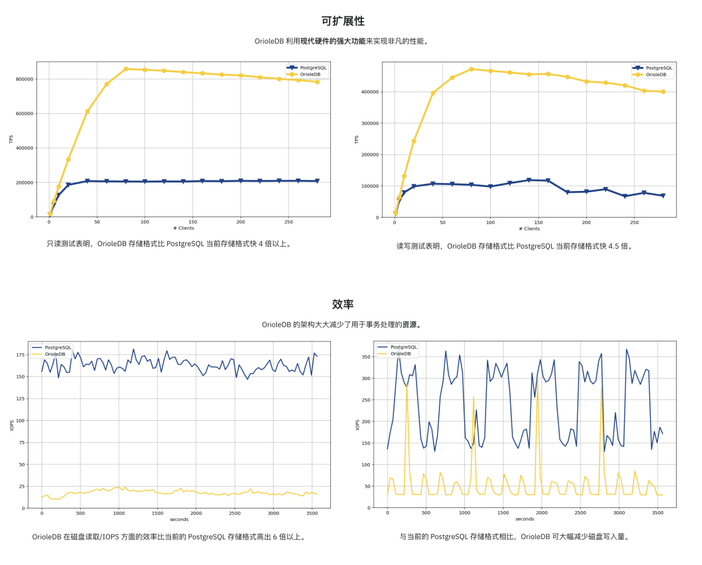

OrioleDB, which sounds interesting - though "Oriole" means a type of bird (黄鹂 in Chinese), so it should actually be translated as "Oriole Database" rather than "Cookie Database" or "Bird Database". The name doesn't matter much; what's important is that this PG storage engine extension + kernel fork is genuinely interesting and is almost ready for official release.

As the successor to zheap, I've been following OrioleDB for a long time. It has three main highlights: performance, operations, and cloud-native capabilities. So today I'll briefly introduce this emerging PG kernel and some recent work I've done that allows users to run it directly.

------

## Ultimate Performance, 4x Throughput

While hardware performance has become severely excessive for OLTP databases in most scenarios today, cases where single-business, single-machine **write throughput** becomes a bottleneck are not uncommon - this is the main reason people do "database sharding."

[OrioleDB](https://www.orioledb.com/) aims to solve this problem. According to their homepage claims, their read/write throughput can reach four times that of PostgreSQL. Honestly, this is quite an impressive figure — **40% performance improvement isn't enough reason to use a new storage engine, but 400% certainly can be a good reason**.

[](https://www.orioledb.com/)

Moreover, OrioleDB claims to significantly reduce resource consumption in OLTP scenarios and significantly lower disk IOPS read/write usage.

Of course, there are some key optimizations compared to PG heap tables, such as removing FS Cache, directly linking memory pages to storage pages, lockless access to memory pages, plus using UNDO logs/rollback segments to implement MVCC instead of PG's REDO, and easily parallelizable row-level WAL.

Honestly, I haven't tested the performance myself yet. But it sounds very tempting. I'll find a server to test it if I have time recently.

------

## Eliminate Pain Points, Simplify Operations

PostgreSQL's most "notorious" problem is XID Wraparound, and another "annoying" issue is table bloat. Both problems stem from PostgreSQL's MVCC design.

PostgreSQL's default storage engine was designed with an "infinite time travel" concept, using an append-only MVCC design — DELETE is mark-delete, and UPDATE is mark-delete plus creating a new version.

While this design brings some benefits, such as reads and writes not blocking each other, transactions of any size being fine and instantly rollbackable, and not generating massive replication delays, it does bring additional headaches to PostgreSQL users from another perspective — despite modern hardware and automatic garbage collection, a high-standard PostgreSQL database service still needs to occasionally worry about bloat and garbage collection issues.

OrioleDB aims to solve this problem through a new storage engine — roughly speaking, it uses a storage engine solution similar to Oracle/MySQL while inheriting the pros and cons of O/M. For example, because it uses new MVCC practices, OrioleDB storage engine tables no longer have concepts of bloat and XID wraparound.

Of course, there's no free lunch. This design naturally inherits the disadvantages of such designs, like large transaction problems, slow rollback issues, and analytical performance problems. But its advantage is optimizing performance for the single scenario of massive OLTP CRUD to the extreme.

Most importantly, this is a PG extension, an optional storage engine, not mutually exclusive with original PG heap tables. Using OrioleDB doesn't prevent you from continuing to use PG's native storage. This way, you can make optimal trade-offs based on specific scenarios, letting tables that need ultimate OLTP performance and reliability reach their maximum potential.

```sql
-- Enable OrioleDB extension (Pigsty already provides this)
CREATE EXTENSION orioledb;

CREATE TABLE blog_post
(
  id int8 NOT NULL,
  title text NOT NULL,
  body text NOT NULL,
  PRIMARY KEY(id)
) USING orioledb; -- Use OrioleDB storage engine
```

> Using OrioleDB is very easy - just add the [`USING`](https://www.orioledb.com/docs) keyword when creating tables.

Currently, OrioleDB is a storage engine PG extension plugin. However, because some storage engine API patches needed haven't entered the PG mainline yet, it currently requires a patched PG kernel to run. If things go smoothly, when these patches are merged into the mainline in PostgreSQL 18, a modified kernel won't be needed anymore.

| Name | Link                                                              | Version                                                                                      |               |
|------|-------------------------------------------------------------------|----------------------------------------------------------------------------------------------|---------------|
| ✅    | Add missing inequality searches to rbtree                         | [Link](https://github.com/postgres/postgres/commit/e57519a4637a8d88ae993ac1273d2b59d03a0f75) | PostgreSQL 16 |
| ✅    | Document the ability to specify TableAM for pgbench               | [Link](https://github.com/postgres/postgres/commit/f77ff083350eb5a2625a4dbfca61d15b66c4918b) | PostgreSQL 16 |
| ✅    | Remove Tuplesortstate.copytup function                            | [Link](https://github.com/postgres/postgres/commit/d47da3162b4d77c888c895dd36e4ef9cb92fcf19) | PostgreSQL 16 |
| ✅    | Add new Tuplesortstate.removeabbrev function                      | [Link](https://github.com/postgres/postgres/commit/cadfdd1edff103d696bbfcdd126c2dee516aed9b) | PostgreSQL 16 |
| ✅    | Put abbreviation logic into puttuple_common()                     | [Link](https://github.com/postgres/postgres/commit/033dd02db2248ed792332b950431ced4771b8304) | PostgreSQL 16 |
| ✅    | Move memory management away from writetup() and tuplesort_put*()  | [Link](https://github.com/postgres/postgres/commit/097366c45f5dfe142eb232dc6d348ca0705a63a9) | PostgreSQL 16 |
| ✅    | Split TuplesortPublic from Tuplesortstate                         | [Link](https://github.com/postgres/postgres/commit/ec92fe98356a8a36427fe9ef52873b50fe17852e) | PostgreSQL 16 |
| ✅    | Split tuplesortvariants.c from tuplesort.c                        | [Link](https://github.com/postgres/postgres/commit/d0b193c0fad13cf35122b0d3dc805c76e323e8bf) | PostgreSQL 16 |
| ✅    | Fix typo in comment for writetuple() function                     | [Link](https://github.com/postgres/postgres/commit/924954c670355f2a0ca1dd4173574a28fc0eedec) | PostgreSQL 16 |
| ✅    | Support for custom slots in the custom executor nodes             | [Link](https://github.com/postgres/postgres/commit/cee120951427fe39a54ab800abfa2834d85b8771) | PostgreSQL 16 |
| ✉️   | Allow table AM to store complex data structures in rd_amcache     | [Link](https://commitfest.postgresql.org/48/4958/)                                           | PostgreSQL 18 |
| ✉️   | Allow table AM tuple_insert() method to return the different slot | [Link](https://commitfest.postgresql.org/48/4958/)                                           | PostgreSQL 18 |
| ✉️   | Add TupleTableSlotOps.is_current_xact_tuple() method              | [Link](https://commitfest.postgresql.org/48/4958/)                                           | PostgreSQL 18 |
| ✉️   | Allow locking updated tuples in tuple_update() and tuple_delete() | [Link](https://commitfest.postgresql.org/48/4958/)                                           | PostgreSQL 18 |
| ✉️   | Add EvalPlanQual delete returning isolation test                  | [Link](https://commitfest.postgresql.org/48/4958/)                                           | PostgreSQL 18 |
| ✉️   | Generalize relation analyze in table AM interface                 | [Link](https://commitfest.postgresql.org/48/4958/)                                           | PostgreSQL 18 |
| ✉️   | Custom reloptions for table AM                                    | [Link](https://commitfest.postgresql.org/48/4958/)                                           | PostgreSQL 18 |
| ✉️   | Let table AM insertion methods control index insertion            | [Link](https://commitfest.postgresql.org/48/4958/)                                           | PostgreSQL 18 |

I've created patched PG `oriolepg_17` and extension plugin `orioledb_17` on EL, and provided a ready-to-use configuration template for one-click OrioleDB testing.

------

## Cloud-Native Storage

The term "cloud-native" has been overused - nobody knows exactly what it means anymore. But for databases, cloud-native usually means — **putting data on object storage**.

OrioleDB recently changed its slogan from "high-performance OLTP storage engine" to "cloud-native storage engine," which is somewhat of a pivot. I can understand the reasoning behind this — Supabase acquired OrioleDB, and the needs of the financial backer always come first.

[](https://supabase.com/blog/supabase-acquires-oriole)

> [Oriole joins Supabase](https://supabase.com/blog/supabase-acquires-oriole)

As a "cloud database service provider," putting users' cold data on ["cheap" object storage](/cloud/s3/) instead of [expensive "EBS" cloud block storage](/cloud/ebs/) is obviously very profitable. Plus this makes databases stateless "cattle" that can be destroyed, created, and scaled at will in K8S. So I completely understand their motivation.

So when OrioleDB not only provides a new storage engine but also supports putting data on object storage, I'm quite happy. PG over S3 projects aren't new, but this is the first one that's mature enough, doesn't deviate from mainline, and is open source.


> [OrioleDB Docs: Decoupled storage and compute](https://www.orioledb.com/docs/usage/decoupled-storage)

------

## So, I Want to Try It, How Do I Set It Up?

Of course, OrioleDB sounds very promising - it solves several key PG problems, is (future) compatible with PG mainline, is open source and free, has financial backing for continued maintenance, and founder Alexander Korotkov has significant contributions and reputation in the PG developer community.

But obviously, OrioleDB isn't "production ready" yet. I've been watching it since it released its first Alpha1 version three years ago, and it's only at Beta10 now - each release makes me numb. But recently I've keenly noticed it's entered Supabase's postgres image mainline, which means it's not far from official release.

So when OrioleDB released its latest beta10 on April 1st, I decided to include it. Having just finished OpenHalo's RPM packages and already packaged a MySQL-compatible PG kernel, why not add another pair of chopsticks? So I created patched PG kernel oriolepg_17 and extension plugin orioledb_17 RPM packages, available on EL8/EL9, x86/ARM64.

More importantly, I've added [native support for OrioleDB](https://doc.pgsty.com/pgsql/kernel/orioledb/) in Pigsty, which means OrioleDB can also enjoy the complete synergy of PG ecosystem components — you can use Patroni for HA, pgBackRest for backups, pg_exporter for monitoring, pgbouncer for connection pooling, while Pigsty strings all these together into a production-grade RDS service that can be launched with one click:

During Qingming Festival, I just released Pigsty [**v3.4.1**](https://doc.pgsty.com/releases/note#v340), which has built-in support for [OrioleDB](https://doc.pgsty.com/pgsql/kernel/orioledb/) and [**OpenHalo**](https://doc.pgsty.com/pgsql/kernel/openhalo/) kernels. Setting up an OrioleDB kernel isn't much different from setting up a regular PostgreSQL database cluster:

```yaml
all:
  children:
    pg-orio:
      vars:
        pg_databases:
        - {name: meta ,extensions: [orioledb]}
  vars:
    pg_mode: oriole
    pg_version: 17
    pg_packages: [ orioledb, pgsql-common  ]
    pg_libs: 'orioledb.so, pg_stat_statements, auto_explain'
    repo_extra_packages: [ orioledb ]
```

------

## There Are Other Kernel Tricks Too

Of course, supported PG branch kernels aren't limited to just OrioleDB. You can also use:


Additionally, my friend Yurii, founder of Omnigres, is working on adding ETCD protocol support to PostgreSQL. In the not-too-distant future, you'll probably be able to use PG as a better-performing/more reliable etcd for Kubernetes/Patroni.


Most importantly, all these capabilities are open source and already available out-of-the-box for free in Pigsty. So if you want to experience OrioleDB, why not find a server to try it out? One-click installation, ready in 10 minutes. See if it's really as awesome as they claim.