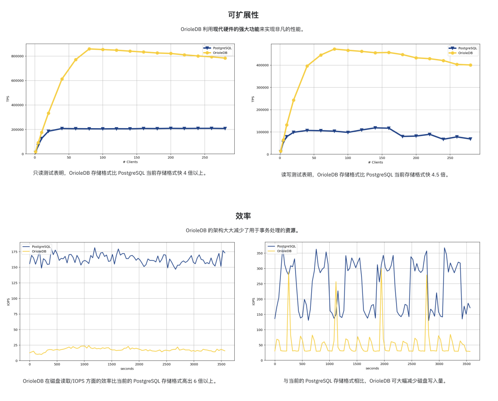
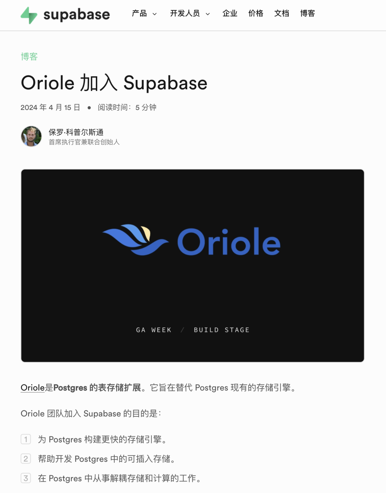
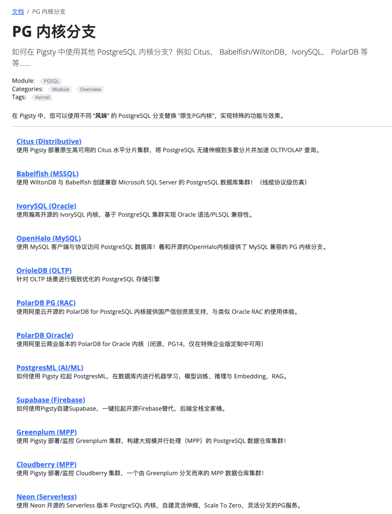
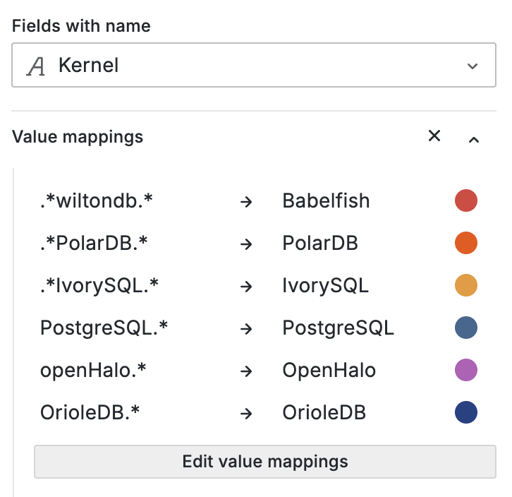

OrioleDB 奥利奥数据库，这名字听着很有趣，不过 Oriole 是黄鹂的意思，所以其实中文译名应该是 “黄鹂数据库”。 叫饼干DB还是小鸟DB都不重要，重要的是这个 PG 存储引擎扩展 + 内核分支确实很有趣，而且基本上快要正式发布了。

作为 zheap 的后继，我关注 OrioleDB 已经很久了，它的主要亮点有三个：性能，运维，云原生。 那么今天简单介绍一下这个 PG 内核新秀，以及最近我做的一些工作，可以让用户直接把它跑起来。

------

## 极致性能，四倍吞吐

虽然说在当下对于 OLTP 数据库来说，在绝大多数场景下，硬件性能已经严重过剩，不过单一业务单机 **写入吞吐量** 成为瓶颈的情况也并不算罕见，这也是大家去做 “分库” 的主要原因。

[OrioleDB](https://www.orioledb.com/) 旨在解决这个问题，根据它们官网首页的宣称，他们的读 / 写吞吐可以达到 PostgreSQL 的四倍，老实说这是一个相当惊人的数字 —— **40% 的性能提升不足以成为使用一个新存储引擎的理由，但 400% 确实可以成为一个不错的理由了**。

[](https://www.orioledb.com/)

而且，OrioleDB 还声称显著减少了 OLTP 场景下的资源消耗，显著降低磁盘的 IOPS 读写使用率。

当然这里有一些相对于 PG 堆表的关键优化，比如去掉了 FS Cache，内存页面直接链接到存储页面，内存页面可以无锁访问，另外使用 UNDO 日志/回滚段来实现 MVCC 而不是 PG 的 REDO，还有易于并行化的行级 WAL。

老实说我还没有自己测过性能。但听上去很有诱惑，最近要是有空我会找台服务器试一试。

------

## 消除顽疾，简化运维

PostgreSQL 中最 “臭名昭著” 的问题莫过于 XID Wraparound，另一个让人 “心烦” 的问题则是表膨胀，而这两个问题都源于 PostgreSQL 的 MVCC 设计。

PostgreSQL 的默认存储引擎在设计的时候，想要实现一个 “无限时间旅行” 的概念，因此使用了一个追加写入的 MVCC 设计 —— DELETE 是标记删除，而 UPDATE 是标记删除并创建一个新版本。

这样的设计虽然带来了一些好处，比如读写相互不阻塞，事务多大都无所谓并可以瞬间回滚，且不会产生海量复制延迟，但也确实在另一个角度给 PostgreSQL 用户带来了额外的烦恼 —— 尽管在现代硬件上，尽管已经有了自动垃圾回收，但一套高标准的 PostgreSQL 数据库服务仍然要不时操心膨胀与垃圾回收的问题。

OrioleDB 旨在通过一款新的存储引擎解决这个问题 —— 可以粗略理解为，它使用类似 Oracle / MySQL 的存储引擎方案，同时继承了 O/M 的优缺点。比如，因为使用了新的 MVCC 实践，OrioleDB 存储引擎的表不会再有膨胀与 XID 回卷的概念了。

当然，有得必有失，这样设计当然也会继承这样设计的缺点，比如大事务问题，回滚慢问题，分析性能问题。但它的好处是可以把海量 OLTP CRUD 这个单一场景的性能做到极致。

而且最重要的是，这是一个 PG 的扩展，一个可选的存储引擎，和原本的 PG 堆表并不是互斥的选项，使用 OrioleDB 的同时，并不妨碍你同时继续使用 PG 原生的存储。这样你就可以根据具体的场景进行最佳利弊权衡，让那些需要极致 OLTP 性能与可靠性的表发挥其最大潜能。

```sql
-- 启用 OrioleDB 扩展（Pigsty 已经提供）
CREATE EXTENSION orioledb;

CREATE TABLE blog_post
(
  id int8 NOT NULL,
  title text NOT NULL,
  body text NOT NULL,
  PRIMARY KEY(id)
) USING orioledb; -- 使用 OrioleDB 存储引擎
```

> 使用 OrioleDB 非常容易，建表带 [`USING`](https://www.orioledb.com/docs) 关键词就可以了。

目前 OrioleDB 是一个存储引擎 PG 扩展插件，不过因为一些存储引擎需要的 API 补丁还没有进入 PG 主干，所以目前需要一个打过补丁的 PG 内核才可以运行，如果顺利，在 PostgreSQL 18 这些补丁合入主干就不再需要魔改内核了。

| Name | Link                                                              | Version                                                                                      |               |
|------|-------------------------------------------------------------------|----------------------------------------------------------------------------------------------|---------------|
| ✅    | Add missing inequality searches to rbtree                         | [Link](https://github.com/postgres/postgres/commit/e57519a4637a8d88ae993ac1273d2b59d03a0f75) | PostgreSQL 16 |
| ✅    | Document the ability to specify TableAM for pgbench               | [Link](https://github.com/postgres/postgres/commit/f77ff083350eb5a2625a4dbfca61d15b66c4918b) | PostgreSQL 16 |
| ✅    | Remove Tuplesortstate.copytup function                            | [Link](https://github.com/postgres/postgres/commit/d47da3162b4d77c888c895dd36e4ef9cb92fcf19) | PostgreSQL 16 |
| ✅    | Add new Tuplesortstate.removeabbrev function                      | [Link](https://github.com/postgres/postgres/commit/cadfdd1edff103d696bbfcdd126c2dee516aed9b) | PostgreSQL 16 |
| ✅    | Put abbreviation logic into puttuple_common()                     | [Link](https://github.com/postgres/postgres/commit/033dd02db2248ed792332b950431ced4771b8304) | PostgreSQL 16 |
| ✅    | Move memory management away from writetup() and tuplesort_put*()  | [Link](https://github.com/postgres/postgres/commit/097366c45f5dfe142eb232dc6d348ca0705a63a9) | PostgreSQL 16 |
| ✅    | Split TuplesortPublic from Tuplesortstate                         | [Link](https://github.com/postgres/postgres/commit/ec92fe98356a8a36427fe9ef52873b50fe17852e) | PostgreSQL 16 |
| ✅    | Split tuplesortvariants.c from tuplesort.c                        | [Link](https://github.com/postgres/postgres/commit/d0b193c0fad13cf35122b0d3dc805c76e323e8bf) | PostgreSQL 16 |
| ✅    | Fix typo in comment for writetuple() function                     | [Link](https://github.com/postgres/postgres/commit/924954c670355f2a0ca1dd4173574a28fc0eedec) | PostgreSQL 16 |
| ✅    | Support for custom slots in the custom executor nodes             | [Link](https://github.com/postgres/postgres/commit/cee120951427fe39a54ab800abfa2834d85b8771) | PostgreSQL 16 |
| ✉️   | Allow table AM to store complex data structures in rd_amcache     | [Link](https://commitfest.postgresql.org/48/4958/)                                           | PostgreSQL 18 |
| ✉️   | Allow table AM tuple_insert() method to return the different slot | [Link](https://commitfest.postgresql.org/48/4958/)                                           | PostgreSQL 18 |
| ✉️   | Add TupleTableSlotOps.is_current_xact_tuple() method              | [Link](https://commitfest.postgresql.org/48/4958/)                                           | PostgreSQL 18 |
| ✉️   | Allow locking updated tuples in tuple_update() and tuple_delete() | [Link](https://commitfest.postgresql.org/48/4958/)                                           | PostgreSQL 18 |
| ✉️   | Add EvalPlanQual delete returning isolation test                  | [Link](https://commitfest.postgresql.org/48/4958/)                                           | PostgreSQL 18 |
| ✉️   | Generalize relation analyze in table AM interface                 | [Link](https://commitfest.postgresql.org/48/4958/)                                           | PostgreSQL 18 |
| ✉️   | Custom reloptions for table AM                                    | [Link](https://commitfest.postgresql.org/48/4958/)                                           | PostgreSQL 18 |
| ✉️   | Let table AM insertion methods control index insertion            | [Link](https://commitfest.postgresql.org/48/4958/)                                           | PostgreSQL 18 |

我在 EL 上做好了 `oriolepg_17` 的补丁版 PG，以及 `orioledb_17` 的扩展插件，并且提供了一个开箱即用的配置模板，可以一键拉起 OrioleDB 尝鲜。

------

## 云原生存储

“云原生”这个词已经被用滥了，没有人具体知道它到底在说啥。但对于数据库来说，云原生通常意味着 —— **把数据放在对象存储上**。

OrioleDB 最近把自己的 Slogan 从 “高性能 OLTP 存储引擎” 修改为 “云原生存储引擎”，算是某种程度上的 Pivoting。我能理解这背后的原因 —— Supabase 把 OrioleDB 收购了，金主爸爸的需求总是第一位的。

[](https://supabase.com/blog/supabase-acquires-oriole)

> [Oriole joins Supabase](https://supabase.com/blog/supabase-acquires-oriole)

作为一个 “云数据库服务商”，把用户的冷数据丢到 [“廉价” 的对象存储](/cloud/s3/) 而不是 [天价的 “EBS” 云盘块存储](/cloud/ebs/)，显然是十分有利可图的一件事，而且这样可以让数据库变为无状态的“牲畜”，放在 K8S里随意销毁创建扩缩容。因此我完全能理解他们的动机。

所以当 OrioleDB 除了提供一种新的存储引擎之外，甚至还支持把数据放到对象存储上时，我是蛮高兴的。PG over s3 的项目并不是没有，但一个足够成熟，不脱离主干，还开源的这确实是第一个。


> [OrioleDB Docs: Decoupled storage and compute](https://www.orioledb.com/docs/usage/decoupled-storage)


------

## 所以，我想试试，咋整？

当然，OrioleDB 听上去非常美好，解决了 PG 的几个关键问题，（未来）兼容PG主干，还开源免费，也有金主投钱持续维护，创始人 Alexander Korotkov 也在 PG 开发者社区中有显著的贡献与声望。

但显然，现在 OrioleDB 还没有 “生产 Ready” ，我从三年前看着它发布第一个 Alpha1 版本，到现在也才是 Beta10，每次发布看的我都快麻了。但是最近我敏锐的注意到，它已经进入到 Supabase 的 postgres 镜像主干了，这意味着它离正式发布不远了。

所以呢，在 4月1 号 OrioleDB 发布最新的 beta10 的时候，我准备把它收录进来。正好刚做完 OpenHalo 的 RPM 包，都已经打包一个 MySQL 兼容的 PG 内核了，也不差再加双筷子，我就制作了补丁版 PG 内核 oriolepg_17 ，以及扩展插件 orioledb_17 的 RPM 包，在 EL8 / EL9 ，x86 / ARM64 上可用。

更重要的是，我在 Pigsty 中添加了 [对 OrioleDB 的原生支持](https://doc.pgsty.com/pgsql/kernel/orioledb/)，这意味着 OrioleDB 也可以享受到 PG 生态组件的完整合力 —— 你可以使用 Patroni 做 HA，使用 pgBackRest 做备份，pg_exporter 做监控，pgbouncer 做链接池，而 Pigsty 替你将所有这些串成可以一键拉起的生产级 RDS 服务：

在清明节，我刚发布了 Pigsty [**v3.4.1**](https://doc.pgsty.com/releases/note#v340) ，已经内置了对 [OrioleDB](https://doc.pgsty.com/pgsql/kernel/orioledb/) 和 [**OpenHalo**](https://doc.pgsty.com/pgsql/kernel/openhalo/) 内核的支持，想要拉 OrioleDB 内核，和拉起普通 PostgreSQL 数据库集群也并没有多少区别：

```yaml
all:
  children:
    pg-orio:
      vars:
        pg_databases:
        - {name: meta ,extensions: [orioledb]}
  vars:
    pg_mode: oriole
    pg_version: 17
    pg_packages: [ orioledb, pgsql-common  ]
    pg_libs: 'orioledb.so, pg_stat_statements, auto_explain'
    repo_extra_packages: [ orioledb ]
```

------

## 还有其他内核花活

当然，这里支持的 PG 分支内核可不止 OrioleDB 一个，你还可以使用：



 另外，我的朋友 Yurii ，Omnigres 的创始人正在给 PostgreSQL 套上 ETCD 协议支持， 估计不远的将来，你还可以把 PG 当成一个性能/可靠性更好的 etcd 给 Kubernetes / Patroni 去使用。



最重要的是，所有这些能力都是开源的，而且已经全部在 Pigsty 中免费的开箱即用了。 所以，如果你想体验一把 OrioleDB，不妨找台服务器试试，一键安装，10分钟搞定。 看看是不是真像他们说的那么牛逼。
