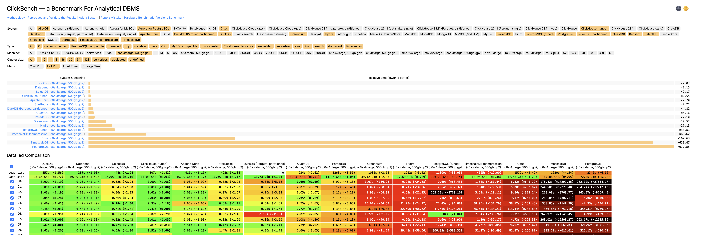

> [Original WeChat Article Link](https://mp.weixin.qq.com/s/bx2dRxlrtLcM6AD2qsplQQ)

---------------

## New PostgreSQL Ecosystem Player: ParadeDB

YC S23 invested in a new project called [ParadeDB](https://www.paradedb.com/), which is extremely interesting. Their slogan is "Postgres for Search & Analytics — Modern Elasticsearch Alternative built on Postgres". It's PostgreSQL for search and analytics, aiming to be an Elasticsearch alternative.

PostgreSQL's ecosystem is indeed becoming increasingly prosperous. Among PG-based extensions and derivatives, we already have:
- MongoDB open-source alternative based on PG — FerretDB
- SQL Server open-source alternative — Babelfish  
- Firebase open-source alternative — Supabase
- AirTable open-source alternative — NocoDB
- And now an ElasticSearch open-source alternative — ParadeDB

ParadeDB actually consists of three PostgreSQL extensions: `pg_bm25`, `pg_analytics`, and `pg_sparse`. All three extensions can be used independently. I've already packaged these extensions (v0.5.6) and will include them by default in Pigsty's next release, allowing users to use them out of the box.

I've translated ParadeDB's official website introduction and four blog articles to introduce this new star in the PostgreSQL ecosystem. Today's article is the first one — an overview.

---------------

## ParadeDB

We're proud to introduce ParadeDB: a PostgreSQL database optimized for search scenarios. **ParadeDB** is the first Postgres database built to be an Elasticsearch alternative, designed for lightning-fast full-text, semantic, and hybrid search on PostgreSQL tables.

### What Problems Does ParadeDB Solve?

For many organizations, search remains an unsolved problem — despite the existence of giants like Elasticsearch, most developers who've worked with it know how painful it is to run, tune, and manage Elasticsearch. While there are other search engine services available, integrating these external services with existing databases introduces complex challenges and costs related to index rebuilding and data replication.

Developers seeking unified authoritative data sources and search engines have turned to Postgres. PG already provides basic full-text search capabilities through `tsvector` and vector semantic search capabilities through `pgvector`. These tools work well for simple use cases and medium-sized datasets, but fall short when tables grow large or queries become complex:

1. Sorting and keyword search on large tables is very slow
2. No BM25 scoring support
3. No hybrid search combining vector search with full-text search techniques
4. No real-time search — data must be manually re-indexed or re-embedded
5. Limited support for complex queries like faceting or relevance tuning

So far, we've witnessed many engineering teams reluctantly layer Elasticsearch on top of Postgres, only to eventually abandon it because it's too bloated, expensive, or complex. We wondered: what if Postgres itself had ElasticSearch-level search capabilities? Then developers wouldn't face this dilemma — use PostgreSQL alone with limited search capabilities, or maintain two separate services for data source and search engine?

### Who Is ParadeDB For?

Elasticsearch has broad application scenarios, but we don't attempt to cover all scenarios at once — at least not in the current stage. We prefer to focus on core scenarios — specifically serving users who want to search on PostgreSQL. ParadeDB is ideal for you if:

- You want to use a single Postgres as your source of truth, avoiding the hassle of copying data between multiple services
- You want full-text search on massive documents stored in Postgres without compromising performance and scalability
- You want to combine ANN/similarity search with full-text search for more precise semantic matching

### ParadeDB Product Introduction

ParadeDB is a fully managed Postgres database with indexing and search capabilities for Postgres tables not found in any other Postgres provider:

| Feature | Description |
|---------|-------------|
| BM25 Full-Text Search | Full-text search supporting boolean, fuzzy, boost, and keyword queries. Search results are scored using the BM25 algorithm. |
| Faceted Search | Postgres columns can be defined as facets for easy bucketing and metric collection. |
| Hybrid Search | Search results can be scored considering both semantic relevance (vector search) and full-text relevance (BM25). |
| Distributed Search | Tables can be sharded for parallel query acceleration. |
| Generative Search | Postgres columns can be fed into large language models (LLMs) for automatic summarization, classification, or text generation. |
| Real-time Search | Text indexes and vector columns are automatically kept in sync with underlying data. |

Unlike managed services like AWS RDS, ParadeDB is a PostgreSQL extension plugin that requires no setup, integrates with the entire PG ecosystem, and is fully customizable. ParadeDB is open source (AGPLv3) and provides a simple Docker Compose template for developers who need self-built/customized solutions.

### How ParadeDB Is Built

At its core, ParadeDB is a standard Postgres database with custom extensions written in Rust that introduce enhanced search capabilities.

ParadeDB's search engine is built on Tantivy, an open-source Rust search library inspired by Apache Lucene. Its indexes are stored natively in PG as native PG indexes, avoiding cumbersome data replication/ETL work while ensuring transactional ACID properties.

ParadeDB provides a new extension for the Postgres ecosystem: `pg_bm25`. `pg_bm25` implements Rust-based full-text search in Postgres using the BM25 scoring algorithm. ParadeDB comes pre-installed with this extension plugin.

### What's Next?

ParadeDB's managed cloud version is currently in Private Beta. Our goal is to launch a self-service cloud platform in early 2024. If you want to access the Private Beta version in the meantime, please [join our waiting list](https://paradedb.typeform.com/to/jHkLmIzx?typeform-source=www.paradedb.com).

Our core team's focus is developing ParadeDB's open-source version, which will be released in winter 2023.

We build in public and are excited to share ParadeDB with the entire community. Please follow us — in future blog posts, we'll dive deeper into the interesting technical challenges behind ParadeDB.