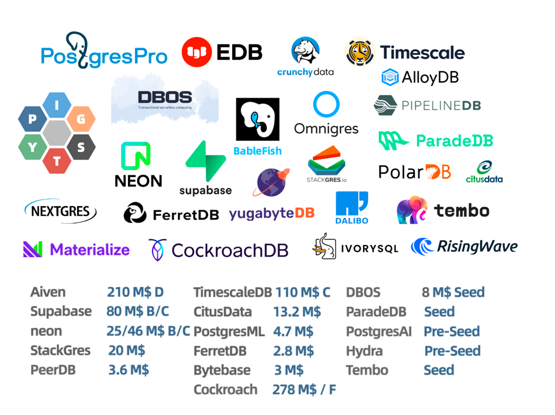

The annual PostgreSQL major version release is here! What surprises does PostgreSQL 17 bring us this time?

In this major version release announcement, the PostgreSQL global community has finally come clean — **Sorry, no more pretending** — "**PostgreSQL is now the world's most advanced open-source database and has become the preferred open-source database for organizations of all sizes**." While not naming names explicitly, the official statement has come infinitely close to declaring "overthrowing top commercial databases" (Oracle).

In my early-year article "[PostgreSQL is Eating the Database World](/pg/pg-eat-db-world)," I argued that **extensibility** is PostgreSQL's unique core advantage.
I'm delighted to see that this point became the focus and consensus of the PostgreSQL community in just six months, fully reflected in [PGCon.Dev 2024](/pg/pgcondev-2024/) and this PostgreSQL 17 release.

Regarding new features, I previously covered them in "[PostgreSQL 17 Beta1 Released! The Toothpaste Tube Burst!](/pg/pg-17-beta1)," so I won't repeat them here.
This major version has many new features, but what impressed me most is that PostgreSQL managed to double write throughput again on top of [already formidable performance](/pg/pg-performence) — **simply and powerfully impressive**.

But beyond specific features, I believe the biggest change in the PostgreSQL community occurred in **mindset and spirit** — in this release announcement, PostgreSQL removed the qualifier "relational" from its original slogan "world's most advanced open-source relational database," directly becoming "world's most advanced open-source database."
And in the final "About PostgreSQL" section, it states: "PostgreSQL's feature set, advanced capabilities, extensibility, security, and stability now match or exceed top commercial databases." So I think the "open-source" qualifier might soon be dropped as well, becoming "**the world's most advanced database**."

This PostgreSQL beast has awakened — it's no longer the peaceful, non-competitive entity it once was. Its spirit has completely transformed into an aggressive, progressive stance — it's psychologically prepared and mobilized to take over and conquer the entire database world.
Countless capital has also flooded into the PostgreSQL ecosystem, with [PostgreSQL startups taking almost all the new money in database funding](https://mp.weixin.qq.com/s/fi_p3tTZTnwP5XDJrkVbQw). PostgreSQL is destined to become the "Linux kernel" that unifies the database world, and DBMS disputes may internalize into PostgreSQL distribution wars in the future. Let's wait and see.

----------

## Original: PostgreSQL 17 Release Announcement

The PostgreSQL [Global Development Group](https://www.postgresql.org/) today officially (2024-09-26) announced the release of [PostgreSQL 17](https://www.postgresql.org/docs/17/release-17.html), the latest version of the world's most advanced open-source database.

> Note: Yes, the "relational" qualifier has been removed — it's now the world's most advanced open-source database

PostgreSQL 17 builds on decades of open-source development, continuously improving performance and scalability while adapting to emerging patterns of data access and storage.
This [`PostgreSQL`](https://www.postgresql.org/) release brings significant overall performance improvements, such as a complete overhaul of VACUUM memory management, storage access optimizations, high-concurrency workload improvements, bulk loading and export acceleration, and index query execution improvements.
PostgreSQL 17 features capabilities that benefit both new workloads and critical core systems, such as: the new SQL/JSON `JSON_TABLE` command improves developer experience; while logical replication improvements simplify management burden for high-availability architectures and major version upgrades.

PostgreSQL core team member Jonathan Katz stated: "PostgreSQL 17 demonstrates how the global open-source community collaborates to build and improve functionality, helping users at different stages of their database journey." "Whether it's improvements for large-scale database operations or new features based on excellent developer experience, PostgreSQL 17 will provide you with a better data management experience."

PostgreSQL is an innovative data management system known for reliability, robustness, and extensibility. Benefiting from over 25 years of open-source development by the global developer community, **it has become the preferred open-source relational database for organizations of all types**.

--------

## Comprehensive System Performance Improvements

PostgreSQL's [`vacuum`](https://www.postgresql.org/docs/17/routine-vacuuming.html) process is crucial for healthy system operation, but vacuum operations consume server instance resources. PostgreSQL 17 introduces a new vacuum internal memory structure that reduces memory consumption to 1/20th of the original. This not only improves vacuum speed but also reduces shared resource usage, freeing up more available resources for user workloads.

PostgreSQL 17 also continues optimizing performance at the I/O layer. Due to improvements in write-ahead log ([`WAL`](https://www.postgresql.org/docs/17/wal-intro.html)) handling, high-concurrency workloads can see **write throughput improvements of up to two times**. Additionally, the new streaming I/O interface accelerates sequential scans (reading all data in a table) and [`ANALYZE`](https://www.postgresql.org/docs/17/sql-analyze.html) updating planner statistics.

PostgreSQL 17 also improves query execution performance. For `IN` clause queries using [B-tree](https://www.postgresql.org/docs/17/indexes-types.html#INDEXES-TYPES-BTREE) indexes (PostgreSQL's default index method), performance has improved. Additionally, [BRIN](https://www.postgresql.org/docs/17/brin.html) indexes now support parallel construction.
PostgreSQL 17 made several query planning improvements, including optimizations for `NOT NULL` constraints and improved handling of CTEs ([`WITH`](https://www.postgresql.org/docs/17/queries-with.html) queries). In this release, SIMD (Single Instruction Multiple Data) acceleration is more widely applied, such as using `AVX-512` instructions in the [`bit_count`](https://www.postgresql.org/docs/17/functions-bitstring.html) function.

--------

## Further Enhanced Developer Experience

PostgreSQL was [the first relational database to add JSON support](https://www.postgresql.org/about/news/postgresql-92-released-1415/) (2012), and PostgreSQL 17 further completes the SQL/JSON standard implementation. The [`JSON_TABLE`](https://www.postgresql.org/docs/17/functions-json.html#FUNCTIONS-SQLJSON-TABLE) feature is now available in PostgreSQL 17 — allowing developers to convert JSON data to standard PostgreSQL tables.
PostgreSQL 17 now supports SQL/JSON standard [constructor functions](https://www.postgresql.org/docs/17/functions-json.html#FUNCTIONS-JSON-CREATION-TABLE) (`JSON`, `JSON_SCALAR`, `JSON_SERIALIZE`) and [query functions](https://www.postgresql.org/docs/17/functions-json.html#SQLJSON-QUERY-FUNCTIONS) (`JSON_EXISTS`, `JSON_QUERY`, `JSON_VALUE`), providing developers with more ways to interact with JSON data.
This release adds more [`jsonpath` expressions](https://www.postgresql.org/docs/17/functions-json.html#FUNCTIONS-SQLJSON-PATH-OPERATORS), focusing on converting JSON data to native PostgreSQL data types, including numeric, boolean, string, and date/time types.

PostgreSQL 17 adds more functionality to [`MERGE`](https://www.postgresql.org/docs/17/sql-merge.html) (conditional UPDATE), including the `RETURNING` clause and the ability to update [views](https://www.postgresql.org/docs/17/sql-createview.html).
Additionally, PostgreSQL 17 strengthens bulk loading and export capabilities. For example, when using the [`COPY`](https://www.postgresql.org/docs/17/sql-copy.html) command to export large amounts of data, performance improves by up to two times. When source and target encodings match, `COPY` performance also improves, and the `COPY` command includes a new `ON_ERROR` option that allows import to continue when insertion errors occur.

This release also expands management capabilities for partitioned data and data distributed across remote PostgreSQL instances. PostgreSQL 17 supports using identity columns and `EXCLUDE` constraints on [partitioned tables](https://www.postgresql.org/docs/17/ddl-partitioning.html).
The PostgreSQL foreign data wrapper ([`postgres_fdw`](https://www.postgresql.org/docs/17/postgres-fdw.html)) for executing queries on remote PostgreSQL instances can now push down `EXISTS` and `IN` subqueries to remote servers for more efficient processing.

PostgreSQL 17 also includes a built-in, platform-independent, immutable collation provider to ensure collation immutability and provides sorting semantics similar to the `C` collation but using `UTF-8` encoding instead of `SQL_ASCII`. Using this new collation provider ensures your text queries return the same sorting results regardless of where PostgreSQL runs.

--------

## Logical Replication Improvements for High Availability and Major Version Upgrades

In many use cases, [logical replication](https://www.postgresql.org/docs/17/logical-replication.html) is used for real-time data transmission.
However, before version 17, users wanting to perform major version upgrades had to first drop logical replication slots and needed to re-synchronize data to subscribers after upgrades.
Starting with PostgreSQL 17, users no longer need to drop logical replication slots first, thus simplifying the major version upgrade process when using logical replication.

PostgreSQL 17 now includes failover capabilities for logical replication, making it more reliable when deployed in high-availability environments.
Additionally, PostgreSQL 17 introduces the command-line tool [`pg_createsubscriber`](https://www.postgresql.org/docs/17/app-pgcreatesubscriber.html) for converting physical standby servers to new logical standby servers.

--------

## More Security and Operations Management Options

PostgreSQL 17 further expands user management capabilities throughout the database system lifecycle. PostgreSQL provides a new TLS option `sslnegotiation` that allows users to perform direct TLS handshakes when using [ALPN](https://en.wikipedia.org/wiki/Application-Layer_Protocol_Negotiation) (registered as `postgresql` in the ALPN directory).
PostgreSQL 17 also adds the [predefined role](https://www.postgresql.org/docs/17/predefined-roles.html) `pg_maintain`, granting regular users permission to perform maintenance operations.

PostgreSQL's built-in backup tool [`pg_basebackup`](https://www.postgresql.org/docs/17/app-pgbasebackup.html) now supports incremental backups and adds the command-line utility [`pg_combinebackup`](https://www.postgresql.org/docs/17/app-pgcombinebackup.html) for rebuilding full backups.
Additionally, `pg_dump` adds a new `--filter` option allowing you to select which objects to include when generating dump files.

PostgreSQL 17 also enhances monitoring and analysis capabilities. The [`EXPLAIN`](https://www.postgresql.org/docs/17/sql-explain.html) command now shows local block read/write I/O timing and includes two new options: `SERIALIZE` and `MEMORY`, which can show data conversion time for network transmission and memory usage.
PostgreSQL 17 now also reports [index VACUUM progress](https://www.postgresql.org/docs/17/progress-reporting.html#VACUUM-PROGRESS-REPORTING)
and adds the new system view [`pg_wait_events`](https://www.postgresql.org/docs/17/view-pg-wait-events.html), which when used with the `pg_stat_activity` view provides deeper insight into why active sessions are waiting.

--------

## Other Features

PostgreSQL 17 adds many other new features and improvements that may benefit your use cases. Please refer to the [release notes](https://www.postgresql.org/docs/17/release-17.html) for a complete list of new features and changes.

--------

## About PostgreSQL

PostgreSQL is the world's most advanced open-source database, with a global community of thousands of users, contributors, companies, and organizations. It originated at the University of California, Berkeley, with over 35 years of engineering and development history.
PostgreSQL continues to develop at an unparalleled pace: **PostgreSQL provides a mature feature set that not only matches top proprietary commercial database systems but exceeds them in advanced database functionality, extensibility, security, and stability.**

> Translator's note: Yes, they're talking about you, Oracle

--------

## About Pigsty

Incidentally, Pigsty v3.0.3, which closely follows PostgreSQL 17's release, now officially supports using the PostgreSQL 17 kernel. Welcome to try it out.

[**Pigsty**](https://pigsty.cc/en) is open-source, free, local-first, ready-to-use PostgreSQL RDS that allows users to locally deploy production-grade PostgreSQL cloud database services with one click, complete with 390 ready-to-use PostgreSQL extensions, self-healing high availability, top-tier monitoring systems, PITR backup and recovery, IaC command-line tools, and SOP management procedures.

--------

## Additional Reading References

Digoal has already analyzed many new features of PostgreSQL 17 in his blog, which is a great resource for further understanding PostgreSQL 17 features:

"[PostgreSQL 17 Officially Released, Should You Upgrade?](https://mp.weixin.qq.com/s/HSynUBf9b8Ecz3953XKL5g)"

Block-level incremental backup and recovery support:

- "PostgreSQL 17 preview - Built-in block-level physical incremental backup (INCREMENTAL backup/pg_combinebackup) functionality"
- "PostgreSQL 17 preview - Add new pg_walsummary tool"
- "PostgreSQL 17 preview - Add new function `pg_get_wal_summarizer_state()` to analyze WAL segment information in memory for aggregation into pg_wal/summaries"
- "PostgreSQL 17 preview - Incremental backup patch: Add the system identifier to backup manifests"

Logical replication failover and switchover support:

- "PostgreSQL 17 preview - pg_upgrade major version upgrade supports preserving full subscription state"
- "PostgreSQL 17 preview - Primary view `pg_replication_slots`.`conflict_reason` supports logical replication conflict reason tracking"
- "PostgreSQL 17 preview - Support logical replication slot failover to streaming replication standby nodes. `pg_create_logical_replication_slot(... failover = true|false ...)`"
- "PostgreSQL 17 preview - preparation for replicating unflushed WAL data"
- "PostgreSQL 17 preview - sync logical replication slot LSN, Failover & Switchover"
- "PostgreSQL 17 preview - Add a new slot sync worker to synchronize logical slots"
- "PostgreSQL 17 preview - Add GUC standby_slot_names, ensure these standbys have received and flushed all WAL corresponding to logical data sent by logical slots to downstream"
- "PostgreSQL 17 preview - pg_createsubscriber supports converting physical standby to logical standby"
- "PostgreSQL 17 preview - Track slot disconnection timestamp `pg_replication_slots.inactive_since`"

COPY error handling support:

- "PostgreSQL 17 preview - Add new COPY option SAVE_ERROR_TO (copy skip error rows)"
- "PostgreSQL 17 preview - pg_stat_progress_copy Add progress reporting of skipped tuples during COPY FROM"
- "PostgreSQL 17 preview - COPY LOG_VERBOSITY notice ERROR information"

Enhanced JSON type processing capabilities:

- "PostgreSQL 17 preview - Implement various jsonpath methods"
- "PostgreSQL 17 preview - JSON_TABLE: Add support for NESTED paths and columns"

Vacuum performance improvements:

- "PostgreSQL 17 preview - Add index vacuum progress printing"
- "PostgreSQL 17 preview - Optimize vacuuming of relations with no indexes to reduce WAL output"
- "PostgreSQL 17 preview - Remove some option combination restrictions for vacuumdb, clusterdb, reindexdb"
- "PostgreSQL 17 preview - Use TidStore data structure to store dead tupleids, improve vacuum efficiency, why PostgreSQL single table shouldn't exceed 890 million records?"
- "PostgreSQL 17 preview - Increase vacuum_buffer_usage_limit default value, reduce WAL flush caused by vacuum, improve vacuum speed"

Index performance optimization:

- "PostgreSQL 17 preview - Allow Incremental Sorts on GiST and SP-GiST indexes"
- "PostgreSQL 17 preview - btree index backward scan (order by desc scenario) optimization"
- "PostgreSQL 17 preview - Allow parallel CREATE INDEX for BRIN indexes"

High-concurrency lock contention optimization:

- "PostgreSQL 17 preview - Optimize WAL insert lock, improve high-concurrency write throughput performance"
- "PostgreSQL 17 preview - Reduce rate of walwriter wakeups due to async commits"
- "PostgreSQL 17 preview - WAL lock contention optimization - reading WAL buffer contents without a lock, Additional write barrier in AdvanceXLInsertBuffer()"

Performance optimization:

- "PostgreSQL 17 preview - Function parser stage optimization, function GUC into lists avoid parser"
- "PostgreSQL 17 preview - Remove snapshot too old feature, will introduce new implementation method"
- "PostgreSQL 17 preview - postgres_fdw supports semi-join pushdown (exists (...))"
- "PostgreSQL 17 preview - Separate unstable hashfunc, improve in-memory hash computation performance and algorithm freedom"
- "PostgreSQL 17 preview - Optimizer enhancement, group by supports Incremental Sort, GUC: enable_group_by_reordering"
- "PostgreSQL 17 preview - Introduce new smgr, optimize bulk loading"
- "PostgreSQL 17 preview - Add `--copy-file-range` option to `pg_upgrade`"
- "PostgreSQL 17 preview - Reduce partitioned table partitionwise join memory consumption"
- "PostgreSQL 17 preview - Use Merge Append to improve UNION performance"
- "PostgreSQL 17 preview - pg_restore `--transaction-size=N` supports encapsulating N objects as one transaction commit"

New GUC parameters:

- "PostgreSQL 17 preview - Add GUC: event_triggers for temporarily disabling event triggers"
- "PostgreSQL 17 preview - Allow ALTER SYSTEM to set unrecognized custom GUCs."
- "PostgreSQL 17 preview - XX000 internal error backtrace, add GUC backtrace_on_internal_error"
- "PostgreSQL 17 preview - allow_alter_system GUC controls whether `alter system` can modify `postgresql.auto.conf`"
- "PostgreSQL 17 preview - New GUC: or_to_any_transform_limit controls `OR to ANY` transformation"
- "PostgreSQL 17 preview - New GUC trace_connection_negotiation: track client SSLRequest or GSSENCRequest packet"

SQL syntax and function enhancements:

- "PostgreSQL 17 preview - plpgsql supports defining `%TYPE` `%ROWTYPE` array variable types"
- "PostgreSQL 17 preview - Support modifying generated column expressions `alter table ... ALTER COLUMN ... SET EXPRESSION AS (express)`"
- "PostgreSQL 17 preview - Support identity columns in partitioned tables"
- "PostgreSQL 17 preview - Simplify exclude constraint usage, add without overlaps option for primary key, unique constraints"
- "PostgreSQL 17 preview - Add RETURNING support to MERGE"
- "PostgreSQL 17 preview - Add UUID functions: extract timestamp from UUID values and function version for generating UUID values"
- "PostgreSQL 17 preview - New random function `random(min, max)` returning random numbers within a range"
- "PostgreSQL 17 preview - Add support for `MERGE ... WHEN NOT MATCHED BY SOURCE`"
- "PostgreSQL 17 preview - Use pg_basetype to get base type of domain types"
- "PostgreSQL 17 preview - Implement `ALTER TABLE ... MERGE|SPLIT PARTITION` ... command"

Enhanced management capabilities:

- "PostgreSQL 17 preview - Built-in support for login event trigger"
- "PostgreSQL 17 preview - Add tests for XID wraparound"
- "PostgreSQL 17 preview - pgbench tool adds meta syntax syncpipeline, `pgbench: Add \syncpipeline`"
- "PostgreSQL 17 preview - Introduce MAINTAIN permission and pg_maintain predefined role"
- "PostgreSQL 17 preview - New "builtin" collation provider"
- "PostgreSQL 17 preview - Support read-write consistency across instances through pg_wal_replay_wait() for read-write separation pools"
- "PostgreSQL 17 preview - transaction_timeout"

Internal statistics and system view enhancements:

- "PostgreSQL 17 preview - Add new parallel message type to progress reporting."
- "PostgreSQL 17 preview - Add system view pg_wait_events"
- "PostgreSQL 17 preview - Add JIT deform_counter"
- "PostgreSQL 17 preview - Add checkpoint delay wait event"
- "PostgreSQL 17 preview - Add `local_blk_{read|write}_time` I/O timing statistics for local blocks"
- "PostgreSQL 17 preview - Introduce pg_stat_checkpointer"
- "PostgreSQL 17 preview - improve range type pg_stats"
- "PostgreSQL 17 preview - Enhanced standby node checkpoint statistics"
- "PostgreSQL 17 preview - Add EXPLAIN (MEMORY) to report planner memory consumption"

Table access method interface enhancements:

- "PostgreSQL 17 preview - Add support for `DEFAULT` in `ALTER TABLE .. SET ACCESS METHOD`"
- "PostgreSQL 17 preview - Support modifying partitioned table access method"
- "PostgreSQL 17 preview - Looking for traces of undo-based table access methods"
- "PostgreSQL 17 preview - Frequent commits of table access method related patches, are undo-based table access methods really coming?"
- "PostgreSQL 17 preview - Table AM enhancement: Custom reloptions for table AM"

Extension interface capability enhancements:

- "PostgreSQL 17 preview - Add alter table partial attribute hooks for future customizable audit functionality"
- "PostgreSQL 17 preview - Support custom wait events"
- "PostgreSQL 17 preview - Introduce the dynamic shared memory registry (DSM registry)"
- "PostgreSQL 17 preview - New code injection functionality (enable-injection-points), similar to hooks."
- "PostgreSQL 17 preview - Introduce read-write atomic operation function interfaces with full barrier semantics"
- "PostgreSQL 17 preview - Support specifying initial and maximum segment sizes when applying for dynamic shared memory areas"
- "PostgreSQL 17 preview - Code injection (injection_points) functionality enhancement, Introduce runtime conditions"

libpq protocol enhancements:

- "PostgreSQL 17 preview - libpq: Add support for Close on portals and statements, release prepared statement entries"
- "PostgreSQL 17 preview - Add wire protocol header file"
- "PostgreSQL 17 preview - libpq new `PQchangePassword()` interface, prevent alter user password modification from being logged in plaintext in SQL active sessions, logs, pg_stat_statements"