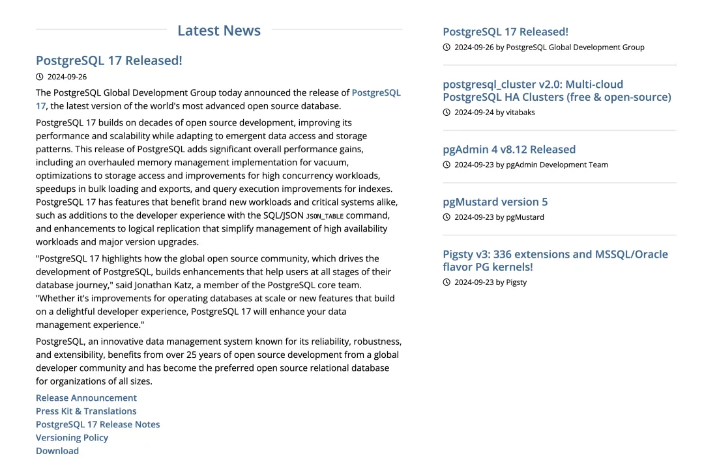

一年一度的 PostgreSQL 大版本发布来了！这次的 PostgreSQL 17 ，又给我们带来了什么惊喜呢？

在这次大版本发布注记中， PostgreSQL 全球社区直接摊牌了 —— **不好意思，我不装了** —— “**现在PG就是世界上最先进的开源数据库，已经是各种规模组织的首选开源数据库了**”。虽然没有指名道姓，但官方已经无限接近喊出“干翻顶级商业数据库”（Oracle）的口号了。

在年初发表的 《[PostgreSQL 正在吞噬数据库世界](/zh/blog/pg/pg-eat-db-world)》中，我提出 **可扩展性** 是 PostgreSQL 独一无二的核心优势。
很高兴地看到这一点在短短半年中，就成为了 PostgreSQL 社区的关注焦点与共识，并在 [PGCon.Dev 2024](/zh/blog/pg/pgcondev-2024/) 与本次 PostgreSQL 17 发布中得到充分的体现。

关于新特性，我先前在 《[PostgreSQL 17 Beta1 发布！牙膏管挤爆了！](/zh/blog/pg/pg-17-beta1)》中已经有过介绍，在此就不再赘述了。
这个大版本有很多新特性，当然要说最让我印象深刻的是， PG竟然能在[原本就已经非常强悍的性能](/zh/blog/pg/pg-performence) 基础上让写入吞吐再次翻倍 —— **朴实无华的强悍**。

但比起具体的功能特性，我认为 PG 社区最大的转变发生在**心态与精神**上 —— 在这次发布通告中，PostgreSQL 去掉了原本 Slogan “世界上最先进的开源关系型数据库” 中的 “关系型” 三个字定语，直接变成了 “世界上最先进的开源数据库”。
并且在最后 “关于PostgreSQL” 的部分说到：“PG 的功能集，高级特性，可扩展性，安全性，稳定性已经比肩甚至超越了顶级商业数据库”。所以我想 “开源” 这个定语用不了多久也许就可以一同去掉，变成 “**世界上最先进的数据库**” 了。

PostgreSQL 这头巨兽已经觉醒了 —— 它不再是过去那种佛系与世无争的样子，精神面貌焕然一新，转换为一种积极进取的姿态 —— 它已经做好了接管与征服整个数据库世界的心理建设与动员准备。
而无数资本也已经涌入 PostgreSQL 生态，[PG 系的 Startup 几乎拿走了数据库领域融资的全部 New Money](https://mp.weixin.qq.com/s/fi_p3tTZTnwP5XDJrkVbQw)。PostgreSQL 势必成为数据库领域一统天下的 “Linux 内核，DBMS 的纷争也许在未来会内化为 PostgreSQL 发行版内战，就让我们拭目以待吧。

----------

## 原文：PostgreSQL 17 发布注记

PostgreSQL [全球开发组](https://www.postgresql.org/) 今天正式（2024-09-26）宣布了 [PostgreSQL 17](https://www.postgresql.org/docs/17/release-17.html) 的正式发布，这是世界上最先进的开源数据库的最新版本。

> 备注：是的，“关系型”定语已经去掉了，就是世界上最先进的开源数据库

PostgreSQL 17 建立在数十年的开源开发模式基础上，在不断提升性能与可伸缩性的同时，也在不断适应数据访问与存储的新兴模式。
本次 [`PostgreSQL`](https://www.postgresql.org/) 发布带来了显著的整体性能提升，例如，VACUUM 内存管理的彻底改进、存储访问优化、高并发工作负载改进、批量加载与导出加速、以及索引查询执行的改进等。
PostgreSQL 17具备能够同时惠及新型工作负载和关键核心系统的特性，例如：新增的 SQL/JSON 的 `JSON_TABLE` 命令改善了开发者体验；而对逻辑复制的改进，则简化了高可用架构与大版本升级的管理负担。

PostgreSQL 核心团队成员 Jonathan Katz 表示：“PostgreSQL 17 展现了全球开源社区如何协同构建，改善功能，帮助位于数据库旅途中不同阶段的用户”。“无论是针对大规模数据库运维的改进，还是基于卓越开发者体验的新特性，PostgreSQL 17 都将为您带来更好的数据管理体验。”

PostgreSQL 是一款以可靠性、稳健性和可扩展性著称的创新型数据管理系统，受益于全球开发者社区超过 25 年的开源开发，**已成为各类组织的首选开源关系型数据库**。

--------

## 系统性能的全面提升

PostgreSQL 的 [`vacuum`](https://www.postgresql.org/docs/17/routine-vacuuming.html) 进程对于系统健康运行至关重要，然而 vacuum 操作是需要消耗服务器实例资源的。PostgreSQL 17 引入了一种新的 vacuum 内部内存结构，内存消耗量降至原本的 1/20。这不仅提高了 vacuum 的速度，还减少了对共享资源的占用，为用户的工作负载释放出更多可用资源。

PostgreSQL 17 也继续在 I/O 层面上不断优化性能。由于对预写日志（[`WAL`](https://www.postgresql.org/docs/17/wal-intro.html)）处理的改进，高并发工作负载的**写入吞吐量可能有高达两倍的提升**。此外，新的流式 I/O 接口加快了顺序扫描（读取表中所有数据）以及 [`ANALYZE`](https://www.postgresql.org/docs/17/sql-analyze.html) 更新 Planner 所需统计信息的速度。

PostgreSQL 17 也在查询执行方面改善了性能。对于使用 [B-tree](https://www.postgresql.org/docs/17/indexes-types.html#INDEXES-TYPES-BTREE) 索引（PostgreSQL 默认的索引方法）的 `IN` 子句查询，性能有所提高。此外，[BRIN](https://www.postgresql.org/docs/17/brin.html) 索引现在支持并行构建。
PostgreSQL 17 在查询规划方面进行了多项改进，包括对 `NOT NULL` 约束的优化，以及对 CTE（[`WITH`](https://www.postgresql.org/docs/17/queries-with.html) 查询）处理的改进。本次发布中，使用 SIMD（单指令多数据）加速计算得到了更广泛地应用，例如在 [`bit_count`](https://www.postgresql.org/docs/17/functions-bitstring.html) 函数中使用 `AVX-512` 指令。

--------

## 进一步丰富的开发者体验

PostgreSQL 是 [第一个添加 JSON 支持的关系型数据库](https://www.postgresql.org/about/news/postgresql-92-released-1415/)（2012年），而 PostgreSQL 17 进一步完善了对 SQL/JSON 标准的实现。[`JSON_TABLE`](https://www.postgresql.org/docs/17/functions-json.html#FUNCTIONS-SQLJSON-TABLE) 特性现已在 PostgreSQL 17 中可用 —— 它允许开发者将 JSON 数据转换为标准的 PostgreSQL 表。
PostgreSQL 17 现在支持 SQL/JSON 标准的 [构造函数](https://www.postgresql.org/docs/17/functions-json.html#FUNCTIONS-JSON-CREATION-TABLE)（`JSON`、`JSON_SCALAR`、`JSON_SERIALIZE`）和 [查询函数](https://www.postgresql.org/docs/17/functions-json.html#SQLJSON-QUERY-FUNCTIONS)（`JSON_EXISTS`、`JSON_QUERY`、`JSON_VALUE`），为开发者提供了更多种类的与 JSON 数据交互的方式。
本次发布添加了更多种类的 [`jsonpath` 表达式](https://www.postgresql.org/docs/17/functions-json.html#FUNCTIONS-SQLJSON-PATH-OPERATORS)，重点是将 JSON 数据转换为原生的 PostgreSQL 数据类型，包括数值、布尔值、字符串和日期/时间类型。

PostgreSQL 17 为 [`MERGE`](https://www.postgresql.org/docs/17/sql-merge.html) （带条件版本的 UPDATE）添加了更多功能，包括 `RETURNING` 子句，和更新 [视图](https://www.postgresql.org/docs/17/sql-createview.html) 的能力。
此外，PostgreSQL 17 中批量加载与导出数据的能力得到加强，例如，在使用 [`COPY`](https://www.postgresql.org/docs/17/sql-copy.html) 命令导出大量数据时，性能提升高达两倍。当源端和目标编码匹配时，`COPY` 性能也有所提升，而且 `COPY` 命令包含一个新选项 `ON_ERROR`，允许在插入错误时继续导入。

此次发布还扩展了对分区数据和分布在远端 PostgreSQL 实例上的数据的管理功能。PostgreSQL 17 支持在[分区表](https://www.postgresql.org/docs/17/ddl-partitioning.html)上使用标识列（Identity Columns）和 `EXCLUDE` 约束。
用于在远程 PostgreSQL 实例上执行查询的 PostgreSQL 外部数据源包装器（[`postgres_fdw`](https://www.postgresql.org/docs/17/postgres-fdw.html)）现在可以将 `EXISTS` 和 `IN` 子查询下推到远程服务器，以实现更高效的处理。

PostgreSQL 17 还包含一个内置的、平台无关的、不可变的排序规则提供者，以确保排序规则的不可变性，并提供了类似于 `C` 排序规则的排序语义，但使用 `UTF-8` 编码而非 `SQL_ASCII`。使用这个新的排序规则提供者，可以保证您的文本查询无论在哪里的 PostgreSQL 上运行，都能返回相同的排序结果。

--------

## 针对高可用与大版本升级的逻辑复制改进

在许多用例中，[逻辑复制](https://www.postgresql.org/docs/17/logical-replication.html) 用于实时传输数据。
然而，在 17 版本之前，想要执行大版本升级的用户必须先删除掉逻辑复制槽，并需要在升级后将数据重新同步到订阅者。
从 PostgreSQL 17 开始，用户不需要先删除逻辑复制槽了，因而简化了使用逻辑复制时的大版本升级过程。

PostgreSQL 17 现在包含了针对逻辑复制的故障切换能力，使其在高可用环境中部署时更为可靠。
此外，PostgreSQL 17 引入了命令行工具 [`pg_createsubscriber`](https://www.postgresql.org/docs/17/app-pgcreatesubscriber.html)，用于将物理从库转换为一个新的逻辑从库。

--------

## 更多面向安全与运维的管理选项

PostgreSQL 17 进一步扩展了用户对数据库系统全生命周期的管理能力。PostgreSQL 提供了一个新的 TLS 选项 `sslnegotiation`，允许用户在使用 [ALPN](https://en.wikipedia.org/wiki/Application-Layer_Protocol_Negotiation)（在 ALPN 目录中注册为 `postgresql`）时执行直接 TLS 握手。
PostgreSQL 17 还添加了 [预置角色](https://www.postgresql.org/docs/17/predefined-roles.html) `pg_maintain`，赋予普通用户执行维护操作的权限。

PostgreSQL 自带的备份工具 [`pg_basebackup`](https://www.postgresql.org/docs/17/app-pgbasebackup.html) 现在支持增量备份，并添加了命令行功能程序 [`pg_combinebackup`](https://www.postgresql.org/docs/17/app-pgcombinebackup.html) 用于重建全量备份。
此外，`pg_dump` 新增了一个名为 `--filter` 的选项，允许您在生成转储文件时，选择要包含的对象。

PostgreSQL 17 还增强了监控和分析功能。[`EXPLAIN`](https://www.postgresql.org/docs/17/sql-explain.html) 命令现在会显示本地块读写I/O耗时，并包含两个新选项：`SERIALIZE` 和 `MEMORY`，可以显示用于网络传输的数据转换耗时以及使用的内存量。
PostgreSQL 17 现在还会报告 [索引 VACUUM 的进度](https://www.postgresql.org/docs/17/progress-reporting.html#VACUUM-PROGRESS-REPORTING)，
并添加了新的系统视图 [`pg_wait_events`](https://www.postgresql.org/docs/17/view-pg-wait-events.html)，在与 `pg_stat_activity` 视图结合使用时可以更深入地了解活动会话的等待原因。

--------

## 其他功能

PostgreSQL 17 中还添加了许多其他新功能和改进，可能会对您的用例有所帮助。请参阅 [发行注记](https://www.postgresql.org/docs/17/release-17.html) 以查阅新功能和变更的完整列表。

--------

## 关于 PostgreSQL

PostgreSQL 是全世界最先进的开源数据库，拥有着一个由成千上万的用户、贡献者、公司和组织组成的全球社区。它始于加州大学伯克利分校，有着超过 35 年的工程与开发历史。
PostgreSQL 以无与伦比的开发速度持续发展：**PostgreSQL 提供成熟的功能集不仅比肩能顶级的专有商业数据库系统，在高级数据库功能、可扩展性、安全性和稳定性方面上甚至超越了它们。**

> 译注：说的就是你呀，Oracle

--------

## 关于 Pigsty

顺带一提，紧随 PostgreSQL 17 发布的 Pigsty v3.0.3 已经正式支持使用 PostgreSQL 17 内核，欢迎试用。

[**Pigsty**](https://pigsty.cc/zh) 是开源免费，本地优先，开箱即用的 PostgreSQL RDS，允许用户在本地一键拉起生产级的 PG 云数据库服务，并带有开箱即用的 390 个PG扩展插件，故障自愈的高可用，顶级监控系统，PITR备份恢复，IaC命令行工具，SOP管理预案的完整解决方案。

--------

## 其他参考阅读

德哥在他的博客中已经解读了许多关于 PostgreSQL 17 的新功能特性，是进一步了解 PostgreSQL 17 新功能特性的好资源：

《[PostgreSQL 17 正式发布, 要不要升?](https://mp.weixin.qq.com/s/HSynUBf9b8Ecz3953XKL5g)》

支持块级别增量备份与恢复:

- 《PostgreSQL 17 preview - 内置块级别物理增量备份(INCREMENTAL backup/pg_combinebackup)功能》
- 《PostgreSQL 17 preview - Add new pg_walsummary tool》
- 《PostgreSQL 17 preview - Add new function `pg_get_wal_summarizer_state()` 分析为聚合入 pg_wal/summaries 的pid内存中的wal片段信息》
- 《PostgreSQL 17 preview - 增量备份patch: Add the system identifier to backup manifests》

支持逻辑复制failover、switchover:

- 《PostgreSQL 17 preview - pg_upgrade大版本升级支持保留逻辑订阅全部信息 (preserve the full subscription's state)》
- 《PostgreSQL 17 preview - 主库视图 `pg_replication_slots`.`conflict_reason` 支持逻辑复制冲突原因跟踪》
- 《PostgreSQL 17 preview - 支持逻辑复制槽failover to 流复制standby节点. `pg_create_logical_replication_slot(... failover = true|false ...)`》
- 《PostgreSQL 17 preview - preparation for replicating unflushed WAL data》
- 《PostgreSQL 17 preview - sync logical replication slot LSN, Failover & Switchover》
- 《PostgreSQL 17 preview - Add a new slot sync worker to synchronize logical slots》
- 《PostgreSQL 17 preview - 增加GUC standby_slot_names , 保证这些standby已接收并flush所有逻辑slot向下游发送逻辑数据对应的WAL》
- 《PostgreSQL 17 preview - pg_createsubscriber支持将物理从库转换为逻辑从库》
- 《PostgreSQL 17 preview - 跟踪slot断联时间戳`pg_replication_slots.inactive_since`》

支持COPY错误处理:

- 《PostgreSQL 17 preview - Add new COPY option SAVE_ERROR_TO (copy跳过错误行)》
- 《PostgreSQL 17 preview - pg_stat_progress_copy Add progress reporting of skipped tuples during COPY FROM》
- 《PostgreSQL 17 preview - COPY LOG_VERBOSITY notice ERROR信息》

JSON类型处理能力增强:

- 《PostgreSQL 17 preview - Implement various jsonpath methods》
- 《PostgreSQL 17 preview - JSON_TABLE: Add support for NESTED paths and columns》

vacuum性能改进:

- 《PostgreSQL 17 preview - 增加index vacuum 进度打印》
- 《PostgreSQL 17 preview - Optimize vacuuming of relations with no indexes 降低wal产出》
- 《PostgreSQL 17 preview - 解除vacuumdb,clusterdb,reindexdb的某些options组合限制》
- 《PostgreSQL 17 preview - 使用TidStore数据结构存储dead tupleids, 提升vacuum效率, 为什么PG单表不建议超过8.9亿条记录?》
- 《PostgreSQL 17 preview - vacuum_buffer_usage_limit调大默认值, 减少vacuum造成的wal flush, 提升vacuum速度》

index 性能优化:

- 《PostgreSQL 17 preview - Allow Incremental Sorts on GiST and SP-GiST indexes》
- 《PostgreSQL 17 preview - btree index backward scan (order by desc 场景)优化》
- 《PostgreSQL 17 preview - Allow parallel CREATE INDEX for BRIN indexes》

高并发锁竞争优化:

- 《PostgreSQL 17 preview - 优化wal insert lock, 提升高并发写入吞吐性能》
- 《PostgreSQL 17 preview - Reduce rate of walwriter wakeups due to async commits》
- 《PostgreSQL 17 preview - WAL锁竞争优化 - reading WAL buffer contents without a lock, Additional write barrier in AdvanceXLInsertBuffer()》

性能优化:

- 《PostgreSQL 17 preview - 函数parser阶段优化, 函数guc into lists避免parser》
- 《PostgreSQL 17 preview - 删除snapshot too old特性, 将引入新实现方式》
- 《PostgreSQL 17 preview - postgres_fdw 支持semi-join pushdown (exists (...))》
- 《PostgreSQL 17 preview - 将unstable hashfunc剥离, 提升in-memory场景哈希计算性能和算法自由度》
- 《PostgreSQL 17 preview - 优化器增强, group by支持Incremental Sort, GUC: enable_group_by_reordering》
- 《PostgreSQL 17 preview - 引入新的smgr, 优化bulk loading》
- 《PostgreSQL 17 preview - Add `--copy-file-range` option to `pg_upgrade`》
- 《PostgreSQL 17 preview - 减少分区表partitionwise join内存消耗》
- 《PostgreSQL 17 preview - 使用 Merge Append 提升 UNION 性能》
- 《PostgreSQL 17 preview - pg_restore `--transaction-size=N` 支持N个对象封装为一个事务提交》

新增GUC参数:

- 《PostgreSQL 17 preview - Add GUC: event_triggers . for temporarily disabling event triggers》
- 《PostgreSQL 17 preview - Allow ALTER SYSTEM to set unrecognized custom GUCs.》
- 《PostgreSQL 17 preview - XX000 内部错误 backtrace, add GUC backtrace_on_internal_error》
- 《PostgreSQL 17 preview - allow_alter_system GUC控制 是否允许`alter system `修改`postgresql.auto.conf`》
- 《PostgreSQL 17 preview - 新增 GUC: or_to_any_transform_limit 控制`OR to ANY`转换》
- 《PostgreSQL 17 preview - 新增 GUC trace_connection_negotiation : 跟踪客户端 SSLRequest or GSSENCRequest packet》

SQL语法、函数功能增强:

- 《PostgreSQL 17 preview - plpgsql 支持定义 `%TYPE` `%ROWTYPE` 数组变量类型》
- 《PostgreSQL 17 preview - 支持修改生成列表达式 `alter table ... ALTER COLUMN ... SET EXPRESSION AS (express)`》
- 《PostgreSQL 17 preview - Support identity columns in partitioned tables》
- 《PostgreSQL 17 preview - 简化exclude约束用法, 对primary key,unique约束增加without overlaps可选项》
- 《PostgreSQL 17 preview - Add RETURNING support to MERGE》
- 《PostgreSQL 17 preview - 增加uuid功能函数: 提取UUID值里面的时间戳 和 生成UUID值的函数版本》
- 《PostgreSQL 17 preview - 新增返回某个范围内的随机数的随机函数`random(min, max)`》
- 《PostgreSQL 17 preview - Add support for `MERGE ... WHEN NOT MATCHED BY SOURCE`》
- 《PostgreSQL 17 preview - 使用pg_basetype 获得domain类型的基础类型》
- 《PostgreSQL 17 preview - Implement `ALTER TABLE ... MERGE|SPLIT PARTITION` ... command》

管理手段增强:

- 《PostgreSQL 17 preview - 内置支持login event trigger》
- 《PostgreSQL 17 preview - Add tests for XID wraparound》
- 《PostgreSQL 17 preview - pgbench工具新增meta语法syncpipeline, `pgbench: Add \syncpipeline`》
- 《PostgreSQL 17 preview - 引入MAINTAIN权限及pg_maintain预制角色》
- 《PostgreSQL 17 preview - 新增 "builtin" collation provider》
- 《PostgreSQL 17 preview - 通过pg_wal_replay_wait()支持读写分离pool实现跨实例的读写一致性》
- 《PostgreSQL 17 preview - transaction_timeout》

内部统计信息、系统视图增强:

- 《PostgreSQL 17 preview - Add new parallel message type to progress reporting.》
- 《PostgreSQL 17 preview - Add system view pg_wait_events》
- 《PostgreSQL 17 preview - Add JIT deform_counter》
- 《PostgreSQL 17 preview - 添加checkpoint delay等待事件》
- 《PostgreSQL 17 preview - Add `local_blk_{read|write}_time` I/O timing statistics for local blocks》
- 《PostgreSQL 17 preview - Introduce pg_stat_checkpointer》
- 《PostgreSQL 17 preview - improve range type pg_stats》
- 《PostgreSQL 17 preview - 增强standby节点检查点统计信息》
- 《PostgreSQL 17 preview - Add EXPLAIN (MEMORY) to report planner memory consumption》

table access method 接口增强:

- 《PostgreSQL 17 preview - Add support for `DEFAULT` in `ALTER TABLE .. SET ACCESS METHOD`》
- 《PostgreSQL 17 preview - 支持修改分区表access method》
- 《PostgreSQL 17 preview - 寻找undo-based table access methods的蛛丝马迹》
- 《PostgreSQL 17 preview - 频繁提交table access method相关patch, undo-based table access methods真的快来了吗?》
- 《PostgreSQL 17 preview - table AM增强: Custom reloptions for table AM》

扩展接口能力增强:

- 《PostgreSQL 17 preview - 增加alter table部分属性hook, 未来可定制化审计功能》
- 《PostgreSQL 17 preview - 支持自定义等待事件》
- 《PostgreSQL 17 preview - Introduce the dynamic shared memory registry (DSM 注册器)》
- 《PostgreSQL 17 preview - 新增代码注入功能(enable-injection-points), 类似hook.》
- 《PostgreSQL 17 preview - 引入读写原子操作函数接口with full barrier semantics》
- 《PostgreSQL 17 preview - 支持在申请时指定动态共享内存区域初始、最大段size》
- 《PostgreSQL 17 preview - 代码注入(injection_points)功能增强, Introduce runtime conditions》

libpq协议增强:

- 《PostgreSQL 17 preview - libpq: Add support for Close on portals and statements , 释放绑定变量语句入口(prepared statements)》
- 《PostgreSQL 17 preview - 增加wire protocol头文件》
- 《PostgreSQL 17 preview - libpq新增`PQchangePassword()`接口, 防止alter user修改密码时明文被记录在SQL活跃会话、log、pg_stat_statements中》

