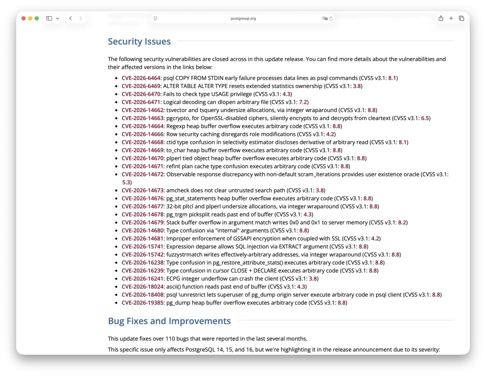

PostgreSQL 发布了最新一轮小版本更新。这次更新修复了 28 个安全漏洞和 110 多个 Bug。考虑到 7 月以来 Claude Fable 和 ChatGPT Sol 5.6 级别的模型已普遍可用，发现大量漏洞与 Bug 也是意料之中的结果。

[](https://www.postgresql.org/about/news/postgresql-186-1711-1615-1519-1424-and-19-beta-3-released-3365/)

老冯建议所有用户尽快安排 PostgreSQL 小版本升级。[Pigsty 将于次日发布 v4.5](/pigsty/v4.5/)，提供包含最新 PostgreSQL 18.6 的离线安装包。这将是 Pigsty v5.0 与 PostgreSQL 19 发布之前的最后一次小版本发布。

以下为官方发布公告的中文翻译。

---

## 公告：PostgreSQL 18.6、17.11、16.15、15.19、14.24 与 19 Beta 3 正式发布！

> 原文：[PostgreSQL 18.6、17.11、16.15、15.19、14.24 与 19 Beta 3 正式发布](https://www.postgresql.org/about/news/postgresql-186-1711-1615-1519-1424-and-19-beta-3-released-3365/)

发布于 **2026 年 8 月 13 日**，作者：PostgreSQL 全球开发组

**PostgreSQL 项目 · 安全**

PostgreSQL 全球开发组现已发布所有受支持 PostgreSQL 版本的更新，包括 18.6、17.11、16.15、15.19 和 14.24，以及 PostgreSQL 19 的第三个 Beta 测试版本。本次发布修复了过去几个月报告的 28 个安全漏洞和 110 多个 Bug。

本次更新中，PostgreSQL 18 的版本号从 18.4 直接跳至 18.6。由于发现了一个回归问题，18.5 最终没有发布。

此次更新后，有三个问题可能需要你额外执行一些操作，具体细节将在下文介绍。这些问题涉及：

- 并行构建 [GIN 索引](https://www.postgresql.org/docs/18/gin.html)
- [`btree_gist`](https://www.postgresql.org/docs/18/btree-gist.html)
- [`ltree`](https://www.postgresql.org/docs/18/ltree.html)

完整的变更列表请参阅 [PostgreSQL 18.6 发布注记](https://www.postgresql.org/docs/release/18.6/)。

---

## PostgreSQL 14 EOL 提醒

PostgreSQL 14 将于 2026 年 11 月 12 日停止接收修复更新。如果你仍在生产环境中运行 PostgreSQL 14，我们建议尽快规划升级到更新且仍受支持的 PostgreSQL 版本。更多信息请参阅 PostgreSQL 的[版本策略](https://www.postgresql.org/support/versioning/)。

---

## 安全问题

本次更新修复了以下安全漏洞。有关漏洞详情及受影响的 PostgreSQL 版本，请参阅各 CVE 链接；评分采用 [CVSS v3.1](https://www.first.org/cvss/calculator/3.1)：

- [CVE-2026-6464](https://www.postgresql.org/support/security/CVE-2026-6464/)：psql 的 `COPY FROM STDIN` 提前失败后，会将后续数据行作为 psql 命令执行（CVSS v3.1：8.1）。
- [CVE-2026-6469](https://www.postgresql.org/support/security/CVE-2026-6469/)：`ALTER TABLE ALTER TYPE` 会重置扩展统计信息的所有权（CVSS v3.1：3.8）。
- [CVE-2026-6470](https://www.postgresql.org/support/security/CVE-2026-6470/)：未检查类型的 `USAGE` 权限（CVSS v3.1：4.3）。
- [CVE-2026-6471](https://www.postgresql.org/support/security/CVE-2026-6471/)：逻辑解码可以通过 `dlopen` 加载任意文件（CVSS v3.1：7.2）。
- [CVE-2026-14662](https://www.postgresql.org/support/security/CVE-2026-14662/)：`tsvector` 和 `tsquery` 因整数回绕导致内存分配不足（CVSS v3.1：8.8）。
- [CVE-2026-14663](https://www.postgresql.org/support/security/CVE-2026-14663/)：对于 OpenSSL 已禁用的密码算法，`pgcrypto` 会静默地以明文进行所谓的“加密”和“解密”（CVSS v3.1：6.5）。
- [CVE-2026-14664](https://www.postgresql.org/support/security/CVE-2026-14664/)：正则表达式堆缓冲区溢出可导致执行任意代码（CVSS v3.1：8.8）。
- [CVE-2026-14666](https://www.postgresql.org/support/security/CVE-2026-14666/)：行级安全缓存未考虑角色变更（CVSS v3.1：4.2）。
- [CVE-2026-14668](https://www.postgresql.org/support/security/CVE-2026-14668/)：选择率估算器中的 `ctid` 类型混淆可泄露由任意内存读取派生的信息（CVSS v3.1：8.1）。
- [CVE-2026-14669](https://www.postgresql.org/support/security/CVE-2026-14669/)：`to_char` 堆缓冲区溢出可导致执行任意代码（CVSS v3.1：8.8）。
- [CVE-2026-14670](https://www.postgresql.org/support/security/CVE-2026-14670/)：PL/Perl tied object 堆缓冲区溢出可导致执行任意代码（CVSS v3.1：8.8）。
- [CVE-2026-14671](https://www.postgresql.org/support/security/CVE-2026-14671/)：`refint` 执行计划缓存中的类型混淆可导致执行任意代码（CVSS v3.1：8.8）。
- [CVE-2026-14672](https://www.postgresql.org/support/security/CVE-2026-14672/)：使用非默认 `scram_iterations` 时，可通过可观察的响应差异判断用户是否存在（CVSS v3.1：5.3）。
- [CVE-2026-14673](https://www.postgresql.org/support/security/CVE-2026-14673/)：`amcheck` 未清理不可信的 `search_path`（CVSS v3.1：3.8）。
- [CVE-2026-14676](https://www.postgresql.org/support/security/CVE-2026-14676/)：`pg_stat_statements` 堆缓冲区溢出可导致执行任意代码（CVSS v3.1：8.8）。
- [CVE-2026-14677](https://www.postgresql.org/support/security/CVE-2026-14677/)：32 位平台上的 PL/Tcl 和 PL/Perl 因整数回绕导致内存分配不足（CVSS v3.1：8.8）。
- [CVE-2026-14678](https://www.postgresql.org/support/security/CVE-2026-14678/)：`pg_trgm` 的 `picksplit` 会读取缓冲区末尾之外的内存（CVSS v3.1：4.3）。
- [CVE-2026-14679](https://www.postgresql.org/support/security/CVE-2026-14679/)：参数匹配中的栈缓冲区溢出可向服务器内存写入 `0x0` 和 `0x1`（CVSS v3.1：8.2）。
- [CVE-2026-14680](https://www.postgresql.org/support/security/CVE-2026-14680/)：通过 `internal` 参数触发类型混淆（CVSS v3.1：8.8）。
- [CVE-2026-14681](https://www.postgresql.org/support/security/CVE-2026-14681/)：与 SSL 配合使用时，未正确强制实施 GSSAPI 加密（CVSS v3.1：4.2）。
- [CVE-2026-15741](https://www.postgresql.org/support/security/CVE-2026-15741/)：表达式反解析允许通过 `EXTRACT` 参数实施 SQL 注入（CVSS v3.1：8.8）。
- [CVE-2026-15742](https://www.postgresql.org/support/security/CVE-2026-15742/)：`fuzzystrmatch` 因整数回绕可向几乎任意地址写入数据（CVSS v3.1：8.8）。
- [CVE-2026-16238](https://www.postgresql.org/support/security/CVE-2026-16238/)：`pg_restore_attribute_stats()` 中的类型混淆可导致执行任意代码（CVSS v3.1：8.8）。
- [CVE-2026-16239](https://www.postgresql.org/support/security/CVE-2026-16239/)：游标 `CLOSE` + `DECLARE` 中的类型混淆可导致执行任意代码（CVSS v3.1：8.8）。
- [CVE-2026-16241](https://www.postgresql.org/support/security/CVE-2026-16241/)：ECPG 整数下溢可导致客户端崩溃（CVSS v3.1：3.8）。
- [CVE-2026-18024](https://www.postgresql.org/support/security/CVE-2026-18024/)：`ascii()` 函数会读取缓冲区末尾之外的内存（CVSS v3.1：4.3）。
- [CVE-2026-18408](https://www.postgresql.org/support/security/CVE-2026-18408/)：psql 的 `\unrestrict` 可让 `pg_dump` 源服务器上的超级用户在 psql 客户端执行任意代码（CVSS v3.1：8.8）。
- [CVE-2026-19385](https://www.postgresql.org/support/security/CVE-2026-19385/)：`pg_dump` 堆缓冲区溢出可导致执行任意代码（CVSS v3.1：8.8）。

---

## Bug 修复与改进

本次更新修复了过去几个月报告的 110 多个 Bug。

下面这个问题仅影响 PostgreSQL 14、15 和 16，但鉴于其严重程度，我们特别在发布公告中予以说明：

- 修复重放由较旧小版本生成的 WAL 时可能发生的自死锁。这个回归问题是在上一轮小版本更新中引入的，它可能导致一个跟随较旧小版本主库的备用服务器彻底卡住。

下面列出的其余问题会影响 PostgreSQL 18，其中很多问题也会影响其他仍受支持的 PostgreSQL 版本：

- 修复并行构建 [GIN](https://www.postgresql.org/docs/18/gin.html) 索引时无法正确更新 `pg_class` 中表的 `reltuples` 值的问题。此前，并行工作进程可能会报告一个未初始化的行数，从而导致 `reltuples` 被设置成错误值，包括 `Infinity` 或 `NaN`。这样的值可能导致 `autovacuum` 和 `autoanalyze` 永远不再处理该表，而且这种情况不会自行恢复。如果你的表上存在 GIN 索引，我们建议升级后检查其 `reltuples` 值是否合理。有关如何识别和修复受影响表的方法，请参阅下文的[“更新”](#更新)章节。
- 修复 [`btree_gist`](https://www.postgresql.org/docs/18/btree-gist.html) 的多个问题，包括：修复 `float4`/`float8` 对 `NaN` 的处理，使包含 `NaN` 的列不再产生错误查询结果；以及修复构建索引时对 `bit`/`bit varying` 值的排序。升级之后，你可能需要重建位于 `float` 或 `bit` 列上的 `btree_gist` 索引。请参阅[“更新”](#更新)章节。
- 修复 [`ltree`](https://www.postgresql.org/docs/18/ltree.html) 比较操作中的整数溢出问题。包含大约 14,653 个以上标签的 `ltree` 值此前可能得到错误的比较结果，表现出来可能就像 B-tree 索引损坏一样。如果你使用 `ltree`，升级后可能需要重建受影响的索引。请参阅[“更新”](#更新)章节。
- 修复 `RANGE` 分区表的[分区裁剪](https://www.postgresql.org/docs/18/ddl-partitioning.html#DDL-PARTITION-PRUNING)，确保在本应扫描 `DEFAULT` 分区的情况下不再错误跳过它。此前这个问题可能导致查询结果中缺失某些行。
- 修复带有外部表分区的分区表中的多个问题。其中包括：当运行时分区裁剪判定某些分区无需扫描时，系统此前并不总能正确处理已经发往外部服务器、尚在执行中的请求，从而可能导致操作失败。
- 修复 [`RETURNING`](https://www.postgresql.org/docs/18/dml-returning.html) 与 `OLD`、`NEW` 配合使用时的多个问题。
- 改进存在多个连接键且包含大量 `NULL` 值时的哈希连接性能。
- 修复查询规划器中多个可能产生错误查询结果的问题，包括数组可能为空时的 `value IN (array)` 测试，以及使用 `EXCLUDE` 子句或没有 `ORDER BY` 的 `COUNT()` 窗口函数。
- 补充对容器类型（[数组](https://www.postgresql.org/docs/18/arrays.html)、[复合类型](https://www.postgresql.org/docs/18/rowtypes.html)以及[范围类型](https://www.postgresql.org/docs/18/rangetypes.html)）等值比较是否支持哈希操作的检查。如果缺少这些检查，规划器可能选择基于哈希的执行计划，随后在执行阶段报出 `could not identify a hash function` 错误。
- 修复属于[排他约束](https://www.postgresql.org/docs/18/ddl-constraints.html#DDL-CONSTRAINTS-EXCLUSION)的索引在附加分区时的问题，同时也修复了分区排他约束在 dump/restore 时的问题。
- 修复对延迟唯一性约束所依赖索引执行 [`REINDEX CONCURRENTLY`](https://www.postgresql.org/docs/18/sql-reindex.html) 时的问题，该问题可能产生错误的约束冲突报告。
- 恢复一项索引扫描优化：当索引和表达式的排序规则不同时，如果 [`LIKE`](https://www.postgresql.org/docs/18/functions-matching.html) 或正则表达式模式实际上是精确匹配，可以将其转换为等值索引条件。
- 修复 [`jsonpath`](https://www.postgresql.org/docs/18/functions-json.html#FUNCTIONS-SQLJSON-PATH) 的多个问题，其中包括：路径表达式引用未定义变量时，`@?` 和 `@@` 操作符现在会正确报错。此前，由于这两个操作符无法提供变量值，未定义变量会被视为 JSON `null`，而不是错误；这还可能导致无上限的内存消耗。
- 确保禁止访问其他会话的临时表；此前这种访问可能悄无声息地产生错误结果。
- 修复访问临时表期间出现的 `no empty local buffer available` 错误。当 [`effective_io_concurrency`](https://www.postgresql.org/docs/18/runtime-config-resource.html#GUC-EFFECTIVE-IO-CONCURRENCY) 设置得很大时，单个读取流此前可能耗尽所有本地缓冲区。
- 防止 [`autovacuum`](https://www.postgresql.org/docs/18/routine-vacuuming.html#AUTOVACUUM) 以错误的优先级顺序处理数据库——此前可能从最低优先级开始，而不是最高优先级。
- 恢复 [`VACUUM`](https://www.postgresql.org/docs/18/sql-vacuum.html) 的事务 ID 回卷故障保护（wraparound failsafe）模式，使其按设计使用完整的共享缓冲池。此前的问题会拖慢紧急 `VACUUM` 的执行速度。
- 修复 GiST 和 SP-GiST [仅索引扫描](https://www.postgresql.org/docs/18/indexes-index-only-scans.html)期间可能错误解码索引元组的问题，该问题可能输出损坏的数据。
- 修复 [`SERIALIZABLE`](https://www.postgresql.org/docs/18/transaction-iso.html#XACT-SERIALIZABLE) 隔离级别下冲突检测中的竞争条件。在检查一个初始为空的 B-tree 索引时，此前可能漏掉冲突，导致相互冲突的事务同时提交，从而破坏可串行化保证。
- 修复对表[可见性映射](https://www.postgresql.org/docs/18/storage-vm.html)中清除位操作的 WAL 记录。此前的问题可能导致生成错误的增量备份，或者无法修复撕裂页（torn-page）写入。
- 修复空预备事务的[逻辑解码](https://www.postgresql.org/docs/18/logicaldecoding.html)。如果一个预备事务没有任何可解码的变更，输出插件此前可能在没有收到 `PREPARE` 的情况下直接收到 `COMMIT PREPARED` 或 `ROLLBACK PREPARED`，从而破坏内置订阅端的复制。
- 修复 [`libpq`](https://www.postgresql.org/docs/18/libpq.html) 的多个问题，其中包括确保读取数据时会排空 SSL 或 GSS 解密缓冲区中所有待处理字节，避免客户端明明已经收到数据，却仍在等待数据到来的情况。
- 修复 [`pg_createsubscriber`](https://www.postgresql.org/docs/18/app-pgcreatesubscriber.html)，确保操作失败后能够清理遗留在发布端的对象，包括复制槽。
- 修复 [`pg_restore`](https://www.postgresql.org/docs/18/app-pgrestore.html) 在使用 `--statistics` 或 `--statistics-only` 时的问题。当这些选项与 `--schema` 等其他选择性恢复选项组合使用时，现在会恢复预期的对象，与 `pg_dump` 的行为保持一致。

本次发布还将时区数据文件更新至 tzdata 2026c。其中，加拿大阿尔伯塔省（`America/Edmonton`）将从 2026 年 11 月起全年采用 UTC−06，也就是事实上永久实行夏令时。本版本假定届时其时区缩写将使用 CST，但这一点仍可能发生变化。此外，本次更新还反映了摩洛哥（`Africa/Casablanca`）将在 2026 年 9 月 20 日改为永久采用 UTC+00，不再进行夏令时切换。

---

## 更新

所有 PostgreSQL 更新版本都是累积性的。与其他小版本更新一样，应用本次更新无需 dump 并重新导入数据库，也不需要使用 `pg_upgrade`；只需停止 PostgreSQL，然后更新其二进制文件即可。

如果你的表上存在 GIN 索引，我们建议升级后检查这些表的 `reltuples` 值。此前并行构建 GIN 索引存在一个 Bug，可能会将 `reltuples` 设置成错误值，包括 `Infinity` 或 `NaN`，进而导致 `autovacuum` 和 `autoanalyze` 永远不再处理该表。下面的查询会列出所有拥有 GIN 索引的表，以及它们当前的 `reltuples` 值：

```sql
SELECT DISTINCT
    t.oid::regclass,
    t.reltuples
FROM pg_class AS t
JOIN pg_index AS i ON t.oid = i.indrelid
JOIN pg_class AS ic ON i.indexrelid = ic.oid
WHERE t.relhasindex
  AND ic.relam = 2742;
```

如果某张表的 `reltuples` 值看起来不正确，请对其执行 [`ANALYZE`](https://www.postgresql.org/docs/18/sql-analyze.html)（或者创建另一个索引），以重新设置这个值。

如果你使用 `btree_gist`，则应重建以下索引：位于可能包含 `NaN` 值的 `float4` 或 `float8` 列上的 `btree_gist` 索引，以及位于 `bit` 或 `bit varying` 列上的 `btree_gist` 索引。例如：

```sql
REINDEX INDEX your_index_name;
```

如果你使用 `ltree`，并且在包含大量标签（大约超过 14,653 个）的 `ltree` 值上建立了 B-tree 索引，则应[重建索引](https://www.postgresql.org/docs/18/sql-reindex.html)，因为这些索引可能已经损坏。例如：

```sql
REINDEX INDEX your_index_name;
```

如果你跳过了一个或多个更新版本，升级后可能还需要执行额外操作；详情请参阅此前各版本的发布注记。

更多详情请参阅 [PostgreSQL 18.6 发布注记](https://www.postgresql.org/docs/release/18.6/)。

---

## 关于 PostgreSQL 19 Beta 的说明

本次发布是 PostgreSQL 19 的第三个 Beta 测试版本。

秉承 PostgreSQL 开源社区一贯的精神，我们强烈建议你在自己的系统上测试 PostgreSQL 19 的新功能，帮助我们尽可能消除 Bug 和其他问题。虽然我们不建议在生产环境中运行 PostgreSQL 19 Beta 3，但仍鼓励你想办法使用这个 Beta 版本运行自己典型的应用工作负载。

你的测试和反馈将帮助社区确保 PostgreSQL 19 延续我们的标准，交付一个稳定、可靠的“全球最先进开源关系数据库”版本。请进一步阅读 [Beta 测试流程](https://www.postgresql.org/developer/beta/)，了解如何参与贡献。

---

## 升级到 PostgreSQL 19 Beta 3

如果要从较早版本的 PostgreSQL 升级到 PostgreSQL 19 Beta 3，你需要采用类似 PostgreSQL 大版本升级的方式，例如使用 `pg_upgrade`，或者 `pg_dump` / `pg_restore`。更多信息请参阅文档中的[升级章节](https://www.postgresql.org/docs/19/upgrading.html)。

---

## Beta 2 以来的变化

PostgreSQL 19 Beta 3 中的修复与变更包括：

- 撤销 `GROUP BY ALL`。
- 修复新的 `FOR PORTION OF` 时态表语法中的多个问题。
- 修复新的逻辑复制序列同步功能中的多个问题，包括一个涉及 `REFRESH SEQUENCES` 的竞争条件。
- 修复并发启用逻辑解码时可能出现的 `unexpected logical decoding status change` 错误。
- 修复订阅对象所有权变更相关的问题。
- 修复 `postgres_fdw` 下推涉及隐式类型转换的数组比较（例如 `field = ANY($1)`）时可能产生错误查询结果的问题。
- 修复涉及可空 `UNIQUE` 约束的外键检查过程中可能发生的崩溃。
- 修复 `pg_plan_advice` 对数字字面量中下划线的解析。
- 修复反解析 `JSON_ARRAY(query)` 时缺失 `FORMAT` 子句的问题。

完整的新功能与变更列表请参阅 [PostgreSQL 19 Beta 发布注记](https://www.postgresql.org/docs/19/release-19.html)。

---

## Bug 与兼容性测试

每一个 PostgreSQL 版本能否保持稳定，在很大程度上取决于社区中的各位用户：在 PostgreSQL 19 正式发布之前，使用自己的实际工作负载和测试工具测试即将发布的版本，帮助我们发现 Bug 和回归问题。由于目前仍处于 Beta 阶段，数据库行为、功能细节以及 API 仍有可能发生小幅调整。你的反馈和测试结果将帮助我们决定新功能最后还需要进行哪些调整，因此请尽快参与测试。用户测试的质量，也是决定我们何时能够正式发布最终版本的重要因素。

PostgreSQL Wiki 上公开维护了一份[待解决问题列表](https://wiki.postgresql.org/wiki/PostgreSQL_19_Open_Items)。你也可以通过 PostgreSQL 网站上的[表单报告 Bug](https://www.postgresql.org/account/submitbug/)。

---

## 链接

- [下载 PostgreSQL](https://www.postgresql.org/download/)
- [PostgreSQL 发布注记](https://www.postgresql.org/docs/release/)
- [安全公告](https://www.postgresql.org/support/security/)
- [版本策略](https://www.postgresql.org/support/versioning/)
- [Beta 测试信息](https://www.postgresql.org/developer/beta/)
- [PostgreSQL 19 Beta 发布注记](https://www.postgresql.org/docs/19/release-19.html)
- [PostgreSQL 19 待解决问题](https://wiki.postgresql.org/wiki/PostgreSQL_19_Open_Items)
- [提交 Bug](https://www.postgresql.org/account/submitbug/)
- [捐赠](https://www.postgresql.org/about/donate/)

如果你发现本发布公告存在错误，或者有任何改进建议，请发送至公开的 [pgsql-www@lists.postgresql.org](mailto:pgsql-www@lists.postgresql.org) [邮件列表](https://www.postgresql.org/list/)。
