今天下午几个群里朋友 @ 我：PostgreSQL 官方仓库正式上架龙芯 CPU 支持。

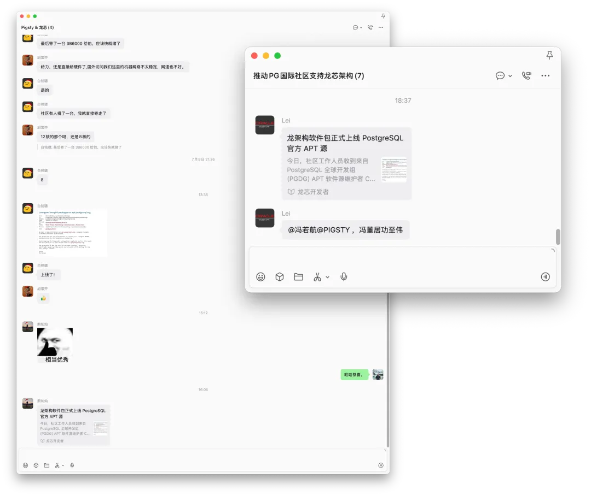

事情是这样的。7 月 22 日，PGDG APT 仓库的维护者 Christoph Berg [在 pgsql-pkg-debian 邮件列表上发了一封很短的公告](https://postgrespro.com/list/id/amDcZqn7B70s7fwa@msg.df7cb.de)，交代了三件事：apt.postgresql.org 新增 Loongson loong64 架构；构建主机是一块由 loongfans.cn 社区提供的龙芯 3B6000；软件包的自举构建已在本月初完成，仓库现已正式可用。

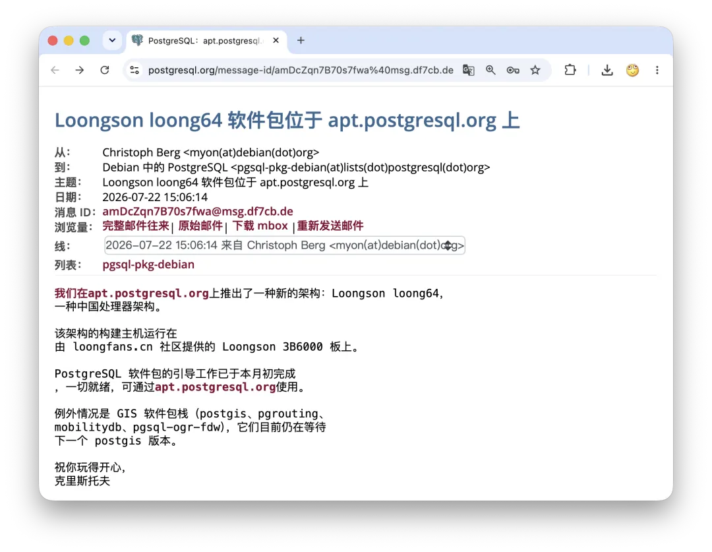

我顺手跑到 [PGDG APT 仓库目录](https://ftp.postgresql.org/pub/repos/apt/dists/trixie-pgdg/18/)里看了一眼：龙芯的包已经正式发布了，和 AMD64、ARM64、PPC64EL 排在了一起；PostgreSQL 官网的 APT 页面，也把 loong64 写进了当前支持的架构列表。

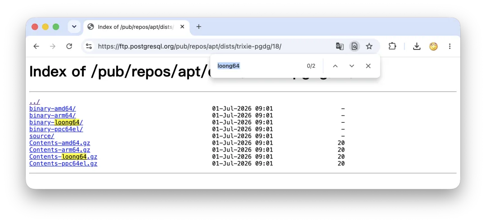

龙芯，成了 PGDG APT 仓库官方当前支持的第四种 CPU 架构。

新闻本身，几句话就说完了。但这件事为什么值得专门写一篇文章？

因为它确实不容易——而且难的地方，跟大多数人想的不一样。

---

## 卡住的，不是 PostgreSQL 内核

PostgreSQL 是 C 写的，理论上当然能跑在各种 CPU 上。不过理论是理论，实际是实际，不同 CPU 架构之间的差异，比想象中多得多。

举个反例：IBM POWER 上的 AIX。这个平台怪癖极多，PG 代码里塞了不少专门伺候它的 Hack。到了 PG 17，社区因为 Direct I/O 的对齐要求，索性把这堆历史包袱连同 AIX 支持一起扫地出门。IBM 一下就慌了，赶紧派人来提补丁，前前后后磨了两年，把编译器从 xlc 换成 gcc，才总算在今年即将发布的 PG 19 里，把 AIX 7.2+ 的支持给赎了回来。你看，就算是 IBM，跟不上趟也照样被扫地出门。

相比之下，龙芯在内核这一层命好得多，只有个自旋锁的小坎。2022 年 11 月 2 日，恒生电子的工程师吴亚飞[给 pgsql-hackers 邮件列表发了一封邮件](https://www.postgresql.org/message-id/761ac43d44b84d679ba803c2bd947cc0@HSMAILSVR04.hs.handsome.com.cn)，主题就一句话：`spinlock support on loongarch64`，附一个 1 KB 的补丁。

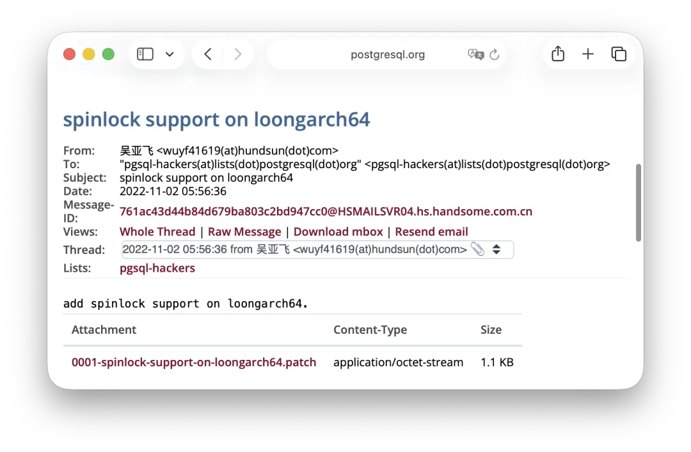

Tom Lane 当天下场，跟 Andres Freund 过了几轮招，把方案做得更彻底——没有专门实现的架构，一律回退到 GCC 内置的原子操作——当天提交，一劳永逸。从那时起，PostgreSQL 内核跑在龙芯上，就再没有什么障碍了。

真正卡住的，是内核下面的那一层：操作系统、软件包、构建基础设施。一句话——PGDG 仓库。

PostgreSQL 是开源软件，理论上谁都能下载源码自己编译。但“能编出来”和“能在生产环境里放心用”，是完全的两回事。绝大多数用户不会手搓 PostgreSQL，大家用的都是 PGDG——PostgreSQL Global Development Group，PG 全球开发组——维护的官方软件仓库：Debian/Ubuntu 用户用 APT 仓库，红帽系用户用 YUM 仓库。

这些仓库里不光有 PostgreSQL 内核，还有一整套扩展生态、客户端、连接池与周边工具，以及各种依赖库。版本更新、安全修复、依赖关系、不同 PG 大版本之间的兼容矩阵，几万个制品，全都在同一套构建发布体系里维护。

所以对一个新 CPU 架构来说，真正重要的从来不是“有人成功编译过 PG 内核”，而是它有没有进入上游的持续构建、签名发布和安全更新链路。

现在，在装好 [Loong13——面向 LoongArch 的 Debian 13](https://loong13.debian.net/) 的龙芯机器上配好 PGDG 软件源，然后：

```bash
sudo apt update
sudo apt install postgresql-18
```

这两条命令本身平平无奇。真正有意义的是：从今天起，龙芯用户也可以走这条全世界通用的标准路径了。

---

## 2024：一条门缝

2024 年 5 月，我[第一次去温哥华参加 PGConf.Dev](/pg/pgcondev-2024/)——PG 开发者大会改组之后的第一届。

出发前，我被类老板拉进了一个微信群。群里有龙芯中科的孟总，中国 PG 分会的白总和魏总，还有类总——一位非常纯粹的龙芯爱好者，自己花钱攒龙芯机器、做评测、写文章，四处张罗生态里的事。他们看我要去参会，托我去问一件事：

> 能不能让 PostgreSQL 官方仓库，也支持龙芯？

我说，行，我帮你们问问。

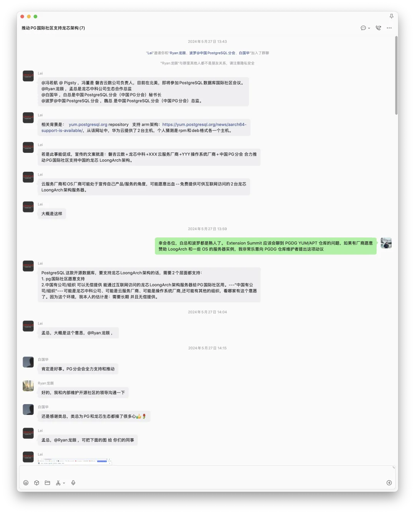

到了温哥华，我先找到 PGDG RPM 仓库的维护者 Devrim。他的回答很干脆：No。理由也很实际：PGDG 的 RPM 包构建在 RHEL、CentOS、Rocky 这套 EL 系操作系统上，而这些 Linux 发行版当时压根不支持龙芯。操作系统都跑不起来，官方仓库自然无从谈起。

随后我又找到 Debian 侧打包的 Tomasz Rybak。他留了一道门缝：Debian 社区正在推进 LoongArch 移植，等 Debian 真正支持龙芯之后，PostgreSQL 的 Debian 软件包有机会跟上。APT 这条路，有戏。

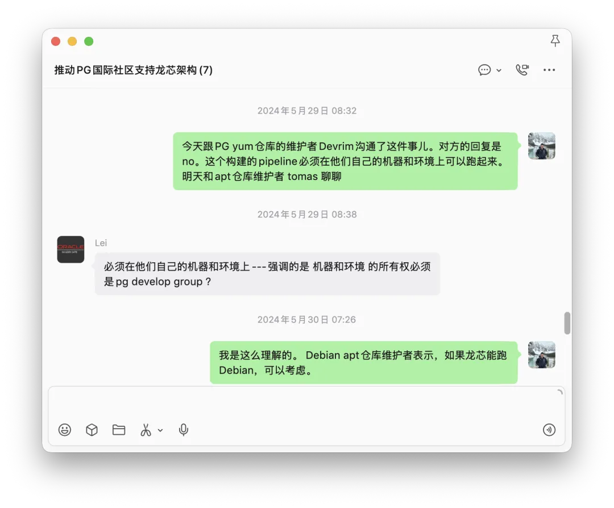

但 Debian 里的 PG 包和 PGDG 还是有区别的。真正管着 apt.postgresql.org 的人，是 Christoph Berg。很遗憾，那一年他没来。所以我从温哥华带回来的结论很清楚：内核没问题；YUM 没戏；APT 有可能——但一要等 Debian 的地基成熟，二要找到 Christoph 本人。我把这一段原原本本写进了当年的参会记，算是埋了个伏笔。

没想到这一埋，就是两年。

---

## 凭什么给你干活？

这里得说句大实话：让 PostgreSQL 官方仓库支持一个新架构，绝不是小活儿。PGDG 仓库里有几百个软件包、一个系统有几万个构建产物，打包、测试、集成、分发，样样都是持续投入。不是你发封邮件说一声“请支持龙芯”，人家就撸起袖子替你干活了。

我自己做 PostgreSQL 发行版，对此感触极深。光是给 Pigsty 加一个 ARM64 支持，就额外搭进去了大把功夫。老冯扪心自问：要是哪家 CPU 厂商跑来发邮件问，“Pigsty 能不能支持一下 XX 架构？”——s390x 也好，RISC-V 也好——99.99% 的情况下，我是不想理也不会理的。

原因很简单：费事，辛苦，而且摆明了没什么收益。

更微妙的是，就在眼前，还躺着一个血淋淋的先例。

2023 年 11 月 23 日，Christoph [官宣 apt.postgresql.org 新增 s390x 架构](https://www.postgresql.org/about/news/postgresql-on-s390x-on-debian-and-ubuntu-2752/)——IBM 大型机 Z 系列，构建机由 IBM 的 LinuxONE 社区云提供。（当时 LinuxONE 还送了老冯一台 2 核 8 GB 的小机器，拿来偶尔编几个 s390x 的包。）

然后呢？这台构建机从第一天起就不消停：I/O 和 CPU 性能太差，好端端的构建和测试频繁因为随机超时而失败，只能不停点重试。2025 年 2 月，Christoph [公开发牢骚](https://www.postgresql.org/message-id/Z7NOZfzU6_1L5VAr@msg.df7cb.de)：再改善不了，我们很可能把 s390x 从仓库里撤掉。

3 月 12 日正式挂起构建：并行度从 8 降到 2 才勉强稳住，构建队列却经常积压到八个小时；IBM 表示没有资源把机器迁去更好的地方。到了 5 月，他干脆把话挑明：“除非出现奇迹，7 月底 s390x 就从仓库移除。”

奇迹没有出现。7 月 31 日，[s390x 被正式移除](https://www.postgresql.org/message-id/aItWGvIAWFEsLqds@msg.df7cb.de)，扔进了 apt-archive 归档。Christoph 的总结相当幽默：“这是个不错的实验，但成本除以用户数的比值，是无穷大。”——言下之意，用户数为零。

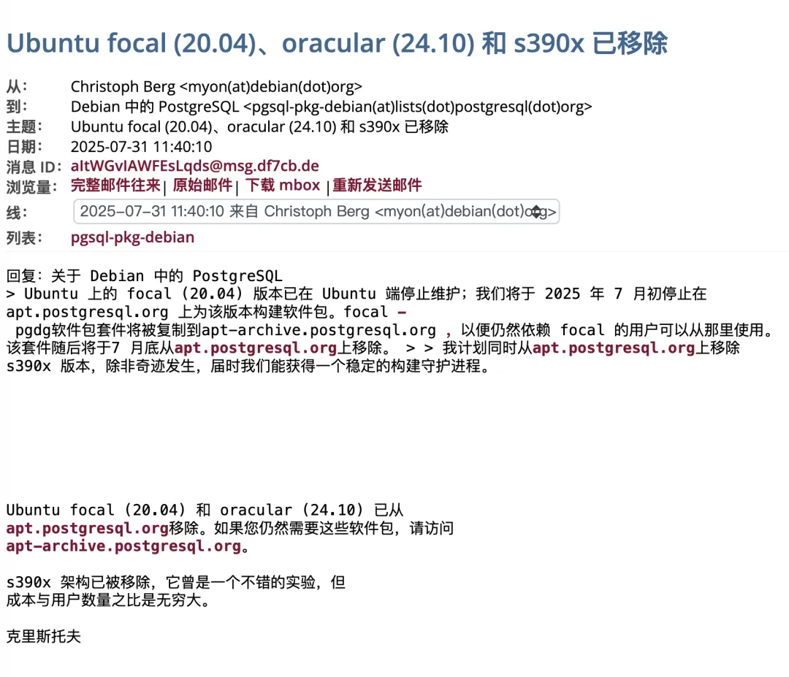

最好笑的是尾声：当年 9 月，Arenadata 的工程师[跑来报告 Ubuntu 22.04 的 s390x 仓库坏了](https://www.postgresql.org/message-id/aLbxGYOjIULk99jz@msg.df7cb.de)，Christoph 回复：s390x 已经停了——“你是有史以来第一个报告在用这个架构的人。”

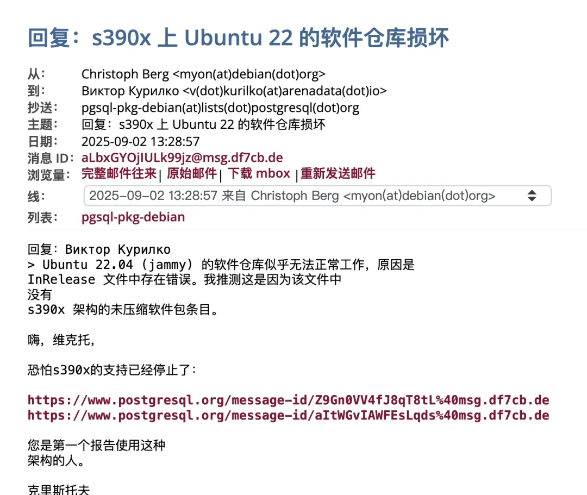

一场活了 20 个月的实验，就此谢幕。所以 Christoph 前脚刚被 IBM 的大型机坑完。连 IBM 的 CPU 都是这个下场，凭什么相信一个中国国产 CPU 会不一样？

---

## 2026：把人和机器对上

2025 年，PGConf.Dev 在蒙特利尔举办，Christoph 还是没来。2026 年 5 月，大会回到温哥华，又赶上 PostgreSQL 项目三十周年，老面孔新面孔基本都到齐了——我终于当面逮到了 Christoph。

这两年我也没闲着。老冯维护的 Pigsty 扩展仓库，如今已是 PG 世界最大的扩展仓库：收录 555 个 PG 扩展，自己维护的扩展包差不多是 PGDG 官方的两三倍，APT/YUM 双线供应，覆盖 16 个 Linux 发行版大版本。在 PG 扩展打包这个领域，算是坐稳了全球头把交椅——要论谁最清楚 Christoph 和 Devrim 手头这摊活的分量，大概没有人比我更清楚。

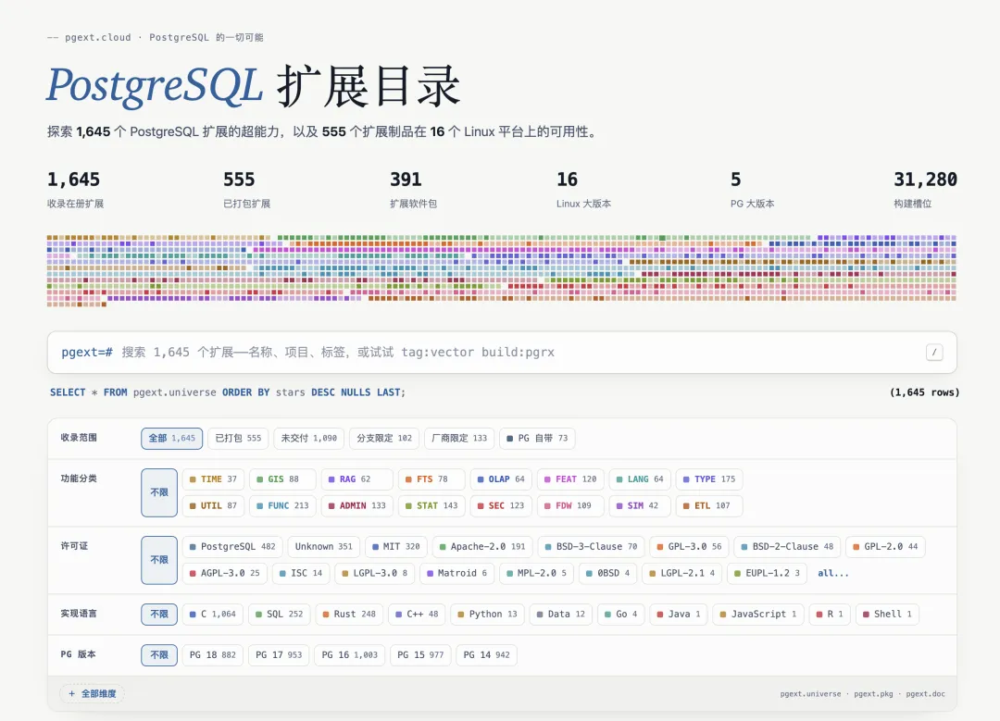

所以虽是初次见面，我们却像老伙计一样聊了一大圈：怎么把 Rust 扩展也弄进官方仓库，要不要给扩展下载加个统计，Codex 用来做测试维护打包体验如何。Christoph 说他一直想搞一个 PG 扩展目录，我说巧了，这个我已经做好了——掏出来给他看，他连连点头，说做得真不错。接着又聊了 PG 贡献者、中国用户、中国 PostgreSQL 生态的种种。

聊得差不多，气氛到位了，我把话头引到龙芯上。

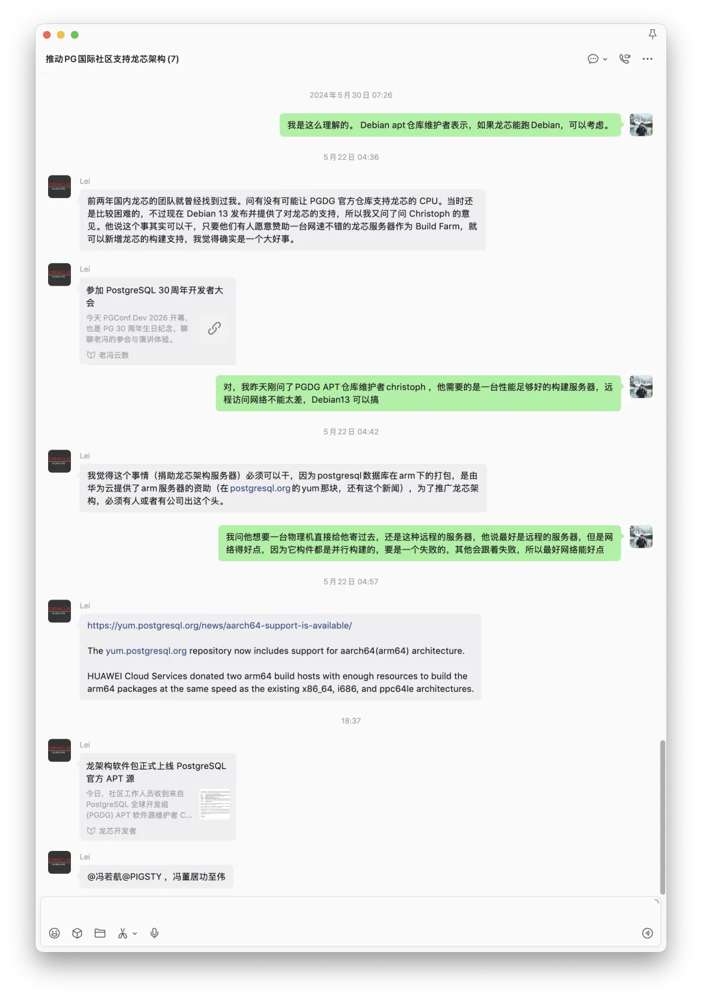

我先给 Christoph 哐哐一顿夸——夸得真心实意：PGDG 仓库是我的上游，Devrim 的 YUM 仓库隔三差五出点幺蛾子，而 APT 仓库极少出事，质量确实过硬。（讽刺的是，话音未落——就在此刻，APT 仓库恰好有个基础依赖版本 break 了，正是公告里 PostGIS 那个小尾巴。夸人不能夸太满。）

然后我摆出正题，理由讲了三层。

其一，Tomasz 觉得走 Debian 官方仓库这条路可行，但依我看，与其把 PG 包放进 Debian 仓库，不如直接进你的 PGDG APT 官方仓库——版本更全、更新更快，那才是生产用户真正依赖的东西。

其二，需求是真实存在的。中国的政企采购里用了大量龙芯，但因为一直没有官方的 PostgreSQL 软件包，市面上一堆换皮魔改 PG 的“国产数据库”趁虚而入，把水搅得很浑。用户一直在呼吁，希望能有一个官方的、干净的选择。龙芯不像 IBM Z 那种老古董，有着真实且活跃的用户社区，我就是来转达中国龙芯社区的用户呼声。

其三，可行性也不差。你做过 s390x，一个新架构该踩的坑都踩过一遍了，轻车熟路；具体的移植适配活，现在还有 AI 可以搭把手，成本和复杂度完全可以控制，我能找到人给你赞助服务器。此前，[PGDG YUM 对 aarch64 的支持](https://yum.postgresql.org/news/aarch64-support-is-available/)，就是由华为云捐赠构建主机促成的。

他听完觉得有道理，但提了个实际问题：手头没有龙芯的机器。我说这好办，我给你搞一台——云服务器还是物理机，你挑，物理机可以直接寄过去。他说，行，先弄台云服务器试试。反正网速必须得好，不要再弄得像 IBM s390x 那个一样。

这事就这么定了。回来之后，我把龙芯的朋友和 Christoph 直接对接到了一起，走邮件沟通。龙芯社区的朋友先找了一台国内的龙芯云主机，很快发现网速和稳定性都不够看。官方仓库的构建不是偶尔手动跑一把，而是一整条持续构建流水线，网络一抖，后面一串包全得跟着遭殃——s390x 的前车之鉴，还热乎着呢。

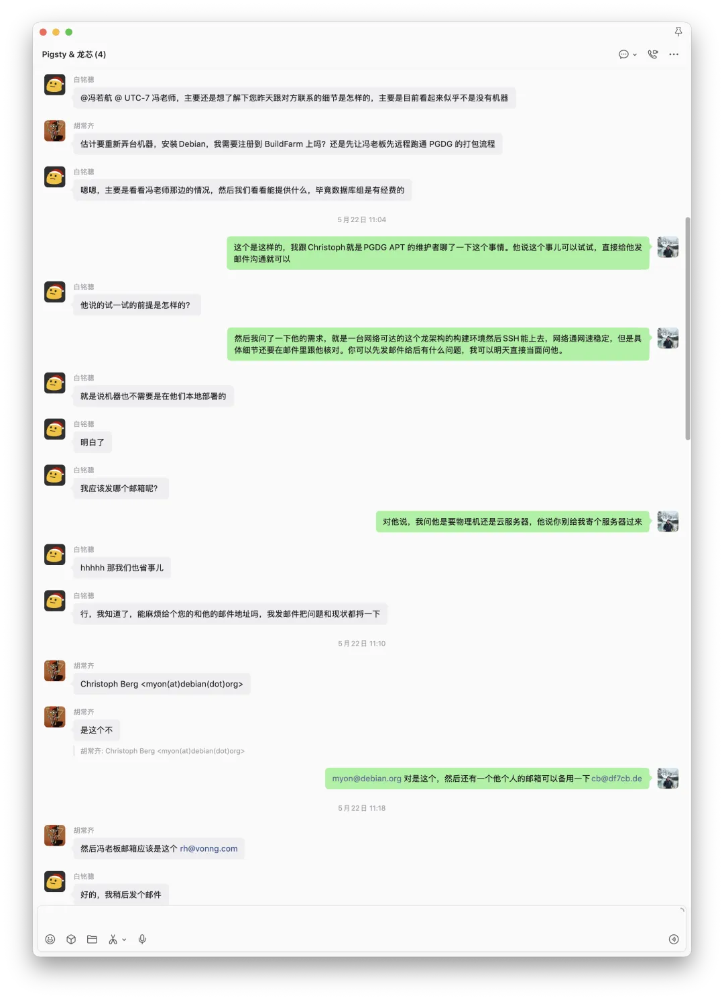

那就别折腾云了，直接上物理机。

最后，龙芯这边的朋友落实了一块 3B6000 主板，由 loongfans.cn 社区提供，径直寄到 Christoph 那里，成为 PGDG 的正式构建主机。从 5 月 22 日 PGConf.Dev，到 7 月 22 日官宣上线，整整两个月，这事儿闭环了。

---

## 从“能跑”，到“能维护”

这件事到底改变了什么？

以前在龙芯上跑 PostgreSQL，当然也不是不可能：内核自己编，缺什么库自己补，扩展一个个移植，依赖一个个捋。只要肯砸人力，理论上什么都能弄出来。

但生产环境最怕的，恰恰就是“理论上可以”。

数据库不是编译成功一次就完事了，后面还有小版本升级、安全更新、扩展兼容、依赖变更、生命周期维护。自己编一个 PG 内核不难，把一整套 PG 生态长期维护下去，才是真正的无底洞。

进了 PGDG 官方仓库，事情的性质就变了：它不再是一次性的野生适配，而是进入了和其他架构完全相同的软件包体系——同样的仓库、同样的包名、同样的签名机制、同样的更新节奏。PGDG APT 当前提供 PostgreSQL 13 到 18，外加测试版、开发版和一大批扩展与周边应用，而 loong64 如今就在它的正式支持架构列表里，有着“官方仓库”的信用背书。

对在信创环境里干活的 DBA 来说，这意味着少掉一大堆毫无价值的手工劳动。对我自己来说，今后真有用户要在龙芯上跑 PostgreSQL、跑 Pigsty，最底下软件包这条路，已经铺通了。当然，这次打通的只是 APT 这半边。YUM 仓库还得等 EL 系操作系统真正支持龙芯，那是另一场更长的马拉松，急不来。先把这一半走通已经很好了。

细数各路国产 CPU，除了走天然搭便车 x86、ARM 授权路线的，龙芯大概是第一个以“自主架构”的身份走出国门、拿到顶流开源基础软件原生支持的国产 CPU——先是[成为 Debian 官方支持架构](https://lwn.net/Articles/1051576/)，如今再成为 PostgreSQL 官方仓库支持的架构，这是实打实的从零到一。

---

## 在全球开源生态里发挥影响力

老冯以前写过一些文章批评过某些信创生意。尤其在数据库这个行当，一堆换皮魔改 PG 的“自研数据库”，除了把水搅浑什么也没留下。但破要破，立也要立。正确的路子是什么？我的答案是：融入全球开源社区，到最大的生态里去，发出中国工程师的声音，获取话语权与影响力。

[基础软件到底需要什么样的自主可控？](/db/sovereign-dbos/)

这话听着大，拆开来全是小事。推动 PostgreSQL 跟进 GB 18030—2022 字符集国标，是 2024 年那届大会上我当面向核心组提的；把中国开发者写的 PG 扩展与工具拉进仓库，推向全球，一直在干；让官方仓库支持国产 CPU，就是今天这一桩。没有哪件惊天动地，但每一件都是真的。

开源世界的硬通货只有一种，叫信任。信任没法靠新闻稿制造，只能靠交付积累：一封当天就被上游采纳的补丁邮件，一批按时发布的软件包，一台寄到后稳定运行的构建机。发起倡议的类总攒一点，Debian 维护者们攒一点，loongfans 的朋友们攒了一点，龙芯中科和 PG 分会的各位攒了一点，我也攒了一点。攒够了，两年前那扇只留一道缝的门，就开了。

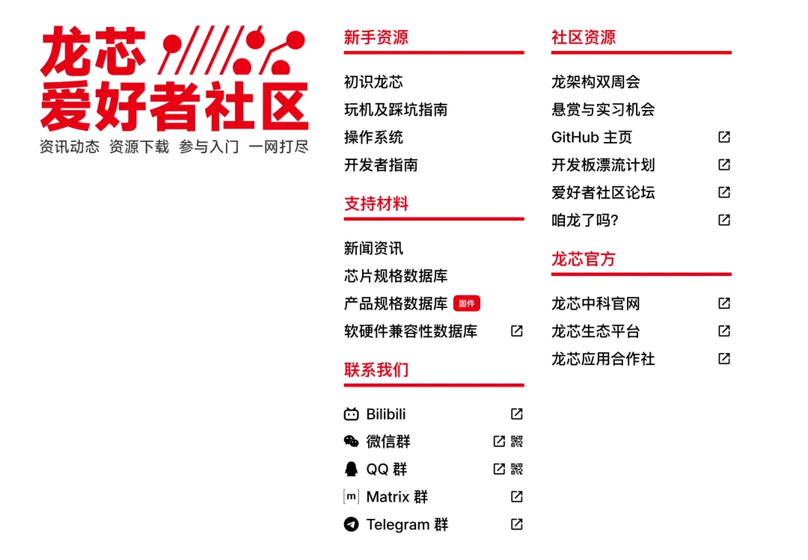

这里没有发布会，没有奖牌，也没有谁的名字刻在目录上。但对基础软件来说，这大概是最硬的一种承认：从今以后，每一次 PostgreSQL 版本更新，每一次软件包重新构建，每一次安全修复，龙芯都在正式的队列里。

两年前，我带去温哥华的是一个问题。

两年后，这个问题变成了一条路。

桥的价值，不在于桥头立着谁的碑，而在于后来的人还能从这里走过去。下一个国产架构、下一个中国扩展、下一个想进入全球上游的项目，至少已经知道：

路不是没有，只是要有人真的去走。

这一次，`loong64` 走进去了。

---


*龙芯爱好者们可以多用用，欢迎邮件反馈问题。我跟 Christoph 打包票说龙芯有人用。可别跟 IBM S390 一样一个用的都没有，又被下架了，那就尴尬了。*
