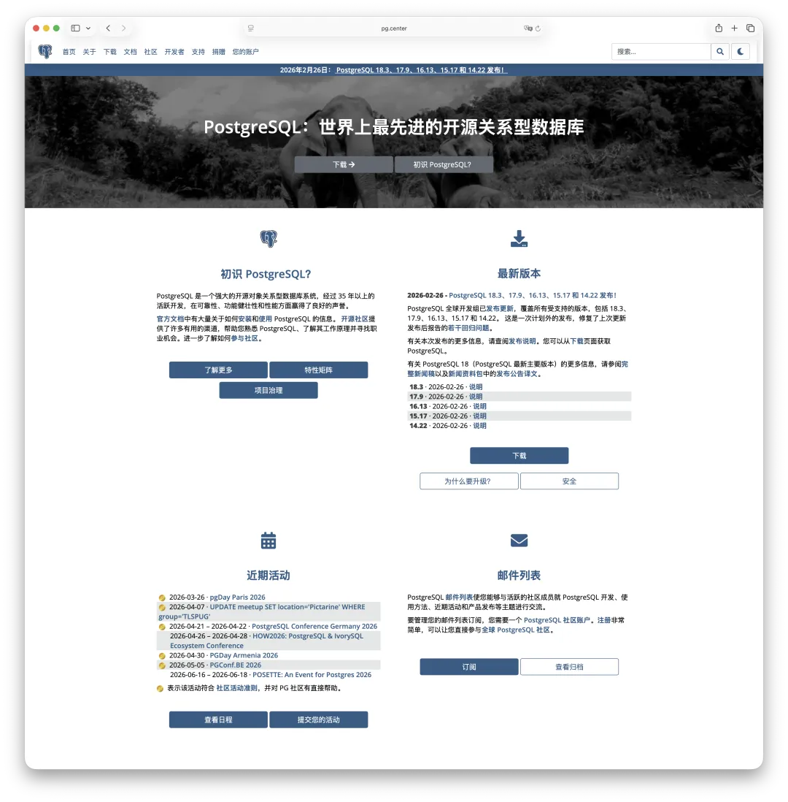
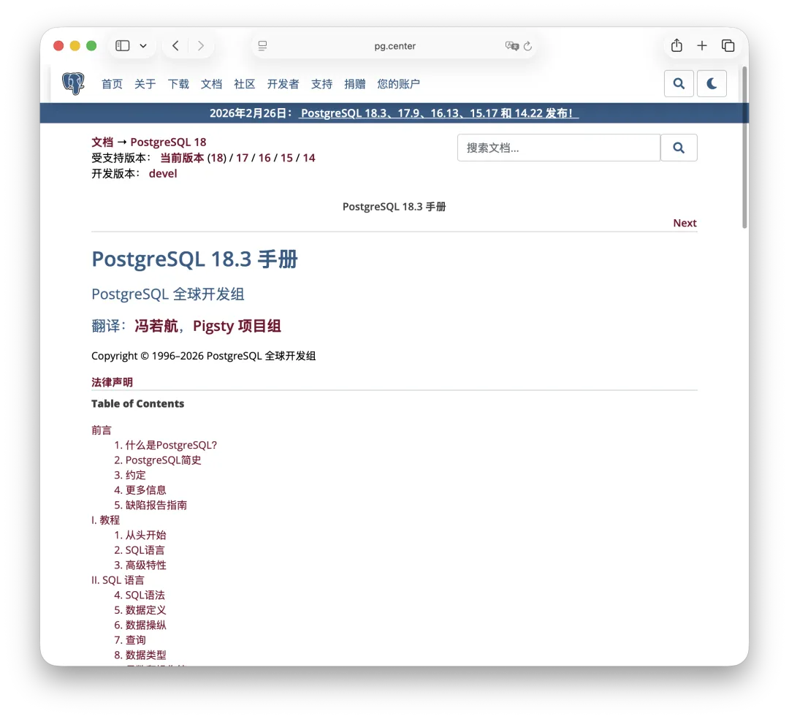
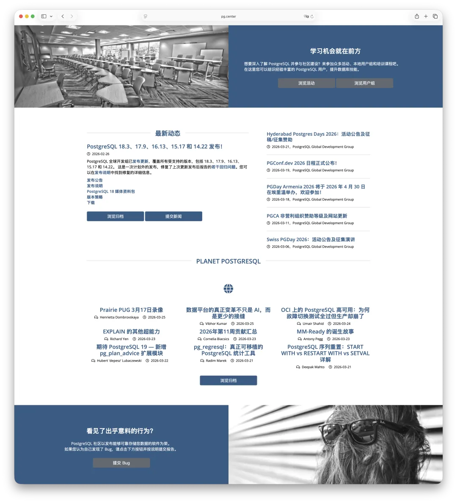
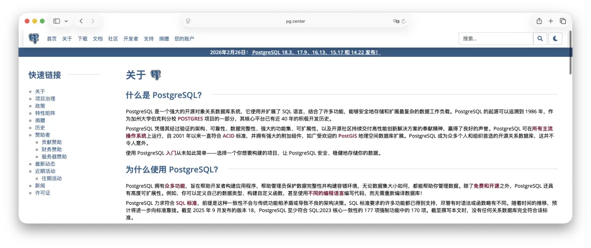
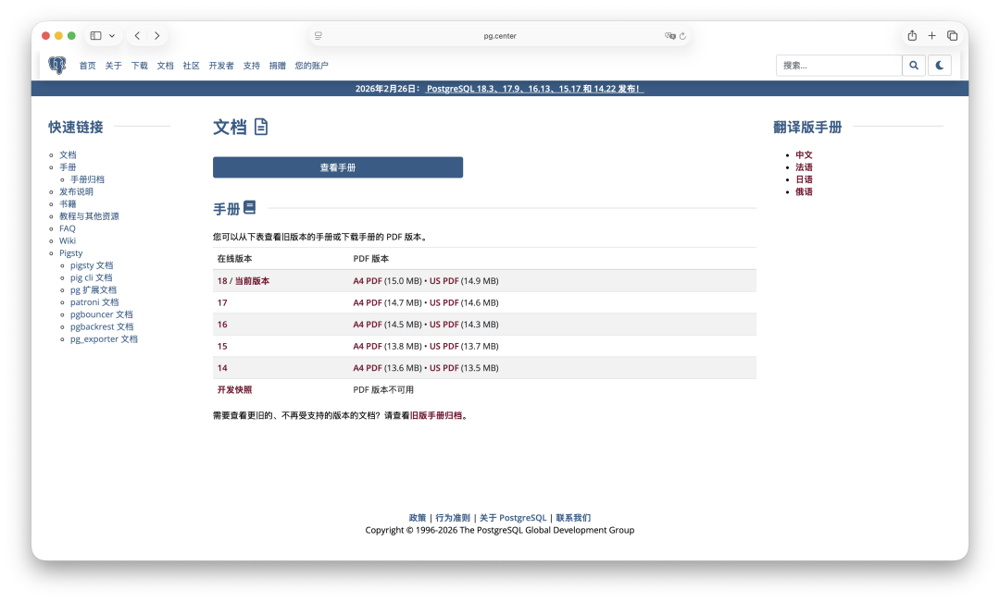

用 PostgreSQL 这么多年，有一件事一直让我觉得遗憾：`postgresql.org` 官网一直没有中文版。

作为世界上最先进的开源数据库，PostgreSQL 的官方网站承载着项目介绍、版本发布、官方文档、社区活动、开发者资源等核心信息。对于英文用户来说，这是一站式的信息中枢；但对于国内广大的 PG 用户而言，语言门槛始终横亘在那里。

所以我做了一件事：**把 `postgresql.org` 整个 fork 了一份中文版。**

域名是：**[pg.center](https://pg.center/)**。

包括当下缺失的 PG 18 中文文档，也随它一同发布了。

------

## 做了什么？

简单来说，pg.center 是 [postgresql.org](https://www.postgresql.org/) 的完整中文镜像。不是只翻译了几个页面，而是把整个站点的框架和内容都做了汉化：

**首页**：PostgreSQL 的项目介绍、最新版本发布、近期社区活动、Planet PostgreSQL 博客聚合，全部中文。

**关于**：PostgreSQL 是什么、为什么要用、核心特性列表、项目治理结构，共一百三十多个页面。你再也不用对着英文页面给领导解释“为什么选 PG”了。

**文档**：这是最重要的部分。`pg.center/docs` 提供 PostgreSQL 14 到 18 全版本的官方手册入口。其中 PostgreSQL 18.3 的中文文档，是我烧完两周 Codex / Claude MAX 订阅额度后精翻出来的一个全新中文版本。

同时，我还在侧边栏整合了 PG 生态组件的中文文档链接，包括 Pigsty 本体、PIG CLI、PostgreSQL 扩展插件、Patroni、PgBouncer、pgBackRest、pg_exporter 的文档，方便一站式查阅。这些也是其他地方很难一次看全的资源。

**新闻与活动、下载、社区、开发者、支持**：版本发布公告、社区活动日程、安全通告，这些信息过去你可能要翻墙，或者等别人转述；现在直接看中文就行，全部汉化到位。

------

## 为什么要做这件事？

PostgreSQL 在中国的用户群体已经非常庞大了。从互联网公司到传统企业，从云厂商到独立开发者，越来越多人在用 PG。但一个尴尬的现实是：很多人用了好几年 PostgreSQL，却从来没有认真浏览过官网。

原因很简单：全是英文。

官方文档是 PostgreSQL 最被低估的资源。它写得极好，结构清晰、示例丰富、覆盖面广，从入门教程到内核原理，从 SQL 语法到管理维护，几乎无所不包。但语言障碍让很多人望而却步，转而去搜百度、看博客、问 ChatGPT，得到的答案质量参差不齐。

之前 PostgreSQL 中文社区确实有一个网站 `postgres.cn`，但基本不怎么维护更新，该有的信息也都没有。之前我一直想推动它改版升级，跟上 PG 全球官网的演进，奈何尾大不掉，不如另起炉灶。

pg.center 的目标很简单：**降低门槛，让中文用户能以最低成本获取 PostgreSQL 的官方信息。**

不需要翻墙，不需要英文，打开 pg.center 就是中文。

而这，将是 PostgreSQL 中文社区重生与复兴的第一步。

------

## 一些细节

- 域名 `pg.center` 很好记：PG 中心。
- 网站结构与 `postgresql.org` 完全一致。如果你熟悉官网的导航逻辑，切换过来几乎零学习成本。
- 新闻和版本发布信息会持续同步更新，后续我们也会做定时 RSS 同步。
- 文档页面额外整合了 PG 生态里的关键组件与扩展，也会持续维护。
- 不会有乱七八糟的广告。如果你做的是 PG 相关的产品、项目、服务或供应商，也欢迎添加到信息目录中来。

------

## 写在最后

我翻译过《DDIA》，做过 Pigsty，也写过无数篇 PostgreSQL 技术文章。这些事情背后的底层逻辑都是一样的：**让好东西被更多人看到、用上、用好。**

PostgreSQL 官网的中文化，是这个链条上一直缺失的一环。现在，这一环补上了。

如果你觉得有用，欢迎转发给身边用 PG 的朋友。

------

> **[pg.center](https://pg.center/)**  
> PostgreSQL 官方网站中文版，打开即用，无需翻墙，持续更新。
