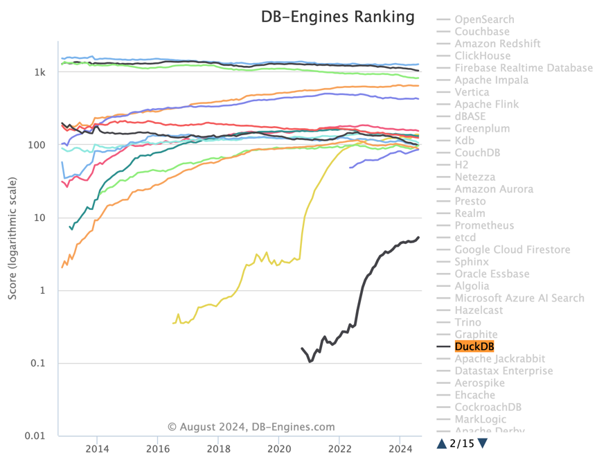
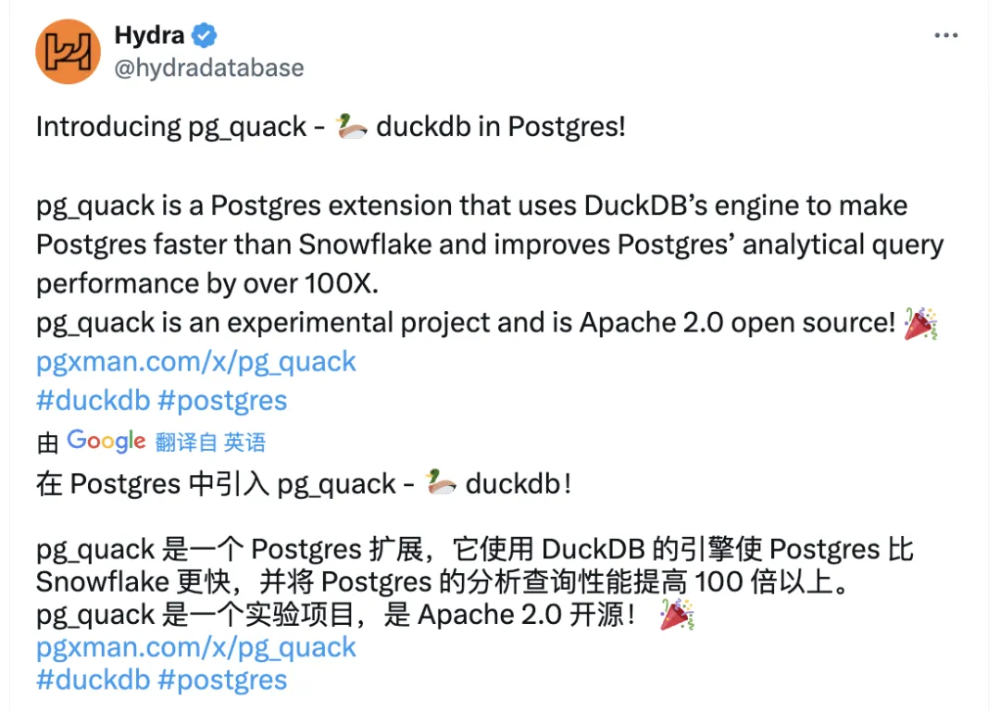
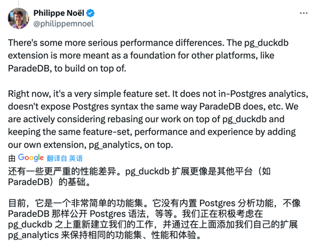

In my article "[PostgreSQL is Eating the Database World]," I posed this question: **Who will ultimately unify the database world?** I believe it's the PostgreSQL ecosystem with various extensions — and my judgment is that to conquer OLAP, the largest and most significant independent database kingdom, this analytical extension must be related to **DuckDB**.

PostgreSQL has always been my favorite database, but my second favorite database has changed from Redis to DuckDB over the past two years. DuckDB is a very compact yet powerful **embedded** OLAP analytical database that achieves extreme levels of analytical performance and usability, with extensibility second only to PostgreSQL among all databases.

Just like the vector database extension race two years ago, the current PostgreSQL ecosystem extension competition has begun revolving around DuckDB — "***Whoever better integrates DuckDB in PostgreSQL wins the future of the OLAP world***." Although many players are already gearing up, DuckDB's official entry into the game undoubtedly announces that this competition is about to enter white-hot territory.

--------

## DuckDB: The Rising OLAP Challenger

DuckDB was developed by Mark Raasveldt and Hannes Mühleisen, two database researchers at the National Research Institute for Mathematics and Computer Science (Centrum Wiskunde & Informatica, CWI) in Amsterdam, Netherlands. CWI is not just a research institution — it can be called the driving force and contributor behind analytical database development, pioneering columnar storage engines and vectorized query execution. The various analytical database products you see today — ClickHouse, Snowflake, Databricks — all have CWI's influence behind them. Incidentally, Python's creator Guido van Rossum also created the Python language while at CWI.

However, now these analytical field pioneers have personally entered the analytical database arena themselves, choosing an excellent timing and ecological niche to create **DuckDB**.

DuckDB's origin comes from the authors' observations of database user pain points: data scientists mainly use tools like Python and Pandas, aren't very familiar with traditional databases, and often get confused by connection setup, authentication, and data import/export tasks. So is there a way to create a simple, easy-to-use embedded analytical database for them — just like SQLite?

DuckDB's entire database software source code is just one header file and one C++ file, compiling to a single independent binary, with the database itself being just a simple file. It uses a PostgreSQL-compatible parser and syntax, making it simple with almost no learning curve. Although DuckDB looks very simple, its most remarkable feature is — **simple but not simplistic, with analytical performance that dominates the field**. For example, on ClickHouse's home turf ClickBench, it has performance that can beat the host ClickHouse.

Another highly commendable point is that because the authors' salaries are paid by government taxes, they believe providing their work results freely to anyone is their responsibility to society. Therefore, DuckDB is released under the very permissive MIT license.

--------

I believe DuckDB's rise is inevitable: a database with top-tier performance while having an extremely low usage barrier, plus being open-source and free, would be hard not to become popular. In StackOverflow's 2023 developer survey, DuckDB entered the "Most Popular Databases" list for the first time with 0.61% usage (29th place, fourth from bottom). Just one year later, in the 2024 developer survey, it achieved 2.3x growth in popularity, advancing to (1.4%) very close to ClickHouse (1.7%).

Meanwhile, DuckDB has also earned excellent reputation among users, with its popularity and favorability among developers (69.2%) second only to PostgreSQL (74.5%) among major databases. If we observe DB-Engine's popularity trends, it's easy to see its soaring growth trend starting mid-2022 — while it can't compare with databases like PostgreSQL, it has already surpassed all NewSQL database products in popularity.

--------

## DuckDB's Shortcomings and Opportunities Within

DuckDB is a database that can be used independently, but it's more of an embedded analytical database. Being embedded has advantages and disadvantages — despite DuckDB's strongest analytical performance, its biggest shortcoming is weak data management capabilities — precisely those things data scientists dislike — ACID, concurrent access, access control, data persistence, high availability, database import/export, etc., which happen to be traditional databases' strengths and core pain points for enterprise analytical systems.

It's predictable that various DuckDB wrapper products will quickly appear in the market to solve these frictions and gaps. Just like when Facebook open-sourced the KV database RocksDB, countless "new databases" wrapped RocksDB with a layer of SQL parser and claimed to be next-generation databases to raise money — Yet another SQL Sidecar for RocksDB.
After the vector retrieval library hnswlib went open-source, countless "specialized vector databases" wrapped it with a thin layer and went to market to raise money. Then after search engines Lucene and next-generation replacement Tantivy went open-source, countless "full-text search databases" came to wrap and sell them.

Actually, this has already happened in the PostgreSQL ecosystem. Before other database products and companies could react, the PostgreSQL ecosystem already has five players in the race, including ParadeDB's `pg_lakehouse`, domestic individual developer Li Hongyan's `duckdb_fdw`, CrunchyData's `crunchy_bridge`, Hydra's `pg_quack`; and now MotherDuck's original factory has also come to make PostgreSQL extensions — `pg_duckdb`.

--------

## The Second PostgreSQL Extension Speed Race

This reminds me of the vector database extension example in the PostgreSQL ecosystem over the past year. After AI exploded, the PostgreSQL ecosystem saw at least six vector database extensions emerge (`pgvector`, `pgvector.rs`, `pg_embedding`, `latern`, `pase`, `pgvectorscale`), competing fiercely and raising the bar. Eventually, `pgvector`, with major investment backing from vendors like AWS, had already destroyed and flattened the entire specialized vector database segment before other databases like Oracle/MySQL/MariaDB came out with their belated, half-hearted versions.

So who will become the PGVECTOR of the PostgreSQL OLAP ecosystem? My personal judgment is still that the original manufacturer beats fan-made products. Although `pg_duckdb` just emerged and hasn't even released v0.0.1 yet, from its architectural design, it's not hard to judge that it will likely be the final winner. Actually, this ecosystem race track just started and immediately showed signs of convergence:

Originally, Hydra (YC W22), which forked Citus's columnar extension, immediately abandoned its original engine after trying to build `pg_quack` and feeling DuckDB's shock, partnering with MotherDuck to create `pg_duckdb`. The extension combining Hydra's PostgreSQL ecosystem experience with the DuckDB original factory can directly read PostgreSQL data tables smoothly within the database and use the DuckDB engine for computation, while directly reading Parquet/IceBerg format files from filesystem/S3, achieving lakehouse effects.

Similarly, YC-funded startup database company ParadeDB (YC S23), after trying to build similar analytical products `pg_analytics` with Rust and achieving decent results, also chose to switch directions, building the `pg_lakehouse` extension based on DuckDB. Of course, founder Philippe immediately announced surrender after `pg_duckdb` was just announced, preparing to develop further based on `pg_duckdb` rather than competing.

Domestic individual developer Li Hongyan's [`duckdb_fdw`](https://ext.pgsty.com/zh/e/duckdb_fdw) is another path taking a different approach. Instead of directly using PostgreSQL's storage engine interface, it uses the Foreign Data Wrapper (FDW) infrastructure to connect PostgreSQL and DuckDB. This triggered official criticism, using it as a negative example, perhaps motivating MotherDuck to enter the field personally: "I'm still conceiving great blueprints on how to merge PostgreSQL and DuckDB's power, but you're moving too fast — let me show you some official shock."

As for CrunchyData's `crunchy_bridge` or other database companies' closed-source wrapper extensions, I personally feel they're unlikely to succeed.

--------

Of course, as the author of the PostgreSQL distribution Pigsty, my strategy has always been — you race your horses, I'll package and distribute all these extensions to users, letting users choose and decide. Just like when vector databases rose, I packaged and distributed several of the most promising extensions like `pgvector`, `pg_embedding`, `pase`, `pg_sparse`. Regardless of who the final winner is, PostgreSQL and Pigsty are the ones reaping the benefits.

Speed conquers all. In Pigsty v3, I've already implemented these three most promising extensions: [`pg_duckdb`](https://ext.pgsty.com/zh/e/pg_duckdb), [`pg_lakehouse`](https://ext.pgsty.com/zh/e/pg_lakehouse), and [`duckdb_fdw`](https://ext.pgsty.com/zh/e/pg_duckdb/duckdb_fdw), plus the `duckdb` binary itself, ready to use out of the box, letting users experience the joy of PostgreSQL handling everything, truly HTAP dual-champion all-in-one combination — OLTP/OLAP all-conquering.