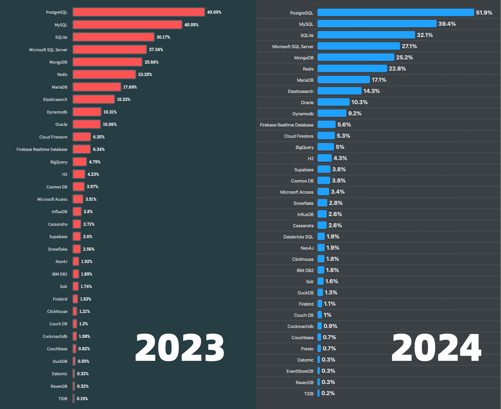
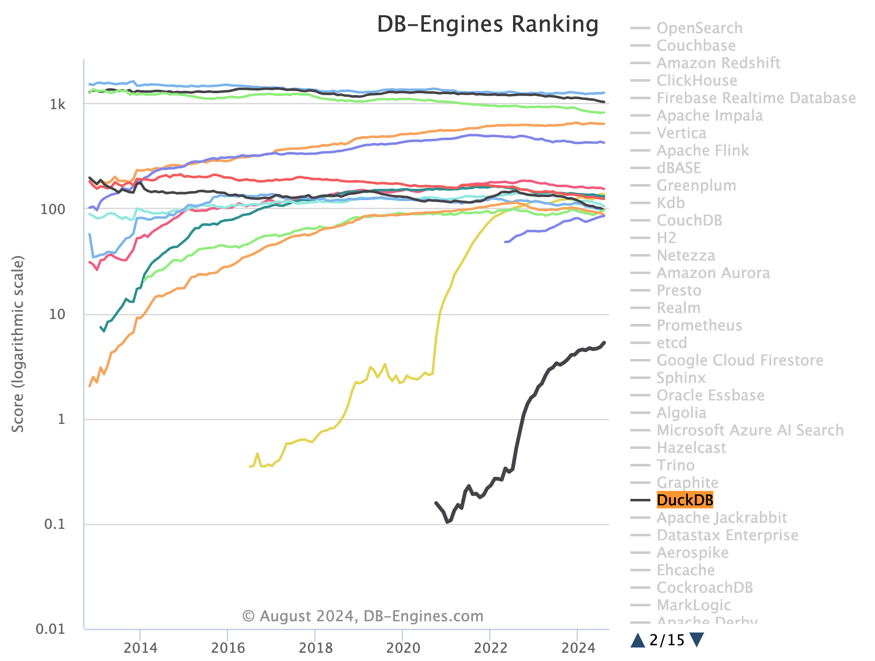
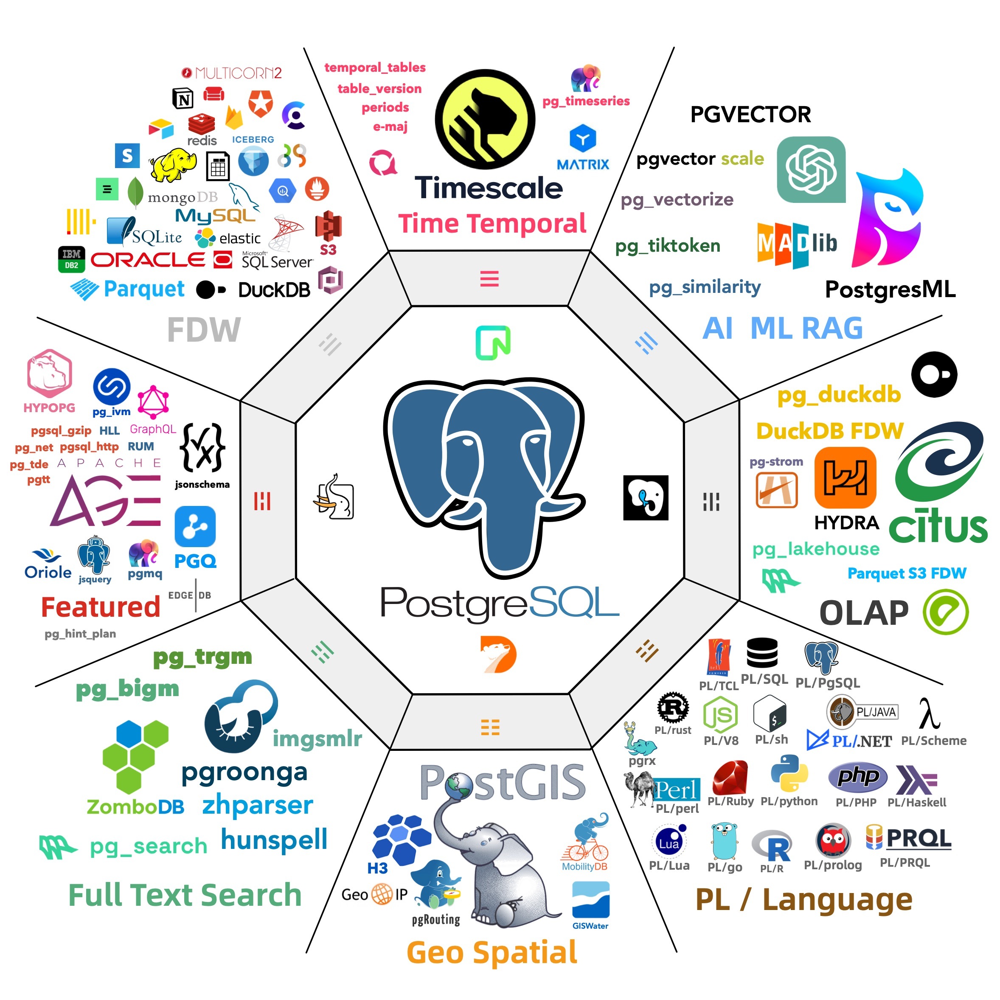
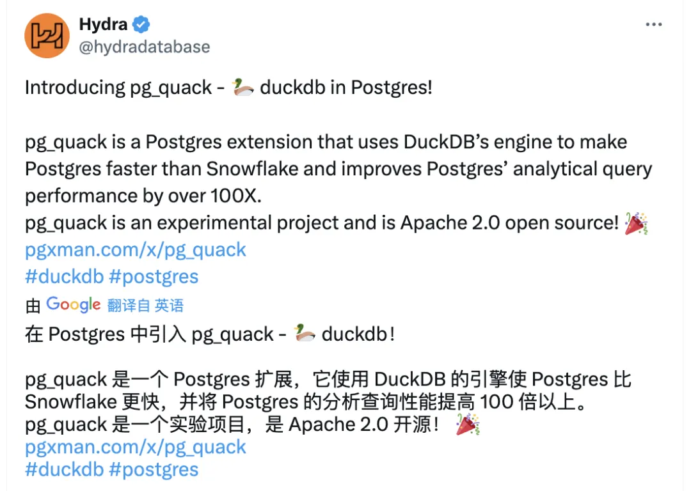
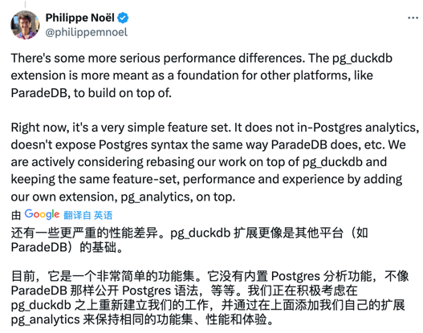

在 《PostgreSQL正在吞噬世界中》 一文中，我曾经抛出过这个问题：**谁会最终统一数据库世界？**。我认为是 PostgreSQL 生态与各种各样的扩展插件 —— 而我的判断是，要想征服 OLAP 这个最大也是最显著的数据库独立王国，这个分析扩展一定与 **DuckDB** 有关。

PostgreSQL 一直以来都是我最喜欢的数据库，然而我第二喜欢的数据库在这两年中从 Redis 变为了 DuckDB。DuckDB 是一个非常小巧且强大的 **嵌入式** OLAP 分析数据库，在分析性能、易用性上都做到了极致水平，并且在所有数据库中有着仅次于 PostgreSQL 的可扩展性。

正如两年前开展的向量数据库扩展插件赛马一样，当下 PG 生态进行的扩展竞赛已经开始围绕 DuckDB 进行 —— “***谁更好地在PG中整合DuckDB，谁就赢得OLAP世界的未来***”。尽管已经有许多玩家在摩拳擦掌，但 DuckDB 官方亲自下场，毫无疑问宣告着这场竞争即将进入白热化。

--------

## DuckDB：OLAP的新兴挑战者

DuckDB 是由 Mark Raasveldt 和 Hannes Mühleisen 两位数据库研究员在荷兰阿姆斯特丹的国家数学与计算机科学研究所（Centrum Wiskunde & Informatica, CWI）开发的。CWI 不仅仅是一个研究机构，可以说是分析型数据库领域发展背后的幕后推手与功臣，是列式存储引擎与向量化查询执行的先驱。现在你能看到的各种分析数据库产品 ClickHouse，Snowflake，Databricks 背后，都有 CWI 的影子。顺便一提，Python之父龟叔也是在 CWI 时创建 Python 语言的。

然而，现在这些分析领域的先锋们自己亲自下场来做分析数据库了，他们选择了一个非常好的时机与生态位切入，搞出了 **DuckDB** 来。

DuckDB 的起源来自作者们对数据库用户痛点的观察：数据科学家主要使用像 Python 与 Pandas 这样的工具，不怎么熟悉经典的数据库。经常被如何连接，身份认证，数据导入导出这些工作搞的一头雾水。那么有没有办法做一个简单易用的嵌入式分析数据库给他们用呢？ —— 就像 SQLite 一样。

DuckDB 整个数据库软件源代码就是一个头文件一个c++文件，编译出来就是一个独立二进制，数据库本身也就一个简单的文件。使用兼容 PostgreSQL 的解析器与语法，简单到几乎没有任何上手门槛。尽管 DuckDB 看上去非常简单，但它最了不起的一点在于 —— **简约而不简单，分析性能也是绝冠群雄**。例如，在 ClickHouse 自己的主场 ClickBench 上，有着能够吊打东道主 ClickHouse 的表现。

另外非常值得称道的一点是，因为作者的薪水由政府税收支付，他们认为将自己的工作成果免费提供给任何人是他们对社会的责任。因此，DuckDB 是在非常宽松的 MIT 许可证下发布的。

--------

我认为 DuckDB 的崛起是必然的：一个有着顶尖性能表现，而使用门槛低到地板，还开源免费的数据库，想不火都难。在 StackOverflow 2023 年的开发者调研中，DuckDB 以 0.61% 的使用率第一次进入“最流行的数据库” 榜单中（第29名，倒数第四），结果仅仅一年过去，在 2024 年度开发者调研中，它就实现了 2.3 倍的流行度增长，前进到（1.4%）与 ClickHouse （1.7%）非常接近的流行度。

同时，DuckDB 也在用户中攒下的极好的口碑，在开发者中受欢迎与喜爱的程度（69.2%）在主要数据库中仅次于 PostgreSQL  （74.5%）。如果我们观察 DB-Engine 的热度趋势，更是不难看出它在 2022 年中开始一飞冲天的狂飙增长态势 —— 虽然没法跟 PostgreSQL 这种数据库比，但目前甚至已经超过了所有 NewSQL 数据库产品的热度分了。

--------

## DuckDB的短板与其中的机遇

DuckDB 是一个可以独立使用的数据库，但更是一个嵌入式的分析数据库。嵌入式有好处也有坏处 —— DuckDB 尽管有着最强分析性能，但它最大的短板就在于薄弱的数据管理能力 —— 也就是数据科学家们不喜欢的那些东西 —— ACID，并发访问，访问控制，数据持久性，高可用，数据库导入导出，等等等，而这恰好是经典数据库的长处，也是企业级分析系统的核心痛点之一。

可以预期的是，市面上一定会很快出现一系列的 DuckDB 套壳产品来解决这里的摩擦与GAP。正好比当年 Facebook 开源了 KV 数据库 RocksDB ，无数 “新的数据库” 给 RocksDB 套了一层 SQL 解析器，就号称自己是新一代数据库去圈钱了 —— Yet another SQL Sidecar for RocksDB。
向量检索库 hnswlib 开源后，无数 “专用向量数据库” 给它套了薄薄一层皮，就去市场上圈钱了。然后搜索引擎 Lucene 和下一代替代 Tantivy 开源之后，又有无数“全文检索数据库”来给他们套壳贩卖。

实际上，这样的事情已经在 PostgreSQL 生态中发生了。在其他数据库产品和公司还没来得及反应之前，PG 生态已经有五个玩家下场赛马了，包括 ParadeDB 的 `pg_lakehouse`，国内个人开发者李红艳编写的 `duckdb_fdw`，CrunchyData 的 `crunchy_bridge`， Hydra 出品的 `pg_quack`；以及目前 MotherDuck 原厂也跑过来做 PG 扩展了 —— `pg_duckdb`。

--------

## 第二届PG扩展竞速比赛

这不禁让我想起了过去一年中，PG生态里向量数据库扩展的例子。AI爆火之后，PG 生态里就涌现出了至少六款向量数据库扩展（ `pgvector`，`pgvector.rs`，`pg_embedding`，`latern`，`pase`，`pgvectorscale`），并在你追我赶的赛马中卷出了新高度。最后 `pgvector` 在以 AWS 为代表的厂商大力投入加持之下，在其他数据库比如 Oracle / MySQL / MariaDB 姗姗来迟的糊弄版本出来之前，就已经把整个专用向量数据库细分领域给摧毁荡平了。

那么，谁会成为 PG OLAP 生态的 PGVECTOR 呢？我个人的判断还是原厂吊打同人，尽管 `pg_duckdb` 才刚刚新鲜出炉，甚至连 v0.0.1 版本都还没发布。但从其架构设计上，已经不难判断，它大概率会是最后的赢家。实际上这个生态赛道才刚刚展开，就立即有收敛的趋势了：

原本 Fork Citus 列存扩展的 Hydra （YC W22），在尝试构建 `pg_quack` 感受到 DuckDB 震撼后，立刻抛弃原有的引擎和 MotherDuck 合作，搞出来了 `pg_duckdb`。融合了 PG 生态经验的 Hydra 与 DuckDB 原厂弄的扩展，可以直接在数据库内丝滑地读取 PG 数据表，并使用 DuckDB 引擎进行计算，并且可以直接从文件系统/S3 上读取 Parquet / IceBerg 格式的文件，实现湖仓的效果。

同样是 YC 投的初创数据库公司 ParadeDB （YC S23），在尝试了自己用 Rust 构建类似的分析产品 pg_analytics 并取得了不俗的成绩之后，也选择改换了路线，基于 DuckDB 打造 pg_lakehouse 扩展。当然，创始人 Phillipe 在 pg_duckdb 刚刚官宣之后也立刻宣布投降，准备在 `pg_duckdb` 的基础上进行进一步的开发而不是当竞品。

国内个人开发者李红艳开发的 [`duckdb_fdw`](https://pgext.cloud/e/duckdb_fdw) 是另一条另辟蹊径的道路。不是直接利用 PG的存储引擎接口，而是直接用外部数据源包装器（FDW）的基础设施，将 PG 和 DuckDB 对接到了一起。这引发了官方亲自下场吐槽，将其作为反例批判，也许是 MotherDuck 亲自下场的一个动机：“我还在构思伟大蓝图，如何融合PG与Duck的力量，你小子动作也太快了，得给你一点官方震撼看看”。

至于 CrunchyData 搞的 `cunchy_bridge` ，或者其他数据库公司搞的闭源套壳扩展，我个人感觉是很难有出息的。

--------

当然，作为 PostgreSQL 发行版 Pigsty 的作者，我的策略始终是 —— 你们赛你们的马，反正所有这些扩展我都会打包并分发给用户，让用户自己选择与决策。就好比当初向量数据库崛起的时候一样，我就把 `pgvector` ，`pg_embedding`，`pase`，`pg_sparse` 等等这几个最有前途的扩展打包分发出去。不管谁是最后的胜利者，反正 PG 和 Pigsty 都是摘桃子的赢家。

天下武功，唯快不破，在 Pigsty v3 中已经实装了这三个最有前途的扩展插件： [`pg_duckdb`](https://pgext.cloud/e/pg_duckdb)，[`pg_lakehouse`](https://pgext.cloud/e/pg_lakehouse)，以及 [`duckdb_fdw`](https://pgext.cloud/e/duckdb_fdw)，当然还有 `duckdb` 二进制本体，开箱即用，让用户体验一个 PostgreSQL 包打天下，OLTP / OLAP 双冠全能王合体，真正 HTAP 的快乐。
