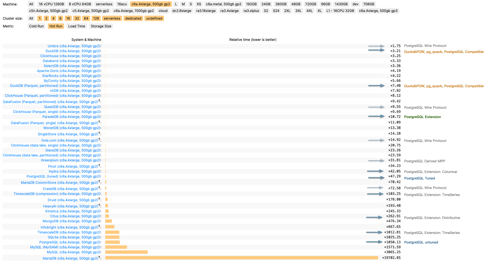
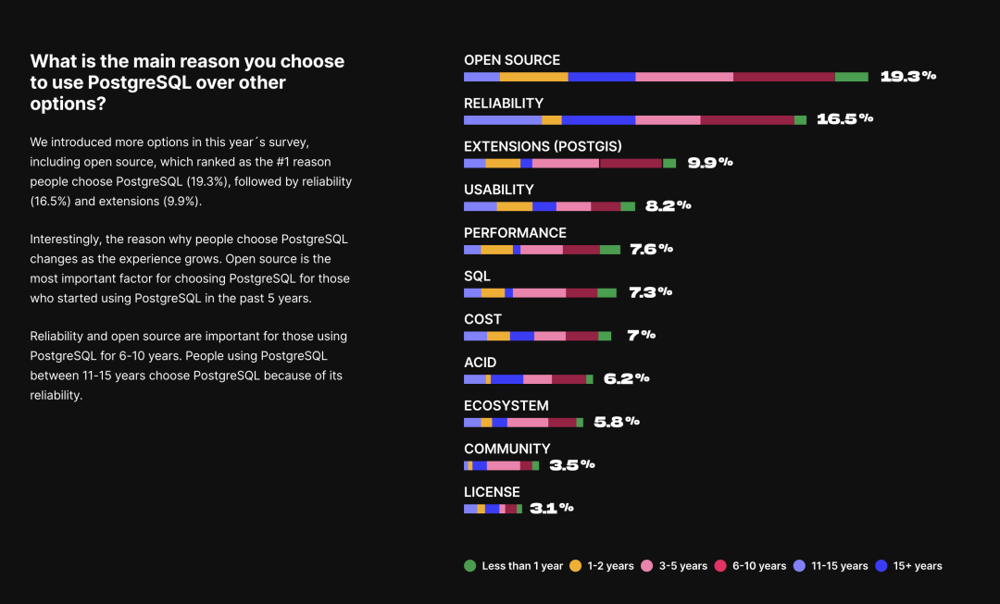
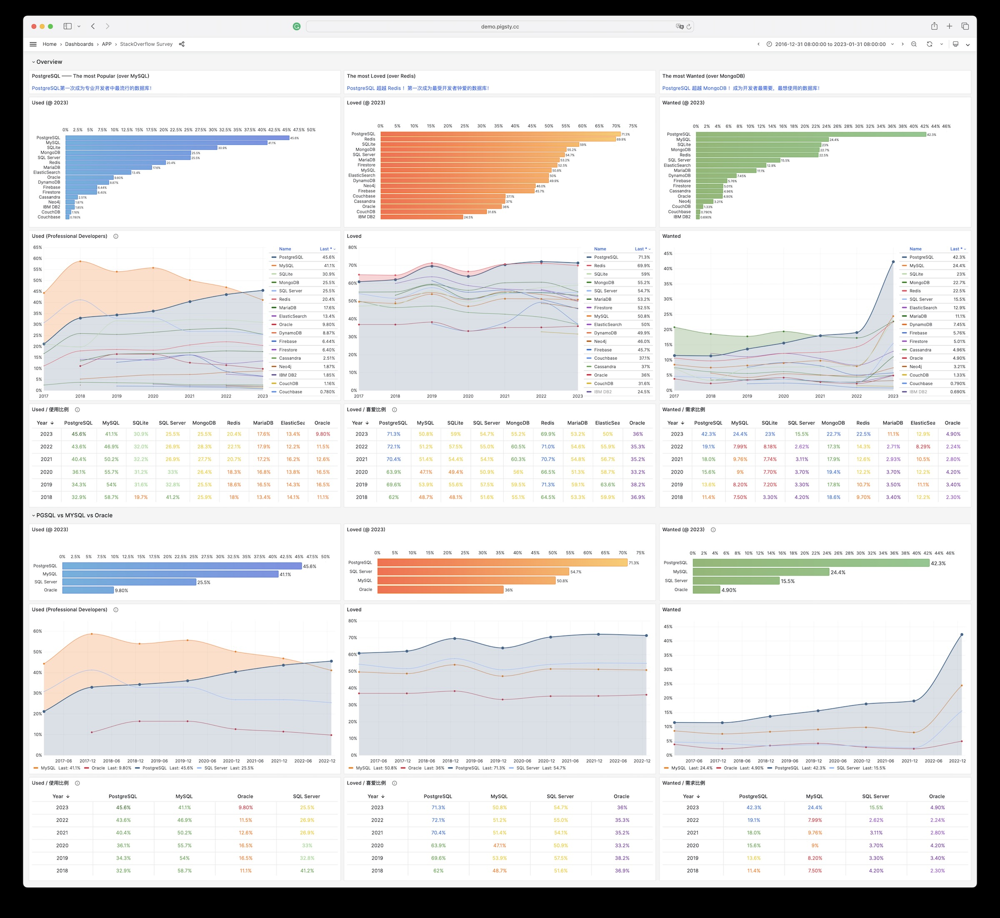

PostgreSQL isn’t just a simple relational database; it’s a data management framework with the potential to engulf the entire database realm. The trend of “Using Postgres for Everything” is no longer limited to a few elite teams but is becoming a mainstream best practice.

------

## OLAP's New Challenger

In a 2016 database meetup, I argued that a significant gap in the PostgreSQL ecosystem was the lack of a **sufficiently good** columnar storage engine for OLAP workloads. While PostgreSQL itself offers lots of analysis features, its performance in full-scale analysis on larger datasets doesn’t quite measure up to dedicated real-time data warehouses.

Consider [ClickBench](https://benchmark.clickhouse.com/), an analytics performance benchmark, where we’ve documented the performance of PostgreSQL, its ecosystem extensions, and derivative databases. The untuned PostgreSQL performs poorly (**x1050**), but it can reach (**x47**) with optimization. Additionally, there are three analysis-related extensions: columnar store **Hydra** (**x42**), time-series **TimescaleDB** (**x103**), and distributed **Citus** (**x262**).

> ClickBench c6a.4xlarge, 500gb gp2 results in relative time

This performance can't be considered bad, especially compared to pure OLTP databases like MySQL and MariaDB (**x3065, x19700**); however, its third-tier performance is not "good enough," lagging behind the first-tier OLAP components like Umbra, ClickHouse, Databend, SelectDB (**x3~x4**) by an order of magnitude. It's a tough spot - not satisfying enough to use, but too good to discard.

However, the arrival of [**ParadeDB**](https://www.paradedb.com/) and [**DuckDB**](https://duckdb.org/) changed the game!

**ParadeDB**'s native PG extension **pg_analytics** achieves second-tier performance (**x10**), narrowing the gap to the top tier to just 3–4x. Given the additional benefits, this level of performance discrepancy is often acceptable - ACID, freshness and real-time data without ETL, no additional learning curve, no maintenance of separate services, not to mention its ElasticSearch grade full-text search capabilities.

**DuckDB** focuses on pure OLAP, pushing analysis performance to the extreme (**x3.2**) — excluding the academically focused, closed-source database Umbra, DuckDB is arguably the fastest for practical OLAP performance. It’s not a PG extension, but PostgreSQL can fully leverage DuckDB’s analysis performance boost as an embedded file database through projects like [**DuckDB FDW**](https://github.com/alitrack/duckdb_fdw) and [**pg_quack**](https://github.com/hydradatabase/pg_quack).

The emergence of ParadeDB and DuckDB propels PostgreSQL's analysis capabilities to the top tier of OLAP, filling the last crucial gap in its analytic performance.

------

## The Pendulum of Database Realm

The distinction between OLTP and OLAP didn’t exist at the inception of databases. The separation of OLAP data warehouses from databases emerged in the 1990s due to traditional OLTP databases struggling to support analytics scenarios' query patterns and performance demands.

For a long time, best practice in data processing involved using MySQL/PostgreSQL for OLTP workloads and syncing data to specialized OLAP systems like Greenplum, ClickHouse, Doris, Snowflake, etc., through ETL processes.

> DDIA, Martin Kleppmann, ch3, The republic of OLTP & Kingdom of OLAP

Like many "specialized databases," the strength of dedicated OLAP systems often lies in **performance** — achieving 1-3 orders of magnitude improvement over native PG or MySQL. The **cost**, however, is redundant data, excessive data movement, lack of agreement on data values among distributed components, extra labor expense for specialized skills, extra licensing costs, limited query language power, programmability and extensibility, limited tool integration, poor data integrity and availability compared with a complete DMBS.

However, as the saying goes, "What goes around comes around". With [hardware improving over thirty years following Moore's Law](/blog/cloud/bonus), performance has increased exponentially while costs have plummeted. In 2024, a single x86 machine can have hundreds of cores (512 vCPU [EPYC 9754](https://www.amd.com/zh-hans/products/cpu/amd-epyc-9754)x2), several TBs of RAM, a single NVMe SSD can hold up to 64TB, and a single all-flash rack can reach 2PB; object storage like S3 offers virtually unlimited storage.

Hardware advancements have solved the data volume and performance issue, while database software developments (PostgreSQL, ParadeDB, DuckDB) have addressed access method challenges. This puts the fundamental assumptions of the analytics sector — the so-called “big data” industry — under scrutiny.

As DuckDB's manifesto ["**Big Data is Dead**"](https://motherduck.com/blog/big-data-is-dead/) suggests, **the era of big data is over**. Most people don't have that much data, and most data is seldom queried. The frontier of big data recedes as hardware and software evolve, rendering "big data" unnecessary for 99% of scenarios.

If 99% of use cases can now be handled on a single machine with standalone DuckDB or PostgreSQL (and its replicas), what's the point of using dedicated analytics components? If every smartphone can send and receive texts freely, what's the point of pagers? (With the caveat that North American hospitals still use pagers, indicating that maybe less than 1% of scenarios might genuinely need "big data.")

The shift in fundamental assumptions is steering the database world from a phase of diversification back to convergence, from a big bang to a mass extinction. In this process, a new era of unified, multi-modeled, super-converged databases will emerge, reuniting OLTP and OLAP. But who will lead this monumental task of reconsolidating the database field?

------

## PostgreSQL: The Database World Eater

There are a plethora of niches in the database realm: time-series, geospatial, document, search, graph, vector databases, message queues, and object databases. PostgreSQL makes its presence felt across all these domains.

A case in point is the PostGIS extension, which sets the de facto standard in geospatial databases; the TimescaleDB extension awkwardly positions “generic” time-series databases; and the vector extension, **PGVector**, turns the dedicated vector database niche into a punchline.

This isn’t the first time; we’re witnessing it again in the oldest and largest subdomain: OLAP analytics. But PostgreSQL’s ambition doesn’t stop at OLAP; it’s eyeing the entire database world!

What makes PostgreSQL so capable? Sure, it's advanced, but so is Oracle; it's open-source, as is MySQL. PostgreSQL's edge comes from being **both advanced and open-source**, allowing it to compete with Oracle/MySQL. But its true uniqueness lies in its **extreme extensibility and thriving extension ecosystem**.

> TimescaleDB survey: [what is the main reason you choose to use PostgreSQL](https://www.timescale.com/state-of-postgres/2022/)

PostgreSQL isn’t just a relational database; it’s a data management framework capable of engulfing the entire database galaxy. Besides being open-source and advanced, its core competitiveness stems from **extensibility**, i.e., its infra’s reusability and extension's composability.

------

### The Magic of Extreme Extensibility

PostgreSQL allows users to develop extensions, leveraging the database's common infra to deliver features at minimal cost. For instance, the vector database extension [pgvector](https://github.com/pgvector/pgvector), with just several thousand lines of code, is negligible in complexity compared to PostgreSQL's millions of lines. Yet, this "insignificant" extension achieves complete vector data types and indexing capabilities, [outperforming](https://supabase.com/blog/pgvector-vs-pinecone) lots of specialized vector databases.

Why? Because pgvector's creators didn't need to worry about the database's general additional complexities: ACID, recovery, backup & PITR, high availability, access control, monitoring, deployment, 3rd-party ecosystem tools, client drivers, etc., which require millions of lines of code to solve well. They only focused on the essential complexity of their problem.

For example, ElasticSearch was developed on the Lucene search library, while the Rust ecosystem has an improved next-gen full-text search library, [Tantivy](https://github.com/quickwit-oss/tantivy), as a Lucene alternative. ParadeDB only needs to wrap and connect it to PostgreSQL's interface to offer search services comparable to ElasticSearch. More importantly, it can stand on the shoulders of PostgreSQL, leveraging the entire PG ecosystem's united strength (e.g., mixed searches with PG Vector) to "unfairly" compete with another dedicated database.

> Pigsty has 255 [**extensions**](/docs/reference/extension/) available. And there are [**1000+**](https://gist.github.com/joelonsql/e5aa27f8cc9bd22b8999b7de8aee9d47) more in the ecosystem

------

The extensibility brings another huge advantage: the **composability** of extensions, allowing different extensions to work together, creating a synergistic effect where 1+1 >> 2. For instance, TimescaleDB can be combined with PostGIS for spatio-temporal data support; the BM25 extension for full-text search can be combined with the PGVector extension, providing hybrid search capabilities.

Furthermore, the **distributive** extension [**Citus**](https://www.citusdata.com/) can transparently transform a standalone cluster into a horizontally partitioned distributed database cluster. This capability can be orthogonally combined with other features, making PostGIS a distributed geospatial database, PGVector a distributed vector database, ParadeDB a distributed full-text search database, and so on.

------

What’s more powerful is that extensions **evolve independently**, without the cumbersome need for main branch merges and coordination.  This allows for scaling — PG’s extensibility lets numerous teams explore database possibilities in parallel, with all extensions being optional, not affecting the core functionality’s reliability. Those features that are mature and robust have the chance to be stably integrated into the main branch.

PostgreSQL achieves both foundational **reliability** and **agile functionality** through the magic of extreme extensibility, making it an outlier in the database world and changing the game rules of the database landscape.

------

## Game Changer in the DB Arena

**The emergence of PostgreSQL has shifted the paradigms in the database domain**: Teams endeavoring to craft a “new database kernel” now face a formidable trial — how to stand out against the open-source, feature-rich Postgres. What’s their unique value proposition?

Until a revolutionary hardware breakthrough occurs, the advent of practical, new, general-purpose database kernels seems unlikely. No singular database can match the overall prowess of PG, bolstered by all its extensions — not even Oracle, given PG’s ace of being open-source and free.

A niche database product might carve out a space for itself if it can outperform PostgreSQL by an order of magnitude in specific aspects (typically performance). However, it usually doesn’t take long before the PostgreSQL ecosystem spawns open-source extension alternatives. Opting to develop a PG extension rather than a whole new database gives teams a crushing speed advantage in playing catch-up!

Following this logic, the PostgreSQL ecosystem is poised to snowball, accruing advantages and inevitably moving towards a monopoly, mirroring the Linux kernel’s status in server OS within a few years. Developer surveys and database trend reports confirm this trajectory.

> [**StackOverflow 2023 Survey: PostgreSQL, the Decathlete**](https://survey.stackoverflow.co/2023/#section-most-popular-technologies-databases)

> [**StackOverflow's Database Trends Over the Past 7 Years**](https://demo.pigsty.cc/d/sf-survey)

PostgreSQL has long been the favorite database in HackerNews & StackOverflow. Many new open-source projects default to PostgreSQL as their primary, if not only, database choice. And many new-gen companies are going All in PostgreSQL.

As “[**Radical Simplicity: Just Use Postgres**](https://www.amazingcto.com/postgres-for-everything/)” says, Simplifying tech stacks, reducing components, accelerating development, lowering risks, and adding more features can be achieved by **“Just Use Postgres.”** Postgres can replace many backend technologies, including MySQL, Kafka, RabbitMQ, ElasticSearch, Mongo, and Redis, effortlessly serving millions of users. **Just Use Postgres** is no longer limited to a few elite teams but becoming a mainstream best practice.

------

## What Else Can Be Done?

The endgame for the database domain seems predictable. But what can we do, and what should we do?

PostgreSQL is already a near-perfect database kernel for the vast majority of scenarios, making the idea of a kernel "bottleneck" absurd. Forks of PostgreSQL and MySQL that tout kernel modifications as selling points are essentially going nowhere.

This is similar to the situation with the Linux OS kernel today; despite the plethora of Linux distros, everyone opts for the same kernel. Forking the Linux kernel is seen as creating unnecessary difficulties, and the industry frowns upon it.

Accordingly, the main conflict is no longer the database kernel itself but two directions— database **extensions** and **services**! The former pertains to internal extensibility, while the latter relates to external composability. Much like the OS ecosystem, the competitive landscape will concentrate on **database distributions**. In the database domain, only those distributions centered around extensions and services stand a chance for ultimate success.

Kernel remains lukewarm, with MariaDB, the fork of MySQL’s parent, nearing delisting, while AWS, profiting from offering services and extensions on top of the free kernel, thrives. Investment has flowed into numerous PG ecosystem extensions and service distributions: Citus, TimescaleDB, Hydra, PostgresML, ParadeDB, FerretDB, StackGres, Aiven, Neon, Supabase, Tembo, PostgresAI, and our own PG distro — — [Pigsty](https://pigsty.io/).

------

A dilemma within the PostgreSQL ecosystem is the independent evolution of many extensions and tools, lacking a unifier to synergize them. For instance, Hydra releases its own package and Docker image, and so does PostgresML, each distributing PostgreSQL images with their own extensions and only their own. These images and packages are far from comprehensive database services like AWS RDS.

Even service providers and ecosystem integrators like AWS fall short in front of numerous extensions, unable to include many due to various reasons (AGPLv3 license, security challenges with multi-tenancy),
thus failing to leverage the synergistic amplification potential of PostgreSQL ecosystem extensions.

> | **Extesion Category** | [**Pigsty RDS & PGDG**](https://pigsty.io/docs/reference/extension/) | [**AWS RDS PG**](https://docs.aws.amazon.com/AmazonRDS/latest/PostgreSQLReleaseNotes/postgresql-extensions.html) | [**Aliyun RDS PG**](https://help.aliyun.com/zh/rds/apsaradb-rds-for-postgresql/extensions-supported-by-apsaradb-rds-for-postgresql) |
> |-----------------------|----------------------------------------------------------------------|:----------------------------------------------------------------------------------------------------------------:|:-----------------------------------------------------------------------------------------------------------------------------------:|
> | Add Extension         | <i class="fas fa-circle-check text-success"></i> Free to Install     |                           <i class="fas fa-circle-xmark text-danger"></i> Not Allowed                            |                                     <i class="fas fa-circle-xmark text-danger"></i> Not Allowed                                     |
> | Geo Spatial           | <i class="fas fa-circle-check text-success"></i> PostGIS 3.4.2       |                          <i class="fas fa-circle-check text-success"></i> PostGIS 3.4.1                          |                                   <i class="fas fa-circle-check text-success"></i> PostGIS 3.3.4                                    |
> | Time Series           | <i class="fas fa-circle-check text-success"></i> TimescaleDB 2.14.2  |                                 <i class="fas fa-circle-xmark text-danger"></i>                                  |                                           <i class="fas fa-circle-xmark text-danger"></i>                                           |
> | Distributive          | <i class="fas fa-circle-check text-success"></i> Citus 12.1          |                                 <i class="fas fa-circle-xmark text-danger"></i>                                  |                                           <i class="fas fa-circle-xmark text-danger"></i>                                           |
> | AI / ML               | <i class="fas fa-circle-check text-success"></i> PostgresML 2.8.1    |                                 <i class="fas fa-circle-xmark text-danger"></i>                                  |                                           <i class="fas fa-circle-xmark text-danger"></i>                                           |
> | Columnar              | <i class="fas fa-circle-check text-success"></i> Hydra 1.1.1         |                                 <i class="fas fa-circle-xmark text-danger"></i>                                  |                                           <i class="fas fa-circle-xmark text-danger"></i>                                           |
> | Vector                | <i class="fas fa-circle-check text-success"></i> PGVector 0.6        |                          <i class="fas fa-circle-check text-success"></i> PGVector 0.6                           |                                     <i class="fas fa-circle-check text-success"></i> pase 0.0.1                                     |
> | Sparse Vector         | <i class="fas fa-circle-check text-success"></i> PG Sparse 0.5.6     |                                 <i class="fas fa-circle-xmark text-danger"></i>                                  |                                           <i class="fas fa-circle-xmark text-danger"></i>                                           |
> | Full-Text Search      | <i class="fas fa-circle-check text-success"></i> pg_bm25 0.5.6  |                                 <i class="fas fa-circle-xmark text-danger"></i>                                  |                                           <i class="fas fa-circle-xmark text-danger"></i>                                           |
> | Graph                 | <i class="fas fa-circle-check text-success"></i> Apache AGE 1.5.0    |                                 <i class="fas fa-circle-xmark text-danger"></i>                                  |                                           <i class="fas fa-circle-xmark text-danger"></i>                                           |
> | GraphQL               | <i class="fas fa-circle-check text-success"></i> PG GraphQL 1.5.0    |                                 <i class="fas fa-circle-xmark text-danger"></i>                                  |                                           <i class="fas fa-circle-xmark text-danger"></i>                                           |
> | Message Queue         | <i class="fas fa-circle-check text-success"></i> pgq 3.5.0           |                                 <i class="fas fa-circle-xmark text-danger"></i>                                  |                                           <i class="fas fa-circle-xmark text-danger"></i>                                           |
> | OLAP                  | <i class="fas fa-circle-check text-success"></i> pg_analytics 0.5.6  |                                 <i class="fas fa-circle-xmark text-danger"></i>                                  |                                           <i class="fas fa-circle-xmark text-danger"></i>                                           |
> | DuckDB                | <i class="fas fa-circle-check text-success"></i> duckdb_fdw 1.1      |                                 <i class="fas fa-circle-xmark text-danger"></i>                                  |                                           <i class="fas fa-circle-xmark text-danger"></i>                                           |
> | CDC                   | <i class="fas fa-circle-check text-success"></i> wal2json 2.5.3      |                          <i class="fas fa-circle-check text-success"></i> wal2json 2.5                           |                                           <i class="fas fa-circle-xmark text-danger"></i>                                           |
> | Bloat Control         | <i class="fas fa-circle-check text-success"></i> pg_repack 1.5.0     |                         <i class="fas fa-circle-check text-success"></i> pg_repack 1.5.0                         |                                  <i class="fas fa-circle-check text-success"></i> pg_repack 1.4.8                                   |
> | Point Cloud           | <i class="fas fa-circle-check text-success"></i> PG PointCloud 1.2.5 |                                 <i class="fas fa-circle-xmark text-danger"></i>                                  |                                <i class="fas fa-circle-check text-success"></i> Ganos PointCloud 6.1                                |
>
> Many important extensions are not available on Cloud RDS (PG 16, 2024-02-29)

Extensions are the soul of PostgreSQL. A Postgres without the freedom to use extensions is like cooking without salt, a giant constrained.

Addressing this issue is one of our primary goals.

------

## Our Resolution: Pigsty

Despite earlier exposure to MySQL Oracle, and MSSQL, when I first used PostgreSQL in 2015, I was convinced of its future dominance in the database realm. Nearly a decade later, I’ve transitioned from a user and administrator to a contributor and developer, witnessing PG’s march toward that goal.

Interactions with diverse users revealed that the database field's shortcoming isn't the kernel anymore — PostgreSQL is already sufficient. The real issue is **leveraging the kernel’s capabilities**, which is the reason behind RDS’s booming success.

However, I believe this capability should be as accessible as free software, like the PostgreSQL kernel itself — available to every user, not just renting from cyber feudal lords.

Thus, I created [**Pigsty**](https://pigsty.io/), a battery-included, local-first PostgreSQL distribution as an open-source [RDS](/blog/cloud/rds) Alternative, which aims to harness the collective power of PostgreSQL ecosystem extensions and democratize access to production-grade database services.

> Pigsty stands for **P**ostgreSQL **i**n **G**reat **STY**le, representing the zenith of PostgreSQL.

We’ve defined six core propositions addressing the central issues in PostgreSQL database services: 

**Extensible Postgres**, **Reliable Infras**, **Observable Graphics**, **Available Services**, **Maintainable Toolbox**, and **Composable Modules**.

The initials of these value propositions offer another acronym for Pigsty:

> **P**ostgres, **I**nfras, **G**raphics, **S**ervice, **T**oolbox, **Y**ours.
>
> Your graphical Postgres infrastructure service toolbox.

**Extensible PostgreSQL** is the linchpin of this distribution. In the recently launched [**Pigsty v2.6**](https://github.com/Vonng/pigsty/releases/tag/v2.6.0), we integrated DuckDB FDW and ParadeDB extensions, massively boosting PostgreSQL’s analytical capabilities and ensuring every user can easily harness this power.

Our aim is to integrate the strengths within the PostgreSQL ecosystem, creating a synergistic force akin to the **Ubuntu** of the database world. I believe the kernel debate is settled, and the real competitive frontier lies here.

- [**PostGIS**](https://postgis.net/): Provides geospatial data types and indexes, the de facto standard for GIS (& **pgPointCloud**, **pgRouting**).
- [**TimescaleDB**](https://www.timescale.com/): Adds time-series, continuous aggregates, distributed, columnar storage, and automatic compression capabilities.
- [**PGVector**](https://github.com/pgvector/pgvector): Support AI vectors/embeddings and ivfflat, hnsw vector indexes (& **pg_sparse** for sparse vectors).
- [**Citus**](https://www.citusdata.com/): Transforms classic master-slave PG clusters into horizontally partitioned distributed database clusters.
- [**Hydra**](https://www.hydra.so/): Adds columnar storage and analytics, rivaling ClickHouse’s analytic capabilities.
- [**ParadeDB**](https://www.paradedb.com/): Elevates full-text search and mixed retrieval to ElasticSearch levels (& **zhparser** for Chinese tokenization).
- [**Apache AGE**](https://age.apache.org/): Graph database extension, adding Neo4J-like OpenCypher query support to PostgreSQL.
- [**PG GraphQL**](https://github.com/supabase/pg_graphql): Adds native built-in GraphQL query language support to PostgreSQL.
- [**DuckDB FDW**](https://github.com/alitrack/duckdb_fdw): Enables direct access to DuckDB’s powerful embedded analytic database files through PostgreSQL (& DuckDB CLI).
- [**Supabase**](https://github.com/Vonng/pigsty/tree/master/app/supabase): An open-source Firebase alternative based on PostgreSQL, providing a complete app development storage solution.
- [**FerretDB**](https://github.com/Vonng/pigsty/tree/master/app/ferretdb): An open-source MongoDB alternative based on PostgreSQL, compatible with MongoDB APIs/drivers.
- [**PostgresML**](https://github.com/Vonng/pigsty/tree/master/app/pgml): Facilitates classic machine learning algorithms, calling, deploying, and training AI models with SQL.

Developers, your choices will shape the future of the database world. I hope my work helps you better utilize the world’s most advanced open-source database kernel: **PostgreSQL**.

> [Read in Pigsty’s Blog](https://pigsty.io/blog/pg/pg-eat-db-world/) *|* [GitHub Repo: Pigsty](https://github.com/Vonng/pigsty) *|* [Official Website](https://pigsty.io/)
