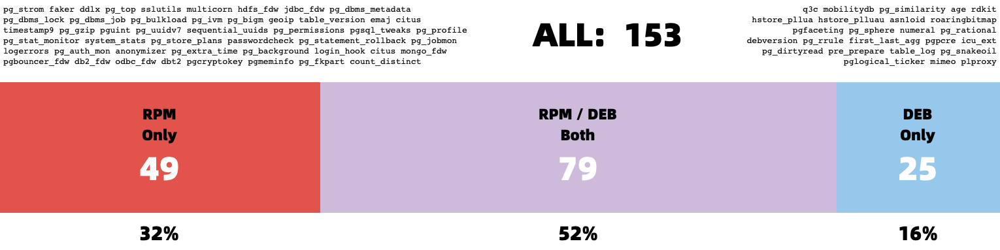
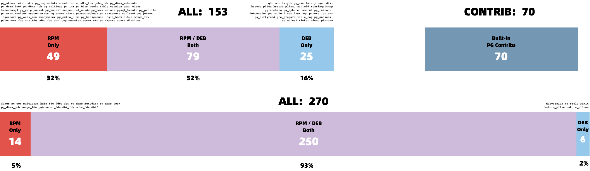
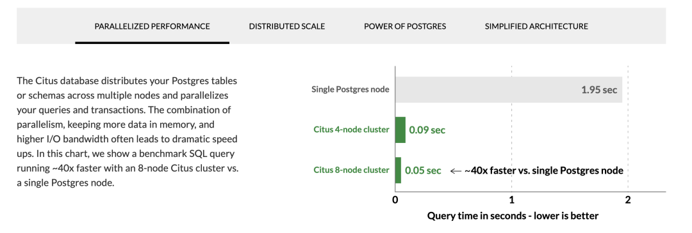
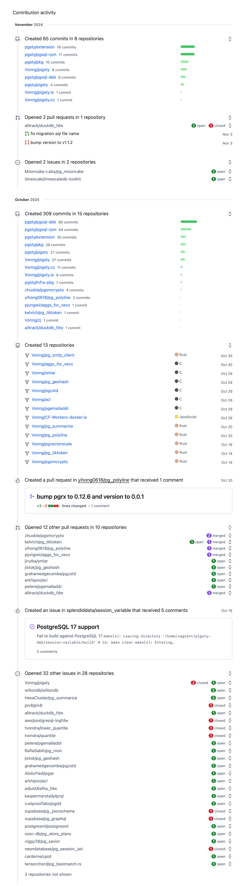

[**PostgreSQL Is Eating the Database World**](/pg/pg-eat-db-world) through the power of **extensibility**.
With **390** extensions powering PostgreSQL, we may not say it's invincible, but it’s definitely getting much closer.

I believe the PostgreSQL community has reached a consensus on the importance of extensions.
So the real question now becomes: **"What should we do about it?"**

What's the primary problem with PostgreSQL extensions? In my opinion, it’s their **accessibility**.
Extensions are useless if most users can’t easily install and enable them. But it's not that easy.

Even the largest cloud postgres vendors are struggling with this.
They have some inherent limitations (multi-tenancy, security, licensing) that make it hard for them to fully address this issue.

So here's my plan, I've created a [**repository**](https://pgext.cloud/repo) that hosts [**390**](https://pgext.cloud/list) of the most capable extensions in the PostgreSQL ecosystem,
available as RPM / DEB packages on mainstream Linux OS distros.  And the goal is to take PostgreSQL one solid step closer to becoming the all-powerful database and achieve **the great alignment** between the Debian and EL OS ecosystems.

> [**TL;DR: Take me to the HOW-TO part!**](#apt-repo)

<a href="/pg/pg-eat-deb-world"></a>


--------

## The status quo

The PostgreSQL ecosystem is rich with extensions, but how do you actually install and use them? This initial hurdle becomes a roadblock for many. There are some existing solutions:

PGXN says, "*You can download and compile extensions on the fly with `pgxnclient`.*"
Tembo says, "*We have prepared pre-configured extension stack as Docker images.*"
StackGres & Omnigres says, "*We download `.so` files on the fly.*" All solid ideas.

While based on my experience, the vast majority of users still rely on their operating system's package manager to install PG extensions.
On-the-fly compilation and downloading shared libraries might not be a viable option for production env. Since many DB setups don’t have internet access or a proper toolchain ready.

In the meantime, Existing OS package managers like `yum`/`dnf`/`apt` already solve issues like dependency resolution, upgrades, and version management well.
There's no need to reinvent the wheel or disrupt existing standards. So the real question is: Who's going to package these extensions into ready-to-use software?

PGDG has already made a fantastic effort with official [YUM](https://download.postgresql.org/pub/repos/yum/) and [APT](http://apt.postgresql.org/pub/repos/apt/) repositories.
In addition to the **70** built-in [Contrib](https://pgext.cloud/e/contrib) extensions bundled with PostgreSQL,the PGDG YUM repo offers **128** RPM extensions, while the APT repo offers **104** DEB extensions.
These extensions are compiled and packaged in the same environment as the PostgreSQL kernel, making them easy to install alongside the PostgreSQL binary packages.
In fact, even most PostgreSQL Docker images rely on the PGDG repo to install extensions.

I’m deeply grateful for Devrim's maintenance of the PGDG YUM repo and Christoph's work with the APT repo. Their efforts to make PostgreSQL installation and extension management seamless are incredibly valuable.
But as a distribution creator myself, I’ve encountered some challenges with PostgreSQL extension distribution.


--------

## What's the challenge?

The first major issue facing extension users is **Alignment**.

In the two primary Linux distro camps — Debian and EL — there’s a significant number of PostgreSQL extensions.
Excluding the **70** built-in Contrib extensions bundled with PostgreSQL, the YUM repo offers **128** extensions, and the APT repo provides **104**.

However, when we dig deeper, we see that alignment between the two repos is not ideal.
The combined total of extensions across both repos is **153**, but the overlap is just **79**. That means **only half** of the extensions are available in both ecosystems!

<a href="pgdg-ext.png"></a>

> Only half of the extensions are available in both EL and Debian ecosystems!

Next, we run into further alignment issues within each ecosystem itself. The availability of extensions can vary between different major OS versions.
For instance, `pljava`, `sequential_uuids`, and `firebird_fdw` are only available in EL9, but not in EL8. Similarly, `rdkit` is available in Ubuntu 22+ / Debian 12+, but not in Ubuntu 20 / Debian 11.
There’s also the issue of architecture support. For example, `citus` does not provide `arm64` packages in the Debian repo.

And then we have alignment issues across different PostgreSQL major versions. Some extensions won’t compile on older PostgreSQL versions, while others won’t work on newer ones.
Some extensions are only available for specific PostgreSQL versions in certain distributions, and so on.

These alignment issues lead to a significant number of permutations. For example, if we consider five mainstream OS distributions (el8, el9, debian12, ubuntu22, ubuntu24), 
two CPU architectures (`x86_64` and `arm64`), and six PostgreSQL major versions (12–17), that’s **60-70** RPM/DEB packages per extension—just for one extension!

On top of alignment, there’s the problem of **completeness**. PGXN lists over **375** extensions, but the PostgreSQL ecosystem could have as many as [**1,000+**](https://gist.github.com/joelonsql/e5aa27f8cc9bd22b8999b7de8aee9d47). The PGDG repos, however, contain only about **one-tenth** of them.

There are also several powerful new Rust-based extensions that PGDG doesn’t include, such as `pg_graphql`, `pg_jsonschema`, and `wrappers` for [self-hosting Supabase]();
`pg_search` as an Elasticsearch alternative; and `pg_analytics`, `pg_parquet`, `pg_mooncake` for OLAP processing. The reason? They are too slow to compile...


--------

## What's the solution?

Over the past six months, I’ve focused on consolidating the PostgreSQL extension ecosystem.
Recently, I reached a milestone I’m quite happy with. I’ve created a PG YUM/APT repository with a catalog of **390**available PostgreSQL extensions.

Here are some key stats for the repo: It hosts **390** extensions in total. Excluding the **70** built-in extensions that come with PostgreSQL, this leaves **270** third-party extensions.
Of these, about half are maintained by the official PGDG repos (**126** RPM, **102** DEB). The other half (**131** RPM, **143**DEB) are maintained, fixed, compiled, packaged, and distributed by myself.

|               OS \ Entry               | All | PGDG | PIGSTY | CONTRIB | MISC | MISS | PG17 | PG16 | PG15 | PG14 | PG13 | PG12 |
|:--------------------------------------:|:---:|:----:|:------:|:-------:|:----:|:----:|:----:|:----:|:----:|:----:|:----:|:----:|
| [**RPM**](https://pgext.cloud/e/rpm) | 334 | 115  |  143   |   70    |  4   |  6   | 301  | 330  | 333  | 319  | 307  | 294  |
| [**DEB**](https://pgext.cloud/e/deb) | 326 | 104  |  144   |   70    |  4   |  14  | 302  | 322  | 325  | 316  | 303  | 293  |

For each extension, I’ve built versions for the **6** major PostgreSQL versions (12–17) across five popular Linux distributions: EL8, EL9, Ubuntu 22.04, Ubuntu 24.04, and Debian 12.
I’ve also provided some limited support for older OS versions like EL7, Debian 11, and Ubuntu 20.04.

This repository also addresses most of the **alignment** issue. Initially, there were extensions in the APT and YUM repos that were unique to each, but I’ve worked to port as many of these unique extensions to the other ecosystem.
Now, only **7** APT extensions are missing from the YUM repo, and **16** extensions are missing in APT—just **6%** of the total. Many missing PGDG extensions have also been resolved.

<a href="pigsty-ext.png"></a>

I’ve created a comprehensive directory listing all supported extensions, with detailed info, dependency installation instructions, and other important notes.

<a href="citus.png"></a>

I hope this repository can serve as the ultimate solution to the frustration users face when extensions are difficult to find, compile, or install.


--------

## How to use this repo?

Now, for a quick plug — what’s the easiest way to install and use these extensions?

The simplest option is to use the OSS PostgreSQL distribution: [**Pigsty**](https://pgsty.com/).
The repo is autoconfigured by default, so all you need to do is declare them in the [config inventory](/docs/setup/config).

For example,  the [self-hosting supabase](/docs/db/supabase) template requires extensions that aren’t available in the PGDG repo.
You can simply  [download](/docs/pgext/usage/download/), [install](/docs/pgext/usage/install/), [preload](/docs/pgext/usage/load/), [config](/docs/pgext/usage/config) and [create](/docs/pgext/usage/create) extensions by referring to their names.

```yaml
all:
  children:
    pg-meta:
      hosts: { 10.10.10.10: { pg_seq: 1, pg_role: primary } }
      vars:
        pg_cluster: pg-meta

        # INSTALL EXTENSIONS
        pg_extensions:
          - supabase   # essential extensions for supabase
          - timescaledb postgis pg_graphql pg_jsonschema wrappers pg_search pg_analytics pg_parquet plv8 duckdb_fdw pg_cron pg_timetable pgqr
          - supautils pg_plan_filter passwordcheck plpgsql_check pgaudit pgsodium pg_vault pgjwt pg_ecdsa pg_session_jwt index_advisor
          - pgvector pgvectorscale pg_summarize pg_tiktoken pg_tle pg_stat_monitor hypopg pg_hint_plan pg_http pg_net pg_smtp_client pg_idkit

        # LOAD EXTENSIONS
        pg_libs: 'pg_stat_statements, plpgsql, plpgsql_check, pg_cron, pg_net, timescaledb, auto_explain, pg_tle, plan_filter'

        # CONFIG EXTENSIONS
        pg_parameters:
          cron.database_name: postgres
          pgsodium.enable_event_trigger: off

        # CREATE EXTENSIONS
        pg_databases:
          - name: postgres
            baseline: supabase.sql
            schemas: [ extensions ,auth ,realtime ,storage ,graphql_public ,supabase_functions ,_analytics ,_realtime ]
            extensions:
              - { name: pgcrypto  ,schema: extensions  }
              - { name: pg_net    ,schema: extensions  }
              - { name: pgjwt     ,schema: extensions  }
              - { name: uuid-ossp ,schema: extensions  }
              - { name: pgsodium        }               
              - { name: supabase_vault  }               
              - { name: pg_graphql      }               
              - { name: pg_jsonschema   }               
              - { name: wrappers        }               
              - { name: http            }               
              - { name: pg_cron         }               
              - { name: timescaledb     }               
              - { name: pg_tle          }               
              - { name: vector          }               
  vars:
    pg_version: 17

    # DOWNLOAD EXTENSIONS
    repo_extra_packages:
      - pgsql-main
      - supabase   # essential extensions for supabase
      - timescaledb postgis pg_graphql pg_jsonschema wrappers pg_search pg_analytics pg_parquet plv8 duckdb_fdw pg_cron pg_timetable pgqr
      - supautils pg_plan_filter passwordcheck plpgsql_check pgaudit pgsodium pg_vault pgjwt pg_ecdsa pg_session_jwt index_advisor
      - pgvector pgvectorscale pg_summarize pg_tiktoken pg_tle pg_stat_monitor hypopg pg_hint_plan pg_http pg_net pg_smtp_client pg_idkit
```

To simply add extensions to existing clusters:

```bash
./infra.yml -t repo_build -e '{"repo_packages":[citus]}'         # download
./pgsql.yml -t pg_extension -e '{"pg_extensions": ["citus"]}'    # install
```

Through this repo was meant to be used with Pigsty, But it is **not mandatory**. You can still enable this repository on any EL/Debian/Ubuntu system with a simple one-liner in the shell:


### APT Repo

[](https://pigsty.io/docs/node)
[](https://pigsty.io/docs/pgext/list/deb/)
[](https://pigsty.io/docs/pgext/list/deb/)
[](https://pigsty.iohttps://pigsty.io/docs/reference/compatibility/)

For Ubuntu 22.04 & Debian 12 or any compatible platforms, use the following commands to add the APT repo:

```bash
curl -fsSL https://repo.pigsty.io/key | sudo gpg --dearmor -o /etc/apt/keyrings/pigsty.gpg
sudo tee /etc/apt/sources.list.d/pigsty-io.list > /dev/null <<EOF
deb [signed-by=/etc/apt/keyrings/pigsty.gpg] https://repo.pigsty.io/apt/infra generic main 
deb [signed-by=/etc/apt/keyrings/pigsty.gpg] https://repo.pigsty.io/apt/pgsql/$(lsb_release -cs) $(lsb_release -cs) main
EOF
sudo apt update
```

### YUM Repo

[](https://pigsty.io/docs/node)
[](https://pigsty.io/docs/pgext/list/rpm/)
[](https://pigsty.io/docs/pgext/list/rpm/)
[](https://almalinux.org/)
[](https://almalinux.org/)
[](https://almalinux.org/)
[](https://almalinux.org/)

For EL 8/9 and compatible platforms, use the following commands to add the YUM repo:

```bash
curl -fsSL https://repo.pigsty.io/key      | sudo tee /etc/pki/rpm-gpg/RPM-GPG-KEY-pigsty >/dev/null  # add gpg key
curl -fsSL https://repo.pigsty.io/yum/repo | sudo tee /etc/yum.repos.d/pigsty.repo        >/dev/null  # add repo file
sudo yum makecache
```


--------------

## What's in this repo?

In this repo, all the extensions are categorized into one of the **15** categories: TIME, GIS, RAG, FTS, OLAP, FEAT, LANG, TYPE, FUNC, ADMIN, STAT, SEC, FDW, SIM, ETL, as shown below.

Check [pgext.cloud](https://pgext.cloud) for all the details.


--------

## Some Thoughts

Each major PostgreSQL version introduces changes, making the maintenance of **140+** extension packages a bit of a beast.

Especially when some extension authors haven’t updated their work in years. In these cases, you often have no choice but to take matters into your own hands.
I’ve personally fixed several extensions and ensured they support the latest PostgreSQL major versions. For those authors I could reach, I’ve submitted numerous PRs and issues to keep things moving forward.

<a href="https://github.com/Vonng"></a>

Back to the point: **my goal with this repo is to establish a standard for PostgreSQL extension installation and distribution, solving the distribution challenges that have long troubles the users**.

A recent milestone is that, the popular open-source PostgreSQL HA cluster project [**postgresql_cluster**](https://autobase.tech/docs/extensions/list), has made this extension repository the default upstream for PG extension installation.

Currently, this repository (repo.pigsty.io) is hosted on Cloudflare. In the past month, the repo and its mirrors have served about **300GB** of downloads.
Given that most extensions are just a few KB to a few MB, that amounts to nearly **a million downloads per month**.
Since Cloudflare doesn’t charge for traffic, I can confidently commit to keeping this repository completely free & under active maintenance for the foreseeable future, as long as cloudflare doesn't charge me too much.

I believe my work can help PostgreSQL users worldwide and contribute to the thriving PostgreSQL ecosystem. I hope it proves useful to you as well. **Enjoy PostgreSQL!**
