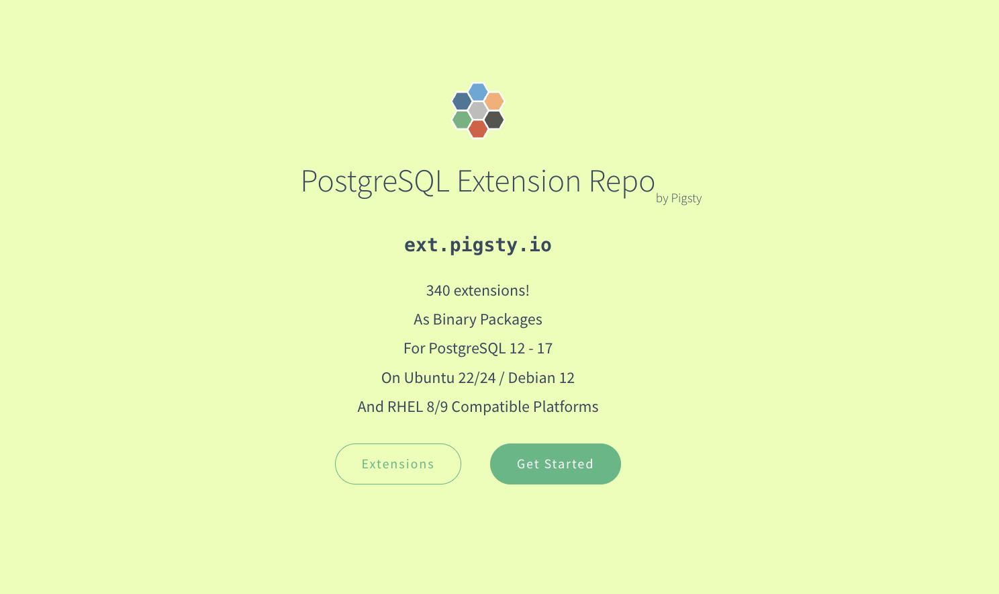
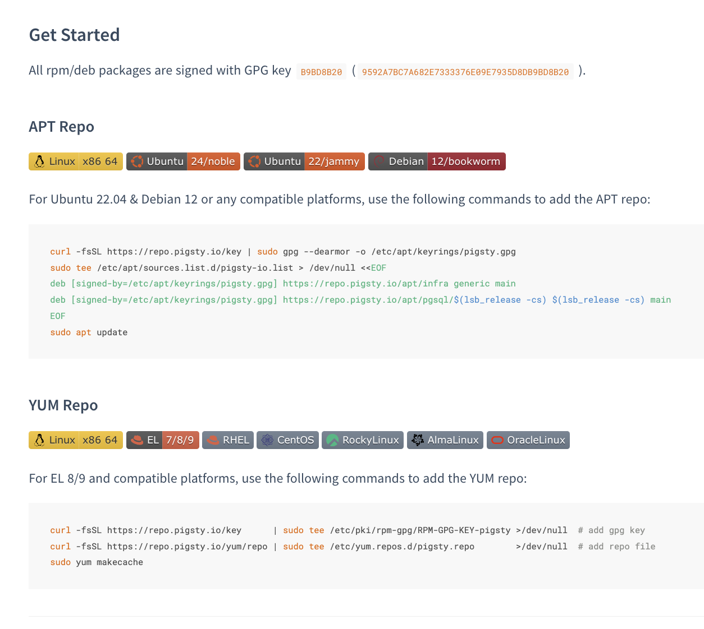
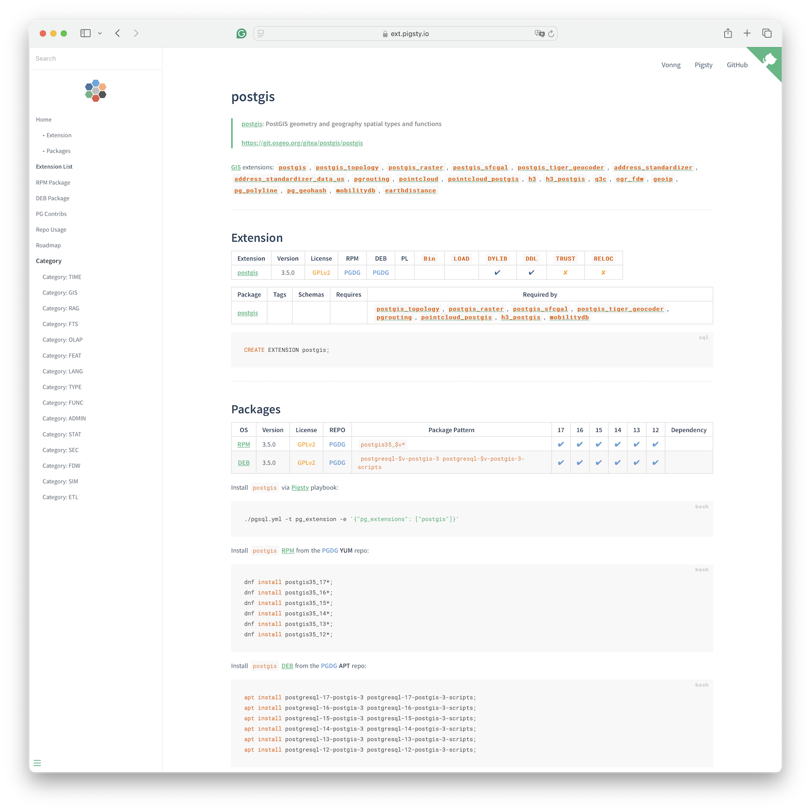
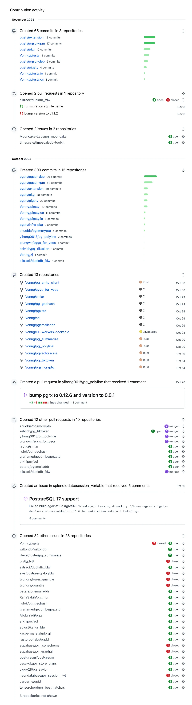

最近没怎么更新，因为在憋大招。最近功成出关，遂发此文为贺 —— 我做了一个收录PG生态所有能打的390个扩展的[仓库](https://pgext.cloud/zh)，让 PostgreSQL 在成为数据库全能王的道路上又往前迈出了坚实的一步！

自从我在 《[**PostgreSQL正在吞噬数据库世界**](/pg/pg-eat-db-world)》 一文中指出 **可扩展性** 对于 PostgreSQL 的重要性以来，PG 社区对此进行了[**热烈的讨论**](/pg/pgcondev-2024)，并且达成了共识。
最终体现在《[**PostgreSQL 17 发布注记！**](/pg/pg-17)》中。


<a href="/pg/pg-eat-db-world"></a>


但真正重要的事情不是认识世界，而是改变世界。既然大家都已经认清了扩展很重要，**那么我们应该做什么，怎么做**，就成了真正关键的问题。 

那么什么是 PostgreSQL 扩展最关键的问题？在我看来，扩展用得上用不上，是 PG 扩展生态的首要问题。


--------

## PG 扩展分发现状

大家知道 PG 生态有很多扩展插件，但这些扩展插件如何安装使用？这第一道门槛就成了许多用户的拦路虎。怎么解决这个问题？
PGXN 说，用我的办法，我可以现场下载编译扩展；
Tembo 说，我提前帮你打好 docker 镜像；
StackGres 和 Omnigres 说，我们可以在线下载编译好的 So 文件；
八仙过海，各显神通。

大家都有很多好想法，唯独没仔细考虑绝大多数用户到底是如何安装扩展的。
作为前 DBA，我只能说什么现场编译，OCI镜像，下载so文件，在实战中都有些离谱了 —— **使用最广泛且最可靠的扩展安装方式，依然是用操作系统的包管理器安装签名二进制包**。
而 yum / dnf / apt 在解决这个问题上已经做的足够好了！所以真的问题其实是，谁来把这几百个扩展插件打成开箱即用的软件包？

[**TIME**](https://pgext.cloud/e/time): [`timescaledb`](https://pgext.cloud/e/timescaledb) [`timescaledb_toolkit`](https://pgext.cloud/e/timescaledb_toolkit) [`timeseries`](https://pgext.cloud/e/timeseries) [`periods`](https://pgext.cloud/e/periods) [`temporal_tables`](https://pgext.cloud/e/temporal_tables) [`emaj`](https://pgext.cloud/e/emaj) [`table_version`](https://pgext.cloud/e/table_version) [`pg_cron`](https://pgext.cloud/e/pg_cron) [`pg_later`](https://pgext.cloud/e/pg_later) [`pg_background`](https://pgext.cloud/e/pg_background) [**GIS**](https://pgext.cloud/e/gis): [`postgis`](https://pgext.cloud/e/postgis) [`postgis_topology`](https://pgext.cloud/e/postgis_topology) [`postgis_raster`](https://pgext.cloud/e/postgis_raster) [`postgis_sfcgal`](https://pgext.cloud/e/postgis_sfcgal) [`postgis_tiger_geocoder`](https://pgext.cloud/e/postgis_tiger_geocoder) [`address_standardizer`](https://pgext.cloud/e/address_standardizer) [`address_standardizer_data_us`](https://pgext.cloud/e/address_standardizer_data_us) [`pgrouting`](https://pgext.cloud/e/pgrouting) [`pointcloud`](https://pgext.cloud/e/pointcloud) [`pointcloud_postgis`](https://pgext.cloud/e/pointcloud_postgis) [`h3`](https://pgext.cloud/e/h3) [`h3_postgis`](https://pgext.cloud/e/h3_postgis) [`q3c`](https://pgext.cloud/e/q3c) [`ogr_fdw`](https://pgext.cloud/e/ogr_fdw) [`geoip`](https://pgext.cloud/e/geoip) [`pg_polyline`](https://pgext.cloud/e/pg_polyline) [`pg_geohash`](https://pgext.cloud/e/pg_geohash) [`mobilitydb`](https://pgext.cloud/e/mobilitydb) [`earthdistance`](https://pgext.cloud/e/earthdistance) [**RAG**](https://pgext.cloud/e/rag): [`vector`](https://pgext.cloud/e/vector) [`vectorscale`](https://pgext.cloud/e/vectorscale) [`vectorize`](https://pgext.cloud/e/vectorize) [`pg_similarity`](https://pgext.cloud/e/pg_similarity) [`smlar`](https://pgext.cloud/e/smlar) [`pg_summarize`](https://pgext.cloud/e/pg_summarize) [`pg_tiktoken`](https://pgext.cloud/e/pg_tiktoken) [`pgml`](https://pgext.cloud/e/pgml) [`pg4ml`](https://pgext.cloud/e/pg4ml) [**FTS**](https://pgext.cloud/e/fts): [`pg_search`](https://pgext.cloud/e/pg_search) [`pg_bigm`](https://pgext.cloud/e/pg_bigm) [`zhparser`](https://pgext.cloud/e/zhparser) [`hunspell_cs_cz`](https://pgext.cloud/e/hunspell_cs_cz) [`hunspell_de_de`](https://pgext.cloud/e/hunspell_de_de) [`hunspell_en_us`](https://pgext.cloud/e/hunspell_en_us) [`hunspell_fr`](https://pgext.cloud/e/hunspell_fr) [`hunspell_ne_np`](https://pgext.cloud/e/hunspell_ne_np) [`hunspell_nl_nl`](https://pgext.cloud/e/hunspell_nl_nl) [`hunspell_nn_no`](https://pgext.cloud/e/hunspell_nn_no) [`hunspell_pt_pt`](https://pgext.cloud/e/hunspell_pt_pt) [`hunspell_ru_ru`](https://pgext.cloud/e/hunspell_ru_ru) [`hunspell_ru_ru_aot`](https://pgext.cloud/e/hunspell_ru_ru_aot) [`fuzzystrmatch`](https://pgext.cloud/e/fuzzystrmatch) [`pg_trgm`](https://pgext.cloud/e/pg_trgm) [**OLAP**](https://pgext.cloud/e/olap): [`citus`](https://pgext.cloud/e/citus) [`citus_columnar`](https://pgext.cloud/e/citus_columnar) [`columnar`](https://pgext.cloud/e/columnar) [`pg_analytics`](https://pgext.cloud/e/pg_analytics) [`pg_duckdb`](https://pgext.cloud/e/pg_duckdb) [`pg_mooncake`](https://pgext.cloud/e/pg_mooncake) [`duckdb_fdw`](https://pgext.cloud/e/duckdb_fdw) [`pg_parquet`](https://pgext.cloud/e/pg_parquet) [`pg_fkpart`](https://pgext.cloud/e/pg_fkpart) [`pg_partman`](https://pgext.cloud/e/pg_partman) [`plproxy`](https://pgext.cloud/e/plproxy) [`pg_strom`](https://pgext.cloud/e/pg_strom) [`tablefunc`](https://pgext.cloud/e/tablefunc) [**FEAT**](https://pgext.cloud/e/feat): [`age`](https://pgext.cloud/e/age) [`hll`](https://pgext.cloud/e/hll) [`rum`](https://pgext.cloud/e/rum) [`pg_graphql`](https://pgext.cloud/e/pg_graphql) [`pg_jsonschema`](https://pgext.cloud/e/pg_jsonschema) [`jsquery`](https://pgext.cloud/e/jsquery) [`pg_hint_plan`](https://pgext.cloud/e/pg_hint_plan) [`hypopg`](https://pgext.cloud/e/hypopg) [`index_advisor`](https://pgext.cloud/e/index_advisor) [`plan_filter`](https://pgext.cloud/e/plan_filter) [`imgsmlr`](https://pgext.cloud/e/imgsmlr) [`pg_ivm`](https://pgext.cloud/e/pg_ivm) [`pgmq`](https://pgext.cloud/e/pgmq) [`pgq`](https://pgext.cloud/e/pgq) [`pg_cardano`](https://pgext.cloud/e/pg_cardano) [`rdkit`](https://pgext.cloud/e/rdkit) [`bloom`](https://pgext.cloud/e/bloom) [**LANG**](https://pgext.cloud/e/lang): [`pg_tle`](https://pgext.cloud/e/pg_tle) [`plv8`](https://pgext.cloud/e/plv8) [`pllua`](https://pgext.cloud/e/pllua) [`hstore_pllua`](https://pgext.cloud/e/hstore_pllua) [`plluau`](https://pgext.cloud/e/plluau) [`hstore_plluau`](https://pgext.cloud/e/hstore_plluau) [`plprql`](https://pgext.cloud/e/plprql) [`pldbgapi`](https://pgext.cloud/e/pldbgapi) [`plpgsql_check`](https://pgext.cloud/e/plpgsql_check) [`plprofiler`](https://pgext.cloud/e/plprofiler) [`plsh`](https://pgext.cloud/e/plsh) [`pljava`](https://pgext.cloud/e/pljava) [`plr`](https://pgext.cloud/e/plr) [`pgtap`](https://pgext.cloud/e/pgtap) [`faker`](https://pgext.cloud/e/faker) [`dbt2`](https://pgext.cloud/e/dbt2) [`pltcl`](https://pgext.cloud/e/pltcl) [`pltclu`](https://pgext.cloud/e/pltclu) [`plperl`](https://pgext.cloud/e/plperl) [`bool_plperl`](https://pgext.cloud/e/bool_plperl) [`hstore_plperl`](https://pgext.cloud/e/hstore_plperl) [`jsonb_plperl`](https://pgext.cloud/e/jsonb_plperl) [`plperlu`](https://pgext.cloud/e/plperlu) [`bool_plperlu`](https://pgext.cloud/e/bool_plperlu) [`jsonb_plperlu`](https://pgext.cloud/e/jsonb_plperlu) [`hstore_plperlu`](https://pgext.cloud/e/hstore_plperlu) [`plpgsql`](https://pgext.cloud/e/plpgsql) [`plpython3u`](https://pgext.cloud/e/plpython3u) [`jsonb_plpython3u`](https://pgext.cloud/e/jsonb_plpython3u) [`ltree_plpython3u`](https://pgext.cloud/e/ltree_plpython3u) [`hstore_plpython3u`](https://pgext.cloud/e/hstore_plpython3u) [**TYPE**](https://pgext.cloud/e/type): [`prefix`](https://pgext.cloud/e/prefix) [`semver`](https://pgext.cloud/e/semver) [`unit`](https://pgext.cloud/e/unit) [`md5hash`](https://pgext.cloud/e/md5hash) [`asn1oid`](https://pgext.cloud/e/asn1oid) [`roaringbitmap`](https://pgext.cloud/e/roaringbitmap) [`pgfaceting`](https://pgext.cloud/e/pgfaceting) [`pg_sphere`](https://pgext.cloud/e/pg_sphere) [`country`](https://pgext.cloud/e/country) [`currency`](https://pgext.cloud/e/currency) [`pgmp`](https://pgext.cloud/e/pgmp) [`numeral`](https://pgext.cloud/e/numeral) [`pg_rational`](https://pgext.cloud/e/pg_rational) [`uint`](https://pgext.cloud/e/uint) [`uint128`](https://pgext.cloud/e/uint128) [`ip4r`](https://pgext.cloud/e/ip4r) [`uri`](https://pgext.cloud/e/uri) [`pgemailaddr`](https://pgext.cloud/e/pgemailaddr) [`acl`](https://pgext.cloud/e/acl) [`debversion`](https://pgext.cloud/e/debversion) [`pg_rrule`](https://pgext.cloud/e/pg_rrule) [`timestamp9`](https://pgext.cloud/e/timestamp9) [`chkpass`](https://pgext.cloud/e/chkpass) [`isn`](https://pgext.cloud/e/isn) [`seg`](https://pgext.cloud/e/seg) [`cube`](https://pgext.cloud/e/cube) [`ltree`](https://pgext.cloud/e/ltree) [`hstore`](https://pgext.cloud/e/hstore) [`citext`](https://pgext.cloud/e/citext) [`xml2`](https://pgext.cloud/e/xml2) [**FUNC**](https://pgext.cloud/e/func): [`topn`](https://pgext.cloud/e/topn) [`gzip`](https://pgext.cloud/e/gzip) [`zstd`](https://pgext.cloud/e/zstd) [`http`](https://pgext.cloud/e/http) [`pg_net`](https://pgext.cloud/e/pg_net) [`pg_smtp_client`](https://pgext.cloud/e/pg_smtp_client) [`pg_html5_email_address`](https://pgext.cloud/e/pg_html5_email_address) [`pgsql_tweaks`](https://pgext.cloud/e/pgsql_tweaks) [`pg_extra_time`](https://pgext.cloud/e/pg_extra_time) [`timeit`](https://pgext.cloud/e/timeit) [`count_distinct`](https://pgext.cloud/e/count_distinct) [`extra_window_functions`](https://pgext.cloud/e/extra_window_functions) [`first_last_agg`](https://pgext.cloud/e/first_last_agg) [`tdigest`](https://pgext.cloud/e/tdigest) [`aggs_for_vecs`](https://pgext.cloud/e/aggs_for_vecs) [`aggs_for_arrays`](https://pgext.cloud/e/aggs_for_arrays) [`arraymath`](https://pgext.cloud/e/arraymath) [`quantile`](https://pgext.cloud/e/quantile) [`lower_quantile`](https://pgext.cloud/e/lower_quantile) [`pg_idkit`](https://pgext.cloud/e/pg_idkit) [`pg_uuidv7`](https://pgext.cloud/e/pg_uuidv7) [`permuteseq`](https://pgext.cloud/e/permuteseq) [`pg_hashids`](https://pgext.cloud/e/pg_hashids) [`sequential_uuids`](https://pgext.cloud/e/sequential_uuids) [`pg_math`](https://pgext.cloud/e/pg_math) [`random`](https://pgext.cloud/e/random) [`base36`](https://pgext.cloud/e/base36) [`base62`](https://pgext.cloud/e/base62) [`pg_base58`](https://pgext.cloud/e/pg_base58) [`floatvec`](https://pgext.cloud/e/floatvec) [`financial`](https://pgext.cloud/e/financial) [`pgjwt`](https://pgext.cloud/e/pgjwt) [`pg_hashlib`](https://pgext.cloud/e/pg_hashlib) [`shacrypt`](https://pgext.cloud/e/shacrypt) [`cryptint`](https://pgext.cloud/e/cryptint) [`pguecc`](https://pgext.cloud/e/pguecc) [`pgpcre`](https://pgext.cloud/e/pgpcre) [`icu_ext`](https://pgext.cloud/e/icu_ext) [`pgqr`](https://pgext.cloud/e/pgqr) [`envvar`](https://pgext.cloud/e/envvar) [`pg_protobuf`](https://pgext.cloud/e/pg_protobuf) [`url_encode`](https://pgext.cloud/e/url_encode) [`refint`](https://pgext.cloud/e/refint) [`autoinc`](https://pgext.cloud/e/autoinc) [`insert_username`](https://pgext.cloud/e/insert_username) [`moddatetime`](https://pgext.cloud/e/moddatetime) [`tsm_system_time`](https://pgext.cloud/e/tsm_system_time) [`dict_xsyn`](https://pgext.cloud/e/dict_xsyn) [`tsm_system_rows`](https://pgext.cloud/e/tsm_system_rows) [`tcn`](https://pgext.cloud/e/tcn) [`uuid-ossp`](https://pgext.cloud/e/uuid-ossp) [`btree_gist`](https://pgext.cloud/e/btree_gist) [`btree_gin`](https://pgext.cloud/e/btree_gin) [`intarray`](https://pgext.cloud/e/intarray) [`intagg`](https://pgext.cloud/e/intagg) [`dict_int`](https://pgext.cloud/e/dict_int) [`unaccent`](https://pgext.cloud/e/unaccent) [**ADMIN**](https://pgext.cloud/e/admin): [`pg_repack`](https://pgext.cloud/e/pg_repack) [`pg_squeeze`](https://pgext.cloud/e/pg_squeeze) [`pg_dirtyread`](https://pgext.cloud/e/pg_dirtyread) [`pgfincore`](https://pgext.cloud/e/pgfincore) [`pgdd`](https://pgext.cloud/e/pgdd) [`ddlx`](https://pgext.cloud/e/ddlx) [`prioritize`](https://pgext.cloud/e/prioritize) [`pg_checksums`](https://pgext.cloud/e/pg_checksums) [`pg_readonly`](https://pgext.cloud/e/pg_readonly) [`safeupdate`](https://pgext.cloud/e/safeupdate) [`pg_permissions`](https://pgext.cloud/e/pg_permissions) [`pgautofailover`](https://pgext.cloud/e/pgautofailover) [`pg_catcheck`](https://pgext.cloud/e/pg_catcheck) [`pre_prepare`](https://pgext.cloud/e/pre_prepare) [`pgcozy`](https://pgext.cloud/e/pgcozy) [`pg_orphaned`](https://pgext.cloud/e/pg_orphaned) [`pg_crash`](https://pgext.cloud/e/pg_crash) [`pg_cheat_funcs`](https://pgext.cloud/e/pg_cheat_funcs) [`pg_savior`](https://pgext.cloud/e/pg_savior) [`table_log`](https://pgext.cloud/e/table_log) [`pg_fio`](https://pgext.cloud/e/pg_fio) [`pgpool_adm`](https://pgext.cloud/e/pgpool_adm) [`pgpool_recovery`](https://pgext.cloud/e/pgpool_recovery) [`pgpool_regclass`](https://pgext.cloud/e/pgpool_regclass) [`pgagent`](https://pgext.cloud/e/pgagent) [`vacuumlo`](https://pgext.cloud/e/vacuumlo) [`pg_prewarm`](https://pgext.cloud/e/pg_prewarm) [`oid2name`](https://pgext.cloud/e/oid2name) [`lo`](https://pgext.cloud/e/lo) [`basic_archive`](https://pgext.cloud/e/basic_archive) [`basebackup_to_shell`](https://pgext.cloud/e/basebackup_to_shell) [`old_snapshot`](https://pgext.cloud/e/old_snapshot) [`adminpack`](https://pgext.cloud/e/adminpack) [`amcheck`](https://pgext.cloud/e/amcheck) [`pg_surgery`](https://pgext.cloud/e/pg_surgery) [**STAT**](https://pgext.cloud/e/stat): [`pg_profile`](https://pgext.cloud/e/pg_profile) [`pg_show_plans`](https://pgext.cloud/e/pg_show_plans) [`pg_stat_kcache`](https://pgext.cloud/e/pg_stat_kcache) [`pg_stat_monitor`](https://pgext.cloud/e/pg_stat_monitor) [`pg_qualstats`](https://pgext.cloud/e/pg_qualstats) [`pg_store_plans`](https://pgext.cloud/e/pg_store_plans) [`pg_track_settings`](https://pgext.cloud/e/pg_track_settings) [`pg_wait_sampling`](https://pgext.cloud/e/pg_wait_sampling) [`system_stats`](https://pgext.cloud/e/system_stats) [`meta`](https://pgext.cloud/e/meta) [`pgnodemx`](https://pgext.cloud/e/pgnodemx) [`pg_proctab`](https://pgext.cloud/e/pg_proctab) [`pg_sqlog`](https://pgext.cloud/e/pg_sqlog) [`bgw_replstatus`](https://pgext.cloud/e/bgw_replstatus) [`pgmeminfo`](https://pgext.cloud/e/pgmeminfo) [`toastinfo`](https://pgext.cloud/e/toastinfo) [`explain_ui`](https://pgext.cloud/e/explain_ui) [`pg_relusage`](https://pgext.cloud/e/pg_relusage) [`pg_top`](https://pgext.cloud/e/pg_top) [`pagevis`](https://pgext.cloud/e/pagevis) [`powa`](https://pgext.cloud/e/powa) [`pageinspect`](https://pgext.cloud/e/pageinspect) [`pgrowlocks`](https://pgext.cloud/e/pgrowlocks) [`sslinfo`](https://pgext.cloud/e/sslinfo) [`pg_buffercache`](https://pgext.cloud/e/pg_buffercache) [`pg_walinspect`](https://pgext.cloud/e/pg_walinspect) [`pg_freespacemap`](https://pgext.cloud/e/pg_freespacemap) [`pg_visibility`](https://pgext.cloud/e/pg_visibility) [`pgstattuple`](https://pgext.cloud/e/pgstattuple) [`auto_explain`](https://pgext.cloud/e/auto_explain) [`pg_stat_statements`](https://pgext.cloud/e/pg_stat_statements) [**SEC**](https://pgext.cloud/e/sec): [`passwordcheck_cracklib`](https://pgext.cloud/e/passwordcheck_cracklib) [`supautils`](https://pgext.cloud/e/supautils) [`pgsodium`](https://pgext.cloud/e/pgsodium) [`supabase_vault`](https://pgext.cloud/e/supabase_vault) [`pg_session_jwt`](https://pgext.cloud/e/pg_session_jwt) [`anon`](https://pgext.cloud/e/anon) [`pg_tde`](https://pgext.cloud/e/pg_tde) [`pgsmcrypto`](https://pgext.cloud/e/pgsmcrypto) [`pgaudit`](https://pgext.cloud/e/pgaudit) [`pgauditlogtofile`](https://pgext.cloud/e/pgauditlogtofile) [`pg_auth_mon`](https://pgext.cloud/e/pg_auth_mon) [`credcheck`](https://pgext.cloud/e/credcheck) [`pgcryptokey`](https://pgext.cloud/e/pgcryptokey) [`pg_jobmon`](https://pgext.cloud/e/pg_jobmon) [`logerrors`](https://pgext.cloud/e/logerrors) [`login_hook`](https://pgext.cloud/e/login_hook) [`set_user`](https://pgext.cloud/e/set_user) [`pg_snakeoil`](https://pgext.cloud/e/pg_snakeoil) [`pgextwlist`](https://pgext.cloud/e/pgextwlist) [`pg_auditor`](https://pgext.cloud/e/pg_auditor) [`sslutils`](https://pgext.cloud/e/sslutils) [`noset`](https://pgext.cloud/e/noset) [`sepgsql`](https://pgext.cloud/e/sepgsql) [`auth_delay`](https://pgext.cloud/e/auth_delay) [`pgcrypto`](https://pgext.cloud/e/pgcrypto) [`passwordcheck`](https://pgext.cloud/e/passwordcheck) [**FDW**](https://pgext.cloud/e/fdw): [`wrappers`](https://pgext.cloud/e/wrappers) [`multicorn`](https://pgext.cloud/e/multicorn) [`odbc_fdw`](https://pgext.cloud/e/odbc_fdw) [`jdbc_fdw`](https://pgext.cloud/e/jdbc_fdw) [`mysql_fdw`](https://pgext.cloud/e/mysql_fdw) [`oracle_fdw`](https://pgext.cloud/e/oracle_fdw) [`tds_fdw`](https://pgext.cloud/e/tds_fdw) [`db2_fdw`](https://pgext.cloud/e/db2_fdw) [`sqlite_fdw`](https://pgext.cloud/e/sqlite_fdw) [`pgbouncer_fdw`](https://pgext.cloud/e/pgbouncer_fdw) [`mongo_fdw`](https://pgext.cloud/e/mongo_fdw) [`redis_fdw`](https://pgext.cloud/e/redis_fdw) [`redis`](https://pgext.cloud/e/redis) [`kafka_fdw`](https://pgext.cloud/e/kafka_fdw) [`hdfs_fdw`](https://pgext.cloud/e/hdfs_fdw) [`firebird_fdw`](https://pgext.cloud/e/firebird_fdw) [`aws_s3`](https://pgext.cloud/e/aws_s3) [`log_fdw`](https://pgext.cloud/e/log_fdw) [`dblink`](https://pgext.cloud/e/dblink) [`file_fdw`](https://pgext.cloud/e/file_fdw) [`postgres_fdw`](https://pgext.cloud/e/postgres_fdw) [**SIM**](https://pgext.cloud/e/sim): [`orafce`](https://pgext.cloud/e/orafce) [`pgtt`](https://pgext.cloud/e/pgtt) [`session_variable`](https://pgext.cloud/e/session_variable) [`pg_statement_rollback`](https://pgext.cloud/e/pg_statement_rollback) [`pg_dbms_metadata`](https://pgext.cloud/e/pg_dbms_metadata) [`pg_dbms_lock`](https://pgext.cloud/e/pg_dbms_lock) [`pg_dbms_job`](https://pgext.cloud/e/pg_dbms_job) [`babelfishpg_common`](https://pgext.cloud/e/babelfishpg_common) [`babelfishpg_tsql`](https://pgext.cloud/e/babelfishpg_tsql) [`babelfishpg_tds`](https://pgext.cloud/e/babelfishpg_tds) [`babelfishpg_money`](https://pgext.cloud/e/babelfishpg_money) [`pgmemcache`](https://pgext.cloud/e/pgmemcache) [**ETL**](https://pgext.cloud/e/etl): [`pglogical`](https://pgext.cloud/e/pglogical) [`pglogical_origin`](https://pgext.cloud/e/pglogical_origin) [`pglogical_ticker`](https://pgext.cloud/e/pglogical_ticker) [`pgl_ddl_deploy`](https://pgext.cloud/e/pgl_ddl_deploy) [`pg_failover_slots`](https://pgext.cloud/e/pg_failover_slots) [`wal2json`](https://pgext.cloud/e/wal2json) [`wal2mongo`](https://pgext.cloud/e/wal2mongo) [`decoderbufs`](https://pgext.cloud/e/decoderbufs) [`decoder_raw`](https://pgext.cloud/e/decoder_raw) [`test_decoding`](https://pgext.cloud/e/test_decoding) [`mimeo`](https://pgext.cloud/e/mimeo) [`repmgr`](https://pgext.cloud/e/repmgr) [`pg_fact_loader`](https://pgext.cloud/e/pg_fact_loader) [`pg_bulkload`](https://pgext.cloud/e/pg_bulkload)


PostgreSQL 的 PGDG 官方仓库中，提供了大约 **100** 个左右的扩展，但存在各种问题：有的扩展在 Debian/Ubuntu 的 APT 仓库里有，在 EL 系统的 YUM 仓库里没有；
有的扩展在 EL8 上有，EL9 没有；有的扩展在 Ubuntu 22 上有，在 24 上没有；有的扩展针对 PostgreSQL 12 - 15 提供，PG 16，17 不提供；有的扩展只有 x86_64 架构，没有 arm 架构；有时候碰上这种问题确实蛮让人头疼。


--------

## 怎么办？我行我上！

作为一个 PostgreSQL 发行版维护者，我曾经寄希望于 PG 生态的其他人来解决这个问题。
每当我看见 PGDG 仓库有出现错漏缺失，我都会第一时间反馈给仓库维护者 Devrim 和 Cris 。

有的时候这种模式挺管用，比如去年当我发现 pgvector 这个强力向量数据库扩展还没有二进制软件包制成品时，我第一时间[提给 Devrim](https://github.com/pgvector/pgvector/issues/76) ，
[将其放入 PGDG 仓库](/pg/vector-json-pg/#译者评论)，然后 pgvector 遂成为 PG 生态中的向量数据库事实标准，进入到各家云厂商 RDS 中。

但有的时候，事情并不能总能如意。例如，**Devrim** 表示，他绝对不会接受任何 Rust 扩展插件进入 PGDG YUM 仓库。
但我确实有二十多个用 Rust 编写的 PostgreSQL 扩展需要分发（例如自建 Supabase 就需要 pg_graphql, pg_jsonschema, wrappers 三个 Rust 扩展），怎么办呢？

再比如说，最近 PG 生态非常火热的 [DuckDB 缝合大赛](/pg/pg-duckdb)，大家都在密集地更新跟进 DuckDB 系扩展 ，这些扩展插件我第一时间 [打好了 RPM/DEB 包](https://pgext.cloud/e/olap)，但是如何分发呢？

思来想去，我决定还是我行我上，自己维护一个 PostgreSQL 扩展插件的 APT / YUM 仓库，分发 PG 扩展。

<a href="https://pgext.cloud"></a>


--------


## PG 扩展大全

在过去的半年中，我的工作重心放在 PG 扩展生态的整合上。而最近，这项工作终于达到了一个让我自己感到满意的里程碑。我建设了一个 PG Yum/APT 仓库，收录了 340 个可用 PG 扩展的元数据，以及二进制制成品。

| Entry / Filter | All | PGDG | PIGSTY | CONTRIB | MISC | MISS | PG17 | PG16 | PG15 | PG14 | PG13 | PG12 |
|:--------------:|:---:|:----:|:------:|:-------:|:----:|:----:|:----:|:----:|:----:|:----:|:----:|:----:|
| RPM Extension  | 334 | 119  |  139   |   70    |  4   |  6   | 301  | 330  | 333  | 319  | 307  | 294  |
| DEB Extension  | 326 | 104  |  143   |   70    |  5   |  14  | 302  | 322  | 325  | 316  | 303  | 293  |
|  RPM Package   | 251 | 107  |  138   |    1    |  4   |  1   | 220  | 247  | 250  | 239  | 229  | 216  |
|  DEB Package   | 241 |  90  |  142   |    1    |  5   |  1   | 218  | 237  | 240  | 234  | 223  | 213  |


以上是这个仓库的一些统计数字：总共有 340 个可用 Extension，去除 PG 自带的 70 个，总共 270 个第三方扩展插件。这 270 个扩展插件中，有小一半是 PGDG 官方仓库维护的（126个RPM扩展，102个DEB扩展），另外的大一半（131个RPM，143个DEB）都是由我维护，修复，编译，打包，测试，分发的。

每一个扩展，我都针对最新的 PostgreSQL 12 - 17 这六个生命周期大版本分别打包构建，针对 EL8，EL9，Ubuntu 22.04，Ubuntu 24.04，以及 Debian 12 这五个绝对主流 Linux 发行版构建。此外也对 EL7，Debian 11， Ubuntu 20.04 这些过保系统提供部分有限支持。

<a href="https://pgext.cloud"></a>


这个仓库还解决了扩展对齐的问题，例如，原本在 APT 和 YUM 仓库中的扩展，APT 有一小半几十个扩展 YUM 仓库没有，YUM 仓库有一小半 APT 仓库没有。我把两者独有的扩展都尽可能移植到另一个操作系统生态中，现在只有 7 个 APT 扩展在 YUM 仓库中缺失，16 个扩展在 APT 仓库缺失，只占总数的 6%。很多 PGDG 扩展版本缺失的问题，也在这里得到了一并修复。

我提供了一个完整的目录，列出了支持的扩展，并且对每一个扩展，都给出了详情，依赖安装说明与注意事项。


<a href="https://pgext.cloud/e/postgis"></a>


我想，用户吭哧吭哧抱怨扩展编译失败的问题，应该能在这里得到最终的解决。

当然题外话是广告时间，安装这些扩展，使用这个仓库的最简单的方式是什么？当然是开箱即用的 PostgreSQL 数据库发行版 —— **Pigsty** —— **但这并非必选项**。
你依然可以用简单的一行 shell 在任何 EL/Debian/Ubuntu 系统上启用此仓库。


<details><summary>使用Pigsty一次性配置好并拉起用于自建Supabase的PostgreSQL集群，只要简单地声明要安装哪些扩展插件即可！</summary><br>

一键自建 Supabase 所需的 PostgreSQL 集群，请参考样例配置文件： [`conf/dbms/supabase.yml`](https://github.com/Vonng/pigsty/blob/main/conf/supa.yml)。

```yaml
# pg-meta, the underlying postgres database for supabase
pg-meta:
  hosts: { 10.10.10.10: { pg_seq: 1, pg_role: primary } }
  vars:
    pg_cluster: pg-meta
    pg_users:
      # supabase roles: anon, authenticated, dashboard_user
      - { name: anon           ,login: false }
      - { name: authenticated  ,login: false }
      - { name: dashboard_user ,login: false ,replication: true ,createdb: true ,createrole: true }
      - { name: service_role   ,login: false ,bypassrls: true }
      # supabase users: please use the same password
      - { name: supabase_admin             ,password: 'DBUser.Supa' ,pgbouncer: true ,inherit: true   ,roles: [ dbrole_admin ] ,superuser: true ,replication: true ,createdb: true ,createrole: true ,bypassrls: true }
      - { name: authenticator              ,password: 'DBUser.Supa' ,pgbouncer: true ,inherit: false  ,roles: [ dbrole_admin, authenticated ,anon ,service_role ] }
      - { name: supabase_auth_admin        ,password: 'DBUser.Supa' ,pgbouncer: true ,inherit: false  ,roles: [ dbrole_admin ] ,createrole: true }
      - { name: supabase_storage_admin     ,password: 'DBUser.Supa' ,pgbouncer: true ,inherit: false  ,roles: [ dbrole_admin, authenticated ,anon ,service_role ] ,createrole: true }
      - { name: supabase_functions_admin   ,password: 'DBUser.Supa' ,pgbouncer: true ,inherit: false  ,roles: [ dbrole_admin ] ,createrole: true }
      - { name: supabase_replication_admin ,password: 'DBUser.Supa' ,replication: true ,roles: [ dbrole_admin ]}
      - { name: supabase_read_only_user    ,password: 'DBUser.Supa' ,bypassrls: true ,roles: [ dbrole_readonly, pg_read_all_data ] }
    pg_databases:
      - name: postgres
        baseline: supabase.sql
        owner: supabase_admin
        comment: supabase postgres database
        schemas: [ extensions ,auth ,realtime ,storage ,graphql_public ,supabase_functions ,_analytics ,_realtime ]
        extensions:
          - { name: pgcrypto  ,schema: extensions  } # 1.3   : cryptographic functions
          - { name: pg_net    ,schema: extensions  } # 0.9.2 : async HTTP
          - { name: pgjwt     ,schema: extensions  } # 0.2.0 : json web token API for postgres
          - { name: uuid-ossp ,schema: extensions  } # 1.1   : generate universally unique identifiers (UUIDs)
          - { name: pgsodium        }                # 3.1.9 : pgsodium is a modern cryptography library for Postgres.
          - { name: supabase_vault  }                # 0.2.8 : Supabase Vault Extension
          - { name: pg_graphql      }                # 1.5.9 : pg_graphql: GraphQL support
          - { name: pg_jsonschema   }                # 0.3.3 : pg_jsonschema: Validate json schema
          - { name: wrappers        }                # 0.4.3 : wrappers: FDW collections
          - { name: http            }                # 1.6   : http: allows web page retrieval inside the database.
          - { name: pg_cron         }                # 1.6   : pg_cron: Job scheduler for PostgreSQL
          - { name: timescaledb     }                # 2.17  : timescaledb: Enables scalable inserts and complex queries for time-series data
          - { name: pg_tle          }                # 1.2   : pg_tle: Trusted Language Extensions for PostgreSQL
    # supabase required extensions
    pg_libs: 'pg_stat_statements, pgaudit, plpgsql, plpgsql_check, pg_cron, pg_net, timescaledb, auto_explain, pg_tle, plan_filter'
    pg_extensions: # extensions to be installed on this cluster
      - supa-stack
      - timescaledb pg_cron pg_timetable
      - postgis pg_geohash
      - pgvector pgvectorscale pg_similarity smlar pg_summarize pg_tiktoken
      - pg_search pg_bigm zhparser hunspell
      - pg_analytics pg_parquet pg_duckdb
      - pg_hint_plan hll rum pg_graphql pg_jsonschema index_advisor pg_plan_filter hypopg pg_ivm pgmq pg_cardano
      - pg_tle plv8 plpgsql_check #pljava
      - pgunit md5hash asn1oid roaringbitmap pgfaceting pgsphere pg_country pg_currency pgmp numeral pg_rational pguint pg_uint128 ip4r pg_uri pgemailaddr acl timestamp9
      - pg_gzip pg_zstd pg_http pg_net pg_html5_email_address pgsql_tweaks pg_extra_time pg_timeit count_distinct extra_window_functions first_last_agg tdigest aggs_for_arrays aggs_for_vecs pg_arraymath quantile lower_quantile
      - pg_idkit pg_uuidv7 permuteseq pg_hashids sequential_uuids pg_math pg_random pg_base36 pg_base62 pg_base58 floatvec pg_financial pgjwt pg_hashlib shacrypt cryptint pg_ecdsa pgpcre icu_ext pgqr envvar pg_protobuf url_encode
      - pg_repack pg_squeeze pg_dirtyread ddlx pg_readonly safeupdate pg_permissions pg_savior pg_fio
      - pg_profile pg_show_plans pg_stat_kcache pg_stat_monitor pg_qualstats pg_track_settings system_stats pg_meta pgnodemx pg_sqlog bgw_replstatus toastinfo pg_explain_ui pg_relusage
      - passwordcheck supautils pgsodium pg_vault anonymizer pgsmcrypto pgaudit pgauditlogtofile pg_auth_mon credcheck logerrors login_hook set_user pgextwlist pg_auditor sslutils noset
      - wrappers mysql_fdw redis_fdw pg_redis_pubsub aws_s3 log_fdw
      - pglogical wal2json decoder_raw pg_fact_loader
    pg_parameters:
      cron.database_name: postgres
      pgsodium.enable_event_trigger: off
    pg_hba_rules: # supabase hba rules, require access from docker network
      - { user: all ,db: postgres  ,addr: intra         ,auth: pwd ,title: 'allow supabase access from intranet'    }
      - { user: all ,db: postgres  ,addr: 172.17.0.0/16 ,auth: pwd ,title: 'allow access from local docker network' }
    pg_vip_enabled: true
    pg_vip_address: 10.10.10.2/24
    pg_vip_interface: eth1
```


</details>


--------------

## 这个仓库里有什么？

在 Pigsty 的扩展仓库中，所有的扩展都已经被预先分为了十五类之一：TIME，GIS，RAG，FTS，OLAP，FEAT，LANG，TYPE，FUNC，ADMIN，STAT，SEC，FDW，SIM，ETL，如下所示。

请移步 [pgext.cloud](https://pgext.cloud/zh) 查看完整详情。


--------

## 一些感想与体会

PG 每个大版本都会引入一些变动，因此维护一百多个扩展插件并不是一件轻松的事情。特别是一些扩展的作者都好几年没动静了，那还真就只能自己上。我自己修复了十几个扩展插件，提供了最新的 PG 大版本支持。能联系上作者的，我也提交了一堆 PR 或者 Issue，推动解决。

<a href="https://github.com/Vonng"></a>

在这个过程中，我和许多扩展作者都建立了联系。例如，我手把手帮助 ParadeDB 的老板与作者 [解决了](https://github.com/paradedb/paradedb/issues/1116) RPM / DEB 包打包与分发的问题。我说动了 duckdb_fdw 的作者使用一个单独的 libduckdb，并发布了 v1.0.0 ，我给一些PG扩展的作者发邮件/Issue，国产机器学习框架 PG4ML 的作者也找到了我希望能够通过这个渠道进行分发。

再比如说，最近 PG 生态 OLAP 缝合 DuckDB 的竞赛如火如荼，但不管是ParadeDB 的 pg_analytics，国内个人开发者李红艳编写的 duckdb_fdw，CrunchyData 的 pg_parquet，MooncakeLab 的 pg_mooncake， Hydra 和 DuckDB 原厂 MotherDuck 亲自下场搞的 pg_duckdb ，都被我在第一时间编译打包收录整合其中，做到了 —— 你卷你的，反正我全都要。

言归正传，**我希望这个仓库能设立起 PostgreSQL 扩展安装分发的标准，解决让人头大的分发难题**。目前最让我感到高兴的进展是，流行的开源 PostgreSQL高可用集群搭建项目 [`postgresql_cluster`](https://postgresql-cluster.org/) 的作者 Vitaliy Kukharik 已经将这个仓库作为默认启用的仓库来安装 PostgreSQL 扩展。

<a href="https://x.com/VKukharik/status/1853012121623155117"></a>


目前这个仓库 (repo.pigsty.io) 托管在 Cloudflare 上，所以没有什么流量成本。国内有一个镜像站点 repo.pigsty.cc，方便墙内用户使用，每个有小几百块流量费，不是什么大问题。两个仓库加起来，过去一个月的下载流量大概 200GB ，考虑到扩展平均几十KB到几MB的大小，总下载量小几十万是有了。

因为[赛博菩萨 Cloudflare ](http://mp.weixin.qq.com/s?__biz=MzU5ODAyNTM5Ng==&mid=2247487240&idx=1&sn=ba535fd0c1026bc2482ea6ad1e1fb8bf&chksm=fe4b3ad3c93cb3c50bfeaed64963cce25c49bee80364d3a8ca78b87d7c9f19fd4d79d3c62ddc&scene=21#wechat_redirect)不收流量费，所以总的来说，我觉得做一个永久免费的声明与承诺并不困难，所以 So be it。我承诺这个仓库将持续维护并永久免费。如果有国内开源软件站点的朋友愿意赞助或提供镜像服务，欢迎联系我。

我相信我的工作可以帮助到全球PG用户，并对 PostgreSQL 生态的繁荣贡献一份力量。我也希望我的工作可以帮到您，**Enjoy PostgreSQL**！
