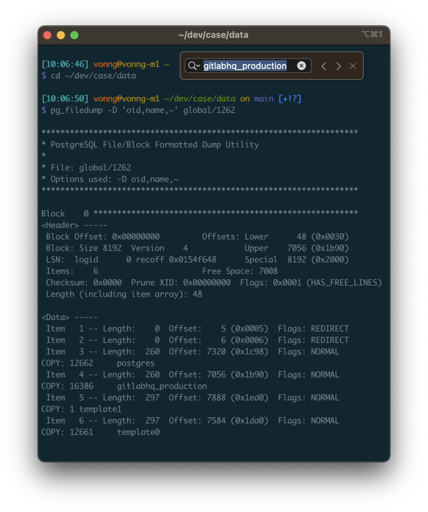
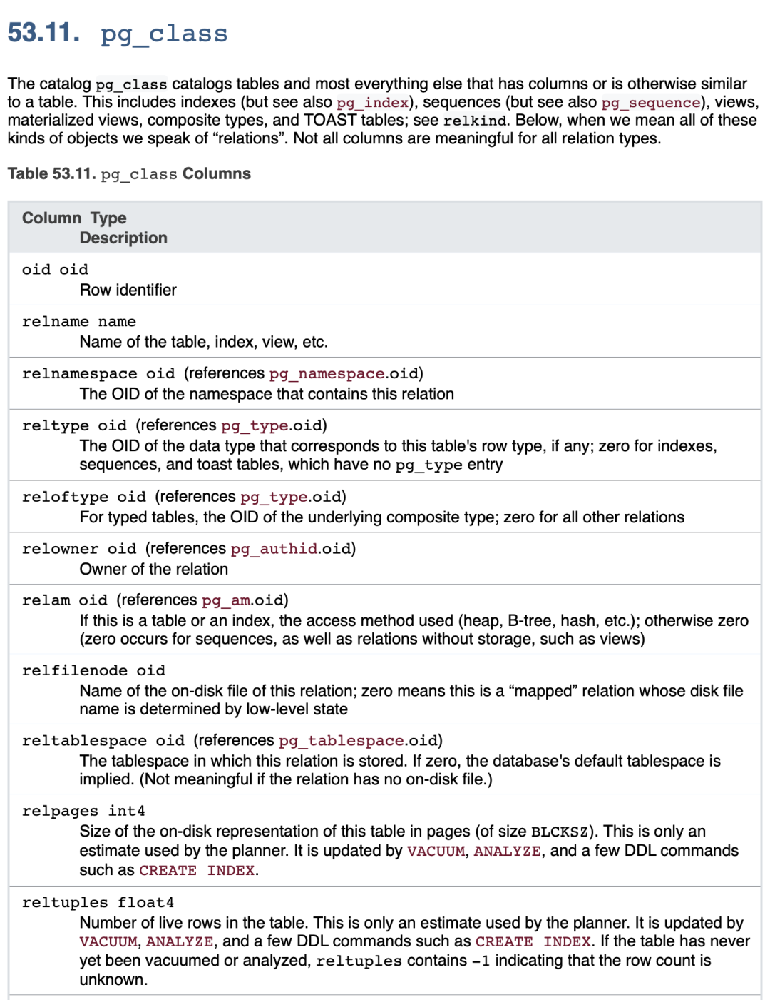
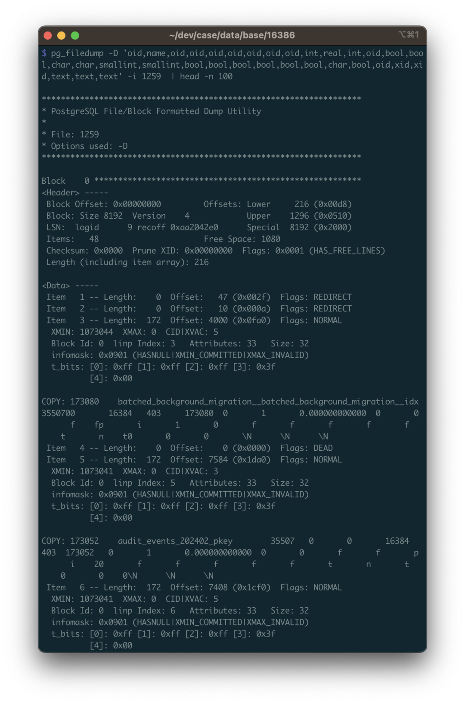
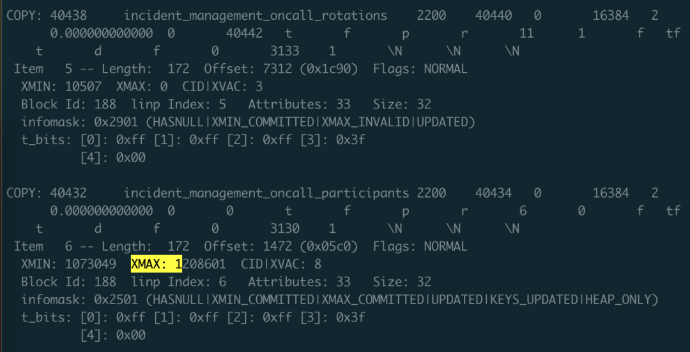
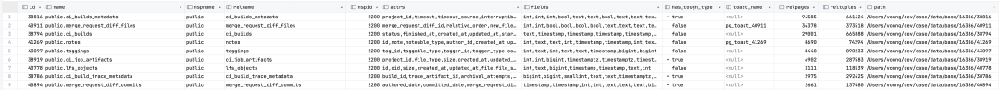
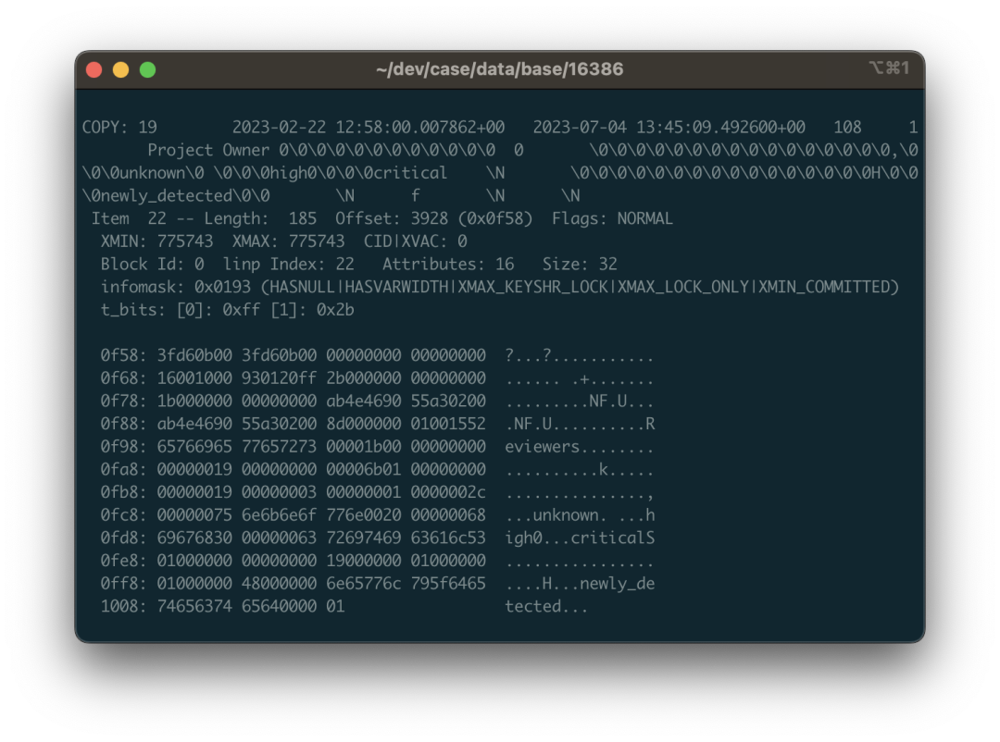
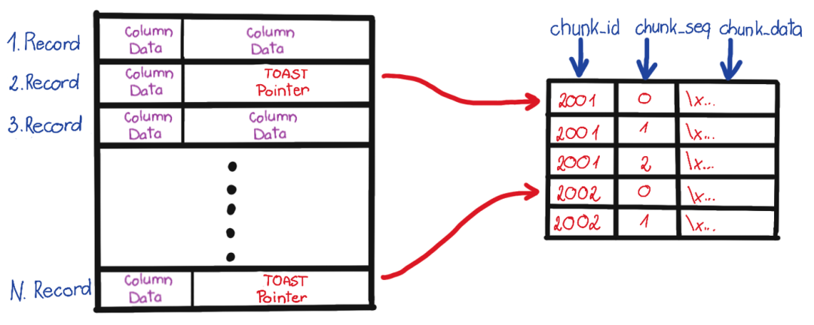
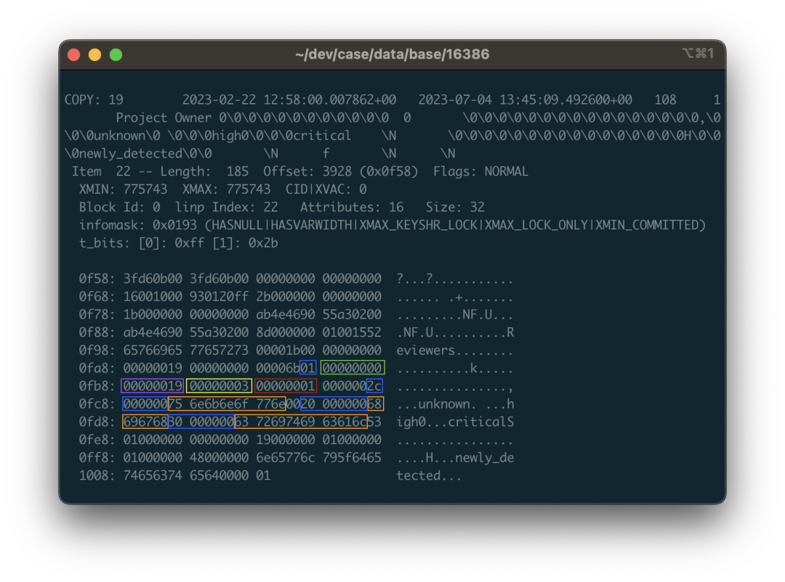
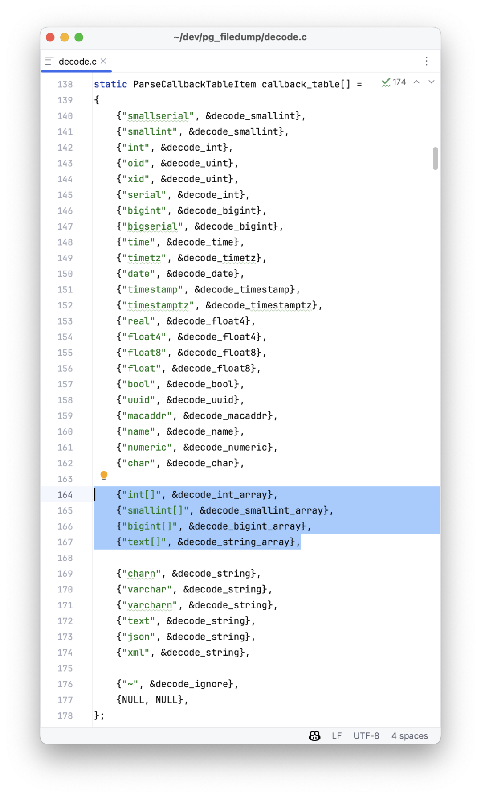
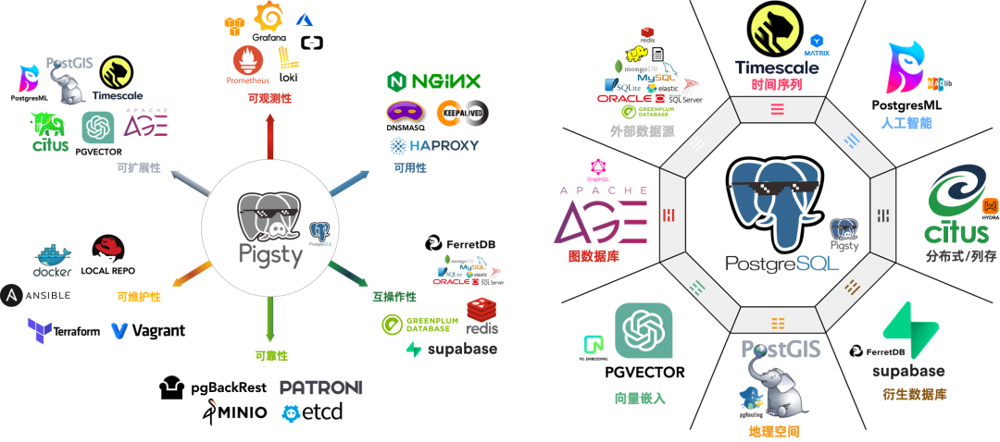

> Backups are a DBA's lifeline — but what if your PostgreSQL database has already exploded and you have no backups? Maybe pg_filedump can help you!

Recently encountered a rather outrageous case. The situation was this: a user's PostgreSQL database was corrupted — it was a PostgreSQL instance spun up by GitLab itself. No replicas, no backups, no dumps. Running on BCACHE using SSD as transparent cache, couldn't start after power outage.

But that wasn't the end of it. After several rounds of brutal treatment, it completely gave up the ghost: first, because they forgot to mount the BCACHE disk, GitLab re-initialized a new database cluster; then due to various reasons isolation failed, running two database processes on the same cluster directory corrupted the data directory; then running `pg_resetwal` without parameters pushed the database back to the origin point; finally letting the empty database run for a while, then removing the temporary backup from before the corruption.

Seeing this case, I was indeed speechless: it's already a complete mess, what's there to recover? Looks like we can only extract data directly from the underlying binary files. I suggested he find a data recovery company to try his luck, and also helped ask around, but among a bunch of data recovery companies, almost none had PostgreSQL data recovery services. Those that did only handled relatively basic problem types, and when encountering this situation, they all said they could only try their luck.

Data recovery quotes are usually charged by file count, ranging from ¥1000 to ¥5000 per file. The GitLab database has thousands of files, with about 1000 tables by count. Full recovery might not cost hundreds of thousands, but definitely over a hundred thousand. But after a day, no one took the job, which really made me feel frustrated: if no one can take this job, wouldn't it make the PG community look incompetent?

I thought about it — this job looks frustrating but quite challenging and interesting. Let's treat it as a dead horse and try to revive it, no charge if I can't fix it — how do we know if it works without trying? So I took it on myself.

----------

## Tools

Good tools make good work. For data recovery, the first step is naturally to find suitable tools: `pg_filedump` is a decent weapon that can extract raw binary data from PostgreSQL data pages. Many low-level tasks can be delegated to it.

This tool can be compiled and installed with the `make` triple combination, but you need to install the corresponding major version of PostgreSQL first. GitLab uses PG 13 by default, so after ensuring the corresponding version's `pg_config` is in the path, you can compile directly.

```bash
git clone https://github.com/df7cb/pg_filedump
cd pg_filedump && make && sudo make install
```

Using `pg_filedump` isn't complicated. You feed it data files, tell it the type of each column in the table, and it can help interpret them. For example, the first step is to know which databases exist in this database cluster. This information is recorded in the system view `pg_database`. This is a system-level table located in the `global` directory, assigned a fixed OID `1262` during cluster initialization, so the corresponding physical file is usually: `global/1262`.

```bash
vonng=# select 'pg_database'::RegClass::OID;
 oid
------
 1262
```

This system view has many fields, but we mainly care about the first two: `oid` and `datname`. `datname` is the database name, and `oid` can be used to locate the database directory position. Use `pg_filedump` to extract this table. The `-D` parameter tells `pg_filedump` how to interpret the binary data in each row of this table. You can specify the type of each field, separated by commas, and `~` means ignore everything after.



As you can see, each row of data starts with `COPY`. Here we found the target database `gitlabhq_production` with OID **16386**. So all files within this database should be located in the `base/16386` subdirectory.

----------

## Recovering Data Dictionary

Knowing the directory of data files to recover, the next step is to extract the data dictionary. There are four important tables to focus on:

• **`pg_class`**: Contains important metadata for all tables
• `pg_namespace`: Contains schema metadata
• `pg_attribute`: Contains all column definitions
• `pg_type`: Contains type names

Among these, **`pg_class`** is the most important and indispensable table. The other system views are "nice to have" — they can make our work simpler. So we first try to recover this table.

`pg_class` is a database-level system view with default OID = `1259`, so the file corresponding to `pg_class` should be: `base/16386/1259`, in the `gitlabhq_production` corresponding database directory.



Here's a side note: friends familiar with PostgreSQL principles know that the actual underlying storage data file names (RelFileNode) default to match the table's OID, but some operations might change this. In such cases, you can use `pg_filedump -m pg_filenode.map` to parse the mapping file in the database directory to find the Filenode corresponding to OID 1259. Of course, here they're consistent, so we won't go into detail.

We parse its binary file based on the table structure definition of `pg_class` (note to use the table structure for the corresponding PG major version): pg_filedump -D 'oid,name,oid,oid,oid,oid,oid,oid,oid,int,real,int,oid,bool,bool,char,char,smallint,smallint,bool,bool,bool,bool,bool,bool,char,bool,oid,xid,xid,text,text,text' -i base/16386/1259

Then you can see the parsed data. The data here is single-line records separated by `\t`, same format as PostgreSQL COPY command default. So you can use scripts to `grep` collect and filter, remove the `COPY` at the beginning of each line, and re-import into a real database table for closer inspection.



When doing data recovery, you need to pay attention to many details. The first is: you need to handle **deleted** rows. How to identify them? Use the `-i` parameter to print metadata for each row. The metadata has an `XMAX` field. If a row tuple was deleted by some transaction, then this record's `XMAX` will be set to that transaction's XID transaction number. So if a row's `XMAX` is not zero, it means this is a deleted record and shouldn't be output to the final result.



**The XMAX here indicates this is a deleted record**

With the `pg_class` data dictionary, you can clearly find the OID correspondence of other tables, including system views. Using the same method, you can recover `pg_namespace`, `pg_attribute`, and `pg_type` tables. What can you do with these four tables?



You can use SQL to generate input paths for each table, automatically construct the type of each column as the `-D` parameter, and generate schema for temporary result tables. In short, you can use programmatic automation to automatically generate all tasks that need to be completed.

```sql
SELECT  id, name, nspname, relname, nspid, attrs, fields, has_tough_type,
        CASE WHEN toast_page > 0 THEN toast_name ELSE NULL END AS toast_name, relpages, reltuples, path
FROM
    (
        SELECT n.nspname || '.' || c.relname AS "name", n.nspname, c.relname, c.relnamespace AS nspid, c.oid AS id, c.reltoastrelid AS tid,
               toast.relname AS toast_name, toast.relpages AS toast_page,
               c.relpages, c.reltuples, 'data/base/16386/' || c.relfilenode::TEXT AS path
        FROM meta.pg_class c
                 LEFT JOIN meta.pg_namespace n ON c.relnamespace = n.oid
           , LATERAL (SELECT * FROM meta.pg_class t WHERE t.oid = c.reltoastrelid) toast
        WHERE c.relkind = 'r' AND c.relpages > 0
          AND c.relnamespace IN (2200, 35507, 35508)
        ORDER BY c.relnamespace, c.relpages DESC
    ) z,
    LATERAL ( SELECT string_agg(name,',') AS attrs,
                     string_agg(std_type,',') AS fields,
                     max(has_tough_type::INTEGER)::BOOLEAN AS has_tough_type
              FROM meta.pg_columns WHERE relid = z.id ) AS columns;
```

Note that the data type names supported by the `pg_filedump -D` parameter are strictly limited standard names, so you must convert `boolean` to `bool`, `INTEGER` to `int`. If you want to parse data types not in the following list, you can first try using the `TEXT` type, for example, the INET type representing IP addresses can be parsed as `TEXT`.

bigint bigserial bool char charN date float float4 float8 int json macaddr name numeric oid real serial smallint smallserial text time timestamp timestamptz timetz uuid varchar varcharN xid xml

But there will indeed be other special cases requiring additional handling, such as PostgreSQL's `ARRAY` array types, which we'll detail later.

## Recovering an Ordinary Table

Recovering ordinary data tables isn't fundamentally different from recovering system catalog tables: it's just that catalog schemas and information are publicly standardized, while schemas of databases to be recovered may not be.

GitLab is also a well-known open-source software, so finding its database schema definitions isn't difficult. If it's an ordinary business system, you can spend more effort restoring the original DDL from `pg_catalog`.

Knowing the DDL definition, we can use the data type of each column in the DDL to interpret the data in binary files. Below, we use GitLab's ordinary table `public.approval_merge_request_rules` as an example to demonstrate how to recover such an ordinary data table.

```sql
create table approval_project_rules
(
    id                        bigint,
    created_at                timestamp with time zone,
    updated_at                timestamp with time zone,
    project_id                integer,
    approvals_required        smallint,
    name                      varchar,
    rule_type                 smallint,
    scanners                  text[],
    vulnerabilities_allowed   smallint,
    severity_levels           text[],
    report_type               smallint,
    vulnerability_states      text[],
    orchestration_policy_idx  smallint,
    applies_to_all_protected_branches              boolean,
    security_orchestration_policy_configuration_id bigint,
    scan_result_policy_id                          bigint
);
```

First, we need to convert the types here to types that `pg_filedump` can recognize. This involves type mapping: if you have uncertain types, like the `text[]` string array fields above, you can first use the `text` type as a placeholder, or directly use `~` to ignore:

bigint,timestamptz,timestamptz,int,smallint,varchar,smallint,text,smallint,text,smallint,text,smallint,bool,bigint,bigint

Of course, the first knowledge point here is that PostgreSQL's tuple column layout has an order, saved in the `attrnum` of the system view `pg_attribute`, while the type ID of each column in the table is saved in the `atttypid` field. To get the **English name** of the type, you need to reference the `pg_type` system view through the type ID (of course, system default types have fixed IDs and can also be mapped directly by ID). In summary, to get the interpretation method for physical records in a table, you need at least the four system dictionary tables mentioned above.

With the order and types of columns in this table, and knowing the binary file location of this table, you can use this information to translate binary data.

```bash
pg_filedump -i -f -D 'bigint,...,bigint' 38304
```



When outputting results, it's recommended to add `-i` and `-f` options. The former prints **metadata** for each row (needed to judge whether this row has been deleted based on XMAX); the latter prints raw binary data context (this is necessary for handling complex data that pg_filedump can't solve).

Normally, each record starts with `COPY:` or `Error:`. The former represents successful extraction, the latter represents partial success or failure. If it's failure, there are various reasons requiring separate handling. For successful data, you can directly extract it — each line is a record, separated by `\t`, replace `\N` with NULL, process and write to temporary tables for storage.

Of course, the devil is in the details, and data recovery would be easy if it were this simple.

----------

## The Devil is in the Details

When handling data recovery, there are many small details to pay attention to. Here I'll mention a few important points.

First is handling **TOAST** fields. TOAST is the acronym for "The Oversized-Attribute Storage Technique" — the **oversized attribute storage technique**. If you find that parsed field content is `(TOASTED)`, it means this field was too long and was sliced and moved to another dedicated table — the TOAST table.

If a table has potentially TOAST fields, it will have a corresponding TOAST table, identified by `reltoastrelid` OID in `pg_class`. TOAST can actually be treated as an ordinary table, so you can use the same method to parse TOAST data, splice it back together, then fill it into the original table. We won't expand on this here.



The second issue is **complex types**. As mentioned in the previous section, `pg_filedump` README lists supported types, but types like arrays require additional binary parsing processing.

For example, when you dump array binary, you might see a string of `\0\0`. This is because `pg_filedump` directly outputs complex types it can't handle. Of course, this brings some additional problems — null values in strings will make your inserts error, so your parsing script needs to handle this properly. When encountering a parsing error for a complex column, you should first mark it and reserve the spot, preserve the binary value scene for later steps to handle specifically.

Here we look at a specific example: still using the `public.approval_merge_request_rules` table above. We can see some scattered strings from the dumped data, binary view, and ASCII view: `critical`, `unknown`, etc., mixed in a string of `\0` and binary control characters. Yes, this is the binary representation of a string array. Arrays in PostgreSQL allow arbitrary types and arbitrary depth nesting, so the data structure here is a bit complex.



For example, the highlighted area in the image corresponds to data that is an array containing three strings: `{unknown,high,critical}::TEXT[]`. 01 represents this is a one-dimensional array, followed by the null bitmap, and the 0x00000019 representing the type OID of array elements. `0x19` decimal value is 25 corresponding to `text` type in `pg_type`, indicating this is a string array (if it's `0x17`, it means integer array). Next is the dimension 0x03 of the first dimension of this array, because this array only has one dimension with three elements; the following 1 tells us where the starting offset of the first dimension of the array is. After that are the three consecutive string structures: headed by a 4-byte length (need to right-shift two bits to handle flags), followed by string content, and also need to consider layout alignment and padding issues.

Overall, you need to dig against source code implementation, and there are endless details here: variable length, null bitmaps, field compression, out-of-line storage, and endianness. One small mistake and what you extract becomes useless mush.

You can choose to directly use Python scripts to parse raw binary from record context to backfill data, or register new types and callback handling functions in pg_filedump source code, reusing C parsing functions provided by PG. Either approach isn't easy.

Fortunately, PostgreSQL itself already provides some C language helper functions & macros that can help you complete most of the work, and luckily, arrays in GitLab are all one-dimensional arrays, types are limited to integer arrays and string arrays. Other data pages with complex types can also be rebuilt from other tables, so the overall workload is still acceptable.



----------

## Epilogue

This job took me two days of wrestling. I won't expand on the dirty details — I estimate readers wouldn't be interested either. In short, after a series of processing, correction, and matching, the data recovery work was finally completed! Except for a few damaged records in several tables, all other data was successfully extracted. Good lord, a full thousand tables!

I've handled some data recovery jobs before, most situations were relatively simple — bad blocks, control file/CLOG corruption, or infected by mining virus ransomware (writing some garbage files to Tablespace). But this is the first time I've handled such a thoroughly exploded case. The reason I dared take this job was because I have some understanding of the PG kernel and know these tedious implementation details. As long as you know this is an engineeringly solvable problem, then no matter how dirty and tiring the process, you won't worry about not being able to complete it.

Despite some defects, `pg_filedump` is still a good tool. I might consider improving it later to have complete support for various data types, so I won't need to write a bunch of Python scripts to handle various tedious details. After finishing this case, I've already packaged `pg_filedump` RPMs for PG 12-16 x EL 7-9 and put them in Pigsty's Yum source, included by default in Pigsty offline software packages. Currently implemented and delivered in [Pigsty v2.4.1](http://mp.weixin.qq.com/s?__biz=MzU5ODAyNTM5Ng==&mid=2247486215&idx=1&sn=52ce37a537336a6d07448f35c7bc4cfd&chksm=fe4b3edcc93cb7ca2dc87602430c2beb09ae5e7dcb568158541a1bd026e305d69d94cea81da4&scene=21#wechat_redirect). I sincerely hope you never need to use this extension, but if you really encounter scenarios requiring it, I also hope it's right at hand ready to use.

Finally, I want to say that many software systems need databases, but database installation, deployment, and maintenance is quite challenging work. The PostgreSQL spun up by GitLab is already quite good quality, but still helpless in the face of such situations, not to mention those crude single-instance deployments in homebrew docker images. One major failure can make an enterprise's accumulated code data, CI/CD processes, Issue/PR/MR records vanish into thin air. I really suggest you carefully examine your database systems — at least please do regular backups!



The core difference between GitLab's enterprise and community editions is whether the underlying PG has high availability and monitoring. The [**out-of-the-box PostgreSQL distribution — Pigsty**](http://mp.weixin.qq.com/s?__biz=MzU5ODAyNTM5Ng==&mid=2247486135&idx=1&sn=7d9c4920e94efba5d0e0b6af467f596c&chksm=fe4b3f6cc93cb67ac570d5280b37328aed392598b13df88545ff0a06f99630801fc999db8de5&scene=21#wechat_redirect) can also better solve these problems for you, completely open source and free: whether high availability, PITR, or monitoring systems are all included. Next time you encounter such problems, you can automatically switch/one-click rollback with much more ease. Previously our own GitLab, Jira, Confluence and other software all ran on it. If you have similar needs, you might want to give it a try.