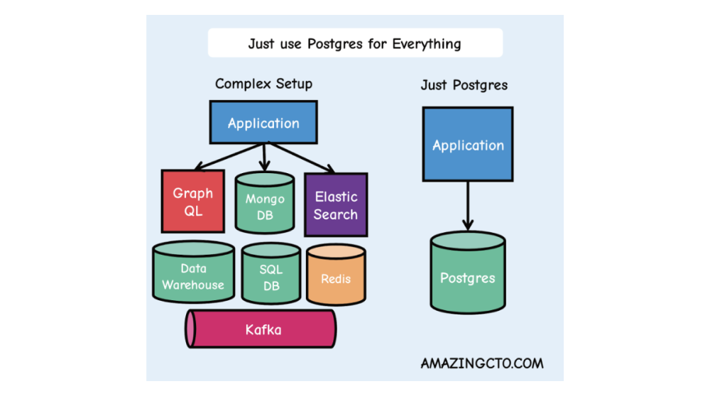
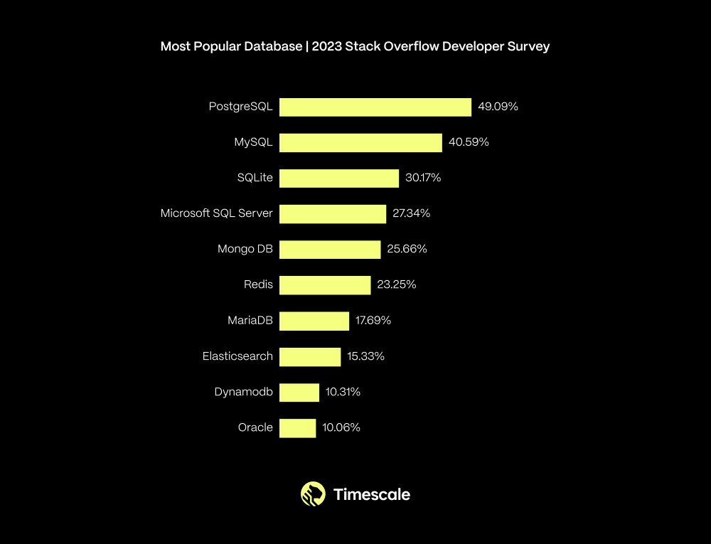
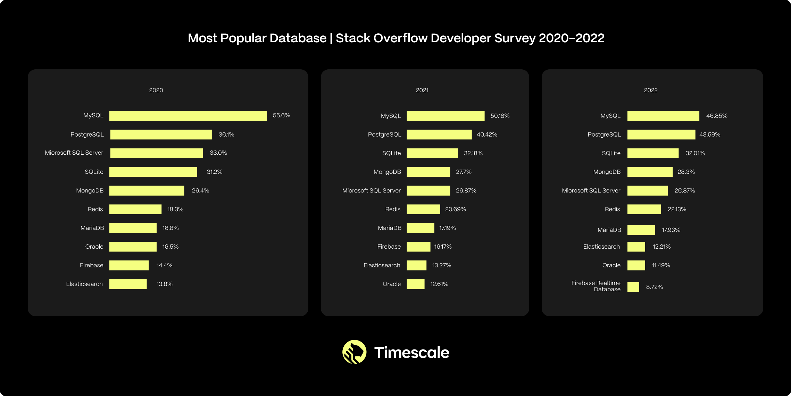
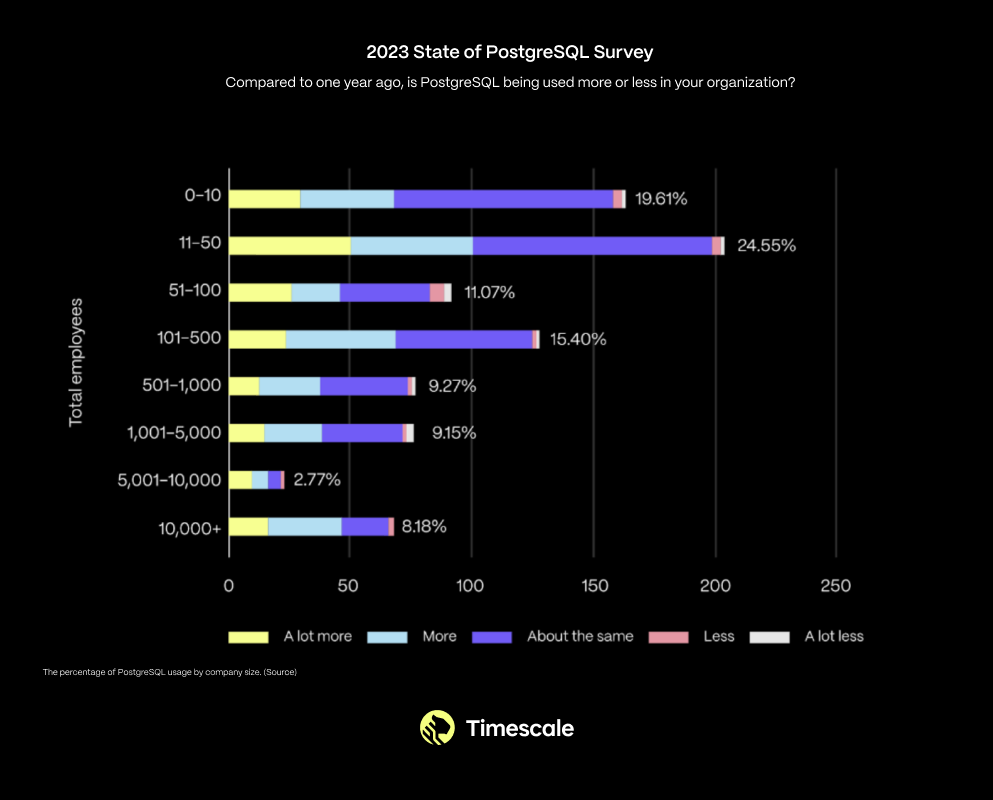

Today, one of the biggest trends in software development is PostgreSQL becoming the de facto database standard. There have already been blogs about using PostgreSQL for everything, but there haven't been many articles explaining the reasons behind this phenomenon (and more importantly, why it matters) — so I wrote this article.

> This article was written by Ajay Kulkarni, CEO of TimescaleDB, originally published on the TimescaleDB blog: "[Why PostgreSQL Is the Bedrock for the Future of Data](https://www.timescale.com/blog/postgres-for-everything/)".
>
> Translator: Vonng, PostgreSQL expert, author of open-source RDS PG — Pigsty.

## Table of Contents

- 01 PostgreSQL is becoming the de facto database standard
- 02 Everything is becoming computerized
- 03 PostgreSQL's triumphant return
- 04 Break free, build the future, embrace PostgreSQL

---------

## PostgreSQL is becoming the de facto database standard

In the past few months, "PostgreSQL can solve everything" has become a battle cry among developers:

> PostgreSQL is not just a simple relational database, but a data management abstraction framework with the power to devour the entire database world. And this is what's happening — "use Postgres for everything" is no longer the frontier exploration of a few elite teams, but has become a mainstream best practice.
>
> — "[PostgreSQL is Eating the Database World](https://pigsty.io/pg/pg-eat-db-world/)", Vonng (me!)

> One way to simplify tech stacks, reduce components, accelerate development, reduce risk and provide more features in startups is **"use Postgres for everything"**. Postgres can replace many backend technologies, including Kafka, RabbitMQ, ElasticSearch, Mongo and Redis, at least until millions of users without problems.
>
> — "[Technical Minimalism: Just Use Postgres](https://pigsty.io/pg/just-use-pg/)", Stephan Schmidt

> I heard Postgres is called the "Swiss Army knife of databases", well... yes, that sounds accurate! Not sure who first said it, but it's a very apt observation! — [Gergely Orosz](https://twitter.com/GergelyOrosz/status/1780210365369885009).

> PostgreSQL comes with built-in moats. It develops steadily, maintaining solid support for SQL standards, and has now become a popular database choice. It has excellent documentation quality (among the best I've seen). Integration with PostgreSQL is very easy, and recently every data tool startup I've seen usually makes PostgreSQL their first data source connection choice. (I believe this is also because PG is feature-rich with strong community support) — [Abhishek](https://twitter.com/StalwartCoder/status/1780216838166581418).

> Learning Postgres is undoubtedly one of the highest ROI technologies in my career. Today, excellent companies like @neondatabase, @supabase, and @TimescaleDB are all built on PostgreSQL. Now it's important enough to me to rival React and iOS development — [Harry Tormey](https://twitter.com/htormey/status/1780285782554706405)

> YouTube video: [Wait... What Can PostgreSQL Do?](https://www.youtube.com/watch?v=VEWXmdjzIpQ&t=2s)

> *"When I first heard about Postgres (when MySQL was absolutely dominant), someone told me it was 'the database made by math nerds', and then I realized: yes, these are exactly the people who should be making databases." — [Yuan Gao](https://twitter.com/mesetatron/status/1780436890602307733)*

> *"PG achieved an amazing comeback: now NoSQL has declined, Oracle owns MySQL, what choice do you have?"*
>
> — [Manoj Khangaonkar](https://twitter.com/mjkhanga/status/1780230248728350730)

> *"Postgres isn't just a relational database, it's a way of life." — [ilaksh](https://news.ycombinator.com/item?id=39874270)*

With its rock-solid foundation, plus the powerful feature set brought by its native capabilities and extension plugins, developers can now solve all problems with PostgreSQL alone, replacing complex and fragile data architectures with simple and clear approaches.

> Source: [Just Use Postgres for Everything](https://www.amazingcto.com/postgres-for-everything/)

This might explain why last year PostgreSQL took the top spot from MySQL in the most popular database rankings among professional developers (60,369 respondents):

**In the past year, which database environments have you done extensive development work in, and which database environments do you want to work in in the coming year? Over 49% of respondents chose PostgreSQL.** — Source: [StackOverflow 2023 Annual Survey]()

These results come from the 2023 [Stack Overflow Developer Survey](https://survey.stackoverflow.co/2023/#most-popular-technologies-database-prof). Looking over the past few years, you can see PostgreSQL's usage has shown steady growth:

Between 2020-2022, according to StackOverflow developer surveys, PostgreSQL was the second most popular database with consistently rising usage rates. Sources: [**2020**](https://survey.stackoverflow.co/2020#technology-databases), [**2021**](https://survey.stackoverflow.co/2021/#section-most-popular-technologies-databases), [**2022**](https://survey.stackoverflow.co/2022#section-most-popular-technologies-databases).

This isn't just a trend among small startups and hobbyists. In fact, PostgreSQL usage is growing across organizations of all sizes.

> PostgreSQL usage changes by company size ([TimescaleDB 2023 Community Survey](https://www.timescale.com/state-of-postgres/2023))

At Timescale, this trend isn't foreign to us. We've been PostgreSQL believers for nearly a decade. This is why our business is built on PostgreSQL, why we are [one of the top contributors to PostgreSQL](https://www.linkedin.com/posts/ajaykulkarni_edb-just-published-the-most-recent-analysis-activity-7163189940648947712-amIR?utm_source=share&utm_medium=member_desktop), why we conduct annual [PostgreSQL community surveys](https://www.timescale.com/state-of-postgres/2023) (mentioned above), and why we support PostgreSQL Meetups and conferences. Personally, I've been using PostgreSQL for over 13 years (since I switched from MySQL).

There have already been blog posts discussing **how** to use PostgreSQL for everything, but none discussing **why** this is happening (and more importantly, *why it matters*).

Until now.

But to understand why this is happening, we must first understand a more fundamental trend and how this trend is changing the basic nature of human reality.

----------------

## Everything Has Become a Computer

Everything has become a computer — our cars, homes, cities, farms, factories, money, and various things, including ourselves, are becoming increasingly digital. Each year we digitize more of our identities and behaviors: how we shop, how we entertain ourselves, how we collect art, how we find answers, how we communicate and connect, and how we express ourselves.

Twenty-two years ago, this "ubiquitous computing" was still a bold idea. At that time, I was a graduate student at MIT's AI Lab, working on my [thesis](https://dspace.mit.edu/bitstream/handle/1721.1/8078/51181976-MIT.pdf;sequence=2) on intelligent environments. My research was supported by MIT's [Oxygen Project](http://oxygen.lcs.mit.edu/Overview.html), which had a lofty and bold goal: to make computing as ubiquitous as the air we breathe. Back then, our own servers were housed in a small cubicle.

But much has changed since then. Computing is now everywhere: on our desktops, in our pockets, in our "cloud," and in our various objects. We foresaw these changes but didn't foresee the second-order effects of these changes:

**Ubiquitous computing led to ubiquitous data**. With each new computing device, we collected more information about our real world: human data, machine data, business data, environmental data, and synthetic data. This data is flooding our world.

**The data deluge triggered a Cambrian explosion of databases**. All these new data sources need new places to be stored. Twenty years ago, there might have been only five viable database options. Today, there are hundreds, most designed specifically for particular data, with new databases emerging every month.

**More data and databases led to more software complexity**. Correctly choosing the right database for your software workload is no longer simple. Instead, developers are forced to cobble together complex architectures that might include: relational databases (for reliability), non-relational databases (for scalability), data warehouses (for analytics), object storage (for cheap archival of cold data). This architecture might have even more specialized components, such as time-series databases or vector databases.

**More complexity means less time for building software**. The more complex the architecture, the more fragile it becomes, requiring more complex application logic and slowing development, leaving less time for development. Complexity isn't an asset but a real cost.

As computing becomes more pervasive, our real lives become increasingly intertwined with computing. We brought computing into our world and brought ourselves into the computing world. We no longer just have offline identities but are a hybrid of what we do offline and online.

In this new reality, software developers are the pioneers of humanity. We are the ones who build the software that shapes this new reality.

But developers are now drowning in data, drowning in database complexity.

**This means developers — spend increasingly more time managing internal architecture rather than shaping the future.**

How did we get to this point?

----------------

### Part I: Wave After Wave of Computing

Ubiquitous computing bringing ubiquitous data didn't happen overnight but evolved over decades in waves:

- Mainframes/Big Iron (1950s+)
- Personal Computers (1970s+)
- Internet (1990s+)
- Mobile Phones (2000s+)
- Cloud Computing (2000s+)
- Internet of Things (2010s+)

Each wave of technology made computers smaller, more powerful, and more pervasive. Each wave also built on the previous: personal computers were miniaturized mainframes; the internet was a network connecting computers; smartphones were smaller computers connected to the internet; cloud computing democratized access to computing resources; IoT was reconstructing smartphone components into other physical devices connected to the cloud.

But in the past twenty years, computing advances appeared not just in the physical world but also in the digital world, reflecting our hybrid reality:

- Social Networks (2000s+)
- Blockchain (2010s+)
- Generative AI (2020s+)

Each new wave of computing allowed us to capture new sources of information about our hybrid reality: human digital exhaust data, machine data, business data, and synthetic data. Future waves will create more data. All this data drives new technological waves, the latest being generative AI, further shaping our reality.

Computing waves aren't isolated but affect each other like dominoes. The initial data trickle quickly became a data deluge. Then, the data deluge prompted the creation of more and more databases.

----------------

### Part II: Databases Keep Growing

All these new data sources need new places to be stored — databases.

Mainframes started with [Integrated Data Store](https://en.wikipedia.org/wiki/Integrated_Data_Store) (1964) and later [System R](https://en.wikipedia.org/wiki/IBM_System_R) (1974) — the first SQL database. Personal computers drove the rise of the first commercial databases: [Oracle](https://en.wikipedia.org/wiki/Oracle_Corporation) (1977) inspired by System R; [DB2](https://en.wikipedia.org/wiki/IBM_Db2) (1983); and Microsoft's response to Oracle: [SQL Server](https://en.wikipedia.org/wiki/Microsoft_SQL_Server) (1989).

The collaborative power of the internet promoted the rise of open-source software, including the first open-source databases: [MySQL](https://en.wikipedia.org/wiki/MySQL) (1995), [PostgreSQL](https://en.wikipedia.org/wiki/PostgreSQL) (1996). Smartphones drove widespread adoption of [SQLite](https://en.wikipedia.org/wiki/SQLite) (2000).

The internet also generated massive amounts of data, leading to the first non-relational (NoSQL) databases: [Hadoop](https://en.wikipedia.org/wiki/Apache_Hadoop) (2006); [Cassandra](https://en.wikipedia.org/wiki/Apache_Cassandra) (2008); [MongoDB](https://en.wikipedia.org/wiki/MongoDB) (2009). Some called this period the "Big Data" era.

----------------

### Part III: Database Explosion

Around 2010, we began reaching a tipping point. Before this, software applications typically relied on a single database — for example, Oracle, MySQL, PostgreSQL — the choice was relatively simple.

But "Big Data" kept getting bigger: IoT brought an explosion of machine data; thanks to iPhone and Android, smartphone usage began growing exponentially, emitting more human digital "exhaust"; cloud computing made computing and storage resources universally accessible, exacerbating these trends. Generative AI recently made this problem worse — it pulled in vector data.

As the volume of collected data grew, we saw the rise of specialized databases: [Neo4j](https://en.wikipedia.org/wiki/Neo4j) for graph data (2007), [Redis](https://en.wikipedia.org/wiki/Redis) for basic key-value storage (2009), [InfluxDB](https://en.wikipedia.org/wiki/InfluxDB) for time-series data (2013), [ClickHouse](https://en.wikipedia.org/wiki/ClickHouse) for large-scale analytics (2016), Pinecone for vector data (2019), etc.

Twenty years ago, there might have been only five viable database options. Today, there are [hundreds](https://db-engines.com/en/ranking), most designed for specific use cases, with new databases appearing monthly. While early databases promised *universal omnipotence*, these specialized databases offer *specific trade-offs*, and whether these trade-offs make sense depends on your specific use case.

----------------

### Part IV: More Databases, More Problems

Facing this data deluge and various specialized databases with different trade-offs, developers had no choice but to cobble together complex architectures.

These architectures typically include a relational database (for reliability), a non-relational database (for scalability), a data warehouse (for analytics), object storage (for cheap archival), and even more specialized components like time-series or vector databases for those specific use cases.

But the more complex the architecture, the more fragile it becomes, requiring more complex application logic and slowing development, leaving less time for development.

**This means developers — spend increasingly more time managing internal architecture rather than shaping the future.**

There's a better way to solve this problem.

----------------

## PostgreSQL's Triumphant Return

The story takes a turn here, and our protagonist is no longer a brand-new database but an old-guard database with a name only ~~core~~ developers would love: PostgreSQL.

Initially, PostgreSQL ranked second after MySQL, and by a wide margin. MySQL was easier to use, had corporate backing, and had a catchy name. But then MySQL was acquired by Sun Microsystems (2008), which was then acquired by Oracle (2009). At that point, software developers began reconsidering what database to use — they had originally viewed MySQL as the free software savior from expensive Oracle tyranny.

Meanwhile, a distributed developer community sponsored by several small independent companies was slowly making PostgreSQL better and better. They quietly added powerful features like full-text search (2008), window functions (2009), and JSON support (2012). They also made the database more solid and reliable through streaming replication, hot standby, in-place upgrades (2010), logical replication (2017), while diligently fixing bugs and optimizing rough edge cases.

----------------

### PostgreSQL Has Become a Platform

During this period, one of the most impactful features PostgreSQL added was support for **Extensions**: software modules that can add functionality to PostgreSQL (2011). [Extensions allowed more developers to independently, quickly, and with minimal coordination add functionality to PostgreSQL](https://www.timescale.com/learn/postgres-extensions).

Thanks to extensions, PostgreSQL began becoming more than just an excellent relational database. Thanks to PostGIS, it became an excellent geospatial database; thanks to TimescaleDB, it became an excellent time-series database; + hstore, key-value storage database; + AGE, graph database; + pgvector, vector database. PostgreSQL became a platform.

Now, developers choose PostgreSQL for various purposes. For example, for reliability, for scalability (replacing NoSQL), for analytics (replacing data warehouses).

----------------

### What About Big Data?

At this point, smart readers should ask, "What about Big Data?" — that's a good question. Historically, "Big Data" (e.g., hundreds of TB to PB) — and related analytical queries weren't suitable scenarios for databases like PostgreSQL that don't inherently support horizontal scaling.

But the situation here is also changing. Last November, we launched "[Tiered Storage](https://www.timescale.com/blog/scaling-postgresql-for-cheap-introducing-tiered-storage-in-timescale/)," which can automatically tier your data between disk and object storage (S3), effectively achieving **unlimited storage table** capabilities.

So historically, while "Big Data" was PostgreSQL's shortcoming, soon there will be no workload too large for it to handle.

PostgreSQL is the answer. PostgreSQL is how we break free and build the future.

----------------

## Break Free, Build the Future, Embrace PostgreSQL

Rather than struggling with various heterogeneous database systems (each with its own query language and quirks!), we can rely on the world's most feature-rich and possibly most reliable database: PostgreSQL. We can stop spending vast amounts of time on infrastructure and spend more time building the future.

And PostgreSQL keeps improving. The PostgreSQL community continues improving the kernel. Now more companies are participating in PostgreSQL development, including those giant vendors.

> Today's PostgreSQL ecosystem — "[PostgreSQL is Eating the Database World](https://pigsty.io/pg/pg-eat-db-world/)"

Similarly, there are more innovative independent companies developing around the PostgreSQL kernel to improve its user experience: [Supabase](https://supabase.com/) (2020) is building PostgreSQL into a Firebase alternative for web and mobile developers; [Neon](https://neon.tech/) (2021) and [Xata](https://xata.io/) (2022) are both implementing "scale to zero" PostgreSQL for intermittent Serverless workloads; [Tembo](https://tembo.io/) (2022) provides out-of-the-box stacks for various use cases; [Nile](https://www.thenile.dev/) (2023) is making PostgreSQL easier to use for SaaS applications; and many other companies. Of course, there's also us, [**Timescale**](https://www.timescale.com/) (2017).

> This omits three sections about TimescaleDB introduction

----------------

## Epilogue: Yoda?

Our real world, whether physical or virtual, offline or online, is full of data. As Yoda said, data surrounds us and binds us. This reality is increasingly controlled by software, and this software is written by us developers.

This is worth celebrating. Especially not long ago, in 2002, when I was still a graduate student at MIT, the world had lost faith in software. We were recovering from the dot-com bubble burst. Mainstream media said "[IT Doesn't Matter](https://hbr.org/2003/05/it-doesnt-matter)". Back then, it was easier for a software developer to find a good job in the financial industry than in tech — the path many of my MIT classmates chose, including myself.

But today, especially in this world of generative AI, we are the shapers of the future. We are the builders of the future. We should feel amazed.

Everything is becoming a computer. This is largely a good thing: our cars are safer, our homes more comfortable, our factories and farms more efficient. We have instant access to more information than ever before. We are more connected to each other. Sometimes, it makes us healthier and happier.

But not always. Like the Force, computing power also has light and dark sides. There's growing evidence that phones and social media directly contribute to [a global epidemic of teenage mental illness](https://www.amazon.com/Anxious-Generation-Rewiring-Childhood-Epidemic-ebook/dp/B0C9F37G28/ref=sr_1_3). We're still grappling with the implications of [AI and synthetic biology](https://www.amazon.com/Coming-Wave-Technology-Twenty-first-Centurys-ebook/dp/B0BSKW45KB/ref=sr_1_1). As we embrace more powerful forces, we should realize this comes with corresponding responsibility.

We control precious resources for building the future: our time and energy. We can choose to spend these resources on managing infrastructure, or fully embrace PostgreSQL and build the right future.

I think you already know our position.

Thanks for reading. #Postgres4Life