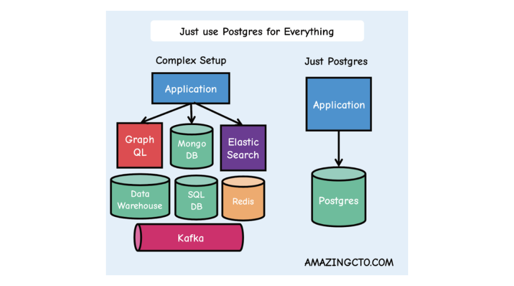
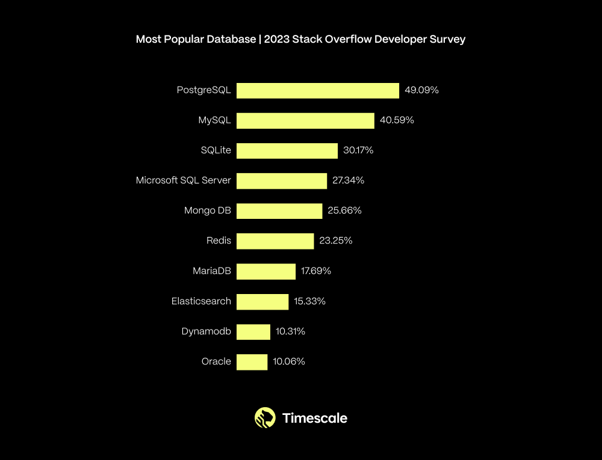
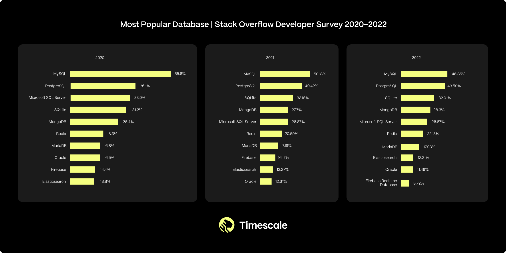
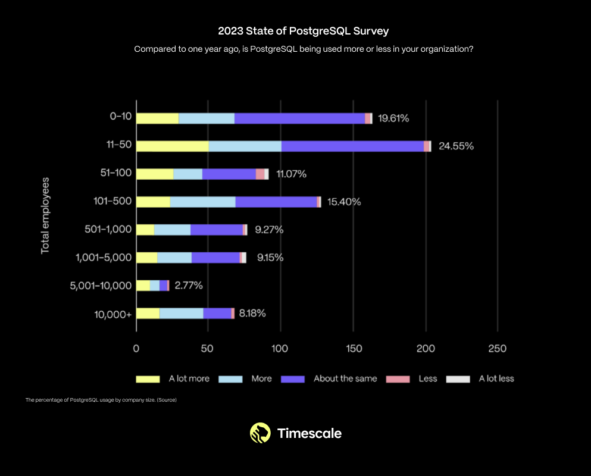
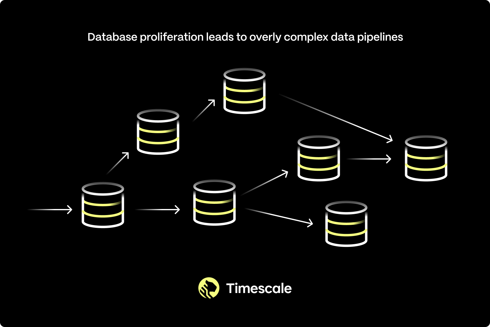

如今，软件开发中最大的趋势之一，是 PostgreSQL 正在成为事实上的数据库标准。已经有一些博客阐述了如何做到 万物皆用 PostgreSQL，但还没有多少文章能解释这一现象背后的原因。（更重要的是，为什么这件事很重要） —— 所以我写下了这篇文章。

> 本文作者为 Ajay Kulkarni，TimescaleDB CEO ，原文发表于 TimescaleDB 博客：《[Why PostgreSQL Is the Bedrock for the Future of Data](https://www.timescale.com/blog/postgres-for-everything/)》。
>
> 译者 Vonng，PostgreSQL 专家，开源 RDS PG —— Pigsty 作者。

## 目录

- 01 PostgreSQL 正成为事实上的数据库标准
- 02 万物都开始计算机化
- 03 PostgreSQL 王者归来
- 04 解放双手，构建未来，拥抱 PostgreSQL

---------

## PostgreSQL 正成为事实上的数据库标准

在过去几个月里，“一切皆可用 PostgreSQL 解决” 已经成为开发者们的战斗口号：

> PostgreSQL 并不是一个简单的关系型数据库，而是一个数据管理的抽象框架，具有吞噬整个数据库世界的力量。而这也是正在发生的事情 —— “一切皆用 Postgres” 已经不再是少数精英团队的前沿探索，而是成为了一种进入主流视野的最佳实践。
>
> —— 《[PostgreSQL正在吞噬数据库世界](https://pigsty.io/zh/pg/pg-eat-db-world/)》，冯若航（me！）

> 在初创公司中简化技术栈、减少组件、加快开发速度、降低风险并提供更多功能特性的方法之一就是**“一切皆用 Postgres”**。Postgres 能够取代许多后端技术，包括 Kafka、RabbitMQ、ElasticSearch，Mongo和 Redis ，至少到数百万用户时都毫无问题。
>
> ——《[技术极简主义：一切皆用Postgres](https://pigsty.io/zh/pg/just-use-pg/)》， Stephan Schmidt

> 听说 Postgres 被称为“数据库届的瑞士军刀”，嗯…… 是的，听起来很准确！ 不确定是谁第一个提出来的，但这是一个非常恰当的观察！ —— [Gergely Orosz](https://twitter.com/GergelyOrosz/status/1780210365369885009) 。

> PostgreSQL 天生自带护城河。它发展稳定，一直保持着对SQL标准的坚实支持，如今已成为数据库的热门选择。它有着极佳的文档质量（是我迄今见过的最好的之一）。与PostgreSQL集成非常容易，最近我看到的每一个数据工具初创公司通常都将 PostgreSQL 作为其第一个数据源连接选择。（我相信这也是因为PG功能丰富并有着强大的社区支持）—— [Abhishek](https://twitter.com/StalwartCoder/status/1780216838166581418) 。

> 学习 Postgres 无疑是我职业生涯中投资回报率最高的技术之一。如今，像 @neondatabase，@supabase，和 @TimescaleDB 这样的优秀公司都是基于 PostgreSQL 构建的。现在它对我非常重要，足以与 React 和 iOS 开发并驾齐驱 —— [Harry Tormey](https://twitter.com/htormey/status/1780285782554706405)

> YouTube视频：[等等...PostgreSQL能做什么？](https://www.youtube.com/watch?v=VEWXmdjzIpQ&t=2s)

> *“当我第一次听说 Postgres 时（那时候MySQL绝对是主导者），有人对我说这是“那些数学怪咖弄出来的数据库”，然后我意识到：没错，就是这些人，才适合做数据库。”  —— [Yuan Gao](https://twitter.com/mesetatron/status/1780436890602307733)*

> *“PG实现了惊人的复兴：现在 NoSQL 已经没落，Oracle 又拥有了MySQL，你还有什么选择呢？”*
>
> —— [Manoj Khangaonkar](https://twitter.com/mjkhanga/status/1780230248728350730)

> *“Postgres不仅仅是一个关系数据库，它是一种生活方式。” —— [ilaksh](https://news.ycombinator.com/item?id=39874270)

凭借其坚如磐石的基础，加上其原生功能与扩展插件带来的强大功能集，开发者现在可以单凭 PostgreSQL 解决所有问题，用简洁明了的方式，取代复杂且脆弱的数据架构。

> 来源：[Just Use Postgres for Everything](https://www.amazingcto.com/postgres-for-everything/)

这也许可以解释为什么去年 PostgreSQL 在专业开发者中，在最受欢迎的数据库排行榜上，从MySQL手中夺得了榜首位置（60,369 名受访者）：

**在过去一年中，你在哪些数据库环境中进行了大量开发工作，以及在接下来的一年中你想在哪些数据库环境中工作？超过49%的受访者选择了PostgreSQL。** —— 来源：[StackOverflow 2023 年度用户调研]()

这些结果来自 2023 年的 [Stack Overflow开发者调查](https://survey.stackoverflow.co/2023/#most-popular-technologies-database-prof)。如果纵观过去几年，可以看到 PostgreSQL 的使用率在过去几年中有着稳步增长的趋势：

在 2020 ~ 2022 年间，根据 StackOverflow 的开发者调查显示，PostgreSQL 是第二受欢迎的数据库，其使用率持续上升。来源： [**2020**](https://survey.stackoverflow.co/2020#technology-databases)，[**2021**](https://survey.stackoverflow.co/2021/#section-most-popular-technologies-databases)，[**2022**](https://survey.stackoverflow.co/2022#section-most-popular-technologies-databases)。

这不仅仅是小型初创公司和业余爱好者里的趋势。实际上，在各种规模的组织中，PostgreSQL 的使用率都在增长。

> PostgreSQL 使用率变化，按公司规模划分（ [TimescaleDB 2023 社区调研](https://www.timescale.com/state-of-postgres/2023)）

在 Timescale，我们这一趋势对我们并不陌生。我们已经是 PostgreSQL 的信徒近十年了。这就是为什么我们的业务建立在 PostgreSQL 之上，以及为什么我们是 [PostgreSQL 的顶级贡献者之一](https://www.linkedin.com/posts/ajaykulkarni_edb-just-published-the-most-recent-analysis-activity-7163189940648947712-amIR?utm_source=share&utm_medium=member_desktop)，为什么我们每年举办 [PostgreSQL 社区调研](https://www.timescale.com/state-of-postgres/2023)（上述提到），以及为什么我们支持 PostgreSQL 的 Meetup 与大会。就个人而言，我已经使用 PostgreSQL 超过 13 年了（当时我从 MySQL 转换过来）。

已经有一些博客文章讨论了 **如何** （How）将 PostgreSQL 用于一切问题，但还没有讨论 **为什么** （Why）会这样发生（更重要的是，*为什么这很重要*）。

直到现在。

但要理解为什么会发生这种情况，我们必须先了解一个更为基础的趋势以及这个趋势是如何改变人类现实的基本性质的。

----------------

## 02 一切都变成了电脑

一切都变成了计算机 —— 我们的汽车、家庭、城市、农场、工厂、货币以及各种事物，包括我们自己，也正在变得更加数字化。我们每年都在更进一步地数字化自己的身份和行为：如何购物，如何娱乐，如何收藏艺术，如何寻找答案，如何交流和连接，以及如何表达自我。

二十二年前，这种 “无处不在的计算” 还是一个大胆的想法。那时，我是麻省理工学院人工智能实验室的研究生，还在搞着智能环境的[论文](https://dspace.mit.edu/bitstream/handle/1721.1/8078/51181976-MIT.pdf;sequence=2)。我的研究得到了麻省理工学院[氧气计划](http://oxygen.lcs.mit.edu/Overview.html)的支持，该计划有一个崇高而大胆的目标：让计算像我们呼吸的空气一样无处不在。就那时候而言，我们自己的服务器架设在一个小隔间中。

但从那以后，很多事情都变了。计算现在无处不在：在我们的桌面上，在我们的口袋里，在我们的 “云” 中，以及在我们的各种物品中。我们预见到了这些变化，但没有预见到这些变化的二级效应：

**无处不在的计算导致了无处不在的数据**。随着每一种新的计算设备的出现，我们收集了更多关于我们现实世界的信息：人类数据、机器数据、商业数据、环境数据和合成数据。这些数据正在淹没我们的世界。

**数据的洪流引发了数据库的寒武纪大爆炸**。所有这些新的数据源需要新的存储地点。二十年前，可能只有五种可行的数据库选项。而如今，有数百种，大多数都是针对特定的数据而特别设计的，且每个月都在涌现新的数据库。

**更多的数据和数据库导致了更多的软件复杂性**。正确选择适合你软件工作负载的数据库已不再简单。相反，开发者被迫拼凑复杂的架构，这可能包括：关系数据库（因其可靠性）、非关系数据库（因其可伸缩性）、数据仓库（因其分析能力）、对象存储（因其便宜归档冷数据的能力）。这种架构甚至可能会有更为专业特化的组件，例如时序数据库或向量数据库。

**更多的复杂性意味着留给构建软件的时间越短**。架构越复杂，它就越脆弱，就需要更复杂的应用逻辑，并且会拖慢开发速度，留给开发的时间就越少。复杂性不是一项优点，而是一项真正的成本。

随着计算越来越普遍，我们的现实生活越来越与计算交织在一起。我们把计算带入了我们的世界，也把我们自己带入了计算的世界。我们不再仅仅有着线下的身份，而是一个线下与线上所作所为的混合体。

在这个新现实中，软件开发者是人类的先锋。正是我们构建了那些塑造这一新现实的软件。

但是，开发者现在被数据淹没，被淹没在数据库的复杂性中

**这意味着开发者 ——  花费越来越多的时间，在管理内部架构上，而不是去塑造未来。**

我们是如何走到这一步的？

----------------

### 第一部分：逐波递进的计算浪潮

无处不在的计算带来了无处不在数据，这一变化并非一夜之间发生，而是在几十年中逐波递进：

- 主机/大型机 (1950 年代+)
- 个人计算机 (1970 年代+)
- 互联网 (1990 年代+)
- 手机 (2000 年代+)
- 云计算 (2000 年代+)
- 物联网 (2010 年代+)

每一波技术浪潮都使计算机变得更小、更强大且更普及。每一波也在前一波的基础上进行建设：个人计算机是小型化的主机；互联网是连接计算机的网络；智能手机则是连接互联网的更小型计算机；云计算民主化了计算资源的获取；物联网则是将智能手机的组件重构为连接到云的其他物理设备。

但在过去二十年中，计算技术的进步不仅仅出现在物理世界中，也体现在数字世界中，反映了我们的混合现实：

- 社交网络 (2000 年代+)
- 区块链 (2010 年代+)
- 生成式人工智能 (2020 年代+)

每一波新的计算浪潮，我们都能从中获取有关我们混合现实的新信息源：人类的数字残留数据、机器数据、商业数据和合成数据。未来的浪潮将创造更多数据。所有这些数据都推动了新的技术浪潮，其中最新的是生成式人工智能，进一步塑造了我们的现实。

计算浪潮不是孤立的，而是像多米诺骨牌一样相互影响。最初的数据涓流很快变成了数据洪流。接着，数据洪流又促使越来越多的数据库的创建。

----------------

### 第二部分：数据库持续增长

所有这些新的数据来源，都需要新的地方来存储 —— 即数据库。

大型机从 [Integrated Data Store](https://en.wikipedia.org/wiki/Integrated_Data_Store)（1964 年）开始，以及后来的 [System R](https://en.wikipedia.org/wiki/IBM_System_R)（1974 年） —— 第一个 SQL 数据库。个人计算机推动了第一批商业数据库的崛起：受 System R 启发的 [Oracle](https://en.wikipedia.org/wiki/Oracle_Corporation)（1977 年）；还有 [DB2](https://en.wikipedia.org/wiki/IBM_Db2)（1983 年）；以及微软对 Oracle 的回应： [SQL Server](https://en.wikipedia.org/wiki/Microsoft_SQL_Server)（1989 年）。

互联网的协作力量促进了开源软件的崛起，包括第一个开源数据库：[MySQL](https://en.wikipedia.org/wiki/MySQL)（1995 年），[PostgreSQL](https://en.wikipedia.org/wiki/PostgreSQL)（1996 年）。智能手机推动了 [SQLite](https://en.wikipedia.org/wiki/SQLite)（2000 年）的广泛传播。

互联网还产生了大量数据，这导致了第一批非关系型（NoSQL）数据库的出现：[Hadoop](https://en.wikipedia.org/wiki/Apache_Hadoop)（2006 年）；[Cassandra](https://en.wikipedia.org/wiki/Apache_Cassandra)（2008 年）；[MongoDB](https://en.wikipedia.org/wiki/MongoDB)（2009 年）。有人将这个时期称为 “大数据” 时代。

----------------

### 第三部分：数据库爆炸式增长

大约在 2010 年，我们开始达到一个临界点。在此之前，软件应用通常依赖单一数据库 —— 例如 Oracle、MySQL、PostgreSQL —— 选型是相对简单的。

但 “大数据” 越来越大：物联网带来了机器数据的大爆炸；得益于 iPhone 和 Android，智能手机使用开始呈指数级增长，排放出了更多的人类数字 “废气”；云计算让计算和存储资源的获取变得普及，并加剧了这些趋势。生成式人工智能最近使这个问题更加严重 —— 它拉动了向量数据。

随着被收集的数据量增长，我们看到了专用数据库的兴起：[Neo4j](https://en.wikipedia.org/wiki/Neo4j) 用于图形数据（2007 年），[Redis](https://en.wikipedia.org/wiki/Redis) 用于基础键值存储（2009 年），[InfluxDB](https://en.wikipedia.org/wiki/InfluxDB) 用于时序数据（2013 年），[ClickHouse](https://en.wikipedia.org/wiki/ClickHouse) 用于大规模分析（2016 年），Pinecone 用于向量数据（2019 年），等等。

二十年前，可行的数据库选项可能只有五种。如今，却有[数百种](https://db-engines.com/en/ranking)，它们大多专为特定用例设计，每个月都有新的数据库出现。虽然早期数据库已经承诺 *通用的全能性*，这些专用的数据库提供了*特定场景下的利弊权衡*，而这些权衡是否有意义，取决于您的具体用例。

----------------

### 第四部分：数据库越多，问题越多

面对这种数据洪流，以及各种具有不同利弊权衡的专用数据库，开发者别无选择，只能拼凑复杂的架构。

这些架构通常包括一个关系数据库（为了可靠性）、一个非关系数据库（为了可扩展性）、一个数据仓库（用于数据分析）、一个对象存储（用于便宜的归档），甚至更专用的组件，如时间序列或向量数据库，用于那些特定的用例。

但是，越复杂的架构就越脆弱，就需要更复杂的应用逻辑，并且会拖慢开发速度，留给开发的时间就越少。

**这意味着开发者 ——  花费越来越多的时间，在管理内部架构上，而不是去塑造未来。**

有更好的办法解决这个问题。

----------------

## PostgreSQL王者归来

故事在这里发生转折，我们的主角不再是一个崭新的数据库，而是一个老牌数据库，它的名字只有 ~~核心~~开发人员才会喜欢：PostgreSQL。

起初，PostgreSQL 在 MySQL 之后居于第二位，且与其相距甚远。MySQL 使用起来更简单，背后有公司支持，而且名字朗朗上口。但后来 MySQL 被 Sun Microsystems 收购（2008年），随后又被 Oracle 收购（2009年）。于是在那时，软件开发者们开始重新考虑使用什么数据库 —— 他们原本视 MySQL 为摆脱昂贵的 Oracle 专制统治的自由软件救星。

与此同时，一个由几家小型独立公司赞助的分布式开发者社区，正在慢慢地让 PostgreSQL 变得越来越好。他们默默地添加了强大的功能，例如全文检索（2008年）、窗口函数（2009年）和 JSON 支持（2012年）。他们还通过流复制、热备份、原地升级（2010年）、逻辑复制（2017年）等功能，使数据库更加坚固可靠，同时勤奋地修复缺陷，并优化粗糙的边缘场景。

----------------

### PostgreSQL 已经成为一个平台

在此期间，PostgreSQL 添加的最具影响力的功能之一，是支持 **扩展**（Extension）：可以为 PostgreSQL 添加功能的软件模块（2011年）。[扩展让更多开发者能够独立、迅速且几乎无需协调地为 PostgreSQL 添加功能](https://www.timescale.com/learn/postgres-extensions)。

得益于扩展机制，PostgreSQL 开始变成不仅仅是一个出色的关系型数据库。得益于 PostGIS，它成为了一个出色的地理空间数据库；得益于 TimescaleDB，它成为了一个出色的时间序列数据库；+ hstore，键值存储数据库；+ AGE，图数据库；+ pgvector，向量数据库。PostgreSQL 成为了一个平台。

现在，开发者出于各种目的选用 PostgreSQL。例如为了可靠性、为了可伸缩性（替代NoSQL）、为了数据分析（替代数仓）。

----------------

### 大数据则何如？

此时，聪明的读者应该会问，“那么大数据呢？”  —— 这是个好问题。从历史上看，“大数据”（例如，几百TB甚至上PB）—— 及相关的分析查询，曾经对于 PostgreSQL 这种本身不支持水平扩展的数据库来说，并不是合适的场景。

但这里的情况也在改变，去年十一月，我们推出了 “[分层存储](https://www.timescale.com/blog/scaling-postgresql-for-cheap-introducing-tiered-storage-in-timescale/)”，它可以自动将你的数据在磁盘和对象存储（S3）之间进行分级存储，实际上实现了 **无限存储表** 的能力。

所以从历史上看，虽然 “大数据” 曾经是 PostgreSQL 的短板，但很快将没有任何工作负载是太大而处理不了的。

PostgreSQL 是答案。PostgreSQL 是我们解放自我，并构建未来的方式。

----------------

## 解放自我，构建未来，拥抱 PostgreSQL

相比于在各种异构数据库系统中纠结（每一种都有自己的查询语言和怪癖！），我们可以依靠世界上功能最丰富，而且可能是最可靠的数据库：PostgreSQL。我们可以不再耗费大量时间在基础设施上，而将更多时间用于构建未来。

而且 PostgreSQL 还在不断进步中。PostgreSQL 社区在不断改进内核。而现在有更多的公司参与到 PostgreSQL 的开发中，包括那些巨无霸供应商。

> 今天的 PostgreSQL 生态 —— 《[PostgreSQL正在吞噬数据库世界](https://pigsty.io/zh/pg/pg-eat-db-world/)》

同样，也有更多创新的独立公司围绕着 PostgreSQL 内核开发，以改善其使用体验：[Supabase](https://supabase.com/)（2020年）正在将 PostgreSQL 打造成一个适用于网页和移动开发者的 Firebase 替代品；[Neon](https://neon.tech/)（2021年）和 [Xata](https://xata.io/)（2022年）都在实现将 PostgreSQL “伸缩至零”， 以适应间歇性 Serverless 工作负载；[Tembo](https://tembo.io/)（2022年）为各种用例提供开箱即用的技术栈；[Nile](https://www.thenile.dev/)（2023年）正在使 PostgreSQL 更易于用于 SaaS 应用；还有许多其他公司。当然，还有我们，[**Timescale**](https://www.timescale.com/)（2017年）。

> 此处省略三节关于 TimescaleDB 的介绍

----------------

## 尾声：尤达？

我们的现实世界，无论是物理的还是虚拟的，离线的还是在线的，都充满着数据。正如尤达所说，数据环绕着我们，约束着我们。这个现实越来越多地由软件所掌控，而这些软件正是由我们这些开发者编写的。

这一点值得赞叹。特别是不久之前，在2002年，当我还是MIT的研究生时，世界曾经对软件失去了信心。我们当时正在从互联网泡沫破裂中复苏。主流媒体 “[IT并不重要](https://hbr.org/2003/05/it-doesnt-matter)”。那时对一个软件开发者来说，在金融行业找到一份好工作比在科技行业更容易——这也是我许多 MIT 同学所选择的道路，我自己也是如此。

但今天，特别是在这个生成式AI的世界里，我们是塑造未来的人。我们是未来的建设者。我们应该感到惊喜。

一切都在变成计算机。这在很大程度上是一件好事：我们的汽车更安全，我们的家居环境更舒适，我们的工厂和农场更高效。我们比以往任何时候都能即时获取更多的信息。我们彼此之间的联系更加紧密。有时，它让我们更健康，更幸福。

但并非总是如此。就像原力一样，算力也有光明和黑暗的一面。越来越多的证据表明，手机和社交媒体直接导致了[青少年心理疾病的全球流行](https://www.amazon.com/Anxious-Generation-Rewiring-Childhood-Epidemic-ebook/dp/B0C9F37G28/ref=sr_1_3)。我们仍在努力应对[AI于合成生物学](https://www.amazon.com/Coming-Wave-Technology-Twenty-first-Centurys-ebook/dp/B0BSKW45KB/ref=sr_1_1)的影响。当我们拥抱更强大的力量时，应该意识到这也伴随着相应的责任。

我们掌管着用于构建未来的宝贵资源：我们的时间和精力。我们可以选择把这些资源花在管理基础设施上，或者全力拥抱 PostgreSQL，构建正确的未来。

我想你已经知道我们的立场了。

感谢阅读。#Postgres4Life

