Seven or eight years ago, I was managing a hundred large-scale PostgreSQL clusters across 200+ beefy bare-metal servers, and I started evaluating HA solutions. I went through every option with a name: Patroni, Corosync + Pacemaker, repmgr, Stolon, PAF, pgpool-II...

I picked Patroni. The results were rock-solid: dozens of real hardware failures over the years, RTO consistently in the 20-30 second range. The best part? When alerts fired at 3 AM, I didn't have to jump out of bed — traffic switched automatically, and I could investigate at leisure the next morning.

In hindsight, this choice saved me seven years of detours. Today, whether you look at traditional Linux distribution approaches (Pigsty, Percona, AutoBase, etc.) or K8s Operators (Crunchy PGO, etc.), mainstream PG distributions virtually all build on Patroni. Patroni's GitHub stars (8.1K) exceed all other HA components combined.

So why did Patroni become the de facto standard? What makes it good? How should you actually do PostgreSQL HA? Let's break it down.

------

## Availability, RTO, and RPO

**Availability** is a service metric, typically calculated as "uptime / total time window," usually measured annually or monthly. Generally, 99.99%+ availability (four 9s) qualifies as "high availability" — meaning an annual downtime budget of 52 minutes, or ~4.3 minutes per month.

But availability is a business continuity metric, not a database **technical capability**. A classic misconception: you can achieve 100% availability purely by luck — it's quite common. When cloud vendors promise X nines of SLA, they're not reporting track records — they're offering credit-coupon betting agreements.

What actually matters is failure frequency and recovery time. For databases, you can't control failure frequency (MTBF). What you *can* control: how much data you lose and how long recovery takes when failure hits. These are the two core reliability metrics — RPO and RTO:

**RPO (Recovery Point Objective)**
: Defines the maximum data loss allowed when the primary fails.

**RTO (Recovery Time Objective)**
: Defines the maximum time needed to restore write capability when the primary fails.

RTO and RPO represent the real **resilience** — and they're the key criteria for evaluating HA solutions.

How good do RPO/RTO need to be? Several international and national standards define requirements by industry. SHARE-78, GB/T 20988-2025, SOX/HIPAA/Basel III all specify RTO/RPO compliance requirements. China's "Information System Disaster Recovery Specification" (effective January 2026) defines six disaster recovery tiers:

| Tier | Name                        | RTO          | RPO         |
|:-----|:----------------------------|:-------------|:------------|
| 1    | Basic Support               | > 7 days     | 1-7 days    |
| 2    | Backup Site Support         | > 24 hours   | 1-7 days    |
| 3    | Electronic Transfer + Partial Equipment | 12-24 hours | Hours to 1 day |
| 4    | Electronic Transfer + Full Equipment    | Hours to 12 hours | Hours    |
| 5    | Real-time Transfer + Full Equipment     | Minutes to 2 hours | 0-30 min |
| 6    | Zero Loss + Remote Cluster  | Minutes      | 0           |

The highest tier typically requires RTO in the minutes range (~tens of seconds) with RPO = 0 (zero data loss). A decade ago, meeting these requirements might have cost millions in proprietary hardware and software. In 2026, with Patroni + PostgreSQL, the software cost of achieving this level of disaster recovery is effectively zero.

But clearly, due to information asymmetry, many people don't know this. So today I'll walk you through the SOTA de facto standard for PostgreSQL HA — [**Patroni**](https://patroni.readthedocs.io/en/).

--------

## TL;DR

With proper configuration, Patroni easily achieves **RTO < 30s with RPO = 0**. This is backed by both theoretical analysis and production experience.

For RPO, Patroni can implement Oracle's Maximum Performance / Maximum Availability / Maximum Protection modes — and even offers stronger consistency options than Oracle's Maximum Protection. For RTO, Patroni achieves end-to-end RTO < 30s on commodity hardware, including fault detection, primary-replica switchover, and load balancer health check — the full chain.

Let's dig into the RPO and RTO trade-offs in detail.

--------

## RPO Trade-offs

[**RPO**](https://pigsty.cc/docs/concept/ha/rpo/) defines the maximum data loss allowed when the primary fails. For financial transactions and similar scenarios where data integrity is paramount, RPO = 0 is typically required — zero data loss.

However, stricter RPO comes at a cost: higher write latency, reduced throughput, and the risk that a replica failure takes down the primary. For most use cases, accepting some data loss (e.g., up to 1MB) in exchange for better availability and performance is a reasonable trade-off.

Under async replication, there's always some replication lag between replica and primary (typically 10KB-100KB / 100µs-10ms depending on network and throughput). If the primary fails, the replica may not have fully synced the latest data. A failover at that point means the new primary may be missing some un-replicated data.

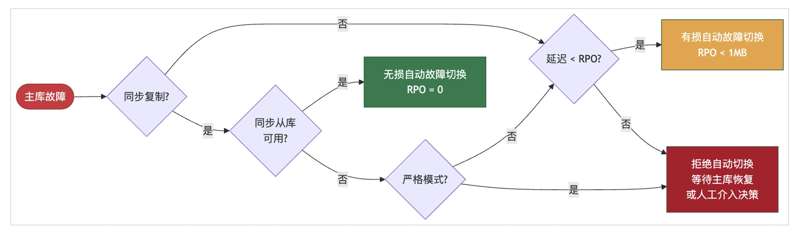

### How It Works

Patroni provides a parameter `maximum_lag_on_failover` that caps potential data loss, defaulting to 1048576 (1MB). This means automatic failover tolerates up to 1MB of data loss. When the primary goes down, if any replica's replication lag is within this threshold, Patroni automatically promotes it.

If *all* replicas exceed this threshold, Patroni refuses automatic failover to prevent data loss. Manual intervention is then required: wait for the primary to recover (which may never happen), or accept data loss and force-promote a replica.

This is the first trade-off: configure this value based on business requirements, balancing **availability** vs. **consistency**. A larger value improves automatic failover success rate (reduces downtime) but increases the potential data loss ceiling.

For zero-data-loss scenarios, use Patroni's synchronous mode or strict synchronous mode to guarantee RPO = 0.

### Oracle Comparison

For those familiar with Oracle, Patroni's replication modes map to Oracle Data Guard's three protection modes: Maximum Performance, Maximum Availability, Maximum Protection.

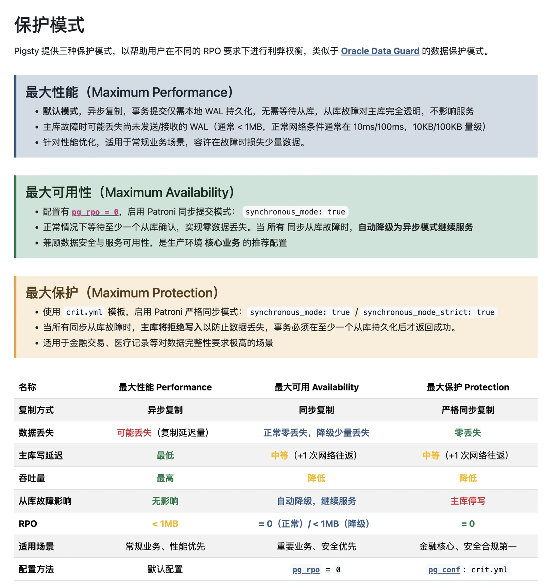

In fact, by configuring Patroni and PostgreSQL, you can achieve even stronger consistency than Oracle's Maximum Protection. For example, Oracle Data Guard's Maximum Protection only requires one synchronous standby to acknowledge writes, while Patroni can be configured to require *multiple* synchronous standbys acknowledging writes, or even acknowledging replay completion (`remote_apply`), for even stronger durability and consistency.

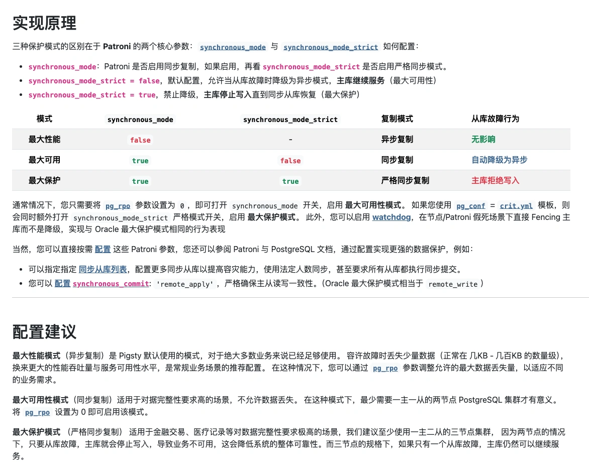

> JEPSEN has documented a very rare edge case — we'll cover that in a dedicated article.

For the vast majority of workloads, async replication (Maximum Performance) provides sufficient RPO guarantees. For strict data integrity requirements, use Maximum Availability / Maximum Protection mode to ensure RPO = 0.

--------

## RTO Trade-offs

[**RTO**](https://pigsty.cc/docs/concept/ha/rto/) defines the maximum time needed to restore write capability when the primary fails.

When the primary fails, the full recovery pipeline involves multiple phases: fault detection, DCS lock expiry, leader election, promote execution, and load balancer awareness of the new primary. So unlike RPO, RTO can never be zero.

Important: **RTO isn't a "lower is always better" metric.** Shorter RTO means tighter timeouts at each phase, which makes the cluster more sensitive to network jitter and increases false-failover risk. Set RTO too aggressively, and while individual failovers are faster, the increased false-positive rate drives up failover frequency, actually *reducing* overall availability.

This is the second trade-off: choose configuration based on actual network conditions, balancing **recovery time** vs. **false-failover probability**. Worse network → more conservative config. Better network → more aggressive config.

### RTO Marketing BS

Since RPO isn't really brag-worthy, RTO has become the prime territory for database marketing spin. Common tricks: cherry-picking best-case scenarios, queuing at the driver/connection-pool layer, and playing statistical games. When discussing RTO, you need to pin down:

**Failure domain**
: Compute node failure? Storage failure? Network failure?

**Measurement scope**
: Is "available" defined as database-writable, or LB/app/connection-pool/driver-level available?

**Statistics**
: Best case, worst case, average, or median?

**Network conditions**
: Same rack, same DC, same metro, or cross-continent?

In general, under same-rack network conditions for common failure paths, **RTO < 30s** is world-class. If someone claims RTO < 10s without specifying scenario, failure domain, or measurement scope, it's almost certainly BS.

Serious RTO analysis is complex. Below, I'll cover parameter configurations for four typical network conditions, RTO breakdowns for two major failure paths, and best/average/worst case scenarios. The measurement scope is HAProxy accepting write connections — the stricter end-to-end metric. Unless noted otherwise, we discuss the **worst-case** bound, not average or best.

### Architecture

RTO can't be discussed in isolation from architecture, scenario, environment, and resources. So let's start with the classic Patroni/Etcd/HAProxy HA architecture:

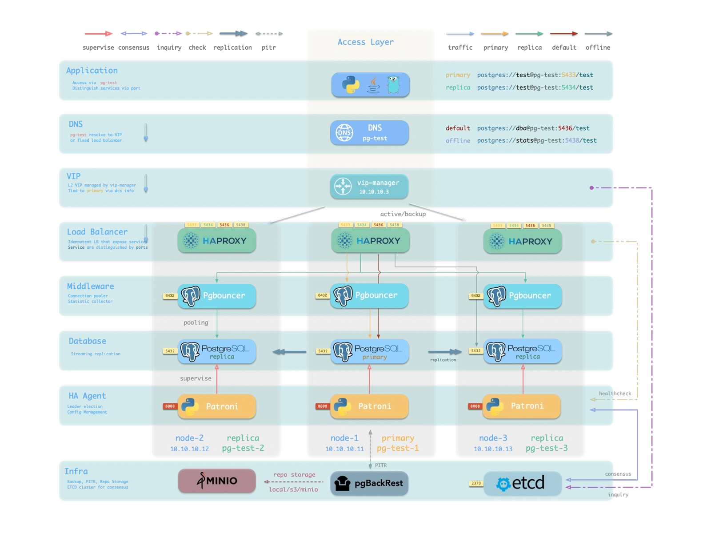

- PostgreSQL uses standard streaming replication with physical replicas. Replicas take over on primary failure.
- Patroni manages PostgreSQL server processes and handles all HA logic.
- Etcd provides distributed configuration store (DCS) and post-failure leader election.
- Patroni relies on Etcd for cluster leader consensus and exposes health check endpoints.
- HAProxy exposes cluster services externally and routes traffic to healthy nodes via Patroni health checks.

In this architecture, HA RTO primarily depends on Patroni parameters, secondarily on HAProxy parameters.

### Parameter Configuration

Patroni has only 3 core RPO parameters, but RTO involves 10 total: 5 Patroni + 5 HAProxy health check. The combination of these 10 parameters determines RTO behavior.

Note: default parameters are *not* optimal. Through years of production experience, I've developed four parameter profiles for different network conditions: fast, normal, slow, safe.

The four modes map to four parameter sets:

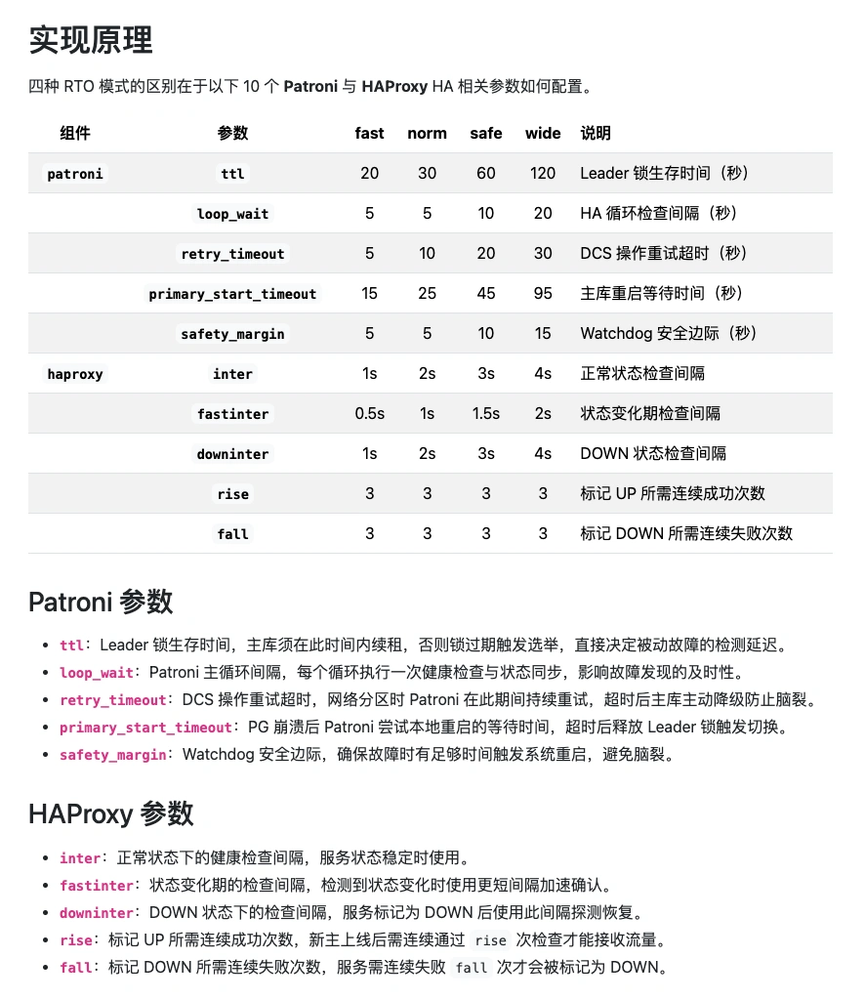

Worst-case, best-case, and average RTO performance across the four modes:

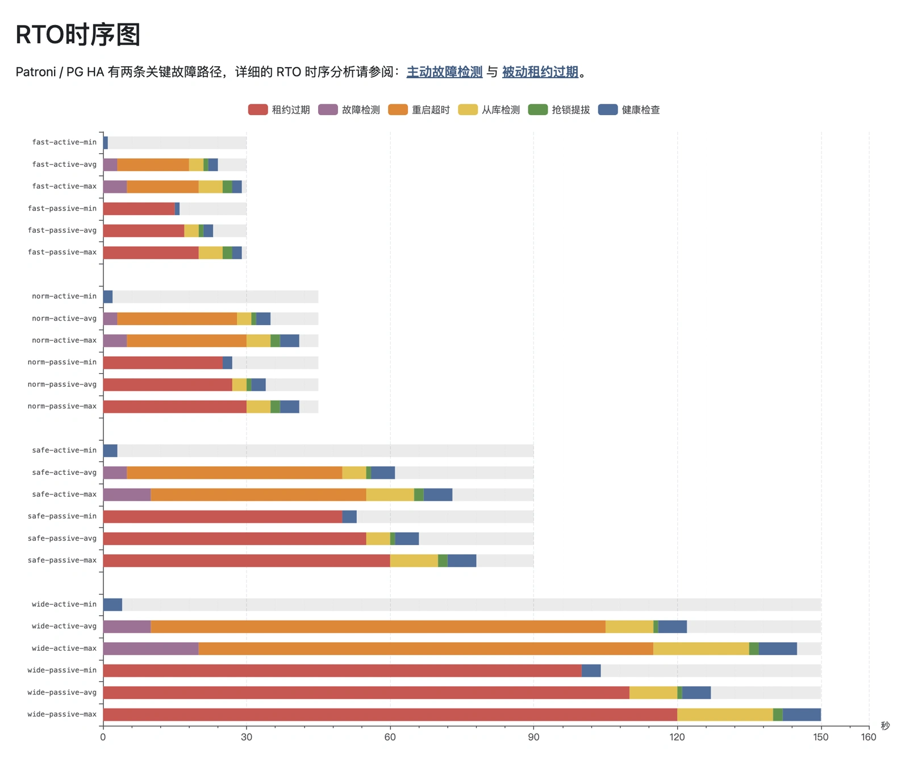

Using worst-case as our baseline: default config gives RTO < 45s, optimal ("fast") gives RTO < 30s. More conservative modes target 90s / 150s RTO ceilings.

Critical note: virtually every PG HA solution on the market ships with Patroni's default parameters unmodified. While defaults give RTO < 45s for standard passive failover, the default `primary_start_timeout` of 300 seconds means that in the "PG primary crashes and restarts" scenario, worst-case RTO balloons to 324 seconds — violating typical RTO targets.

If you're hand-rolling Patroni HA, watch out for this.

### Failure Paths

How are the numbers in that chart calculated? We need to discuss **failure paths**.

In the Patroni HA architecture, there are ~10 typical failures: node crash/livelock, PG crash/connection refusal/livelock, Patroni crash/livelock, primary/DCS network partition, storage failure, etc. These consolidate into five RTO decomposition paths, which for worst-case analysis reduce to two:

[**Passive detection**](https://pigsty.cc/docs/concept/ha/failure/passive)
: Patroni is down or network-isolated. Primary can't renew its lease. Triggers cluster election.

[**Active detection**](https://pigsty.cc/docs/concept/ha/failure/active)
: Patroni is alive, attempts to fix a downed PG, times out, then triggers cluster election.

Both paths converge, shown in this flowchart:

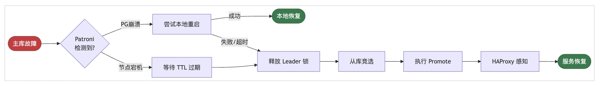

The RTO calculation differs between paths. Brief overview below; for the full analysis, see:
http://pigsty.cc/docs/concept/ha/failure/

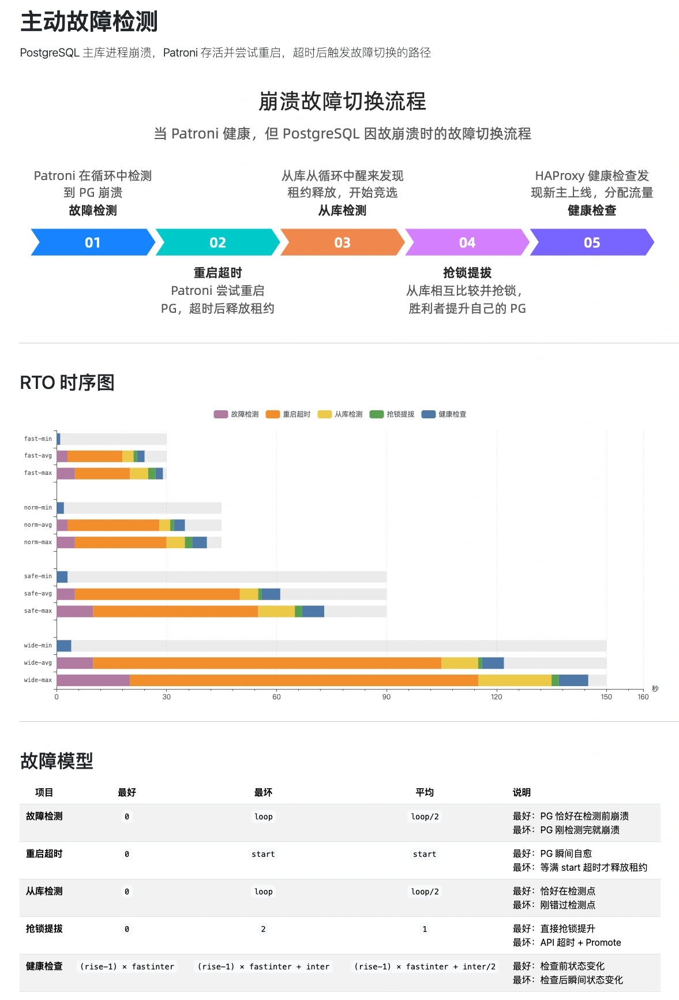

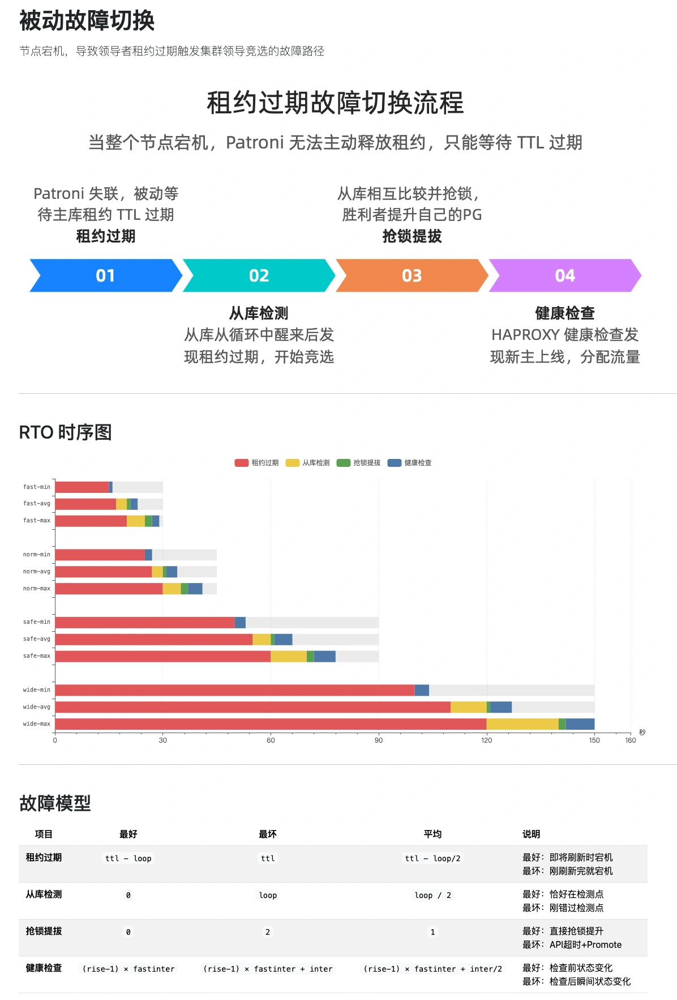

The RTO timing breakdown gives both lower and upper bounds. We set targets based on the pessimistic upper bound to meet the strictest disaster recovery requirements.

For **average** case: the "fast" profile lands at 23-24s, default "normal" at 34-35s.

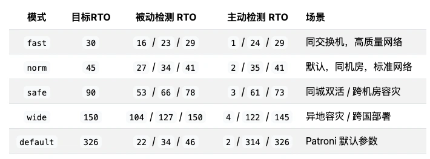

### On RAC and Distributed Databases

Some databases promise very low RTO, even claiming sub-second failover or RTO = 0. These typically use shared-storage RAC architectures or distributed Raft/Paxos protocols. Look closely and you'll find these claims only hold for **specific failure domains**, with trade-offs that introduce other limitations.

Take Oracle RAC: multiple compute nodes accessing the same disk array. Instance failover is indeed fast. But when the underlying storage hits a single point of failure, RTO is infinite — all nodes go down together. This just pushes complexity and risk down to the storage layer, forcing you to buy expensive enterprise SAN storage as a backstop. And for cross-region DR? You still need Data Guard-style replication. Then RTO is back to tens of seconds. Oracle RAC marketing is, in my view, highly misleading.

Some NewSQL distributed databases are slightly more honest. CockroachDB uses Raft for multi-node clusters, claiming RPO = 0 and RTO < 9s for common failure scenarios. Those numbers are plausible. But the cost? Multi-fold write latency increase, a fraction of the throughput, and higher architectural/operational complexity. I've discussed this at length in "Is Distributed Database a Fake Need?" (and "DERTA Chapter 6: Replication"). Everything is a trade-off — if you don't care about costs, AWS's open-source pgactive extension claims sub-second RTO.

By contrast, shared-nothing architecture is much cleaner: explicitly manage multiple storage replicas, each node is autonomous, no storage SPOF. Shared-storage can't easily scale horizontally, while shared-nothing scales to dozens of replicas — OpenAI runs 1 primary + 40 replicas; we ran 1+32 PG clusters at Tantan. This is why shared-nothing has become the mainstream choice for database HA over the past two decades.

My take: anyone pushing shared-storage HA solutions in 2026 is likely selling hardware or cloud disks. I'll skip the detailed critique here, but may write a dedicated piece on the real performance and costs of RAC and distributed databases, and why Corosync + Pacemaker — that absurdly complex relic — belongs in a museum.

--------

## On Practice

Theory covered. Let's talk about getting it done. I know many readers are thinking: sure, makes sense, but setting up Etcd, Patroni, and HAProxy box by box? No way.

Relax. I wouldn't do that either.

I've packaged this entire PG HA solution into an open-source, one-click deployment: [**Pigsty**](https://pigsty.cc).

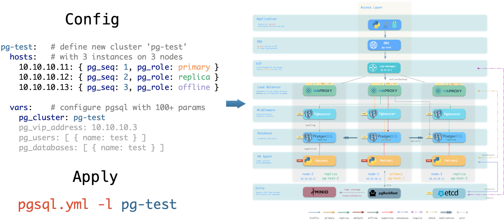

You can also use alternatives — AutoBase, Percona, various K8s PG Operators are broadly similar. The core HA architecture is the same: Patroni + etcd + HAProxy.

However, most solutions using Patroni ship with completely default parameters. Nobody seems to have seriously optimized them or done fine-grained RTO timing analysis — maybe that's reserved for "enterprise" offerings. Pigsty, battle-tested in large-scale production, offers multiple RTO/RPO strategy profiles tuned for different network conditions. Plus built-in connection pooling, automatic failover, and comprehensive monitoring/alerting — ready out of the box.

One more thing: HA alone isn't enough. Patroni handles hardware failures, but for accidental data deletion or logical errors, you need PITR as a backstop. So today covered Patroni as the de facto standard for PostgreSQL HA; next up will be pgBackRest as the de facto standard for backup/restore.

Friends, stop hand-rolling PG HA! DIY setups don't really help your technical growth or your business. Understand the principles, know how to use it — that's enough. Instead of reinventing the wheel, spend your time learning PG itself. There are so many extensions to explore — way more interesting than fiddling with HA and PITR.

--------

## Summary

Through careful parameter tuning, Patroni's RTO upper bound can be precisely controlled at different tiers. Under normal network conditions, 30-second RTO is within easy reach. Across dozens of real production failovers over the years, my monitoring data shows RTO consistently in the 20-30 second range — meeting the strictest financial-grade DR requirements.

Seven years ago when I made this choice, Patroni was still niche. Many dismissed it as not "enterprise-grade enough," not as reassuring as commercial solutions. Now look: teams that put their faith in complex architectures and expensive software are either still struggling with HA or have quietly switched to Patroni.

Technical decisions were never about what's more complex or more expensive. They're about what actually solves the problem. Patroni achieves the most reliable results with the simplest architecture. That's why it became the de facto standard.
