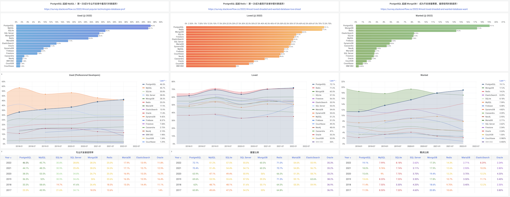
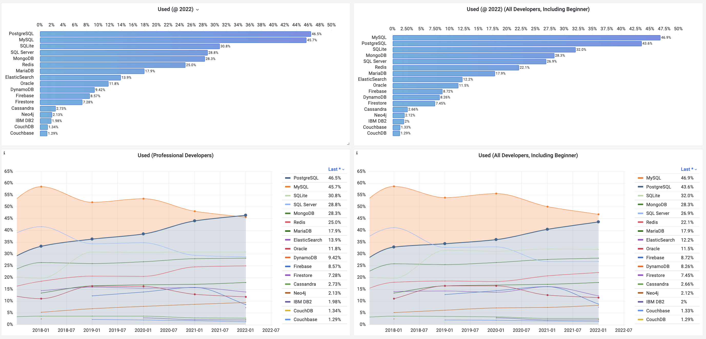
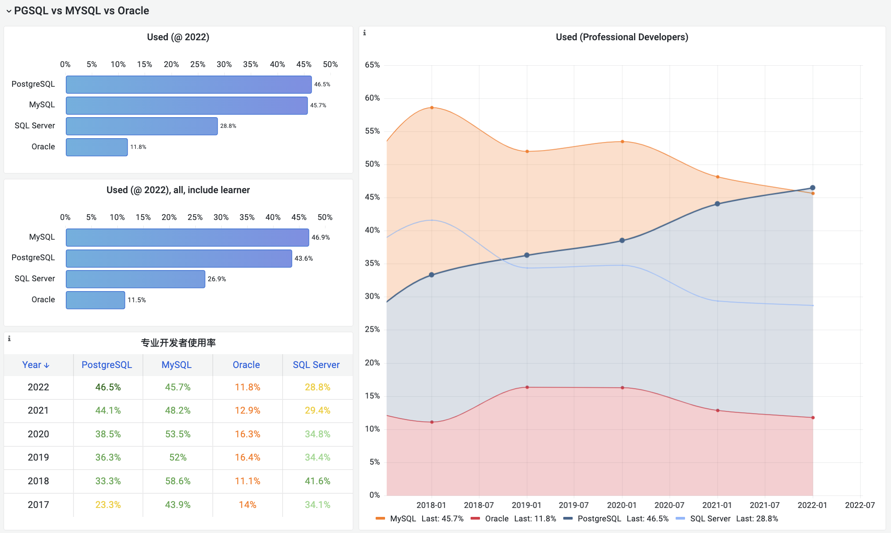
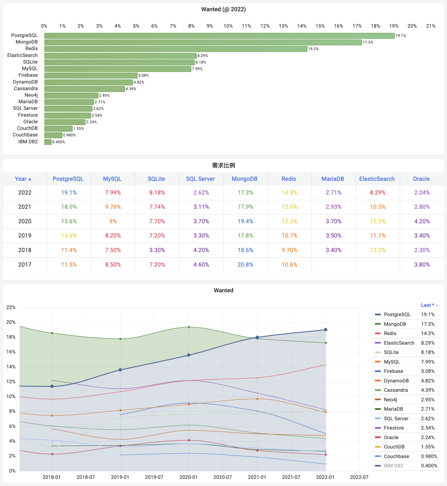
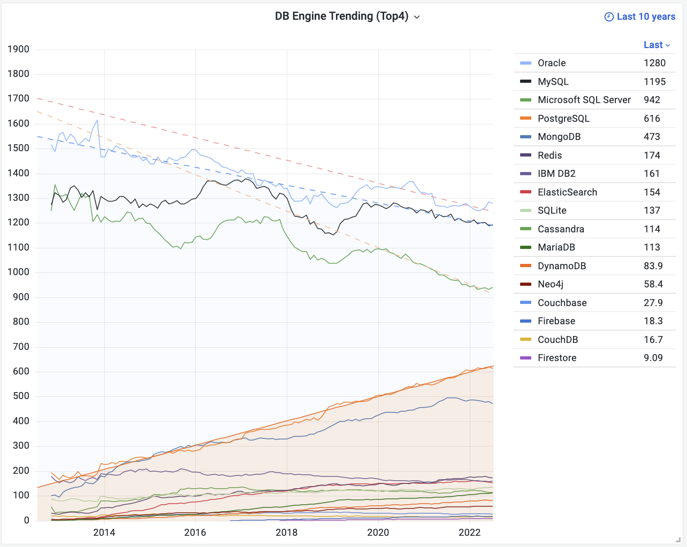
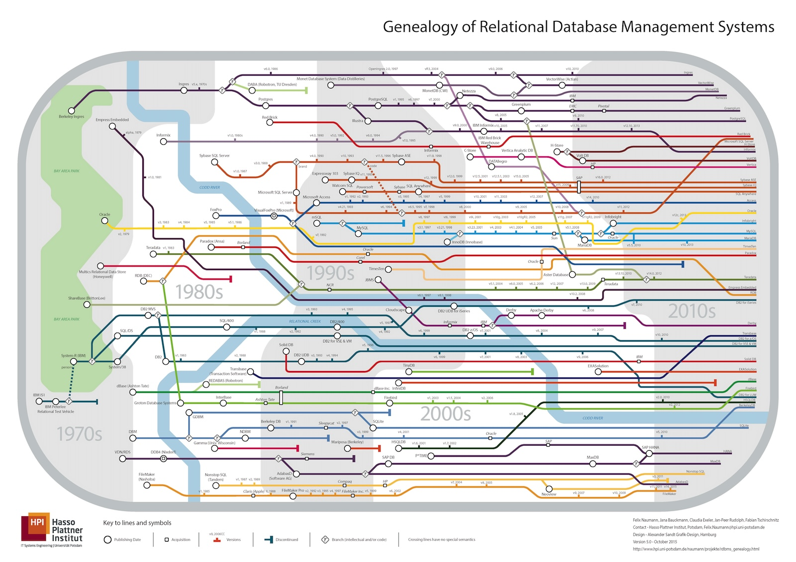
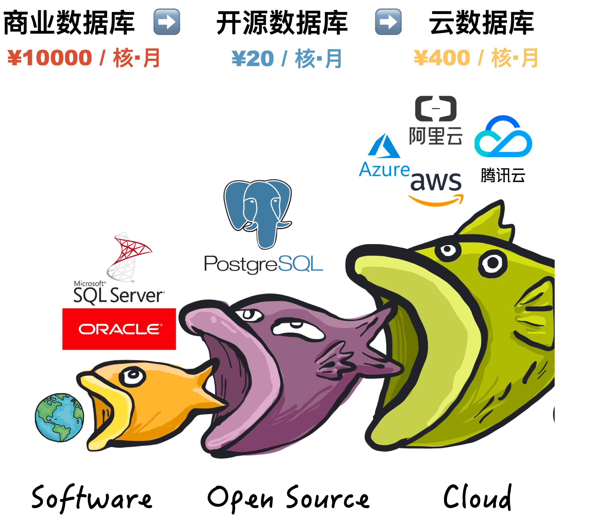
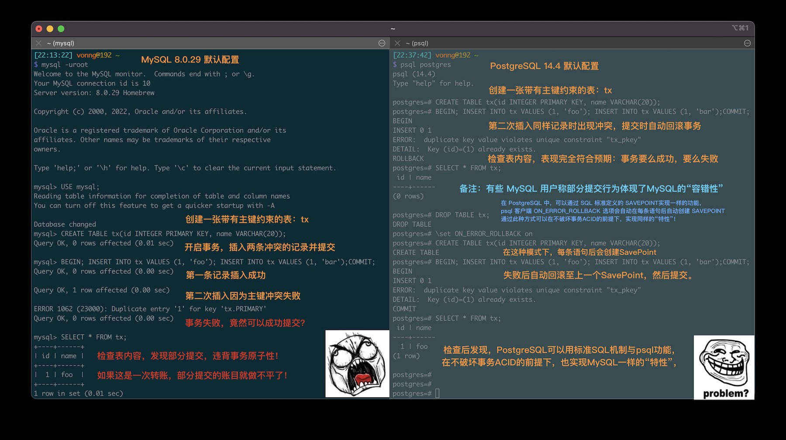
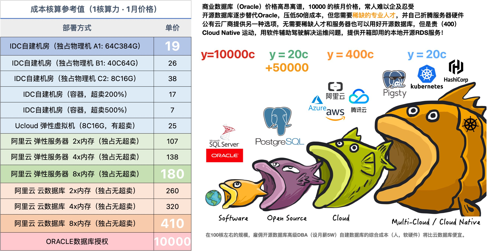
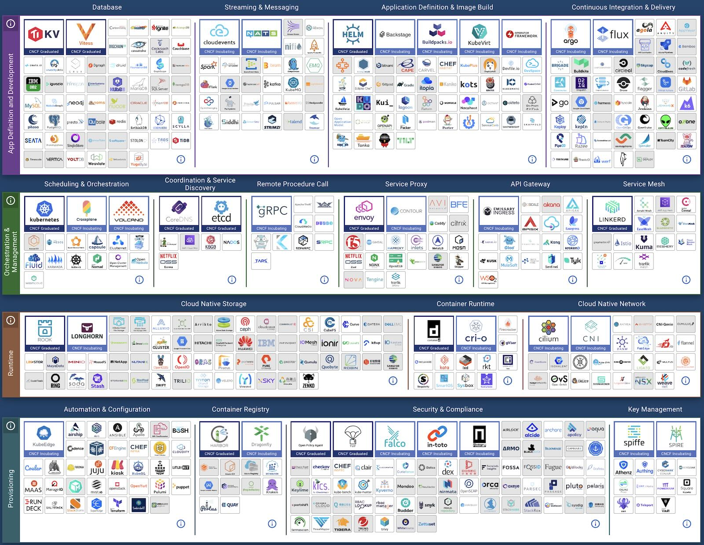

When we say a database is "successful," what exactly do we mean? Is it about features, performance, usability, or cost, ecosystem, complexity? There are many metrics, but ultimately users decide.

Database users are developers, so what about developers' preferences, likes, and choices? StackOverflow has asked over 70,000 developers from 180 countries these three questions for six consecutive years.

Looking at these six years of survey results, it's clear that in 2022, PostgreSQL has won all three categories, becoming literally the "most successful database":

* PostgreSQL became the **most used** database among professional developers! (Used)
* PostgreSQL became the **most loved** database among developers! (Loved)
* PostgreSQL became the **most wanted** database among developers! (Wanted)

Popularity reflects current momentum, demand indicates future dynamics, and love represents long-term potential. Time and momentum are on PostgreSQL's side. Let's look at more specific data and results.

---------------

## Most Popular

> PostgreSQL — The most popular database among professional developers! (Used)

The first survey is about what databases developers are currently using, i.e., **popularity**.

In recent years, MySQL has dominated the database popularity charts, fitting its slogan "The world's most popular open source relational database." But this time, the "most popular" crown may have to go to PostgreSQL.

Among **professional developers**, PostgreSQL surpassed MySQL for the first time with 46.5% usage, while MySQL dropped to second place with 45.7%.
As the most versatile **open source** relational databases, PGSQL and MySQL in first and second place have pulled far ahead of other databases.

> TOP 9 Database Popularity Evolution (2017-2022)

The popularity difference between PGSQL and MySQL isn't large. Notably, among **learning developers**, MySQL still holds a significant usage advantage (58.4%). Including learning developers, MySQL even maintains a slight 3.3% overall lead.

But from the chart below, PostgreSQL shows significant growth momentum, while other databases, particularly MySQL, SQL Server, and Oracle, have seen declining usage in recent years. Over time, PostgreSQL's lead will further expand.

> Popularity Comparison of Four Major Relational Databases

**Popularity** reflects current database scale momentum, while **love** reflects future database growth potential.

---------------

## Most Loved

> PostgreSQL — The **most loved** database among developers! (Loved)

The second question is about which databases developers love or hate. In this survey, PostgreSQL and Redis lead the pack with 70%+ love rates, significantly ahead of other databases.

In recent years, Redis has been users' favorite database. In 2022, the situation changed - PostgreSQL surpassed Redis for the first time to become the most loved database among developers.
Redis is a simple and easy-to-use data structure cache server, often used with relational databases, and is widely loved by developers. But developers clearly love the much more powerful PostgreSQL a bit more.

In contrast, MySQL and Oracle performed poorly. People who like and dislike MySQL are roughly equal; while only 35% of users like Oracle, meaning nearly 2/3 of developers dislike Oracle.

> TOP 9 Database Love Evolution (2017-2022)

Logically, **user love leads to software popularity, user hatred leads to software obsolescence**.
We can reference the Net Promoter Score (NPS, also called reputation, promoters% - detractors%) construction method to design a Net Love Score (NLS): love% - hate%, and database popularity derivative should be positively correlated with NLS.

The data confirms this well: PGSQL has the highest NLS: 44%, corresponding to the highest popularity growth rate of 460 basis points per year.
MySQL's reputation just falls above the praise-criticism line (2.3%), with an average popularity growth of 36 basis points;
While Oracle's reputation is negative 29%, corresponding to an average 44 basis points negative growth per year.
Of course, Oracle is only the third worst on this list, the most unpopular is IBM DB2:
1/4 like it, 3/4 hate it, NLS = -48%, corresponding to 46 basis points average annual decline.

Of course, not all potential can be converted into real momentum.
User love doesn't necessarily translate into action, which is what the third survey seeks to answer.

---------------

## Most Wanted

> PostgreSQL — The database developers most want to use! (Wanted)

"In the past year, which database environments have you done extensive development work in? In the coming year, which database environments do you want to work in?"

Answers to the first half of this question lead to the "most popular" database survey results; the second half gives the answer to "most wanted."
If user love represents future growth potential, then user demand (want) represents real growth momentum for the next year.

In this year's survey, PostgreSQL unceremoniously pushed aside MongoDB to claim the throne of developers' most wanted database.
A high 19% of respondents indicated they want to use PostgreSQL environment for development next year.
Following closely are MongoDB (17%) and Redis (14%), these three databases' demand significantly pulls ahead of others by a tier.

Previously, MongoDB consistently topped the "most wanted" database list, but recently began showing signs of losing steam.
There are multiple reasons: for example, MongoDB itself faces competition from PostgreSQL.
PostgreSQL includes complete JSON features and can be used directly as a document database, with projects like FerretDB (formerly MangoDB) providing MongoDB API directly on PG.

MongoDB and Redis are both main forces of the NoSQL movement. But unlike MongoDB, Redis demand continues to grow. PostgreSQL and Redis, as leaders of SQL and NoSQL respectively, maintain strong demand and rapid growth with bright futures.

---------------

## Why?

PostgreSQL tops demand rate, usage rate, and love rate - with time, place, and people aligned, momentum, potential, and dynamics all present, truly deserving the title of most successful database.

But we want to know: why is PostgreSQL so successful?

Actually, the secret is hidden in its slogan: "The world's **most advanced** **open source** **relational database**."

---------------

## Relational Database

Relational databases are so ubiquitous and important that all other database categories combined - key-value, document, search engine, time-series, graph, vector - might not match even a fraction of their presence. When people talk about databases, unless specifically noted, they implicitly mean "relational databases." No other database category dares call itself "mainstream" in its presence.

Take [DB-Engines](https://db-engines.com/en/ranking_trend) for example. DB-Engines ranking criteria include search engine results when searching system names, Google trends, Stack Overflow discussions, Indeed job mentions, profile counts in professional networks like LinkedIn, mentions in social networks like Twitter, etc., understood as database "comprehensive popularity."

> Database Popularity Trends: https://db-engines.com/en/ranking_trend

In DB-Engines' popularity trend chart, we can see a chasm - the top four are all **relational databases**, plus fifth-ranked MongoDB, pulling away from other databases by **orders of magnitude** in popularity.
We only need to focus on these four core **relational databases**: Oracle, MySQL, SQL Server, PostgreSQL.

Relational databases occupy highly overlapping ecological niches, their relationship can be viewed as zero-sum game. Setting aside Microsoft's relatively independent commercial database SQL Server, the relational database world stages a three-kingdom drama.

> Oracle has talent but no virtue, MySQL has shallow talent and thin virtue, only PostgreSQL has both talent and virtue.

Oracle is an established commercial database with deep historical technical accumulation, rich features, and comprehensive support. It firmly holds the top database position, widely loved by enterprises with deep pockets needing scapegoats. But Oracle is expensive and notorious as an industry cancer with its litigious behavior. Microsoft SQL Server is similar to Oracle, both commercial databases. **Commercial databases overall face open source database competition**, in slow decline.

MySQL ranks second in popularity but attracts trouble, caught between wolves and tigers: in rigorous transaction processing and data analysis, MySQL is streets behind fellow open source PostgreSQL; in rough-and-ready agile methodology, MySQL isn't as good as emerging NoSQL; simultaneously MySQL faces suppression from adoptive father Oracle, division from brother MariaDB, and share-stealing from protocol-compatible NewSQL like rebellious child TiDB, thus also declining.

As an established commercial database, Oracle's **talent** is unquestionable, but as an industry cancer, its "**virtue**" needs no elaboration, hence: "**talent without virtue**". MySQL has open source merit but recognizes thieves as fathers; with shallow learning and crude features, only capable of CRUD, hence "**shallow talent, thin virtue**". Only PostgreSQL has **both talent and virtue**, occupying **open source** rise timing, grasping **advanced** features advantage, with permissive BSD license harmony. As they say: Hidden talents emerge at the right time. Silent until shocking the world, winning the crown!

PostgreSQL's secret to virtuous victory is being **advanced** and **open source**!

---------------

## The Virtue of Open-Source

> **PG's "virtue" lies in open source**. A grandmaster-level open source project, the great achievement of global developer collaboration.
>
> Friendly BSD license, prosperous ecosystem with many extensions. Branching widely, descendants everywhere, Oracle replacement flag bearer

What is "virtue"? Conforming to the "way" is virtue. And this "way" is **open source**.

PostgreSQL is a historically venerable grandmaster-level open source project, exemplifying global developer collaboration.

> Prosperous ecosystem, rich extensions, branching widely, descendants everywhere

Long ago, developing software/information services required very expensive commercial database software like Oracle and SQL Server: software licensing alone could cost six or seven figures, plus similar hardware and service subscription costs. Oracle charges over 100,000 yuan per CPU core annually - even wealthy Alibaba couldn't afford it and had to de-IOE. The rise of open source databases represented by PostgreSQL/MySQL gave users a new choice: free software. "Free" open source databases allow us to use database software freely, profoundly impacting industry development: from nearly 10,000¥/core·month commercial databases to 20¥/core·month pure hardware costs. Databases entered ordinary enterprises, making free information services possible.

Open source has great **virtue**. Internet history is open source software history. A core reason IT industry has today's prosperity and people enjoy so many free information services is open source software. Open source is a truly successful **Communism** of developers aimed at software freedom: software, IT's core means of production, becomes publicly owned by global developers, distributed by need. Developers contribute according to ability, everyone for all, all for everyone.

When an open source programmer works, their labor may embody the crystallized wisdom of tens of thousands of top developers. Programmers earn high salaries because fundamentally, developers aren't simple workers but contractors directing software and hardware. Programmers themselves are core means of production; software comes from public communities; server hardware is readily available; thus one or several senior software engineers can easily leverage **open source ecosystem** to quickly solve domain problems.

Through open source, all community developers form synergy, greatly reducing wheel-reinventing waste. This advances the entire industry's technical level at an incredible pace. Open source momentum snowballs - today it's unstoppable. Basically except for special scenarios and path dependencies, closed-door self-reliance in software development has become a joke.

The more foundational the software, the greater open source's advantage. Open source is PostgreSQL's greatest confidence against Oracle.

Oracle is advanced, but PostgreSQL isn't far behind. PostgreSQL has the best Oracle compatibility among open source databases, natively supporting 85% of Oracle's features, with professional distributions achieving 96% compatibility. But more importantly, Oracle is expensive while PG is open source and free. Overwhelming cost advantage gives PG huge ecological niche foundation: it doesn't need to surpass Oracle in feature advancement to succeed - cheap 90% correctness is enough to crush Oracle.

PostgreSQL can be viewed as an open source "Oracle," the only database truly threatening Oracle. As the "de-O" flag bearer, PG has many descendants - 36% of "domestic databases" are directly "developed" based on PG, supporting many **autonomous and controllable** database companies, truly meritorious. More importantly, PostgreSQL community doesn't oppose such behavior - BSD license allows it. This open-mindedness is incomparable to Oracle-owned, GPL-licensed MySQL.

---------------

## The Talent of Being Advanced

> **PG's "talent" lies in being advanced**. A jack-of-all-trades full-stack database, one against ten, naturally HTAP.
>
> Spatiotemporal geographic distributed, time-series document super-convergent, single component covers almost all database needs.

**PG's "talent" lies in versatility**. PostgreSQL is a versatile full-stack database, naturally HTAP, super-convergent database, one against ten. A single component sufficiently covers most database needs for small and medium enterprises: OLTP, OLAP, time-series database, spatial GIS, full-text search, JSON/XML, graph database, cache, etc.

PostgreSQL is the most cost-effective choice among relational databases: it not only handles traditional CRUD OLTP business, but **data analysis** is its forte. Various special features provide entry into multiple industries: PostGIS-based geospatial data processing and analysis, Timescale-based time-series financial IoT data processing and analysis, stored procedure trigger-based stream processing, inverted index full-text search engines, FDW connecting and unifying various external data sources. PG is truly a versatile full-stack database, capable of much richer functionality than pure OLTP databases.

At considerable scale, PostgreSQL can independently play multiple roles, one component serving as many. **Single database component selection can greatly reduce project complexity, meaning significant cost savings. It turns what requires ten people into what one person can handle.** Not that PG should beat ten others and overturn all other databases' rice bowls: professional components' strength in professional fields is unquestionable. But remember, **designing for unnecessary scale is wasted effort**, a form of **premature optimization**. If one technology can meet all your needs, using it is the best choice, not trying to reimplement with multiple components.

Take Tantan for example - at 2.5M TPS and 200TB data scale, **single PostgreSQL selection** still stably and reliably supports the business. At considerable scale it achieves versatility - besides its main OLTP job, PG also served as cache, OLAP, batch processing, even message queue for quite some time. Of course, even immortal turtles have their end. Eventually these part-time functions must be **split off** to specialized components, but that's only at nearly ten million DAU.

### vs MySQL

PostgreSQL's advancement is obvious to all, which is its real core competitiveness against fellow open source relational database rival MySQL.

MySQL's slogan is "**The world's most popular open source relational database**," its core characteristic is **rough, fierce, fast**, with internet companies as its user base. What characterizes internet companies? Chasing trends **rough, fierce, fast**. **Rough** means internet companies have simple business scenarios (mostly CRUD); data isn't highly important, unlike traditional industries (like banks) that care about data consistency and correctness; availability first, more tolerant of data loss/corruption than service outage, while some traditional industries would rather stop service than have accounting errors. **Fierce** means internet industry has large data volumes, needing cement tanker trucks for massive CRUD, not high-speed rail and crewed spacecraft. **Fast** means internet industry requirements change constantly, short delivery cycles, demanding quick response times, massively needing out-of-box software suites (like LAMP) and CRUD Boys who can work after simple training. Thus, rough-fierce-fast internet companies and rough-fierce-fast MySQL hit it off.

But times change, PostgreSQL advances rapidly. In "fast" and "fierce" MySQL no longer has advantage, now only "rough" remains. For example, MySQL's philosophy can be called: "Better to live poorly than die well" and "After me, the deluge." Its "roughness" manifests in various "fault tolerance," like allowing incorrect SQL written by dummy programmers to run. The most outrageous example is MySQL actually allows **partially successful** transaction commits, violating basic relational database constraints: **atomicity and data consistency**.

> Figure: MySQL defaults to allowing partially successful transaction commits

Advanced causes reflect as popular effects, popular things become outdated due to backwardness, while advanced things become popular due to advancement. Era-given dividends also recede with the era. In this transformative age, without advanced features as foundation, "popularity" is hard to sustain. In advancement, PostgreSQL's rich features have left MySQL streets behind, and MySQL's proud "popularity" is being overtaken by PostgreSQL.

The trend is set, the outcome decided. As they say: When fortune comes, heaven and earth assist; when luck goes, heroes cannot help themselves. Advanced and open source are PostgreSQL's two greatest weapons. Oracle is advanced, MySQL is open source, PostgreSQL is both advanced and open source. With time, place, and people aligned, how can great achievements not be accomplished?

---------------

## Looking Forward

> Software eats the world, open source eats software, and cloud eats open source.

It seems the database war has settled - for some time, probably no other database kernel can threaten PostgreSQL.
But the real threat to PostgreSQL open source community is no longer other database kernels, but the paradigm shift in software usage: cloud has appeared.

Initially, developing software/information services required expensive **commercial software** (Oracle, SQL Server, Unix). With the rise of **open source** software like Linux/PostgreSQL, users had new choices. Open source software is indeed free, but using it well has high barriers - users must hire open source software experts to help them use it properly.

> When databases scale up, hiring open source DBAs for self-building is always cost-effective, but good DBAs are too scarce.

This is open source's core model: open source software developers contribute to open source software; open source software attracts many users by being useful and free; users generate demand when using open source software, creating more open source software-related jobs, creating more open source software developers.
These three steps form a positive feedback loop: more open source contributors make open source software better and cheaper, attracting more users and creating more open source contributors. Open source ecosystem prosperity depends on this loop, and public cloud vendors' emergence breaks this cycle.

Public cloud vendors wrap open source databases with shells, add their hardware and control software, hire shared DBAs for support, becoming **cloud databases**. While this is valuable service, cloud vendors selling open source software on their platforms with little contribution back essentially freeloads on open source.
This shared outsourcing model concentrates open source software jobs at cloud vendors, ultimately forming oligopolies that harm all users' software freedom.

> The world has been changed by cloud, closed source software is no longer the most important issue.

"**In 2020, the enemy of computing freedom is cloud software**."

This is the [manifesto](https://pg.vonng.com/#/post/goodbye-gpl) proposed by DDIA author Martin Kleppmann in his "local-first software" movement. Cloud software refers to software running on vendor servers, like: Google Docs, Trello, Slack, Figma, Notion. And the most core cloud software, **cloud databases**.

In the post-cloud era, how should open source communities respond to cloud software challenges? The Cloud Native movement provides the answer. This is a great movement to reclaim software freedom from public cloud, with databases at its core focus.

> Cloud Native landscape, still missing the final puzzle piece: stateful databases!

This is what we want to solve with **out-of-box open source PostgreSQL database distribution** — [Pigsty](https://pigsty.cc): creating a locally usable RDS service, becoming the open source alternative to cloud databases!

Pigsty comes with out-of-box RDS/PaaS/SaaS integration; an incomparable PG monitoring system and autopilot high-availability cluster architecture; one-click installation deployment, providing Database as Code easy experience; while matching or exceeding cloud database experience, data is autonomously controllable with 50%-90% cost reduction. We hope it can greatly lower PostgreSQL usage barriers, letting more users use **good databases** and **use databases well**.

Of course, due to space limitations, cloud databases and the post-cloud era database future is a story for the next article.