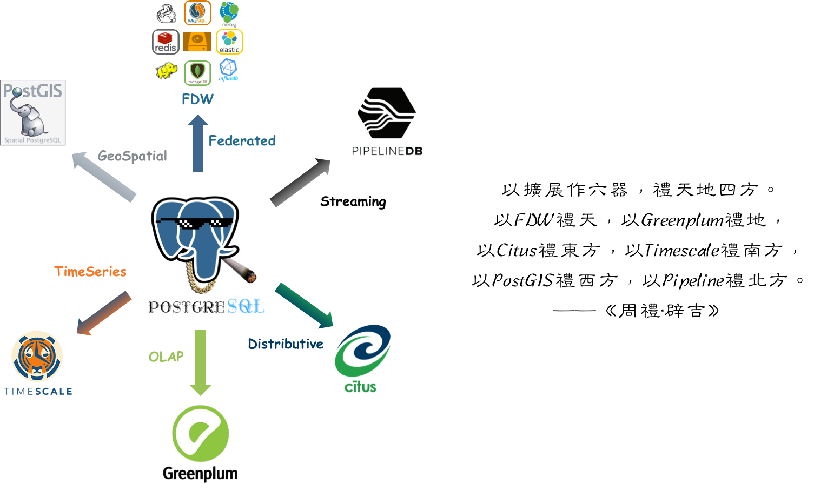

当我们说一个数据库"成功"时，到底在说什么？是指功能性能易用性，还是成本生态复杂度？评价指标有很多，但这件事最终还得由用户来定夺。

数据库的用户是开发者，而开发者的意愿、喜好、选择又如何？StackOverflow 连续六年，向来自180个国家的七万多开发者问了这三个问题。

总览这六年的调研结果，不难看出在2022年，PostgreSQL 已经同时在这三项上登顶夺冠，成了字面意义上 “最成功的数据库”：

* PostgreSQL 成为 专业开发者**最常使用**的数据库！（Used）
* PostgreSQL 成为 开发者**最为喜爱**的数据库！（Loved）
* PostgreSQL 成为开发者**最想要用**的数据库！（Wanted）

流行度反映当年势能，需求度预示来年动能，喜爱度代表长期潜能。时与势都站在 PostgreSQL 一侧，让我们来看一看更具体的数据与结果。

---------------

## 最流行

> PostgreSQL —— 专业开发者中最流行的数据库！（Used）

第一项调研，是关于开发者目前使用着什么样的数据库，即，**流行度**。

过去几年，MySQL一直霸占着数据库流行榜的榜首，很符合其 ”世界上最流行的开源关系型数据库“ 这一口号。不过这一次，”最流行“的桂冠恐怕要让给 PostgreSQL 了。

在**专业开发者**中，PostgreSQL 以 46.5% 的使用率第一次超过 MySQL 位居第一，而 MySQL 以 45.7% 的使用率降至第二名。
同为泛用性最好的**开源**关系型数据库，排名第一第二的 PGSQL 与 MySQL ，与其他的数据库远远拉开了距离。

> TOP 9 数据库流行度演变（2017-2022）

PGSQL 与 MySQL 的流行度差别并不大。值得一提的是，在**见习开发者**群体中，MySQL 仍然占据显著使用率优势（58.4%），如果算上**见习开发者**，MySQL 甚至仍然保有 3.3% 的微弱整体领先优势。

但从下图中不难看出，PostgreSQL 有显著的增长动能，而其他数据库，特别是  MySQL、 SQL Server、Oracle 的使用率则在最近几年持续衰退。随着时间的推移，PostgreSQL 的领先优势将进一步拉大。

> 四大关系型数据库流行度对比

**流行度**反映的是当下数据库的规模势能，而**喜爱度**反映的是未来数据库的增长潜能。

---------------

## 最喜爱

> PostgreSQL —— 开发者**最为喜爱**的数据库！（Loved）

第二个问题是关于开发者喜爱什么数据库，讨厌什么数据库。在此项调研中，PostgreSQL与Redis一骑绝尘，以70%+ 的喜爱率高居榜首，显著甩开其他数据库。

在过去几年，Redis一直是用户最喜欢的数据库。在 2022 年，形势发生了变化，PostgreSQL 第一次超过 Redis，成为最受开发者喜爱的数据库。
Redis是简单易用的数据结构缓存服务器，经常会与关系型数据库搭配使用，广受开发者喜爱。不过开发者明显更爱功能强大得多的 PostgreSQL 多一丢丢。

相比之下 MySQL 与 Oracle 的表现就比较拉胯了。喜欢和讨厌 MySQL 的人基本各占一半；而只有35%的用户喜欢 Oracle ，这也意味着近 2/3 的开发者反感 Oracle 。

> TOP 9 数据库喜爱度演变（2017-2022）

从逻辑上讲，**用户的喜爱将导致软件的流行，用户的厌恶将导致软件过气**。
我们可以参照 净推荐指数（NPS，又称口碑，推荐者%-贬损者%）的构造方式，
设计一个净喜爱指数 NLS：即 喜爱人群% - 厌恶人群%，
而数据库流行度的导数应当与 NLS 呈现正相关性 。

数据很好的印证了这一点： PGSQL 有着全场最高的 NLS： 44% ，对应着最高的流行度增长率 每年 460个基点。
MySQL 的口碑刚好落在褒贬线上方 （2.3%），流行度平均增速为36个基点；
而 Oracle 的口碑则为负的 29%，对应平均每年44个基点的使用率负增长。
当然在这份榜单上， Oracle 只是倒数第三惨的，最不受人待见的是 IBM DB2 ：
1/4的人喜欢，3/4的人讨厌，NLS = -48% ，对应46个基点的年平均衰退。 

当然，并不是所有潜能，都可以转换为实打实的动能。
用户的喜爱并不一定会付诸行动，而这就是第三项调研所要回答的问题。

---------------

## 最想要

> PostgreSQL —— 开发者 最想使用的数据库！（Wanted）

“在过去的一年中，你在哪些数据库环境中进行了大量开发工作？在未来一年，你想在哪些数据库环境中工作？ ”

对于这个问题前半段的回答，引出了”最流行“数据库的调研结果；而后半段，则给出了”最想要“这个问题的答案。
如果说用户的喜爱代表的是未来增长的潜能，那么用户的需求（想要，Want）就代表了下一年实打实的增长动能。

在今年的调研中， PostgreSQL 毫不客气的挤开 MongoDB ，占据了开发者最想使用数据库的宝座。
高达 19% 的受访者表示，下一年中想要使用 PostgreSQL 环境进行开发。
紧随其后的是 MongoDB (17%) 与 Redis (14%)，这三种数据库的需求程度与其他数据库显著拉开了一个台阶。

此前， MongoDB 一直占据”最想要“数据库榜首，但最近开始出现过气乏力的态势。
原因是多方面的：例如，MongoDB 本身也受到了 PostgreSQL 的冲击。
PostgreSQL 本身就包含了完整的 JSON 特性，可直接用作文档数据库，更有类似 FerretDB （原名 MangoDB）的项目可以直接在 PG 上对外提供 MongoDB 的 API。

MongoDB 与 Redis 都是 NoSQL 运动的主力军。但与 MongoDB 不同，Redis的需求在不断增长。PostgreSQL 与 Redis，分别作为 SQL 与 NoSQL 的领军者，保持着旺盛的需求与高速的增长，前途无量。

---------------

## 为什么？

PostgreSQL 在需求率， 使用率，喜爱率上都拔得头筹，天时地利人和齐备，动能势能潜能都有，足以称得起是最成功的数据库了。

但我们想知道的是，为什么 PostgreSQL 会如此成功 ？

其实，秘密就藏在它的 Slogan 里： ”世界上**最先进**的**开源** **关系型数据库**“。

---------------

## 关系型数据库

关系型数据库是如此的普及与重要，也许其他的数据库品类如键值，文档，搜索引擎，时序，图，向量加起来也比不上它的一个零头。以至于当大家谈起数据库时，如果没有特殊说明，默认隐指的就是”关系型数据库“。在它面前，没有其他数据库品类敢称自己为”主流“。

以 [DB-Engine](https://db-engines.com/en/ranking_trend ) 为例，DB-Engine的排名标准包括搜索系统名称时的搜索引擎结果数，Google趋势，Stack Overflow讨论，Indeed 提及系统的工作机会，LinkedIn等专业网络中的个人资料数，Twitter等社交网络中的提及数等，可理解为数据库的“综合热度”。

> 数据库热度趋势：https://db-engines.com/en/ranking_trend

在 DB-Engine 的热度趋势图中我们可以看到一条鸿沟，前四名全都是 **关系型数据库** ，加上排名第五的 MongoDB，与其他数据库在热度上拉开了 **数量级上的差距**。
我们只需要把关注点聚焦到这四种核心的**关系型数据库** Oracle，MySQL，SQL Server，PostgreSQL 上即可。

关系型数据库的生态位高度重叠，其关系可以视作零和博弈。抛开微软生态关门自嗨相对独立的商业数据库 SQL Server不提。在关系型数据库世界里，上演的是一场三国演义。

> Oracle有才无德，MySQL才浅德薄，唯有PostgreSQL德才兼备。

Oracle是老牌商业数据库，有着深厚的历史技术积淀，功能丰富，支持完善。稳坐数据库头把交椅，广受不差钱且需要背锅侠的企业喜爱。但Oracle费用昂贵，且以讼棍行径成为知名的业界毒瘤。Microsoft SQL Server性质与Oracle类似，都属于商业数据库。**商业数据库整体受开源数据库冲击**，处于缓慢衰退的状态。

MySQL流行度位居第二，但树大招风，处于前狼后虎，上有野爹下有逆子的不利境地：在严谨的事务处理和数据分析上，MySQL被同为开源生态位的PostgreSQL甩开几条街；而在糙猛快的敏捷方法论上，MySQL又不如新兴NoSQL好用；同时 MySQL 上有养父 Oracle 压制，中有兄弟 MariaDB 分家，下有诸如逆子 TiDB 等协议兼容NewSQL分羹，因此也在走下坡路。

作为老牌商业数据库，Oracle的**才**毋庸质疑，但其作为业界毒瘤，“**德**” ，亦不必多说，故曰：“**有才无德**”。MySQL 虽有开源之功德，奈何认贼作父；且才疏学浅，功能简陋，只能干干CRUD，故曰“**才浅德薄**”。唯有PostgreSQL，**德才兼备**，既占据了**开源**崛起之天时，又把握住功能**先进**之地利，还有着宽松BSD协议之人和。正所谓：藏器于身，因时而动。不鸣则已，一鸣惊人，一举夺冠！

而 PostgreSQL 德以致胜的秘密，就是 **先进** 与 **开源**！

---------------

## 开源之德

> **PG的“德”在于开源**。祖师爷级的开源项目，全世界开发者群策群力的伟大成果。
>
> 协议友善BSD，生态繁荣扩展多。开枝散叶，子孙满堂，Oracle替代扛旗者

什么叫“德”，合乎于“道”的表现就是德。而这条“道”就是**开源**。

PostgreSQL是历史悠久的祖师爷级开源项目，更是全世界开发者群策群力的典范成果。

> 生态繁荣，扩展丰富，开枝散叶，子孙满堂

很久很久以前，开发软件/信息服务需要使用非常昂贵的商业数据库软件：例如Oracle与SQL Server：单花在软件授权上的费用可能就有六七位数，加之相近的硬件成本与服务订阅成本。Oracle一个 CPU 核一年的软件授权费用便高达十几万，即使壕如阿里也吃不消要去IOE。以 PostgreSQL / MySQL 为代表的的开源数据库崛起，让用户有了一个新选择：软件不要钱。“不要钱” 的开源数据库可以让我们自由随意地使用数据库软件，而这一点深刻影响了行业的发展：从接近一万￥/ 核·月的商业数据库，到20块钱/核·月的纯硬件成本。数据库走入寻常企业中，让免费提供信息服务成为可能。

开源是有大功**德**的。互联网的历史就是开源软件的历史，IT行业之所以有今天的繁荣，人们能享受到如此多的免费信息服务，核心原因之一就是开源软件。开源是一种真正成功的，以软件自由为目的，由开发者构成的 Communism（**社区主义**）：软件这种IT业的核心生产资料变为全世界开发者公有，按需分配。开发者各尽所能，人人为我，我为人人。

一个开源程序员工作时，其劳动背后可能蕴含的是数以万计顶尖开发者的智慧结晶。程序员薪资高从原理上来说是因为，开发者本质上不是一个简单的工人，而是一个指挥软件和硬件干活的包工头。程序员自己就是核心生产资料；软件来自公有社区；服务器硬件更是唾手可得；因此一个或几个高级的软件工程师，就可以很轻松的利用**开源生态**快速解决领域问题。

通过开源，所有社区开发者形成合力，极大降低了重复造轮子的内耗。使得整个行业的技术水平以匪夷所思的速度向前迈进。开源的势头就像滚雪球，时至今日已经势不可挡。基本上除了一些特殊场景和路径依赖，软件开发中闭门造车搞自力更生几乎成了一个大笑话。

越是底层基础的软件，开源便越占优势。开源，也是 PostgreSQL 对阵 Oracle 的最大底气所在。

Oracle 先进，但 PostgreSQL 也不差。PostgreSQL 是 Oracle 兼容性最好的开源数据库，原生即支持 Oracle 85% 的功能，更有 96% 功能兼容的专业发行版。但更重要的是，Oracle价格高昂，而PG开源免费。压倒性的成本优势让PG拥有了巨大的生态位基础：它不一定要在功能先进性上超过 Oracle 才能成功 ，廉价9成正确已经足以干翻 Oracle 。

PostgreSQL 可以视作一个开源版的“Oracle”，是唯一能真正威胁到 Oracle 的数据库。作为 ”去O“ 抗旗者，PG 可谓子孙满堂， 36% 的 “国产数据库” 更是直接基于PG “开发”，养活了一大批 **自主可控** 的 数据库公司，可谓功德无量。更重要的是，PostgreSQL 社区并不反对这样的行为，BSD 协议允许这样做。这样开放的胸襟，是被Oracle收购的，使用GPL协议的MySQL所难以相比的。

---------------

## 先进之才

> **PG的“才”在于先进**。一专多长的全栈数据库，一个打十个，天生就是 HTAP。
>
> 时空地理分布式，时序文档超融合，单一组件即可覆盖几乎所有数据库需求。

**PG的“才”在于一专多长**。PostgreSQL是一专多长的全栈数据库，天生就是HTAP，超融合数据库，一个打十个。基本单一组件便足以覆盖中小型企业绝大多数的数据库需求：OLTP，OLAP，时序数据库，空间GIS，全文检索，JSON/XML，图数据库，缓存，等等等等。

PostgreSQL是各种关系型数据库中性价比最高的选择：它不仅可以用来做传统的CRUD OLTP业务，**数据分析**更是它的拿手好戏。各种特色功能更是提供了切入多种行业以的契机：基于PostGIS的地理时空数据处理分析，基于Timescale的时序金融物联网数据处理分析，基于Pipeline存储过程触发器的流式处理，基于倒排索引全文检索的搜索引擎，FDW对接统一各式各样的外部数据源。可以说，PG是真正一专多长的全栈数据库，它可以实现的比单纯OLTP数据库要丰富得多的功能。

在一个很可观的规模内，PostgreSQL都可以独立扮演多面手的角色，一个组件当多种组件使。**而单一数据组件选型可以极大地削减项目额外复杂度，这意味着能节省很多成本。它让十个人才能搞定的事，变成一个人就能搞定的事。** 不是说PG要一个打十个把其他数据库的饭碗都掀翻：专业组件在专业领域的实力是毋庸置疑的。但切莫忘记，**为了不需要的规模而设计是白费功夫**，这属于**过早优化**的一种形式。如果真有那么一样技术可以满足你所有的需求，那么使用该技术就是最佳选择，而不是试图用多个组件来重新实现它。

以探探为例，在 250w TPS与 200TB 数据的量级下，**单一PostgreSQL选型**依然能稳定可靠地撑起业务。能在很可观的规模内做到一专多长，除了本职的OLTP，PG 还在相当长的时间里兼任了缓存，OLAP，批处理，甚至消息队列的角色。当然神龟虽寿，犹有竟时。最终这些兼职功能还是要逐渐**分拆**出去由专用组件负责，但那已经是近千万日活时的事了。

### vs MySQL

PostgreSQL 的先进性有目共睹，这也是其对阵同为开源关系型数据库的老对手 ——  MySQL 时，真正的核心竞争力。

MySQL的口号是“**世界上最流行的开源关系型数据库**”，它的核心特点是**糙猛快**，用户基本盘是互联网。互联网公司的典型特点是什么？追逐潮流**糙猛快**。**糙**说的是互联网公司业务场景简单（CRUD居多）；数据重要性不高，不像传统行业（例如银行）那样在意数据的一致性与正确性；可用性优先，相比停服务更能容忍数据丢乱错，而一些传统行业宁可停止服务也不能让账目出错。 **猛**说的则是互联网行业数据量大，它们需要的就是水泥槽罐车做海量CRUD，而不是高铁和载人飞船。 **快**说的则是互联网行业需求变化多端，出活周期短，要求响应时间快，大量需求的就是开箱即用的软件全家桶（如LAMP）和简单培训就能上手干活的CRUD Boy。于是，糙猛快的互联网公司和糙猛快的MySQL一拍即合。

但时过境迁，PostgreSQL 进步神速，在”快“与”猛“上 MySQL 已经不占优了，现在能拿出手的只剩下”糙“了。举个例子，MySQL 的哲学可以称之为：“好死不如赖活着”，与 “我死后哪管洪水滔天”。 其“糙”体现在各种“容错”上，例如允许呆瓜程序员写出的错误的SQL也能跑起来。最离谱的例子就是MySQL竟然允许**部分成功**的事务提交，这就违背了关系型数据库的基本约束：**原子性与数据一致性**。

> 图：MySQL默认竟然允许部分成功的事务提交

先进的因会反映为流行的果，流行的东西因为落后而过气，而先进的东西会因为先进变得流行。时代所赋予的红利，也会随时代过去而退潮。在这个变革的时代中，没有先进的功能打底，“流行”也也难以长久。在先进性上， PostgreSQL 丰富的功能已经甩开 MySQL 了几条街，而 MySQL 引以为豪的 ”流行度“ 也开始被 PostgreSQL 反超。

大势所趋，大局已定。正所谓：时来天地皆同力，运去英雄不自由。先进与开源，就是 PostgreSQL 最大的两样杀手锏。Oracle 先进， MySQL 开源，PostgreSQL 先进又开源。天时地利人和齐备，何愁大业不成？

---------------

## 展望未来

> 软件吞噬世界， 开源吞噬软件，而云吞噬开源。

看上去，数据库之争已经尘埃落定，一段时间内大概不会有其他数据库内核能威胁到 PostgreSQL 了。
但对 PostgreSQL 开源社区 真正的威胁，已经不再是其他数据库内核，而是软件使用范式的嬗变：云出现了。

最初，大家开发软件/信息服务需要使用昂贵的**商业软件**（ Oracle，SQL Server，Unix）。而随着 Linux / PostgreSQL 这些**开源**软件的兴起，用户们有了新的选择。开源软件确实免费不要钱，但想用好开源软件，是一件门槛很高的事情，用户不得不雇佣开源软件专家来帮助自己用好开源软件。

> 当数据库上了规模，雇佣开源DBA自建始终是合算的，只是好DBA太稀缺了。

这便是开源的核心模式：开源软件开发者给开源软件做贡献；开源软件通过好用免费吸引大量用户；用户在使用开源软件时产生需求，创造更多开源软件相关就业岗位，创造更多的开源软件开发者。
这三步形成了一个正反馈循环：更多的开源贡献者让开源软件更好用，更省钱，从而吸引更多用户，并创造出更多的开源贡献者。开源生态的繁荣有赖于这个闭环，而公有云厂商的出现打破了这个循环。

公有云厂商将开源数据库套上壳，加上自己的硬件与管控软件，雇佣共享DBA提供支持，便成了**云数据库**。诚然这是一项很有价值的服务，但云厂商将开源软件放在自家的云平台售卖而鲜有回馈，实质上是一种通过“搭便车”吸血开源的行为。
这样的共享外包模式将导致开源软件的岗位向云厂商集中，最终形成少数巨头做大垄断，伤害到所有用户的软件自由。

>  世界已经被云改变了，闭源软件早已不是最重要的问题了。

“**在 2020 年，计算自由的敌人是云计算软件**”。

这是 DDIA 作者 Martin Kleppmann 在其“本地优先软件”运动中提出的 [宣言](https://pg.vonng.com/#/post/goodbye-gpl)。云软件指的是运行在供应商服务器上的软件，例如：Google Docs、Trello、Slack、Figma、Notion 。以及最核心的云软件，**云数据库**。

后云时代，开源社区如何应对云软件的挑战？Cloud Native 运动给出了答案。这是一场从公有云夺回软件自由的伟大运动，而数据库，则是其中的核心焦点。

> Cloud Native 全景图，还缺少最后一块拼图：有状态的数据库！

这也是我们做 **开箱即用的开源PostgreSQL 数据库发行版** —— [Pigsty](https://pigsty.cc) 想要解决的问题：做一个用户在本地即可使用的RDS服务，成为云数据库的开源替代！

Pigsty 带有开箱即用的 RDS / PaaS / SaaS 整合；一个无可比拟的PG监控系统与自动驾驶的高可用集群架构方案；一键安装部署，并提供 Database as Code 的易用体验；在体验比肩甚至超越云数据库的前提下，数据自主可控且成本减少 50% ~ 90%。我们希望它能极大降低 PostgreSQL 使用的门槛，让更多用户可以用 **好数据库**， **用好** 数据库。

当然，限于篇幅，云数据库与后云时代的数据库未来，就是下一篇文章要介绍的故事了。
