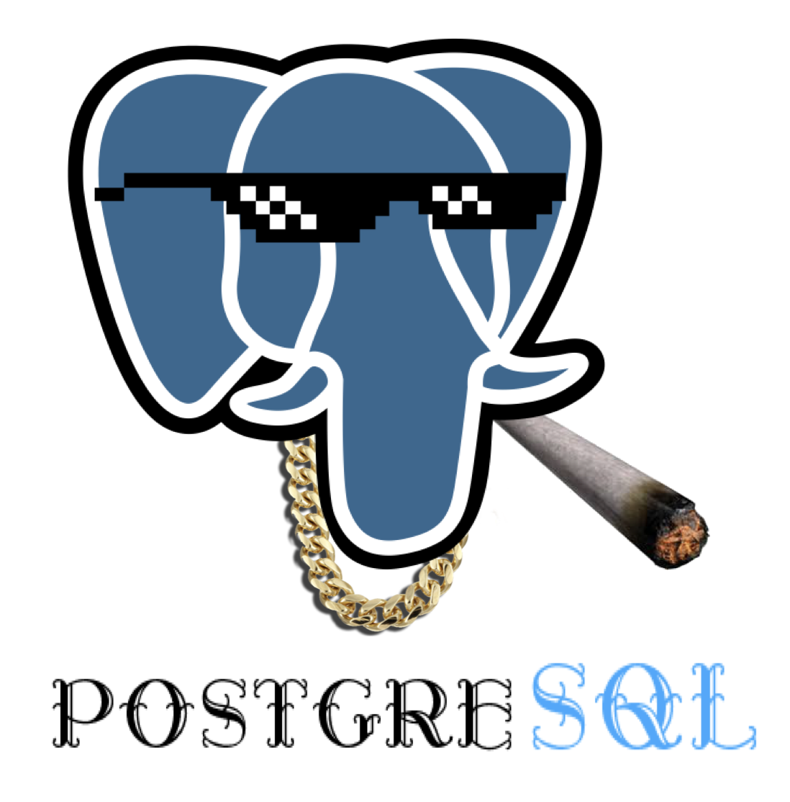
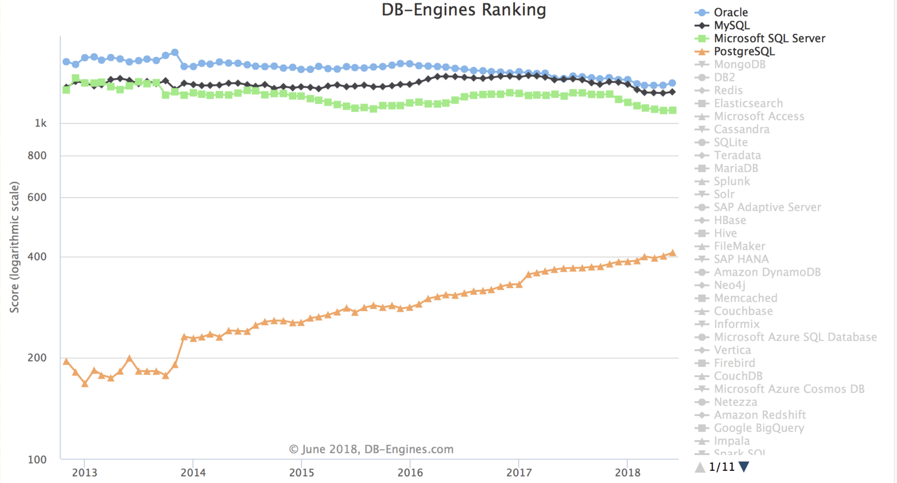

PostgreSQL's slogan is "**The world's most advanced open source relational database**", but I think this slogan isn't catchy enough, and it looks like it's targeting MySQL's "**The world's most popular open source relational database**" slogan, which seems like riding on coattails. I think the most vivid slogan that captures PostgreSQL's characteristics should be: **A versatile full-stack database**, one trick that eats everywhere.

----------------

### Full-Stack Database

Mature applications might use many different data components (functions): caching, OLTP, OLAP/batch processing/data warehouse, stream processing/message queues, search indexes, NoSQL/document databases, geographic databases, spatial databases, time series databases, graph databases. Traditional architecture selection might combine multiple components, typically like: Redis + MySQL + Greenplum/Hadoop + Kafka/Flink + ElasticSearch, a combination that can handle most requirements. However, what's quite troublesome is heterogeneous system integration: lots of code consists of repetitive and tedious glue code, doing the work of moving data from component A to component B.

Here, MySQL can only play the role of an OLTP relational database, but if it's PostgreSQL, it can wear multiple hats, handling them all:

* **OLTP**: Transaction processing is PostgreSQL's main job

* **OLAP**: Citus distributed plugin, ANSI SQL compatibility, window functions, CTE, CUBE and other advanced analytics features, UDF in any language

* **Stream processing**: PipelineDB extension, Notify-Listen, materialized views, rule systems, flexible stored procedure and function writing

* **Time series data**: TimescaleDB time series database plugin, partitioned tables, BRIN indexes

* **Spatial data**: PostGIS extension (killer feature), built-in geometric type support, GiST indexes.

* **Search indexes**: Full-text search indexes sufficient for simple scenarios; rich index types, supporting function indexes and conditional indexes

* **NoSQL**: Native support for JSON, JSONB, XML, HStore, foreign data wrappers to NoSQL databases

* **Data warehouse**: Can smoothly migrate to GreenPlum, DeepGreen, HAWK, etc. in the same PostgreSQL ecosystem, use FDW for ETL

* **Graph data**: Recursive queries

* **Caching**: Materialized views

> Using Extensions as six instruments, honoring heaven, earth, and the four directions.
>
> Honor heaven with Greenplum,
>
> Honor earth with Postgres-XL,
>
> Honor the east with Citus,
>
> Honor the south with TimescaleDB,
>
> Honor the west with PipelineDB,
>
> Honor the north with PostGIS.
>
>  —— "Book of Rites: PostgreSQL Edition"

In Tantan's old architecture, the entire system was designed around PostgreSQL. At a scale of millions of daily active users, millions of global DB-TPS, and hundreds of TB of data, only PostgreSQL was used for data components. Independent data warehouses, message queues, and caches were introduced later. And this is just a validated scale level; further exploiting PostgreSQL is completely feasible.

Therefore, within a considerable scale, PostgreSQL can play the role of a multi-talented player, using one component as multiple components. **Although it might not match specialized components in certain areas**, at least it does reasonably well in all of them. **Single data component selection can greatly reduce additional project complexity, which means saving a lot of costs. It makes something that would take ten people into something one person can handle.**

Designing for unnecessary scale is a waste of effort, which is actually a form of premature optimization. Only when no single software can meet all your needs does the trade-off between **separation** and **integration** exist. Integrating multiple heterogeneous technologies is quite tricky work. If there really is such a technology that can meet all your needs, then using that technology is the best choice, rather than trying to reimplement it with multiple components.

When business scale grows to a certain level, you might have to use microservice/bus-based architectures, separating database functions into multiple components. But PostgreSQL's existence greatly delays the threshold where this trade-off arrives, and it can continue to play an important role even after separation.

----------------

## Operations-Friendly

Of course, besides powerful functionality, another important advantage of PostgreSQL is being **operations-friendly**. It has many very practical features:

- DDL can be put in transactions, table drops, TRUNCATE, function creation, indexing can all be put in transactions for atomic effect or rollback.

  This enables many clever operations, like completing king-rook switch between two tables through RENAME in one transaction.

- Can create and drop indexes concurrently, add non-null fields, reorganize indexes and tables without locking tables.

  This means you can perform major schema changes online without downtime, optimizing indexes on demand.

- Various replication methods: WAL shipping, streaming replication, trigger replication, logical replication, plugin replication, etc.

  This makes data migration without service interruption quite easy: replicate, change reads, change writes - three steps, online migration as stable as a dog.

- Various commit methods: asynchronous commit, synchronous commit, quorum synchronous commit.

  This means PostgreSQL allows trade-offs and choices between C and A, for example, transaction databases use sync commit, regular databases use async commit.

- Very complete system views, making monitoring systems quite simple.

- The existence of FDW makes ETL incredibly simple, one line of SQL can solve it.

  FDW can conveniently let one instance access data or metadata from other instances. It has wonderful uses in cross-partition operations, database monitoring metric collection, data migration scenarios. It can also interface with many heterogeneous data systems.

----------------

## Healthy Ecosystem

PostgreSQL's ecosystem is also very healthy, with a quite active community.

Compared to MySQL, one huge advantage of PostgreSQL is its friendly license. PostgreSQL uses a BSD/MIT-like PostgreSQL license, basically meaning as long as you don't use PostgreSQL's name to deceive people, you can do whatever you want, even rebrand and sell it. Look how many domestic databases, or many "self-developed databases" are actually PostgreSQL rebrands or secondary development products.

Of course, many derivative products will give back to the mainline, like `timescaledb`, `pipelinedb`, `citus` - these "databases" based on PostgreSQL eventually became native PostgreSQL plugins. Often when you want to implement some functionality, you can find corresponding plugins or implementations with a search. Open source is about having some feelings after all.

PostgreSQL's code quality is quite high, with very clear comments. The C code reads like Go, and the code can serve as documentation. You can learn a lot from it. In comparison, other databases like MongoDB - I gave up interest in reading after one glance.

As for MySQL, the community edition uses the GPL license, which is actually quite painful. If not for GPL contagion, why would there be so many MySQL-based databases open sourced? And MySQL is still in Oracle's hands, letting someone else control your family jewels isn't a wise choice, especially when it's an industry cancer? Facebook's React license controversy storm serves as a cautionary tale.

----------------

## Problems

Of course, if we talk about shortcomings or regrets, there are still a few:

- Because it uses MVCC, the database needs regular VACUUM, requiring regular maintenance of tables and indexes to avoid performance degradation.
- There's no good open source **cluster** monitoring solution (or they're too ugly!), you need to make your own.
- Slow query logs and regular logs are mixed together, requiring parsing and processing.
- Official PostgreSQL doesn't have good column storage, which is a small regret for data analysis.

Of course, these are all minor issues, but the real problem might be unrelated to technology...

In the end, MySQL is indeed the **most popular** open source relational database. No way around it - many Java and PHP developers started with MySQL, so recruiting for PostgreSQL is relatively difficult, often requiring training your own people. However, looking at the popularity trends on DB Engines, the future is still bright.

## Other

Learning PostgreSQL is a very interesting thing. It made me realize that database functionality goes far beyond CRUD. I entered the database world through SQL Server and MySQL. But it was PostgreSQL that truly showed me the wonderful world of databases.

The reason for writing this article is because my old post on Zhihu was dug up again, reminding me of my green years when I first encountered PostgreSQL. (https://www.zhihu.com/question/20010554/answer/94999834) Of course, now I'm a full-time PostgreSQL DBA, I can't help but add a few more shovels to this old grave. "The melon seller praises her own melons" - praising PostgreSQL is appropriate. Hehe...

Full-stack engineers should use full-stack databases.

I personally compared MySQL and PostgreSQL, and was fortunate to have the freedom of choice in Alibaba's MySQL world. I believe that from purely technical factors, PostgreSQL completely crushes MySQL. Despite great resistance, I eventually got PostgreSQL adopted and promoted. I've used it for many projects, solving many requirements (from small statistical reports to creating small revenue targets for the company). Most requirements PostgreSQL handled single-handedly, and a few also used some MQ and NoSQL (Redis, MongoDB, Cassandra/HBase). PostgreSQL is truly irresistible.

Finally, I love PostgreSQL so much that I went to specialize in PostgreSQL research.

In my first job, I deeply tasted the benefits of using PostgreSQL - one person's development efficiency could match a small team:

- Too lazy to write backend? [PostGraphQL](https://github.com/graphile/postgraphile) directly generates GraphQL APIs from database schema definitions, automatically listens to DDL changes, generates corresponding CRUD methods and stored procedure wrappers. Perfect for backend development, similar tools include PostgREST and pgrest. For small to medium data applications, they're all usable, saving most backend development work.

- Need Redis functionality? Go directly with PostgreSQL, simulating regular functionality is no problem, cache is also saved. Pub/Sub using Notify/Listen/Trigger implementation, very convenient for broadcasting configuration changes and doing some control.

- Need to do analysis? Window functions, complex JOINs, CUBE, GROUPING, custom aggregates, custom languages - amazing to use. If you think the scale is large and want to scale out, you can use [citus](https://www.citusdata.com/) extension (or switch to Greenplum); compared to data warehouses, missing column storage might be regrettable, but everything else that should be there is there.

- Using geographic-related functionality? PostGIS is a divine tool - complex geographic requirements that would take thousands of lines of code [can be solved with one line of SQL efficiently](https://github.com/Vonng/pg/blob/master/app/knn-optimize.md).

- Storing time series data? [TimescaleDB](https://www.timescale.com/) extension, while not matching specialized time series databases, still has million records per second insertion rates. I've used it to solve hardware sensor log storage and monitoring system metrics storage requirements.

- Some stream computing related functionality can be implemented using [PipelineDB](http://docs.pipelinedb.com/introduction.html) to directly define streaming views: UV, PV, user profiles in real-time.

- PostgreSQL's [FDW](https://wiki.postgresql.org/wiki/Foreign_data_wrappers) is a powerful mechanism allowing access to various data sources with a unified SQL interface. It has wonderful uses:

- - Built-in extensions like `file_fdw` can interface any program's output into data tables. The simplest application is [monitoring system information](https://github.com/Vonng/pg/blob/master/fdw/file_fdw-intro.md).
  - When managing multiple PostgreSQL instances, you can use the built-in `postgres_fdw` in a metadata database to import data dictionaries from all remote databases. Unified access to metadata from all database instances, one line of SQL to pull real-time metrics from all databases - monitoring systems become incredibly convenient.
  - Something I've done before is using [hbase_fdw](https://github.com/Vonng/hbase_fdw) and MongoFDW to wrap historical batch data from HBase and current real-time data from MongoDB as PostgreSQL data tables, implementing a Lambda architecture that fuses batch and stream processing with a simple view.
  - Using `redis_fdw` for cache update pushing; using `mongo_fdw` to complete data migration from MongoDB to PostgreSQL; using `mysql_fdw` to read MySQL data and store in data warehouse; implementing cross-database, even cross-data-component JOINs; using one line of SQL to complete complex ETL that would otherwise require many lines of code - what a beautiful thing.

- Rich type and method support: for example [JSON](http://www.postgres.cn/docs/9.6/datatype-json.html), generating JSON responses needed by frontend directly from database, easy and pleasant. Range types elegantly solve many edge cases that would otherwise need program handling. Others like arrays, multi-dimensional arrays, custom types, enums, network addresses, UUIDs, ISBNs. Many out-of-the-box data structures save programmers from how much wheel-reinventing work.

- Rich index types: general Btree indexes; Brin indexes that greatly optimize sequential access; Hash indexes for equality queries; GIN inverted indexes; GIST general search trees efficiently supporting geographic queries and KNN queries; Bitmap simultaneously utilizing multiple independent indexes; Bloom efficiently filtering indexes; **conditional indexes** that can greatly reduce index size; **functional indexes** that can elegantly replace redundant fields. MySQL only has those few pitiful index types.

- Stable, reliable, correct, and efficient. MVCC easily implements snapshot isolation, MySQL's RR isolation level implementation is [incomplete](https://github.com/ept/hermitage), unable to avoid PMP and G-single anomalies. Lock and rollback segment-based implementations have various pitfalls; PostgreSQL can implement high-performance serializable through SSI.

- Powerful replication: WAL shipping, streaming replication (v9 appearance, sync, semi-sync, async), logical replication (v10 appearance: subscription/publication), trigger replication, third-party replication - all kinds of replication available.

- Operations-friendly: DDL can be executed in transactions (rollbackable), creating indexes doesn't lock tables, adding new columns (without default values) doesn't lock tables, cleanup/backup doesn't lock tables. Various system views and monitoring functions are complete.

- Many extensions, rich functionality, extremely high customizability. In PostgreSQL you can write functions in any language: Python, Go, Javascript, Java, Shell, etc. Rather than saying PostgreSQL is a database, it's better to say it's a development platform. I've tried many useless but fun things: **in-database** crawlers/ [recommendation systems](https://github.com/Vonng/pg/blob/master/app/recsys-itemcf.md) / neural networks / web servers, etc. There are various powerful or creatively strange third-party plugins: [https://pgxn.org/).

- PostgreSQL's license is friendly, BSD - do whatever you want. Look how many databases are PostgreSQL rebrands. MySQL has GPL contagion and is controlled by Oracle.