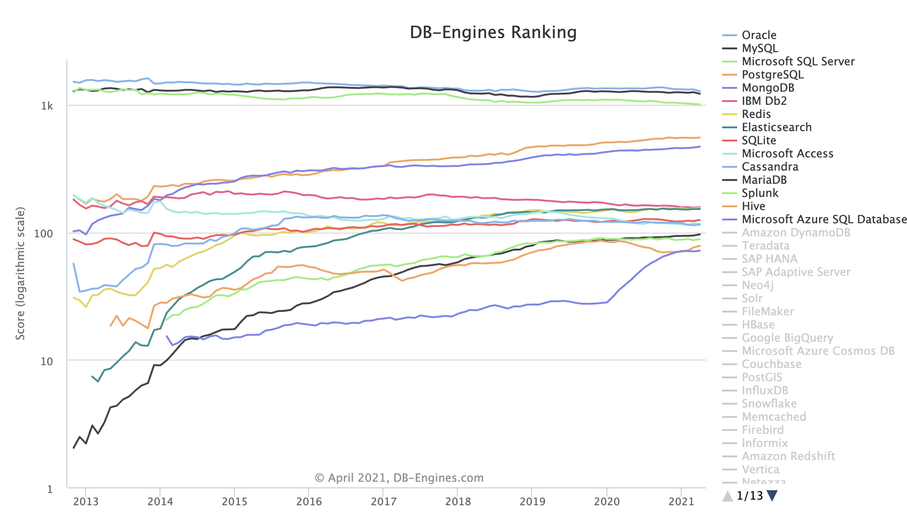
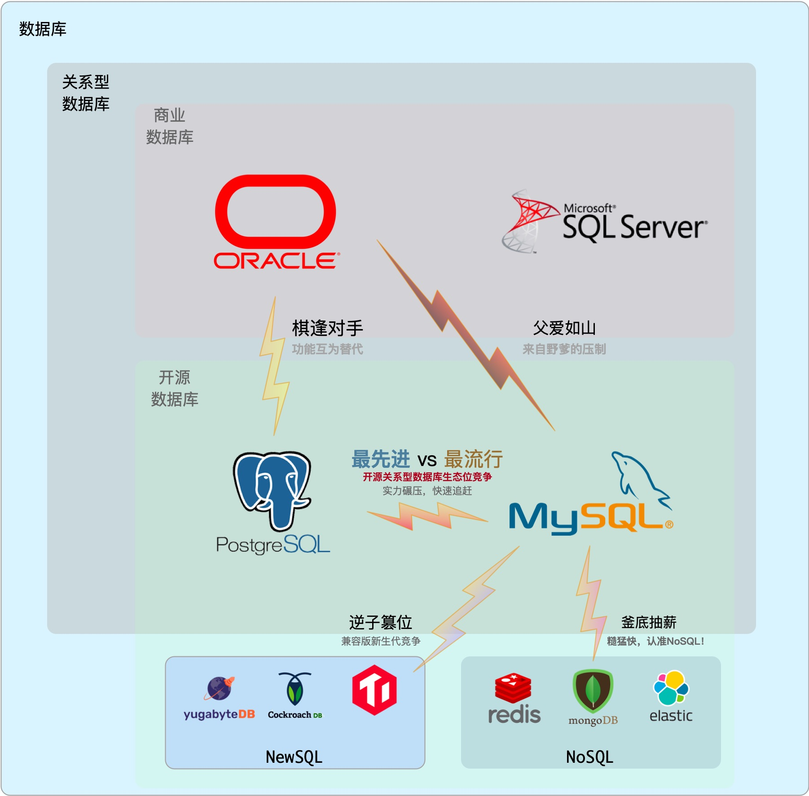
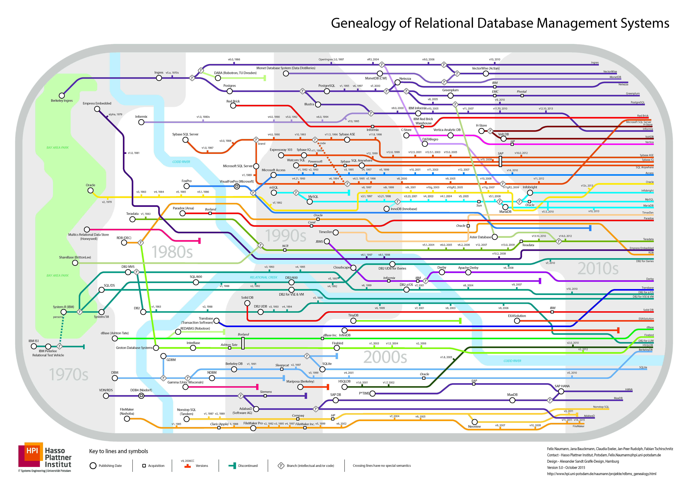
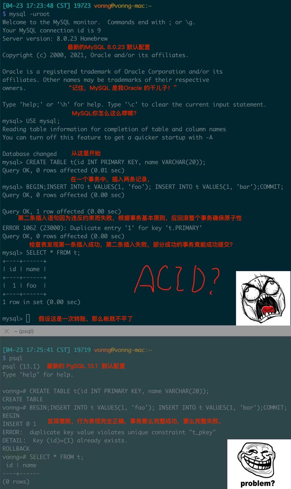
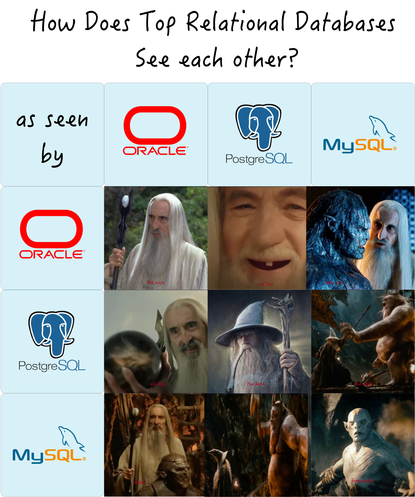
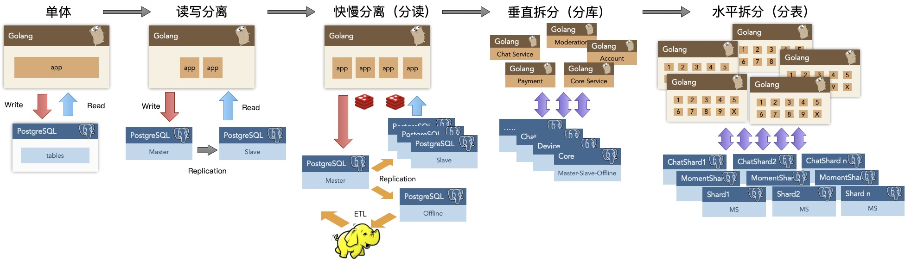

Recently, everything I've been working on revolves around the PostgreSQL ecosystem, because I've always felt this is a direction with unlimited potential.

Why do I say this? Because databases are the core component of information systems, relational databases are the absolute backbone of databases, and PostgreSQL is the world's most advanced open source relational database. With such favorable timing and positioning, how can it not achieve great success?

The most important thing in doing anything is to understand the situation clearly. When timing is right, heaven and earth unite to help; when fortune fades, even heroes lack freedom.

-------------

## Global Trends

Today's world is divided into three parts: Oracle | MySQL | SQL Server are weakening and declining. PostgreSQL follows closely behind, rising like the sun at noon. Among the top four databases, the first three are all on a downward trajectory, only PG maintains unabated growth momentum. This ebb and flow promises unlimited potential.

> [DB-Engine Database Popularity Trends](https://db-engines.com/en/ranking_trend) (Note: this is a **logarithmic** coordinate system)

Among the only two leading open source relational databases MySQL & PostgreSQL, MySQL (2nd) currently has the upper hand, but its ecological niche is gradually being captured by PostgreSQL (4th) and the non-relational document database MongoDB (5th). Following current trends, PostgreSQL's popularity will soon break into the top three in a few years, standing alongside Oracle and MySQL.

-------------

## Competitive Landscape

Relational databases have highly overlapping ecological niches, and their relationships can be viewed as a zero-sum game. PostgreSQL's direct competitors are **Oracle** and **MySQL**.

Oracle ranks first in popularity, is an established commercial database with deep historical and technical foundations, rich functionality, and comprehensive support. It sits firmly on the database throne, beloved by enterprises and organizations that aren't short on money. But Oracle is expensive and has become a notorious industry toxin with its litigious behavior. SQL Server, ranking third, belongs to the relatively independent Microsoft ecosystem, similar in nature to Oracle, both being commercial databases. Commercial databases overall are under pressure from open source databases and are in a state of slow decline in popularity.

MySQL ranks second in popularity, but being a tall tree that catches the wind, it's in an unfavorable position with wolves ahead and tigers behind, overlords above and rebels below: in rigorous transaction processing and data analysis, MySQL is left several streets behind by fellow open source relational database PostgreSQL; in the rough-and-ready agile methodology approach, MySQL isn't as good as emerging NoSQL. Meanwhile, MySQL has pressure from foster father Oracle above, MariaDB branching off in the middle, and compatibility-focused new databases like TiDB and OceanBase taking market share below, thus it has also stagnated.

Only PostgreSQL is catching up, maintaining almost exponential growth momentum. If we say PG's momentum was just Potential a few years ago, now that Potential is beginning to convert into Impact, starting to pose strong challenges to competitors.

In this life-or-death struggle, PostgreSQL occupies three **advantages**:

1. The trend of open source software proliferation and development, eroding commercial software markets

   Against the backdrop of "de-IOE" and the open source wave, it leverages the open source ecosystem to suppress commercial software (Oracle).

2. Meeting users' growing demands for data processing functionality

   With PostGIS as the de facto standard for geospatial data processing, it stands invincible, and with its extremely rich functionality rivaling Oracle, it technically suppresses MySQL.

3. The trend of market share regression to the mean

   PG's domestic market share is far below the world average due to historical reasons, inherently containing enormous potential energy.

Oracle, as established commercial software, has unquestionable **talent** but as an industry toxin, its "**virtue**" needs no elaboration, hence: "**talented but lacking virtue**". MySQL has the merit of being open source, but first it uses the GPL license, which is quite inferior to PostgreSQL's selfless and permissive BSD license; second, it acknowledges a thief as father, being acquired by Oracle; third, it's shallow in talent and crude in functionality, hence: "**shallow talent and weak virtue**".

When virtue doesn't match position, disaster must follow. Only PostgreSQL occupies the favorable timing of open source rise, grasps the advantageous position of powerful functionality, and enjoys the harmony of permissive BSD licensing. As the saying goes: Keep your talents hidden, move when the time is right. If it doesn't sing, it won't; but when it does, it will astonish the world. With both virtue and talent, the offensive and defensive positions have reversed!

-------------

## Virtue and Talent Combined

### PostgreSQL's Virtue

**PG's "virtue" lies in being open source**. What is "virtue"? Behavior that conforms to the "way" is virtue. And this "way" is **open source**.

PG itself is grandfather-level open source software, a pearl in the open source world, a successful example of global developer collaboration. More importantly, it uses the selfless BSD license: except for fraudulently using PG's name, it's basically taboo-free: such as rebranding and transforming into domestic databases for sale. PG can be called the bread and butter of countless database vendors. With children and grandchildren filling the halls, saving countless lives, its merit is immeasurable.

> Database genealogy chart - if all PostgreSQL derivatives were listed, this chart would probably burst

### PostgreSQL's Talent

**PG's "talent" lies in being versatile**. PostgreSQL is a versatile full-stack database, naturally HTAP, a hyper-converged database, one against ten. A single component is basically sufficient to cover most database needs of small and medium enterprises: OLTP, OLAP, time-series databases, spatial GIS, full-text search, JSON/XML, graph databases, caching, etc.

PostgreSQL can independently play the role of a multi-talented player within a considerable scale, using one component as multiple components. **Single data component selection can dramatically reduce additional project complexity, meaning significant cost savings. It turns a ten-person job into a one-person job.** If there really is such a technology that can meet all your needs, then using that technology is the best choice, rather than trying to reimplement it with multiple components.

> Reference reading: [**What Are PostgreSQL's Advantages**](/pg/pg-is-good/)

-------------

## The Virtue of Open-Source

Open source has great **virtue**. The history of the Internet is the history of open source software. The reason the IT industry has today's prosperity, and people can enjoy so many free information services, one core reason is open source software. Open source is a truly successful form of communism (translated as **communitarianism** would be more appropriate) composed of developers: software, the core means of production in the IT industry, becomes commonly owned by developers worldwide - everyone for me, me for everyone.

When an open source programmer works, behind their labor may be the crystallized wisdom of tens of thousands of top developers. Internet programmers are expensive because, in effect, a programmer is not a worker, but a contractor commanding software and machines to work. Programmers themselves are core means of production, servers are easy to obtain (compared to scientific research equipment and experimental environments in other industries), software comes from public communities, and one or several senior software engineers can easily use the **open source ecosystem** to quickly solve domain problems.

Through open source, all community developers unite their efforts, greatly reducing the internal friction of reinventing wheels. This makes the entire industry's technical level advance at an unimaginable speed. The momentum of open source is like a snowball, and by today it has become unstoppable. Basically, except for some special scenarios and path dependencies, developing software behind closed doors for self-reliance has become a big joke.

So, whether doing databases or software, **to do technology is to do open source technology**. Closed source things have too weak vitality and aren't interesting. The virtue of open source is also the greatest confidence PostgreSQL and MySQL have against Oracle.

-------------

## Ecosystem Competition

The core of open source lies in **ecosystem (ECO)**. Every open source technology has its own small ecosystem. A so-called ecosystem is a system composed of various entities and their environments through intensive interactions, and the ecosystem model of open source software can roughly be described as a positive feedback loop composed of the following three steps:

* Open source software developers contribute to open source software
* Open source software itself is free, attracting more users
* Users use open source software, generate demand, creating more open source software-related positions

The prosperity of open source ecosystems depends on this closed loop, and the scale (number of users/developers) and complexity (quality of users/developers) of the ecosystem directly determine the vitality of this software. Therefore, every open source software has a destiny to expand its scale. Software scale usually depends on the **ecological niche** the software occupies. If different software's ecological niches overlap, competition occurs. In the ecological niche of open source relational databases, PostgreSQL and MySQL are the most direct competitors.

-------------

## Popular vs Advanced

MySQL's slogan is "**The World's Most Popular Open-Source Relational Database**," while PostgreSQL's slogan is "**The World's Most Advanced Open-Source Relational Database**" - at first glance, these are clearly old rivals. These two slogans well reflect the characteristics of both products: PostgreSQL is feature-rich, consistency-first, high-end rigorous academic-style database; MySQL is feature-crude, availability-first, rough-and-ready "engineering-style" database.

MySQL's main user base is concentrated in Internet companies. What are the typical characteristics of Internet companies? Pursuing trendy **rough-and-ready** approaches. **Rough** means Internet company business scenarios are simple (mostly CRUD); data importance is not high, unlike traditional industries (like banks) that care about data consistency (correctness); availability priority (more tolerant of data loss/corruption than service outages, while some traditional industries would rather stop service than have account errors). **Ready** means the Internet industry has large data volumes - they need cement truck mixers, not high-speed trains and manned spacecraft. **Fast** means the Internet industry has rapidly changing requirements, short delivery cycles, requiring fast response times, with massive demand for out-of-the-box software packages (like LAMP) and CRUD developers who can work after simple training. Thus, rough-and-ready Internet companies and rough-and-ready MySQL hit it off.

PostgreSQL users lean more toward traditional industries. **Traditional industries are called traditional because they've passed through the stage of wild growth**, having mature business models and deep accumulated foundations. They need correct results, stable performance, rich functionality, and the ability to **analyze, process, and refine** data. So in traditional industries, it's often the world of Oracle, SQL Server, and PostgreSQL. Particularly in geo-related scenarios, it has an irreplaceable position. At the same time, many Internet companies' businesses are also beginning to mature and settle, having one foot in "traditional industry" territory, and more and more Internet companies are escaping the rough-and-ready low-level cycle, turning their attention to PostgreSQL.

-------------

## Which is More Correct?

Those who know a person best are often their competitors. PostgreSQL and MySQL's slogans both accurately hit their opponent's pain points. PostgreSQL's "most advanced" subtext is that MySQL is too backward, while MySQL's "most popular" means PostgreSQL isn't popular. Few users but advanced, many users but backward. Which is "better"? This kind of value judgment is hard to answer.

But I believe time stands with **advanced** technology: because advanced vs backward is the core measure of technology, the cause, while popular or not is the effect; popular or not is the **result** of the integral over time of internal factors (whether technology is advanced) and external factors (historical path dependence). Current causes will reflect as future effects: popular things become obsolete because they're backward, while advanced things become popular because they're advanced.

Although many popular things are garbage, popular doesn't necessarily mean backward. If it just lacks some features, MySQL wouldn't be called "backward." The problem is MySQL has become so crude that even **transactions**, a basic feature of relational databases, have defects. That's not a question of backward or not, but whether it's qualified or not.

### ACID

> Some authors claim that supporting general two-phase commit is too expensive, bringing performance and availability problems. Letting programmers handle performance problems caused by overusing transactions is much better than lacking transactions for programming.
> ——James Corbett et al., Spanner: Google's Globally Distributed Database (2012)

In my view, MySQL's philosophy can be called: "Better to live miserably than die well," and "After me, the deluge." Its "availability" is reflected in various "fault tolerance," such as allowing stupid programmers' erroneous SQL queries to still run. The most outrageous example is MySQL actually allowing **partially successful** transaction commits, violating basic constraints of relational databases: **atomicity and data consistency**.

> Figure: MySQL actually allows partially successful transaction commits

Here, two records were inserted in one transaction, the first succeeded, the second failed due to constraint violation. According to transaction atomicity, the entire transaction should either succeed completely or fail completely (ultimately no records inserted). But MySQL's default behavior actually allows partially successful transaction commits, meaning transactions lack **atomicity**, and **without atomicity there's no consistency**. If this transaction was a money transfer (deduct first, then add), and it failed for some reason, the accounts wouldn't balance. This kind of database used for accounting would probably be a confused mess, so talk of "financial-grade MySQL" is probably a joke.

Of course, ridiculously, some MySQL users call this a "**feature**," saying it reflects MySQL's fault tolerance. Actually, such "special fault tolerance" needs can be completely implemented in the SQL standard through the SAVEPOINT mechanism. PostgreSQL's implementation of this is exemplary - the psql client allows through the `ON_ERROR_ROLLBACK` option to implicitly create `SAVEPOINT` after each statement and automatically `ROLLBACK TO SAVEPOINT` after statement failure, achieving this seemingly convenient but actually **compromising** functionality in standard SQL way, as a client option, without breaking transaction ACID. In contrast, MySQL's so-called "feature" comes at the cost of directly sacrificing transaction ACID at the server side by default (meaning users using JDBC, psycopg and other application drivers are also affected).

If it's Internet business, losing a user avatar or comment when registering might not be a big deal. With so much data, losing a few records, getting a few wrong - what's the big deal? Not to mention data, the business itself might be in a precarious state, so what if it's crude? If successful later, predecessors' messes will be cleaned up by successors anyway. So some Internet companies usually don't care about these things.

PostgreSQL's so-called "strict constraints and syntax" might seem "inhuman" to newcomers. For example, if there are some dirty records in a batch of data, MySQL might accept them all, while PG would strictly reject them. Although compromising accommodation seems convenient, it plants landmines elsewhere: engineers who have to debug logic bombs late at night and data analysts who have to clean dirty data daily must have great resentment about this. From a long-term perspective, to succeed, **doing the right thing** is most important.

> A successful technology must prioritize reality over public relations - you can fool others, but you can't fool natural laws.
>
> ——Rogers Commission Report (1986)

MySQL's popularity isn't far from PostgreSQL's, but its functionality compared to PostgreSQL and Oracle has quite a gap. Oracle and PostgreSQL were born around the same time, so even when fighting, with different stances and camps, there's a bit of mutual respect between old rivals: both are solid masters who've cultivated internal skills for half a century, accumulated deep foundations. MySQL is like an impetuous young man in his twenties wielding knives and guns, relying on brute force, riding the golden twenty years of Internet wild growth to rise and claim territory.

The dividends given by the times will also recede as times pass. In this era of change, without advanced functionality as foundation, "popularity" probably can't last long.

-------------

## Development Prospects

From a personal **career development** perspective, many programmers learn a technology to improve their technical competitiveness (to better secure positions and earn money). PostgreSQL is the most cost-effective choice among various relational databases: it can not only be used for traditional CRUD OLTP business, **data analysis** is even more its specialty. Various distinctive features provide opportunities to enter multiple industries: geospatial-temporal data processing and analysis based on PostGIS, time-series financial IoT data processing and analysis based on Timescale, stream processing based on Pipeline stored procedures and triggers, search engines based on inverted index full-text search, FDW for unified access to various external data sources. It can be said it's a truly versatile full-stack database, with functionality much richer than pure OLTP databases, providing CRUD programmers with paths for transformation and advancement.

From **enterprise user** perspective, PostgreSQL can independently play multi-talented roles within a considerable scale, using one component as multiple components. **Single data component selection can dramatically reduce additional project complexity, meaning significant cost savings. It turns a ten-person job into a one-person job.** Of course, this doesn't mean PG should fight ten opponents and overturn other databases' rice bowls - professional components' strength in professional fields is unquestionable. But don't forget, **designing for unnecessary scale is wasted effort**, actually a form of premature optimization. If there really is such a technology that can meet all your needs, then using that technology is the best choice, rather than trying to reimplement it with multiple components.

Taking Tantan as an example, at the scale of 2.5M TPS and 200TB data, **single PostgreSQL selection** could still support business stable as a rock. Within a considerable scale, it could be versatile - besides its main OLTP job, PG also served as cache, OLAP, batch processing, even message queue for quite a long time. Of course, even divine turtles have lifespans. Eventually these part-time functions need to be gradually **separated** to dedicated components, but that was only when approaching ten million daily active users.

From **business ecosystem** perspective, PostgreSQL also has huge advantages. First, PG's **technology is advanced**, can be called "open source Oracle." Native PG can basically achieve 80-90% Oracle compatibility, with EDB having professional PG distributions with 96% Oracle compatibility. Therefore, in capturing markets vacated by Oracle exit, PostgreSQL and its derivatives have overwhelming technical advantages. Second, PG's protocol is friendly, using permissive BSD license. Therefore, various database vendors' and cloud vendors' "self-developed databases" and many "cloud databases" are largely based on PostgreSQL modifications. For example, Huawei's recent choice to base openGaussDB on PostgreSQL was very wise. Don't misunderstand - PG's license indeed allows this, and doing so indeed makes PostgreSQL's ecosystem more prosperous. Selling PostgreSQL derivatives is a mature market: traditional enterprises aren't short of money and are willing to pay for this. Open source genius fire watered with commercial interest oil burns with vigorous vitality.

### vs MySQL

As an old rival, MySQL's situation is somewhat awkward.

From personal career development perspective, learning MySQL is mainly for CRUD. Learning CRUD well to become a qualified programmer is fine, but who wants to always do "data mining" work? Data analysis is the lucrative job in the data industry chain. With MySQL's weak analytical capabilities, it's hard to support CRUD programmers' upgrade and transformation. Additionally, PostgreSQL's market demand is there, but currently faces supply shortage (so many varied PG training institutions have sprung up like mushrooms), while MySQL people are indeed easier to recruit than PostgreSQL people, this is true. But conversely, the degree of internal competition in MySQL circles is much greater - supply shortage reflects scarcity, too many people means skills depreciate.

From enterprise user perspective, MySQL is a single-function component dedicated to OLTP, often needing ES, Redis, Mongo and others together to meet complete data storage needs, while PG basically doesn't have this problem. Additionally, both MySQL and PostgreSQL are open source databases, both "free." Between free Oracle and free MySQL, which would users choose?

From business ecosystem perspective, MySQL faces the biggest problem of being **acclaimed but not profitable**. Acclaim is because the more popular something is, the louder the voice, especially with main users being Internet companies that occupy discourse high ground. **Not profitable** is also because Internet companies themselves have extremely weak willingness to pay for such software: hiring a few MySQL DBAs to directly use open source is more cost-effective no matter how you calculate. Additionally, because MySQL's GPL license requires derivative software to also be open source, software vendors have weak motivation to develop based on MySQL, basically adopting MySQL "protocol compatibility" to share MySQL's market cake rather than developing and giving back based on MySQL code, raising questions about ecosystem health.

Of course, MySQL's biggest problem is its increasingly narrow **ecological niche**. In rigorous transaction processing and data analysis, PostgreSQL leaves it several streets behind; in rough-and-ready rapid prototyping, NoSQL families are much more convenient than MySQL. In business money-making, Oracle daddy suppresses from above; in open source ecology, new-generation MySQL-compatible products continuously emerge trying to replace the main body. It can be said MySQL is living off past laurels, maintaining its current position only through historical accumulated points. Whether time will stand with MySQL, let's wait and see.

### vs NewSQL

Recently there are also some very bright NewSQL products in the market, such as TiDB, CockroachDB, YugabyteDB, etc. How are they? I think they're all good products with some nice technical highlights, all contributions to open source technology. But they might face similar **acclaimed but not profitable** dilemmas.

NewSQL's general characteristics are: focusing on "**distributed**" concepts, solving **horizontal scalability** and **disaster recovery high availability** through "distributed," and sacrificing many **features** due to distributed inherent limitations, only providing relatively simple limited query support. Distributed databases don't have qualitative differences from traditional master-slave replication in high availability disaster recovery, so their characteristics can mainly be summarized as "**trading quality for quantity**."

However, for many enterprises, sacrificing functionality for **scalability** might be a **false need** or **weak need**. Among the many users I've encountered, the vast majority of scenarios' data volume and load levels fall completely within single-machine Postgres processing range (the record I've handled is single database 15TB, single cluster 400K TPS). From data volume perspective, most enterprises' lifetime data volume won't exceed this bottleneck; as for performance, it's even less important - premature optimization is the root of all evil, many enterprises' DB performance margin is enough for them to write all business logic in stored procedures and run happily in the database.

NewSQL's grandfather Google Spanner was created to solve massive data scalability problems, but how many enterprises can have Google's business data volume? Probably only typical Internet companies or some large enterprises' partial businesses would have this scale of data storage needs. So like MySQL, NewSQL's problem returns to the fundamental question of **who will pay**. Probably in the end, only investors and state-owned assets committees will pay.

But at least, NewSQL's attempts are always worthy of praise.

### vs Cloud Databases

> "**I want to be frank: for years, we've been like fools while they made a fortune with what we developed**"
>
> —— Ofer Bengal, Redis Labs CEO

Another noteworthy "competitor" is so-called cloud databases, including two types: one is open source databases hosted on cloud, such as RDS for PostgreSQL; another is self-developed new-generation cloud databases.

For the former, the main issue is "**cloud vendor vampirism**". If cloud vendors **sell** open source software, it actually leads to open source software-related positions and profits concentrating toward cloud vendors, and whether cloud vendors allow their programmers to contribute to open source projects, how much they contribute, is actually hard to say. Responsible big companies usually give back to communities and ecosystems, but this depends on their consciousness. Open source software should still hold its fate in its own hands, preventing cloud vendors from becoming too big and forming monopolies. Compared to a few monopolistic giants, many scattered small groups can provide higher ecological diversity, more beneficial for healthy ecosystem development.

Gartner claims 75% of databases will be deployed to cloud platforms in 2022 - this boast is too big. (But there's a way to fulfill it - after all, using one machine can easily create hundreds of millions of sqlite file databases, does this count?). Because cloud computing can't solve a fundamental problem - **trust**. Actually in business activities, whether technology is awesome is a very secondary factor, Trust is the most critical. Data is the lifeline of many enterprises. Cloud vendors aren't truly neutral third parties - who can guarantee data won't be spied on, stolen, leaked, or even directly cut off (like various cloud vendors hammering Parler)? Transparent encryption solutions like TDE are also chicken ribs, thoroughly disgusting yourself but can't defend against truly determined bad actors. Maybe we'll have to wait for truly practical efficient fully homomorphic encryption technology to mature to solve trust and security problems.

Another fundamental problem is **cost**: with current cloud vendor pricing strategies, cloud databases only have advantages at small-micro scales. For example, a D740 64-core|400G memory|3TB PCI-E SSD high-spec machine's four-year comprehensive cost is at most hundreds of thousands. But the largest RDS specification I can find (much worse than this: 32-core|128GB) costs this much per year. As long as data volume and node count scale up a bit, hiring a DBA to self-build becomes much more cost-effective.

Cloud databases' main advantage is still **management and control** - simply put, convenience, point-and-click. Daily operations functions are already quite comprehensive, with some basic monitoring support. In short, the floor is set - if you can't find reliable database talent, using cloud databases at least won't cause too many problems. However, these management and control software, while good, are basically closed source and deeply bound to vendors.

> If you want an **open source** PostgreSQL monitoring and management one-stop solution, try Pigsty.

The latter type of cloud database, represented by AWS Aurora, also includes similar products like Alibaba-Cloud PolarDB and Tencent Cloud CynosDB. They basically use PostgreSQL and MySQL as base and protocol layers, customized based on cloud infrastructure (shared storage, S3, RDMA), optimizing **scaling speed** and **performance**. These products definitely have novelty and creativity technically. But the soul question is, what are the benefits of such products compared to directly using native PostgreSQL? The immediately visible benefit is cluster scaling will be much faster (from hours to 5 minutes), but compared to high costs and vendor lock-in problems, it really doesn't hit pain points or itch spots.

Overall, cloud databases pose limited threats to native PostgreSQL. Don't worry too much about cloud vendor problems - cloud vendors are generally part of the open source software ecosystem and contribute to communities and ecosystems. Making money isn't shameful - only when everyone makes money is there energy left for charity, right?

-------------

## Turn Over a New Leaf?

Generally speaking, Oracle programmers switching to PostgreSQL won't have much baggage, because both have similar functionality and most experience is transferable. Actually, many PostgreSQL ecosystem members switched from Oracle camp. For example, the famous domestic Oracle service provider Yunhe Enmo (founded by Gai Guoqiang, China's first Oracle ACE Director) publicly announced "personally entering the game" and embracing PostgreSQL last year.

There are also quite a few switching from MySQL camp to PostgreSQL, and these users actually feel the differences between the two most deeply: basically all have a look of "meeting too late, turning over a new leaf." Actually I myself started with MySQL first 😆, but when I could choose architecture, I embraced PostgreSQL. However, some old programmers have formed deep interest bindings with MySQL, shouting about how good MySQL is, not forgetting to touch and diss PostgreSQL (specifically referring to someone). This is actually understandable - touching interests is harder than touching souls. Seeing your expertise declining, PostgreSQL 🐘 being so good but asking me to abandon my beloved little dolphin 🐬 - can't do it.

However, young people entering the industry still have opportunities to choose a brighter path. Time is the fairest judge, and new generation choices are the most representative benchmarks. From my personal observations, in the emerging and vibrant Golang developer community, PostgreSQL's popularity is significantly higher than MySQL's. Many startup and innovative companies now choose Go+PG as their technology stack, such as Instagram, TanTan, and Apple are all Go+PG.

I think the main reason for this phenomenon is the rise of new generation developers. Go to Java is like PostgreSQL to MySQL. Later waves push earlier waves - this is actually evolution's core mechanism - metabolism. Go and PostgreSQL slowly flatten Java and MySQL, but Go and PostgreSQL might also be flattened by things like Rust and some truly revolutionary NewSQL databases in the future. But in the end, doing technology should focus on those with bright prospects, not those declining. (Of course, going to sea too early and becoming martyrs isn't appropriate either). Look at what new generation developers are using, what vibrant startups, new projects, new teams are using - working with these is never wrong.

-------------

## PostgreSQL's Problems

Of course, does PostgreSQL have its own problems? Of course it does - **popularity**.

Popularity relates to user scale, trust level, number of mature cases, amount of effective demand feedback, number of developers, etc. Although according to current popularity development trends, PG will surpass MySQL in a few years, so from a long-term perspective, I don't think this is a problem. But as a member of the PostgreSQL community, I think it's very necessary to do some things to secure this success and accelerate this progress. To make a technology more popular, the most effective way is: **lower barriers**.

So I made an open source software Pigsty, to smash PostgreSQL deployment, monitoring, management, and usage barriers from ceiling to floor. It has three core goals:

* Build the most professional top-tier open source PostgreSQL monitoring system (like Grafana dashboard)
* Build the lowest barrier, most user-friendly open source PostgreSQL management solution (like TiUP)
* Build ready-to-use integrated development environment for data analysis & visualization (like minikube)

Of course, details are limited by space and won't be expanded here, details will be discussed in the next article.