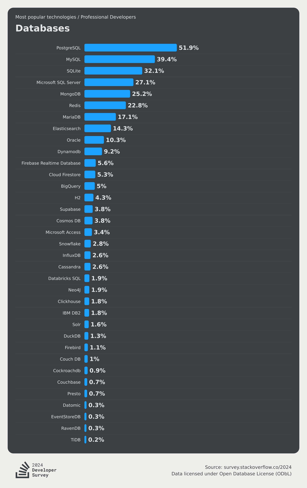
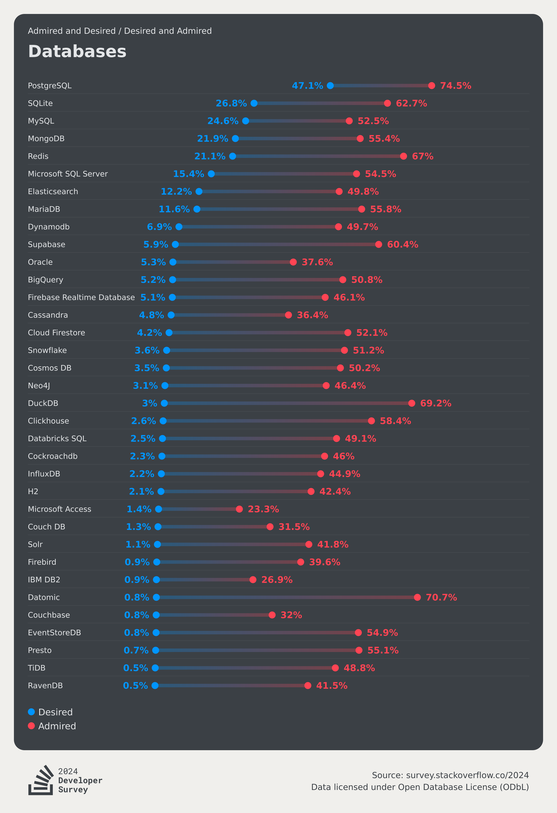
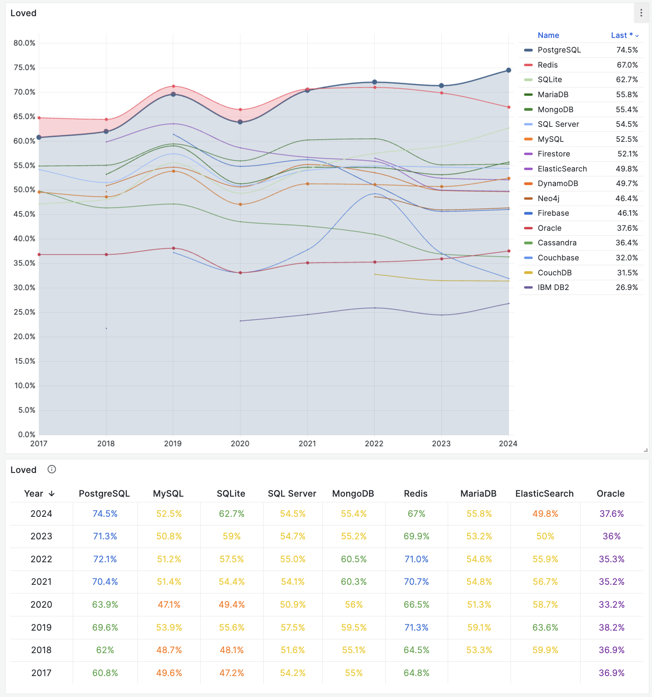
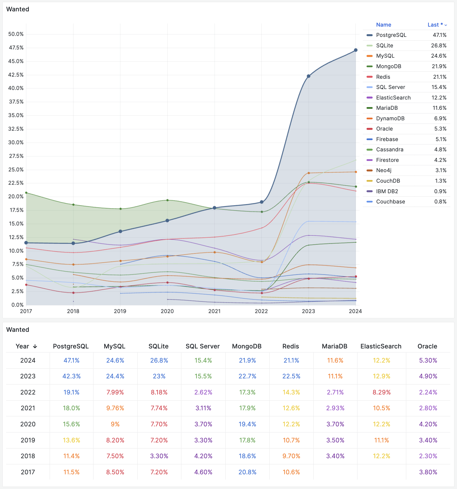

The [2024 StackOverflow Global Developer Survey results](https://survey.stackoverflow.co/2024/) are fresh out, with high-quality questionnaire feedback from 60,000 developers across 185 countries and regions. Of course, as a database veteran, I'm most interested in the "Database" section of the survey results:

------

## Popularity

First is database popularity: [Database usage rates among professional developers](https://survey.stackoverflow.co/2024/technology#1-databases)

The proportion of users of a technology out of the total is **popularity**. It means: what percentage of users used this technology in the past year. Popularity represents accumulated usage over the past year, is a stock indicator, and the most core factual indicator.

In usage rates, PostgreSQL has maintained its crown among professional developers for three consecutive years with an astounding 51.9% usage rate, breaking 50% for the first time! The gap with second-place MySQL (39.4%) has further widened to 12.5 percentage points (last year this gap was 8.5 percentage points).

If we consider database usage among all developers, PostgreSQL is the second year becoming the world's most popular database, with 48.7% usage rate pulling ahead of second-place MySQL (40.3%) by 8.4 percentage points (last year it was 4.5 percentage points).

If we combine the past eight years of survey data and plot popularity on a scatter chart, we can clearly see PostgreSQL has maintained almost consistently high linear growth.

On this list, databases showing significant growth besides PostgreSQL include SQLite, DuckDB, Supabase, BigQuery, Snowflake, and Databricks SQL.
Among these, BigQuery, Snowflake, and Databricks belong to the current hot big data analytics field. SQLite and DuckDB belong to unique embedded database ecosystems that don't conflict with relational databases, while Supabase is a backend development platform that wraps PostgreSQL as its core foundation.

All other databases have been impacted to varying degrees by PostgreSQL's rise.

------

## Loved and Wanted

Next is database love (red) and desire (blue): [Databases most loved and wanted by all developers in the past year](https://survey.stackoverflow.co/2024/technology#2-databases), sorted by desire.

------

So-called "**reputation**" (red dots), love rate (Loved) or admiration rate (Admired), refers to what percentage of users are willing to continue using this technology, which is an annual "retention rate" indicator that can reflect users' views and evaluations of a technology, representing future growth potential.

In reputation, PostgreSQL continues to lead for the second year with 74.5% love rate. Particularly noteworthy are two databases: in the past year, SQLite and DuckDB's love rates showed significant increases, while TiDB's love rate showed an alarming decline (from 64.33 to 48.8).

------

The proportion of demanders out of the total is the demand rate (Wanted), or desire rate (Desired), shown as red dots in the above chart. It means: what percentage of users will actually choose to use this technology in the next year, representing actual growth momentum for the next year. Therefore, in SO's chart, they're also sorted by demand rate.

On this metric, PostgreSQL has been leading for three consecutive years, and with an amazing advantage widening the gap with followers. Perhaps driven by recent vector database demand, PostgreSQL's demand showed an extremely amazing surge, jumping from 19% in 2022 to 47% in 2024. Meanwhile, MySQL's demand rate was even overtaken by SQLite, falling from second place in 2023 to third.

Demand accurately reflects next year's increment (users explicitly answered: "I plan to use this database next year"), so this surge in demand will quickly reflect in next year's popularity.

-------

## Summary

PostgreSQL has been the undisputed, crushingly dominant world's most popular, most loved, and most wanted database for the second consecutive year.

And according to past eight years' trends and next year's demand predictions, no other force can shake this position anymore.

MySQL, once PostgreSQL's biggest competitor, has clearly shown signs of decline, while other databases have also been impacted by PostgreSQL to varying degrees.
Databases that can continue growing either have different ecological niches from PostgreSQL, or are simply rebranded or protocol-compatible PostgreSQL variants.

PostgreSQL will become the Linux kernel of the database world, and the civil war among PostgreSQL world distributions is about to begin.