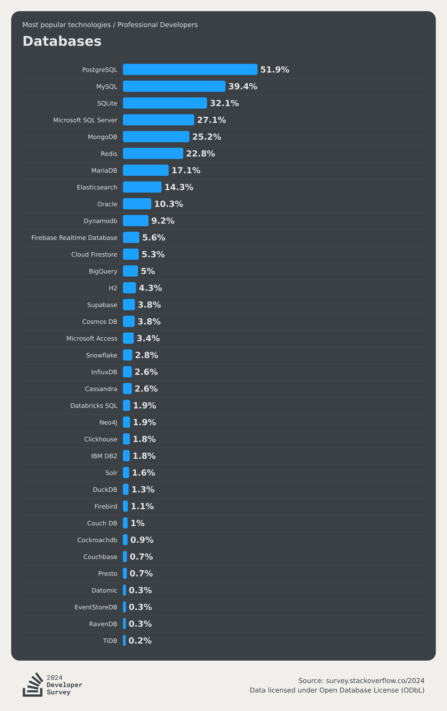
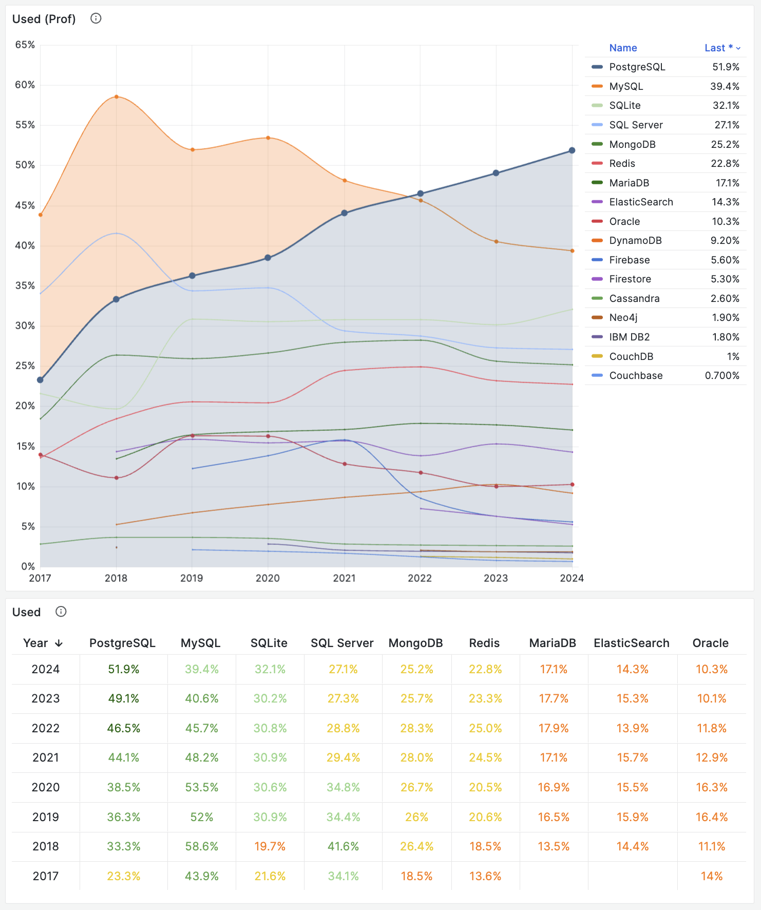
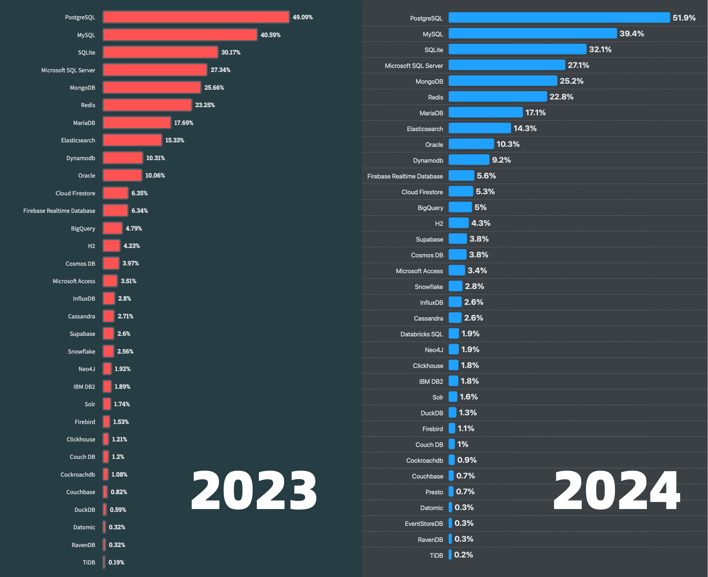
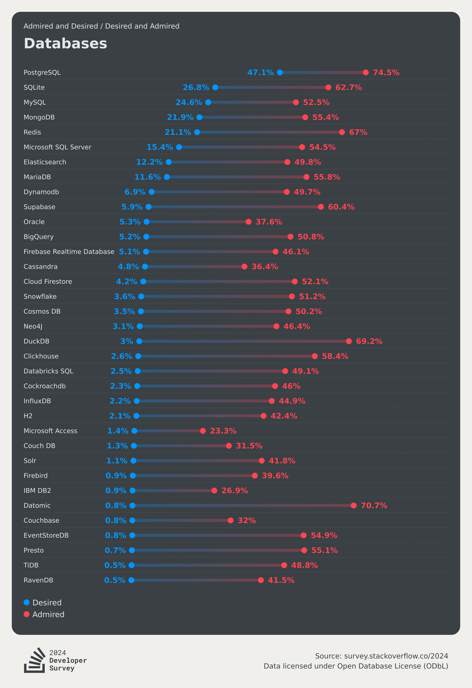
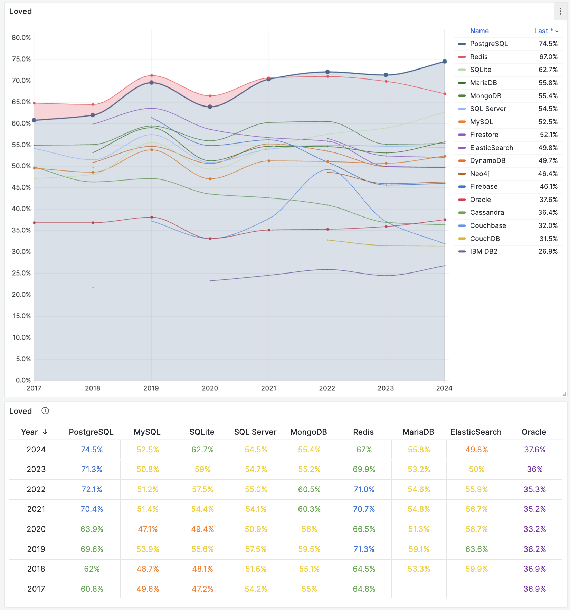
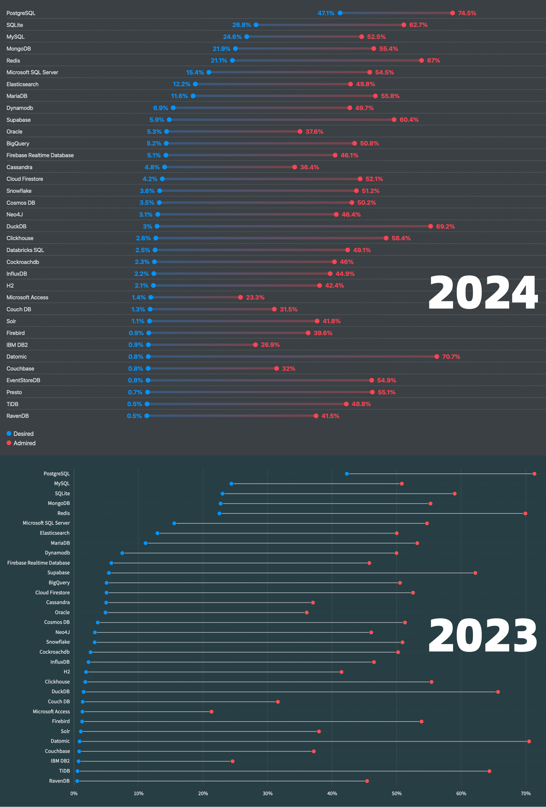
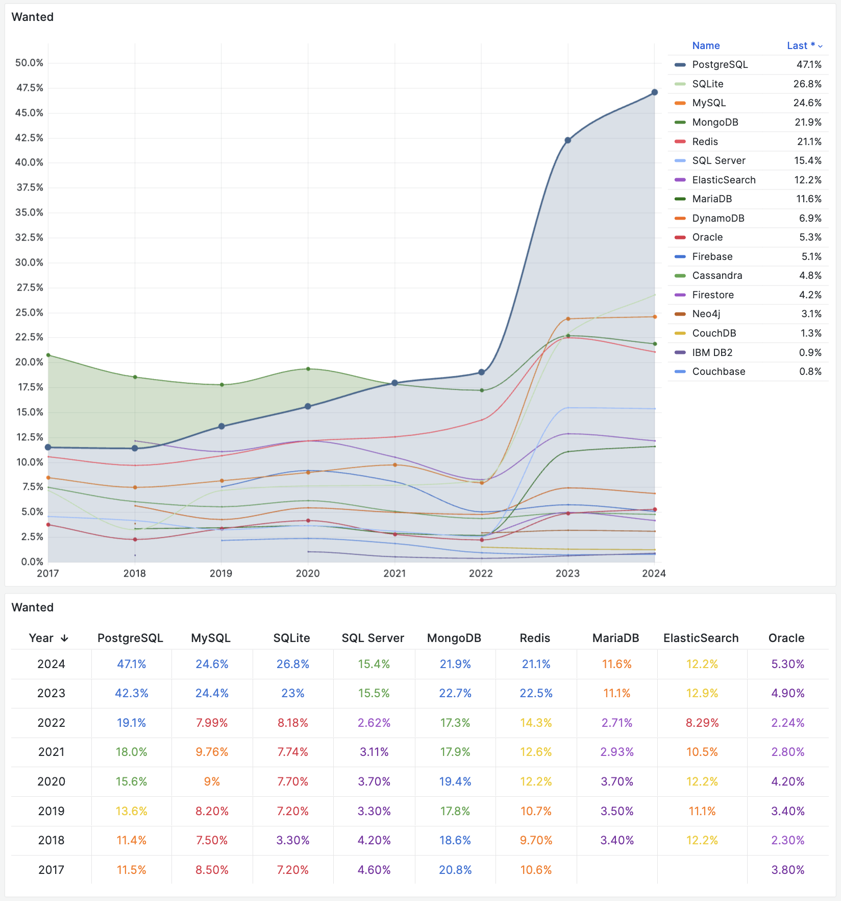

[2024 年 StackOverflow 全球开发者调研结果](https://survey.stackoverflow.co/2024/)已经新鲜出炉，
来自 185 个国家与地区的 6 万名开发者给出了高质量的问卷反馈。当然，作为数据库老司机，我最关注的还是 “Database” 这一项调研结果：

------

## 流行度

首先是数据库流行度：[专业开发者中的数据库使用率](https://survey.stackoverflow.co/2024/technology#1-databases)

一项技术使用者占总体的比例，就是**流行度**。它的含义是：过去一年有多少比例的用户使用了这项技术。流行度代表过去一年的积累使用，是存量指标，也是最核心的事实指标。

在使用率上，PostgreSQL 在专业开发者中以 51.9% 的惊人使用率连续三年蝉联榜首，首次过半！相比第二名的 MySQL (39.4%) 的差距进一步拉开到了 12.5 个百分点（去年这个差距是 8.5 个百分点）。

如果我们考虑全体开发人员的数据库使用情况，那么 PostgreSQL 是第二年成为世界上最流行的数据库，以 48.7% 的使用率拉开第二名 MySQL (40.3%) 8.4 个百分点（去年为 4.5 个百分点）

如果我们综合过去八年的问卷数据调查结果，将流行度画在一张散点图上，不难看出 PostgreSQL 几乎一直保持着高速线性增长。

在这个榜单上，有显著增长的数据库除了 PostgreSQL 还有 SQLite，DuckDB，Supabase，BigQuery，Snowflake，Databricks SQL。
这里面，BigQuery，Snowflake，以及 Databricks 属于大数据分析领域的当红炸子鸡。SQLite 和 DuckDB 属于独特的，不与关系型数据库冲突的嵌入式数据库生态位，Supabase 则是封装 PostgreSQL 作为底层核心的后端开发平台。 

而其他的的数据库，或多或少都受到了 PostgreSQL 崛起带来的冲击。

------

## 喜爱度与需求度

其次是数据库的喜爱度（红色）与需求度（蓝色）：[全体开发者在过去一年最喜爱与最想要使用的数据库](https://survey.stackoverflow.co/2024/technology#2-databases)，按需求度排序。

------

所谓“**口碑**”（红点），喜爱度（Loved）或欣赏度（Admired），指的是有多少比例的用户愿意继续使用此项技术，这是一个年度的“留存率”指标，可以反映用户对一项技术的看法与评价，代表了未来的增长空间。

在口碑上，PostgreSQL 依然以 74.5% 的喜爱比例第二年蝉联榜首，这里特别值得注意的是两个数据库，在过去一年中，SQLite 与 DuckDB 的喜爱度出现显著上涨，而 TiDB 的喜爱度则出现了惊人的下滑（64.33 到 48.8）。

------

而需求者占总体的比例，就是需求率（Wanted），或渴望度（Desired），在上图中用红点表示。它的含义是，接下来一年有多少比例的用户会实际选择使用此项技术，代表了未来一年的实际增长动能。因此在 SO 这张图上，也是按照需求度来排序的。

在这一项上，PostgreSQL 是第三年蝉联榜首了，而且以惊人的优势与后来者拉开距离。也许是最近两年因为受到向量数据库需求的拉动，PostgreSQL 的需求量出现了一个非常惊人的激增，从 2022 年的 19% 飙升至 2024 年的 47%。而 MySQL 的需求度，则甚至被 SQLite 反超，从2023年的第二名跌落至第三。

需求量较为精确地反应着明年的增量（用户显式回答：“下一年中我计划使用此种数据库”），因此这里突增的需求度会很快反应到明年的流行度上来。

-------

## 小结

PostgreSQL 已经连续第二年以无可争议的碾压性优势，成为了全世界最流行，最受喜爱，需求量最高的数据库。

并且根据过去八年的趋势，以及未来一年的需求预测来看，已经没有其他力量能够撼动这一点。

曾经是 PostgreSQL 最大竞争对手的 MySQL 已然颓势尽显，而其他数据库也都在不同程度上受到了 PostgreSQL 的冲击。
能继续保持增长的数据库要么与 PostgreSQL 错开了生态位，要么干脆就是改头换面或者协议兼容的 PostgreSQL。

PostgreSQL 将成为数据库世界的 Linux 内核，而 PostgreSQL 世界的发行版内战即将拉开序幕。
