2023 年 StackOverflow 调研结果已经新鲜出炉，来自185个国家与地区的9万名开发者给出了高质量的反馈。
在今年的调研中，PostgreSQL 在数据库全部三项调研指标（流行度，喜爱度，需求度）上获得无可争议的全能冠军，成为真正意义上“最成功”的数据库 —— **"PostgreSQL is the Linux of Database!"**

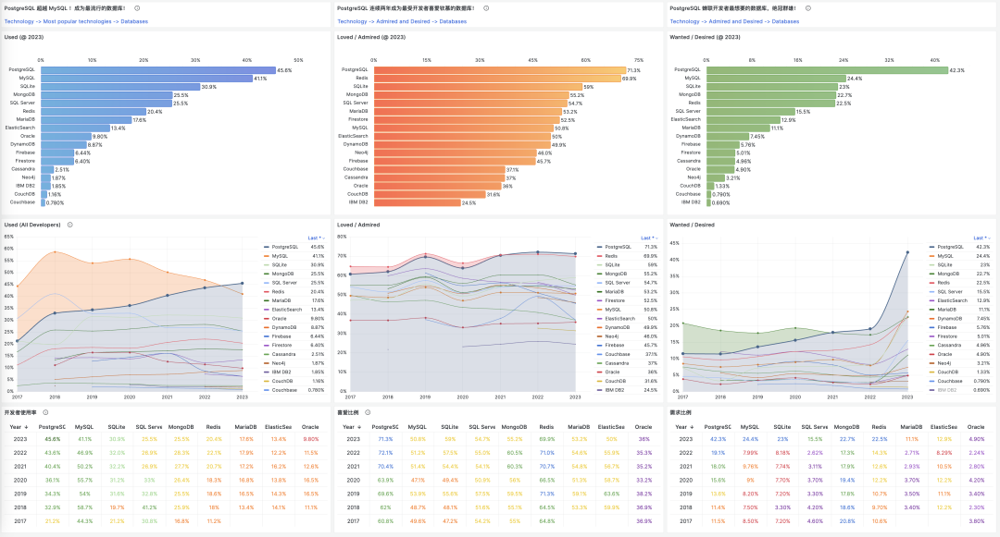

> https://demo.pigsty.cc/d/sf-db-survey

当我们说一个数据库“成功”时，究竟在说什么？评价一个数据库有许多标准：功能、质量、安全、性能、成本，但没有哪种可以普世泛用。不过 
**Succeed** 既代表成功，又代表继承，所以成功与“后继有人”相通。对一项技术而言，用户的**规模** 、喜好、需求决定了生态的繁荣程度，唯有这种最终存在意义上的神意裁决 —— 才能让所有人心服口服。
而连续进行七年的 StackOverflow 年度开发者调研为我们窥见技术发展流行趋势打开了一扇窗户。

**PostgreSQL现在是全世界最流行的数据库**

**PostgreSQL是开发者最喜爱欣赏的数据库！**

**PostgreSQL是用户需求最为强烈的数据库！**

流行度代表过去，喜爱度代表现在，需求度代表将来，这三个指标很好地反映了一项技术的生命力。存量与增量，时与势都站在 PostgreSQL 一侧，恐怕在几年内恐怕都不会有任何能挑战 PostgreSQL 地位的竞争对手。
作为 PostgreSQL 忠实的用户，社区成员，专家，布道师与贡献者，从拥抱 PostgreSQL的那一刻起，我就相信会有这一天，然而亲自见证这一刻，仍然让我感慨良多。遂撰此文，聊一聊这件事背后的 **Why** 与 **What**。

推荐阅读：StackOverflow 2022 往期调研结果回顾：《[为什么PostgreSQL将成为最成功的数据库？](/pg/pg-is-no1/)》

------

## 数据的来源：社区调研

数据库的用户是开发者，而没有比直接问开发者们更有代表性的调研方式了。StackOverflow 调研结果中提供了 流行，欣赏，渴望三个结果指标，但这三项数据都来自同一个巧妙设计的问卷题目：

> “在过去一年中，您在哪些数据库环境中进行了密集的开发工作，您又希望在接下来一年在哪些数据库上工作？如果你过去一年用了这个数据库，来年还希望接着用，那么就在两个复选框上都打勾”。
>
> “Which **database environments** have you done extensive development work in over the past year, and which do you want to work in over the next year? If you both worked with the database and want to continue to do so, please check both boxes in that row.”

每个数据库后都有两个复选框，如果开发者在第一个框上打勾，即去年我在用此数据库，那么就会被标记为“使用者”（Used）；
如果开发者在第二个框上打勾，即来年我想用这个数据库，那么会被标记为“需求者”（Wanted）；而两个框都打勾的开发者，会被标记为“赞赏者”（Loved / Admired）。

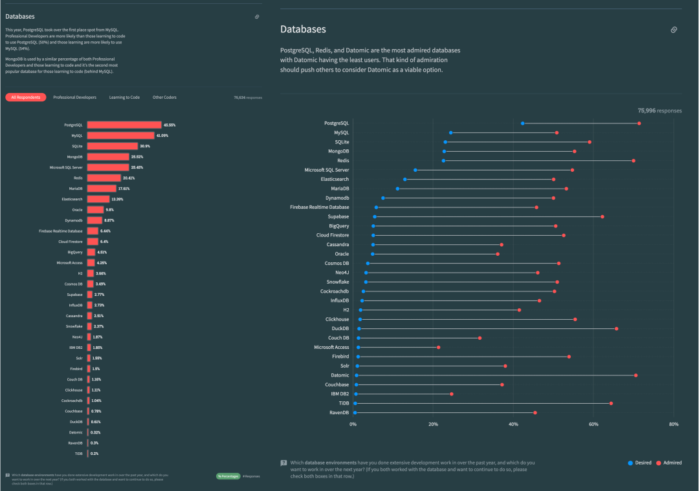

> https://survey.stackoverflow.co/2023

使用者占总体的比例，就是**流行度**，或使用率，在上图左边用**柱状图**表示。需求者占总体的比例，就是**需求度**，或渴望度，在上图右边以**蓝点**表示。
赞赏者占现有使用者的比例，就是**欣赏度**，或喜爱度/口碑，在上图右边以**红点**表示。不难看出，2023年，PostgreSQL 在流行度上甩开 MySQL，成为世界上最流行的数据库。在需求度和口碑上更是远远甩开其他数据库独树一帜。

同样的问题连续问了七年，如果我们结合这过去七年的变迁，把排名前10的主流数据库流行度 - 净喜爱度画在一张二维散点图上，那么就能更容易地获得一些关于数据库领域的发展变迁的洞察，对形成正确的**比例感**很有帮助。

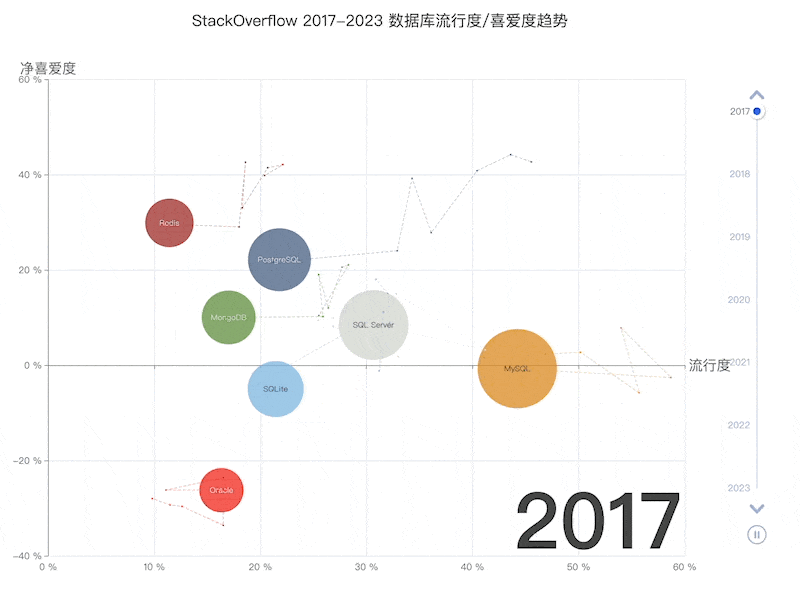

> X轴为流行度，Y轴为净喜爱程度（2*喜爱度% - 100），图元大小与流行度与喜爱度的几何平均数成正比。

在 2023年的当下切面中，四个角落被四种数据库占据：右上角是最为流行且最受欢迎的 **PostgreSQL**，右下角是流行但不受待见的 **MySQL**；
左上角是流行程度一般但备受喜爱的 **Redis**，左下角是过气且不受待见的 **Oracle**。在四者中间，坐落着相对中庸的 **SQLite**，**MongoDB** 与 **SQL Server**。

结合时间轴不难看出，PostgreSQL 的流行程度与受欢迎程度在持续增长；MySQL 的受欢迎程度变化不大但流行度暴跌；
Redis 与 SQLite 整体上在进步，而 MongoDB 开始见顶回落，SQL Server 和 Oracle 这两种商业关系型数据库最近几年都在持续走下坡路。

从图中我们可以得出一个基本的判断：**在未来几年中，数据库领域都不会出现足以挑战 PostgreSQL 的对手。PostgreSQL 在数据库领域的地位，已经如同 Linux 在服务器操作系统上的地位一样难以撼动**。

------

## 过去的积累：流行度

> PostgreSQL —— 世界上最流行的数据库

一项技术使用者占总体的比例，就是**流行度**。它的含义是：过去一年有多少比例的用户使用了这项技术。流行度代表过去一年的积累使用，是存量指标，也是最核心的事实指标。

在 2023 年， “**最先进**” PostgreSQL 在所有开发者中以 45.6% 的使用率，首次超过“**最流行**”数据库 MySQL 41.1%，领先 4.5%，使用率是第二名 MySQL 的1.1倍。
对于专业开发者（约占总样本的3/4）来说，PostgreSQL 的使用率在去年（2022）就已经超过 MySQL 了，以 46.5% vs 45.7% 领先0.8个百分点；
在 2023 年，这一差距进一步拉大到 49.1% vs 40.6，领先 8.5% —— 换句话说，专业开发者中，PostgreSQL 的使用率已经是 MySQL 的 1.2 倍了。

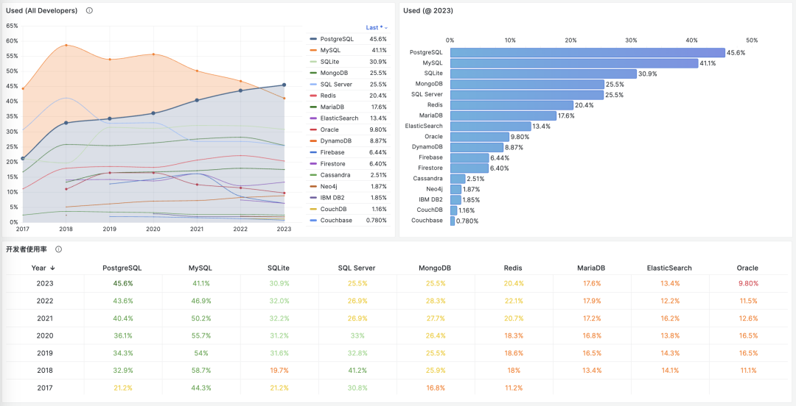

过去几年，MySQL 一直霸占着数据库流行榜的榜首，洋洋得意地打起了“世界上**最流行**的开源关系型数据库” 这一旗号。
不过这次，“最流行” 的桂冠真的要让给 PostgreSQL 了。在流行度上，其他数据库和 PostgreSQL / MySQL 比根本就不是一个重量级，自然就更不用说了。

更重要的的是变化趋势：在长期列入排名的十几款头部数据库中，**只有** PostgreSQL 的流行度是持续上升的，保持着高歌猛进的增长势头，而其他所有的数据库使用率都在下行。
此消彼长，随着时间的推移，PostgreSQL 与其他数据库的流行度差距只会进一步拉大 —— 因此在相当长的一段时间内，恐怕是看不到有任何挑战者能撼动 PostgreSQL 现在的位置了。

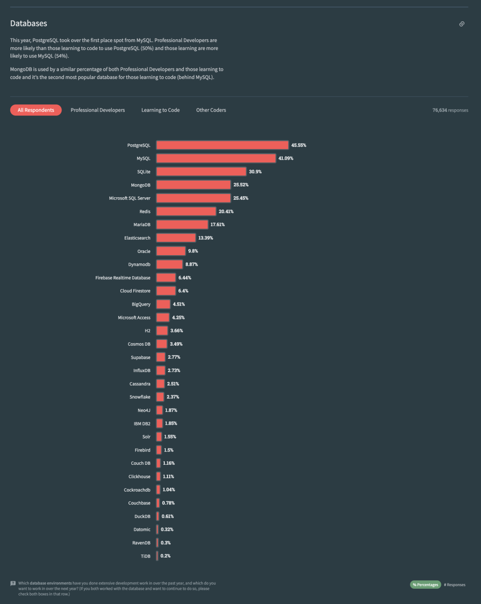

> 值得一提的是，“国产数据库”的标杆 ”TiDB“ 这次也加入到 StackOverflow 排行榜中，并以 0.2% 的使用率，拿到了末位第 32 名的名次。

**流行度**反映的是当下数据库的规模势能，而**喜爱度**反映的是未来数据库的增长潜能。

------

## 现在的动能：喜爱度

> PostgreSQL —— 最受开发者喜爱的数据库

所谓“**口碑**”，喜爱度（Loved）或欣赏度（Admired），指的是有多少比例的用户愿意继续使用此项技术，这是一个年度的“留存率”指标，可以反映用户对一项技术的看法与评价。

2023 年， PostgreSQL 蝉联最受开发者喜爱的数据库。过去几年 Redis 一直是用户最喜欢的数据库。直到 2022 年，PostgreSQL 第一次超过 Redis，成为最受开发者喜爱的数据库。
PostgreSQL 和 Redis 的口碑一直在伯仲之间（70%），并与其他后来者拉开了非常显著的差距。

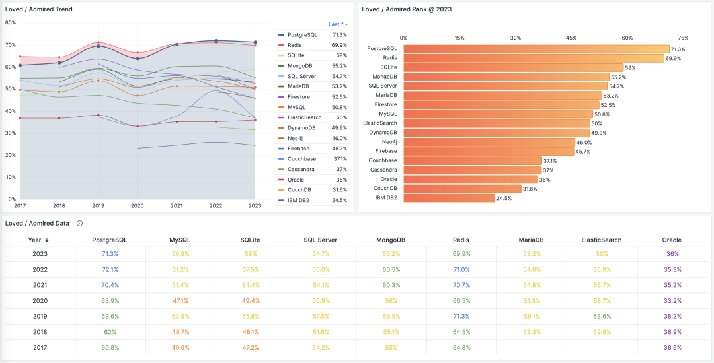

作为一个交叉印证，在 2022 PostgreSQL 社区年度调研中，对于 PostgreSQL 的存量用户来说，使用程度加深，用量加大的比例（蓝/粉）对于用量萎缩的比例（黄绿）占据了压倒性多数，足以说明基本盘留存的稳定程度。

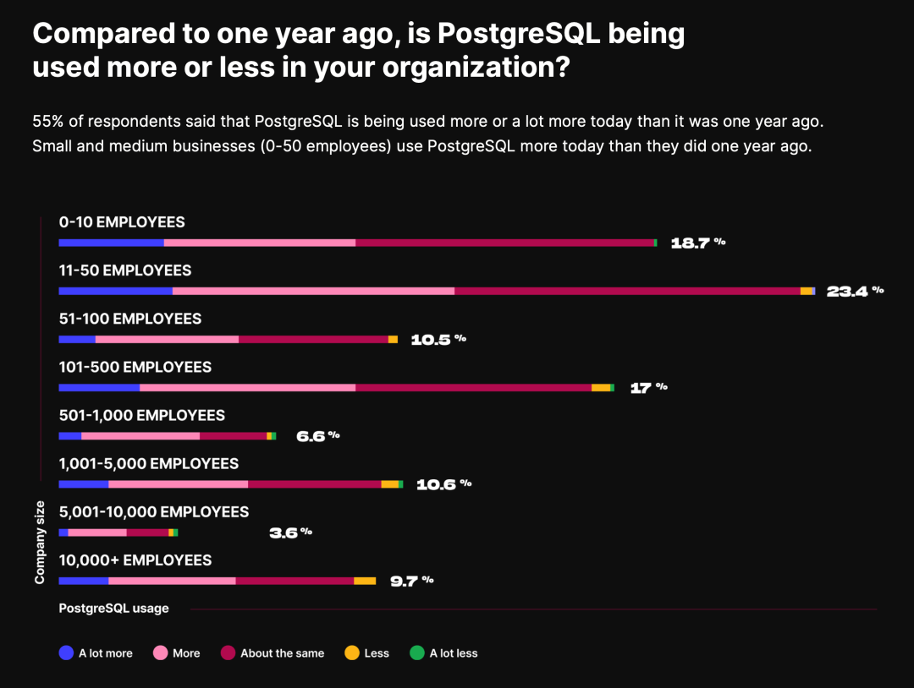

Redis是简单易用的数据结构缓存服务器，经常会与关系型数据库 PostgreSQL 搭配使用，广受开发者喜爱（但流行度一般，只有20%，位列第六）。
在后面的交叉分析环节我们也可以看到这两者之间有着所有数据库间最为强烈的羁绊 —— 86% 的 Redis 用户想要使用 PostgreSQL，而 30% 的 PostgreSQL 用户想要使用 Redis。
其他评价正面的数据库包括：SQLite，MongoDB，SQL Server 等。MySQL 和 ElasticSearch 的口碑在 50% 中线算毁誉参半。榜上最不受用户待见的数据库为 Access、 IBM DB2 、CouchDB，Couchbase，以及 Oracle。

并不是所有**潜能**，都可以转换为实打实的**动能**。用户的喜爱并不一定会付诸行动，而这就是第三项指标所要回答的问题 —— 需求度。

------

## 未来的趋势：需求度

> PostgreSQL —— 需求量最大的数据库

需求者占总体的比例，就是需求率（Wanted），或渴望度（Desired）。它的含义是，接下来一年有多少比例的用户会实际选择使用此项技术。
在需求度 / 渴望度 这一项中，PostgreSQL 一骑绝尘，远远甩开其他数据库。以 42.3% 的比例连续第二年获得第一，且保持着一往无前的增长态势。不断与后来者拉开距离。

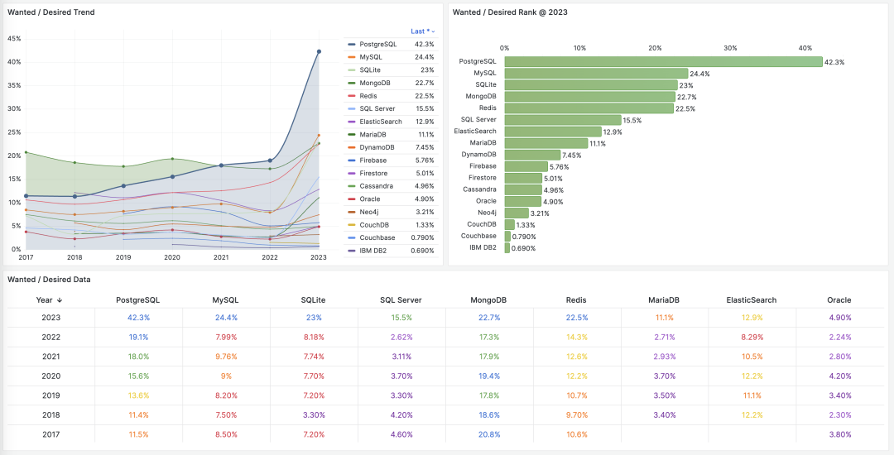

在 2023 年，一些数据库的需求量出现了显著增长。大概率是因为由 OpenAI ChatGPT 所引领的大语言模型AI浪潮所致：对智能的需求拉动了对数据基础设施的需求。
10年前，对 JSONB/GIN 等 NoSQL 特性的支持奠定了 PostgreSQL 在互联网黄金时代的蓬勃发展，而今天，第一个构建在成熟数据库上的向量扩展 pgvector ，更是让 PostgreSQL 有了进入 AI 时代的船票，为下个十年的增长准备好了敲门砖。

------

## 但是，为什么呢？

PostgreSQL 在需求率， 使用率，喜爱率上都拔得头筹，天时地利人和齐备，动能势能潜能都有，足以称得上是最成功的数据库，而且在肉眼可见的几年里也不会有任何挑战者。
但令人好奇的是，**为什么** **PostgreSQL 会如此成功 ？** 其实，秘密就藏在它的 **Slogan** 里：“**世界上最先进的开源关系型数据库**”

关系型数据库是如此的普及与重要，也许其他的数据库品类如键值，文档，搜索引擎，时序，图，向量加起来也比不上它的一个零头。以至于当大家谈起数据库时，如果没有特殊说明，默认隐指的就是”关系型数据库“。在它面前，没有其他数据库品类敢称自己为”主流“。
在去年的《[为什么PostgreSQL将成为最成功的数据库？](/pg/pg-is-best/)》中，我们详细介绍了关系型数据库的竞争格局 —— **三足鼎立**：关系型数据库的生态位高度重叠，其关系可以视作零和博弈。抛开微软生态关门自嗨相对独立的商业数据库
SQL Server 不提，在当下分久必合的收敛阶段中，以 WireProtocol 计能作为“根”的数据库只有三种：Oracle，MySQL，以及PostgreSQL。关系型数据库世界里上演的是一场 **三国演义**。

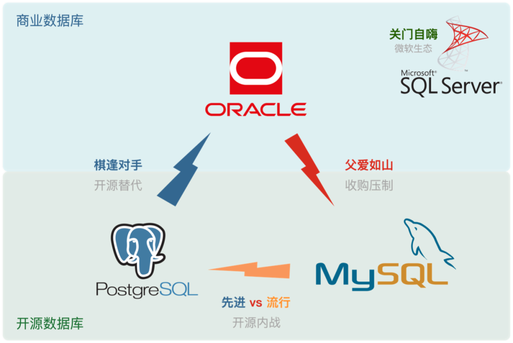

今天下三分，然 Oracle/MySQL 疲敝 ，日薄西山， PostgreSQL 高歌猛进，如日中天。此消彼长，前途无量。

> “**Oracle** 有才无德，**MySQL** 才浅德薄，**PGSQL** 德才兼备”

**Oracle** 是老牌商业数据库，有着深厚的历史技术积淀，功能丰富，支持完善。广受不差钱且需要背锅侠的企业，特别是金融行业喜爱。但其费用高昂，且以讼棍行径成为知名的业界毒瘤。
Microsoft SQL Server 性质与Oracle类似，都属于商业数据库。商业数据库整体受开源数据库冲击，处于缓慢衰退的状态。

**MySQL** 号称“最流行”，然而树大招风：前有狼后有虎，上有野爹下有逆子，处于四面楚歌的境地中：
在严谨的事务处理和数据分析上，MySQL 被同为开源生态位的 PostgreSQL 甩开几条街；而在糙猛快的敏捷方法论上，MySQL 又不如新兴 NoSQL 好用；
上有养父 Oracle 压制，中有兄弟 MariaDB 分家，下有逆子 TiDB/OB 等兼容 NewSQL 分羹，因此也在走下坡路。

**Oracle** 作为老牌商业数据库，才毋庸质疑；但其作为业界毒瘤，“德” ，亦不必多说，故曰：“**有才无德**”。
**MySQL** 虽有开源之功德，奈何认贼作父；且才疏学浅，功能简陋，只能干干CRUD，故曰：“**才浅德薄**”。
唯 **PostgreSQL**，**德才兼备**：既占据了**开源崛起**之天时，又把握了**最为流行**之地利，还有着**先进稳定**之人和。
正所谓：君子藏器于身，因时而动。不鸣则已，一鸣惊人！

------

## 开源与先进

来自 TimescaleDB 的PostgreSQL 社区年度调研也反映出，用户选择 PostgreSQL 的首要因素便是 **开源** 与 **稳定**。
**开源** —— 意味着软件本身可以免费使用，可以二次开发，没有供应商锁定，不存在“卡脖子问题”。 **可靠** ——
意味它能正确稳定工作，行为表现能够符合预期，而且有着长时间大规模生产环境的优异战绩。越是资深的开发者，便越是看重这两个属性。

宽泛地讲，扩展，生态，社区，协议可以归并入 “**开源**” 。而稳定可靠，ACID，SQL，扩展，可用性，可以总结为 “**先进**” 。这便正好与
PostgreSQL 的 Slogan 相呼应 —— **世界上最先进的开源关系型数据库**。

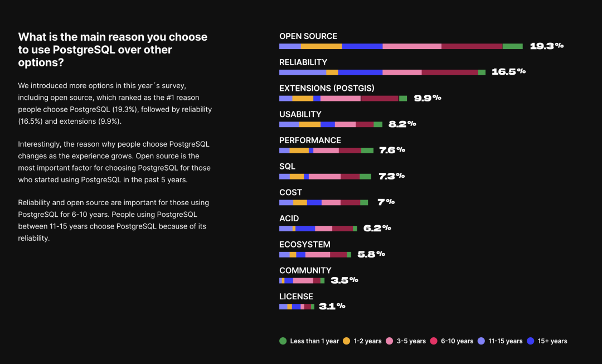

> https://www.timescale.com/state-of-postgres/2022

------

## 开源之德

> **PG的“德”在于开源**。祖师爷级的开源项目，全世界开发者群策群力的伟大成果。协议友善BSD，生态繁荣扩展多。开枝散叶，子孙满堂，Oracle替代扛旗者.

什么叫“德”，合乎于“道”的表现就是德。而这条“道”就是**开源**。PostgreSQL是历史悠久的祖师爷级开源项目，更是全世界开发者群策群力的典范成果。

很久很久以前，开发软件/信息服务需要使用非常昂贵的**商业数据库**软件。单花在软件授权上的费用可能就有六七位数，加之相近的硬件成本与服务订阅成本。Oracle一个
CPU 核一年的软件授权费用便高达十几万，壕如阿里也吃不消要“**去IOE**”。以 **PostgreSQL** / **MySQL** 为代表的的**开源数据库**崛起，让世界多了一个新的选择。

“不要钱” 的开源数据库可以让我们自由随意地使用数据库软件，而这一点引发了行业变革：从上万元每核·每月的商业数据库软件授权，到20块钱/核·月的纯硬件成本。数据库走入了寻常企业中，让免费提供信息服务成为可能。

开源是有大功德的：互联网的历史就是开源软件的历史，IT行业之所以有今天的繁荣，人们能享受到如此多的免费信息服务，核心原因之一就是开源软件。
**开源是一种真正成功的，以软件自由为目的，由开发者构成的 Communism（**社区主义**）**：**软件这种IT业的核心生产资料变为全世界开发者公有，按需分配。开发者各尽所能，人人为我，我为人人。**

一个开源程序员工作时，其劳动背后可能蕴含的是数以万计顶尖开发者的智慧结晶。程序员薪资高从原理上来说是因为，开发者本质上不是一个简单的工人，而是一个指挥软件和硬件干活的
**包工头**。程序员自己就是核心生产资料；软件来自公有社区；服务器硬件更是唾手可得；因此一个或几个高级的软件工程师，就可以很轻松地利用 **开源生态**快速解决领域问题。

**通过开源，所有社区开发者形成合力，极大降低了重复造轮子的内耗。使得整个行业的技术水平以匪夷所思的速度向前迈进。开源的势头就像滚雪球，时至今日已经势不可挡**。 
越是底层基础的软件，开源便越占据主导优势。基本上除了一些特殊场景和路径依赖，软件特别是基础软件中，闭门造车/所谓“自力更生”已经成了业内超级大笑话。

**开源，是 PostgreSQL 对阵 Oracle 的最大底气所在。**

Oracle 先进，但 PostgreSQL 也不差。PostgreSQL 是 Oracle 兼容性最好的开源数据库，原生即支持 Oracle **85%** 的功能，更有 **96%** 功能兼容的专业发行版。
但更重要的是，Oracle 价格高昂，而 PG 开源免费。压倒性的成本优势让 PG 拥有了巨大的生态位基础：它不一定要在功能先进性上超过Oracle 才能成功 ，**廉价9成正确** 已经足以干翻 Oracle 。

PostgreSQL 可以视作一个开源版的“Oracle”，是唯一能真正威胁到 Oracle 的数据库。作为 ”去O“ 抗旗者，PG 可谓子孙满堂，养活了一大批**自主可控** 的国产数据库公司。
根据信通院统计，36% 的 “国产数据库” 直接基于PG “二开/魔改/套壳/换皮”，华为的openGauss 与 GaussDB 就是最典型的例子。
重要的是，PostgreSQL 使用 BSD-Like 的 PostgreSQL 协议，是允许这种行为的 —— 你只要不打着PG的名号招摇撞骗，改个名字直接卖起来都行。这样开放的胸襟，是被Oracle收购的，使用GPL协议的 MySQL 所难以比拟的。

------

## 先进之才

> **PG的“才”在于先进**。一专多长，全栈多模：“自主可控自动驾驶时序地理空间AI向量分布式文档图谱全文检索可编程超融合联邦流批一体
> HTAP Serverless 全栈式平台数据库”，单一组件即可覆盖几乎所有数据库需求。

PostgreSQL 不仅仅是传统意义上只能做 OLTP 的单纯 “关系型数据库”，而是一个**多模态数据库**。
对于中小企业来说，基本单一组件便足以覆盖中小型企业绝大多数场景的数据需求：OLTP，OLAP，时序，地理空间GIS，分词与全文检索，JSON/XML文档，NoSQL特性，图，向量，全都能用上。

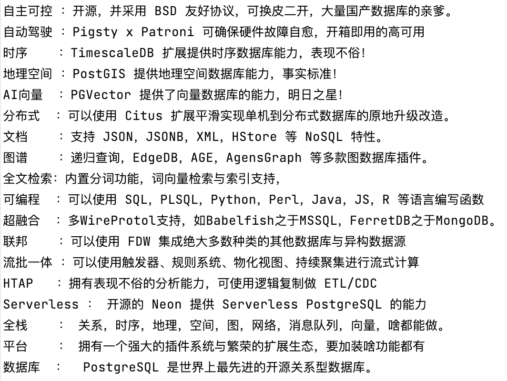

> 皇帝数据库 —— 自主可控自动驾驶时序地理空间AI向量分布式文档图谱全文检索可编程超融合联邦流批一体 HTAP Serverless 全栈式平台数据库

PostgreSQL 的先进，除了体现在其备受赞誉的**内核稳定性**上，更是体现在它强大的**可扩展性**里。
插件系统让 PostgreSQL 不再仅仅是一个单线程演化的数据库内核，而是可以有无数并行演进的扩展插件，如同量子计算一般同时探索所有方向上的可能性。每一个数据处理的细分垂直领域，PostgreSQL 绝不会缺席。

正如：PostGIS 之于地理时空数据库，TimescaleDB 之于时序数据库，Citus 之于分布式/列存储/HTAP数据库，PGVector 之于AI向量数据库，AGE之于图数据库，PipelineDB 之于流处理；
以及终极杀招 —— 使用外部数据源包装器（FDW），使用统一的 SQL 访问所有异构的外部数据库。可以说PG是真正的全栈数据库平台，比起 MySQL 这样单纯的 OLTP 数据库，它的功能要先进太多了。

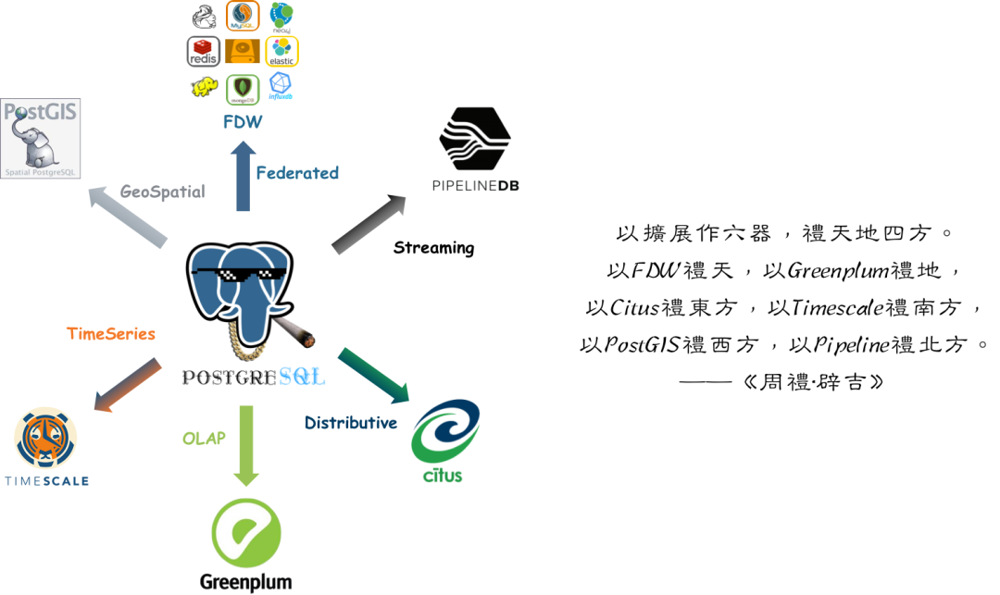

在一个很可观的规模内，PostgreSQL 都可以独立扮演多面手的角色，一个组件当多种组件使。**而单一数据组件选型可以极大地削减项目额外复杂度，这意味着能节省很多成本。它让十个人才能搞定的事，变成一个人就能搞定的事。**
在使用“专用数据库”前切莫忘记：**为了不需要的规模而设计是白费功夫**，这属于**过早优化**的一种形式。如果真有那么一样技术可以满足你所有的需求，那么使用该技术就是最佳选择，而不是试图用多个组件来重新实现它。

以探探为例，在 **250w TPS** 与 **200 TB** 不重复TP数据的量级下，**单一PostgreSQL选型**依然能稳定可靠地撑起业务，并能在很可观的规模内做到一专多长。
除了本职的 OLTP，PG 还在相当长的时间里兼任了缓存，OLAP，批处理，甚至消息队列的角色。当然神龟虽寿，犹有竟时。最终这些兼职功能还是要逐渐**分拆**出去由专用组件负责，但那已经是近**千万日活**时候的事了。

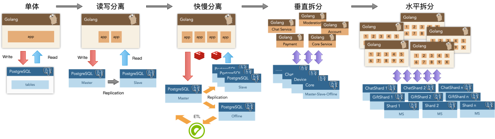

PostgreSQL 的先进，更是体现在其繁荣的生态里。以数据库内核为中心，向上，有着衍生特化的变体与构建于其上的“上层数据库” —— Greenplum数据仓库，Firebase的开源替代 Supabase，专用图数据库 edgedb 等等等等。
向下，有着各种开源/商业/云发行版来整合各种工具形成合力 —— 各家的RDS ，开箱即用的 Pigsty ；水平方向上，甚至还有着一些强大的拟态组件/版本，可以通过兼容 Wire Protocol 的方式来仿真其他数据库，无需修改客户端驱动就能完成数据库迁移
—— 模拟 SQL Server 的 babelfish，模拟 MongoDB 的 FerretDB，兼容 Oracle 的 EnterpriseDB / IvorySQL 都是样例。

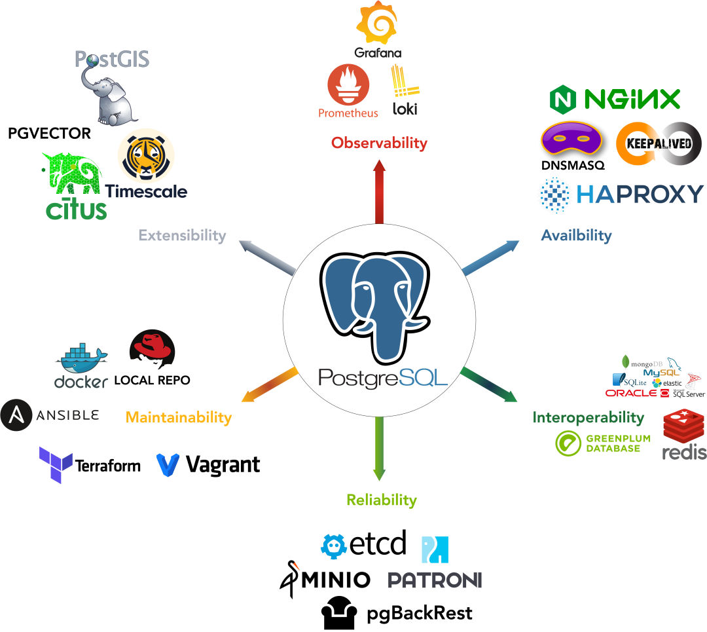

PostgreSQL 的先进性有目共睹，这也是其对阵同为开源关系型数据库的老对手 —— MySQL 时，真正的核心竞争力。

**先进，是 PostgreSQL 压倒 MySQL 的核心竞争力。**

MySQL的口号是“**世界上最流行的开源关系型数据库**”，它的核心特点是糙猛快，基本盘是互联网公司。互联网公司的典型特点是什么？追逐潮流**糙猛快**。
**糙** 说的是互联网公司业务场景简单（CRUD居多）；数据重要性不高，不像传统行业（例如银行）那样在意数据的一致性与正确性；可用性优先，相比停服务更能容忍数据丢乱错，而一些传统行业宁可停止服务也不能让账目出错。
**猛**说的则是互联网行业数据量大，它们需要的就是水泥槽罐车做海量 CRUD，而不是高铁和载人飞船。 
**快** 说的则是互联网行业需求变化多端，出活周期短，要求响应时间快，大量需求的就是开箱即用的软件全家桶（如LAMP）和简单培训就能上手干活的 CRUD Boy。
于是，糙猛快的互联网公司和糙猛快的 MySQL 一拍即合，MySQL吃到了互联网崛起的一波大红利。

然而时来天地皆同力，运去英雄不自由。时过境迁，PostgreSQL 进步神速，在”快“与”猛“上 MySQL 已经不占优，现在只剩下”**糙**“了。

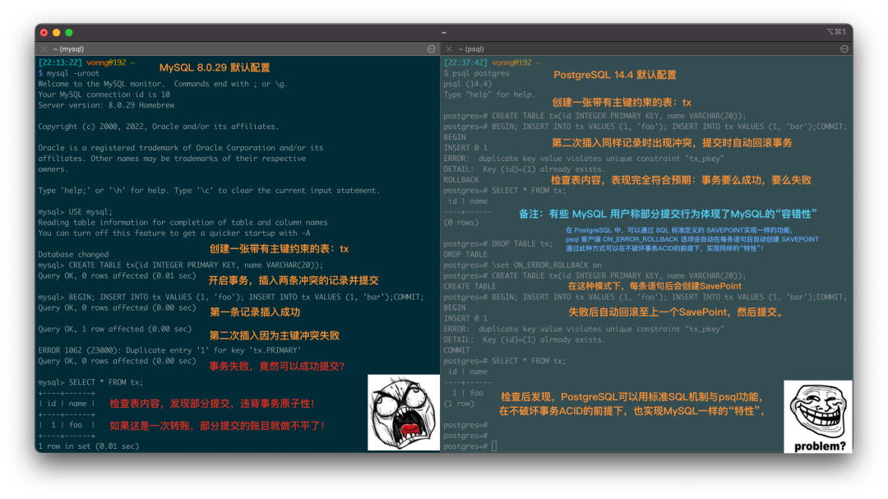

> MySQL竟然默认允许部分成功的事务提交

先进的因会反映为流行的果，流行的东西因为落后而过气，而先进的东西会因为先进变得流行。在这个变革的时代中，没有先进的功能打底，“流行”也也难以长久。时代所赋予的红利，也会随时代过去而退潮。
调查的结果也用事实证明，MySQL 唯一能引以为豪的 “**流行**” 在 PostgreSQL 压倒性的 “**先进**” 优势前，根本维持不住。

**先进**与**开源**，就是 PostgreSQL 成功的最大法宝。**Oracle 先进， MySQL 开源，PostgreSQL 先进又开源**。天时地利人和齐备，何愁大业不成？

--------------

## 展望未来

PostgreSQL 数据库内核在数据库领域的生态位，类似于 Linux 操作系统内核在操作系统领域的生态位。
对于数据库，至少是 OLTP 数据库来说，数据库内核之争已经尘埃落定 —— PostgreSQL 已经是一台足够完美的内核发动机。

然而，用户最终需要的不单单是一台发动机，而是整车、驾驶能力与交通服务。数据库领域竞争的焦点，已经从 Software 本身，转移到了 **Software enabled Service —— 完整的数据库发行版与数据库服务**。
对于基于 PostgreSQL 内核的数据库发行版而言，竞争才刚刚开始。谁会成为PG的Debian，RedHat 与 Ubuntu ？
这便是我们做 **[Pigsty](https://pigsty.cc)** 的初衷 —— 制作一个开箱即用的、开源免费、本地优先的 PostgreSQL 数据库发行版，让所有人都能用**好数据库**， **用好**数据库。
当然，限于篇幅，那就是[另一篇](/db/pgsql-x-pigsty/)要介绍的故事了。

--------------

## 参考阅读

2022-08 《[PostgreSQL 到底有多强？](http://mp.weixin.qq.com/s?__biz=MzU5ODAyNTM5Ng==&mid=2247485240&idx=1&sn=9052f03ae2ef21d9e21037fd7a1fa7fe&chksm=fe4b32e3c93cbbf522616346c1afd49e1e6edbb0898694df224fe2134a69c0c4562aab35587a&scene=21#wechat_redirect)》

2022-07 《[为什么PostgreSQL是最成功的数据库？](http://mp.weixin.qq.com/s?__biz=MzU5ODAyNTM5Ng==&mid=2247485216&idx=1&sn=1b59c7dda5f347145c2f39d2679a274d&chksm=fe4b32fbc93cbbed574358a3bcf127dd2e4f458638b46efaee1a885a5702a66a5d9ca18e3f90&scene=21#wechat_redirect)》

2022-06 《[StackOverflow 2022数据库年度调查](http://mp.weixin.qq.com/s?__biz=MzU5ODAyNTM5Ng==&mid=2247485170&idx=1&sn=657c75be06557df26e4521ce64178f14&chksm=fe4b3329c93cba3f840283c9df0e836e96a410f540e34ac9b1b68ca4d6247d5f31c94e2a41f4&scene=21#wechat_redirect)》

2021-05 《[Why PostgreSQL Rocks!](http://mp.weixin.qq.com/s?__biz=MzU5ODAyNTM5Ng==&mid=2247484604&idx=1&sn=357b3381e7636709fa9e5e06894b7273&chksm=fe4b3167c93cb8719b7c6b048fd300a7773c73319ba0c119359f4f8a6684cd969434c5abbdfd&scene=21#wechat_redirect)》

2021-05 《[为什么说PostgreSQL前途无量？](http://mp.weixin.qq.com/s?__biz=MzU5ODAyNTM5Ng==&mid=2247484591&idx=1&sn=a6ab13d93bfa26fca969ba163b01e1d5&chksm=fe4b3174c93cb862899cbce4b9063ed009bfe735df16bce6b246042e897d494648473eea3cea&scene=21#wechat_redirect)》

2018 《[PostgreSQL 好处都有啥？](http://mp.weixin.qq.com/s?__biz=MzU5ODAyNTM5Ng==&mid=2247483706&idx=1&sn=b842684b41ac6dde8310448ae0a81a76&chksm=fe4b34e1c93cbdf7dcfcdae5f3ddc38bc422989421266dcda957fa2b596e361815624c92b3ec&scene=21#wechat_redirect)》

2023 《[更好的开源RDS替代：Pigsty](http://mp.weixin.qq.com/s?__biz=MzU5ODAyNTM5Ng==&mid=2247485518&idx=1&sn=3d5f3c753facc829b2300a15df50d237&chksm=fe4b3d95c93cb4833b8e80433cff46a893f939154be60a2a24ee96598f96b32271301abfda1f&scene=21#wechat_redirect)》

2023 《[StackOverflow 7年调研数据跟踪](http://demo.pigsty.cc/d/sf-db-survey)》

2022 《[PostgreSQL 社区状态调查报告 2022](https://www.timescale.com/state-of-postgres/2022)》