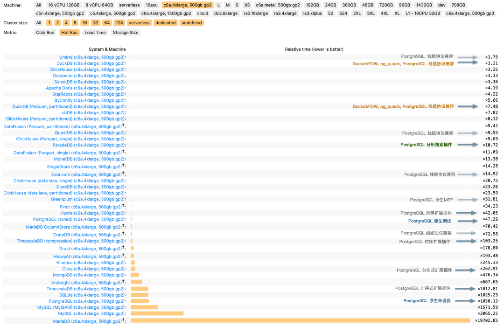
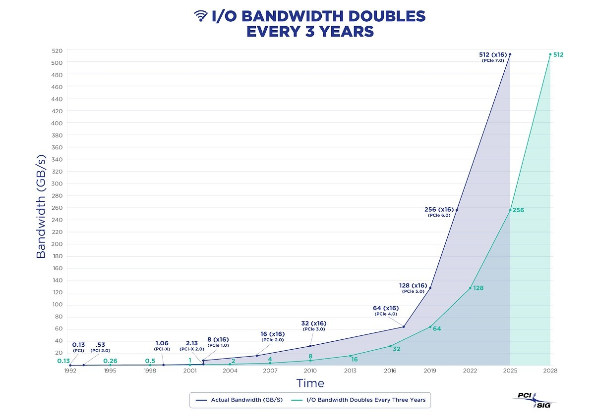

现在我希望你把下面的这篇文章，转换成为一篇口播稿件，必须转换成发音文本对齐的格式，比如 440 个扩展，要转换成“四百四十个扩展”，不能出现数字字符，方便阅读理解。

你必须保持原文的主体内容，只能在语法/句法表达上进行优化，我需要你深入思考，生成流畅，通顺，自然，朗朗上口，有押韵更好的口播版本稿件。

图片什么的可以留下，URL 之类的可以去除，只需要口播文本，预估时间点位。

请你开始，下面是需要转换的文章。

# PostgreSQL 吞噬数据库世界

PostgreSQL 并不是一个简单的关系型数据库，而是一个数据管理的抽象框架，具有吞噬整个数据库世界的力量。
而这也是正在发生的事情 —— “一切皆用 Postgres” 已经不再是少数精英团队的前沿探索，而是成为了一种进入主流视野的最佳实践。

------

## OLAP 领域迎来踢馆者

在 2016 年的一次数据库沙龙里，我提出了一个观点： 现在 PostgreSQL 生态的一个主要遗憾是，缺少一个**足够好** 的列式存储引擎与分析扩展来做 OLAP。
尽管PostgreSQL 本身提供了很强大的分析功能集，应付常规的分析任务绰绰有余。但在较大数据量下全量分析的**性能**，相比专用的实时数仓仍然有些不够看。

以分析领域的权威评测 [**ClickBench**](https://benchmark.clickhouse.com/) 为例，我们在其中标注出了 PostgreSQL 在其中的性能表现。
原生未经过调优的 PostgreSQL 表现较为拉垮（**x1050**），比 ClickHouse 慢了 300 倍。
有一些经典的 PG 扩展，比如 timescaledb，citus，表现稍微好一点，但也比 CK 慢了几十倍左右。

这样的分析性能表现不能说烂，因为比起 MySQL，MariaDB 这样的纯 OLTP 数据库的辣眼表现来说，确实好很多；
但这种第三梯队的性能表现，也绝对说不上足够好，与专注于 OLAP 的第一梯队组件：ClickHouse，DuckDB 相比，
在分析性能上仍然有十几倍的性能差距。鸡肋鸡肋，食之无味，弃之可惜。

**然而，[**DuckDB**](https://duckdb.org/) ** 的出现改变了这一切！**

DuckDB 也许是 OLAP 实战性能最快的数据库了，和 Clickhouse 不相上下，同为版本 T0。
然而与 CK 不同的是，DuckDB 是一个嵌入式文件数据库，
官方出品的 pg_duckdb 扩展，以及 pg_mooncake，pg_lake 这些扩展，直接让 PG 原生的分析性能直接冲进第一梯队的金字塔尖。

虽然比原生的 ClickHouse 仍然慢了两三倍，但这已经足够好了，
而这弥补了 PostgreSQL 在 OLAP 性能这最后一块关键短板。

------

## 分久必合的数据库领域

数据库诞生伊始，并没有 OLTP 与 OLAP 的分野。OLAP 数据仓库从数据库中“独立”出来，已经是上世纪九十年代时候的事了 —— 因为传统的 OLTP 数据库难以支撑起分析场景下的查询模式，数据量与性能要求。

在相当一段时间里，数据处理的最佳实践是使用 MySQL / PG 处理 OLTP 工作负载，并通过 ETL 将数据同步到专用的 OLAP 组件中去处理，比如 Greenplum, ClickHouse, Doris, Snowflake 等等。

> 设计数据密集型应用，Martin Kleppmann，[第三章](http://ddia.vonng.com/#/ch3)

与许多 “专用数据库” 一样，专业的 OLAP 组件的优势往往在于**性能** —— 相比原生 PG 、MySQL 上有 1～3 个数量级的提升；而代价则是数据冗余、 量不必要的数据搬运工作、分布式组件之间缺乏一致性、额外的专业技能带来的复杂度成本、学习成本、以及人力成本、 额外的软件许可费用、极其有限的查询语言能力、可编程性、可扩展性、有限的工具链、以及与OLTP 数据库相比更差的数据完整性和可用性 —— **但这是一个合理的利弊权衡**。

然而天下大势，**分久必合，合久必分**。[硬件遵循摩尔定律又发展了三十年](/cloud/bonus/)，性能翻了几个数量级，成本下降了几个数量级。
在 2026 年的当下，x86 单机可以达到七八百核，6TB的内存，单卡 NVMe SSD 可达 256TB，全闪单机柜可以做到 8个PB；

硬件的发展解决了数据量的问题，而数据库软件的发展（PostgreSQL，ParadeDB，DuckDB）解决了查询模式的问题，而这导致分析领域 —— 所谓的“大数据” 行业基本工作假设面临挑战。

正如 DuckDB 发表的宣言《[**大数据已死**](https://mp.weixin.qq.com/s/gk3BOirM6uCTQ1HFTQz3ew)》所主张的：**大数据时代已经结束了** —— 大多数人并没有那么多的数据，大多数数据也很少被查询。大数据的前沿随着软硬件发展不断后退，99% 的场景已经不再需要所谓“大数据”了。

如果 99% 的场景甚至都可以放在一台计算机上用单机/主从的 PostgreSQL 再加个 DuckDB 分析扩展搞定，那么使用专用的分析组件还有多少意义？如果每台手机都可以自由自主收发短信，那么 BP 机还有什么存在价值？（北美医院还在用BP机，正好比也还有 1% 不到的场景也许真的需要“大数据”）

基本工作假设的变化，将重新推动数据库世界从百花齐放的“合久必分”阶段，走向“分久必合”的阶段，从大爆发到大灭绝，大浪淘沙中，新的大一统超融合数据库将会出现，重新统一 OLTP 与 OLAP。而承担重新整合数据库领域这一使命的会是谁？

------

## 吞食天地的 PostgreSQL

数据库领域有许多“细分领域”：时序数据库，地理空间数据库，文档数据库，搜索数据库，图数据库，向量数据库，消息队列，对象数据库。而 PostgreSQL 在任何一个领域都不会缺席。

一个 PostGIS 插件，成为了地理空间事实标准；一个 TimescaleDB 扩展，让一堆“通用”时序数据库尴尬的说不出话来；
一个向量扩展 [**PGVector**](/pg/llm-and-pgvector/) 插件，更是让整个 [**专用向量数据库细分领域**](/db/svdb-is-dead) 变成笑话。

同样的事情已经发生过很多次，而现在，我们将在拆分最早，地盘最大的一个子领域 OLAP 分析中再次见证这一点。
无数厂商涌入 “DuckDB 缝合大赛”，包括 DuckDB 原厂，甚至连 ClickHouse 都忍不住下场做了个 `pg_clickhouse`。

然而 PostgreSQL 要替代的可不仅仅是 OLAP 数仓，它的野望是整个数据库世界！

我们不禁要问， PostgreSQL 有何德何能，可当此大任？
诚然 PostgreSQL 先进，但 Oracle 也先进；PostgreSQL 开源，但 MySQL 也开源。
PostgreSQL **先进且开源**，这是它与 Oracle / MySQL 竞争的底气，
但要说其独一无二的特点，那还得是它的**极致可扩展性，与繁荣的扩展生态**！

> TimescaleDB 2022 社区调研：用户[选择 PostgreSQL 的原因](/pg/pg-is-best/)：开源，先进，**扩展**。

PostgreSQL 并不是一个简单的关系型数据库，而是一个数据管理的抽象框架，**具有囊括一切，吞噬整个数据库世界的力量**。而它的核心竞争力（除了开源与先进）来自**可扩展性**，即基础设施的**可复用性**与扩展插件的**可组合性**。

------

### 极致可扩展性的魔法

PostgreSQL 允许用户开发功能模块，复用数据库公共基础设施，以最低的成本交付功能。例如，仅有两千行代码的向量数据库扩展 pgvector 与百万行代码的 PostgreSQL 在复杂度上相比可以说微不足道，但正是这“微不足道”的扩展，实现了完整的向量数据类型与索引能力，干翻了几乎所有专用向量数据库。

为什么？因为 PGVECTOR 作者不需要操心数据库的通用额外复杂度：事务 ACID，故障恢复，备份PITR，高可用，访问控制，监控，部署，三方生态工具，客户端驱动这些需要成百上千万行代码才能解决好的问题，只需要关注自己所需问题的本质复杂度即可。

> 向量数据库哪家强？

再比如，ElasticSearch 基于 Lucene 搜索库开发，而 Rust 生态有一个改进版的下一代 Tantivy 全文搜索库作为 Lucene 的替代；而 ParadeDB 只需要将其封装对接到 PostgreSQL 的接口上，即可提供比肩 ElasticSearch 的搜索服务。更重要的是，它可以站在 PostgreSQL 巨人的肩膀上，借用 PG 生态的全部合力（例如，与 PG Vector 做混合检索），不讲武德地用数据库全能王的力量，去与一个专用数据库单品来对比。

> Pigsty 中提供了 [**255**](https://pgext.cloud/zh/list) 个可用扩展插件，在生态中还有 1000+ 扩展

------

可扩展性带来的另一点巨大优势是扩展的**可组合性**，让不同扩展相互合作，产生出 1+1 >> 2 的协同效应。
例如，TimescaleDB 可以与 PostGIS 组合使用，提供时空数据支持；再比如，提供全文检索能力的 BM25 扩展可以和提供语义模糊检索的 PGVector 扩展组合使用，提供混合检索能力。

再比如，**分布式**扩展 Citus 可以将单机主从数据库集群，原地升级改造为透明水平分片的分布式数据库集群。
而这个能力是可以与其他功能正交组合的，因此，PostGIS 可以成为分布式地理数据库，PGVector 可以成为分布式向量数据库，ParadeDB 可以成为分布式全文搜索数据库，诸如此类。

------

更强大的地方在于，扩展插件是**独立演进**的，不需要繁琐的主干合并，联调协作。
因此可以 Scale  —— PG 的可扩展性允许无数个团队并行探索数据库前研发展方向，而扩展全部都是的可选的，不会影响主干核心能力的稳定性。
那些非常强大成熟的特性，则有机会以稳定的形态进入主干中。

通过极致可扩展性的魔法，PostgreSQL 做到了**守正出奇，实现了主干极致稳定性与功能敏捷性的统一。
**扎实的基本盘配上惊人的演进速度，让它成为了数据库世界中的一个异数，改变了数据库世界的游戏规则。

------

## 改变游戏规则的玩家

**PostgreSQL 的出现，改变了数据库领域的游戏规则**：任何试图开发“新数据库内核”的团队，都需要经过这道试炼与考验
—— 相比开源免费、功能齐备的 Postgres，价值点在哪里？

至少到硬件出现革命性突破前，实用的通用数据库新内核都不太可能诞生了，
因为任何单一数据库都无法与所有扩展加持下的 PG 在**整体实力**上相抗衡
—— 包括 Oracle，因为 PG 还有开源免费的必杀技。

而某个细分领域的数据库产品，如果能在单点属性（通常是性能）上相比 PostgreSQL 实现超过一个数量级的优势，
那也许还有一个专用数据库的生态位存在。但通常用不了多久，便会有 PostgreSQL 生态的开源替代扩展插件滚滚而来。
因为选择开发 PG 扩展，而不是一个完整数据库的团队会在追赶复刻速度上有碾压性优势！

因此，如果按照这样的逻辑展开，PostgreSQL 生态的雪球只会越滚越大，随着优势的积累，不可避免地进入一家独大的状态。
在几年的时间内，实现 Linux 内核在服务器操作系统领域的状态。而各种开发者调研报告，数据库流行趋势都在印证着这一点。

> [**StackOverflow 2023 调研结果，PostgreSQL 三项全能王**](https://survey.stackoverflow.co/2023/#section-most-popular-technologies-databases)

> [**StackOverflow过去7年的数据库指标走势**](https://demo.pigsty.cc/d/sf-survey)

在引领潮流的 HackerNews StackOverflow 上，PostgreSQL 早已成为了最受欢迎的数据库。
许多新的开源项目都默认使用 PostgreSQL 作为首要，甚至唯一的数据库，
许多新一代互联网公司都开始积极拥抱并 All in PostgreSQL。
Instagram 用 PG，Notion 用 PG，OpenAI 这样的独角兽巨无霸也 All in PG。

正如《[**技术极简主义：一切皆用 Postgres**](/pg/just-use-pg/) 》所言：
简化技术栈、减少组件、加快开发速度、降低风险并提供更多功能特性的方法之 一 就是 **“一切皆用 Postgres”**。
Postgres 能够取代许多后端技术，包括 MySQL，Kafka、RabbitMQ、ElasticSearch，Mongo和 Redis，至少到数百万用户时都毫无问题。
**一切皆用 Postgres** ，已经不再是少数精英团队的前沿探索，而是成为了一种进入主流视野的最佳实践。

------

## 还有什么可以做的？

我们已经不难预见到数据库领域的终局。但我们又能做什么，又应该做什么呢？

PostgreSQL 对于绝大多数场景都已经是一个足够完美的数据库内核了，在这个前提下，数据库内核 [卡脖子纯属无稽之谈](/db/db-choke/)。
这些Fork PostgreSQL 和 MySQL 并以内核魔改作为卖点的所谓“[数据库](/db/db-choke/)”基本没啥出息。

这好比今天我们看 Linux 操作系统内核一样，尽管市面上有这么多的 Linux 操作系统发行版，
但大家都选择使用同样的 Linux 内核，吃饱了撑着魔改内核属于没有困难创造困难也要上，会被业界当成山炮看待。

同理，数据库内核本身已经不再是主要矛盾，焦点将会集中到两个方向上 —— 数据库**扩展**与数据库**服务**！
前者体现为数据库内部的可扩展性， 后者体现为数据库外部的可组合性。而竞争的形式，正如操作系统生态一样 —— 
集中于**数据库发行版**上。对于数据库领域来说，只有那些以扩展和服务作为核心价值主张的发行版，才有最终成功的可能。

做内核的厂商不温不火，MariaDB 作为 MySQL 的亲爹 Fork 甚至都已经濒临退市，Oracle 开掉了 MySQL 的研发团队只留下一些 Heatweave 的人；而白嫖内核自己做服务与扩展卖 RDS 的 AWS 可以赚的钵满盆翻。
投资机构已经出手了许多 PG 生态的扩展插件与服务发行版：Citus，TimescaleDB，Hydra，PostgresML，ParadeDB，FerretDB，StackGres，Aiven，Neon，Supabase，Tembo，PostgresAI，以及我们正在做的 Pigsty 。

------

PostgreSQL 生态中的一个困境就是，许多扩展插件，生态工具都是独立演进，各自为战的，没有一个整合者能将他们凝聚起来形成合力。
例如，提供分析的 pg_duckdb 会打一个包一个 Docker 镜像， pgvector 也会打自己的包和镜像，
各家只发行加装了自己扩展的 Postgres 镜像。而这些朴素的镜像与包也距离 RDS 这样完整的数据库服务相距甚远。

即使是类似于 AWS RDS 这样的服务提供商与生态整合者，在诸多扩展面前也依然力有所不逮，只能提供其中的少数。
更多的强力扩展出于各种原因（AGPLv3 协议，多租户租赁带来的安全挑战）而无法使用。从而难以发挥 PostgreSQL 生态扩展的协同增幅作用。

扩展是 PostgreSQL 的灵魂，无法自由使用扩展的 Postgres 就像做菜不放盐。
只能和 MySQL 放在同一个 RDS 的框子里同台，龙游浅水，虎落平阳。

而这正是我们想要解决的首要问题之一。

------

## 知行合一的实践：Pigsty

虽然接触 MySQL 和 MSSQL 要早得多，但我在 2015 年第一次上手 PostgreSQL 时，就相信它会是数据库领域的未来了。
快十年过去，我也从 PG 的使用者，管理者，变为了贡献者，开发者。也不断见证着 PG 走向这一目标。

在与形形色色的用户沟通交流中，我早已发现数据库领域的木桶短板不是内核 —— 
现有的 PostgreSQL 已经足够好了，而是**用好数据库内核本身的能力**，这也是 RDS 这样的服务赚的钵满盆翻的原因。

但我希望这样的能力，应该像自由软件运动所倡导的理念那样，像 PostgreSQL 内核本身一样 —— 
普及到每一个用户手中，而不是必须向赛博空间上的封建云领主花大价钱租赁。

所以我打造了 **[Pigsty](https://pigsty.cc)** —— 一个开箱即用的开源 PostgreSQL 数据库发行版，
旨在凝聚 PostgreSQL 生态扩展的合力，并把提供优质数据库服务的能力普及到每个用户手中。

> Pigsty 是 **P**ostgreSQL **i**n **G**reat **STY**le 的缩写，意为 **PostgreSQL 的全盛状态**。

我们提出了六点核心价值主张，对应 PostgreSQL 数据库服务中的的六个核心问题：
**Postgres 的可扩展性**，**基础设施的可靠性**，**图形化的可观测性**，**服务的可用性**，**工具的可维护性**，以及**扩展模块和三方组件可组合性**。

Pigsty 六点价值主张的首字母合起来，则为 Pigsty 提供了另外一种缩写解释：

> **P**ostgres, **I**nfras, **G**raphics, **S**ervice, **T**oolbox, **Y**ours.
>
> 属于你的图形化 Postgres 基础设施服务工具箱。

**可扩展的 PostgreSQL** 是这个发行版中最重要的价值主张。在即将发布的 [**Pigsty 4.0**](https://pigsty.cc) 中，我们整合了上面提到的所有这些扩展，
整整四百四十个开箱即用的扩展，为六个PG大版本与14种Linux平台而构建，开箱即用。真正做到让 PG 进入全盛状态。并确保每个用户都能轻松用得上这样的能力。

更重要的是，我们不再局限于原生 PG 内核 —— 而是提供了十种开箱即用的 PostgreSQL 内核分支：
前后端一条龙的 Supabase 与 OrioleDB 内核，支持透明加密的 Percona PG TDE 内核，MySQL 兼容/ SQL Server 兼容 / Oracle 兼容/ Mongo 兼容的内核，
存算分离的 PolarDB，分布式的 Citus。让每一种内核都拥有完整的高可用，备份恢复，监控与 IAC 等企业级能力 —— 让用户可以根据场景自由选择最适合的内核。

我们希望整合 PostgreSQL 生态里的各种力量，并将其凝聚在一起形成合力，打造一个数据库世界中的 **Ubuntu** 发行版。
而我相信，内核之争早已尘埃落定，而这里才会是数据库世界的未来竞争焦点。

开发者朋友们，你们的选择会塑造数据库世界的未来。
希望我的这些工作，可以帮助你们更好的用好这世界上最先进的开源数据库内核 —— PostgreSQL。
