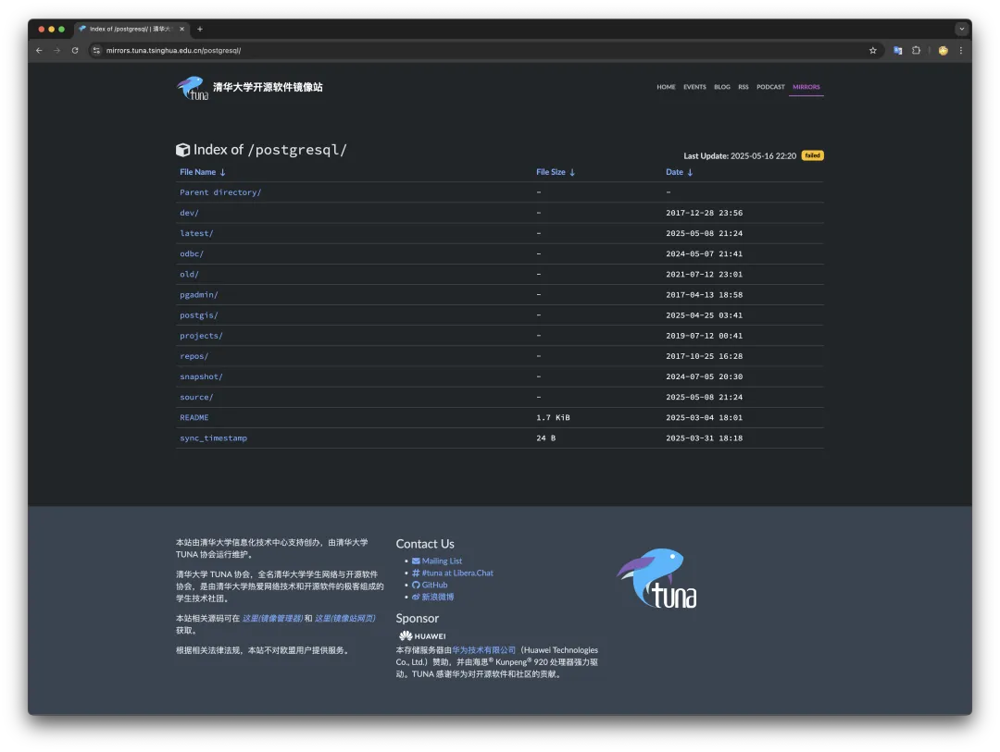
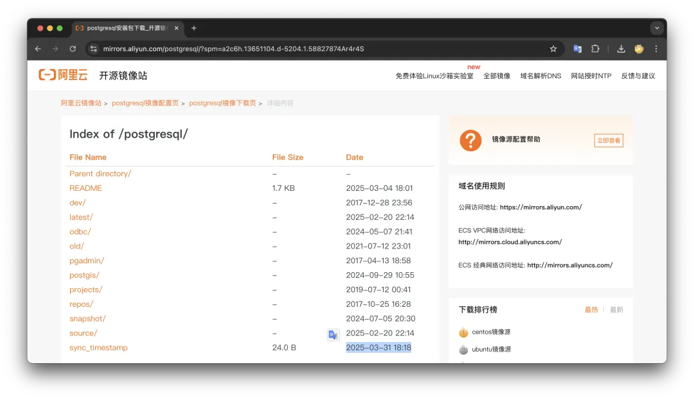
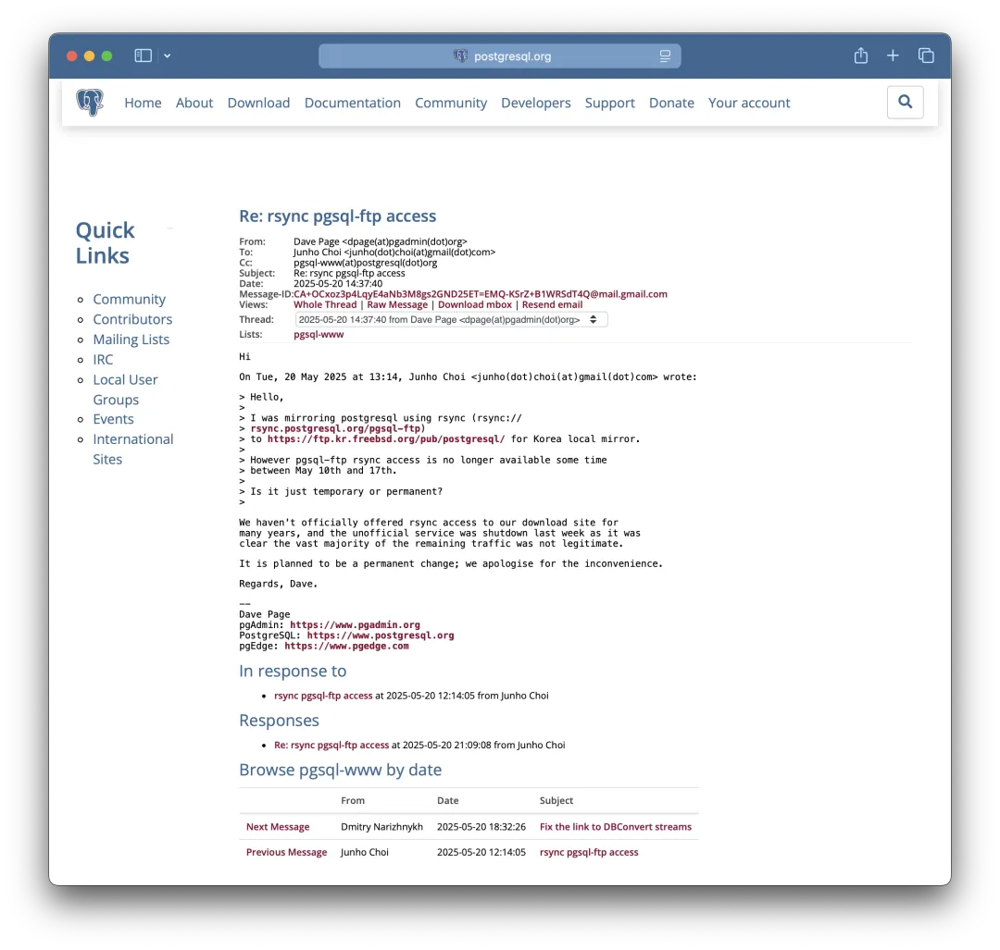
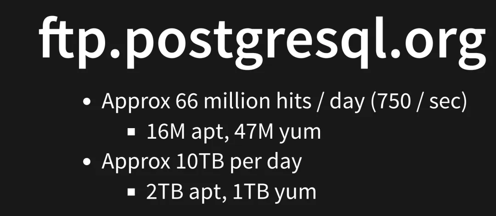
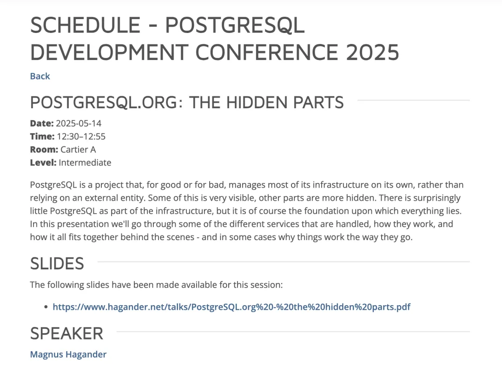
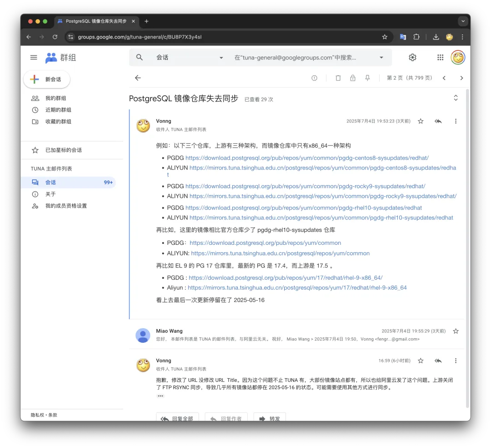

Recently, while building Pigsty offline packages, I discovered that the PostgreSQL version installed during local testing wasn't quite right - 17.4 was behind the latest 17.5 by one minor version. Also, when testing on EL10, 
I found several repositories were throwing errors. Strangely, using the global default repository in Hong Kong worked fine, but once using Chinese mirror sites locally, errors occurred.

Upon closer inspection, I found that domestic mirror sites had all lost synchronization with the PostgreSQL upstream repository: Tsinghua University Open-Source Software Mirror Site (TUNA) last successful sync was May 16th, 
while Alibaba-Cloud Mirror Site's last sync timestamp was March 31, 2025. Foreign mirror sites like mirrors.xtom.de also had this problem, with last sync on June 20th, though you could clearly see signs of manual updates and disconnection from sync.

I searched and found that on May 20th in the PostgreSQL mailing list, a Korean mirror site maintainer had already asked about this issue - the mirror site maintainer asked why rsync synchronization with PGDG official repository suddenly broke?

PostgreSQL contributor Dave Page replied that due to massive amounts of illegal traffic flooding in, they decided to permanently shut down the previously unofficial FTP server, no longer providing rsync sync options, only allowing HTTP access.

> [Re: rsync pgsql-ftp access](https://www.postgresql.org/message-id/CA%2BOCxoz3p4LqyE4aNb3M8gs2GND25ET%3DEMQ-KSrZ%2BB1WRSdT4Q%40mail.gmail.com)

PostgreSQL, as the world's most popular database software, has the vast majority of users downloading and installing pre-built binary software packages through PGDG official repositories rather than compiling from source. 
This repository is hosted on just two physical machines - according to PostgreSQL Infra Team statistics, roughly 66 million requests per day (about 750 downloads per second), about 10TB of data transfer daily.

> https://www.pgevents.ca/events/pgconfdev2025/schedule/session/385-designing-and-implementing-a-monitoring-feature-in-postgresql/

This decision was made on the last day of PGConf.Dev 2025, and they even had a presentation saying they originally had four servers, now down to two, with a CDN in front.
Then seeing this traffic was too much to handle, they just cut off rsync/ftp, and all downstream PostgreSQL repositories worldwide went dark.
Honestly, I think this is quite ridiculous - if you block all these mirror sites, when users flood directly to the original upstream, won't the traffic be even greater?

But honestly, you can't really blame them for anything, because this is just open source STYLE - no warranty - after all, they're not charging money, developers have no obligation to keep doing charity.
But from another perspective, **this really strangled global users' supply chain**: for example, if users using mirror sites can't timely update to 17.5 which fixes CVE vulnerabilities.

I've already reported this issue to Alibaba-Cloud Mirror and Tsinghua TUNA Mirror maintainers to see if it can be fixed recently. For example, using HTTP to pull updates. 
If it can't be resolved in the short term, I'm prepared to pull down part of the PGDG repository myself and put it on Cloudflare to make a mirror site first.

From a supply chain security perspective, forking and modifying a PG kernel indeed has no real use. 
But maintaining a self-controlled software binary product repository has critical significance for operational autonomy and control.

I've also been thinking about setting up a mirror site domestically myself, since I've already set up a Pigsty APT/YUM repository, adding PG wouldn't be a big deal. 
But actually Alibaba-Cloud and TUNA have been doing quite well before, so I've always used these two as default configurations for domestic users.

As for the long term, actually I could recompile and package a dedicated PostgreSQL repository, especially since I've recently packaged several PG branch kernels, plus over 250 extensions in the PG ecosystem not included by PGDG. 
I'm already a veteran packager when it comes to building APT/YUM repositories. However, the main issue is maintenance takes too much time, and domestic traffic costs are also too expensive. 
But if there's a sponsor willing to support unlimited traffic high-bandwidth servers, I'd be happy to do some extra volunteer work.