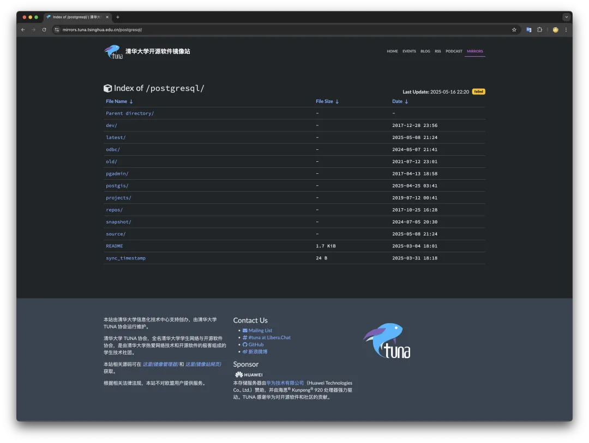
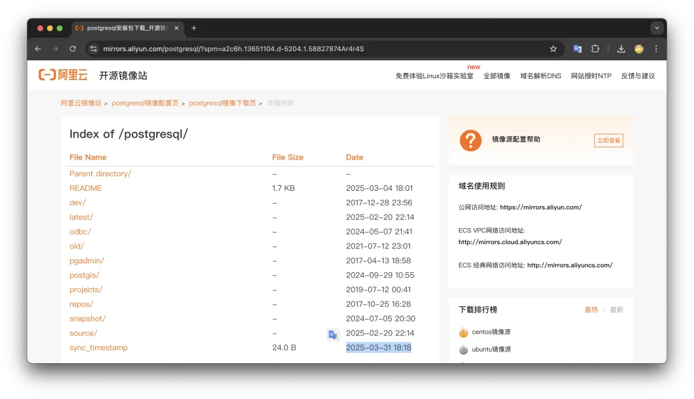
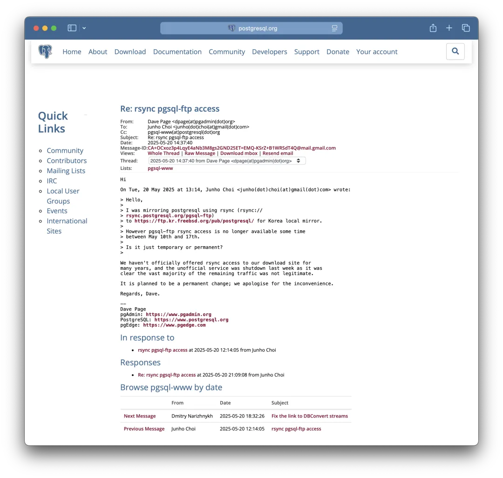
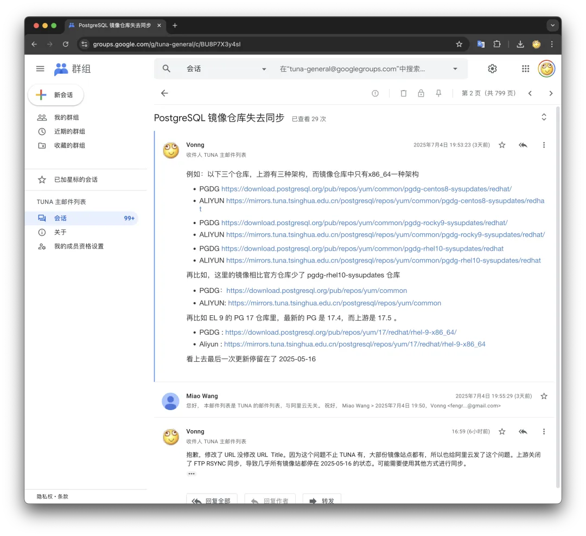

最近老冯在构建 Pigsty 离线包的时候发现，在本地测试的时候安装的 PostgreSQL 版本不太对，17.4 比最新的 17.5 落后了一个小版本。而且在 EL10 上测试的时候发现有几个仓库报错了。奇怪的是，在香港使用全球默认仓库没问题，一旦在本地使用中国的镜像站就报错。

仔细一看，发现国内的镜像站点都与 PostgreSQL 上游仓库失去同步了：清华大学开源软件镜像站（TUNA）最后一次成功同步是5月16号，而阿里云阿里云镜像站最后的同步时间戳是 2025 年 3-31。国外的镜像站，比如 mirrors.xtom.de 也出现了这种问题，最后一次同步是 6月20日，但也明显可以看出手动更新与脱离同步的痕迹。

我搜索了一下，发现了在 PostgreSQL 邮件列表里 5月20日已经有韩国镜像站的维护者问了这个问题了，镜像站的维护者问之前用 rsync 同步 PGDG 官方仓库怎么突然断了？

PostgreSQL 贡献者之一的 Dave Page 回复到因为有大量的非法流量涌入 —— 他们决定永久关闭了原来非正式的 FTP 服务器，不再提供 rsync 同步选项，只允许通过 HTTP 访问了。

> [Re: rsync pgsql-ftp access](https://www.postgresql.org/message-id/CA%2BOCxoz3p4LqyE4aNb3M8gs2GND25ET%3DEMQ-KSrZ%2BB1WRSdT4Q%40mail.gmail.com)

PostgreSQL 作为世界上最流行的数据库软件，绝大多数用户都是通过 PGDG 官方仓库下载安装预制的二进制成品软件，而非从源码编译。而这个仓库就托管在两台物理机上 —— 根据 PostgreSQL Infra Team 的统计，大概每天有 六千六百万的请求（约每秒 750 次下载），每天约 10 TB 的数据传输。

> https://www.pgevents.ca/events/pgconfdev2025/schedule/session/385-designing-and-implementing-a-monitoring-feature-in-postgresql/

而且这个决定就是在 PGConf.Dev 2025 最后一天进行的，他们还有个演讲，说本来有四台服务器，现在就剩两台了，前面套了个 CDN。
然后一看这个流量太大吃不住，咔嚓一下 rsync / ftp 一关，全世界的 PostgreSQL 下游仓库都断了。
老实说，老冯觉得这是一件很扯淡的事情 —— 你把这些镜像站都挡在外面，用户到时候直接涌入原始上游，那流量不是更大了么。

但老实说，你还真没法苛责他们什么，因为这就是开源的 STYLE —— 没有质保 —— 毕竟人家也没收钱，开发者没有义务去一直做慈善。
但从另一个角度来说 **这还真是卡了一把全球用户的脖子** ：比如 17.5 修复的 CVE 漏洞，如果是用镜像站的用户，可能就没法及时更新了。

老冯已经把这个问题反馈给了 阿里云镜像站和 清华TUNA 镜像站的维护者，看看最近能不能修复。比如用 HTTP 去拉取更新。如果短时间内没法解决，老冯准备自己也把 PGDG 的仓库给拉下来一部分，丢到 Cloudflare 上先做一个镜像站。

从供应链安全的角度来看，Fork 魔改一个 PG 内核确实没什么卵用。但维护一个自己控制的软件二进制制成品仓库对于运维自主可控确实有着关键意义。

老冯也一直在想要不自己在国内弄个镜像站点，毕竟都已经搞了一个 Pigsty APT/YUM 仓库，多放个 PG 也不是什么事儿。但其实阿里云和 TUNA 之前一直做的都不错，所以一直也都是用的这两家作为国内用户的默认配置。

至于长期来看，其实俺重新编译打包弄一个专门的 PostgreSQL 仓库也未尝不可，毕竟最近老冯也打包了好几种 PG 分支内核，还有 PG 生态中 PGDG 没有收录的 250 多个扩展。在构建 APT / YUM 仓库上已经是骨灰级打包侠了。不过，主要的问题还是维护太费时间，而且国内的流量费也太贵了。不过如果有金主赞助赞助不限流量的大带宽服务器，老冯也很乐意额外用爱发发电。

> 配图提示词：帮我画一副吉卜力风格的文章配图，宽高比 3:2，内容是一座山谷/河谷河道中，坐着一头蓝色的大象（Postgres Slonik），把上游的河水给挡住了，下游的河水干涸了，而大象上方的河道积水形成了堰塞湖，河谷两边有很多人（PostgreSQL 用户），拎着桶沿着河道边的公路从下游前往上游打水。这幅图隐喻着 PGDG 上游仓库切断了镜像站的同步通道，导致全球用户无法及时更新 PostgreSQL 版本。