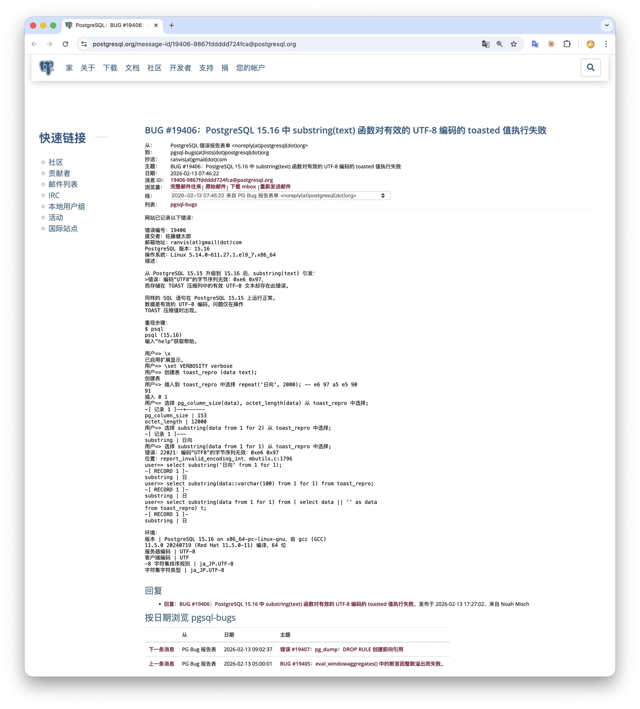
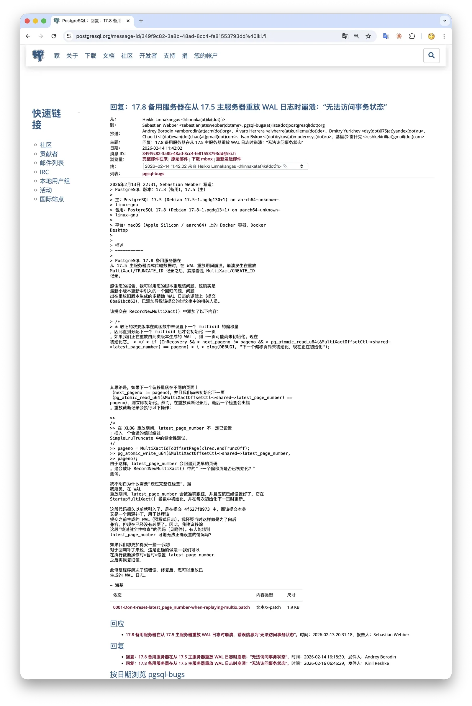

> The 18.2 minor-release train introduced two bugs. Hold off on fresh deployments and upgrades, then update promptly after 18.3 ships next week.

One week ago, the PostgreSQL community shipped its routine February minor releases, and [Pigsty v4.1 followed the same day](/en/pigsty/v4.1/).
However, I need to warn everyone: **avoid new PostgreSQL deployments and upgrades during this two-week window**, because the routine minor releases introduced two bugs.
Both bugs will be fixed in the **out-of-cycle minor releases** scheduled for 2026-02-26.

## Symptoms

### BUG 1: substring() Errors on Non-ASCII TOASTed Text

This regression can affect applications. The first and more significant issue is that `substring()` raises an error when reading non-ASCII text from a TOAST-compressed column value.

https://www.postgresql.org/message-id/19406-9867fddddd724fca@postgresql.org

You may hit this issue if you store non-ASCII text larger than 2 KB and call `substring()` on the column value. `substring()` is a common string function, so the odds of encountering it in practice are not trivial.

The regression is related to the fix for CVE-2026-2006. That fix tightened multibyte-boundary checks, changing the old behavior from “stop counting when an incomplete multibyte character is encountered” to raising an error immediately.

The problem lies in the TOAST detoast-slice logic in `text_substring()`. When the value comes from a database column, the function estimates how much data to decompress as `requested character count × maximum bytes per character for the encoding`, then fetches that slice.
The slice can end in the middle of a multibyte character. The old logic tolerated this; the new logic raises an “invalid byte sequence for encoding” error.

This also explains why `SELECT substring('中文测试', 1, 2)` succeeds while `SELECT substring(col, 1, 2) FROM t` may fail.

### BUG 2: FATAL During Replay of WAL from an Older Minor Release

The second issue occurs in the cross-minor-version WAL replay path, with the error “could not access status of transaction.”

https://www.postgresql.org/message-id/349f9c82-3a8b-48ad-8cc4-fe81553793dd%40iki.fi

This happens when binaries from a new minor release replay WAL generated by an older minor release. The affected replay paths include not only a streaming replica catching up with its primary, but also archive-based recovery such as PITR.
Because the trigger conditions are fairly specific, the practical blast radius may be relatively limited.

## Impact

Affected versions: 18.2, 17.8, 16.12, 15.16, 14.21.

If your application uses string functions such as `substring()` on non-ASCII text and you have already upgraded to one of these minor releases, you are affected by the first bug.
The second bug has a prerequisite: new-version binaries must replay WAL from an older minor release. Check your streaming-replica logs for “could not access status of transaction.”

If you installed PostgreSQL 18.2/17.8/16.12/15.16/14.21, watch closely for the out-of-cycle releases on 2026-02-26 and update to 18.3/17.9/16.13/15.17/14.22 as soon as they ship.
Because PG 18.2 fixed a series of CVEs and bugs, we believe the best deployment strategy is still to wait one week for 18.3 before deploying. If you urgently need the fixes sooner, consult the official wiki, apply the patches manually, and rebuild and install PostgreSQL.

For Pigsty users: if you used the “online installation” mode during the past week, or made a new PostgreSQL deployment from the v4.1 “offline installation package,” you have most likely installed an affected PostgreSQL version.
Pigsty v4.2.0 will ship alongside PG 18.3, with an updated offline installation package and a migration guide for upgrading existing PostgreSQL installations to the latest minor release.

If you absolutely must deploy during this two-week window, use the Pigsty v4.0 offline installation package to install from the 18.1 release train, then perform a minor-version upgrade later.

## My Take

Over the past few years, PostgreSQL has made—or, in the first case, scheduled—four out-of-cycle minor releases:

**① 2026-02-26 (planned)**

- Versions: 18.3, 17.9, 16.13, 15.17, 14.22
- Reason A (security-fix related): the CVE-2026-2006 fix introduced the `substring()` regression
- Reason B (non-security change): a regression in the multixact WAL replay path can interrupt standby/recovery

**② 2025-02-20**

- Versions: 17.4, 16.8, 15.12, 14.17, 13.20
- Reason: the fix for CVE-2025-1094 (a libpq client-library vulnerability), released on 2025-02-13, introduced a regression involving the handling of non-null-terminated strings.

**③ 2024-11-21**

- Versions: 17.2, 16.6, 15.10, 14.15, 13.18, **12.22** (PG 12 was already EOL, but received an exceptional release)
- Reason A (security-fix related): the CVE-2024-10978 fix broke `ALTER USER ... SET ROLE`
- Reason B (independent issue): an ABI change to `ResultRelInfo` caused compatibility problems for some extensions

**④ 2022-06-16**

- Version: 14.4 only (PG 14 only)
- Reason: starting with PostgreSQL 14.0, `CREATE INDEX CONCURRENTLY` and `REINDEX CONCURRENTLY` had a **silent index data corruption** issue.

The pattern across the three most recent out-of-cycle releases is unmistakable: **in 2024, 2025, and 2026, each routine update was immediately followed by an emergency fix, usually for a regression introduced by a security patch**. I see several structural reasons behind this:

**First, the tension between time pressure and quality in security fixes.** CVE fixes are developed under embargo, so only a very small group can review and test a patch before disclosure.
Unlike ordinary bug fixes, which can be discussed openly on pgsql-hackers for weeks or even months, security patches have a very short development and review window, with fewer participants. That makes gaps in testing much more likely.
Look at these three incidents: CVE-2024-10978 broke `SET ROLE`; CVE-2025-1094 broke libpq string handling; CVE-2026-2006 broke `substring()`. Each functional regression was introduced while fixing a vulnerability.

**Second, PostgreSQL’s regression-testing system has fallen behind the complexity of the codebase.**
PostgreSQL’s `make check` regression suite has a long history, but its coverage is limited, especially across dimensions such as multibyte encodings, streaming-replication scenarios, and extension ABI compatibility.
The 2024 incident, where a change in the size of the `ResultRelInfo` struct crashed extensions including TimescaleDB, shows that even ABI stability lacks sufficient automated checks.
The community has long discussed stronger CI/CD and broader test matrices, but progress is slow—this is, after all, a community-driven project.

**Third, and crucially, the bar has risen.**
In the past, similar issues might simply have waited for the next quarterly scheduled release. PostgreSQL now has a far larger user base and runs far more critical workloads, so the community has less tolerance for quality problems and is more inclined to issue fixes quickly.
In that sense, more out-of-cycle releases also reflect the community taking responsibility for its users: once a problem is found, it is fixed promptly instead of being left to linger. That is a good thing.

My view is that falling into the same trap three years in a row points to a structural conflict: **the closed development process for security fixes versus an increasingly complex codebase and growing testing requirements**.
Fortunately, PostgreSQL is the world’s most popular open-source database. Even when development-stage testing misses something, production workloads quickly provide a massive smoke test and expose it.

There is another lesson here. We normally consider minor-version upgrades safe, but these out-of-cycle releases are a reminder that running the newest release carries risk.
If you are not a seasoned database operator and no CVE or severe bug is forcing your hand, staying two minor releases behind may be the more prudent policy.

## Original Announcement

#### PostgreSQL Plans an Out-of-Cycle Emergency Update for February 26, 2026

Released by the PostgreSQL Global Development Group on **2026-02-16**

**PostgreSQL Project**

Due to regressions introduced in the [February 12, 2026 update release](https://www.postgresql.org/about/news/3235/)—including 18.2, 17.8, 16.12,
15.16, and 14.21—the PostgreSQL Global Development Group plans an out-of-cycle emergency release on February 26, 2026, with fixes for all supported versions (18.3, 17.9,
16.13, 15.17, and 14.22). While these issues may not affect all PostgreSQL users,
the PostgreSQL Global Development Group wants to address them as quickly as possible, before the
[next scheduled update](https://www.postgresql.org/developer/roadmap/) on May 14, 2026.

Regressions introduced in this release include:

- The [`substring()`](https://www.postgresql.org/docs/current/functions-string.html) function can raise an “invalid byte sequence for encoding” error when processing a non-ASCII text value
  if [the value comes from a database column](https://postgr.es/m/19406-9867fddddd724fca@postgresql.org).
- A standby may stop with the error
  “could not access status of transaction”
  ([discussion](https://www.postgresql.org/message-id/349f9c82-3a8b-48ad-8cc4-fe81553793dd%40iki.fi)).

Regarding the `substring()` regression:
although the fix for [CVE-2026-2006](https://www.postgresql.org/support/security/CVE-2026-2006/)
closed a security vulnerability in the database server,
it also introduced a regression that incorrectly raises an exception when `substring()` processes a multibyte (non-ASCII) text value originating from a database column.
If you have already upgraded to 18.2, 17.8, 16.12, 15.16, or 14.21 and need to fix this issue before the official February 26 release, consider applying the patch manually. Version-specific fix information is available at:
https://wiki.postgresql.org/wiki/2026-02_Regression_Fixes

Until this update is released, details about the regressions and their fixes are available here:
https://wiki.postgresql.org/wiki/2026-02_Regression_Fixes
