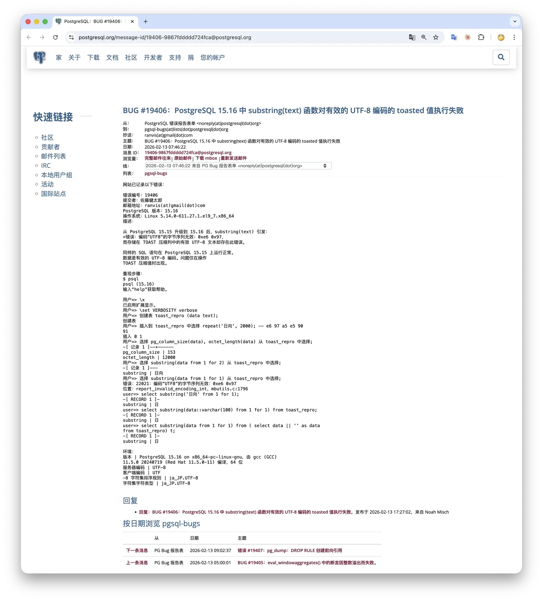
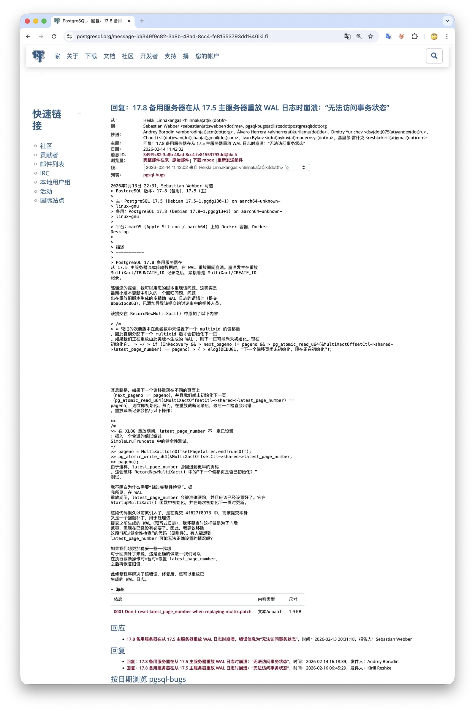

# 警告：暂缓 PG 18.2 系列小版本升级

> 18.2 系列小版本引入两个显著 BUG，请暂缓新建与升级，并及时在下周 18.3 发布后更新。

一周前 PostgreSQL 社区发布了二月度例行小版本更新，[Pigsty v4.1 也于当天跟进](/pigsty/v4.1)。
不过老冯必须提醒各位，**最好不要在最近两周进行 PostgreSQL 新增部署与更新**，因为这个例行小版本引入了两个 BUG。
这两个 BUG 将在 2026-02-26 的 **号外小版本**（out-of-cycle release）中修复。

## 表现

### BUG 1：substring() 对非 ASCII Toast 文本报错

这次引入的回归问题可能对业务产生影响。第一个主要问题是 `substring()` 函数从 Toast 压缩列中取出非 ASCII 文本时会报错。

https://www.postgresql.org/message-id/19406-9867fddddd724fca@postgresql.org

如果你存储了超过 2 KB 的非 ASCII 文本，并在列值上使用 `substring()`，就可能触发这个问题。`substring()` 是常用字符串函数，实际命中概率并不低。

这个回归与 CVE-2026-2006 的安全修复有关，CVE-2026-2006 的修复加强了多字节边界检查，把“遇到不完整多字节字符时停止计数”的旧行为，改为直接抛错。

问题出在 `text_substring()` 的 TOAST detoast 切片逻辑。当值来自数据库列时，函数会按 `请求字符数 × 编码最大字节数` 预估解压长度，再取切片。
该切片可能在多字节字符中间截断，旧逻辑能容忍，新逻辑会报“invalid byte sequence for encoding”。

这也解释了为什么 `SELECT substring('中文测试', 1, 2)` 正常，而 `SELECT substring(col, 1, 2) FROM t` 可能报错。

### BUG 2：新版本回放旧版本 WAL 时 FATAL 中断

第二个问题发生在跨小版本的 WAL 回放路径上，报错：“could not access status of transaction”。

https://www.postgresql.org/message-id/349f9c82-3a8b-48ad-8cc4-fe81553793dd%40iki.fi

这个问题出现在“新小版本二进制回放旧小版本 WAL”场景中。除了主备流复制追 WAL，还包括使用归档做恢复（PITR）等回放路径。
但考虑到触发条件比较特殊，实际影响范围可能相对有限。

## 影响

受影响版本：18.2、17.8、16.12、15.16、14.21。

如果您的应用使用了 `substring()` 等字符串函数处理非 ASCII 文本，且已升级到这些小版本，那您已经受到第一个 BUG 的影响。
第二个 BUG 触发有一个前提，即“用新版本二进制回放旧版本 WAL”。建议检查流复制备库的日志中有无“could not access status of transaction” 报错。

如果您安装了 PostgreSQL 18.2/17.8/16.12/15.16/14.21，建议您密切关注 2026-02-26 的号外小版本发布，并在发布后尽快更新到 18.3/17.9/16.13/15.17/14.22。
鉴于 PG 18.2 修复了一系列 CVE 与 BUG，我们认为最佳的部署策略还是等待一周后的 18.3 发布再进行部署。如果您着急需要进行提前修复，可以参考官方 Wiki 手工应用补丁重新编译构建与安装。

对于 Pigsty 用户来说，如果您在最近一周内使用“在线安装”模式，或使用 v4.1 的“离线安装包”进行了新的 PG 部署，那么您很可能已经安装了受影响的 PG 版本。
Pigsty v4.2.0 将与 PG 18.3 同期发布，提供最新的离线安装包，以及对现有 PG 小版本升级到最新小版本的迁移手册。

如果您确实非常着急要在这两周内部署上新，那么可以使用 Pigsty v4.0 的离线安装包，安装 18.1 系列小版本，并在后续进行小版本升级。

## 老冯评论

最近几年，PostgreSQL 一共有过四次 out-of-cycle 计划外小版本发布：

**① 2026-02-26（计划中）**

- 版本：18.3, 17.9, 16.13, 15.17, 14.22
- 原因 A（安全修复相关）：CVE-2026-2006 修复引入 `substring()` 回归
- 原因 B（非安全变更）：multixact WAL 回放路径回归，备库/恢复可能中断

**② 2025-02-20**

- 版本：17.4, 16.8, 15.12, 14.17, 13.20
- 原因：2025-02-13 发布的 CVE-2025-1094（libpq 客户端库漏洞）修复引入回归，涉及非空终止字符串处理问题。

**③ 2024-11-21**

- 版本：17.2, 16.6, 15.10, 14.15, 13.18, **12.22**（PG 12 已 EOL，仍破例发布）
- 原因 A（安全修复相关）：CVE-2024-10978 修复导致 `ALTER USER ... SET ROLE` 失效
- 原因 B（独立问题）：`ResultRelInfo` ABI 变化导致部分扩展兼容性问题

**④ 2022-06-16**

- 版本：仅 14.4（只针对 PG 14）
- 原因：PostgreSQL 14.0 以来，`CREATE INDEX CONCURRENTLY` 和 `REINDEX CONCURRENTLY` 存在 **静默索引数据损坏** 问题。

最近三次的号外小版本模式非常清晰：**2024、2025、2026 连续三年的例行更新之后都紧跟了一次紧急修复，而且主要是安全补丁引入的回归**。我觉得背后有几个结构性原因：

**第一，安全修复的时间压力与质量之间的矛盾**。CVE 修复有保密期（embargo），补丁在公开前只能在极小范围内审查和测试。
不像普通 bug 修复可以在 pgsql-hackers 上公开讨论几周甚至几个月，安全补丁的开发和审查窗口非常短，参与的人也少，很容易测试不充分。
看看这三次：CVE-2024-10978 改坏了 `SET ROLE`、CVE-2025-1094 改坏了 libpq 字符串处理、CVE-2026-2006 改坏了 `substring()`。都是修漏洞时引入了功能回归。

**第二，PG 的回归测试体系相对于代码复杂度来说是滞后的。**
PostgreSQL 的 `make check` 回归测试套件历史悠久但覆盖面有限，特别是对多字节编码、流复制场景、扩展 ABI 兼容性这些维度的覆盖不够。
2024 年那次 `ResultRelInfo` 结构体大小变化导致 TimescaleDB 等扩展崩溃，说明 ABI 稳定性都没有充分自动化检查。
社区一直在讨论引入更完善的 CI/CD 和更多测试矩阵，但进展缓慢，毕竟这是一个社区驱动的项目

**第三，也是很关键的一点，标准提高了。**
以前类似的问题可能就等到下个季度例行发布时一起修，但现在 PostgreSQL 的用户基数和关键程度今非昔比，社区对质量的容忍度更低了，更倾向于快速发布修复。
所以 out-of-cycle 增多，某种程度上也反映了社区对用户负责的态度：发现问题不拖着，尽快修。这其实是好事。

老冯觉得，连续三年栽在坑里，原因是一个结构性矛盾：**安全修复的封闭开发流程 vs. 日益复杂的代码库和测试需求**。
但好在 PostgreSQL 毕竟是世界上最流行的开源数据库。因此，即使在开发阶段的测试有缺陷，也能很快地在生产环境中通过冒烟众测被发现。

另一个启示是 —— 通常我们认为升级小版本是足够安全的，但显然，这几次号外版本的发布也在提醒我们：追新有风险。
如果不是数据库老司机，在没有 CVE，恶性 bug 的前提下，说不定还是滞后两个小版本来使用更为稳妥。

## 公告原文

#### PostgreSQL 计划于 2026 年 2 月 26 日进行计划外紧急更新

由 PostgreSQL 全球开发组发布于 **2026-02-16**

**PostgreSQL 项目**

由于 [2026 年 2 月 12 日更新版本](https://www.postgresql.org/about/news/3235/)（包括 18.2、17.8、16.12、
15.16 和 14.21）引入了回归缺陷，PostgreSQL 全球开发组计划于 2026 年 2 月 26 日进行一次计划外紧急发布，届时将为所有受支持的版本提供修复（18.3、17.9、
16.13、15.17、14.22）。虽然这些问题不一定影响所有 PostgreSQL 用户，
但 PostgreSQL 全球开发组希望在 2026 年 5 月 14 日的
[下一次例行更新](https://www.postgresql.org/developer/roadmap/) 之前尽快解决这些问题。

本次发布引入的回归缺陷包括：

- [`substring()`](https://www.postgresql.org/docs/current/functions-string.html) 函数在处理非 ASCII 文本值时，
  如果 [该值来源于数据库列](https://postgr.es/m/19406-9867fddddd724fca@postgresql.org)，
  会抛出“invalid byte sequence for encoding”（无效编码字节序列）错误。
- 备库可能会中断并返回错误：
  [讨论链接](https://www.postgresql.org/message-id/349f9c82-3a8b-48ad-8cc4-fe81553793dd%40iki.fi)。
  “could not access status of transaction”（无法访问事务状态）。

关于 `substring()` 的回归缺陷：
[CVE-2026-2006](https://www.postgresql.org/support/security/CVE-2026-2006/) 的修复补丁
虽然封堵了数据库服务器中的一个安全漏洞，
但同时引入了一个回归问题，导致 `substring()` 在处理多字节（非 ASCII）文本值时，如果该值来源于数据库列，会错误地抛出异常。
如果您已经升级到 18.2、17.8、16.12、15.16 或 14.21，且需要在 2 月 26 日正式发布前修复此问题，可以考虑手动应用补丁。各版本的具体修复信息请参见：
https://wiki.postgresql.org/wiki/2026-02_Regression_Fixes。

在本次更新发布之前，您可以在这里查看回归缺陷和修复的详细信息：
https://wiki.postgresql.org/wiki/2026-02_Regression_Fixes。
