Previously, we analyzed StackOverflow survey data to explain "[Why PostgreSQL is the Most Successful Database](/pg/pg-is-no1/)".

This time we'll let performance data speak for itself, discussing just how powerful the most successful PostgreSQL really is, helping you "**know the numbers**".

------

## TL;DR

If you're interested in these questions, this article will be helpful:

- How powerful is PostgreSQL's performance really?
  Point queries: 600K+ QPS, peaking at 2M. Read-write TPS (4 writes, 1 read): 70K+, peaking at 140K.
- PostgreSQL vs MySQL ultimate performance comparison
  Under extreme conditions, PostgreSQL significantly outperforms MySQL in point queries, while other metrics are roughly on par with MySQL.
- PostgreSQL vs other databases performance comparison
  "Distributed databases"/NewSQL show significantly worse performance than classic databases on equivalent hardware.
- PostgreSQL vs other analytical databases on TPC-H
  PostgreSQL natively serves as an HATP database with impressive analytical performance.
- Do cloud databases/servers really have cost advantages?
  The price of c5d.metal for 1 year could buy you the server and host it for 5 years. The corresponding cloud database's 1-year cost could buy you the same EC2 for 20 years.

Detailed test procedures and raw data are available at: [github.com/Vonng/pgtpc](https://github.com/Vonng/pgtpc)

------

## PGBENCH

With software and hardware technology evolving rapidly, despite countless performance evaluation articles, few reflect these changes. In this test, we chose two new hardware specifications and used **PGBENCH** to test the latest PostgreSQL 14.5's performance on this hardware.

The test subjects include four hardware specifications: two Apple laptops and three AWS EC2 cloud servers - a 2018 15-inch top-spec Macbook Pro with Intel 6-core i9, a 2021 top-spec 16-inch Macbook Pro with M1 MAX, AWS z1d.2xlarge (8C 64G), and AWS c5d.metal. All are commercially available hardware you can easily purchase.

PGBENCH is PostgreSQL's built-in benchmarking tool that uses TPC-B-like queries by default, suitable for evaluating PostgreSQL and compatible database performance. Tests are divided into two types: read-only queries (RO) and read-write (RW). Read-only queries contain one SQL statement randomly selecting one record from 100 million database entries; read-write transactions contain 5 SQL statements: one query, one insert, and three updates. Testing used a dataset scale of s=1000, progressively increasing client connections with PGBENCH to find the QPS/TPS maximum, recording stable averages after 3-5 minutes of sustained testing:

| No | Spec                  | Config  | CPU | Freq             | S    | RO      | RW     |
|----|-------------------|---------|-----|------------------|------|---------|--------|
| 1  | Apple MBP Intel 2018  | Normal  | 6   | 2.9GHz - 4.8GHz  | 1000 | 113870  | 15141  |
| 2  | AWS z1d.2xlarge       | Normal  | 8   | 4GHz             | 1000 | 162315  | 24808  |
| 3  | Apple MBP M1 Max 2021 | Normal  | 10  | 600MHz - 3.22GHz | 1000 | 240841  | 31903  |
| 4  | AWS c5d.metal         | Normal  | 96  | 3.6GHz           | 1000 | 625849  | 71624  |
| 5  | AWS c5d.metal         | Extreme | 96  | 3.6GHz           | 5000 | 1998580 | 137127 |

### **Read Write**

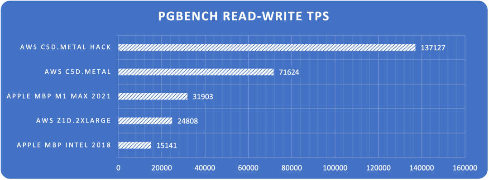

> Figure: Read-write TPS limits across hardware configurations

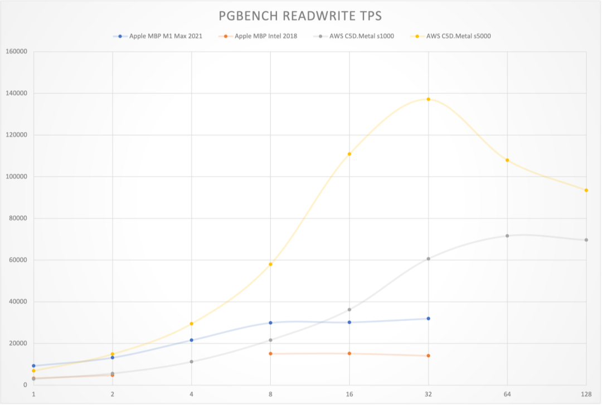

> Figure: Read-write TPS curves across hardware configurations

**Read Only**

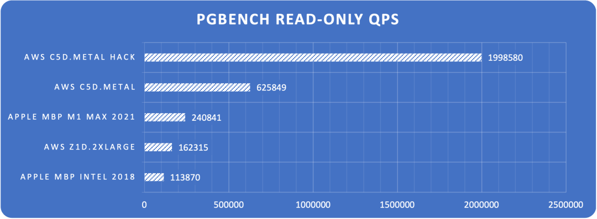

> Figure: Point query QPS limits across hardware configurations

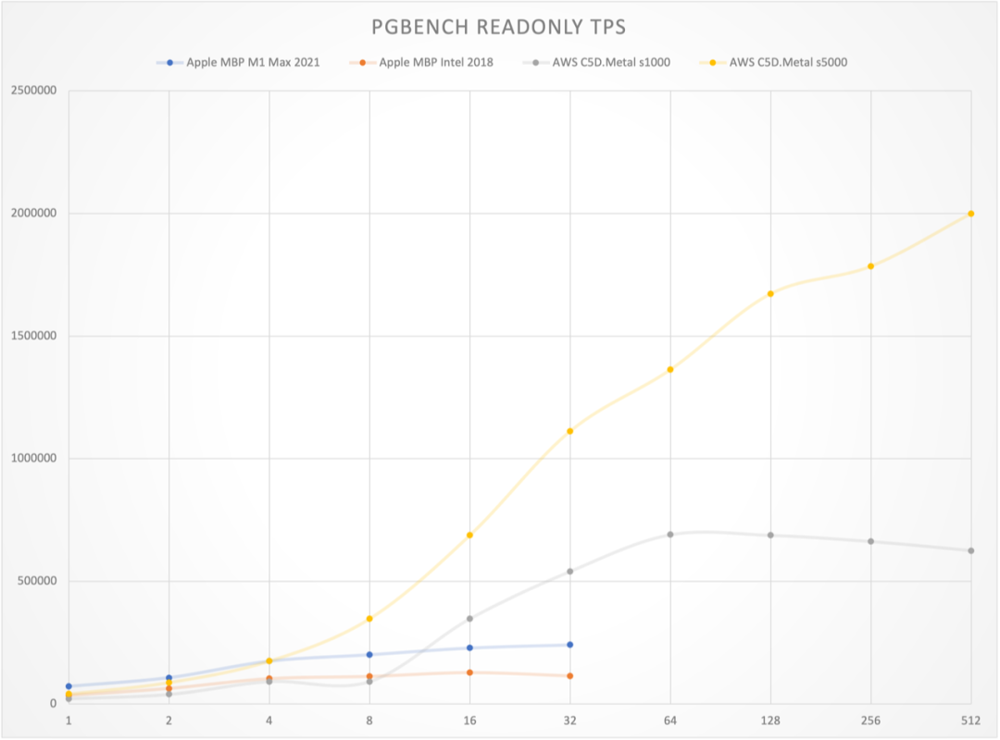

> Figure: Point query QPS vs concurrency curves across hardware configurations

The results are quite shocking. On an Apple M1 Max 10C laptop, PostgreSQL achieved 32K read-write and 240K point query performance. On AWS c5d.metal production physical machines, PostgreSQL achieved 72K read-write and 630K point query performance. With extreme optimization tuning, it can reach monster-level performance of **single-machine 137K read-write and 2M point queries**.

As a rough reference, Tantan, a popular internet app, has a PostgreSQL global TPS of around 400K. This means a dozen such new laptops or a few top-spec servers (under ¥100K) potentially have the capability to support a large-scale internet application's database service - something unimaginable in the past.

### **About Costs**

Using the Ningxia region and C5D.METAL model as an example, this model is currently the best comprehensive compute physical machine with built-in 3.6TB local NVME SSD storage, offering 7 payment options:

| Payment Mode                  | Monthly | Upfront   | Annual    |
|------------------------------|---------|-----------|-----------|
| On-demand                    | 31927   | 0         | 383,124   |
| Standard Reserved, 1yr, No upfront | 12607   | 0         | 151,284   |
| Standard Reserved, 1yr, Partial upfront | 5401    | 64,540    | 129,352   |
| Standard Reserved, 1yr, Full upfront | 0       | 126,497   | 126,497   |
| Convertible Reserved, 3yr, No upfront | 11349   | 0         | 136,188   |
| Convertible Reserved, 3yr, Partial upfront | 4863    | 174,257   | 116,442   |
| Convertible Reserved, 3yr, Full upfront | 0       | 341,543   | 113,847   |

Annual costs range from ¥110K to ¥150K, with retail on-demand costing ¥380K annually. If you purchase and host this machine yourself, comprehensive IDC hosting/maintenance/network/power costs over 5 years should be under ¥100K. While cloud hardware annual costs appear to be 5x self-hosting, considering flexibility, discounts, and credits, AWS EC2 cloud server pricing remains within reasonable range overall. Self-building databases with such cloud hardware also delivers excellent performance.

However, RDS for PostgreSQL is a completely different story. If you want similar-spec cloud databases, the closest specification is db.m5.24xlarge (96C, 384G) with 3.6T/80000 IOPS io1 storage (c5d.metal's 3.6T NVME SSD 8K RW IOPS is approximately 95K, while regular io1 storage maxes at 80K IOPS), costing ¥240K monthly, ¥2.867M annually - **nearly 20x the cost of equivalent self-built EC2**.

> AWS Price Calculator: [https://calculator.amazonaws.cn/](https://calculator.amazonaws.cn/)

------

## SYSBENCH

PostgreSQL is indeed powerful, but how does it compare to other database systems? PGBENCH mainly evaluates PostgreSQL and its derivative/compatible databases, but for cross-database performance comparisons, we need sysbench.

Sysbench is an open-source, cross-platform multi-threaded database performance testing tool whose results representatively reflect a database system's transaction processing capabilities. Sysbench includes 10 typical test cases, such as `oltp_point_select` for point query performance, `oltp_update_index` for update performance, comprehensive read-write transaction performance tests like `oltp_read_only` (16 queries per transaction), `oltp_read_write` (20 mixed queries per transaction), and `oltp_write_only` (6 write SQLs).

Sysbench can test both MySQL and PostgreSQL performance (including their compatible derivatives), providing good horizontal comparability. Let's start with the most anticipated comparison - the open-source relational database showdown: the world's "most popular" open-source relational database (MySQL) versus the world's most advanced open-source relational database (PostgreSQL).

### **Dirty Hack**

MySQL doesn't provide official sysbench test results, only posting third-party evaluation images and links on their website, implicitly suggesting MySQL can achieve 1M point query QPS, 240K indexed key updates, and ~39K composite read-write TPS.

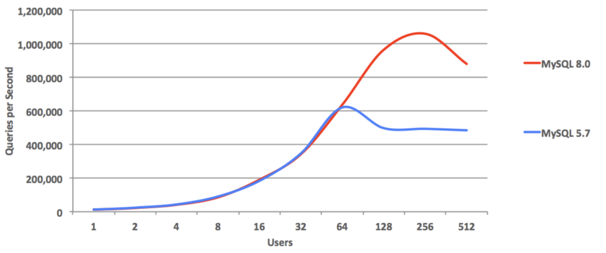

> Figure: https://www.mysql.com/why-mysql/benchmarks/mysql/

This is quite **unsportsmanlike** behavior. Reading the linked evaluation article reveals these results were achieved by disabling all MySQL security features: disabling Binlog, commit flushing, FSYNC, performance monitoring, DoubleWrite, checksums, forcing LATIN-1 charset - such a database simply cannot be used in production environments; it's purely benchmark gaming.

However, we can also use these Dirty Hacks, disabling corresponding PostgreSQL security features to see PostgreSQL's ultimate limits. The results are stunning - PostgreSQL point query QPS reached [2.33 million per second](/pg/pg-performence/), peak performance far exceeding MySQL by more than double.

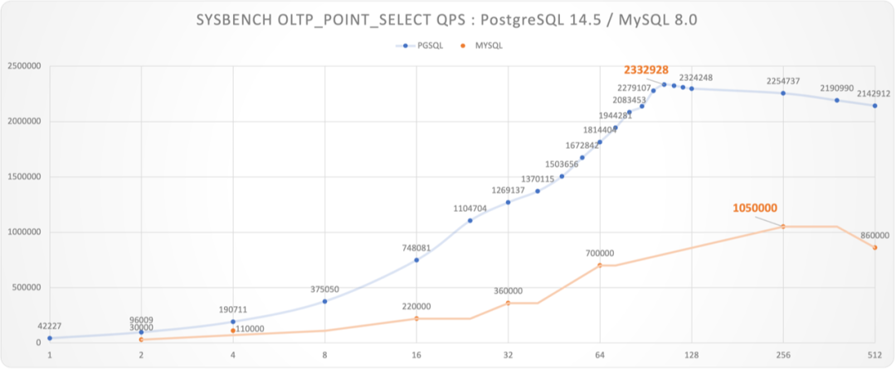

Figure: Unsportsmanlike Benchmark: PostgreSQL vs MySQL

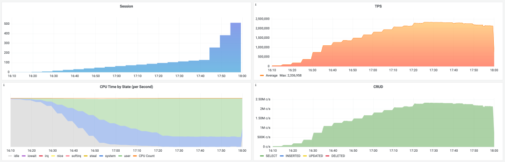

> PostgreSQL extreme configuration point query benchmark scene

It must be noted that MySQL's bench used a 48C 2.7GHz machine, while PostgreSQL used a 96C 3.6GHz machine. However, since PostgreSQL uses a process model, we can use the c=48 test value as a lower bound approximation for PostgreSQL's performance on 48C machines: for read-only requests, QPS peaks typically occur when client count is slightly greater than CPU cores. Even so, PostgreSQL's point query QPS at c=48 (1.5M) still exceeded MySQL's peak by 43%.

> We also look forward to MySQL experts providing evaluation reports on identical hardware for better comparisons.

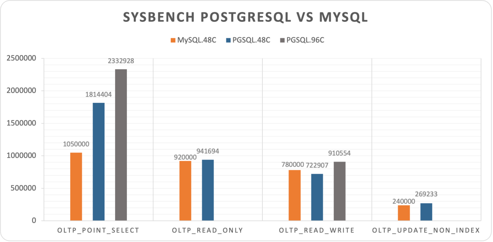

> Figure: MySQL's four sysbench results with data, c=48

In other tests, MySQL also showed decent extreme performance. `oltp_read_only` and `oltp_update_non_index` were close to PostgreSQL (c=48), and even slightly exceeded PostgreSQL in `oltp_read_write`.

Overall, under extreme conditions, PostgreSQL crushed MySQL in point queries but performed roughly on par with MySQL in other tests.

### **Fair Play**

While vastly different in feature richness, MySQL can basically match PostgreSQL in extreme performance. So how do other databases, especially new-generation NewSQL, perform?

Databases providing sysbench test reports on their websites are fair-play respectable players. We believe they're all based on real production environment configurations, so can't use MySQL's Dirty Hacks. We still use AWS c5d.metal, but with full production environment configuration, showing nearly half the performance penalty compared to extreme performance, but more fair and highly comparable.

We collected official sysbench evaluation reports from several representative NewSQL databases' websites. Not all databases provided complete 10-item sysbench test results, and hardware specs and table specifications varied. However, considering several databases used basically similar hardware specs (~100 cores compute, except PolarDB-X and YugaBytes), data scales were also basically 160M records (except OB, YB), overall they have considerable horizontal comparability and sufficient for forming intuitive understanding.

| Database              | PGSQL.C5D96C | TiDB.108C                                | OceanBase.96C                           | PolarX.64C | Cockroach      | Yugabyte      |
|-----------------------|--------------|------------------------------------------|-----------------------------------------|------------|----------------|---------------|
| oltp_point_select     | 1372654      | 407625                                   | 401404                                  |            | 336000         | 95695         |
| oltp_read_only        | 852440       |                                          | 279067                                  | 366863     |                | 52416         |
| oltp_read_write       | 519069       | 124460                                   | 157859                                  | 177506     |                | 9740          |
| oltp_write_only       | 495942       |                                          | 119307                                  |            |                | 9090          |
| oltp_delete           | 839153       |                                          |                                         |            |                | 67499         |
| oltp_insert           | 164351       |                                          |                                         |            | 112000         | 6348          |
| oltp_update_non_index | 217626       | 62084                                    |                                         |            |                | 11496         |
| oltp_update_index     | 169714       | 26431                                    |                                         |            |                | 4052          |
| select_random_points  | 227623       |                                          |                                         |            |                |               |
| select_random_ranges  | 24632        |                                          |                                         |            |                |               |
| Machine               | c5d.metal    | m5.xlarge x3 i3.4xlarge x3 c5.4xlarge x3 | ecs.hfg7.8xlarge x3 ecs.hfg7.8xlarge x1 | Enterprise | c5d.9xlarge x3 | c5.4xlarge x3 |
| Spec                  | 96C 192G     | 108C 510G                                | 96C 384G                                | 64C 256G   | 108C 216G      | 48C 96G       |
| Table                 | 16 x 10M     | 16 x 10M                                 | 30 x 10M                                | 1 x 160M   | N/A            | 10 x 0.1M     |
| CPU                   | 96           | 108                                      | 96                                      | 64         | 108            | 48            |
| Source                | Vonng        | TiDB 6.1                                 | OceanBase                               | PolarDB    | Cockroach      | YugaByte      |

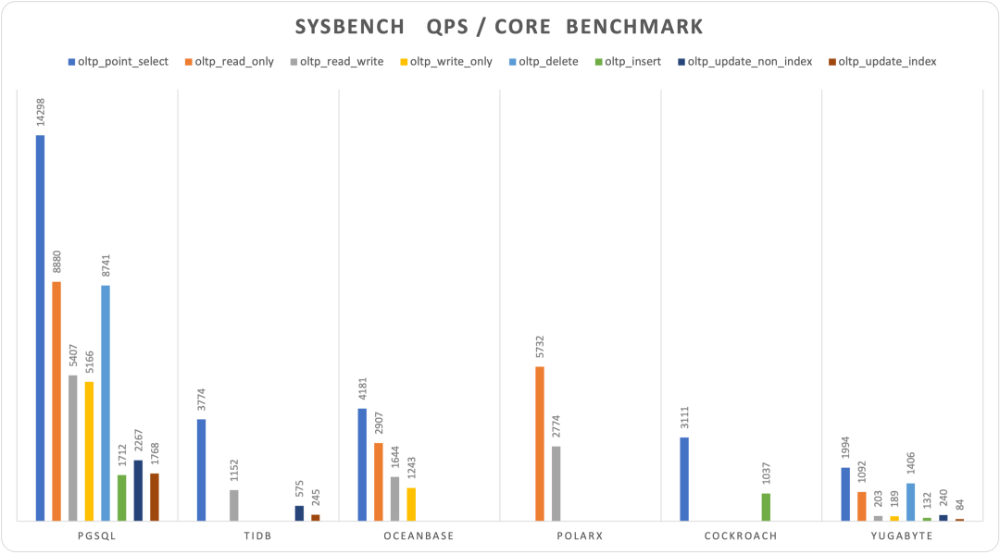

> Figure: Sysbench 10-item test results (QPS, higher is better)

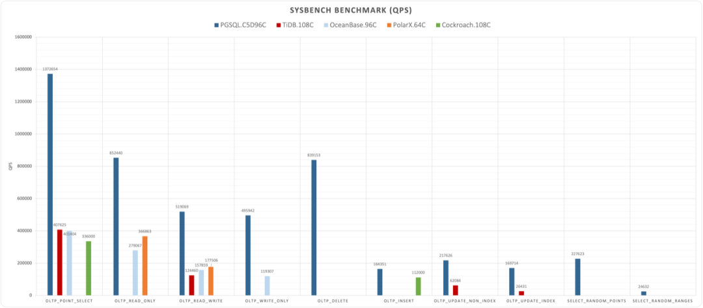

> Normalized performance comparison by database, divided by core count

Shockingly, new-generation distributed databases (NewSQL) performed poorly across the board. Under similar hardware specifications, they showed order-of-magnitude differences compared to PostgreSQL. Among the new databases, the best performer was actually PolarDB, still based on classic master-slave architecture. Such performance results **inevitably make one reconsider distributed database and NewSQL concepts**.

Typically, distributed databases' core trade-off is quality for scale, but what's unexpected is the sacrifice includes not just functionality and stability, but such considerable performance. As Knuth said: "Premature optimization is the root of all evil." Sacrificing such large performance (plus functionality and stability) for unnecessary scale (trillion-level+, TP hundred-TB+) is undoubtedly a form of premature optimization. How many business scenarios actually need Google-scale data requiring distributed databases remains questionable.

-----------------

## TPC-H Analytical Performance

When TP doesn't work, try AP. Despite distributed databases being so weak in TP, data analysis (AP) is distributed databases' fundamental territory, so many distributed databases like to promote HTAP concepts. To measure AP system capabilities, we use TPC-H tests.

TPC-H is a simulated data warehouse with 8 data tables and 22 complex analytical SQL queries. The standard for measuring analytical performance is typically execution time for these 22 SQL queries under specified warehouse counts. Usually 100 warehouses (~100GB data) serve as baseline. We conducted TPC-H tests with 1, 10, 50, 100 warehouses locally and on small AWS cloud servers, completing all 22 queries with these timing results:

| Scale Factor | Time (s) | CPU | Environment | Comment      |
|--------------|----------|-----|-------------|--------------|
| 1            | 8        | 10  | 10C / 64G   | apple m1 max |
| 10           | 56       | 10  | 10C / 64G   | apple m1 max |
| 50           | 1327     | 10  | 10C / 64G   | apple m1 max |
| 100          | 4835     | 10  | 10C / 64G   | apple m1 max |
| 1            | 13.5     | 8   | 8C / 64G    | z1d.2xlarge  |
| 10           | 133      | 8   | 8C / 64G    | z1d.2xlarge  |

For horizontal comparison, we selected some other database official results or detailed third-party evaluation results. However, several points need attention: some database products don't use 100 warehouses, hardware specs vary, and not all database evaluation results come from original manufacturers, so they can only serve as **rough comparisons and references**.

| Database   | Time   | S    | CPU | QPH  | Environment          | Source    |
|------------|--------|------|-----|------|----------------------|-----------|
| PostgreSQL | 8      | 1    | 10  | 45.0 | 10C / 64G M1 Max     | Vonng     |
| PostgreSQL | 56     | 10   | 10  | 64.3 | 10C / 64G M1 Max     | Vonng     |
| PostgreSQL | 1327   | 50   | 10  | 13.6 | 10C / 64G M1 Max     | Vonng     |
| PostgreSQL | 4835   | 100  | 10  | 7.4  | 10C / 64G M1 Max     | Vonng     |
| PostgreSQL | 13.51  | 1    | 8   | 33.3 | 8C / 64G z1d.2xlarge | Vonng     |
| PostgreSQL | 133.35 | 10   | 8   | 33.7 | 8C / 64G z1d.2xlarge | Vonng     |
| TiDB       | 190    | 100  | 120 | 15.8 | 120C / 570G          | TiDB      |
| Spark      | 388    | 100  | 120 | 7.7  | 120C / 570G          | TiDB      |
| Greenplum  | 436    | 100  | 288 | 2.9  | 120C / 570G          | TiDB      |
| DeepGreen  | 148    | 200  | 256 | 19.0 | 288C / 1152G         | Digoal    |
| MatrixDB   | 2306   | 1000 | 256 | 6.1  | 256C / 1024G         | MXDB      |
| Hive       | 59599  | 1000 | 256 | 0.2  | 256C / 1024G         | MXDB      |
| StoneDB    | 3388   | 100  | 64  | 1.7  | 64C / 128G           | StoneDB   |
| ClickHouse | 11537  | 100  | 64  | 0.5  | 64C / 128G           | StoneDB   |
| OceanBase  | 189    | 100  | 96  | 19.8 | 96C / 384G           | OceanBase |
| PolarDB    | 387    | 50   | 32  | 14.5 | 32C / 128G           | Alibaba Cloud |
| PolarDB    | 755    | 50   | 16  | 14.9 | 16C / 64G            | Alibaba Cloud |

For easier measurement, we can normalize cores and warehouses using QPH (Queries Per Hour) - how many rounds of 1-warehouse TPC-H queries can be executed per hour per core, to approximately evaluate databases' relative analytical performance.

> QPH = (1 / duration) * (warehouses / cores) * 3600

The 22 query durations don't scale completely linearly with warehouse count, so this is only approximate reference.

Overall, even a 10-core laptop running PostgreSQL can achieve quite impressive analytical results (Note: beyond 50C exceeds memory, hitting SWAP and disk I/O).

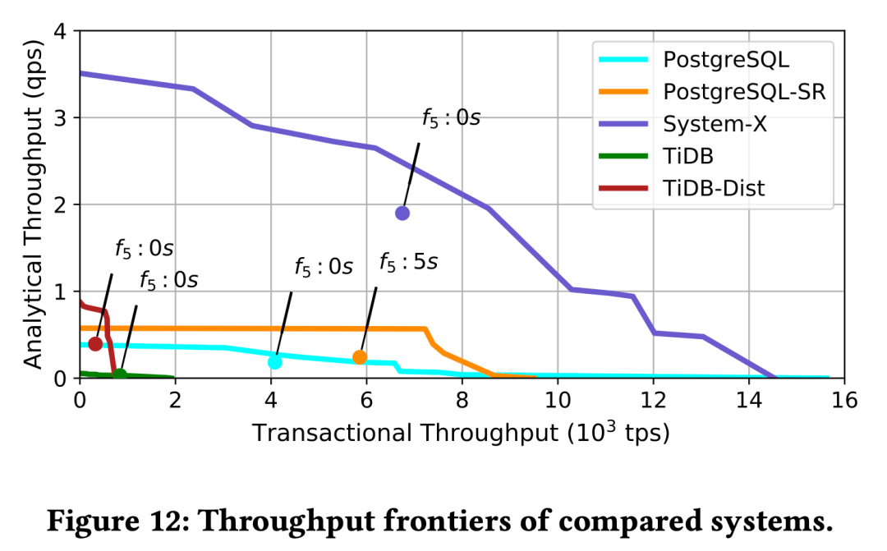

> Figure: The method proposed in the paper "How good is my HTAP system" for evaluating HTAP system capabilities - throughput frontier, plotting mixed workload throughput extremes on the AP/TP two-dimensional plane.

At least on hundred-GB scale tables, PostgreSQL can definitely be called an excellent analytical database. If single tables exceed multi-TB scale, you can smoothly upgrade to PostgreSQL-compatible MPP data warehouses like Greenplum/MatrixDB/DeepGreen. PostgreSQL using master-slave replication can scale read loads nearly infinitely through cascading replicas; PostgreSQL using logical replication can perform built-in/synchronous AP-mode ETL, truly earning the HTAP database title.

In conclusion, **PostgreSQL performs brilliantly in the TP domain and respectably in the AP domain**. No wonder in recent years' StackOverflow annual developer surveys, PostgreSQL became the [triple-crown database](/pg/pg-is-no1/) - most used, most loved, and most wanted by professional developers.

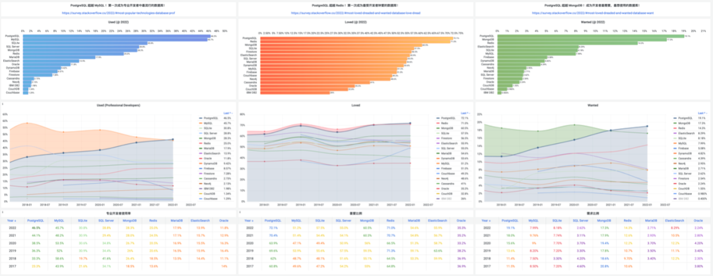

> StackOverflow database developer survey results over six years

-----------------

## References

[1] [Vonng: PGTPC](https://github.com/Vonng/pgtpc)

[2] [WHY MYSQL](https://www.mysql.com/cn/why-mysql/benchmarks/mysql/)

[3] [MySQL Performance : 1M *IO-bound* QPS with 8.0 GA on Intel Optane SSD !](http://dimitrik.free.fr/blog/posts/mysql-performance-1m-iobound-qps-with-80-ga-on-intel-optane-ssd.html)

[4] [MySQL Performance : 8.0 and Sysbench OLTP_RW / Update-NoKEY](http://dimitrik.free.fr/blog/posts/mysql-performance-80-and-sysbench-oltp_rw-updatenokey.html)

[5] [MySQL Performance : The New InnoDB Double Write Buffer in Action](http://dimitrik.free.fr/blog/posts/mysql-80-perf-new-dblwr.html)

[6] [TiDB Sysbench Performance Test Report -- v6.1.0 vs. v6.0.0](https://docs.pingcap.com/tidb/stable/benchmark-sysbench-v6.1.0-vs-v6.0.0)

[7] [OceanBase 3.1 Sysbench Performance Test Report](https://www.oceanbase.com/docs/community/observer-cn/V3.1.4/10000000000450311)

[8] [Cockroach 22.15 Benchmarking Overview](https://www.cockroachlabs.com/docs/stable/performance.html)

[9] [Benchmark YSQL performance using sysbench (v2.15)](https://docs.yugabyte.com/preview/benchmark/sysbench-ysql/)

[10] [PolarDB-X 1.0 Sysbench Test Instructions](https://help.aliyun.com/document_detail/139562.html)

[11] [StoneDB OLAP TPC-H Test Report](https://stonedb.io/zh/docs/performance-tuning/performance-tests/OLAP/tcph-test-report/)

[12] [Elena Milkai: "How Good is My HTAP System?",SIGMOD '22 Session 25](https://dl.acm.org/doi/10.1145/3514221.3526148)

[13] [AWS Calculator](https://calculator.amazonaws.cn/)