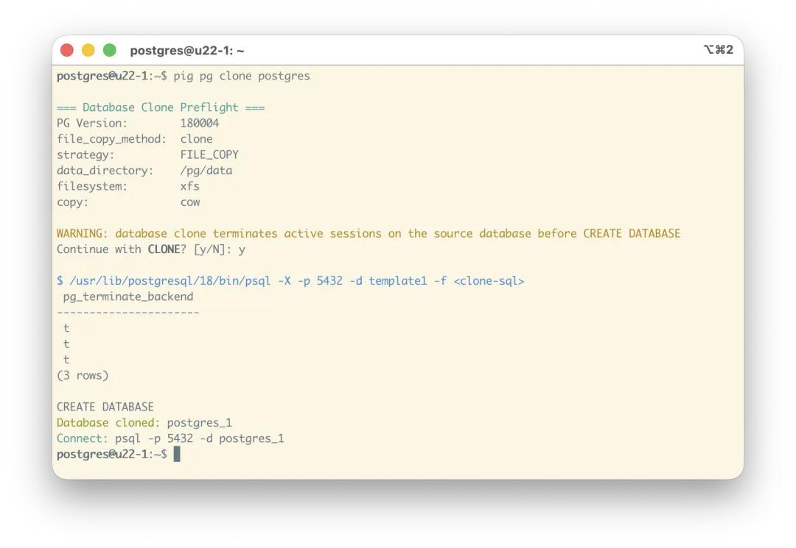
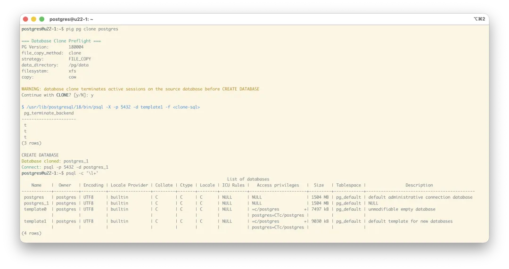
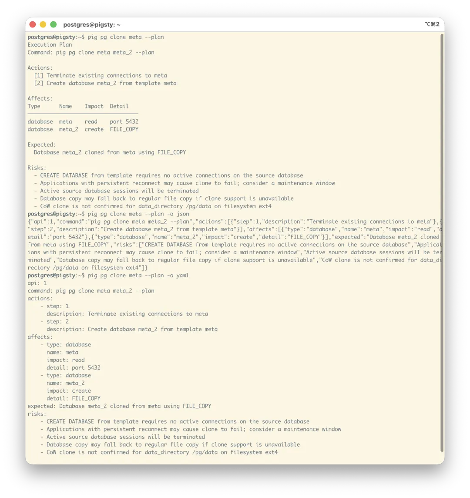
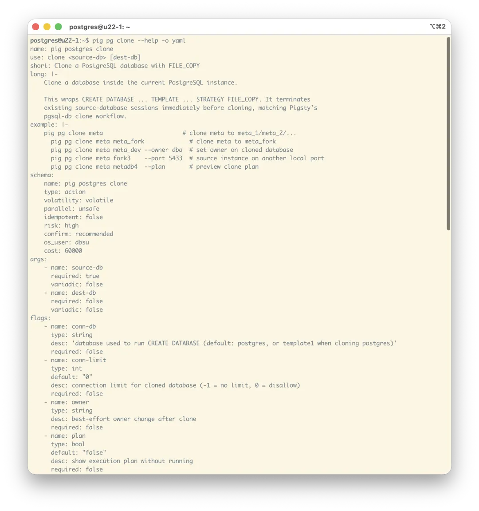
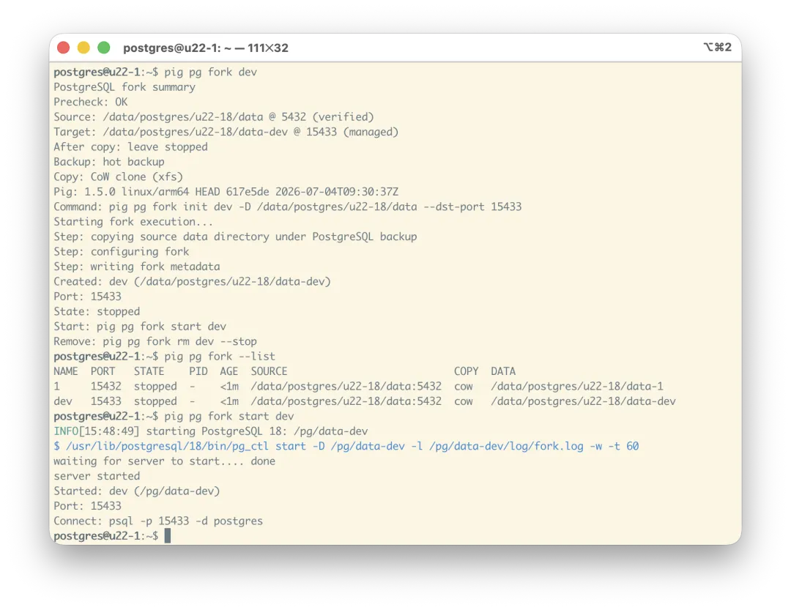
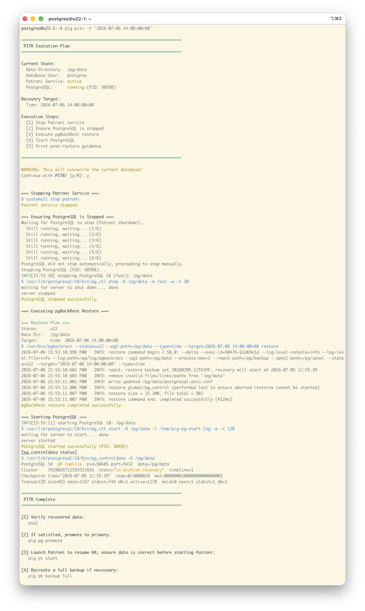

Six months ago, on January 8, 2026, I wrote [**Git for Data: Instant PostgreSQL Database and Instance Cloning**](/en/pg/pg-clone/), introducing a new feature in PostgreSQL 18 and Pigsty v4.0: instant database cloning. With filesystem copy-on-write (CoW) and PostgreSQL 18's new `file_copy_method = clone` setting, **you can clone a huge database in seconds without consuming additional storage**.

This is a particularly good fit for AI agents. As I wrote in [What Kind of Database Do AI Agents Need?](/en/db/agent-native-db/), ultra-low-cost database cloning is critical for counterfactual experiments. So when Pigsty 4.0 shipped, I added this capability to its PostgreSQL database provisioning workflow.

Today I saw [an article from Aliyun](https://mp.weixin.qq.com/s?__biz=Mzk2NDgzOTk3NA==&mid=2247523890&idx=1&sn=fdfe899fc6f7601f586b4ba32eaf147b&scene=21#wechat_redirect) announcing support for this feature in Alibaba Cloud RDS for PostgreSQL. I couldn't help laughing: that took them long enough. The feature itself is not complicated. It requires no kernel patch—just enable one setting in PostgreSQL 18 and add a `STRATEGY` option when creating the database. But simple as it sounds, a robust implementation still has a few edge cases to handle.

## A Few Improvements

Previously, cloning a database through Pigsty's IaC-style workflow was still somewhat cumbersome: first define the clone with another database as its template, then run the database creation workflow.

So for the Pig v1.5 release, I turned database cloning into one simple command: `pig pg clone`. If you have a database named `meta`, just run `pig pg clone meta`, and it automatically creates a clone.

You can, of course, customize its behavior with options—for example, by specifying the branch name. If you do not provide one, Pig generates names sequentially by appending an underscore and a number.

The command automatically detects whether instant cloning is both enabled and supported. At the moment, Pigsty on XFS satisfies those prerequisites. If so, Pig performs an instant clone. If not, it warns you, waits for confirmation, and performs a conventional clone instead. Use `-y` to skip the confirmation.

As long as the underlying filesystem supports CoW, such as XFS, cloning a database takes essentially constant time—usually a few hundred milliseconds—and consumes no additional space. New storage is allocated only for blocks actually dirtied by subsequent writes.

## Agent-Native CLI

This command-line tool is built specifically for DBAs and DBA agents. You could already clone a database with an Ansible playbook or Pigsty's `/pg/bin/pg-clone` shell script, but neither is as convenient as using the `pig` CLI directly.

For example, before executing an operation, you can use `--plan` to print the plan. It tells you what Pig will do and what risks are involved. You can also use `-o json` or `-o yaml` to return results in JSON or YAML.

Incidentally, both normal command output and help output are available as text, JSON, or YAML. That is especially useful to agents: they can explore the CLI and retrieve exactly the structured help they need. Every command in `pig` supports this.

I call this design an Agent-Native CLI, and I have written about it before.

## Instance-Level Forks

Database cloning is not the only related new feature worth mentioning. In [Git for Data: Instant PostgreSQL Database and Instance Cloning](/en/pg/pg-clone/), I also covered instant instance-level cloning, which I call a “fork.”

Run `pig pg fork dev`, and Pig creates an instance named `dev` from the current instance, assigning it a new random port. This is extremely useful when recovering from an accidental deletion: first create a temporary fork without consuming additional storage, then quickly run an incremental PITR on the fork to roll back and validate the result. Once you know the recovery is correct, perform it on the main instance.

PITR with `pig` is now very convenient as well. The example below performs an end-to-end point-in-time recovery to a specific timestamp, making PITR about as foolproof as it gets. You can still use `pig pgbackrest` when you want precise control over every operation.

This release of the `pig` CLI adds many management features, including operations for PostgreSQL, Patroni, and pgBackRest. They are now all exposed as Agent-Native CLI commands like `pg clone` and `pg fork`, making them equally convenient for human DBAs and AI agents. I will write a dedicated article about them in a few days.

## Further Reading

- [Git for Data: Instant PostgreSQL Database Cloning](/en/pg/pg-clone/)
- [Put Your AI Agent's State in a Database](/en/db/agent-state-db/)
- [What Kind of Database Do AI Agents Need?](/en/db/agent-native-db/)
