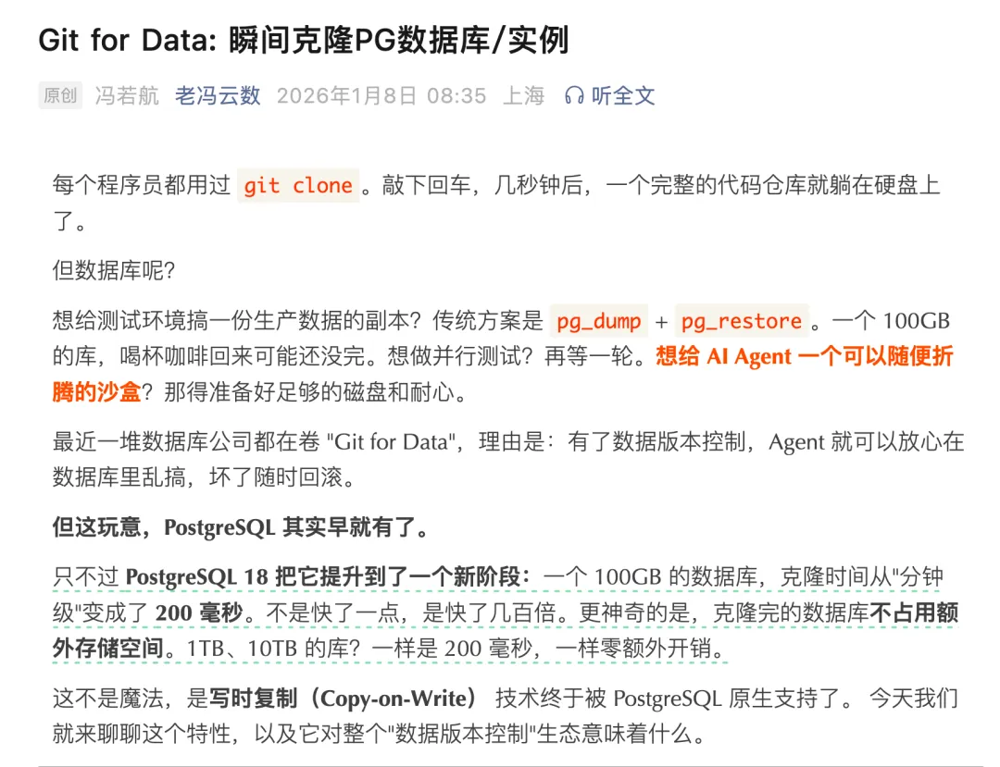
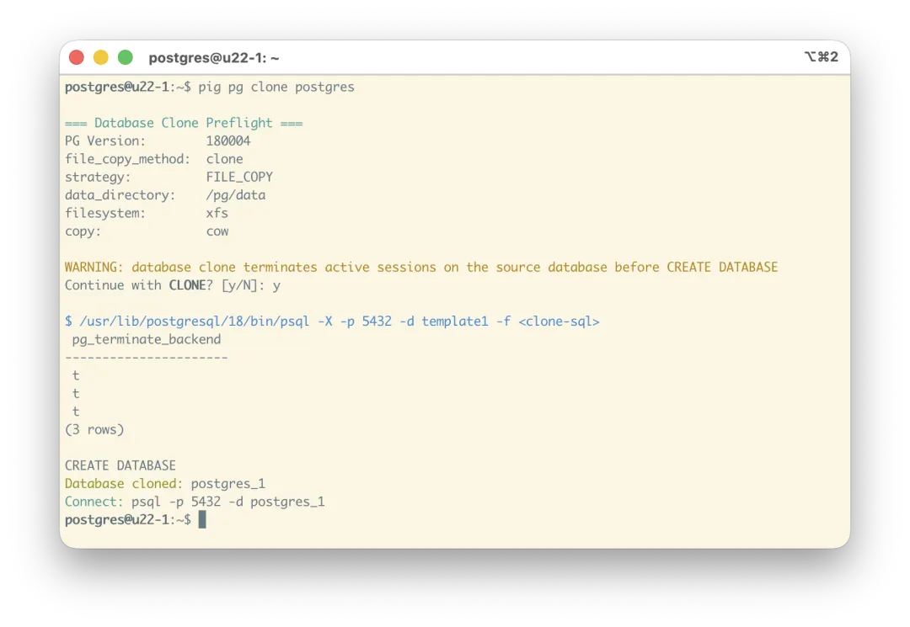
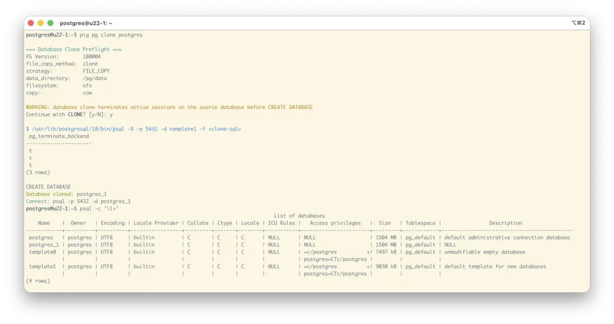
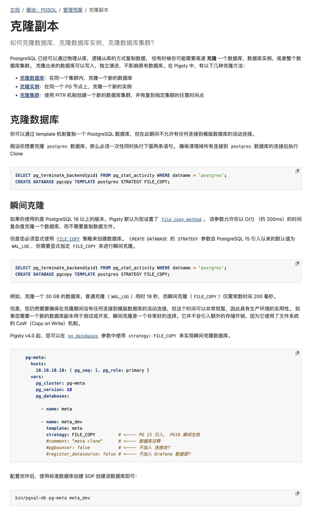
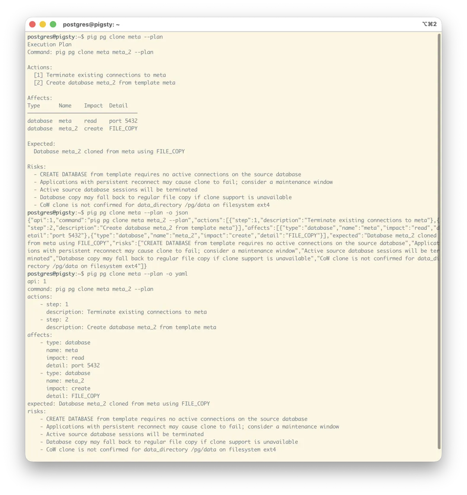
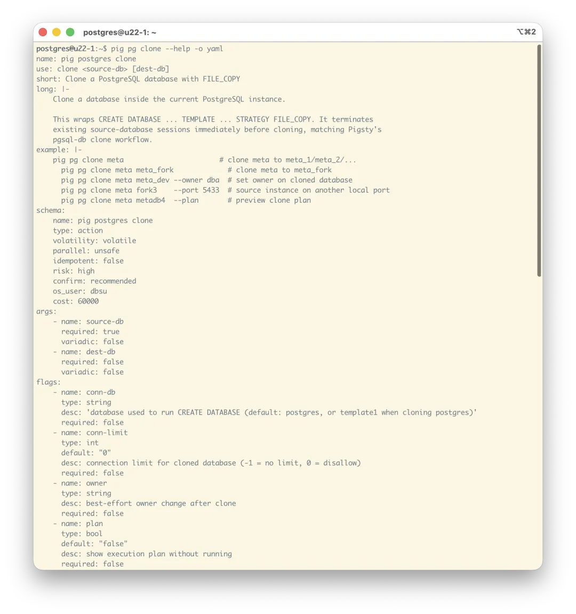
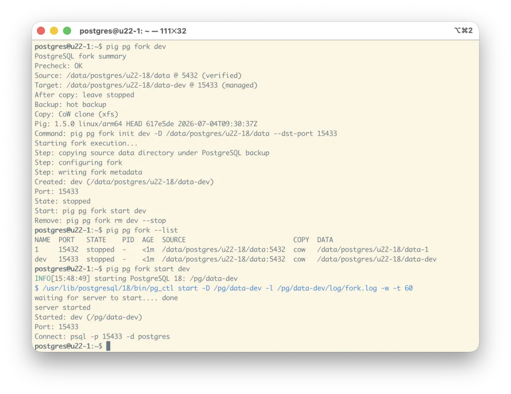
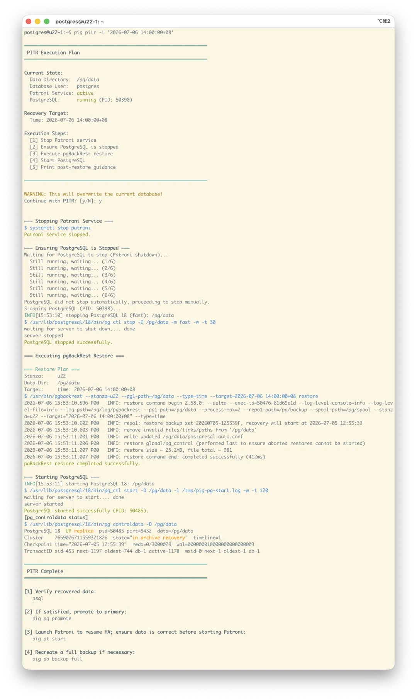

老冯在半年前（2026-01-08）写过一篇文章《[**Git for Data：瞬间克隆 PG 数据库与实例**](/pg/pg-clone/)》，介绍了 PostgreSQL 18 和 Pigsty v4.0 的一个新特性：瞬间克隆新数据库。利用文件系统 CoW 机制，以及 PG 18 的 `file_copy_method = clone` 新参数，**可以在秒级克隆一个非常大的数据库，而且不占用额外的存储**。

这玩意儿其实非常适合 AI Agent 使用。我在《[Agent 需要什么样的数据库](/db/agent-native-db/)》里提到过：极低成本的数据库克隆对于反事实推演至关重要。所以当时趁着 4.0 上线的时候，给 Pigsty 里 PG 数据库 Provisioning 的地方加上了这个功能。

今天看到阿里云数据库 [发了篇文章](https://mp.weixin.qq.com/s?__biz=Mzk2NDgzOTk3NA==&mid=2247523890&idx=1&sn=fdfe899fc6f7601f586b4ba32eaf147b&scene=21#wechat_redirect)说，他们在阿里云 RDS for PostgreSQL 上支持这个功能了。老冯看了直想笑：这个动作也太慢了。说起来其实这个功能不复杂，不需要改内核，只要在 PG 18 上启用一个参数，在创建数据库的时候加一个 `STRATEGY` 参数就可以实现。说是不复杂，但想做好，还是有几个边界条件要处理。

## 一些改进

之前要克隆数据库的时候，在 Pigsty 的 IaC 式操作里还是有些繁琐：首先你要定义一个数据库，把另一个数据库作为模板，然后执行数据库创建。

所以这次我趁着 pig v1.5 发布的机会，把数据库克隆做成了一个简单易用的命令：`pig pg clone`。简单地说，现在你有个数据库 `meta`，只要执行 `pig pg clone meta`，它就会自动生成一个克隆。

当然，你可以使用参数来定制行为，比如指定分支的名字；如果不指定，就按下划线后加数字的方式依次自动起名。

命令会自动检测是否启用并支持瞬间克隆（目前用 Pigsty + XFS 就满足前提）。如果满足，就执行瞬间克隆；不满足，就警告、等待确认，并执行普通克隆。`-y` 可以跳过确认。

只要底层用的是支持 CoW 的文件系统（比如 XFS），那么克隆一个数据库基本是常数时间耗时，通常几百毫秒，而且占用空间不会变大；只有后续真实写脏的数据块，才会真正开始占用新的空间。

## Agent Native CLI

当然，这个命令行工具的特点不一样：这是专门给 DBA 和 DBA Agent 设计的。之前你也可以用 Ansible Playbook，或者 Pigsty 提供的 Shell 脚本 `/pg/bin/pg-clone` 来执行克隆，但很显然都没有直接使用 `pig` 命令行工具方便。

比如，在执行操作之前，你可以使用 `--plan` 打印计划。它会告诉你会做什么事情、有什么风险。你还可以用 `-o json` 和 `-o yaml` 让它输出 JSON 和 YAML 格式的结果。

顺便一提，命令本体和 Help 输出也都可以使用 text、JSON、YAML 格式，因此 Agent 用起来会非常方便。因为它可以很轻松地用探索式方式，拿到所需的结构化帮助信息。`pig` 里所有命令都有这个功能。

这个设计，我之前称之为 Agent Native CLI，之前写了篇文章介绍过。

## 实例级 Fork

当然，除了 Database Clone，还有一个新的相关功能也值得一提。我在《[Git for Data：瞬间克隆 PG 数据库与实例](/pg/pg-clone/)》里也提到过，就是实例级瞬间克隆，我将其称作 “fork”。

这里，你只要执行 `pig pg fork dev`，就能从当前实例创建一个名为 `dev` 的实例，随机分配一个新的端口号。这个功能在误删处理的时候非常实用：你可以先临时分支一个实例（不占用额外存储），然后快速用增量 PITR 回滚验证；验证无误之后，再在主实例上执行。

顺便一提，现在使用 `pig` 做 PITR 也非常方便。比如下面，一条龙傻瓜式执行时间点恢复到特定时间点，把时间点恢复的门槛压到了地板。当然，你也可以使用 `pig pgbackrest` 精准控制每一个操作。

这次 `pig` 命令行工具发布，新增了很多管理功能，包括对 PostgreSQL、Patroni、pgBackRest 组件的各种管理。现在它们都封装成上面 `pg clone` 与 `pg fork` 这类 Agent Native CLI，同时方便人类 DBA 与 AI Agent 使用。过几天会专门写篇文章详细介绍一下。

## 参考阅读

- [Git for Data: 瞬间克隆PG数据库](/pg/pg-clone/)
- [把 Agent 的状态放进数据库](/db/agent-state-db/)
- [Agent 需要什么样的数据库？](/db/agent-native-db/)
