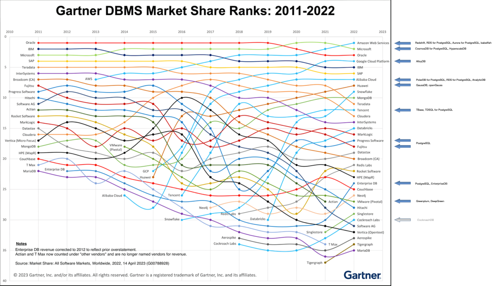
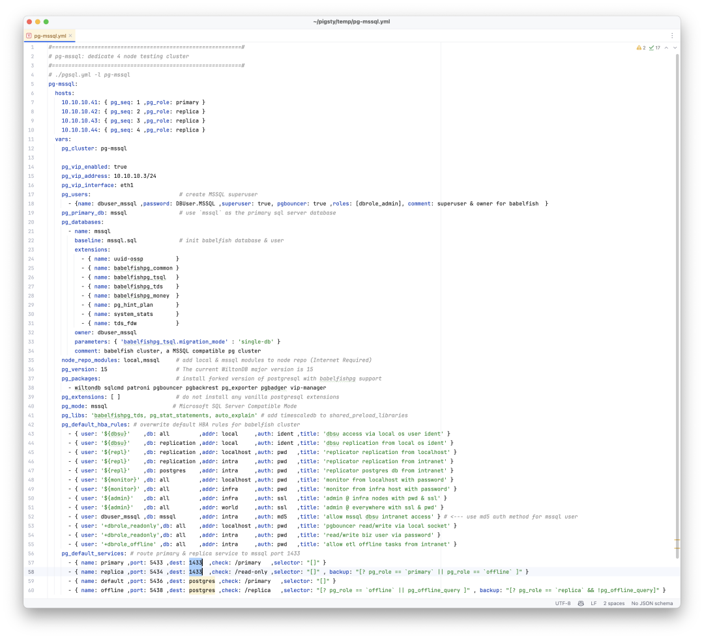
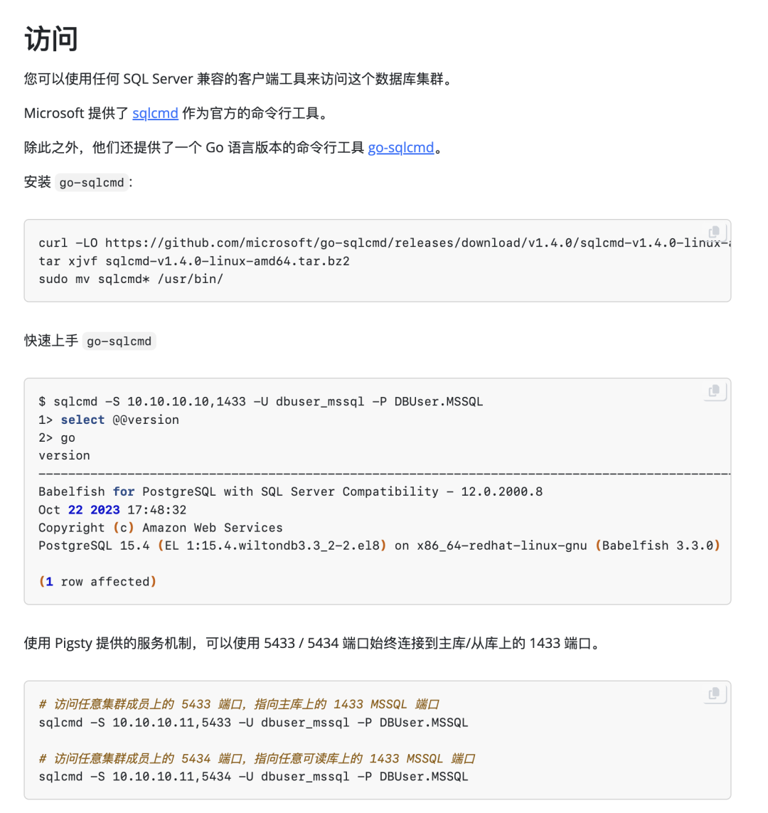
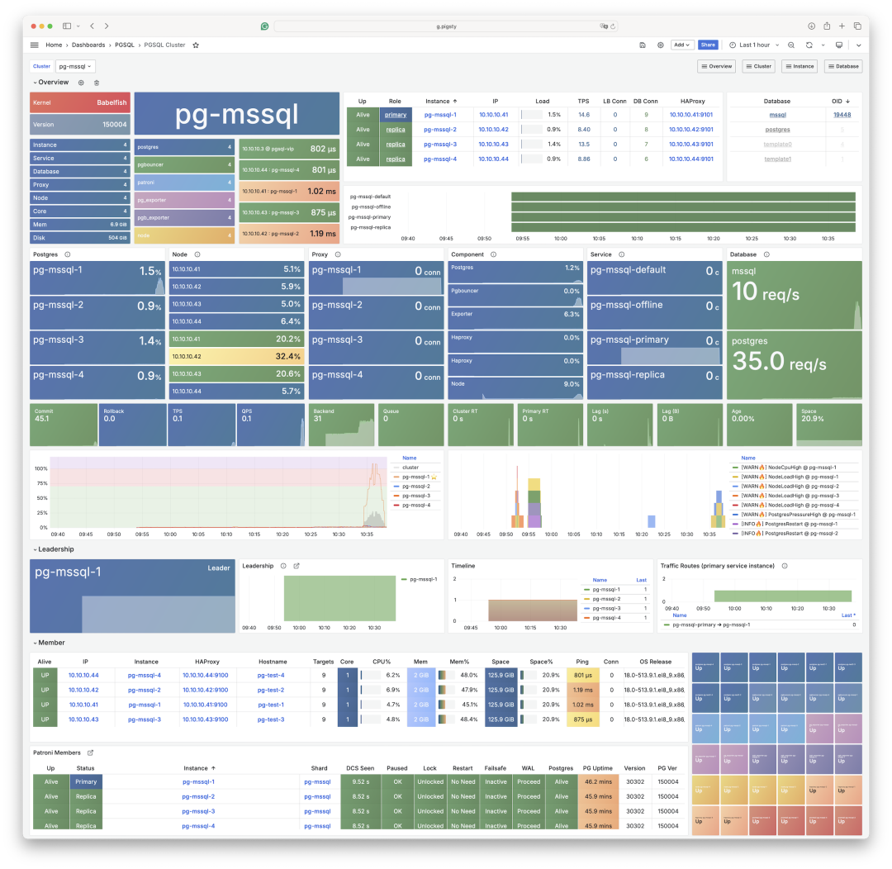

Many people don't have an intuitive impression of how far PostgreSQL's ecosystem has developed. Beyond [devouring the database world](/pg/pg-eat-db-world) and its all-encompassing extension ecosystem, PostgreSQL can directly replace Oracle, SQL Server, and MongoDB at the kernel level. MySQL is naturally even less of a concern.

Of course, when talking about which mainstream database faces the highest risk, that's undoubtedly **Microsoft's SQL Server**. MSSQL faces the most thorough replacement - directly at the wire protocol level. And the driving force behind this is AWS, Amazon Web Services.

--------

## Babelfish

While I've always criticized cloud providers for [**freeloading on open source**](/db/redis-oss/), I acknowledge this strategy is extremely effective. AWS took open-source PostgreSQL and MySQL kernels, swept through the database market, punching Oracle and kicking Microsoft, becoming the undisputed leader in database market share.

In recent years, AWS has played an even more devastating move - developing and integrating a BabelfishPG extension plugin that provides "**wire protocol**" level compatibility.



So-called **wire protocol compatibility** means clients don't need to change anything - they can still access SQL Server's 1433 port using MSSQL drivers and command-line tools (sqlcmd) to access clusters equipped with BabelfishPG. Even more remarkably, you can still use PostgreSQL's protocol language syntax from the original 5432 port, coexisting with SQL Server clients - bringing tremendous convenience for migration.

--------

## WiltonDB

Of course, Babelfish isn't simply a PG extension plugin - it makes minor modifications and adaptations to the PostgreSQL kernel. It provides TSQL syntax support, TDS wire protocol support, data types, and other function support through four extension plugins.


Compiling and packaging such kernels and extensions across different platforms isn't easy, so WiltonDB - a Babelfish distribution - does exactly that, compiling and packaging BabelfishPG as RPM/DEB/MSI packages usable on EL 7/8/9, Ubuntu systems, and even Windows.

--------

## Pigsty v3

Of course, having only RPM/DEB packages is still far from providing production-grade services. In the recently released Pigsty v3, we provide the capability to replace native PostgreSQL kernels with BabelfishPG.

Creating such an MSSQL cluster requires only modifying a few parameters in the cluster definition, then still deploying foolproof-style - similar to master-slave setup, extension installation, parameter optimization, user configuration, HBA rule setting, even service traffic distribution - all automatically configured according to the configuration file with one-click deployment.



In practice, you can completely treat a Babelfish cluster as an ordinary PostgreSQL cluster for use and management. The only difference is that clients can choose whether to use TSQL protocol support on port 1433, in addition to using the 5432 PGSQL protocol.



For example, you can easily configure to redirect the Primary service originally pointing to connection pool port 6432 to port 1433, achieving seamless TDS/TSQL traffic switching under failover.



This means capabilities originally belonging to PostgreSQL RDS - high availability, point-in-time recovery, monitoring systems, IaC management, SOP playbooks, even countless extension plugins - can all be grafted and integrated onto SQL Server kernel versions.

--------

## How to Migrate?

Besides powerful kernels and extensions like Babelfish, PostgreSQL's ecosystem has a thriving tools ecosystem. If you want to migrate from SQL Server or MySQL to PostgreSQL, I highly recommend a killer migration tool: [**PGLOADER**](https://pgloader.readthedocs.io/en/latest/ref/mssql.html).

This migration tool is ridiculously foolproof - in ideal situations, you only need **connection strings** for both databases to complete migration. Yes, really not a single extra word needed.

```bash
pgloader mssql://user@mshost/dbname pgsql://pguser@pghost/dbname
```

With MSSQL-compatible kernel extensions and migration tools, migrating existing SQL Server becomes very easy.

--------

## Beyond MSSQL, There's More...

Besides MSSQL, PostgreSQL's ecosystem also has Oracle replacements: PolarDB O and IvorySQL; MongoDB replacements: FerretDB and PongoDB; plus over 300 extension plugins providing various functionalities. In fact, almost the entire database world is being impacted by PostgreSQL - except those carving out different ecological niches (SQLite, DuckDB, MinIO) or simply PostgreSQL shells (Supabase, RDS, Aurora/Polar).

Our recently released open-source RDS PostgreSQL solution - Pigsty - recently supports these PG replacement kernels, allowing users to provide MSSQL, Oracle, MongoDB, Firebase compatibility replacement capabilities in one PostgreSQL deployment.

Besides MSSQL, PostgreSQL's ecosystem also has Oracle replacements: PolarDB O and IvorySQL; MongoDB replacements: FerretDB and PongoDB; [plus over 300 extension plugins providing various functionalities](https://pgext.cloud/zh/list).


In fact, almost the entire database world is being impacted by PostgreSQL - except those carving out different ecological niches (SQLite, DuckDB, MinIO) or simply PostgreSQL shells (Supabase, RDS, Aurora/Polar).


Our recently released open-source RDS PostgreSQL solution - Pigsty - recently supports these PG replacement kernels, allowing users to provide MSSQL, Oracle, MongoDB, Firebase compatibility replacement capabilities in one PostgreSQL deployment.


But given space constraints, that's content for the next few articles.