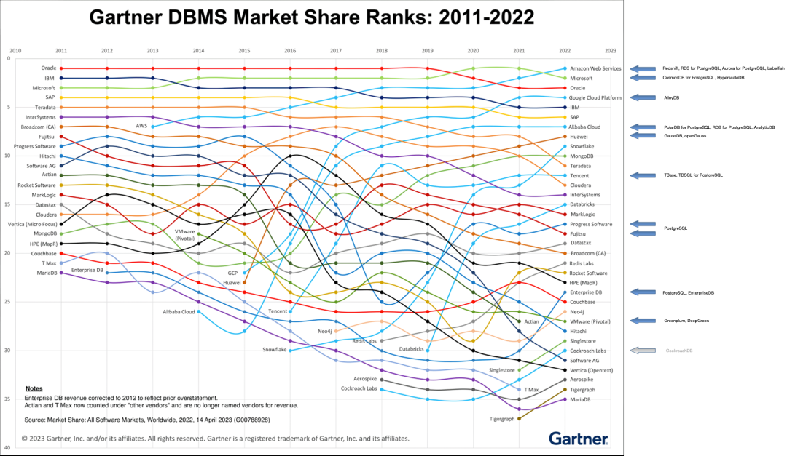
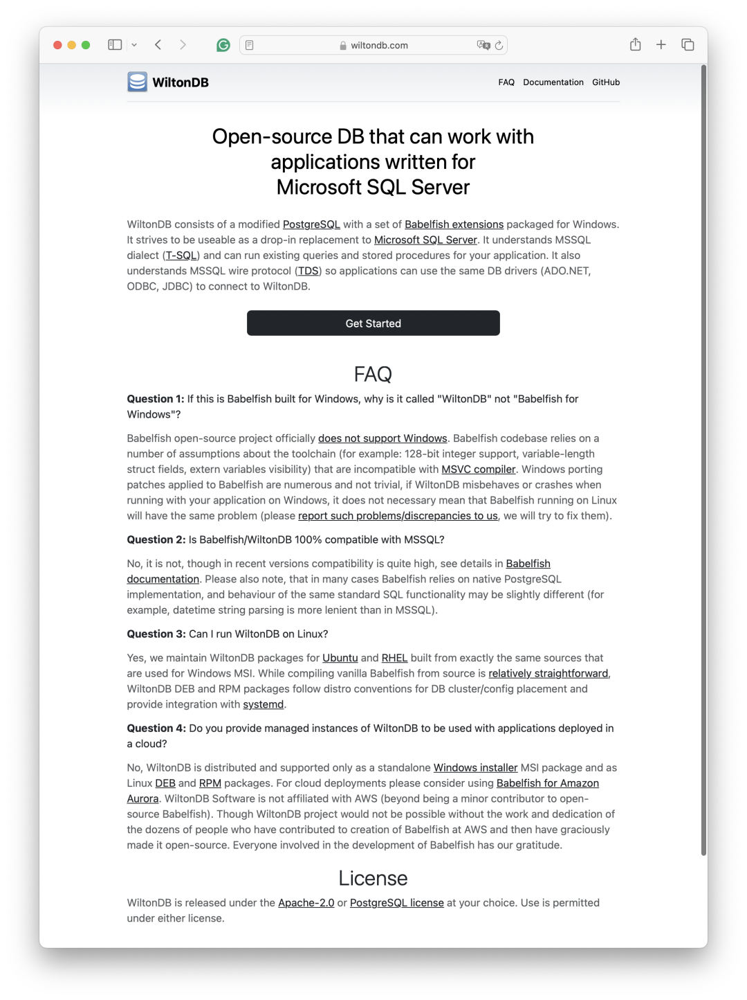
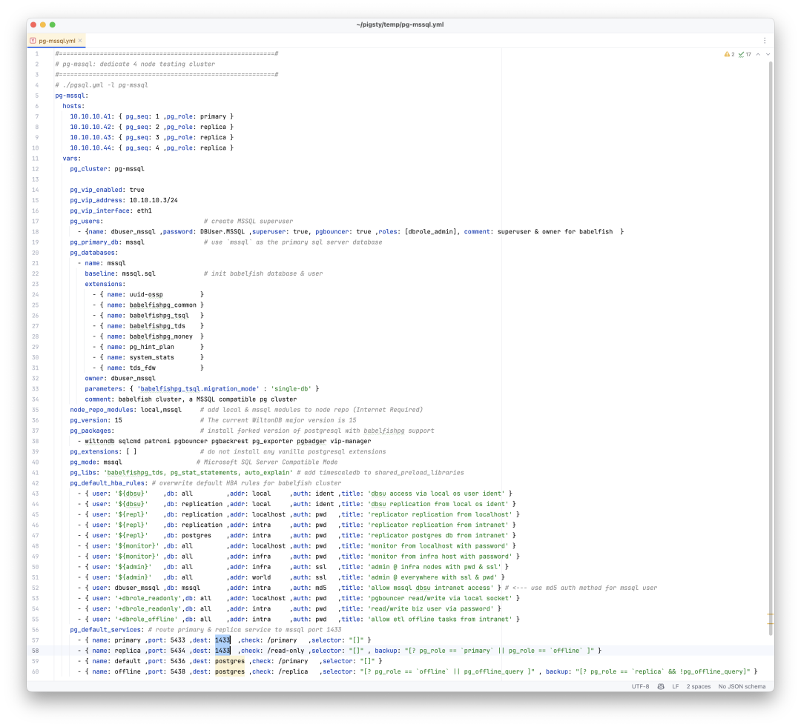
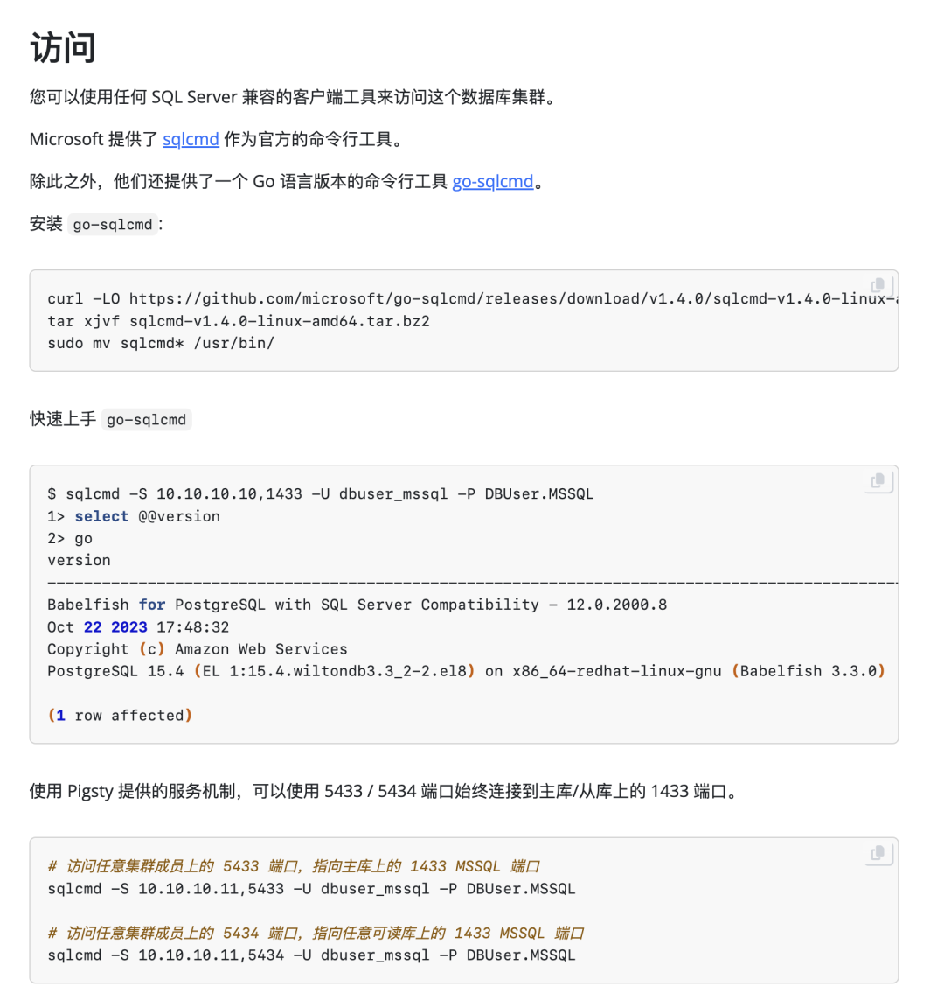
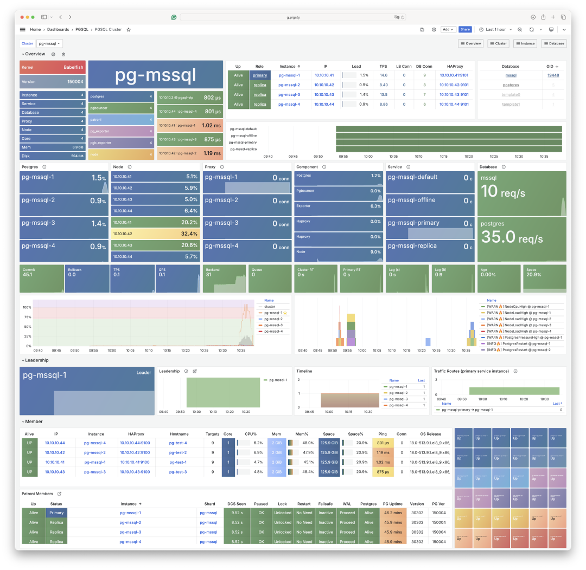
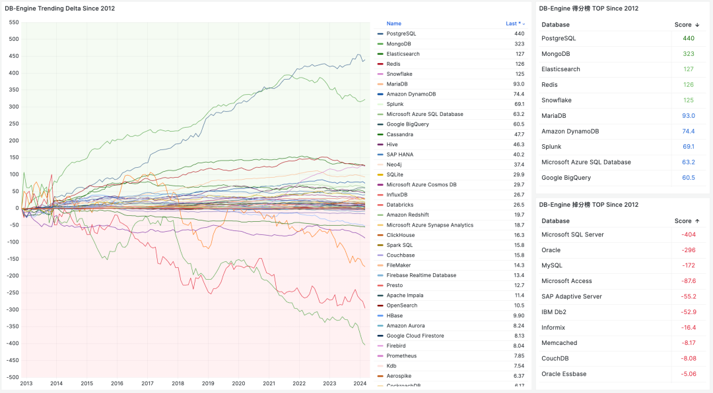

许多人对于 PostgreSQL 生态已经发展到什么阶段并没有一个直观的印象 —— 除了 [吞噬数据库世界](/pg/pg-eat-db-world)，囊括万物的扩展生态之外，PostgreSQL 还可以直接从内核层面，替换掉 Oracle，SQL Server 与 MongoDB，当然 MySQL 就更不在话下了。

当然要说主流数据库中，暴露风险最高的是谁，那毫无疑问是**微软的 SQL Server 了**。MSSQL 被替代的是最彻底的 —— 直接在 WireProtocol 层面被替代了。而主导这件事的是 AWS，亚马逊云服务。


--------

## Babelfish

虽然我一直吐槽云厂商[**白嫖开源**](/db/redis-oss/)，但我承认这种策略是极为有效的 ——
AWS 拿着开源的 PostgreSQL 和 MySQL 内核，一路杀穿数据库市场，拳打 Oracle ，脚踢微软，成为数据库市场份额毫无争议的一哥。
而这两年 AWS 更是玩了一招釜底抽薪，开发整合了一个 BabelfishPG 的扩展插件，提供“**线缆协议**”级别的兼容性。




所谓**线缆协议兼容**，就是指客户端什么都不用改，依然访问 SQL Server 1433 端口，使用 MSSQL 的驱动与命令行工具（sqlcmd）访问加装 BabelfishPG 的集群就可以了。
而且更神奇的是，你依然可以使用 PostgreSQL 的协议语言语法，从原来的 5432 端口访问，和 SQL Server 的客户端并存 —— 这就给迁移带来了极大的便利条件。


--------

## WiltonDB

当然 Babelfish 并不是一个单纯的 PG 扩展插件，它对 PostgreSQL 内核进行了少量修改与适配。并通过四个扩展插件分别提供了 TSQL 语法支持，TDS 线缆协议支持，数据类型以及其他函数支持。



在不同的平台上编译打包这样的内核与扩展并不是轻松容易的一件事，因此 WiltonDB —— 一个 Babelfish 的发行版就做了这件事，将 BabelfishPG 编译打包为 EL 7/8/9 与 Ubuntu 系统，甚至 Windows 下可用的 RPM / DEB / MSI 包。


--------

## Pigsty v3

当然，只有 RPM / DEB 包，距离提供生产级的服务还依然差得太远，而在最近发布的 Pigsty v3 中，我们提供了将原生 PostgreSQL 内核替换为 BabelfishPG 的能力。

创建这样一套 MSSQL 集群，所需的不过是在集群定义中修改几个参数。然后依然是一件傻瓜式拉起 —— 类似主从搭建， 扩展安装，参数优化，用户配置，HBA规则设定，甚至是服务流量分发，都会自动根据配置文件一键拉起。



在使用实践上，你完全可以把 Babelfish 集群当作一套普通的 PostgreSQL 集群来使用与管理。唯一的区别就是客户端在使用 5432 PGSQL 协议的基础上，还可以选择是否要使用 1433 端口上的 TSQL 协议支持。



例如，您可以轻松通过配置，将原本固定指向主库连接池 6432 端口的 Primary 服务重定向到 1433 端口，从而实现故障切换下的无缝 TDS / TSQL 流量切换。



这意味着原本属于 PostgreSQL RDS 的能力 —— 高可用，时间点恢复，监控系统，IaC管控，SOP预案，甚至无数的扩展插件都可以嫁接融合到 SQL Server 版本的内核之上。


--------

## 如何迁移？


PostgreSQL 生态除了有Babelfish这样给力的内核与扩展，还有着繁荣的工具生态。如果要想从 SQL Server 或 MySQL 迁移到 PostgreSQL ，我强烈推荐一款杀手级迁移工具：[**PGLOADER**](https://pgloader.readthedocs.io/en/latest/ref/mssql.html)。

这款迁移工具傻瓜化到了离谱的程度，在理想的情况下，你只需要两个数据库的**连接串**，就可以完成迁移了。对，真的是一行多余的废话都没有。

```bash
pgloader mssql://user@mshost/dbname pgsql://pguser@pghost/dbname
```

有了 MSSQL 兼容内核扩展，又有了迁移工具，存量的 SQL Server 搬迁会变的非常容易。


--------

## 除了 MSSQL，还有……

除了 MSSQL，PostgreSQL 生态还有旨在替代 Oracle替代：PolarDB O 与 IvorySQL，旨在替代 MongoDB 的 FerretDB 与 PongoDB。以及三百多个提供各式各样功能的扩展插件。实际上，几乎整个数据库世界都在受到 PostgreSQL 的冲击 —— 除了那些与 PostgreSQL 错开生态位（SQLite，DuckDB，MinIO），或者干脆就是 PostgreSQL 套壳（Supabase，RDS，Aurora/Polar）的数据库。

我们最近发布的开源 RDS PostgreSQL 方案 —— Pigsty 最近就支持了这些 PG 替换内核，允许用户在一套 PostgreSQL 部署中提供 MSSQL，Oracle，MongoDB，Firebase，MongoDB 的兼容性替代能力。不过限于篇幅，那就是后面几篇要介绍的内容了。


除了 MSSQL，PostgreSQL 生态还有旨在替代 Oracle替代：PolarDB O 与 IvorySQL，旨在替代 MongoDB 的 FerretDB 与 PongoDB。[以及三百多个提供各式各样功能的扩展插件。](https://pgext.cloud/zh/list)


实际上，几乎整个数据库世界都在受到 PostgreSQL 的冲击 —— 除了那些与 PostgreSQL 错开生态位（SQLite，DuckDB，MinIO），或者干脆就是 PostgreSQL 套壳（Supabase，RDS，Aurora/Polar）的数据库。



我们最近发布的开源 RDS PostgreSQL 方案 —— Pigsty 最近就支持了这些 PG 替换内核，允许用户在一套 PostgreSQL 部署中提供 MSSQL，Oracle，MongoDB，Firebase，MongoDB 的兼容性替代能力。


不过限于篇幅，那就是后面几篇要介绍的内容了。