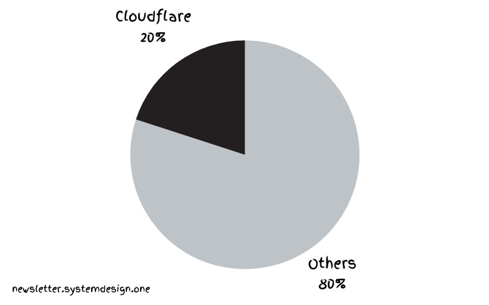
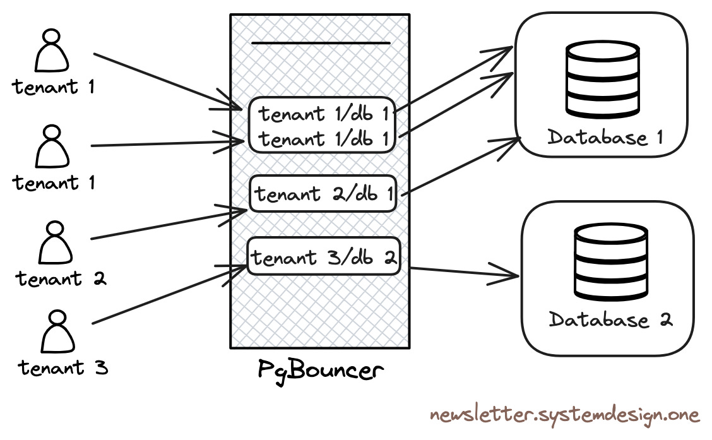
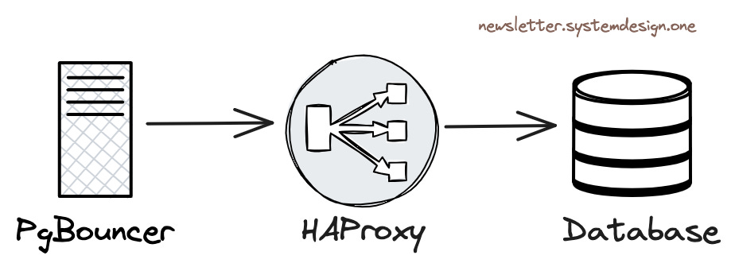
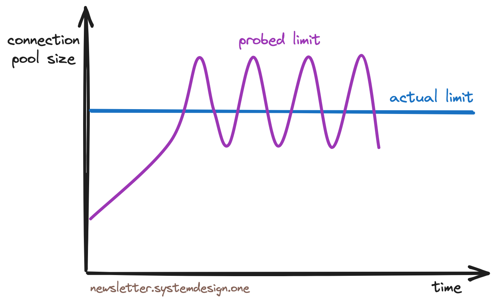
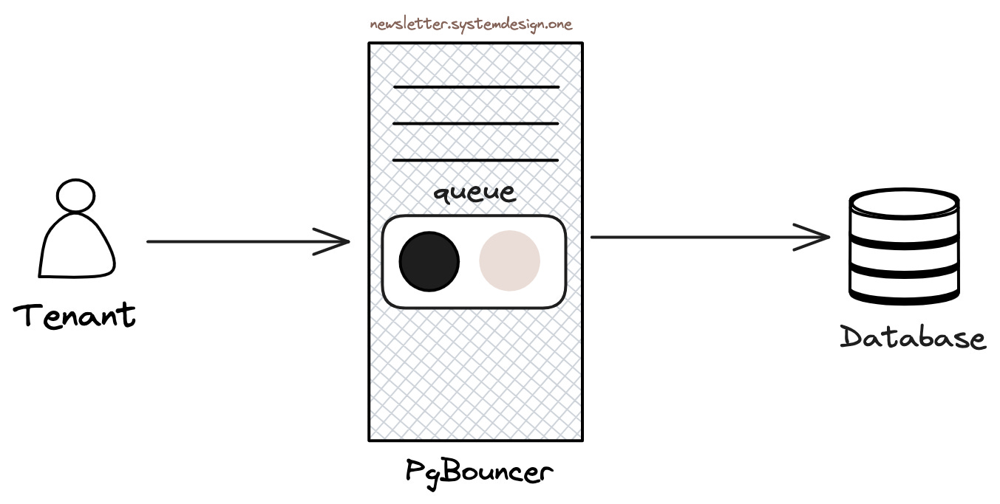
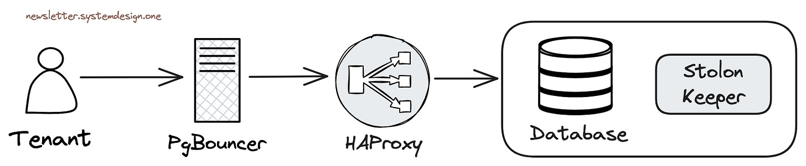

> This article outlines how Cloudflare scaled to support 55 million requests per second using 15 PostgreSQL clusters.

In July 2009, in California, USA, a startup team created a Content Delivery Network (CDN) called Cloudflare to accelerate internet requests, making network access more stable and faster. They faced various challenges during their early development, yet their growth rate was remarkably impressive.

> Global Internet Traffic Overview

Now they handle 20% of internet traffic - 55 million HTTP requests per second. And they achieved this using just 15 PostgreSQL clusters.

Cloudflare uses PostgreSQL to store service metadata and handle OLTP workloads. However, supporting tenants with various different load types in the same cluster is challenging. A **cluster** is a group of database servers, and a **tenant** is an isolated data space dedicated to specific users or user groups.

------

## PostgreSQL's Scalability

Here's how they pushed PostgreSQL's scalability to its limits.

### 1. Contention

Most clients compete with each other for Postgres connections. But Postgres connections are expensive because each connection is an independent operating system-level process. Moreover, each tenant has unique workload types, making it difficult to create a global threshold for rate limiting.

Furthermore, manually limiting misbehaving tenants is enormous work. A tenant might launch an expensive query, blocking neighboring tenants' queries and starving them. Once queries reach the database server, isolating them becomes very difficult.

> Connection Pooling with PgBouncer

Therefore, they use *PgBouncer* as a connection pool in front of Postgres. **PgBouncer** acts as a TCP proxy, pooling Postgres connections. Tenants connect to PgBouncer instead of directly to Postgres, limiting the number of Postgres connections and preventing connection starvation.

Additionally, PgBouncer avoids the expensive overhead of creating and destroying database connections by using persistent connections, and is used to throttle tenants launching expensive queries at runtime.

### 2. Thundering Herd

When many clients simultaneously query the server, the **Thundering Herd** problem occurs, causing database performance degradation.

> [Thundering Herd](https://en.wikipedia.org/wiki/The_Thundering_Herd_(1925_film))

When applications are redeployed, their state initializes and applications create many database connections at once. When tenants compete for Postgres connections, it causes the thundering herd phenomenon. Cloudflare uses *PgBouncer* to limit the number of Postgres connections specific tenants can create.

### 3. Performance

Cloudflare doesn't run PostgreSQL in the cloud, but uses bare-metal physical machines without any virtualization overhead to achieve the best performance.

> Load Balancing Traffic Between Database Instances

Cloudflare uses *HAProxy* as a Layer 4 load balancer. PgBouncer forwards queries to HAProxy, and the HAProxy load balancer distributes traffic between cluster primary instances and read-only replicas.

### 4. Concurrency

If many tenants launch concurrent queries, performance degrades.

> Congestion Avoidance Throttling Algorithm

Therefore, Cloudflare uses the *TCP Vegas congestion control algorithm* to throttle tenants. This algorithm works by first sampling each tenant's transaction round-trip response time (RTT) to Postgres, then continuously adjusting connection pool size as long as RTT doesn't degrade, achieving throttling before resource exhaustion.

### 5. Queuing

Cloudflare uses queues at the PgBouncer level to queue queries. Query order in the queue depends on their historical resource usage - in other words, queries requiring more resources are placed at the back of the queue.

> Ordering Queries in Priority Queue

Cloudflare only enables priority queues during traffic peaks to prevent resource starvation. In other words, during normal traffic, queries won't be permanently stuck at the back of the queue.

This approach improves latency for most queries, though tenants launching expensive queries during traffic peaks will observe higher latency.

### 6. High Availability

Cloudflare uses *Stolon* cluster management for Postgres high availability.

> High Availability of Data Layer with Stolon

[Stolon](https://github.com/sorintlab/stolon) can set up Postgres master-slave replication and handle leader (primary) election and failover when issues arise.

Each database cluster here replicates to two regions, with three instances per region.

Write requests are routed to the primary in the main region, then asynchronously replicated to the secondary region. Read requests are routed to be processed in the secondary region.

Cloudflare performs inter-component connectivity testing to proactively discover network partition issues, conducts chaos testing to optimize system resilience, and configures redundant network switches and routers to avoid network partitions.

When failover completes and the primary instance comes back online, they use the *pg_rewind* tool to replay missed write changes, resynchronizing the old primary with the cluster.

Cloudflare's Postgres primary and replica instances total over 100 machines. They use a combination of operating system resource management, queueing theory, congestion control algorithms, and even PostgreSQL statistics to achieve PostgreSQL scalability.

------

## Evaluation and Discussion

This is a valuable experience sharing, mainly introducing how to use PgBouncer to solve PostgreSQL's scalability problems. 55 million QPS + 20% of internet traffic sounds like quite a scale. Though from a PostgreSQL expert's perspective, the practices described here are somewhat simple and crude, this article does raise a meaningful question - PostgreSQL's **scalability**.

### PostgreSQL's Current Scalability Status

PostgreSQL enjoys a reputation for both vertical and horizontal scalability capabilities. For read requests, PostgreSQL has no scalability issues - because reads and writes don't block each other, so read-only query throughput almost scales linearly with invested resources (CPU), whether vertically adding CPU/memory or horizontally scaling with more replicas.

PostgreSQL's write scalability isn't as strong as reads. Single-machine WAL writing/replay speed hits software bottlenecks at 100 MB/s ~ 300 MB/s - but for regular production OLTP loads, this is already a large value. As reference, Tantan, an app with 200 million users and 10 million daily active users, has all database writes' structured data rate around 120 MB/s. The PostgreSQL community is also discussing further expanding this bottleneck through DIO/AIO and parallel WAL replay. Users can also consider using Citus or other sharding middleware to achieve write scaling.

For capacity, PostgreSQL's scalability mainly depends on storage, with no inherent bottlenecks. With current NVMe SSD single cards at 64TB, combined with compression cards supporting hundred-TB data capacity, there's no problem. Larger capacity can be supported using RAID or multiple tablespace approaches. The community has reported many hundred-TB-scale OLTP instances, with scattered PB-level instances. Large instance challenges are mainly in backup management and space maintenance, not performance.

In the past, PostgreSQL's scalability was particularly criticized for **massive connection support** (significantly improved after PostgreSQL 14). PostgreSQL, like Oracle, uses a multi-process architecture by default. This design has better reliability, but when facing massive high-concurrency scenarios, this model becomes a drag.

Internet scenarios mainly involve massive short connections for database access: creating a connection for each query, then destroying the connection after execution - PHP used to work this way, so it paired well with MySQL's thread model. But for PostgreSQL, massive backend processes and frequent process creation/destruction waste significant software/hardware resources, resulting in underwhelming performance in such scenarios.

### Connection Pooling - Solving High Concurrency Issues

PostgreSQL recommends using connection counts roughly twice the CPU core count by default, typically in the range of dozens to hundreds. Internet scenarios with thousands or tens of thousands of client connections directly connecting to PostgreSQL would create significant additional burden. Connection pooling emerged to solve this problem - it can be said that connection pooling is a **must-have** for using PostgreSQL in internet scenarios, capable of turning the mundane into magic.

> Note that PostgreSQL doesn't lack high throughput support - the key issue is the number of concurrent connections. In "How Powerful is PostgreSQL Really?", we pressure-tested sysbench point query throughput peaks of 2.33 million using ~96 connections on a 92 vCPU server. Beyond available resources, this maximum throughput slowly declines as concurrency further increases.

Using connection pooling has significant benefits: First, tens of thousands of client connections can be pooled and converged into several active server connections (using transaction-level connection pooling), greatly reducing process count and overhead on the operating system, avoiding process creation/destruction overhead. Second, concurrent contention significantly reduces due to fewer active connections, further optimizing performance. Third, sudden load peaks queue at the connection pool rather than directly overwhelming the database, reducing avalanche probability and improving system stability.

### Performance and Bottlenecks

I had extensive PgBouncer best practices experience at Tantan. We had a core database cluster with 500K QPS across the entire cluster, 20,000 client connections to the primary, and write TPS around 50,000. Such load would immediately overwhelm the database if hit directly on Postgres. Therefore, between applications and databases, there's a PgBouncer connection pool middleware. All 20,000 client connections, after connection pool **transaction pooling**, required only 5-8 active server connections to support all requests, with CPU usage around 20% - a tremendously significant performance improvement.

PgBouncer is a lightweight connection pool deployable on either client-side or database-side. PgBouncer itself has a QPS/TPS bottleneck around 30-50K due to using single-process mode. To avoid PgBouncer's single-point issues and bottlenecks, we used 4 idempotent PgBouncer instances on the core primary, distributing traffic evenly through HAProxy to these four PgBouncer connection pools before pooling to the database primary for processing. However, for most scenarios, a single PgBouncer process's 30K QPS processing capability is more than adequate.

### Management Flexibility

PgBouncer's huge advantage is providing User/Database/Instance level query response time metrics (**RT**). This is a core metric for performance measurement, and for earlier PostgreSQL versions, statistics from PgBouncer were the only way to obtain such data. Though users can get query group RT through the `pg_stat_statements` extension, and PostgreSQL 14+ can obtain database-level session active time to calculate transaction RT, and emerging eBPF can also accomplish this, PgBouncer's performance monitoring data remains very important reference for database management.

PgBouncer connection pooling provides not only performance improvements but also management handles for fine control. For example, in online database migration without downtime, if online traffic completely accesses through connection pools, you can smoothly redirect old cluster read-write traffic to new clusters by simply modifying PgBouncer configuration files, without requiring immediate business participation in configuration changes and service restarts. You can also modify Database/User parameters in connection pools like Cloudflare's example to achieve throttling capabilities. If a database tenant behaves poorly, affecting the entire shared cluster, administrators can easily implement throttling and blocking capabilities in PgBouncer.

### Other Alternatives

PostgreSQL's ecosystem has other connection pool products. PgPool-II, contemporary with PgBouncer, was once a strong competitor: it provided more powerful load balancing/read-write splitting capabilities and could fully utilize multi-core capabilities, but was invasive to PostgreSQL databases themselves - requiring extension installation, and once had significant performance penalties (30%). So in the connection pool showdown, simple and lightweight PgBouncer became the winner, occupying the mainstream ecological niche for PostgreSQL connection pools.

Besides PgBouncer, new PostgreSQL connection pool projects continue emerging, such as Odyssey, pgcat, pgagroal, ZQPool, etc. I very much look forward to a fully PgBouncer-compatible high-performance/more user-friendly drop-in replacement.

Additionally, many programming language standard library database drivers now include built-in connection pooling, plus PostgreSQL 14's improvements reducing multi-process overhead, and exponential hardware performance growth (now there are 512 vCPU servers, memory isn't scarce either). So sometimes not using connection pools and directly hitting with thousands of connections is also a viable option.

### Can I Use Cloudflare's Practices?

With continuous hardware performance improvements, software architecture optimizations, and gradual popularization of management best practices - high availability, high concurrency, high performance (scalability) are old topics for internet companies, basically not new technology anymore.

For example, nowadays, any junior DBA/ops person using Pigsty to deploy a PostgreSQL cluster can easily achieve this, including Cloudflare's mentioned PgBouncer connection pooling and Stolon's superior replacement Patroni for high availability components - all out-of-the-box. With adequate hardware, easily handling massive concurrent millions of requests isn't a dream.

> In the early 2000s, an Apache server could only handle a pitiful one or two hundred concurrent requests. Even the best software struggled with tens of thousands of concurrent connections - the industry had the famous **C10K high concurrency** problem. Anyone achieving thousands of concurrent connections was an industry expert. But with Epoll and Nginx emerging in 2003/2004, "high concurrency" was no longer a challenge - any beginner learning Nginx configuration could achieve levels that masters years ago wouldn't dare dream of - Swedish Horse Programmer "[Cloud Providers' View of Customers: Poor, Idle, and Unloved](https://mp.weixin.qq.com/s?__biz=MzU5ODAyNTM5Ng==&mid=2247486387&idx=1&sn=20ac92e33ed5a6b8e3120e99aefaf1cc&scene=21#wechat_redirect)"

This is just like how nowadays any newbie can use Nginx to achieve Web massive requests and high concurrency that httpd masters previously wouldn't dare imagine. PostgreSQL's scalability has also entered thousands of households with PgBouncer's popularization.

For example, in Pigsty, by default, all PostgreSQL instances are 1:1 deployed with PgBouncer instances using transaction pooling mode and included in monitoring. Default Primary and Replica services also access Postgres databases through PgBouncer. Users don't need to worry too much about PgBouncer-related details - for example, PgBouncer databases and users are automatically maintained when creating Postgres databases/users through playbooks. Common configuration considerations and pitfalls are also avoided in preset configuration templates, striving for out-of-the-box experience.

Of course, for non-internet scenario applications, PgBouncer isn't essential. And while default Transaction Pooling performs excellently, it sacrifices some session-level functionality. So you can completely configure Primary/Replica services to directly connect to Postgres, bypassing PgBouncer; or use Session Pooling mode with the best compatibility.

Overall, PgBouncer is indeed a very practical PostgreSQL ecosystem tool. If your system has high requirements for PostgreSQL client concurrent connections, be sure to try this middleware when testing performance.

> Original: [How Cloudflare Supports 55M QPS with 15 PostgreSQL Clusters](https://newsletter.systemdesign.one/p/postgresql-scalability)