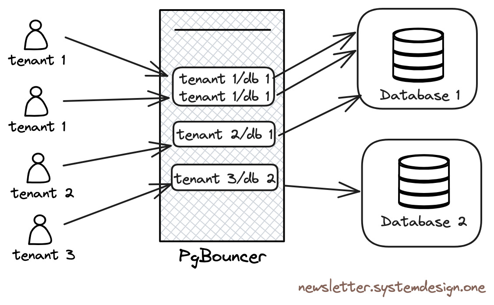
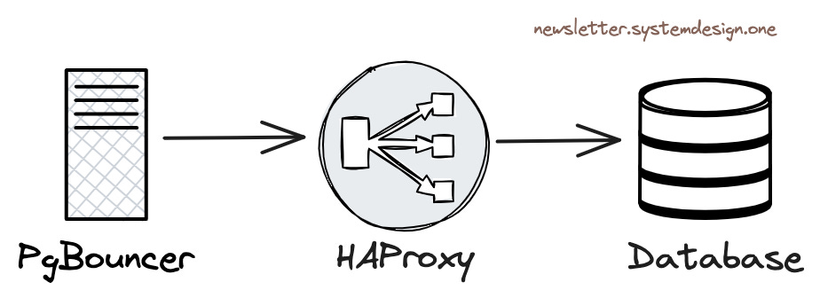
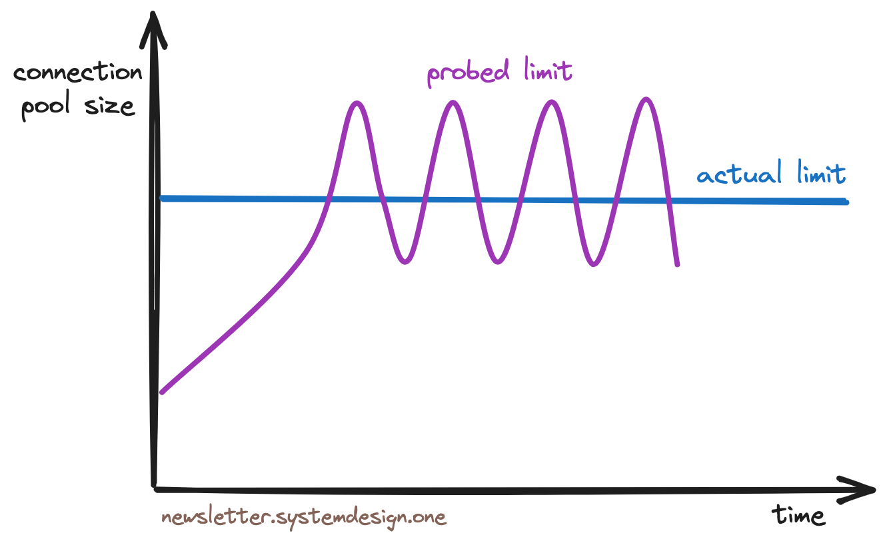

> 本文概述了 Cloudflare 是如何利用 15 个 PostgreSQL 集群，伸缩到支持每秒 5500 万个请求。

2009年7月，美国加州，一个创业团队搞了一个名为 Cloudflare 的内容分发网络（CDN），用于加速互请求，让网络访问更稳定且更快捷。他们在发展初期面临着各种挑战，然而其增长速度却十分惊人。

> 互联网流量全局概览

现在他们承载着 20% 的互联网流量，每秒 5500 万个 HTTP 请求。 而他们仅仅使用 15 个 PostgreSQL 集群就做到了这一点。

Cloudflare 使用 PostgreSQL 来存储服务元数据，并处理 OLTP 工作负载。然而在同一个集群支持有着多种不同负载类型的租户是一个难题。一个**集群（Cluster）**是一组数据库服务器，一个**租户（tenant）**是特定用户或用户组专用的隔离数据空间。

------

## PostgreSQL的可伸缩性

以下是他们如何将 PostgreSQL 的可伸缩性用到极致的。

### 1. 争用

大多数客户端都会相互争用 Postgres 连接。但是 Postgres 连接的成本很高，因为每个连接都是操作系统级别的独立进程。而且每个租户都有独特的工作负载类型，所以很难创建一个全局阈值进行限流。

而且，人工限制行为不端的租户是一项巨大的工作。某个租户可能会发起一个开销巨大的查询，因而阻塞邻居租户的查询饿着他们。同时，一旦查询到达数据库服务器这儿，再想隔离它就很难了。

> 使用 Pgbouncer 进行连接池化
>

因此他们使用 *Pgbouncer* 作为 Postgres 前面的连接池。**PgBouncer** 将充当 TCP 代理，池化 Postgres 连接。租户连接到 PgBouncer ，而不是直连 Postgres。因而限制了 Postgres 连接的数量，也能防止连接饥饿现象。

此外，PgBouncer 还通过使用持久连接来规避了创建和销毁数据库连接的高昂开销，也被用于在运行时限流那些发起高开销查询的租户们。

### 2. 惊群

当许多客户端同时查询服务器时就会出现**惊群（Thundering Herd）**的问题，这会导致数据库性能降级。

> [惊群](https://en.wikipedia.org/wiki/The_Thundering_Herd_(1925_film))

当应用程序被重新部署时，其状态会初始化，应用会一次性创建许多条数据库连接。因而当当租户争抢 Postgres 连接时，就会引起惊群现象，Cloudflare 使用 *PgBouncer* 来限制特定租户创建的 Postgres 连接数。

### 3. 性能

Cloudflare 没有在云上运行 PostgreSQL ，而是使用没有任何虚拟化开销的裸金属物理机，以实现最好的性能。

> 在数据库实例之间对流量做负载均衡

Cloudflare 使用 *HAProxy* 作为四层负载均衡，Pgbouncer 将查询转发至 HAProxy，而 HAProxy 负载均衡器会在集群主实例与只读副本之间对流量进行负载均衡。

### 4. 并发

如果有许多租户发起并发（Concurrent）查询，性能会下降。

> 拥塞控制限流算法
>

因而 Cloudflare 使用 *TCP Vegas 拥塞控制算法* 来对租户限流。这个算法的工作原理是，首先采样每个租户的事务往返 Postgres 的响应时间（RTT），然后只要 RTT 不降级就持续调整连接池大小，因而在出现资源枯竭前就能实现限流。

### 5. 排队

Cloudflare 在 PgBouncer 层面使用队列对查询进行排队。查询在队列中的顺序取决于它们的历史资源使用情况，换句话说，需要更多资源的查询会排在队列的尾部。

> 使用优先队列排序查询

Cloudflare 只在流量峰时刻启用优先队列以防资源饥饿。换言之在正常流量中，查询不会永远排在队尾。

这种方法改善了绝大多数查询的延迟（Latency），不过在流量峰时发起大开销查询的租户会观察到更高的延迟。

### 6. 高可用

Cloudflare 使用 *Stolon* 集群管控负责 Postgres 的高可用.

> 使用 Stolon 负责数据库高可用

[Stolon](https://github.com/sorintlab/stolon) 可用于搭建 Postgres 主从复制，并在出现问题时负责选举 Postgres 集群领导者（主库）并进行故障切换。

这里的每个数据库集群都会复制到两个区域，每个区域内有三个实例。

写请求会被路由到主要区域中的主库上，然后异步复制到次要区域，读请求会路由到次要区域中处理。

Cloudflare 会进行组件间连通性测试以便主动发现网络分区问题，也会进行混沌测试以优化系统韧性，还会配置冗余的网络交换机于路由器来避免网络分区。

当故障切换结束，主库实例重新上线时，他们会使用 *pg_rewind* 工具重放错过的写入变更，来让旧主库重新与集群同步。

Cloudflare 的 Postgres 主库实例与从库实例加起来超过 100 台。他们组合使用了 操作系统资源管理，排队理论，拥塞控制算法，甚至是 PostgreSQL 统计量来实现 PostgreSQL 的可伸缩性。

------

## 评价与讨论

这是一篇有价值的经验分享，主要介绍了如何使用 Pgbouncer 以解决 PostgreSQL 的可伸缩性（Scalability）问题。五千万 QPS + 20% 的互联网流量，听上去是不小的一个规模。尽管从 PostgreSQL 专家的角度看这里的实践确实写的有些朴素简陋，但是这篇文章确实抛出来了一个有意义的问题 —— PostgreSQL的 **可伸缩性** 。

### PostgreSQL 的可伸缩性现状

PostgreSQL 在垂直伸缩和水平伸缩能力上享有盛誉。在读请求上，PostgreSQL 没有什么伸缩性问题 —— 因为读写互不阻塞，所以只读查询的吞吐量上限几乎是随投入的资源（CPU）线性增长的，无论是垂直增加 CPU/内存还是水平扩容拖从库，都可以通过加资源解决。

PostgreSQL 在写入上的伸缩性没有读上那么强，单机 WAL 写入/重放速度达到 100 MB/s ～  300 MB/s 就会遇到软件瓶颈 —— 但对于常规生产 OLTP 负载这已经是一个很大的值了 —— 作为参考，探探这样一个两亿用户千万日活的应用，所有数据库写入的结构化数据率就在 120 MB/s 左右。PostgreSQL 社区也正在讨论通过 DIO/AIO 以及并行WAL重放的方式来进一步拓展此瓶颈。用户也可以考虑使用 Citus 或者其他分库分表中间件实现写入的伸缩扩容。

在容量上，PostgreSQL 的可伸缩性主要取决于磁盘，本身并没有瓶颈。在 NVMe SSD 单卡64TB的当下，配合压缩卡支持百TB级别的数据容量毫无问题，更大的容量也可以使用 RAID 或使用多个表空间的方式进行支持。社区曾经报告不少百TB量级的OLTP实例，也有零星 PB 级的实例。大实例的挑战主要是备份管理与空间维护上的，而不是性能上的。

在过去，PostgreSQL 可伸缩性比较为人诟病的一个问题，就是**对海量连接的支持** （在 PostgreSQL 14 后得到显著改善）。PostgreSQL 和 Oracle 默认的模型一样都使用了多进程架构。这种设计有着更好的可靠性，但在面对海量高并发场景时，这种模型就有些拖后腿了。

互联网场景下数据库访问模式主要是海量短连接：一个查询过来就创建一条连接，执行完后就销毁连接 —— PHP 以前就是这么干的，所以和使用线程模型的搭档 MySQL 很配。但对于 PostgreSQL 而言，海量的后端进程与频繁的进程创建销毁会浪费大量的软硬件资源，因而在这种场景的性能表现上就些力不从心了。

### 连接池 —— 解决高并发问题

PostgreSQL 推荐默认使用的连接数量约为 CPU 核数的两倍，通常在几十 ～ 几百的范围内会比较合适。互联网场景下动辄以千/以万计的客户端连接如果直连 PostgreSQL，就会产生显著的额外负担。连接池便是为了解决这个问题而出现的 —— 可以说，连接池对于在互联网场景下使用 PostgreSQL 是一个**必选项**，能够起到化腐朽为神奇的效果。

> 请注意，PostgreSQL 并非不支持高吞吐，问题的关键在于并发连接的数量 —— 在《PG性能有多强》中，我们在 92 vCPU 的服务器上使用 约 96 条连接压测出 sysbench 点查吞吐量峰值 233 万。而在超出可用资源后，这一最大吞吐随着并发进一步加大而开始缓慢下降。

使用连接池有一些显著的好处：首先，数万条客户端连接，可以池化缓冲收敛为几条活跃 Server 连接（使用事务级连接池），极大减少了操作系统上的进程数量与开销，也避免了进程创建销毁的开销。第二点，并发争用的情况因为活跃连接数的减少而大大减小，进一步优化了性能。第三点，突然出现的负载峰值会在连接池上排队，而不是直接打爆数据库，降低了雪崩概率，从而提高了系统的稳定性。

### 性能与瓶颈

我在探探时有很多关于 PgBouncer 的最佳实践，我们有一套核心数据库集群，整个集群有着 50万 QPS，主库上的客户端连接数为两万，写入 TPS 约为 5 万。这样的负载如果直接打到 Postgres 上会立即打爆数据库。因此在应用与数据库之间，还有一个 PgBouncer 连接池中间件。所有两万条客户端连接经过连接池**事务池化**模式后，总共只需要 5 ～ 8 条活跃服务器连接就支撑起所有的请求，CPU 使用率约为 20%，这是一个非常巨大的性能改善。

PgBouncer 是一个轻量级连接池，可以部署在用户侧或者数据库侧。PgBouncer 本身因为使用了单进程模式，存在一个 QPS / TPS 瓶颈，约为 3 ～ 5 万。因此为了避免 PgBouncer 本身的单点问题与瓶颈，在核心主库上我们使用了 4 个幂等的 PgBouncer 实例，并通过 HAProxy 均匀分发流量给这四个 PgBouncer 连接池池化后，再到数据库主库上处理。但是对于绝大多数场景而言，单个 PgBouncer 进程的 3万 QPS 的处理能力已经是绰绰有余了。

### 管理灵活性

PgBouncer 的一个巨大优势是，它可以提供 User / Database / Instance 级别的查询响应时间指标（**RT**）。这是用于性能衡量的核心指标，对于早些年的 PostgreSQL 老版本，PgBouncer 中的统计值也是获取这类数据的唯一方式。尽管用户可以通过 `pg_stat_statements` 扩展获取查询组的 RT， PostgreSQL 14 以后也可以获取数据库级别的会话活跃时间来计算事务 RT，新出现的 eBPF 也可以完成这一点。但 PgBouncer 提供的性能监控数据对于数据库管理仍然是非常重要的参考依据。 

PgBouncer 连接池不仅提供了性能上的改善，还为精细管理提供了抓手。例如在数据库在线不停机迁移中，如果在线流量完全通过连接池访问，那么你就可以通过简单修改 PgBouncer 配置文件的方式，将旧集群的读写流量丝滑重定向到新集群中，甚至都不需要业务方即时参与改配置重启服务。你也可以像上面 Cloudflare 的例子一样，在连接池修改 Database / User 的参数，实现限流的能力。如果某一个数据库租户表现不良，影响了整个共享集群，管理员可以在 PgBouncer 上轻松实现限流与阻断的能力。

### 其他替代品

PostgreSQL 生态中还有其他的一些连接池产品。与 PgBouncer 同期的 PGPool-II 也曾经是一个有力竞争者：它提供了更为强大的负载均衡/读写分离等能力，也能充分利用多核的能力，但是对 PostgreSQL 数据库本身有侵入性 —— 需要安装扩展才能用，而且曾经有比较显著的性能折损（30%）。所以在连接池大PK中，简单轻量的 PgBouncer 成为了胜利者，占据了PG连接池的主流生态位。

除了 PgBouncer 之外，新的 PostgreSQL 连接池项目也在不断出现，比如 Odyssey，pgcat，pgagroal，ZQPool 等。我非常期待能有一个完全兼容 PgBouncer 的高性能/更易用原位替代出现。

此外，许多编程语言标准库的数据库驱动里，都开始内置了连接池，加上 PostgreSQL 14 的改进让多个进程的开销减少。以及硬件性能的指数增长（现在都有 512 vCPU 的服务器了，内存也不是啥稀缺资源了）。所以有时候不用连接池，几千个连接直接干上去也是一个可行选项了。

### 我能用上 Cloudflare 的实践吗？

随着硬件性能的不断提升，软件架构的不断优化，管理最佳实践的逐渐普及 —— 高可用、高并发、高性能（可伸缩性）对于互联网公司来说属于老生常谈，基本不算什么新鲜技术了。

例如在当下，随便一个初级 DBA / 运维，只要使用 Pigsty 部署一套 PostgreSQL 集群都可以轻松做到这一点，包括 Cloudflare 提到的 Pgbouncer 连接池，以及高可用组件 Stolon 的上位替代 Patroni ，都已经做到开箱即用了。只要硬件达标，轻松处理好海量并发百万请求不是梦。

> 在本世纪初，一台 Apache 服务器只能处理很可怜的一两百个并发请求。最优秀的软件也很难处理上万的并发 —— 业界有个著名的 **C10K 高并发** 问题，谁要是能做到几千并发，那就是业界高手。但随着 Epoll 和 Nginx 在 2003/2004 年相继问世，“高并发” 不再是什么难题了 —— 随便一个小白只要学会配置 Nginx，就可以达到前几年大师们做梦都不敢想的程度 —— 瑞典马工《[云厂商眼中的客户：又穷又闲又缺爱](https://mp.weixin.qq.com/s?__biz=MzU5ODAyNTM5Ng==&mid=2247486387&idx=1&sn=20ac92e33ed5a6b8e3120e99aefaf1cc&scene=21#wechat_redirect)》

这就跟现在随便哪个新手都可以拿 Nginx 实现以前用 httpd 的大师们想都不敢想的 Web 海量请求与高并发一样。PostgreSQL 的可伸缩性也随着 PgBouncer 的普及走入千家万户。

例如，在 Pigsty 中，默认为所有 PostgreSQL 1:1 部署了 PgBouncer 实例，使用事务池化模式，并纳入监控。而默认的 Primary 与 Replica 服务也是通过 PgBouncer 访问 Postgres 数据库的。用户不需要操心太多与 PgBouncer 有关的细节 —— 例如， PgBouncer 的数据库与用户是在通过剧本创建 Postgres 数据库/用户时自动维护的。一些常见的配置注意事项和坑也在预置配置模板中进行了规避，力求做到开箱即用。

当然，对于非互联网场景的应用，PgBouncer 也并非必须品。而且默认的 Transaction Pooling 虽然在性能上非常优秀，但也是以牺牲了一些会话级功能为代价的。所以您也完全可以配置 Primary / Replica 服务直连 Postgres，绕过 PgBouncer；或者使用兼容性最好的 Session Pooling 模式。

总的来说，PgBouncer 确实是一个非常实用的 PostgreSQL 生态工具。如果您的系统对于 PostgreSQL 客户端并发连接数有着较高要求，那么在测试性能时请务必试一试这款中间件。

> 原文：[Cloudflare是如何用15个PG集群支持55M QPS的](https://newsletter.systemdesign.one/p/postgresql-scalability) |