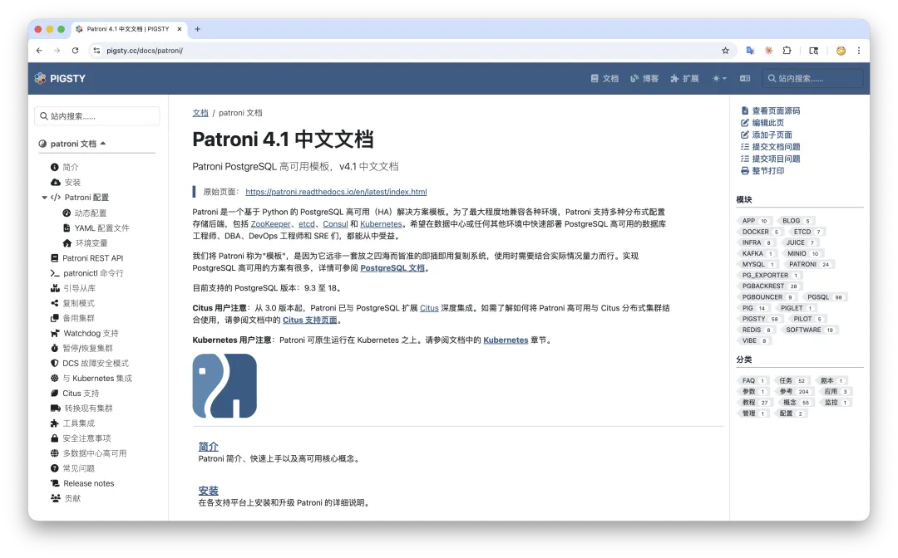
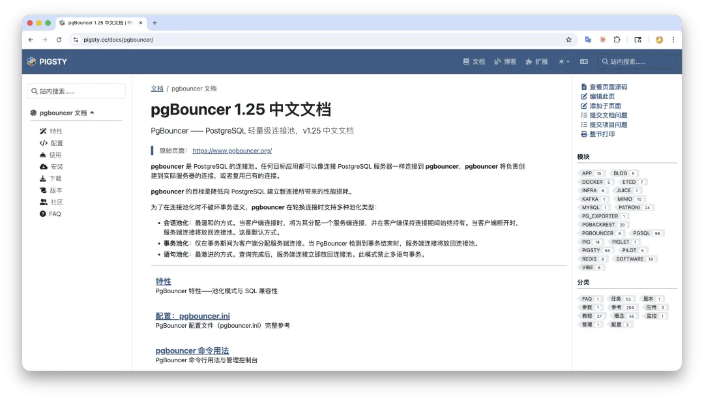
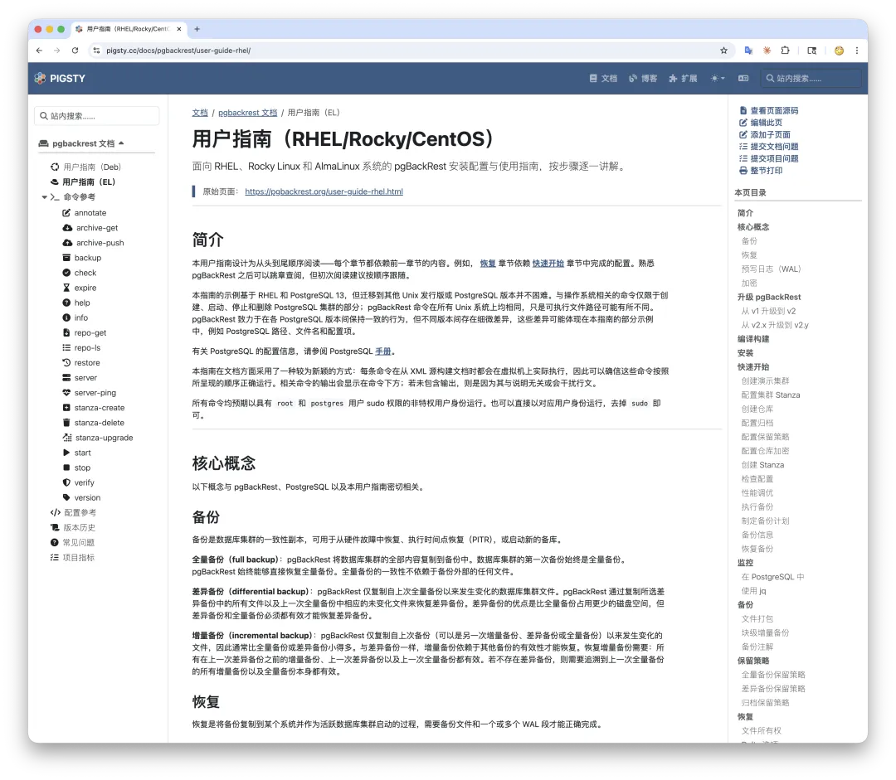
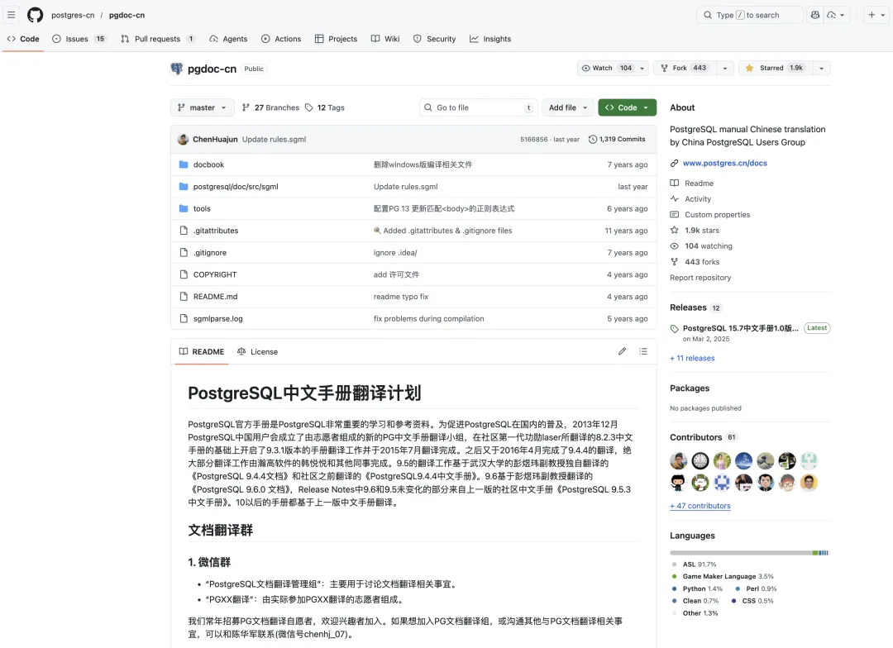

Pigsty v4.2 had just shipped, and I had some free time. I checked my Claude token quota — it was about to expire for the week. Use it or lose it. That got me itching for something to burn it on.

So I decided to translate docs.

In a single day, I translated the complete documentation for PgBouncer (connection pooler), pgBackRest (backup tool), and Patroni (HA template) — the three most critical open-source components in the PostgreSQL ecosystem — into Chinese. I also ran the same workflow across the PostgreSQL 18.3 official docs. The main body is done, though proofreading is still in progress.

When I finished, I was a bit dazed myself: a few years ago, this would have taken a whole team of volunteers working for months. [The docs are live here](https://pigsty.cc/docs/):

------

## Do Chinese Docs Really Matter?

There's a common argument: developers should be able to read English, so just use the original docs. That's partially true, but not the whole picture.

In reality, English reading proficiency varies enormously among Chinese developers. Even engineers at top-tier companies can struggle with large volumes of English technical documentation. You can't assume that everyone who needs PostgreSQL can read English docs fluently.

And even for those with decent English — like myself, I read English fairly smoothly on a daily basis — reading in Chinese is still two to three times faster. It's a cognitive efficiency issue: your brain works with less overhead in your native language, comprehension is more intuitive, and lookups are snappier. This advantage is especially pronounced for reference-style documentation, where Chinese's high information density really shines.

So Chinese documentation isn't a nice-to-have — it's foundational infrastructure for the PG ecosystem's adoption in China.

------

## How Bad Is the Current Situation?

PostgreSQL's official docs were once translated by the Chinese community, with volunteers and university students producing several versions over the years. But this human-powered model has an inherent problem: **it can't keep up**. After each major release, translations lag by six months or more. As of now, the [community-maintained Chinese docs](https://github.com/postgres-cn/pgdoc-cn) appear stuck at version 15.7 — more than three years behind, with no one organizing follow-up. (Though I think I spotted a 18.0 version somewhere.)

As for Chinese docs for PgBouncer, Patroni, and pgBackRest? Virtually nonexistent. The scattered translations that do exist are frozen in time — Patroni's Chinese docs are stuck at version 2.1.1, PgBouncer's at 1.7.2, offering almost no reference value. pgBackRest has nothing at all — the only thing you can dig up is a first-edition translation I did seven or eight years ago.

This isn't because the Chinese community isn't trying. Translating documentation is a thankless grind: massive workload, high technical bar, no direct payoff, and you have to keep up with every version update. Passion-driven volunteering simply isn't sustainable for work like this.

------

## What Did AI Change?

At its core, why was documentation translation so hard before? Because it demands both "technical comprehension" and "linguistic expression" at the same time. The pool of people who can do this well is small, and those willing to do it for free is even smaller. It required a whole translation team to drive, and that team needed continuous organization and coordination. The costs were just too high.

But things are different now.

With AI, the essence of document translation has become: **burning tokens** plus acceptance review.

As long as you have a mature, stable workflow, the rest is just feeding docs into the pipeline. My token subscription would expire unused anyway — might as well spend it on something meaningful. One day, three complete component doc translations, done.

If I had to rate the translation quality myself, I'd say 85–90 points — at near-zero marginal cost, achieving zero comprehension errors and smooth readability, I think that's excellent value.

Of course, I don't just blindly throw everything at AI. I do a full pass over the translated content, making sure there are no major issues, and it doubles as a review for myself. The total effort is on a completely different scale from what it used to be.

This proves once again that in the AI era, things that used to require an entire company or a large team can now be done by one person. Documentation translation is just one example. The barrier to community building and open-source maintenance has been fundamentally changed.

------

## What's Next?

Translating these three component docs is just the beginning.

My plan going forward is to translate all important PG ecosystem component docs, official blogs, and technical news, and to build an automated maintenance workflow for updates. This means — all English content produced by PG communities worldwide can be synchronized to the Chinese environment in near real time.

For example, [documentation for 460+ extensions](https://pigsty.cc/ext) can also be automatically fetched and translated into Chinese, or even into N languages. This really costs me nothing extra. If my token subscription goes unused, it's wasted anyway — might as well use this kind of "unlimited" work as a fallback filler task. Thinking bigger? I'm planning to use this system to "revive" the PostgreSQL Chinese community.

What does a truly vibrant technical community need? I've thought about this: you need comprehensive Chinese documentation and technical news — that's the foundation. You need forums for discussion and exchange — that's the vitality. You need a place for vendors to post information and job openings — that's the bridge to industry. Ideally you'd also have download repositories and other infrastructure to lower the barrier to entry.

Most critically, you need your own core value proposition — something like an open-source project to serve as a rallying point. Now think about it: none of this is actually that hard to pull off anymore. These were things I wanted to do before but didn't have the bandwidth for. Now with AI backing me up, I can sit here surfing and delegating by voice, tokens aplenty — many things I never dared imagine before can now be handled by one person with ease.

Some might ask: in the age of AI agents, won't agents read the docs directly in the future? Do we even need Chinese translations anymore? Maybe we won't even need doc sites — just throw an `llm.txt` in the project and call it a day. Perhaps. But at least for now, I still frequently consult PG docs myself. Until agents truly replace humans, this work remains hugely valuable.

------

## Take a Look?

The translated docs are already live, hosted on Pigsty's Chinese documentation site:

- [**PgBouncer Chinese Docs**](https://pigsty.cc/docs/pgbouncer): Complete translation of connection pooling configuration, management, and usage.
- [**Patroni Chinese Docs**](https://pigsty.cc/docs/patroni): Complete translation of high-availability cluster management.
- [**pgBackRest Chinese Docs**](https://pigsty.cc/docs/pgbackrest): Complete translation of backup and restore tools.
- **PostgreSQL 18 Docs**: Main translation is complete, proofreading still in progress. The translation targets the latest 18.3 release and will eventually be hosted on a dedicated subdomain.

Next up, I'll also consolidate and translate the docs for extensions like PostGIS, TimescaleDB, Citus, pgvector, and pg_repack.

I originally wanted to set up a dedicated domain for all these PG ecosystem Chinese docs, but domain registration in China is too much hassle, so they're living under the Pigsty site for now. Going forward, I'll integrate more content, get a proper domain, and build a complete PG Chinese community portal — docs, news, articles, downloads, all in one place.

The site source code is fully open source. While I think the translation quality is pretty good, there are bound to be oversights. Bug reports are very welcome — if you spot any translation issues, feel free to reach out directly or open a PR on GitHub.

**Translation was never the goal. The goal is to let every Chinese developer access the best PostgreSQL knowledge at the lowest cognitive cost.**

