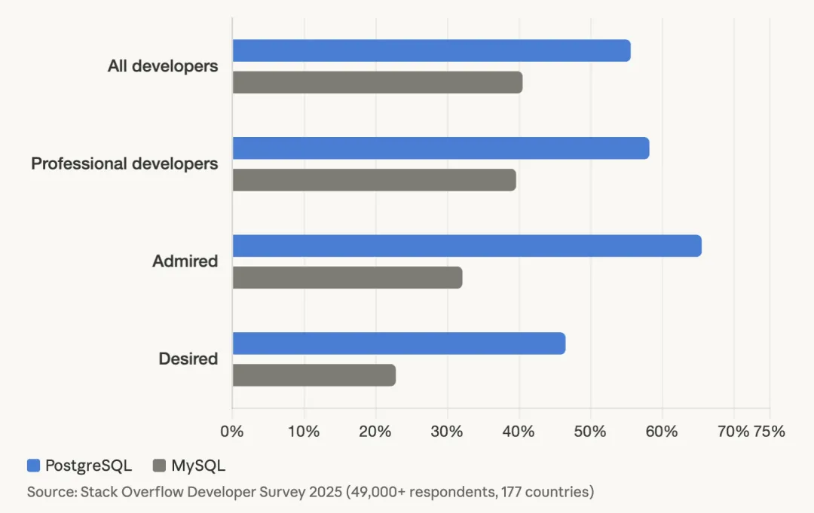
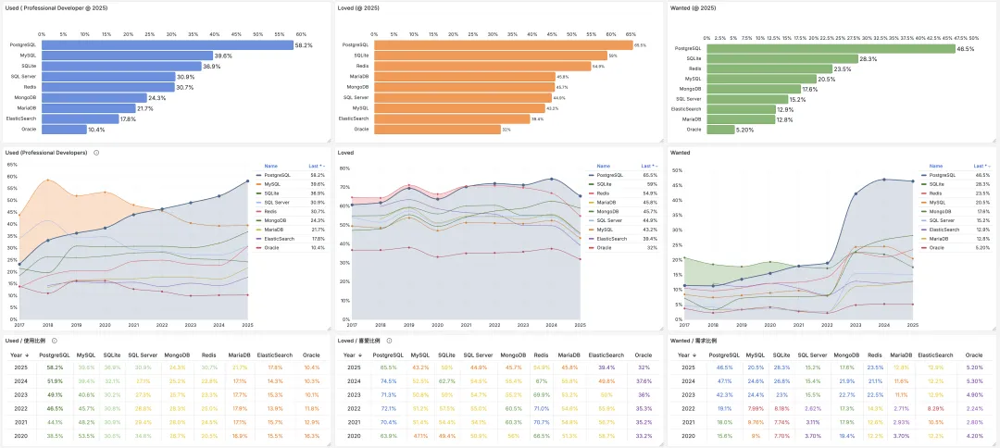
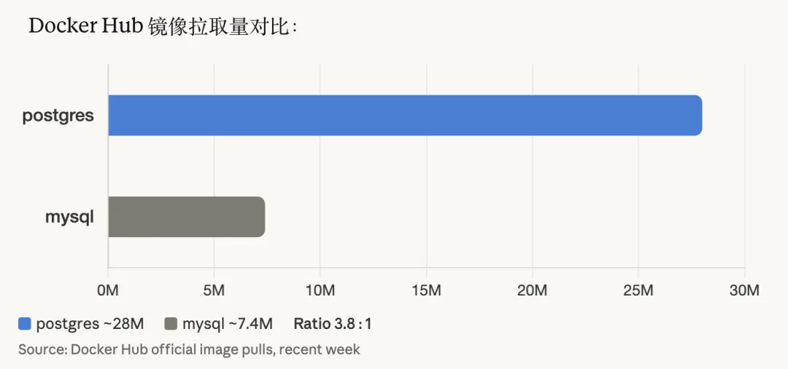
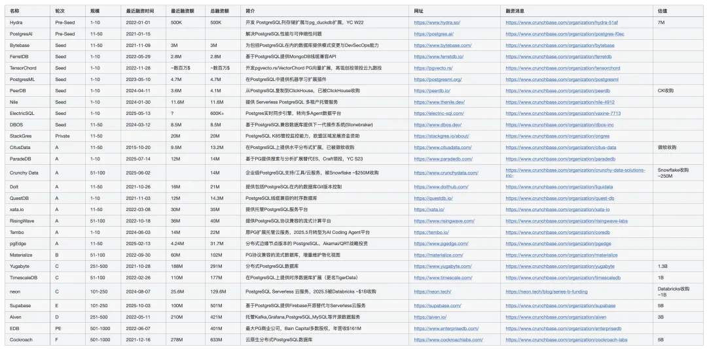
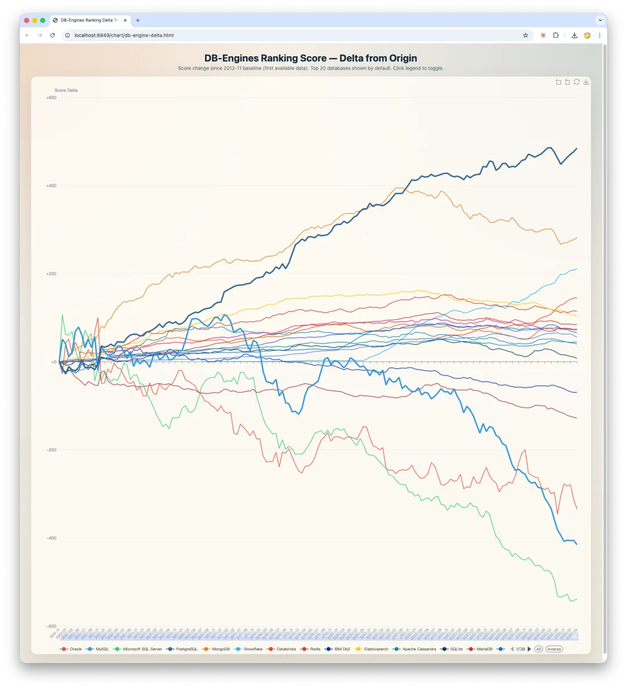

PostgreSQL has won the market for new database deployments, and its installed base is now comparable to MySQL's. With one rising and the other declining, there is little suspense left in the contest for the database kernel of the future.

-------

## I. Developer Adoption

Start with the numbers.

### Stack Overflow 2025

More than 49,000 valid responses from 177 countries. PostgreSQL gained 6.9 percentage points year over year; MySQL gained 0.2. PostgreSQL swept all three categories for the third consecutive year. In 2025, Stack Overflow published a database migration-flow chart for the first time. Its own summary: "all databases are migrating to PostgreSQL."

[Stack Overflow 2025 Global Developer Survey](/en/pg/so2025-pg/)

### JetBrains DevEco 2025

An independent survey of 24,534 developers across 194 countries reached the same result: PostgreSQL overtook MySQL as the most popular database.

### Docker Hub Pulls

This is the most direct proxy for what developers are actually pulling down to do their work. Over the past week, the official `postgres` image received about 28 million pulls, versus about 7.4 million for `mysql`: roughly **3.8:1**.

Three independent signals—Stack Overflow, JetBrains, and Docker Hub—use different methodologies and point in exactly the same direction.

### The China Skew

China is different from the rest of the world. Chinese internet companies have a much higher concentration of MySQL, creating strong path dependence. But a new generation of Chinese developers coming in through Django, FastAPI, and Node.js is naturally gravitating toward PostgreSQL. MySQL owns the installed base; PostgreSQL owns the growth.

-------

## II. Vendor Strategy

Survey data can be challenged for sampling bias. Strategic choices backed by real corporate money are harder to dismiss.

### PlanetScale's Pivot

PlanetScale, the company behind Vitess, spent five years offering only MySQL. It announced Postgres in July 2025 and reached GA in September. CEO Sam Lambert said customer demand was "overwhelming" and that "by the end of launch day, we knew we had to do it." A company whose entire technical identity was MySQL was pushed by the market into building Postgres.

### Percona Changes Course

Percona is the MySQL ecosystem's most important third-party vendor. Percona Server, XtraBackup, and PMM are standard equipment for MySQL DBAs worldwide. What is Percona doing now? Building fully open-source TDE for PostgreSQL, continuing to develop its PostgreSQL Kubernetes Operator, and releasing Percona Distribution for PostgreSQL 18. It has now built out a complete second line of business.

In February 2026, Percona co-founder Vadim Tkachenko led an open letter, signed by nearly 250 people, urging Oracle to create an independent foundation to "save" MySQL. The first challenge named in the letter: **"PostgreSQL is becoming the default choice for new projects and younger developers."** Tkachenko told *The Register*: "We see MySQL kind of becoming a legacy technology."

When core contributors from the MySQL community describe their own technology as "legacy," that says more than any survey.

### TiDB Explores PostgreSQL

TiDB's latest move is DB9, CTO Dongxu Huang's attempt to build a PostgreSQL compatibility layer on top of TiKV. A database vendor that started with distributed MySQL has decided to embrace PostgreSQL. The implication is obvious.

### 2025: The Year of PostgreSQL Acquisitions

In 2025, the PostgreSQL ecosystem captured nearly every large acquisition in the database sector:

[PostgreSQL Wins Over Capital: Databricks Acquires Neon, Supabase Raises $200 Million, and Microsoft Calls Out PG in Earnings](https://mp.weixin.qq.com/s?__biz=MzU5ODAyNTM5Ng==&mid=2247489652&idx=1&sn=d68e7fc8433a82c1f1de59a9da0738ba&scene=21#wechat_redirect)

[Database Watercooler: Is OpenAI Looking to Acquire Supabase?](https://mp.weixin.qq.com/s?__biz=MzU5ODAyNTM5Ng==&mid=2247489695&idx=1&sn=eb0aa2286ecdbb014fd6b38023ae6749&scene=21#wechat_redirect)

[Mooncake Pays Off: Another PostgreSQL Extension Company Acquired by Databricks](https://mp.weixin.qq.com/s?__biz=MzU5ODAyNTM5Ng==&mid=2247490427&idx=1&sn=362c17b2443801b6c4a9fc4b4d1b66d6&scene=21#wechat_redirect)

Databricks acquired two PostgreSQL companies in a single year—Neon and Mooncake—and Snowflake followed with Crunchy Data. Two data-platform giants announced PostgreSQL acquisitions within three weeks of each other. That was not coincidence; it was an arms race.

Andy Pavlo put the point bluntly in a Stormbreaker interview: **PostgreSQL companies captured nearly all the capital flowing into the ecosystem.** The database sector's largest acquisitions all targeted PostgreSQL companies. In the MySQL ecosystem, by contrast, the defining event of 2025 was not an acquisition but an open letter.

-------

## III. Cloud Platform Data

No cloud provider publishes an engine-level breakdown of instances or vCPUs. The following combines public information with figures from industry sources.

### AWS

Industry sources say that **as early as two or three years ago, PostgreSQL had already surpassed MySQL on AWS in both instance count and total vCPUs.** PostgreSQL instances are larger on average, so its lead is wider by vCPU than by instance count. No public data directly proves this, but AWS's product investment in Aurora PostgreSQL points in the same direction.

### Alibaba Cloud

Chen Zongzhi, head of Alibaba Cloud RDS, said in a recent interview that the ratio of MySQL to PostgreSQL instances in China is about 10:1. The figure I have heard is lower, perhaps around 5:1. Under either measure, MySQL still has a very large absolute installed-base advantage on Chinese cloud platforms. But my sources put PostgreSQL's year-over-year growth over the past one to two years as high as 100%.

### Supabase

As of its Series E in October 2025, Supabase was valued at $5.1 billion and managed roughly 3.5 million active databases. More than 50% of companies in the latest Y Combinator batch use Supabase as their backend. Among Silicon Valley startups, that is approaching monopoly territory.

## IV. DB-Engines

DB-Engines is a composite popularity ranking based on multiple signals, including search, hiring, and social activity. Its value is in longitudinal comparison: the delta against its own historical trend. The chart below shows how the scores have changed from their historical starting points to today.

-------

## V. Hyperscale Production Deployments

### PostgreSQL

**OpenAI**, **currently the world's most prominent PostgreSQL deployment**. An official engineering post in January 2026 disclosed one Azure PostgreSQL primary and nearly 50 cross-region read replicas serving 800 million users, million-scale QPS, low-double-digit-millisecond p99 latency, and five-nines availability. No sharding. OpenAI infrastructure engineer Bohan Zhang said at PGConf.Dev 2025: "PostgreSQL can scale gracefully under massive read workloads."

**Instagram**, a pioneer of PostgreSQL at social-network scale. It made PostgreSQL its core database early on, then used application-level sharding to reach global scale.

**Figma**, whose Postgres stack has grown nearly 100-fold since 2020, evolving from one database to vertical partitioning plus horizontal sharding.

**Notion**, which runs multiple PostgreSQL clusters; its core cluster has 32 shards.

**Tantan**, one of the largest PostgreSQL deployments in the Chinese internet sector. At peak, it ran more than 100 clusters and 2.5 million QPS. Its largest core primary had 33 replicas, and a single cluster handled 400,000 QPS.

**Apple**, which uses PostgreSQL internally at scale.

**GitLab**, which runs a monolithic Postgres database.

### MySQL

**Meta**, with roughly a million shards, petabytes of data, and thousands of machines—one of the world's largest MySQL deployments.

**Shopify**, with a petabyte-scale MySQL fleet.

**GitHub**, whose primary relational store is MySQL. A recent run of outages has drawn broad criticism of its service reliability.

### A Generational Pattern

The pattern is clear: nearly all the technology choices behind the hyperscale MySQL deployments—Meta, Shopify, and GitHub—were made before 2010. The next generation of companies founded after 2010, including OpenAI, Figma, Notion, and Tantan, as well as the many new projects on Supabase and Neon, largely default to PostgreSQL.

MySQL can operate at scale; Meta has proved that. But if you are starting from scratch today with no legacy constraints, you are very likely to choose PostgreSQL. Not because it is better in every dimension, but because ecosystem momentum, community vitality, extensibility (`pgvector`, PostGIS), and default support across every mainstream framework have all shifted in its favor.

-------

## VI. Community Governance

### PostgreSQL

Decentralized governance. Core committers work across competing companies including EDB, Crunchy Data, AWS, Microsoft, and Google. No single company can unilaterally set the project's direction; that principle is written into the community's constitution. The release cadence is stable—one major version every year, sustained for decades. The PostgreSQL License is BSD-like and highly permissive.

More than 460 extensions cover nearly every modern workload: `pgvector`, PostGIS, TimescaleDB, Citus, and `pg_analytics`. PostgreSQL is not merely a database; it is a data-platform kernel adaptable to almost any workload.

### MySQL

Oracle owns the copyright and trademarks outright. In the fall of 2025, it cut roughly 50% of the MySQL engineering team. Founder Monty Widenius said publicly that he was "heartbroken." Commits to `mysql/mysql-server` on GitHub nearly stopped. Community manager Descamps left for MariaDB. Nearly 250 people signed an open letter calling for an independent foundation. Oracle responded by promising a "new era" and new features in MySQL 9.7 LTS, but made no substantive concession on the central demand to transfer governance.

**MySQL Community Edition still has no native vector search**; `pgvector` shipped in 2021. In an era when AI shapes infrastructure choices, the strategic significance of that gap goes far beyond the feature itself.

-------

## VII. Overall Assessment

PostgreSQL has won the growth market: new projects, new developers, new platforms, AI-agent infrastructure, and every large database acquisition in 2025. MySQL still holds the installed-base market: the WordPress ecosystem, Alibaba-derived technology stacks, and historical deployments at Meta and Shopify.

| Dimension | PostgreSQL | MySQL | Confidence |
|-----------|------------|-------|------------|
| Developer adoption | 55.6%, winner in all three categories | 40.5%, down to fourth place | ★★★★★ |
| Docker pulls | ~28 million/week | ~7.4 million/week, 3.8:1 | ★★★★☆ |
| Vendor strategy | PlanetScale pivot, acquisition wave | Its own community calls it "legacy" | ★★★★★ |
| Cloud platforms (AWS) | Instance count and vCPUs exceed MySQL (industry sources) | — | ★★☆☆☆ |
| DB-Engines popularity | 680, rising | 858, flat/slightly declining | ★★★★☆ |
| Hyperscale deployments | OpenAI (800 million users), Instagram | Meta, Shopify (both chosen before 2010) | ★★★☆☆ |
| Community governance | Decentralized, stable | Oracle-controlled, community crisis | ★★★★★ |
| Acquisition capital | Neon $1 billion + Crunchy $250 million + Mooncake | Zero | ★★★★★ |

But that "installed-base advantage" is historical inertia. It does not generate new technical vitality, attract new developers, or drive new platform choices. When core contributors from the MySQL community are signing an open letter saying "we are becoming legacy technology," the direction of travel is no longer debatable.

**Today's growth becomes tomorrow's installed base.**

------

## Appendix: Data Sources

| Source | Sample / Basis | Quality |
|--------|----------------|---------|
| Stack Overflow 2025 | 49K+ responses, 177 countries | ★★★★★ |
| JetBrains DevEco 2025 | 24,534 responses, 194 countries | ★★★★☆ |
| Official Docker Hub image pulls | Public real-time data | ★★★★★ |
| OpenAI engineering blog (2026.01) | Official technical disclosure | ★★★★★ |
| MySQL community open letter (2026.02) | ~250 signatories | ★★★★★ |
| Databricks/Neon acquisition | Public press release, $1 billion | ★★★★☆ |
| Snowflake/Crunchy Data acquisition | Public press release, ~$250 million | ★★★★☆ |
| Databricks/Mooncake acquisition | Public press release | ★★★★☆ |
| PlanetScale CEO's public statements | First-party corporate action | ★★★★☆ |
| DB-Engines 2026.03 | Multi-signal composite ranking | ★★★★☆ |
| Supabase Series E | $5.1 billion valuation | ★★★☆☆ |
| AWS PostgreSQL vs. MySQL | Industry sources | ★★☆☆☆ |
| Alibaba Cloud MySQL:PostgreSQL | Industry sources | ★★☆☆☆ |

## Further Reading

- [MySQL Won the 2000s. PostgreSQL Won the 2020s. Who Will Win the AI Era?](https://mp.weixin.qq.com/s?__biz=MzU5ODAyNTM5Ng==&mid=2247490783&idx=2&sn=056d9144511a054d0430ae6b83bef2b3&scene=21#wechat_redirect)
- [MySQL and Baijiu: The Internet's Obedience Test](/en/db/mysql-baijiu/)
- [MySQL vs. PostgreSQL in 2025](/en/db/mysql-vs-pgsql/)
- [MySQL Is Dead, Long Live PostgreSQL](/db/mysql-is-dead/)
- [PostgreSQL Is Claimed to Be 360x Slower Than MySQL—I've Had Enough](https://mp.weixin.qq.com/s?__biz=MzU5ODAyNTM5Ng==&mid=2247489496&idx=1&sn=ee3acab3c57931f80c79998216284b1c&scene=21#wechat_redirect)
- [PostgreSQL Has Achieved an Overwhelming Advantage over MySQL](https://mp.weixin.qq.com/s?__biz=MzU5ODAyNTM5Ng==&mid=2247489241&idx=1&sn=cdee3e224c1ad79f99ce8aff1bbae5ef&scene=21#wechat_redirect)
- [A Nasty Bug in the New MySQL Release: Too Many Tables and It Crashes](https://mp.weixin.qq.com/s?__biz=MzU5ODAyNTM5Ng==&mid=2247488014&idx=1&sn=727b1e3e9077af728a243854ea1c2cb3&scene=21#wechat_redirect)
- [Do PostgreSQL Developers Earn 40% More Than MySQL Developers?](https://mp.weixin.qq.com/s?__biz=MzU5ODAyNTM5Ng==&mid=2247487875&idx=1&sn=ef6b47297eb980a729f97e157999a283&scene=21#wechat_redirect)
- Oracle Finally Killed MySQL
- Where Are You Going, Sakila?
- [Why Is MySQL's Correctness Such a Mess?](/en/db/bad-mysql/)
- [Thoughts on the MySQL vs. PostgreSQL Livestream Farce](https://mp.weixin.qq.com/s?__biz=MzU5ODAyNTM5Ng==&mid=2247486025&idx=1&sn=463029f58b41b5835780b6d2203be889&scene=21#wechat_redirect)
- [Rebutting "MySQL: The Most Successful Database on This Planet"](https://mp.weixin.qq.com/s?__biz=MzU5ODAyNTM5Ng==&mid=2247485933&idx=1&sn=d9bac968feef3a18e1de32aa77cb7476&scene=21#wechat_redirect)
- [PostgreSQL Is Eating the Database World](/en/pg/pg-eat-db-world/)
- [OpenHalo: MySQL Wire-Compatible PostgreSQL Is Here!](/en/pg/openhalo-mysql/)
- [OrioleDB Is Here: The Oreo Database Arrives!](/en/pg/orioledb-is-coming/)
- [Stack Overflow 2024 Survey](/en/pg/pg-is-no1-again/)
- Why Is PostgreSQL the Foundation of the Future of Data?
- [Technical Minimalism: Just Use PostgreSQL for Everything](/en/pg/just-use-pg/)
- [2023 Database of the Year: PostgreSQL (DB-Engines)](https://mp.weixin.qq.com/s?__biz=MzU5ODAyNTM5Ng==&mid=2247486745&idx=1&sn=b92be029db148f53239c29bea912fc78&scene=21#wechat_redirect)
- [How Powerful Is PostgreSQL, Really?](/en/pg/pg-performence/)
- [Why Is PostgreSQL the Most Successful Database?](/en/pg/pg-is-best/)
- [Stack Overflow 2022 Database Survey](https://mp.weixin.qq.com/s?__biz=MzU5ODAyNTM5Ng==&mid=2247485170&idx=1&sn=657c75be06557df26e4521ce64178f14&scene=21#wechat_redirect)
- [Why Does PostgreSQL Have Such a Bright Future?](/en/pg/pg-is-great/)
