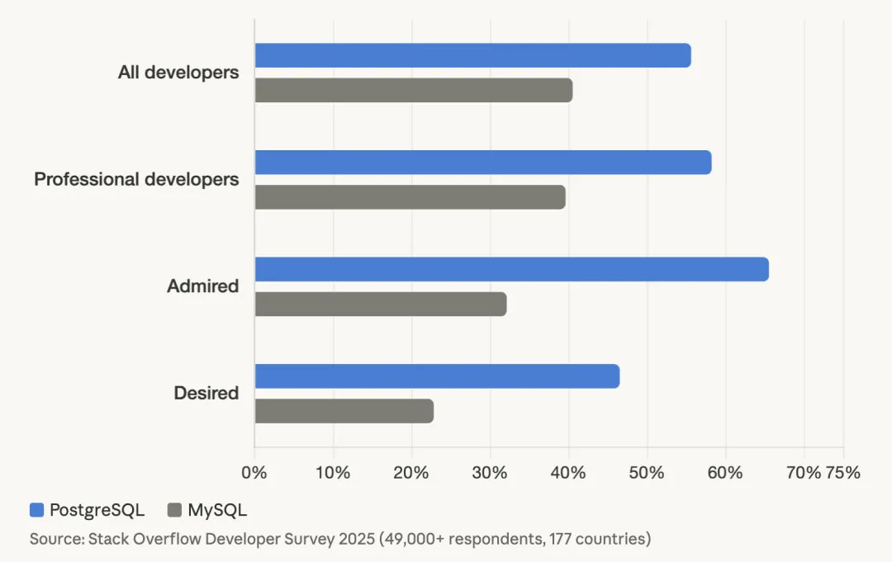
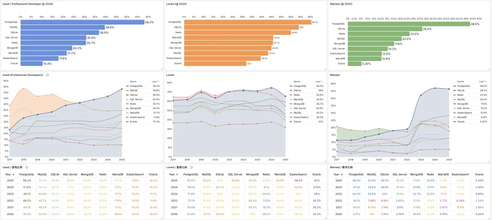
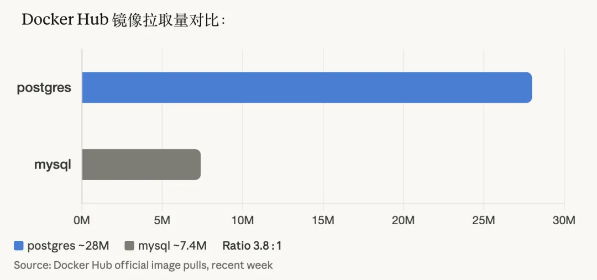
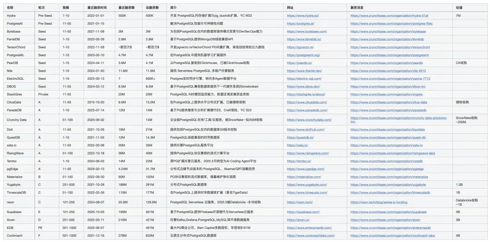
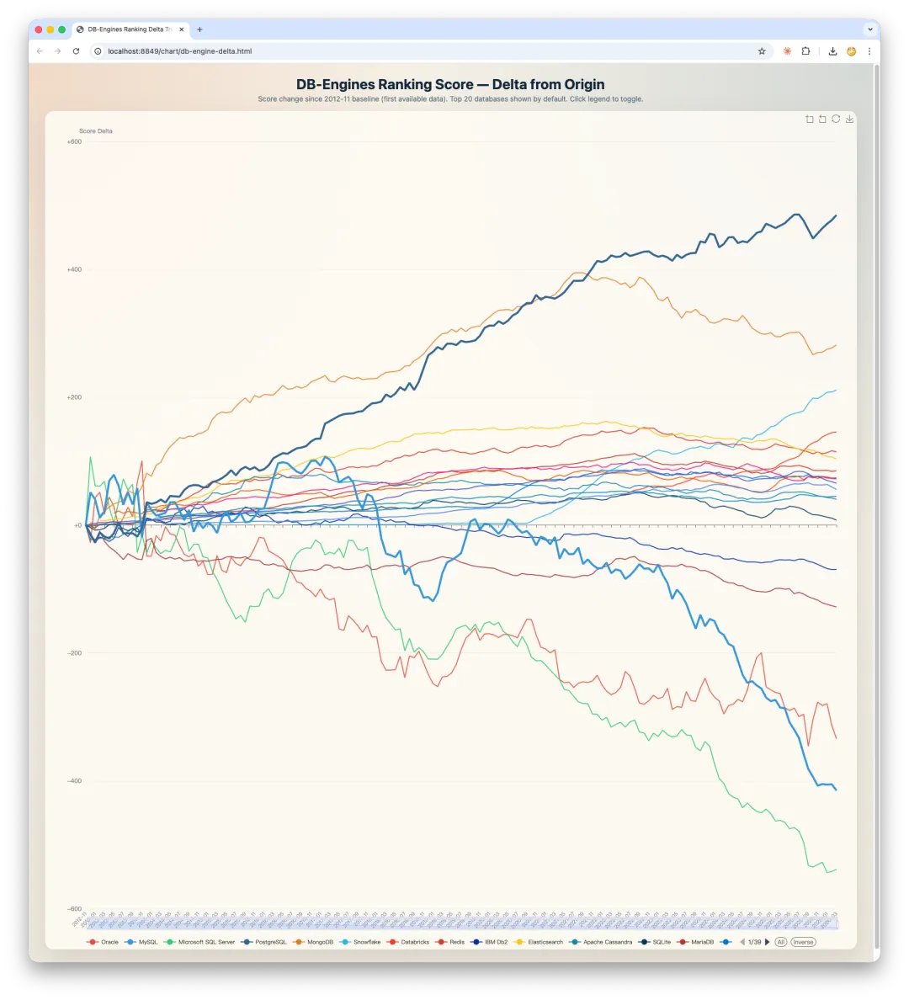

PostgreSQL 赢得数据库增量世界，并已在存量上与 MySQL 相当。此消彼长之下，未来数据库世界的内核之争已不再有悬念。

-------

## 一、开发者采用率

直接上数字。

### Stack Overflow 2025

49,000+ 份有效回复，177 个国家。PG 同比 +6.9pp，MySQL 同比 +0.2pp。连续三年三冠王。2025 年首次公布的数据库迁移流向图，Stack Overflow 自己的原话是："all databases are migrating to PostgreSQL"。

[StackOverflow 2025 全球开发者调研](/pg/so2025-pg/)

### JetBrains DevEco 2025

24,534 名开发者，194 个国家，独立验证。PG 同样超越 MySQL 成为最受欢迎数据库。

### Docker Hub 拉取量

这是最直观的代理指标，也是开发者实际在拉什么镜像来干活。Docker Hub 官方镜像近一周拉取量：`postgres` 约 2800 万，`mysql` 约 740 万，比值约 **3.8:1**。

三个独立信号源（SO、JetBrains、Docker Hub），不同口径，方向完全一致。

### 中国偏差

中国跟全球不一样。中国互联网公司的 MySQL 浓度远高于全球，构成了极强的路径依赖。但以 Django、FastAPI、Node.js 为入口的新一代中国开发者，自然地在向 PG 倾斜。存量是 MySQL 的，增量是 PostgreSQL 的。

-------

## 二、厂商战略动向

调查数据可以被质疑样本偏差，但企业用真金白银做出的战略选择没法质疑。

### PlanetScale 转向

PlanetScale，Vitess 背后的商业公司，五年来只做 MySQL。2025 年 7 月宣布做 Postgres，9 月 GA。CEO Sam Lambert 原话：客户需求"压倒性"；"发布日结束时我们就知道必须做这件事"。一家以 MySQL 为唯一技术身份的公司，被市场推着做了 Postgres。

### Percona 的转身

Percona 是 MySQL 生态最重要的第三方厂商，没有之一。Percona Server、XtraBackup、PMM 是全球 MySQL DBA 的标配。现在 Percona 在干什么？为 PostgreSQL 做全开源 TDE，迭代 PG 的 Kubernetes Operator，发布 Percona Distribution for PostgreSQL 18，第二赛道已经全面铺开。

2026 年 2 月，Percona 联合创始人 Vadim Tkachenko 牵头，近 250 人签署公开信呼吁 Oracle 建立独立基金会来"拯救" MySQL。信中第一条挑战：**"PostgreSQL 正在成为新项目和年轻开发者的默认选择。"** Tkachenko 对 The Register 说："我们看到 MySQL 正在变成 legacy technology。"

当 MySQL 社区自己的核心贡献者用"遗留技术"来描述自己，这比任何调查数据都更有说明力。

### TiDB 的探索

TiDB 最近的新动作是 DB9，CTO 黄东旭尝试在 TiKV 上构建一个 PostgreSQL 兼容层。一个做分布式 MySQL 起家的数据库厂商决定拥抱 PG，这代表了什么不言而喻。

### 2025：PG 生态的收购年

2025 年，PostgreSQL 生态几乎拿走了数据库领域所有的大额收购：

[PG生态赢得资本市场青睐：Databricks收购Neon，Supabase融资两亿美元，微软财报点名PG](https://mp.weixin.qq.com/s?__biz=MzU5ODAyNTM5Ng==&mid=2247489652&idx=1&sn=d68e7fc8433a82c1f1de59a9da0738ba&scene=21#wechat_redirect)

[数据库茶水间：OpenAI拟收购Supabase？](https://mp.weixin.qq.com/s?__biz=MzU5ODAyNTM5Ng==&mid=2247489695&idx=1&sn=eb0aa2286ecdbb014fd6b38023ae6749&scene=21#wechat_redirect)

[月饼好吃：又一家 PG 扩展公司被 Databricks 收购](https://mp.weixin.qq.com/s?__biz=MzU5ODAyNTM5Ng==&mid=2247490427&idx=1&sn=362c17b2443801b6c4a9fc4b4d1b66d6&scene=21#wechat_redirect)

Databricks 一年内连收两家 PG 公司（Neon + Mooncake），Snowflake 紧随其后收了 Crunchy Data。两家数据平台巨头在三周内先后宣布收购 PG 公司，这不是巧合，而是军备竞赛。

Stormbreaker 的 Andy Pavlo 在访谈中点破了本质：**PostgreSQL 几乎拿走了 PG 生态里所有的钱。** 数据库领域最大的几笔收购，标的全部是 PG 公司。反观 MySQL 生态，2025 年的关键词不是收购，而是公开信。

-------

## 三、云平台数据

没有任何云厂商公开 engine-level 的实例 / vCPU 分布。以下混合了公开信息与业内口径。

### AWS

业内口径：**早在两三年前，AWS 上 PG 的实例数量和 vCPU 总量就已经超过 MySQL。** PG 实例的平均规格更大，vCPU 维度的领先幅度比实例数更高。没有公开数据可以直接证明，但 AWS 在 Aurora PG 上的产品投入方向与此一致。

### 阿里云

阿里云 RDS 负责人陈宗志在最近的访谈中提到，中国 MySQL 与 PG 的实例比例约 10:1。我个人了解到的数字比这个低，可能在 5:1 左右。不管哪个口径，中国云平台上 MySQL 的绝对存量优势仍然非常明显。不过，我了解到的最近一两年 PG 的 YoY 增长高达 100%。

### Supabase

截至 2025 年 10 月 Series E，估值 51 亿美元，活跃管理数据库约 350 万。超过 50% 的最新 Y Combinator 批次使用 Supabase 作为后端，在硅谷创业公司的选型中，这已经接近垄断。

## 四、DB-Engines

DB-Engines 是基于搜索、招聘、社交等多信号的综合热度排名。它的价值在纵向可比，也就是看 Delta 变化量，跟自己比趋势。从历史原点到现在的分数变化如下图所示：

-------

## 五、超大规模生产案例

### PostgreSQL

**OpenAI**， [**当前全球最具标志性的 PG 案例**](/pg/openai-postgres/)。2026 年 1 月官方博客披露：一个 Azure PG 主库 + 近 50 个跨地域只读副本，服务 8 亿用户，百万级 QPS，p99 低两位数毫秒，五个九可用性。不分片。OpenAI 基础设施工程师 Bohan Zhang 在 PGConf.Dev 2025 的原话："PostgreSQL 可以在大规模读负载下优雅扩展。"

**Instagram**，PG 在社交产品的先驱。早期即以 PG 为核心，应用层分片扩展至全球顶级规模。

**Figma**，Postgres 栈自 2020 起增长近 100 倍，从单库演进到垂直分库 + 水平分片。

**Notion**，多个 PG 集群，核心集群 32 分片。

**探探**，中国互联网最大规模 PG 部署之一。高峰期一百多个集群，250 万 QPS，最大核心主库一主三十三从，单集群 40 万 QPS。

**Apple**，内部大规模使用 PG。

**GitLab**，单体 Postgres。

### MySQL

**Meta**，百万级分片、PB 级数据、数千台机器，全球最大 MySQL 部署之一。

**Shopify**，PB 级 MySQL 车队。

**GitHub**，MySQL 为主要关系型存储。最近故障频发，在服务可靠性上广受诟病。

### 时代特征

一个清晰的模式是：MySQL 的超大规模案例（Meta、Shopify、GitHub）选型决策几乎全部发生在 2010 年之前。2010 年之后成立的新一代公司，如 OpenAI、Figma、Notion、探探，以及 Supabase / Neon 上的海量新项目，基本默认 PG。

MySQL 可以支撑大规模，Meta 已经证明了这一点。但如果你今天从零开始、没有历史包袱，有极大概率会选 PG。不是因为它在所有维度上都更好，而是因为生态势能、社区活力、扩展性（`pgvector`、PostGIS）和所有主流框架的默认支持都已经倒向了这一边。

-------

## 六、社区治理

### PostgreSQL

去中心化治理。核心 committer 分布在 EDB、Crunchy Data、AWS、Microsoft、Google 等多家相互竞争的企业。没有任何一家能单方面决定方向，这件事写在社区宪法里。版本发布节奏稳定（每年一个大版本，持续数十年）。PostgreSQL License 类 BSD，零限制。

460+ 扩展覆盖几乎所有现代工作负载：`pgvector`、PostGIS、TimescaleDB、Citus、`pg_analytics`。PG 不只是一个数据库，它是一个可以适配任何场景的数据平台内核。

### MySQL

Oracle 完全拥有版权和商标。2025 年秋季裁撤约 50% MySQL 工程团队。创始人 Monty Widenius 公开表示"心碎"。GitHub 上 `mysql/mysql-server` 提交几乎停滞。社区经理 Descamps 离职投奔 MariaDB。近 250 人签公开信呼吁独立基金会。Oracle 的回应是承诺"新时代"和 9.7 LTS 中的新功能，但对治理权转移的核心诉求没有实质让步。

**MySQL 社区版至今没有原生向量搜索**，`pgvector` 在 2021 年就上线了。在 AI 定义基础设施选型的时代，这个差距的战略意义远超技术本身。

-------

## 七、总体判断

PostgreSQL 赢了增量世界：新项目、新开发者、新平台、AI Agent 基础设施，以及 2025 年所有大额数据库收购。MySQL 还守着存量世界：WordPress 生态、阿里系技术栈、Meta / Shopify 的历史部署。

| 维度            | PostgreSQL                             | MySQL                    | 置信度   |
|---------------|----------------------------------------|--------------------------|-------|
| 开发者采用率        | 55.6%，三冠王                              | 40.5%，排名滑至第四             | ★★★★★ |
| Docker 拉取量    | ~2800 万/周                              | ~740 万/周，3.8:1           | ★★★★☆ |
| 厂商战略动向        | PlanetScale 转向、收购潮                     | 自己的社区说"legacy"           | ★★★★★ |
| 云平台 (AWS)     | 实例数与 vCPU 已超 MySQL（业内）                 | —                        | ★★☆☆☆ |
| DB-Engines 热度 | 680，持续上升                               | 858，持平/微降                | ★★★★☆ |
| 超大规模案例        | OpenAI（8 亿用户）、Instagram                | Meta、Shopify（均 2010 前选型） | ★★★☆☆ |
| 社区治理          | 去中心化，稳健                                | Oracle 控制，社区危机           | ★★★★★ |
| 收购资金流向        | Neon $10 亿 + Crunchy $2.5 亿 + Mooncake | 零                        | ★★★★★ |

但这个"存量优势"是历史惯性，它不生成新的技术活力，不吸引新的开发者，也不驱动新的平台选型。当 MySQL 自己的社区核心贡献者都在签公开信说“我们正在变成 legacy”的时候，趋势已经不需要争论了。

**增量终将成为存量。**

------

## 附录：数据源

| 数据源                       | 样本/口径           | 质量    |
|---------------------------|-----------------|-------|
| Stack Overflow 2025       | 49K+ 回复，177 国   | ★★★★★ |
| JetBrains DevEco 2025     | 24,534 回复，194 国 | ★★★★☆ |
| Docker Hub 官方镜像拉取量        | 公开实时数据          | ★★★★★ |
| OpenAI 工程博客 (2026.01)     | 官方技术披露          | ★★★★★ |
| MySQL 社区公开信 (2026.02)     | ~250 签署者        | ★★★★★ |
| Databricks/Neon 收购        | 公开新闻稿，$10 亿     | ★★★★☆ |
| Snowflake/Crunchy Data 收购 | 公开新闻稿，~$2.5 亿   | ★★★★☆ |
| Databricks/Mooncake 收购    | 公开新闻稿           | ★★★★☆ |
| PlanetScale CEO 公开声明      | 企业一手行为          | ★★★★☆ |
| DB-Engines 2026.03        | 多信号综合排名         | ★★★★☆ |
| Supabase Series E         | 估值 $51 亿        | ★★★☆☆ |
| AWS PG vs MySQL           | 业内口径            | ★★☆☆☆ |
| 阿里云 MySQL:PG              | 业内口径            | ★★☆☆☆ |

## 延伸阅读

- [MySQL 赢了 2000s，PostgreSQL 赢得 2020s，谁将赢得 AI 时代？](https://mp.weixin.qq.com/s?__biz=MzU5ODAyNTM5Ng==&mid=2247490783&idx=2&sn=056d9144511a054d0430ae6b83bef2b3&scene=21#wechat_redirect)
- [MySQL：互联网行业的服从测试](/db/mysql-baijiu/)
- [2025年：MySQL vs PostgreSQL](/db/mysql-vs-pgsql/)
- [MySQL安魂九霄，PostgreSQL驶向云外](/db/mysql-is-dead/)
- [PG被黑慢MySQL 360倍，这次我真忍不了](https://mp.weixin.qq.com/s?__biz=MzU5ODAyNTM5Ng==&mid=2247489496&idx=1&sn=ee3acab3c57931f80c79998216284b1c&scene=21#wechat_redirect)
- [PostgreSQL取得对MySQL的压倒性优势](https://mp.weixin.qq.com/s?__biz=MzU5ODAyNTM5Ng==&mid=2247489241&idx=1&sn=cdee3e224c1ad79f99ce8aff1bbae5ef&scene=21#wechat_redirect)
- [MySQL新版恶性Bug，表太多就崩给你看！](https://mp.weixin.qq.com/s?__biz=MzU5ODAyNTM5Ng==&mid=2247488014&idx=1&sn=727b1e3e9077af728a243854ea1c2cb3&scene=21#wechat_redirect)
- [用PG的开发者，年薪比MySQL多赚四成？](https://mp.weixin.qq.com/s?__biz=MzU5ODAyNTM5Ng==&mid=2247487875&idx=1&sn=ef6b47297eb980a729f97e157999a283&scene=21#wechat_redirect)
- [Oracle最终还是杀死了MySQL！](/db/oracle-kill-mysql/)
- [MySQL性能越来越差，Sakila将何去何从？](/db/sakila-where-are-you-going/)
- [MySQL的正确性为何如此拉垮？](/db/bad-mysql/)
- [如何看待 MySQL vs PGSQL 直播闹剧](https://mp.weixin.qq.com/s?__biz=MzU5ODAyNTM5Ng==&mid=2247486025&idx=1&sn=463029f58b41b5835780b6d2203be889&scene=21#wechat_redirect)
- [驳《MySQL：这个星球最成功的数据库》](https://mp.weixin.qq.com/s?__biz=MzU5ODAyNTM5Ng==&mid=2247485933&idx=1&sn=d9bac968feef3a18e1de32aa77cb7476&scene=21#wechat_redirect)
- [PostgreSQL正在吞噬数据库世界](/pg/pg-eat-db-world/)
- [OpenHalo：MySQL线缆兼容的PostgreSQL来了！](/pg/openhalo-mysql/)
- [OrioleDB 奥利奥数据库来了！](/pg/orioledb-is-coming/)
- [StackOverflow 2024调研](/pg/pg-is-no1-again/)
- [为什么PostgreSQL是未来数据的基石？](/pg/pg-for-everything/)
- [技术极简主义：一切皆用Postgres](/pg/just-use-pg/)
- [2023年度数据库：PostgreSQL (DB-Engine)](https://mp.weixin.qq.com/s?__biz=MzU5ODAyNTM5Ng==&mid=2247486745&idx=1&sn=b92be029db148f53239c29bea912fc78&scene=21#wechat_redirect)
- [PostgreSQL 到底有多强？](/pg/pg-performence/)
- [为什么PostgreSQL是最成功的数据库？](/pg/pg-is-best/)
- [StackOverflow 2022数据库年度调查](https://mp.weixin.qq.com/s?__biz=MzU5ODAyNTM5Ng==&mid=2247485170&idx=1&sn=657c75be06557df26e4521ce64178f14&scene=21#wechat_redirect)
- [为什么说PostgreSQL前途无量？](/pg/pg-is-great/)
