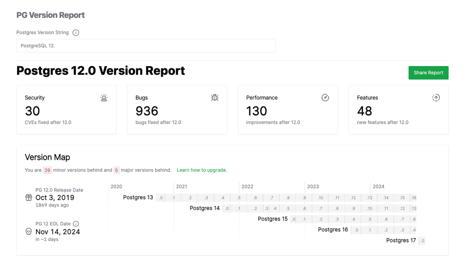
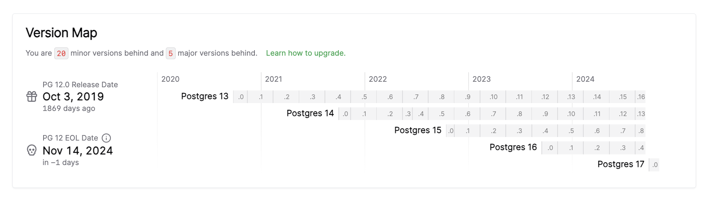

According to PostgreSQL's [**versioning policy**](https://www.postgresql.org/support/versioning/), PostgreSQL 12, released in 2019, will officially exit its support lifecycle today (2024-11-14).

PG 12's final minor version is 12.21, released on 2024-11-14, and this will be PG 12's ultimate version. Meanwhile, the newly released PostgreSQL 17.1 becomes the appropriate choice for new business ventures.

| Version | Current minor | Supported | First Release      | Final Release     |
|---------|---------------|-----------|--------------------|-------------------|
| 17      | 17.1          | Yes       | September 26, 2024 | November 8, 2029  |
| 16      | 16.5          | Yes       | September 14, 2023 | November 9, 2028  |
| 15      | 15.9          | Yes       | October 13, 2022   | November 11, 2027 |
| 14      | 14.14         | Yes       | September 30, 2021 | November 12, 2026 |
| 13      | 13.17         | Yes       | September 24, 2020 | November 13, 2025 |
| 12      | 12.21         | No        | October 3, 2019    | November 14, 2024 |

--------

## PG12 Steps Down

Over the past five years, PG 12's previous minor version PostgreSQL 12.20 compared to PostgreSQL 12.0 released five years ago has fixed 34 security issues and 936 bugs.

This final release version 12.21 fixes four CVE security vulnerabilities and performs 17 bug fixes. From now on, PostgreSQL 12 will be discontinued with no more security and error fixes:

- [CVE-2024-10976](https://www.postgresql.org/support/security/CVE-2024-10976/): PostgreSQL row security bypassed user ID changes in subqueries
- [CVE-2024-10977](https://www.postgresql.org/support/security/CVE-2024-10977/): PostgreSQL libpq retains error messages from man-in-the-middle
- [CVE-2024-10978](https://www.postgresql.org/support/security/CVE-2024-10978/): PostgreSQL SET ROLE, SET SESSION AUTHORIZATION resets to wrong user ID
- [CVE-2024-10979](https://www.postgresql.org/support/security/CVE-2024-10979/): PostgreSQL PL/Perl environment variable changes enable arbitrary code execution

As time progresses, risks from running older versions will continue to rise. Please create upgrade plans for users still using PG 12 or earlier versions in production environments, upgrading to supported major versions (13-17).

PostgreSQL 12, released five years ago, I consider a milestone version following PG 10. Mainly, PG 12 introduced pluggable storage engine interfaces, allowing third parties to develop new storage engines. Additionally, there were important observability/usability improvements - such as real-time reporting of various task progress, using csvlog format for easier processing and analysis; furthermore, partitioned tables had significant performance improvements, becoming mature.

Of course, my deeper impression of PG 12 is that when I created [Pigsty](https://pigsty.cc/zh/) - this out-of-the-box PostgreSQL database distribution - the first publicly released supported major version was PostgreSQL 12. Now, five years have passed in a blink, and memories of adapting PG 11 to PG 12 new features are still vivid.

Over these five years, Pigsty evolved from a personal PostgreSQL monitoring system/test sandbox into a widely-used open-source project with global community recognition. Looking back, it's quite moving.

--------

## PG17 Rises

One version's death corresponds to another version's birth. According to PG versioning policy, today's routine quarterly minor version release will release 17.1.

My friend Qunar's Shuailong likes to immediately upgrade when PG new versions come out. My own habit is to wait an additional minor version after major versions are released.

Because typically, after new major versions are released, many small glitches and fixes are resolved in x.1, and the three-month buffer is sufficient for PG ecosystem extension plugins to catch up and complete adaptation, providing support for new major versions - which is very important for PG ecosystem users.

From PG 12 to current PG 17, the PG community added 48 new functionality features and proposed 130 performance improvements. Particularly, PostgreSQL 17's write throughput, according to official statements, shows up to double improvement compared to previous versions in some scenarios - quite worth upgrading.

> https://smalldatum.blogspot.com/2024/09/postgres-17rc1-vs-sysbench-on-small.html

I previously conducted comprehensive [**performance evaluation**](/pg/pg-performence) of PostgreSQL 14, but that was three years ago, so I plan to conduct a fresh evaluation targeting the latest PostgreSQL 17.1.

Recently I got an incredibly powerful physical machine: 128C 256G, with four 3.2T Gen4 NVMe SSDs plus one hardware NVMe RAID acceleration card. I'm preparing to see what performance PostgreSQL, pgvector, and a series of OLAP extension plugins can deliver on this performance monster. Results coming soon.

Overall, I believe 17.1's release will be an appropriate upgrade timing. I'm also preparing to release Pigsty v3.1 in the coming days, upgrading PG 17 as Pigsty's default major version, replacing the original PG16.

Considering PostgreSQL provides logical replication functionality after 10.0, and Pigsty provides complete solutions for zero-downtime blue-green deployment upgrades using logical replication - PG major version upgrades are no longer as difficult as before. I'll also launch a zero-downtime major version upgrade tutorial soon, helping users seamlessly upgrade existing PostgreSQL 16 or lower versions to PG 17.

--------

## PG17 Extensions

What's very gratifying is that compared to upgrading from PG 15 to PG 16, this time PostgreSQL extension ecosystem adaptation speed is quite fast, demonstrating strong vitality.

For example, last year PG 16 was released in mid-September, but major extension plugins weren't basically complete until half a year later - for instance, TimescaleDB, a core extension in the PG ecosystem, didn't complete PG 16 support until early February with version 2.13. Other extensions were similar.

Therefore, PG 16 reached a basically satisfactory state only half a year after release. Pigsty also elevated PG 16 as Pigsty's primary default major version at that time, replacing PG 15.

This time, the replacement from PG 16 to PG 17 saw significantly accelerated ecosystem adaptation - completing in less than three months what previously took six months, nearly double the speed from PG 15 to 16.

| Version | Release Date | Summary                                                    | Link                                                            |
|:-------|:----------:|------------------------------------------------------------|-----------------------------------------------------------------|
| v3.1.0 | 2024-11-20 | PG 17 as default major version, simplified config, Ubuntu 24 & ARM support | WIP                                                           |
| v3.0.4 | 2024-10-30 | PG 17 extensions, OLAP full suite, pg_duckdb                | [v3.0.4](https://github.com/Vonng/pigsty/releases/tag/v3.0.4) |
| v3.0.3 | 2024-09-27 | PostgreSQL 17, Etcd ops optimization, IvorySQL 3.4, PostGIS 3.5 | [v3.0.3](https://github.com/Vonng/pigsty/releases/tag/v3.0.3) |
| v3.0.2 | 2024-09-07 | Minimal installation mode, PolarDB 15 support, monitoring view updates | [v3.0.2](https://github.com/Vonng/pigsty/releases/tag/v3.0.2) |
| v3.0.1 | 2024-08-31 | Routine fixes, Patroni 4 support, Oracle compatibility improvements | [v3.0.1](https://github.com/Vonng/pigsty/releases/tag/v3.0.1) |
| v3.0.0 | 2024-08-25 | 333 extension plugins, pluggable kernels, MSSQL, Oracle, PolarDB compatibility | [v3.0.0](https://github.com/Vonng/pigsty/releases/tag/v3.0.0) |
| v2.7.0 | 2024-05-20 | Extension explosion, 20+ powerful new extensions, multiple Docker apps | [v2.7.0](https://github.com/Vonng/pigsty/releases/tag/v2.7.0) |
| v2.6.0 | 2024-02-28 | PG 16 as default major version, introducing ParadeDB and DuckDB extensions | [v2.6.0](https://github.com/Vonng/pigsty/releases/tag/v2.6.0) |
| v2.5.1 | 2023-12-01 | Routine minor update, PG16 important extension support        | [v2.5.1](https://github.com/Vonng/pigsty/releases/tag/v2.5.1) |
| v2.5.0 | 2023-09-24 | Ubuntu/Debian support: bullseye, bookworm, jammy, focal      | [v2.5.0](https://github.com/Vonng/pigsty/releases/tag/v2.5.0) |
| v2.4.1 | 2023-09-24 | Supabase/PostgresML support and various new extensions: graphql, jwt, pg_net, vault | [v2.4.1](https://github.com/Vonng/pigsty/releases/tag/v2.4.1) |
| v2.4.0 | 2023-09-14 | PG16, RDS monitoring, service consulting support, new extensions: Chinese word segmentation full-text search/graph/HTTP/embedding | [v2.4.0](https://github.com/Vonng/pigsty/releases/tag/v2.4.0) |
| v2.3.1 | 2023-09-01 | PGVector with HNSW, PG 16 RC1, documentation refresh, Chinese docs, routine fixes | [v2.3.1](https://github.com/Vonng/pigsty/releases/tag/v2.3.1) |
| v2.3.0 | 2023-08-20 | Host VIP, ferretdb, nocodb, MySQL stub, CVE fixes           | [v2.3.0](https://github.com/Vonng/pigsty/releases/tag/v2.3.0) |
| v2.2.0 | 2023-08-04 | Dashboard & provisioning redo, UOS compatibility            | [v2.2.0](https://github.com/Vonng/pigsty/releases/tag/v2.2.0) |
| v2.1.0 | 2023-06-10 | Support PostgreSQL 12 ~ 16beta                              | [v2.1.0](https://github.com/Vonng/pigsty/releases/tag/v2.1.0) |
| v2.0.2 | 2023-03-31 | Added pgvector support, fixed MinIO CVE                     | [v2.0.2](https://github.com/Vonng/pigsty/releases/tag/v2.0.2) |
| v2.0.1 | 2023-03-21 | v2 bug fixes, security enhancements, Grafana version upgrade | [v2.0.1](https://github.com/Vonng/pigsty/releases/tag/v2.0.1) |
| v2.0.0 | 2023-02-28 | Major architecture upgrade, significantly enhanced compatibility, security, maintainability | [v2.0.0](https://github.com/Vonng/pigsty/releases/tag/v2.0.0) |

> [Pigsty Release Note](/zh/docs/releasenote)

This time from PG 16 to PG 17, ecosystem adaptation speed significantly accelerated, completing in less than three months what previously took six months. In this regard, I'm proud to say I did considerable work.

For example, in the "[PostgreSQL Divine Skill Achievement! Most Complete Extension Repository](https://mp.weixin.qq.com/s/Dv3--O0K70Fevz39r3T4Ag)" introduction of https://pgext.cloud, maintaining over half of PG ecosystem extension plugins.

I recently completed this major task, building over 140 extensions I maintain for PG 17 (also adding Ubuntu 24.04 and partial ARM support), and personally fixing or requesting extension authors to fix dozens of extensions with compatibility issues.

Current results: On EL systems, 301 of 334 available extensions are available on PG 17, while on Debian systems, 302 of 326 extensions are available on PG 17.

| Entry / Filter | All | PGDG | PIGSTY | CONTRIB | MISC | MISS | **PG17** | PG16 | PG15 | PG14 | PG13 | PG12 |
|:--------------:|:---:|:----:|:------:|:-------:|:----:|:----:|:--------:|:----:|:----:|:----:|:----:|:----:|
| RPM Extension  | 334 | 115  |  143   |   70    |  4   |  6   |   301    | 330  | 333  | 319  | 307  | 294  |
| DEB Extension  | 326 | 104  |  144   |   70    |  4   |  14  |   302    | 322  | 325  | 316  | 303  | 293  |

> Pigsty achieved PostgreSQL extension ecosystem grand alignment

Among major extensions currently missing are distributed extension Citus and columnar extension Hydra, graph database extension AGE, and PGML still haven't provided PG 17 support. However, other powerful extensions are now PG 17 Ready.

Particularly worth emphasizing are the recent hot OLAP DuckDB extension integration competitions in the PG ecosystem, including ParadeDB's `pg_analytics`, domestic individual developer Li Hongyan's `duckdb_fdw`, CrunchyData's `pg_parquet`, MooncakeLab's `pg_mooncake`, Hydra and DuckDB original MotherDuck's personally-developed `pg_duckdb` - all have achieved PG 17 support and are available in Pigsty extension repository.

Considering distributed Citus has few users, and columnar Hydra has plenty of new DuckDB extensions as replacements, I believe PG17 has reached a satisfactory state in extension ecosystem and can be used as the primary major version for production environments. Achieving this on PG17 took nearly half the time compared to PG 16.

-------

## About Pigsty v3.1

Pigsty is an open-source, free, out-of-the-box PostgreSQL database distribution that can locally deploy enterprise-grade RDS cloud database services with one click, helping users make good use of the world's most advanced open-source database - PostgreSQL.

PostgreSQL is undoubtedly about to become the Linux kernel of the database field, while Pigsty aims to become the Debian distribution of the Linux kernel. Our PostgreSQL database distribution has six key value propositions:

* Provides the most comprehensive extension plugin support in PostgreSQL ecosystem
* Provides the most powerful and comprehensive monitoring system in PostgreSQL ecosystem  
* Provides out-of-the-box, easy-to-use tool collections and best practices
* Provides self-healing, maintenance-free smooth high availability/PITR experience
* Provides reliable deployment running directly on bare OS without containers
* No vendor lock-in, democratized RDS experience, autonomous and controllable

Incidentally, we added PG kernel replacement capability in Pigsty v3, allowing you to use derivative PG kernels to obtain unique capabilities and features:

- Microsoft SQL Server compatible [Babelfish](/zh/docs/kernel/babelfish) kernel support
- Oracle compatible [IvorySQL](/zh/docs/kernel/ivorysql) 3.4 kernel support  
- Alibaba-Cloud [PolarDB](/zh/docs/kernel/polardb) for PostgreSQL/Oracle domestic innovation kernel support
- Allows users to more conveniently self-build [Supabase](/zh/docs/kernel/supabase) - open-source Firebase, one-stop backend platform

If you want to use authentic PostgreSQL experience, welcome to use our distribution - open source and free, no vendor lock-in. We also provide commercial consulting support to solve your difficult problems and worries.