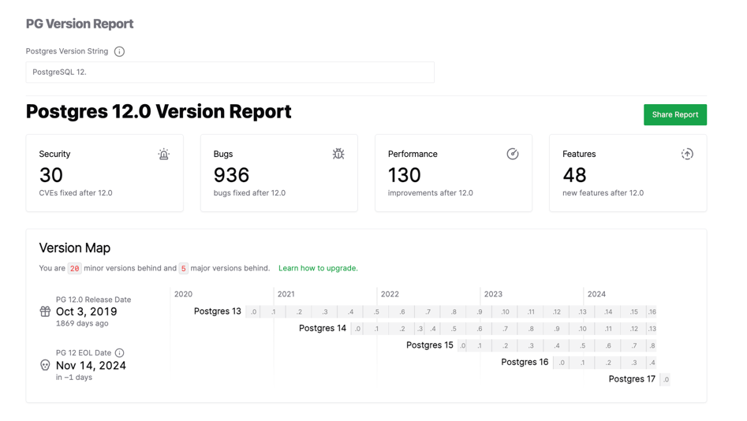
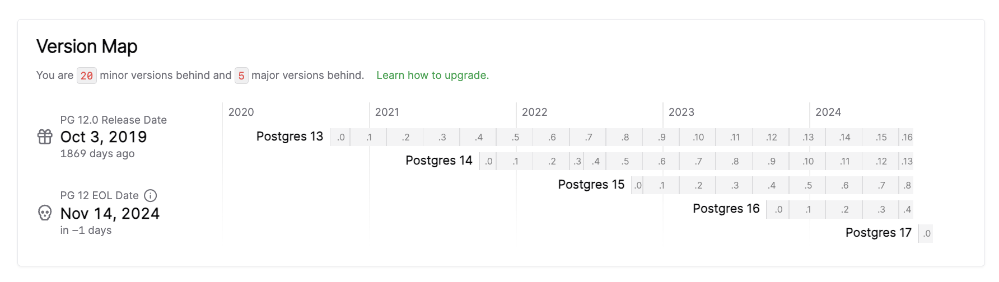
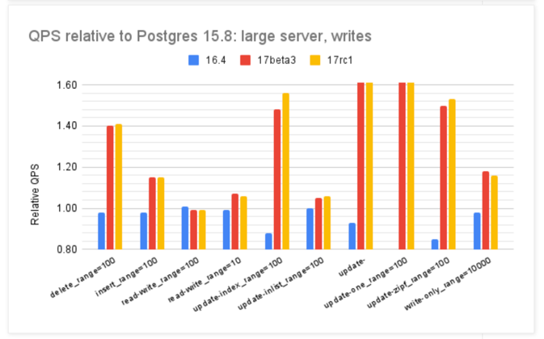

根据 PostgreSQL 的 [**版本策略**](https://www.postgresql.org/support/versioning/)，在 2019 年发布的 PostgreSQL12 将于今日（2024-11-14）正式脱离支持生命周期。

PG 12 最后一个小版本为 2024-11-14 发布的 12.21，而这将是 PG 12 的最终版本，而新发布的 PostgreSQL 17.1 则将成为当下合适的新业务选择。

| Version | Current minor | Supported | First Release      | Final Release     |
|---------|---------------|-----------|--------------------|-------------------|
| 17      | 17.1          | Yes       | September 26, 2024 | November 8, 2029  |
| 16      | 16.5          | Yes       | September 14, 2023 | November 9, 2028  |
| 15      | 15.9          | Yes       | October 13, 2022   | November 11, 2027 |
| 14      | 14.14         | Yes       | September 30, 2021 | November 12, 2026 |
| 13      | 13.17         | Yes       | September 24, 2020 | November 13, 2025 |
| 12      | 12.21         | No        | October 3, 2019    | November 14, 2024 |

--------

## PG12下台

在过去五年中，PG 12 的上一个小版本 PostgreSQL 12.20 相对于五年前发布的 PostgreSQL 12.0  修复了 34 个安全问题，936 个 Bug。

这次发布的停产版本 12.1 修复了四个 CVE 安全漏洞，并进行了 17 项 Bug 修复，从此之后，PostgreSQL 12 就停产了，不再提供安全和错误修复

- [CVE-2024-10976](https://www.postgresql.org/support/security/CVE-2024-10976/)：以下 PostgreSQL 行安全性（例如子查询）忽略了用户 ID 更改
- [CVE-2024-10977](https://www.postgresql.org/support/security/CVE-2024-10977/)：PostgreSQL libpq 保留了来自中间人的错误消息
- [CVE-2024-10978](https://www.postgresql.org/support/security/CVE-2024-10978/)：PostgreSQL SET ROLE、SET SESSION AUTHORIZATION 重置为错误的用户 ID
- [CVE-2024-10979](https://www.postgresql.org/support/security/CVE-2024-10979/)：PostgreSQL PL/Perl 环境变量更改执行任意代码

随着时间推移，运行老版本带来的风险将会持续上升， 请仍然在生产环境中使用 PG 12 或更早版本的用户制定升级计划，升级到到受支持的大版本（13-17）

PostgreSQL 12 是五年前发布的版本，我认为是继 PG 10 之后的一个具有里程碑意义的版本。主要是 PG 12 引入了可插拔存储引擎的接口，允许第三方开发新的存储引擎。此外，还有一些重要的可观测性/易用性改进也发生在这个版本 —— 例如实时报告各种任务的进度，使用csvlog格式便于处理分析；此外，分区表也有了显著的性能改善，趋于成熟。

当然，我对 PG 12 印象比较深刻的原因是，当我做 [Pigsty](https://pigsty.cc/zh/) 这个开箱即用的 PostgreSQL 数据库发行版时。第一个公开发布支持的大版本就是 PostgreSQL 12。现在一眨眼五年过去了，当时的从 PG 11 适配 PG 12 新特性的回忆还历历在目。

在这五年里，Pigsty 从一个自己用的PG监控系统/测试沙箱，变成了一个被广泛使用的开源项目，在全球社区都有了知名度。回头看看，不禁有些感慨。

--------

## PG17上位

一个版本的死去也对应着另一个版本的新生。按照 PG 版本策略，今天的例行季度小版本发布，将会发布 17.1 。

我的朋友 Qunar 帅龙喜欢在 PG 新版本出来时立刻跟进升级，我自己的习惯则是在大版本出来后，额外观察等待一个小版本。

因为通常来说，新的大版本发布后，大量小瑕疵小修小补都会在 x.1 中得到解决，二来三个月的缓冲区，足够让 PG 生态中的扩展插件跟进并完成适配，对新的大版本提供支持，而这对于 PG 生态用户来说是非常重要的。

从 PG 12 到现在的 PG 17，PG 社区添加了 48 项新功能特性，并提出了 130 项性能改进。特别是 PostgreSQL 17 的写入吞吐，按照官方的说法在一些场景下，相比先前版本有高达两倍的提升，还是很值得升级的。

> https://smalldatum.blogspot.com/2024/09/postgres-17rc1-vs-sysbench-on-small.html

之前我对 PostgreSQL 14 进行过一次全方位的 [**性能评测**](/pg/pg-performence)，但那已经是三年前了，所以我准备针对最新的 PostgreSQL 17.1 重新进行一次评测。

最近我整了台非常牛逼的物理机，128C 256G，配四块 3.2 T Gen4 NVMe SSD 加一块硬件 NVMe RAID 加速卡，准备看看 PostgreSQL，pgvector，以及一系列 OLAP 扩展插件能在这台性能怪兽上表现出什么样的性能，结果敬请期待。

总的来说，我认为 17.1 的推出将会是一个合适的升级时机，我也准备在未来几天里发布 Pigsty v3.1 ，在里面将 PG 17 升级为 Pigsty 默认使用的主要大版本，取代原本的 PG16。

考虑到 PostgreSQL 在 10.0 之后提供了逻辑复制的功能特性，而 Pigsty 提供了使用逻辑复制进行不停机的蓝绿部署升级的完整方案 —— PG 大版本升级的难度早已今非昔比。我也将会在近期推出一个不停机大版本升级教程，帮助用户将现有的 PostgreSQL 16 或更低版本无缝升级到 PG 17

--------

## PG17扩展

让我很欣慰的一点是，相比于从 PG 15 到 PG 16 的升级，这一次 PostgreSQL 扩展生态的跟进速度相当之快，体现出了强大的活力。

例如，去年 PG 16 在九月中旬发布，但是主要的扩展插件要到半年后才基本齐全 —— 比如 PG 生态的一个核心扩展 TimescaleDB 就等到二月初的 2.13 才完成 PG 16 支持， 其他的扩展也大体类似。

因此在 PG 16 发布半年后，才到达了一个基本令人满意的状态。Pigsty 也是在那时将 PG 16 提升为 Pigsty 首要使用的默认大版本，替代 PG 15。

而这一次从 PG 16 到 PG 17 的替换，生态适配的速度显著加快了，三个月不到就完成了之前需要半年的活计，比 PG 15 到 16 的速度快了近一倍。

| 版本     |    发布时间    | 摘要                                                      | 地址                                                            |
|:-------|:----------:|---------------------------------------------------------|---------------------------------------------------------------|
| v3.1.0 | 2024-11-20 | PG 17 作为默认大版本，配置简化，Ubuntu 24 与 ARM 支持                   | WIP                                                           |
| v3.0.4 | 2024-10-30 | PG 17 扩展，OLAP 全家桶，pg_duckdb                             | [v3.0.4](https://github.com/Vonng/pigsty/releases/tag/v3.0.4) |
| v3.0.3 | 2024-09-27 | PostgreSQL 17，Etcd 运维优化，IvorySQL 3.4，PostGIS 3.5        | [v3.0.3](https://github.com/Vonng/pigsty/releases/tag/v3.0.3) |
| v3.0.2 | 2024-09-07 | 精简安装模式，PolarDB 15支持，监控视图更新                              | [v3.0.2](https://github.com/Vonng/pigsty/releases/tag/v3.0.2) |
| v3.0.1 | 2024-08-31 | 例行问题修复，Patroni 4支持，Oracle兼容性改进                          | [v3.0.1](https://github.com/Vonng/pigsty/releases/tag/v3.0.1) |
| v3.0.0 | 2024-08-25 | 333个扩展插件，可插拔内核，MSSQL，Oracle，PolarDB 兼容性                 | [v3.0.0](https://github.com/Vonng/pigsty/releases/tag/v3.0.0) |
| v2.7.0 | 2024-05-20 | 扩展大爆炸，新增20+强力扩展插件，与多款Docker应用                           | [v2.7.0](https://github.com/Vonng/pigsty/releases/tag/v2.7.0) |
| v2.6.0 | 2024-02-28 | PG 16 作为默认大版本，引入 ParadeDB 与 DuckDB 等扩展                  | [v2.6.0](https://github.com/Vonng/pigsty/releases/tag/v2.6.0) |
| v2.5.1 | 2023-12-01 | 例行小版本更新，PG16重要扩展支持                                      | [v2.5.1](https://github.com/Vonng/pigsty/releases/tag/v2.5.1) |
| v2.5.0 | 2023-09-24 | Ubuntu/Debian支持：bullseye, bookworm, jammy, focal        | [v2.5.0](https://github.com/Vonng/pigsty/releases/tag/v2.5.0) |
| v2.4.1 | 2023-09-24 | Supabase/PostgresML支持与各种新扩展：graphql, jwt, pg_net, vault | [v2.4.1](https://github.com/Vonng/pigsty/releases/tag/v2.4.1) |
| v2.4.0 | 2023-09-14 | PG16，监控RDS，服务咨询支持，新扩展：中文分词全文检索/图/HTTP/嵌入等               | [v2.4.0](https://github.com/Vonng/pigsty/releases/tag/v2.4.0) |
| v2.3.1 | 2023-09-01 | 带HNSW的PGVector，PG 16 RC1, 文档翻新，中文文档，例行问题修复              | [v2.3.1](https://github.com/Vonng/pigsty/releases/tag/v2.3.1) |
| v2.3.0 | 2023-08-20 | 主机VIP, ferretdb, nocodb, MySQL存根, CVE修复                 | [v2.3.0](https://github.com/Vonng/pigsty/releases/tag/v2.3.0) |
| v2.2.0 | 2023-08-04 | 仪表盘 & 置备重做，UOS 兼容性                                      | [v2.2.0](https://github.com/Vonng/pigsty/releases/tag/v2.2.0) |
| v2.1.0 | 2023-06-10 | 支持 PostgreSQL 12 ~ 16beta                               | [v2.1.0](https://github.com/Vonng/pigsty/releases/tag/v2.1.0) |
| v2.0.2 | 2023-03-31 | 新增 pgvector 支持，修复 MinIO CVE                             | [v2.0.2](https://github.com/Vonng/pigsty/releases/tag/v2.0.2) |
| v2.0.1 | 2023-03-21 | v2 错误修复，安全增强，升级 Grafana 版本                              | [v2.0.1](https://github.com/Vonng/pigsty/releases/tag/v2.0.1) |
| v2.0.0 | 2023-02-28 | 架构大升级，兼容性、安全性、可维护性显著增强                                  | [v2.0.0](https://github.com/Vonng/pigsty/releases/tag/v2.0.0) |

> [Pigsty Release Note](/zh/docs/releasenote)

而这一次从 PG 16 - PG 17，生态适配的速度显著加快了，这才三个月不到，就完成了之前需要半年的活计。在这一点上，我很自豪地说，我还是做了不少工作的。
比如在《[PostgreSQL神功大成！最全扩展仓库](https://mp.weixin.qq.com/s/Dv3--O0K70Fevz39r3T4Ag)》中介绍过的 https://ext.pigsty.io ，这里维护了 PG 生态超过一半的扩展插件。

而我也是在最近刚刚完成这件大活，把自己维护的一百四十个多个扩展针对 PG 17 进行了构建（当然还做了 Ubuntu 24.04 和部分 ARM 支持），并且自己修复或者提请扩展作者修复了几十个有兼容问题的扩展插件。
目前实现的效果是：在 EL 系统上， 334 个可用扩展有 301 个已经在 PG 17 可用，而在 Debian 系统上，326 个扩展也已经有 302 个在 PG 17 上可用。

| Entry / Filter | All | PGDG | PIGSTY | CONTRIB | MISC | MISS | **PG17** | PG16 | PG15 | PG14 | PG13 | PG12 |
|:--------------:|:---:|:----:|:------:|:-------:|:----:|:----:|:--------:|:----:|:----:|:----:|:----:|:----:|
| RPM Extension  | 334 | 115  |  143   |   70    |  4   |  6   |   301    | 330  | 333  | 319  | 307  | 294  |
| DEB Extension  | 326 | 104  |  144   |   70    |  4   |  14  |   302    | 322  | 325  | 316  | 303  | 293  |

> Pigsty 实现了 PostgreSQL 扩展生态的大对齐

目前主要的扩展中，还有分布式扩展 Citus 和列存扩展 Hydra 缺位，图数据库扩展 AGE，PGML 也依然还没有提供 PG 17 的支持，不过其他的强力扩展目前均已实现 PG 17 Ready，
其中，特别要强调一下最近在 PG 生态如火如荼的 OLAP DuckDB 扩展缝合大赛，包括 ParadeDB 的 `pg_analytics`，国内个人开发者李红艳编写的 `duckdb_fdw`，CrunchyData 的 `pg_parquet`，MooncakeLab 的 `pg_mooncake`，
Hydra 和 DuckDB 原厂 MotherDuck 亲自下场搞的 `pg_duckdb`，全部都已经实现了 PG 17 支持，并且在 Pigsty 扩展仓库中可用。

考虑到分布式的 Citus 用户并不多，列存 Hydra 已经有大把全新的 DuckDB 扩展可以替代，我认为 PG17 在扩展生态上已经达到了一个令人满意的状态，可以作为生产环境的首要大版本使用了。而在 PG17 上实现这一点的用时，比 PG 16 快了近一倍

-------

## 关于 Pigsty v3.1

Pigsty 是一个开源免费，开箱即用的 PostgreSQL 数据库发行版，可以在本地一键拉起企业级 RDS 云数据库服务，帮助用户用好世界上最先进的开源数据库 —— PostgreSQL。

PostgreSQL 已经毫无疑问地即将成为数据库领域的 Linux 内核，而 Pigsty 旨在成为 Linux 内核的 Debian 发行版。我们的 PostgreSQL 数据库发行版有六条关键价值主张：

* 提供 PostgreSQL 生态中最全面的扩展插件支持
* 提供 PostgreSQL 生态中最强大全面的监控系统
* 提供开箱即用，简单易用的工具集合以及最佳实践
* 提供故障自愈，免运维的丝滑高可用/PITR体验
* 提供无需容器，直接运行在裸OS上的可靠部署
* 无供应商锁定，民主化的 RDS 体验，自主可控

顺便一提，我们在 Pigsty v3 中增加了 PG 系内核替换能力，您可以使用衍生版 PG 内核，获取一些独特的能力与特性：

- 微软 SQL Server 兼容的 [Babelfish](/zh/docs/kernel/babelfish) 内核支持
- Oracle 兼容的 [IvorySQL](/zh/docs/kernel/ivorysql) 3.4 内核支持
- 阿里云 [PolarDB](/zh/docs/kernel/polardb) for PostgreSQL / Oracle 国产化信创内核支持
- 允许用户更方便地自建 [Supabase](/zh/docs/kernel/supabase) —— 开源 Firebase，一站式后端平台

如果您希望使用原汁原味的 PostgreSQL 体验，欢迎使用我们的发行版，开源免费，没有供应商锁定；同时我们也提供商业咨询支持，为您解决疑难杂症兜底的需求与烦恼。

