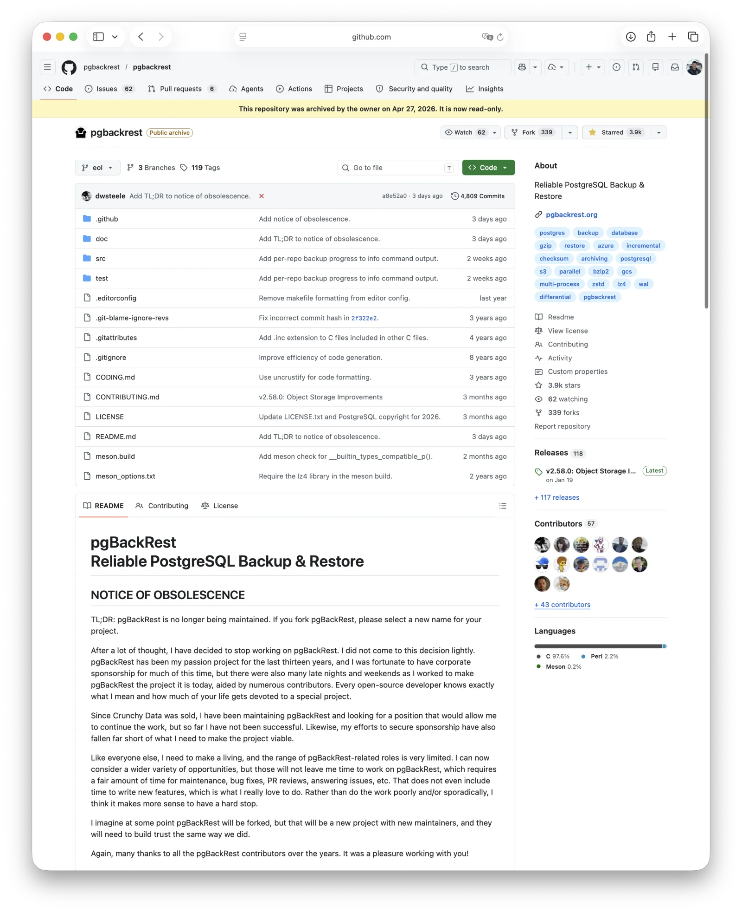
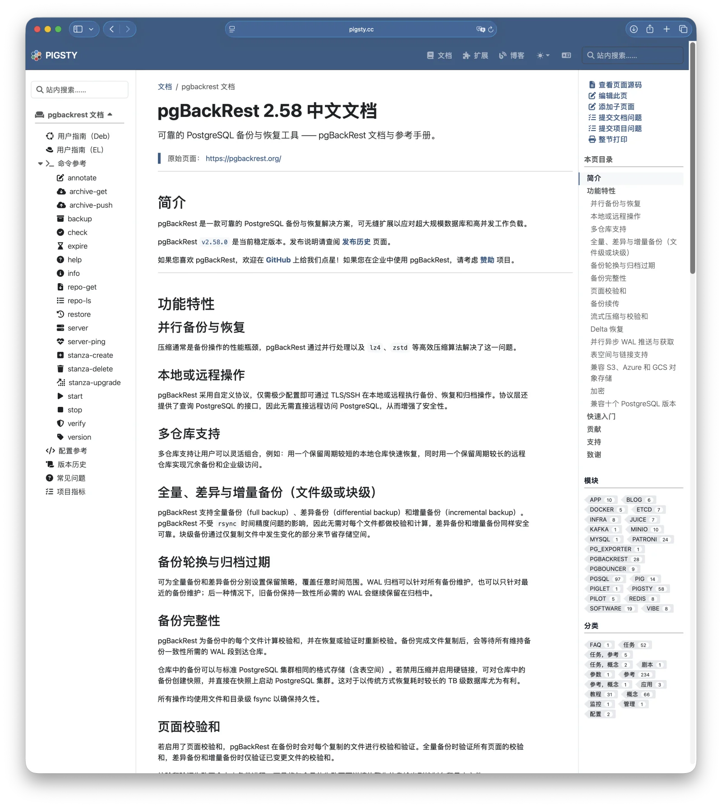
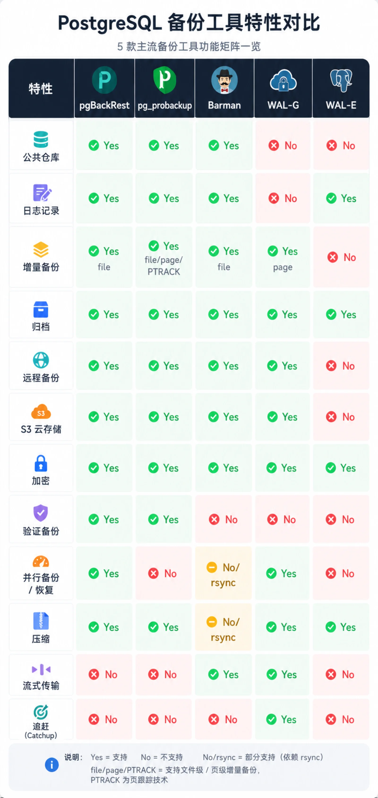
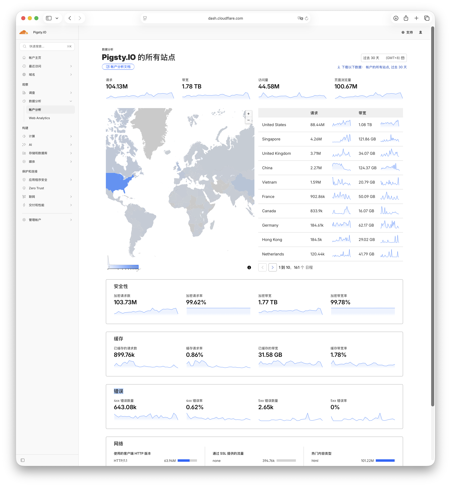

On April 27, David Steele formally archived **pgBackRest**, the most important backup tool in the PostgreSQL ecosystem.

The announcement appeared on GitHub and LinkedIn. It was brief and direct:

## The End-of-Maintenance Announcement

> **TL;DR:** pgBackRest is no longer being maintained. If you fork pgBackRest, please select a new name for your project.
>
> After a lot of thought, I have decided to stop working on pgBackRest. I did not come to this decision lightly. pgBackRest has been my passion project for the last thirteen years, and I was fortunate to have corporate sponsorship for much of this time, but there were also many late nights and weekends as I worked to make pgBackRest the project it is today, aided by numerous contributors. Every open-source developer knows exactly what I mean and how much of your life gets devoted to a special project.
>
> Since Crunchy Data was sold, I have been maintaining pgBackRest and looking for a position that would allow me to continue the work, but so far I have not been successful. Likewise, my efforts to secure sponsorship have also fallen far short of what I need to make the project viable.
>
> Like everyone else, I need to make a living, and the range of pgBackRest-related roles is very limited. I can now consider a wider variety of opportunities, but those will not leave me time to work on pgBackRest, which requires a fair amount of time for maintenance, bug fixes, PR reviews, answering issues, etc. That does not even include time to write new features, which is what I really love to do. Rather than do the work poorly and/or sporadically, I think it makes more sense to have a hard stop.
>
> I imagine at some point pgBackRest will be forked, but that will be a new project with new maintainers, and they will need to build trust the same way we did.
>
> Again, many thanks to all the pgBackRest contributors over the years. It was a pleasure working with you!

--------

## This Is No Small Matter for PostgreSQL Users

pgBackRest is the de facto standard for PostgreSQL backup and recovery, and, for many DBAs, the best recovery tool in the business.
Countless PostgreSQL DBaaS offerings use it for backups. It is also Pigsty's default backup solution.

pgBackRest has taken PostgreSQL backup about as far as it can go:

- **Parallel** backup and parallel delta restore, reducing the recovery window to a minimum
- Turning once-cumbersome **PITR** (point-in-time recovery) into a single command
- Elegantly handling **WAL archiving**, **repository management**, and **object-storage integration**
- Full, differential, and incremental backups; block-level compression and encryption; asynchronous archiving to multiple repositories; backup from a standby...
  Every requirement a DBA can think of in a backup system is there, implemented reliably and well

When I first evaluated database backup tools ten years ago, I chose pgBackRest. I recently ran the evaluation again, reassessing every actively maintained option on the market. pgBackRest still won.
When version 2.0 first came out, I even translated its documentation by hand. Just last month, I used Claude to [**translate it all over again**](https://pigsty.cc/docs/pgbackrest), together with the Patroni and PgBouncer documentation.

I have relied on this tool for nearly a decade, and I trust it deeply. Now its sole maintainer has archived the repository.

--------

## What Really Happened

David said it plainly in his farewell: he could not raise enough money to keep doing the work.

Before the acquisition, David was an architect at Crunchy Data, a PostgreSQL services company.
Last June, data-lakehouse giant **Snowflake acquired Crunchy Data for $250 million**.

After the acquisition, David spent months trying to find a role, at the new parent company or elsewhere, that would allow him to continue maintaining the project. He did not find one.
He also tried to secure independent sponsorship, but came nowhere near the level required to make a living. He has bills to pay and a family to support, so he chose a clean break over doing the work halfheartedly and intermittently.

Here is the deeply uncomfortable part: **Snowflake is one of the most highly valued companies in data infrastructure today**.
It publicly says it is building "AI-native Postgres" and paid $250 million for Crunchy Data. Yet judging by the outcome, it does not appear to have continued funding David's work on pgBackRest.
Someone a small company could afford somehow became unaffordable to a much larger one.

**If that inference is correct, calling this merely self-defeating would be charitable.** Snowflake saved very little, yet pulled one of the PostgreSQL ecosystem's most important load-bearing beams out from under it. That is not a rational business decision. It is simply a terrible look.

The AI gold rush has completely rewritten corporate budgets. Buy memory, GPUs, or tokens, and there is a straightforward ROI story to tell.
Pay someone to make sure your database can still be restored after disaster strikes, and there is no ROI story, only "nothing bad happened." Boards award no points for nothing bad happening.

--------

## What the Community Is Debating

In the days since the announcement, the PostgreSQL community has been busy: a Hacker News discussion with more than 200 points, a stream of vendor blog posts, and mailing-list threads asking, "What happens next?"
The debate broadly falls into a few camps.

**First, the diagnosis of open-source sustainability.** The prevailing view is that sustainable open source does not run on charity, but on a virtuous cycle:
**"A company invests in engineers → the software creates value → users buy commercial support → the company reinvests."**
The maintenance crisis around pgBackRest arose because that loop was never completed.
An engineer at a single company maintained it; a network of vendors offering commercial support never emerged.
Once that company was acquired and its strategy changed, the entire chain snapped.

**Second, whether to fork immediately.** The major vendors are remarkably aligned: **do not rush into a fork**.
"We do not want ten forks, each maintained by one person." That sort of fragmentation would be the worst possible outcome.
The Linux Foundation took six days of emergency coordination to launch Valkey as an alternative to Redis. When building multi-vendor governance, moving a little slowly is far better than moving chaotically.

**Third, what a fork should be called.** David was explicit in his farewell:
"I imagine at some point pgBackRest will be forked, but that will be a new project with new maintainers, and they will need to build trust the same way we did."
In other words, the new project cannot keep the pgBackRest name.

I side with David on this requirement. It may be **the most responsible thing he did on his way out**.
Backup tools are among the highest-value targets for supply-chain attacks. If malicious code were slipped into an upgrade to a widely trusted backup program,
it could gain powerful access on nearly every PostgreSQL instance where the program was deployed and reach all of its historical data.
Handing the trust accumulated through thousands of GitHub stars intact to an unknown successor would not be generosity. It would be irresponsible.
Requiring a fork to adopt a new name forces users to perform a fresh trust assessment. That is a basic requirement of security engineering.

--------

## My Take

My first reaction to the news was genuine regret.

After all, I am a heavy pgBackRest user myself. If nobody else steps up, **I would be willing to take it on and keep it alive**.

I have already done this once with MinIO. I needed the software myself, and after upstream pulled the rug and walked away, I had no choice but to maintain my own fork.
If new feature development were off the table, taking over pgBackRest maintenance would not be entirely unreasonable.

Still, I do not think pgBackRest is at that point yet. There are several likely paths from here.

**First, one thing seems clear:** **PGConf.Dev** in Vancouver this May will very likely make pgBackRest a major topic of discussion.
The tool affects the core interests of every major vendor in the PostgreSQL ecosystem. The community will not simply let it disappear.

**The realistic outcome is a new fork produced through community negotiation**,
much as the community created Valkey after Redis changed its license.
Since the original name is off limits, the new project might be called `pgbackrest-ng`, `pgbacknext`, or something else.
The key is for one or more vendors to take the lead, make a long-term commitment, and build consensus.

**A worse outcome** would be no lead organization, no path into PGDG, and no consensus among vendors.
Then everyone would maintain an internal fork: one at Percona, one at EDB, and one at each cloud provider. That would be the worst possible ending: real **Fork Wars**.

**The ideal outcome would be for the PGDG core team to take over**, turning pgBackRest into a contrib module or bringing it into the PostgreSQL Global Development Group's family of projects.
Frankly, that would be difficult, and the maintainers of other backup tools might not welcome it.

For now, **Percona has explicitly said** that it will continue supporting pgBackRest for its customers.
That means Percona's customers will not abruptly lose support for pgBackRest. Crunchy's existing products and documentation remain deeply integrated with pgBackRest, but as of this writing, I have seen no new public commitment from the company to maintain the project over the long term.

Let me be explicit as well: if nobody else maintains pgBackRest, I will take it on.
If someone else maintains it well, I will be equally happy to treat that project as upstream, validate and package its releases, distribute them, and provide user feedback.

--------

## Don't Jump Ship in a Panic

In the near term, my advice to PostgreSQL DBAs is simple: if you use pgBackRest, there is no need to worry. **Do not panic, and do not rush to jump ship.**

pgBackRest is very mature software. Archiving the repository means no more pull requests, bug fixes, or releases, but the code is still there. **What works today will still work tomorrow.**

**What problem are you likely to have with pgBackRest right now?** If you stay on the current PostgreSQL 18 with the current pgBackRest v2.58, you can keep running that combination indefinitely.

Any real risks are months to a year or two away. They may emerge after PostgreSQL 19 ships this September, or another major release or two after that.
The current pgBackRest release is compatible with PostgreSQL 18. But if a future major release changes PostgreSQL internals in ways that require adaptation, object-storage APIs or dependency libraries evolve, or security vulnerabilities require patches, things will become difficult.
Those are **medium- and long-term** concerns, not concerns that demand action **today**.

More importantly, there is no true peer to migrate to: **no tool currently offers a drop-in replacement for pgBackRest's full feature set**.

- **Barman** (maintained by EDB) is one of the most credible alternatives.
  Version 3.18 added block-level incremental backup to cloud storage, but that capability is still relatively new
  and remains some distance from pgBackRest's maturity and cohesive experience
- **WAL-G** is a highly practical tool for cloud archiving and recovery, especially common in Kubernetes and cloud-native environments,
  but its scope does not fully overlap with pgBackRest's comprehensive backup-repository management
- **pg_probackup** (from Postgres Professional) was once the only rival that could stand alongside pgBackRest on features,
  with an even more aggressive PTRACK-based block-level incremental backup.
  But the company behind it has a Russian background, and circumstances have been complicated since 2022.
  Worse, the project has a history of serious issue reports involving post-restore data loss and invalid pages
  (for example, [#474](https://github.com/postgrespro/pg_probackup/issues/474) and
  [#249](https://github.com/postgrespro/pg_probackup/issues/249)).
  For a backup tool, that is a nearly fatal blemish, and it makes me personally very reluctant to recommend it

So the best move is to sit tight. Unnecessary churn would itself be the greatest risk.
Keep using pgBackRest, and treat v2.58 as the stable baseline for the foreseeable future.
At the same time, run rigorous restore drills, watch for a clear successor branch after PGConf.Dev, and decide what to do next only then.

--------

## The Deeper Point

What makes David's story particularly sobering is that this is not a tale of a hobbyist burning out. At Crunchy Data, he was **paid to work on open source**.
**That is precisely the "healthy open-source model" the community champions again and again.** Then Snowflake's acquisition dismantled it.

Since 2025, the PostgreSQL world has seen a burst of capital activity: Databricks announced its acquisition of Neon, reportedly for around $1 billion;
Snowflake announced its acquisition of Crunchy Data, reportedly for around $250 million; Databricks then acquired Mooncake Labs; and Supabase was reported to be discussing a funding round at a valuation of roughly $10 billion.

**This is a double-edged sword.** On one hand, it brings more capital into databases, a field that has never been particularly glamorous.
On the other, these small, focused, well-run companies get churned through the machinery of capital, and we end up with absurdities like this one.
A healthy open-source sponsorship loop was severed by a single acquisition.

Cloud vendors have approached me to discuss an acquisition too. I keep returning to the same question:
**If I am acquired, will I still be able to do the open-source work?** Every founder with a measure of idealism should ask that question.

For most individual developers, whether a tool works well is all that matters. Who cares what its maintainer's pay stub looks like?
**Enterprises should take a different view.**

The current situation is surreal. So many PostgreSQL companies, DBaaS vendors, and managed services use pgBackRest that it is effectively **standard equipment**.
Yet the pgBackRest project page currently lists only **one sponsor: Supabase**.
There are plenty of cloud providers with far more money, but many are content to free-ride.
**This is the tragedy of the commons in its purest form:** when everyone assumes that someone else will pay the maintenance cost, the model collapses.

The deeper cause is an inherent conflict in open source: **value creation is separated from value capture**. The people who build the software are not the people who profit from it.
Cloud providers such as AWS earn hundreds of millions, even billions, of dollars every year from managed Postgres and related database services,
while the Postgres core team does not see a dime of it.
The same story has played out repeatedly with Redis, Elasticsearch, and MongoDB. Only the details change.

The PostgreSQL ecosystem has many projects like pgBackRest: not part of the core server, but load-bearing pillars in practice.

- **Patroni**: one of the de facto standards for PostgreSQL high availability, underpinning a large number of self-managed clusters and some Kubernetes operators
- **PgBouncer**: the de facto standard PostgreSQL connection pooler, common in almost any Postgres deployment beyond modest scale
- And then all the FDWs, contrib extensions, monitoring components, and more...

The PostgreSQL world is not short of backup, connection-pooling, or high-availability tools. Each category may offer several choices.
But if what we want is the **best** option, there is often only one real choice.
**If these projects lack healthy maintenance and feedback loops, that is a genuine risk to the PostgreSQL ecosystem.**

--------

## Finally, Pigsty

The pgBackRest situation hits particularly close to home for me. David's story has taught me a great deal.

I build Pigsty, an open-source PostgreSQL distribution, and it has become quite successful.
By GitHub stars, community reputation, and the number of enterprise deployments, I believe Pigsty is now among the very best in the niche of native Linux distributions.

But I maintain it alone: one person writing the code, cutting releases, writing documentation, answering questions, publishing articles, and recording tutorials.

I can keep doing this because **two** things are true at the same time:

1. **I genuinely love the work.** Databases, Postgres, operations automation, and open source are what I have been doing since I left Big Tech. I enjoy it immensely, and I want to keep doing it.
2. **More importantly, enterprise customers really do pay me for support, closing the commercial loop.**

I can support myself without worrying about how to pay the bills, all while doing work I love. It is rewarding both personally and financially, so I can keep maintaining Pigsty.
But if either condition stopped being true, Pigsty might become the next pgBackRest.

That is why David's situation is far more than an industry news story to me. It is a living case study in **how maintainership passes on and how projects grow sustainably**.
On the commercial side, payment creates a concrete commitment: work must be delivered, and someone is accountable.
On the open-source side, the work ultimately depends on **goodwill**. Goodwill can be worn down by free-riding and abuse, and swallowed whole by acquisitions and layoffs.

If my work grows large enough that money is no longer a concern, I will gladly sponsor upstream Postgres projects
and the pillars that hold up its ecosystem: pgBackRest's successor, Patroni, PgBouncer, and others. That is a basic responsibility.

**These projects still work today because someone is carrying the load for you. When they can no longer carry it, your house comes down too.**

Finally, back to David Steele.

Those of us who have benefited from pgBackRest for more than a decade owe him a proper:

**Thank you.**

I hope he soon finds the right next role. And I hope what he built can continue, in a new form, to serve PostgreSQL through the next decade.
