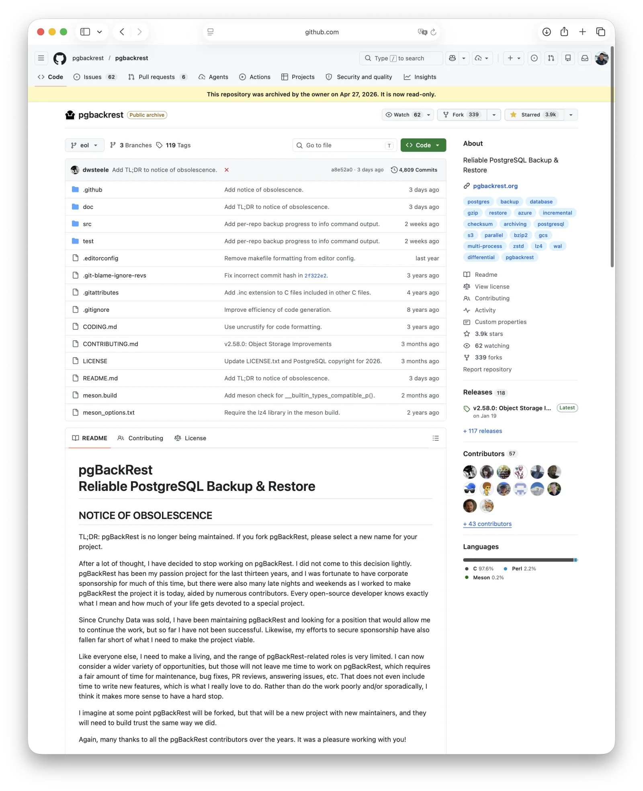
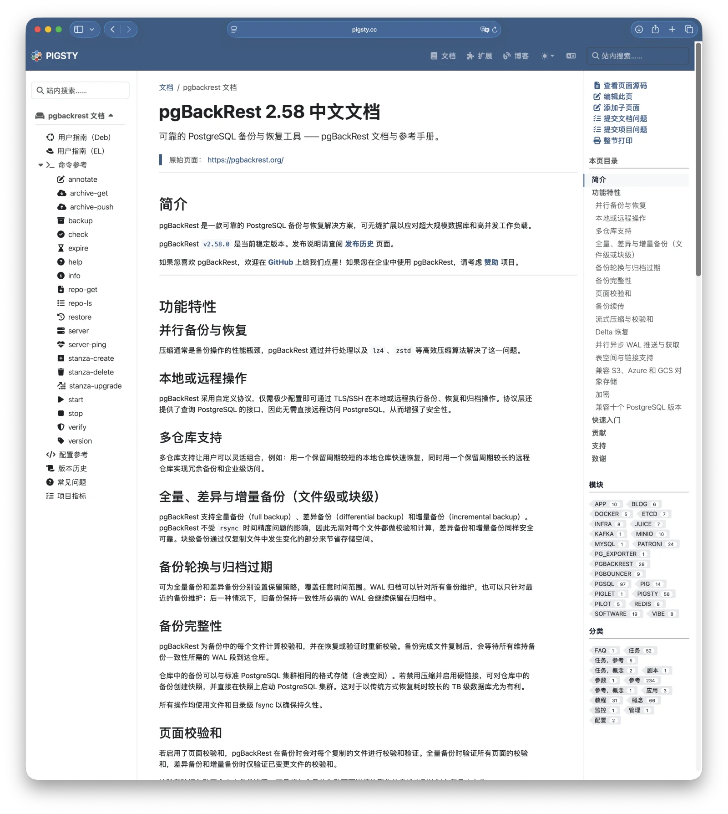
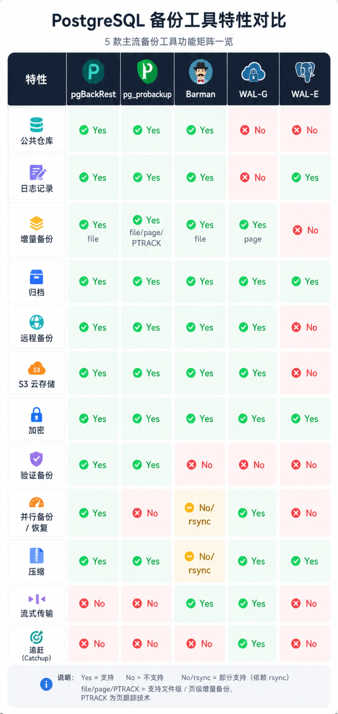
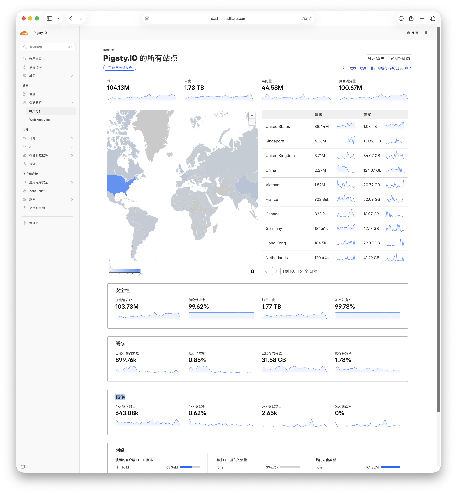

4 月 27 日，PostgreSQL 生态里最重要的备份工具 **pgBackRest** 被作者 David Steele 正式归档了。

声明发在 GitHub 和 LinkedIn 上，干净利落：

## 停止维护公告

简而言之：pgBackRest 已不再维护。如果你基于 pgBackRest 创建分叉项目，请为你的项目另取一个新的名称。

经过反复思量，我决定停止继续维护 pgBackRest。这并不是一个轻率的决定。过去十三年里，pgBackRest 一直是我倾注热情的个人项目；期间我很幸运，在相当长的一段时间里得到了企业赞助，但我也投入了无数个深夜和周末，和众多贡献者一道，才把 pgBackRest 做成了今天的样子。每一位开源开发者都明白我在说什么，也都知道，一个真正珍视的项目会占据生命中多大的一部分。

自 Crunchy Data 被出售以来，我一直在继续维护 pgBackRest，同时也在寻找一份能够让我延续这项工作的职位，但到目前为止并未如愿。同样，我为项目争取赞助的努力，也远未达到让这个项目可持续运转所需的程度。

和所有人一样，我也需要谋生，而与 pgBackRest 相关的岗位选择非常有限。现在我可以考虑更广泛的机会，但这些机会不会给我留下足够时间继续投入 pgBackRest。这个项目的维护、缺陷修复、PR 审查、问题回复等等，都需要相当多的时间，更不用说开发新功能了，而那才是我真正热爱的部分。与其勉强地、断断续续地把事情做得不够好，我认为不如明确地停下来。

我想，pgBackRest 终有一天可能会被分叉出去。但那将是一个由新维护者负责的新项目，他们也需要像我们当初一样，重新建立起大家的信任。

最后，再次感谢多年来所有 pgBackRest 的贡献者。能与你们共事，是我的荣幸。

--------

## 对PG用户来说，这不是一件小事

pgBackRest 是 PostgreSQL 备份恢复的事实标准，也是很多 DBA 心里最能打的恢复工具。
许许多多多 PostgreSQL DBaaS 都用它作为备份方案，Pigsty 的默认备份方案也是它。

pgBackRest 把 PostgreSQL 备份这件事做到了极致：

- **并行**备份与并行增量恢复，将恢复窗口缩短至极致。
- 把原本繁琐的 **PITR**（基于时间点恢复）压缩成一条简单的命令
- 优雅地解决了**备份归档**、**仓库管理**、**对象存储集成** 等问题
- 全量、差异、增量备份，块级压缩与加密，多仓库异步归档，从 standby 备份……
  所有 DBA 在备份场景上能想到的需求，它都做了，做得稳，做得好

老冯十年前第一次给数据库选备份方案的时候选了它，前阵子重新做了一次选型，把市面上所有活跃方案重新评估了一遍，结果还是它。
当年 2.0 刚出来时，我还手工翻译了它的文档。上个月还用 Claude 连着 patroni，pgbouncer 文档一起 [**重新完整翻译了一遍**](https://pigsty.cc/docs/pgbackrest)。

这个工具用了快十年，我非常信赖它。而现在它的唯一维护者把仓库归档了。

--------

## 故事的真正背景

David 在告别声明里说得很清楚：他没有融到能让自己继续做这件事的钱。

David 之前是 Crunchy 的架构师，Crunchy 是一家 PostgreSQL 服务公司。
去年 6 月，数据湖仓巨头 **Snowflake 以 2.5 亿美元收购了 Crunchy Data**。

收购完成之后，David 花了几个月时间，想在新东家或别处找一个能让他继续维护这个项目的岗位，然而失败了。
他也尝试自筹独立赞助，但离能维持生活的水平差得很远。他得养家糊口，于是决定干净利落地停下，而不是断断续续敷衍下去。

这里有一个让人非常不舒服的事实：**Snowflake 是当下数据基础设施领域市值最高的几家公司之一**，
他们公开说要做 “AI-native Postgres”，花了 2.5 亿美元买下 Crunchy。但从结果看，并没有继续支持 David 维护 pgBackRest。
一个原本在小公司里都能养得起的人，到了大公司反而养不起了。

**如果这个推测成立，说损人不利己都算客气的**。Snowflake 省不下多少钱，却顺手把整个 PostgreSQL 生态最重要的一根承重柱给抽了，这不是商业理性，这是吃相太难看。

这一波 AI 淘金热已经把企业的预算清单彻底重塑了。买内存、买 GPU、买 token，是确定能讲出 ROI 故事的；
养一个保证你的数据库炸了之后还能恢复回来的人，没有 ROI 故事，只有“什么坏事都没发生”，而“什么坏事都没发生”在董事会面前是不算分的。

--------

## 大家在讨论什么

事件发生后这几天，PG 社区已经热闹起来了：Hacker News 上 200 多分的讨论、各家厂商博客的连环回应、邮件列表里的 “接下来怎么办”。
讨论大致分几个方向。

**一是开源可持续性的诊断。** 主流观点是：开源可持续性靠的不是施舍，而是下面的良性循环：
**“公司投资工程师 → 软件创造价值 → 用户购买商业支持 → 公司再投资”**。
pgBackRest 的失败，是这个闭环没建立起来。
只有一家公司的工程师在维护，没有形成多家厂商商业支持的网络。
一旦这家公司被并购、战略调整，整条链路就断了。

**二是要不要立刻 fork。** 大厂的态度高度一致：**先不要急着 fork**。
“不要出现十个 fork、每个由一个人维护。” 这种碎片化才是最糟糕的结局。
Linux Foundation 推出 Valkey 替代 Redis 用了六天紧急协调，多厂商共治这种事，慢一点比乱一点要好得多。

**三是 fork 的命名问题。** David 在告别声明里明确表态：
“我希望它早晚会被 fork，但那将是一个新项目、由新的维护者负责，他们需要像我们当年那样从头建立信任。”
也就是说，新项目不能再叫 pgBackRest。

老冯个人是站 David 这个要求的。这恰恰是他离开时**最负责任的一个动作**。
备份工具是供应链攻击的最高价值靶子之一：一个被广泛信任的备份程序，如果在某次升级里被植入恶意代码，
能在几乎所有部署它的 PostgreSQL 实例里获得核心权限，接触到全部历史数据。
把 “几千 stars 积累的信任” 原封不动转让给一个未知接班人，不是慷慨，是不负责任。
让 fork 重新换个名字，是逼着用户重新做一次信任评估，这是安全工程的基本要求。

--------

## 老冯的看法

老冯看到这个新闻的第一反应是相当遗憾。

毕竟我自己就是 pgBackRest 的深度用户：如果没有人来接盘，**老冯自己也愿意接手把这个事情扛起来**。

老冯之前已经接盘过 MinIO 了，也是因为我自己要用，原厂 Rug-Pull 跑路之后，我只能自己 fork 了一份维护下去。
我觉得在不搞新功能的前提下，接手 pgBackRest 维护也不算特别离谱。

不过，老冯觉得 pgBackRest 还不至于走到那一步。这件事接下来大概有几种走向。

**首先可以确定的是**，5 月在温哥华的 **PGConf.Dev** 大概率会把这件事作为重要话题之一来讨论。
一个涉及到 PG 生态主要厂商核心利益的工具，社区不会放任不管。

**现实的预期，是社区通过协商产生一个新的 fork**，
就像 Redis 改协议之后社区另起炉灶搞了 Valkey 一样。
鉴于不能用原名，新项目可能叫 pgbackrest-ng，pgbacknext 或者别的什么。
这个方向的核心问题是要有一个或几个长期承诺的厂商挑头并达成共识。

**比较坏的情况**，是既没有牵头者，也没有进 PGDG，厂商间也没有达成共识。
那就会进入“各家维护一份内部 fork”的状态：Percona 一份、EDB 一份、各家云厂商一份。这个结局是最糟的，真正的“Fork Wars”。

**最理想的结果，是 PGDG 内核团队接手**，做成 contrib 模块，或者放进 PGDG Global Development Group 的项目集里。
但老实说有难度，而且其他备份工具的维护者不见得会乐意。

目前的现状是，**Percona 已经明确表态**会继续向自己的客户提供 pgBackRest 的支持。
这意味着至少在客户层面，pgBackRest 不会立即失去所有支撑。Crunchy 现有产品和文档仍然深度集成 pgBackRest，但截至目前，我没有看到它对项目长期维护给出新的公开承诺。

老冯也在这里明确表态：如果没有其他人来维护，我会接手维护下去。
当然如果有其他人维护得好，那我也很乐意将其作为上游，进行验证与打包分发，提供用户反馈。

--------

## 不要着急忙慌的跳车

往近处说，老冯给各位 PostgreSQL DBA 的建议是：如果你在用 pgBackrest，也不用担心。**先别慌，更不要急着跳车**。

pgBackRest 是一个非常成熟的软件，归档的是仓库，不再接受 PR、不再修 bug、不再发新版本，但代码本身还在那里，**今天用得好好的，明天还能继续用**。

**你现在用 pgBackRest 能有什么问题？** 如果你一直用现在的 PostgreSQL 18，配合现在的 pgBackRest v2.58，可以继续跑到地老天荒。

风险要出现，也是几个月与一两年后的事情了。比如今年 9 月之后 PG19 发布，或者再往后的一两个大版本之后。
pgBackRest 当前版本对 PG 18 是兼容的，但新大版本如果出现需要适配的内核改动，或者对象存储、依赖库、安全漏洞需要后续修复，事情就会变得棘手。
但这是**中长期**需要担心的事，不是**今天立刻**需要担心的事。

更重要的是，没有能与之完全匹敌的替代：**目前没有任何一个工具能直接原位替代 pgBackRest 的功能完备度**。

- **Barman**（EDB 维护）是最可靠的备选项之一，
  3.18 版本新增了云存储块级增量备份能力，但这部分能力仍然比较新，
  离 pgBackRest 的成熟度和一体化体验还差一段距离
- **WAL-G** 是非常实用的云上归档与恢复工具，在 K8s/云原生场景里尤其常见，
  但与 pgBackRest 的完整备份仓库治理能力并不完全重叠
- **pg_probackup**（Postgres Professional）当年是唯一能在功能维度上和 pgBackRest 并列的对手，
  块级 PTRACK 增量备份甚至更激进。
  但作者公司是俄罗斯背景，2022 年之后境况复杂；
  更要命的是，这个工具历史上有过恢复后数据丢失、无效页面等严重 issue 记录
  （例如 [#474](https://github.com/postgrespro/pg_probackup/issues/474)、
  [#249](https://github.com/postgrespro/pg_probackup/issues/249)）。
  对一个备份工具来说，这是相当致命的污点，让我个人非常犹豫推荐它

所以，最好的操作就是不要急着动，乱折腾反而是最大的风险。
该用还是继续用，把 v2.58 当作未来一段时间的稳定基线；
同时把恢复演练做扎实，关注 PGConf.Dev 之后社区是否出现明确接班分支，再做下一步决定。

--------

## 更深层的观点

David 的故事特别值得反思的地方在于：他不是某个个人爱好者燃烧殆尽的故事，他是在 Crunchy Data 里**被付费做开源**这件事的。
**这恰恰是开源社区里反复推崇的“健康开源模式”。** 然后这个模式被 Snowflake 的并购给端掉了。

2025 年以来，PostgreSQL 世界出现了密集资本动作：Databricks 宣布收购 Neon，媒体报道称交易约 10 亿美元；
Snowflake 宣布收购 Crunchy Data，媒体报道称交易约 2.5 亿美元；Databricks 随后又收购 Mooncake Labs；Supabase 也被报道正在洽谈以约 100 亿美元估值融资。

**这是一把双刃剑。** 一方面，它把更多的资本引到了数据库这个相对不那么性感的领域里，
另一方面，这些原本小而美、做得好好的公司，被资本一搅和、一折腾，就出现了今天这种离谱现象。
原本健康运转的开源赞助闭环，因为一次并购就被切断了。

老冯自己做这件事，也有云厂商找过来谈收购。但我会反复掂量一个问题：
**如果我被收购了，开源这件事还能不能做下去？** 这是每一个有点情怀创始人都该问自己的问题。

对绝大多数普通开发者来说，“工具好不好用”才是硬道理，谁会去关心维护者的工资条？
但**对企业来说，态度应当不一样**。

现在的现状非常魔幻：这么多 Postgres 公司、DBaaS 厂商、托管服务都在用 pgBackRest，几乎可以算得上是**事实标配**。
但你去看 pgBackRest 项目页的赞助商列表，目前只列了 **Supabase 一家**。
比这些公司有钱得多的云厂商有的是，但很多都心安理得地白嫖。
**这就是公地悲剧的精确写照**：当所有人都假定“会有别人去付维护成本”的时候，这套模式就崩了。

背后更深层的原因是开源世界一个固有矛盾：**价值创造和价值捕获的分离**，做出东西的人和拿这个东西赚钱的人不是一拨人。
AWS 这些云厂商每年从托管 Postgres 与相关数据库服务里，赚取数亿乃至数十亿美元级别的收入，
但 Postgres 核心团队不会从中分到一个铜板。
同样的逻辑反复在 Redis、Elasticsearch、MongoDB 上演过，剧情大同小异。

PG 生态里像 pgBackRest 这种不算内核、但实质上撑起整个生态的支柱性项目** 还有很多：

- **Patroni**：PG 高可用的事实标准之一，在大量自建集群和一部分 K8s Operator 后面都是它
- **PgBouncer**：PG 连接池的事实标准，在稍大规模的 Postgres 部署里极其常见
- 加上各种 FDW、各种 contrib 扩展、各种监控组件……

PG 世界里 “并不缺” 备份、连接池、高可用工具，每一个领域可能都有好几个选择。
但如果我们就是要用 “最好” 的方案，那其实选项就唯一了。
**如果这些项目得不到良好的维护和反馈循环，这会是 PostgreSQL 生态真正的风险。**

--------

## 最后聊聊 Pigsty

老冯对 pgBackRest 这件事感触特别深，David 的故事给了我很多启示。

老冯搞 PG 发行版 Pigsty，它作为一个开源的 PostgreSQL 发行版，做到现在算得上相当成功。
按 GitHub stars、社区口碑、企业部署量来看，在 Linux 原生发行版这个细分赛道上，我认为 Pigsty 已经做到了顶尖。

但它也是老冯一个人维护的，一个人写代码、一个人发版本、一个人写文档、一个人答疑，写文章，录教程。

老冯之所以能把这件事做下去，本质上是因为两件事**同时**成立：

1. **我确实热爱这件事。** 数据库、Postgres、运维自动化、开源，这是我从大厂出来之后一直在干的事，干得很爽，愿意继续干。
2. **更重要的是，确实有企业客户给我付费支持，跑通了商业循环。** 

我能吃饱饭、不愁生计，又能做自己喜欢做的事，在精神和物质层面双重满足，所以能维护下去。
但如果这两件事之一不成立，Pigsty 也许就是下一个 pgBackRest。

所以 David 这件事对我来说，远不只是一篇行业新闻。它是关于**项目如何接班、如何可持续生长**的活生生的案例。
商业客户那一面，付钱意味着办事，是非常扎实的承诺与责任约束；
开源那一面，本质上是在依赖 **Goodwill**（善意）做事，而善意是会被白嫖与恶语磨损的，会被并购裁员吞掉的。

老冯如果以后做大不差钱了，我也很乐意拿出钱来赞助 Postgres 上游项目，
以及生态里这些撑起整个世界的支柱项目：pgBackRest 的接班人、Patroni、PgBouncer…… 这是一种基本的责任感。

**今天这些项目还能用，是因为有人在替你扛着。他们扛不动了，你的房子也会塌。**

最后，回到 David Steele。

我们这些受惠于 pgBackRest 十几年的人，欠他一句很正式的：

**谢谢。**

希望他早日找到一份合适的下家工作。也希望他打造的这件作品，能在新的形态下继续陪伴 PostgreSQL 走过下一个十年。
