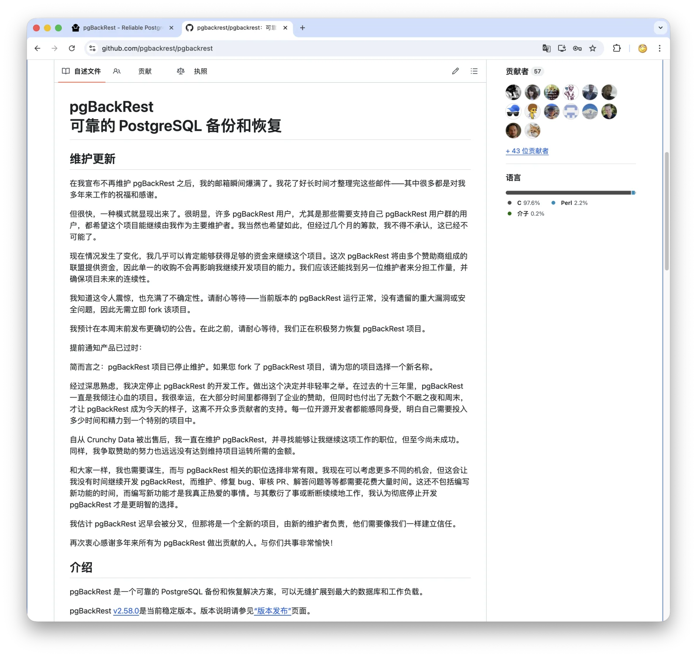

A few days ago, [pgBackRest, the PostgreSQL ecosystem's leading open-source backup tool, was archived](/en/pg/pgbackrest-archive/).

Pigsty uses pgBackRest too, but I was not especially worried. A component this important was never going to be allowed to die for real—not by the PostgreSQL ecosystem.
I did promise that if nobody stepped up after a while, I would take over its maintenance. It now appears that I will not need to.

David Steele posted a "maintenance update" in the [GitHub README](https://github.com/pgbackrest/pgbackrest): after the archival announcement, his inbox exploded.
Many users and vendors wanted the project to continue, and he was willing to do so. More importantly, **a multi-sponsor coalition was nearly in place, and he was almost certain that it would provide enough funding to keep pgBackRest maintained**.

He expected to make a firmer announcement before the end of the week. From archival to reversal: seven days.

What matters here is not the breezy line that "the open-source community really cares." What matters is what happened after a maintainer pushed a piece of critical open-source infrastructure right up to the line of death: the market finally started bidding.

This was an unusually clean case of forced price discovery in an open-source commons.

--------

## What Happened in Those Seven Days

First, the timeline.

On **April 27**, David Steele announced on GitHub and LinkedIn that he was ending maintenance of pgBackRest, and [archived the repository](https://github.com/pgbackrest/pgbackrest). The statement was restrained: no complaints, no blame, just two points:

- Fork it if you like, but do not keep the pgBackRest name.
- Archival is not EOL. The code remains available, and existing deployments will not suddenly break.

The first point matters. Backup software is not an ordinary little utility; it is a high-value entry point for a supply-chain attack. A fork that inherits the original brand's trust but lands in unreliable hands would be far riskier than many people realize. Requiring a new name was the most responsible thing David could do on his way out.

That same day, Christophe Pettus published [**Notice of Obsolescence**](https://thebuild.com/blog/2026/04/27/notice-of-obsolescence/) on thebuild.com. His assessment was coolheaded: pgBackRest should be treated as a "sunset deployment" until a trustworthy fork emerged, at which point users could reassess.

Also that day, Lætitia Avrot published [**pgBackRest is dead. Now what?**](https://mydbanotebook.org/posts/pgbackrest-is-dead.-now-what/). The title did not mince words. Her argument was sharper still: the AI gold rush had reordered corporate budgets. Large companies would buy memory, GPUs, and tokens, but would not pay the person who made sure their database could be restored after a disaster.

It is an uncomfortable point, but a true one.

On **April 28**, Percona moved. Jan Wieremjewicz published [**pgBackRest is archived, what now?**](https://percona.community/blog/2026/04/28/pgbackrest-is-archived-what-now/), saying that Percona would continue to support pgBackRest but that nobody should rush to fork it. Percona was discussing either joint maintenance by multiple vendors or foundation stewardship with other companies.
The article contained another crucial detail: Jan said that, in a talk at PGConf.DE one week before the archival, he had cited David's transparent funding model, which would spread the maintenance cost among multiple organizations that depended on pgBackRest.

That response was important. Percona did not announce that it was taking over, nor did it race to create a fork. It called for coordination first. That degree of restraint is uncommon for a commercial vendor.

But nobody had taken David up on the funding proposal in time.

In other words, David had tried consensual price discovery. Nobody bought. Archival was the only move left.

On **April 30**, Percona followed up with [**Open source doesn't die. It gets unfunded.**](https://percona.community/blog/2026/04/30/open-source-doesnt-die-it-gets-unfunded/), stating the issue even more plainly: pgBackRest was not EOL; its maintenance funding had run out. Percona and other companies were working behind the scenes on a solution.

On **May 1**, PGX jumped the gun. Christophe Pettus's PGX Inc. announced [**pgxbackup: Continuity Support for pgBackRest**](https://thebuild.com/blog/2026/05/01/pgxbackup-continuity-support-for-pgbackrest/) and forked pgBackRest as [pgxbackup](https://github.com/pgexperts/pgxbackup). It was positioned as a continuity release for PGX support customers, limited to critical bug fixes and compatibility with new PostgreSQL versions.

The move was reasonable, but also revealing. Percona had just said, "Do not rush to fork," and PGX forked three days later. You cannot call Pettus irresponsible; he has an obligation to his customers. But it showed how fragile "community coordination" really is. The moment one vendor can no longer wait, a two-track future becomes the default assumption.

Around **May 4**, David posted his maintenance update: the sponsor coalition was largely in place, and the funding would probably be sufficient. He was also looking for a second maintainer to share the load so that maintenance would no longer hinge on one person.

The reversal was complete.

When the Linux Foundation responded to Redis's license change by launching [Valkey](https://github.com/valkey-io/valkey), it took about eight calendar days, or six business days. pgBackRest had no foundation, no license war, and no common enemy. Coordination within the PostgreSQL world alone produced an answer in seven days.

That is already very fast.

--------

## Who Might Pay: Public Signals and Speculation

The official list has not been published, but the public signals are enough to sketch the likely picture.

**Supabase is currently the strongest publicly visible candidate to be a major sponsor.**

According to the pgBackRest website and README, Supabase is the current sponsor. More importantly, Supabase said in its April [Developer Update - April 2026](https://github.com/orgs/supabase/discussions/44713) that it had just open-sourced the [Multigres](https://github.com/multigres/multigres) Kubernetes operator, which ships with pgBackRest-based PITR built in.

That is no longer a matter of merely "supporting open source." It is a product-roadmap dependency. If you bet your future on a backup tool and that tool suddenly loses its maintainer, who should pay if not you?

At Supabase's current valuation and funding scale, supporting one core pgBackRest maintainer is not a question of affordability. It is a question of accepting the bill. Whether Supabase is the coalition's largest contributor will have to wait for the official list.

**Percona is very likely one of the coordinators.**
Percona has publicly committed to continued pgBackRest support, and Percona Distribution for PostgreSQL has long recommended pgBackRest as its backup tool. Its customer SLAs depend on the software, so standing on the sidelines was never a realistic option.
Whether Percona is contributing money, and how much, will have to wait for the official announcement. For now, it looks more like one of the organizers of the effort.

**Cybertec, Timescale, and Resonate may also be involved.** Cybertec uses pgBackRest in its containerized PostgreSQL products; Lætitia's article also specifically named Cybertec and Data Egret as companies with experts capable of handling pgBackRest problems in the interim.
Timescale maintains a [public fork](https://github.com/timescale/pgbackrest-public). That signals dependency or evaluation, but it is not enough by itself to prove that Timescale Cloud's backup path is deeply bound to pgBackRest. Timescale can afford to contribute, but historically it has not been especially proactive about funding upstream open-source infrastructure, so its involvement is far from certain.

Resonate is a former sponsor, and David Steele has past ties to the company. A return as a smaller sponsor would make sense.

The names really worth watching are the major cloud providers: AWS, Google Cloud, and Azure. Will any of them appear on the sponsor list?
If not, that would be unsurprising. Most likely, companies inside the PostgreSQL ecosystem will pool money to save their own tool. The companies making the most money will remain silent while the companies most dependent on the software put out the fire.

That is one of the open-source world's most familiar absurdities.

--------

## What "Forced Price Discovery" Means

What, exactly, did David Steele do? My reading is that he put the price tag back on something everyone had been pretending was free.

Before the archive, pgBackRest was in a familiar position: everyone knew it mattered, everyone used it, and everyone assumed it would always be there. Crunchy Data had funded David's work, and everyone else treated that arrangement as a free lunch.

David proposed a transparent funding model that would distribute maintenance costs. Percona's Jan Wieremjewicz even cited it in his PGConf.DE talk. Nobody responded in time. Why?

Because the project was still alive.

Living projects have a hard time raising money. Say, "I cannot keep this up much longer," and the answer is, "Thank you for all your work; we will evaluate it internally." Say, "Without funding, the project will disappear," and the answer is, "We understand; perhaps we can look at next quarter's budget."
After all, the code is still there, issues can still be filed, PRs can still wait, and a DBA can still search GitHub when something breaks in the middle of the night.

Until the repository is archived.

Only then were all the companies that depend on pgBackRest forced to do some simple arithmetic:

- Migrate to [Barman](https://github.com/EnterpriseDB/barman) or [WAL-G](https://github.com/wal-g/wal-g), rebuild the entire backup-and-recovery process, and rerun disaster-recovery drills.
- Maintain an internal fork, which means employing a senior engineer who understands PostgreSQL, backup systems, C, and Perl.
- Pool funding with several other companies and let David continue maintaining the mainline project.

The third option is the cheapest.

That is forced price discovery.

It is not extortion in the conventional sense. The code is under the MIT License: anyone can fork it, and anyone can keep using it. David did not lock up the code or change the license to impose a tax. The only things he could withdraw were his own time and reputation.

But in open-source infrastructure, the maintainer's time and reputation are precisely the most expensive parts.

The [Redis/Valkey](https://github.com/valkey-io/valkey), [HashiCorp Terraform/OpenTofu](https://github.com/opentofu/opentofu), and [Elastic/OpenSearch](https://github.com/opensearch-project/OpenSearch) episodes used trademarks and licenses as leverage. The result was a forced community fork that cost both sides dearly. pgBackRest was the inverse: David chose to retire the name with the original project, required forks to rebrand, pushed the project to the edge of death, and used his own disappearance as leverage.

It was hardball, and it worked. I expect others will copy the tactic. But the prerequisites are demanding: the project must be critical, the maintainer must be trusted, and commercial users must truly depend on it. Remove any one of those conditions and the strategy fails.

When an ordinary small project tries this, it simply dies. When pgBackRest does it, the market bids.

--------

## Is This an Exceptional Case?

The PostgreSQL community does have strong muscle memory for coordination. After more than twenty years of collaboration, people throughout the PostgreSQL world know one another, and the mailing lists, conferences, Slack channels, and Twitter/X networks all connect. When something breaks, they can get around the same table quickly. That is part of the ecosystem's institutional strength.

But pgBackRest could be revived because its conditions were unusually favorable: it is difficult to replace, commercial PostgreSQL vendors depend on it heavily, David himself was willing to continue, and several companies were able to coordinate funding.

Other projects might not be so lucky.

If [Patroni](https://github.com/patroni/patroni) ran into trouble, someone would probably rescue it too. It is effectively the standard for PostgreSQL HA and is simply too important.

The connection pooler [PgBouncer](https://github.com/pgbouncer/pgbouncer) would probably receive the same treatment. But what about other projects—[PostgREST](https://github.com/PostgREST/postgrest), or [pgBadger](https://github.com/darold/pgbadger)?
Each of them faces its own maintenance pressures, but they may not have the same strong commercial incentives for a rescue.

Second, an emergency sponsorship coalition is not a long-term governance structure. Funding from several companies is more resilient than relying on one company to employ a maintainer.
But more money also means more opinions. David used to make technical decisions quickly on his own. With five or six sponsors behind the project, its roadmap, priorities, and release cadence may all become more complicated.

If the coalition is still shipping releases, merging PRs, and addressing security issues reliably a year from now, it will be a model worth copying. If it falls apart at the first disagreement over direction, the project will still end up back under foundation stewardship.

There is another, more practical point: the AI-era budget reallocation is real.

Lætitia's line about companies buying memory and GPUs was not rhetoric. From 2025 through 2026, the easiest ROI stories to tell a CFO were about GPUs, agents, vectors, and anything "AI-native." Backup maintenance, DBAs, and reliability engineering are cost centers whose output is that nothing bad happened. Inexperienced managers understand their value only after an expensive disaster.

After Snowflake acquired Crunchy Data, the funding and employment path that had enabled David to maintain pgBackRest did not continue. This is not an isolated case. We will see more like it.

--------

## Advice for Users

If you use pgBackRest, there is no need to switch and no need to tinker.
I have used it for years, and my assessment is straightforward: pgBackRest is the PostgreSQL ecosystem's most mature, stable, reliable, and feature-rich open-source backup and recovery tool. Leaving a working setup alone is the best course.

Its biggest weakness is configuration complexity. But once it is set up, it becomes the last line of defense in your database arsenal.
Pigsty already ships with pgBackRest configured and ready to use, so Pigsty users do not need to wrestle with it manually.

If you are using pgBackRest, keep using it. [v2.58.0](https://github.com/pgbackrest/pgbackrest/releases/tag/release/2.58.0) is solid.
Even when the repository was archived, the concern was only that a lack of maintenance might create problems over time. Now that maintenance is expected to continue, there is even less reason to worry.

--------

## Finally

The seven-day reversal is certainly worth celebrating. This story got its happy ending. But remember why it happened: David Steele had to push the project to the line of death before the market was willing to admit that it had a price.

The episode once again echoes the old saying: **open source is not free**. The software you use may be free of charge, but the people who maintain it still need to earn a living.
Many people assume they owe nothing and can simply free-ride. When everyone makes that choice, the result is a tragedy of the commons.

David proved the point in the hardest possible way. Not through evangelism, appeals, or another moralizing essay about what "the community" ought to do. He archived the project and put every dependent party in front of the same bill.

It was not the most graceful solution, but it worked. I sincerely hope open-source users will support the projects they rely on, within their means. Do not wait until a maintainer reaches the breaking point before scrambling to save the project.

--------

## Related Links

- [pgBackRest Is No Longer Maintained](/en/pg/pgbackrest-archive/)
- [pgBackRest Website Announcement](https://pgbackrest.org/)
- [Maintenance Update in the pgBackRest GitHub README](https://github.com/pgbackrest/pgbackrest)
- [Notice of Obsolescence](https://thebuild.com/blog/2026/04/27/notice-of-obsolescence/)
- [pgBackRest is dead. Now what?](https://mydbanotebook.org/posts/pgbackrest-is-dead.-now-what/)
- [pgBackRest is archived, what now?](https://percona.community/blog/2026/04/28/pgbackrest-is-archived-what-now/)
- [Open source doesn't die. It gets unfunded.](https://percona.community/blog/2026/04/30/open-source-doesnt-die-it-gets-unfunded/)
- [pgxbackup: Continuity Support for pgBackRest](https://thebuild.com/blog/2026/05/01/pgxbackup-continuity-support-for-pgbackrest/)
- [Supabase Developer Update - April 2026](https://github.com/orgs/supabase/discussions/44713)
