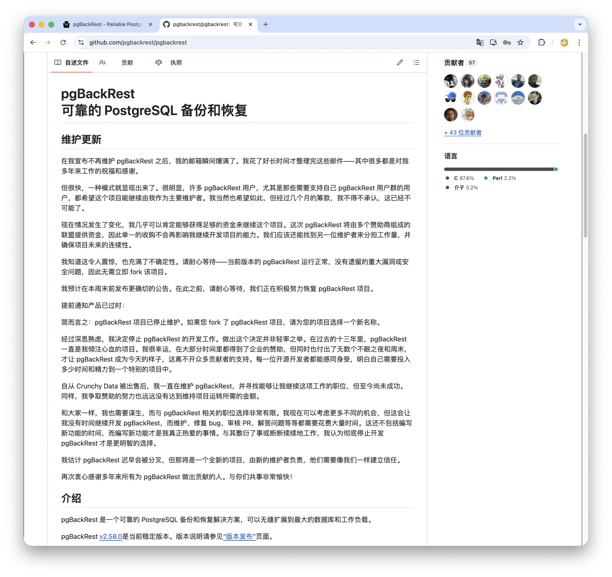

几天前，PG 生态的顶级开源备份工具 [pgBackRest 宣告停止维护](/pg/pgbackrest-archive/)。

老冯的 Pigsty 虽然也用着 pgBackRest，但也不着急，因为我知道这么重要的组件 pgBackRest，PostgreSQL 生态不可能真让它死掉。
但也承诺如果过一段时间都没人接盘，我会来接手维护。现在看来，倒是不需要了。

David Steele 在 [GitHub README](https://github.com/pgbackrest/pgbackrest) 上发了一份“维护更新”：归档公告发出之后，他的邮箱被打爆了。
很多用户和厂商都希望项目继续；他自己也愿意继续；更关键的是，**多个赞助商组成的联盟已经基本谈拢，他几乎可以确定拿到足够资金继续维护 pgBackRest**。

他预计在本周结束前给出更明确公告。从归档到反转，七天。

这事有意思的地方不在于 “开源社区真有爱”。这种话太轻飘了。真正有意思的是：一个关键开源基础设施被维护者按到死亡线之后，市场终于开始出价了。

这是一次非常干净的开源公地逼定价。

--------

## 七天里发生了什么

先把时间线捋清楚。

**4 月 27 日**，David Steele 在 GitHub 和 LinkedIn 同时宣布停止维护 pgBackRest，[仓库归档](https://github.com/pgbackrest/pgbackrest)。声明很克制，没有抱怨，也没有甩锅，只说了两件事：

- fork 可以，但不要继续叫 pgBackRest。
- 归档不是 EOL，代码还在，正在跑的部署不会突然坏掉。

第一条其实很重要。备份工具不是普通小玩具，而是供应链攻击的高价值入口。一个带着原品牌信任的 fork，如果落到不靠谱的人手里，风险比大家想象的大得多。David 要求改名，是他离场时最负责任的一步。

同一天，Christophe Pettus 在 thebuild.com 发了[《Notice of Obsolescence》](https://thebuild.com/blog/2026/04/27/notice-of-obsolescence/)。他的判断比较冷：pgBackRest 应该按“落日部署”处理，等可信 fork 出来再重新评估。

同日，Lætitia Avrot 发了[《pgBackRest is dead. Now what?》](https://mydbanotebook.org/posts/pgbackrest-is-dead.-now-what/)。标题就很直白。她把话说得更狠：AI 淘金热已经重排了企业预算。大公司愿意买内存、买 GPU、买 token，但不愿意付钱给那个保证数据库炸了还能恢复回来的人。

这话难听，但真实。

**4 月 28 日**，Percona 出手了。Jan Wieremjewicz 发了[《pgBackRest is archived, what now?》](https://percona.community/blog/2026/04/28/pgbackrest-is-archived-what-now/)，说 Percona 会继续支持 pgBackRest，但大家不要急着 fork。他们正在和其他厂商讨论多厂商联合维护，或者基金会托管。
这篇里还有个关键信息：Jan 说，他在归档前一周的 PGConf.DE 演讲中还引用过 David 提出的透明出资模型，希望把维护成本分摊给多家依赖 pgBackRest 的组织。

这一步是关键。Percona 没有宣布自己接盘，也没有抢着做 fork，而是先呼吁协调。对于一个商业供应商来说，这种克制不多见。

但没人及时接。

也就是说，David 不是没有试过“和平定价”。只是和平定价没人买账，最后只能归档。

**4 月 30 日**，Percona 又补了一篇[《Open source doesn't die. It gets unfunded.》](https://percona.community/blog/2026/04/30/open-source-doesnt-die-it-gets-unfunded/)，把问题说得更直白：pgBackRest 不是 EOL，而是维护资金断档；Percona 和其他公司正在幕后推动解决方案。

**5 月 1 日**，PGX 抢跑。Christophe Pettus 旗下的 PGX Inc. 发了[《pgxbackup: Continuity Support for pgBackRest》](https://thebuild.com/blog/2026/05/01/pgxbackup-continuity-support-for-pgbackrest/)，把 pgBackRest fork 成了 [pgxbackup](https://github.com/pgexperts/pgxbackup)，定位是给自家支持客户用的 continuity release，只做关键 bug 修复和新 PG 版本兼容。

这一步合理，但也微妙。Percona 才说“先别急着 fork”，PGX 三天后就 fork 了。你不能说 Pettus 不负责，他当然要对客户负责；但这也说明，所谓“社区协调”其实很脆。只要有一家厂商等不及，双轨预期马上形成。

**5 月 4 日左右**，David 发出维护更新：赞助联盟基本成形，资金大概率够了。他还在找另一位维护者分担工作量，避免项目继续变成单点。

至此，逆转完成。

Linux 基金会当年响应 Redis 改协议、发起 [Valkey](https://github.com/valkey-io/valkey)，按自然日约八天，按工作日约六天。pgBackRest 这次没有基金会、没有牌照战争、没有共同敌人，纯靠 PG 圈内部协调，用了七天。

这个速度已经很快了。

--------

## 谁可能掏钱：公开信号与猜测

正式名单还没出来，但公开信号已经够画个大概。

**Supabase 是目前公开信号最强的候选金主。**

按 pgBackRest 官网和 README 的 sponsor 口径，目前列出的 current sponsor 是 Supabase。更关键的是，Supabase 4 月在 [Developer Update - April 2026](https://github.com/orgs/supabase/discussions/44713) 里说，刚开源 [Multigres](https://github.com/multigres/multigres) Kubernetes operator，里面直接内置 pgBackRest PITR 备份。

这就不是“支持一下开源”的关系了，而是产品路线绑定。你把未来押在一个备份工具上，这个工具突然没维护者了，你不出钱谁出钱？

以 Supabase 现在的估值和融资规模，养一个 pgBackRest 核心维护者根本不是钱的问题，而是认不认账的问题。至于它是不是 coalition 里的最大出资方，还要等正式名单。

**Percona 大概率是协调者之一。**
Percona 已经公开承诺会继续支持 pgBackRest，而且 Percona Distribution for PostgreSQL 也长期把 pgBackRest 作为推荐备份工具。他们的客户 SLA 挂在这上面，不可能只在旁边看热闹。
但它是否出资、出多少，要等正式公告。它目前更像这次协调里的组织者之一。

**Cybertec、Timescale、Resonate 都有可能参与。**Cybertec 的容器化 PG 产品里用到了 pgBackRest；Lætitia 文章里也专门点名 Cybertec 和 Data Egret 有专家可以临时处理 pgBackRest 问题。
Timescale 有[公开 fork](https://github.com/timescale/pgbackrest-public)，这是一个依赖或评估信号，但不足以单独证明 Timescale Cloud 的备份链路深度绑定 pgBackRest。它有能力出钱，但历史上对上游开源基础设施的投入不算特别主动，所以也不能打包票。

Resonate 是历史赞助方，也有 David Steele 过往工作痕迹，回归小额赞助很合理。

真正值得看的，是几个云厂商 AWS、Google Cloud、Azure 会不会出现在赞助名单里。
如果没有，那也不意外。大概率还是 PG 圈自家人凑钱救自家工具。最赚钱的人继续沉默，最依赖的人出来救火。

这就是开源世界最熟悉的荒诞。

--------

## 什么叫“逼定价”

David Steele 这次到底做了什么？老冯的理解是：他把一个所有人都假装免费的东西，重新摆回了价格牌下面。

在归档之前，pgBackRest 的状态很典型：所有人都知道它重要，所有人都在用，所有人也都默认“它会一直在那里”。Crunchy Data 过去养 David，大家就把这当成免费午餐。

David 提出过透明出资模型，希望大家分摊维护成本；Percona 的 Jan Wieremjewicz 还在 PGConf.DE 演讲中引用过这个模型。没人及时响应。为什么？

因为项目还活着。

活着的东西不容易要到钱。你说“我快撑不住了”，别人会说“辛苦了，我们内部评估一下”。你说“再不出钱项目就没了”，别人会说“理解，我们下季度预算看看”。
反正代码还在，issue 还能提，PR 还能等，DBA 半夜出问题还能去 GitHub 翻。

直到仓库归档。

归档之后，所有依赖 pgBackRest 的公司才被迫算一笔很简单的账：

- 迁移到 [Barman](https://github.com/EnterpriseDB/barman) 或 [WAL-G](https://github.com/wal-g/wal-g)，要重做备份恢复流程，还要重新演练灾备。
- 自己内部 fork，要养懂 PG、懂备份、懂 C 和 Perl 的高级工程师。
- 几家公司联合出钱，让 David 继续维护主线。

第三个方案最便宜。

这就是逼定价。

它不是传统意义上的勒索。代码是 MIT 协议，谁都可以 fork，谁都可以继续用。David 没有把代码锁起来，也没有改协议收税。他能撤回的，只有自己的时间和信誉。

但在开源基础设施里，维护者的时间和信誉恰恰是最贵的部分。

[Redis／Valkey](https://github.com/valkey-io/valkey)、[HashiCorp Terraform／OpenTofu](https://github.com/opentofu/opentofu)、[Elastic／OpenSearch](https://github.com/opensearch-project/OpenSearch) 那几次，
是用商标和协议做杠杆，结果社区被迫 fork，自己也伤筋动骨。pgBackRest 这次相反：David 主动放弃招牌，让 fork 改名，把项目推到死亡线，用“消失”做杠杆。

很硬，也很有效。我猜这招以后一定会有人学。前提也很苛刻：项目必须足够关键，维护者必须有信誉，商业用户必须真依赖。三者缺一不可。

一般小项目这么干，只会真死。pgBackRest 这么干，市场会出价。

--------

## 这是一个特例吗？

PG 社区的肌肉记忆确实强。二十多年协作下来，PG 圈的人互相认识，邮件列表、会议、Slack、Twitter／X 都通着。出事之后，大家能很快坐到一张桌子上。这是 PostgreSQL 生态的底子。

但 pgBackRest 能复活，是因为它条件太好了：不可替代性强，商业 PG 服务商依赖深，David 本人愿意继续，还有多家厂商能协调出钱。

换成别的项目，就未必。

[Patroni](https://github.com/patroni/patroni) 如果哪天出事，大概也有人救，因为它算是 HA 领域的事实标准，太关键。

连接池 [PgBouncer](https://github.com/pgbouncer/pgbouncer) 大概也会有这个待遇、那其他项目呢？[PostgREST](https://github.com/PostgREST/postgrest)、[pgBadger](https://github.com/darold/pgbadger) 呢？
这些项目背后都有各自的维护压力，但未必都有 pgBackRest 这么强的商业救援条件。

其次，临时赞助联盟不是长期治理结构。多家公司出钱，比单一公司养维护者稳。
但钱一多，意见也会多。过去 David 一个人做技术判断很快；以后背后有五六家金主，路线、优先级、release cadence 都可能变复杂。

如果这个联盟一年后还能稳定发版本、接 PR、处理安全问题，那它就是一个可以复制的模式。如果第一次路线分歧就散架，那最后还是得回到基金会托管。

还有一点更现实：AI 时代的预算重排是真的。

Lætitia 那句“他们要买内存、要采购 GPU”不是修辞。2025 年到 2026 年，CFO 面前最容易讲 ROI 的，是 GPU、agent、vector、AI-native。备份维护、DBA、可靠性工程，是“什么坏事都没发生”的成本中心，没经验的管理者只有吃过大亏才知道它们的价值。

Crunchy Data 被 Snowflake 收购后，原先支撑 David 维护 pgBackRest 的资金／岗位路径没有延续下来。这不是个孤例。以后类似事情只会更多。

--------

## 给用户的建议

对于 pgbackrest 的用户来说，不用换，不用折腾。
老冯用了这么久，我的评价是 —— pgBackRest 是 PG 生态中最成熟稳定可靠，功能最丰富的开源备份/恢复工具。不折腾，才是最好的。

它最大的问题是，配置学习起来会有些复杂。但一旦配置好，它会是你数据库武器中的最终兜底级杀手锏。
Pigsty 中已经替用户配置好开箱即用的 pgBackRest 了，其实你也不需要去手工折腾这些。 

如果你正在用 pgBackRest，继续用。[v2.58.0](https://github.com/pgbackrest/pgbackrest/releases/tag/release/2.58.0) 没毛病
之前归档也只是说未来时间长了，缺少维护才可能会有影响，现在继续维护了，当然就更没毛病了。

--------

## 最后

七日逆转当然值得高兴。这次事件算是一次 Happy Ending。但更应该记住的是：这次逆转，是因为 David Steele 不得不把项目按到死亡线，市场才愿意承认价格。

这件事也再次 echo 了那句老话 —— **开源不是免费的** —— 你用的开源软件也许是免费的，但维护它的人也是需要谋生吃饭的。
只是很多人一直认为自己不用付出成本，搭便车就好，可如果大家都选择白嫖，就会出现公地悲剧。

这句话被 David Steele 用最硬的方式验证了。不是靠布道，不是靠呼吁，也不是靠“社区应该如何如何”的道德文章。而是把项目归档，把所有依赖方按到同一张账单前面。

这不是最体面的解决办法，但它有效。老冯衷心希望开源用户能在力所能及的范围内，考虑支持一下自己使用的开源项目。而不要等到维护者到死亡线了，才开始亡羊补牢。

--------

## 相关链接

- [pgBackRest 停止维护了](/pg/pgbackrest-archive/)
- [pgBackRest 官网公告](https://pgbackrest.org/)
- [pgBackRest GitHub README 维护更新](https://github.com/pgbackrest/pgbackrest)
- [Notice of Obsolescence](https://thebuild.com/blog/2026/04/27/notice-of-obsolescence/)
- [pgBackRest is dead. Now what?](https://mydbanotebook.org/posts/pgbackrest-is-dead.-now-what/)
- [pgBackRest is archived, what now?](https://percona.community/blog/2026/04/28/pgbackrest-is-archived-what-now/)
- [Open source doesn't die. It gets unfunded.](https://percona.community/blog/2026/04/30/open-source-doesnt-die-it-gets-unfunded/)
- [pgxbackup: Continuity Support for pgBackRest](https://thebuild.com/blog/2026/05/01/pgxbackup-continuity-support-for-pgbackrest/)
- [Supabase Developer Update - April 2026](https://github.com/orgs/supabase/discussions/44713)
