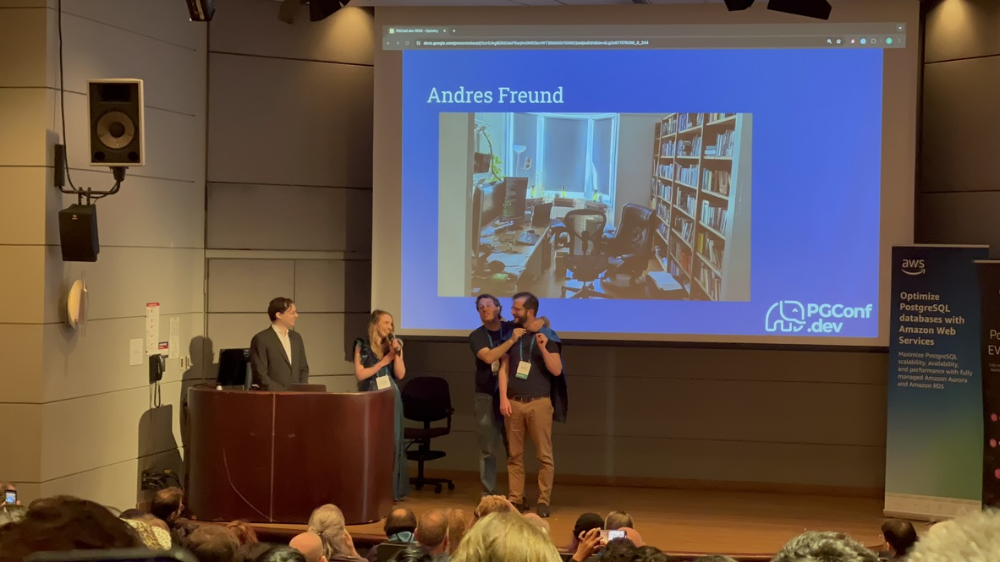
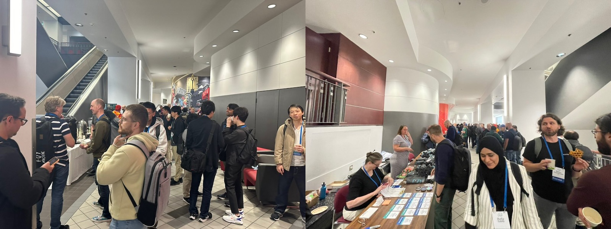
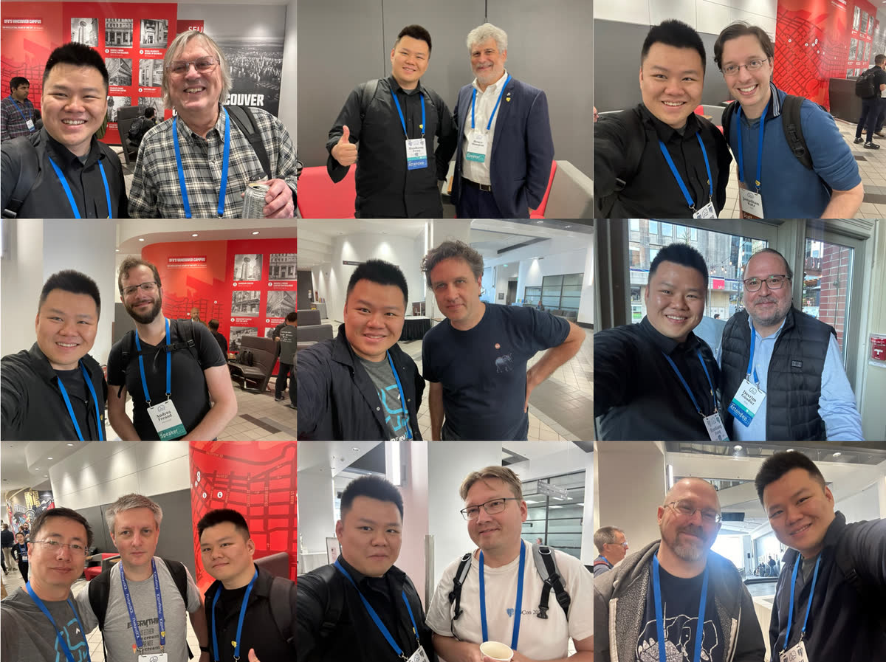
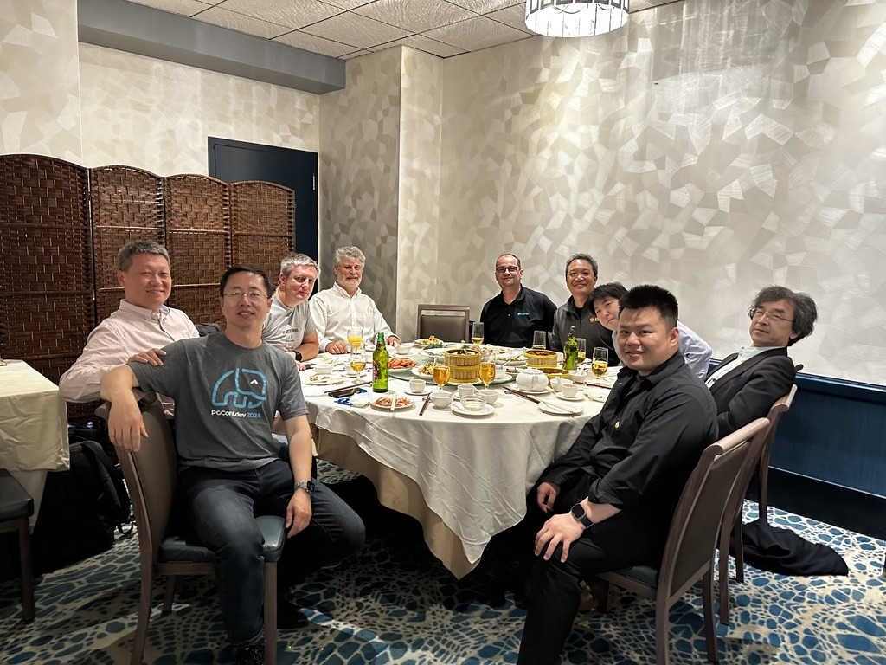
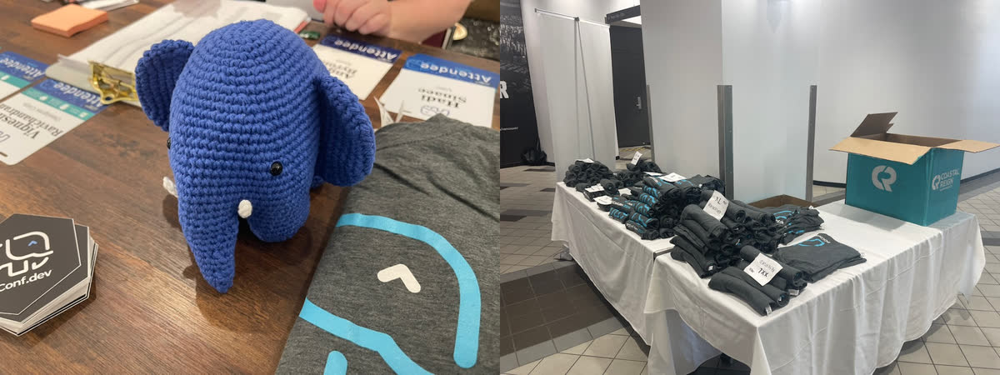
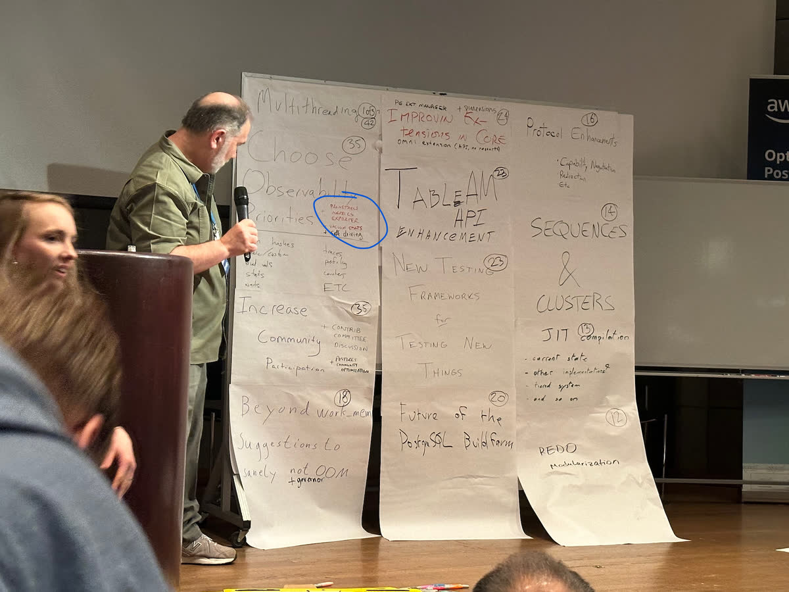

PGCon.Dev, once known as PGCon—the annual must-attend gathering for PostgreSQL hackers and key forum for its future direction, has been held in Ottawa since its inception in 2007. 

This year marks a new chapter as the original organizer, Dan, hands over the reins to a new team, and the event moves to SFU's Harbour Centre in Vancouver, kicking off a new era with grandeur.

How engaging was this event? [Peter Eisentraut](https://peter.eisentraut.org/), member of the PostgreSQL core team, noted that during PGCon.Dev, [there were no code commits to PostgreSQL](https://peter.eisentraut.org/blog/2024/06/04/how-engaging-was-pgconfdev-really) -- resulting in the longest pause in twenty years, a whopping week! a historic coding ceasefire! Why? Because all the developers were at the conference!

> Considering the last few interruptions, which occurred in the early days of the project twenty years ago,

I’ve been embracing PostgreSQL for a decade, but attending a global PG Hacker conference in person was a first for me, and I’m immensely grateful for the organizer's efforts.
PGCon.Dev 2024 wrapped up on May 31st, though this post comes a bit delayed as I’ve been exploring Vancouver and Banff National Park ;)

-------

## Day Zero: Extension Summit

Day zero is for leadership meetings, and I've signed up for the afternoon's Extension Ecosystem Summit. 

Maybe this summit is somewhat subtly related to my recent post, "[Postgres is eating the database world](https://medium.com/@fengruohang/postgres-is-eating-the-database-world-157c204dcfc4),"  highlighting PostgreSQL's thriving extension ecosystem as a unique and critical success factor and drawing the community's attention.

I participated in David Wheeler's Binary Packing session along with other PostgreSQL community leaders. Despite some hesitation to new standards like PGXN v2 from current RPM/APT maintainers.
In the latter half of the summit, I attended a session led by Yurii Rashkovskii, discussing extension directory structures, metadata, naming conflicts, version control, and binary distribution ideas.

Prior to this summit, the PostgreSQL community had held [six mini-summits](https://www.eventbrite.com/e/postgres-extension-ecosystem-mini-summit-tickets-851127263557) discussing these topics intensely, with visions for the extension ecosystem's future development shared by various speakers. Recordings of these sessions are available on [YouTube](https://www.youtube.com/playlist?list=PL11N188AYb_aT6ulbJfrQJJziWb012jG3).

And after the summit, I had a chance to chat with Devrim, the RPM maintainer, about extension packing, which was quite enlightening.

> "Keith Fan Group" -- from Devrim on Extension Summit

-------

## Day One: Brilliant Talks and Bar Social

The core of PGCon.Dev lies in its sessions. Unlike some China domestic conferences with mundane product pitches or irrelevant tech details, PGCon.Dev presentations are genuinely engaging and substantive. The official program kicked off on May 29th, after a day of closed-door leadership meetings and the Ecosystem Summit on the 28th.

The opening was co-hosted by [Jonathan Katz](https://jkatz05.com/), 1 of the 7 core PostgreSQL team members and a chief product manager at AWS RDS, and [Melanie Plageman](https://postgresql.life/post/melanie_plageman/), a recent PG committer from Microsoft. A highlight was when Andres Freund, the developer who uncovered the famous `xz` backdoor, was celebrated as a superhero on stage.

Following the opening, the regular session tracks began. Although conference videos aren't out yet, I'm confident they'll "soon" be available on YouTube. Most sessions had three tracks running simultaneously; here are some highlights I chose to attend.

---------

### Pushing the Boundaries of PG Extensions

Yurii's talk, "[Pushing the Boundaries of PG Extensions](https://slides.omnigr.es/pushing-boundaries-pgconfdev2024/1)," tackled what kind of extension APIs PostgreSQL should offer. PostgreSQL boasts robust extensibility, but the current extension API set is decades old, from the 9.x era. Yurii's proposal aims to address issues with the existing extension mechanisms. Challenges such as installing multiple versions of an extension simultaneously, avoiding database restarts post-extension installations, managing extensions as seamlessly as data, and handling dependencies among extensions were discussed.

Yurii and Viggy, founders of [Omnigres](https://omnigres.com/), aim to transform PostgreSQL into a full-fledged application development platform, including hosting HTTP servers directly within the database. They designed a new extension API and management system for PostgreSQL to achieve this. Their innovative improvements represent the forefront of exploration into PostgreSQL's core extension mechanisms. 

I had a great conversation with Viggy and Yurii. Yurii walked me through compiling and installing Omni. I plan to support the Omni extension series in the next version of Pigsty, making this powerful application development framework plug-and-play.

---------

### Anarchy in DBMS

Abigale Kim from CMU, under the mentorship of celebrity professor Andy Pavlo, delivered the talk "[Anarchy in the Database—A Survey and Evaluation of DBMS Extensibility](https://abigalekim.github.io/assets/pdf/Anarchy_in_the_Database_PGConfDev2024.pdf)." This topic intrigued me since Pigsty's primary value proposition is about PostgreSQL's [**extensibility**](https://pigsty.io/docs/reference/extension/).

Kim’s research revealed interesting insights: **PostgreSQL is the most extensible DBMS**, supporting 9 out of 10 extensibility points, closely followed by DuckDB. With over 375+ available extensions, PostgreSQL significantly outpaces other databases.

Kim's quantitative analysis of compatibility levels among these extensions resulted in a compatibility matrix, unveiling conflicts—most notably, powerful extensions like TimescaleDB and Citus are prone to clashes. This information is very valuable for users and distribution maintainers. [Read the detailed study](https://abigalekim.github.io/assets/pdf/Anarchy_in_the_Database_PGConfDev2024.pdf).

I joked with Kim that — now I could brag about PostgreSQL's extensibility with her research data.

---------

### How PostgreSQL is Misused and Abused

The first-afternoon session featured [Karen Jex](https://postgresql.life/post/karen_jex/) from CrunchyData, an unusual perspective from a user — and a female DBA. Karen shared common blunders by PostgreSQL beginners. While I knew all of what was discussed, it reaffirmed that beginners worldwide make similar mistakes — an enlightening perspective for PG Hackers, who found the session quite engaging.

### PostgreSQL and the AI Ecosystem

The second-afternoon session by [Bruce Momjian](https://postgresql.life/post/bruce_momjian/), co-founder of the PGDG and a core committee member from the start, was unexpectedly about using PostgreSQL's multi-dimensional arrays and queries to implement [neural network inference and training](https://momjian.us/main/writings/pgsql/AI.pdf).

> Haha, some ArgParser code. I see it

During the lunch, Bruce explained that Jonathan Katz needed a topic to introduce the vector database extension PGVector in the PostgreSQL ecosystem, so Bruce was roped in to "fill the gap." [Check out Bruce’s presentation]().

### PB-Level PostgreSQL Deployments

The third afternoon session by [Chris Travers](https://postgresql.life/post/chris_travers/) discussed their transition from using ElasticSearch for data storage—with a poor experience and high maintenance for 1PB over 30 days retention, to a horizontally scaled PostgreSQL cluster perfectly [handling 10PB of data](https://www.pgevents.ca/events/pgconfdev2024/sessions/session/135/slides/30/). Normally, PostgreSQL comfort levels on a single machine range from several dozen to a few hundred TB. Deployments at the PB scale, especially at 10PB, even within a horizontally scaled cluster, are exceptionally rare. While the practice itself is standard—partitioning and sharding—the scale of data managed is truly impressive.

------

### Highlight: When Hardware and Database Collide

Undoubtedly, the standout presentation of the event, Margo Seltzer's talk "[When Hardware and Database Collide](https://www.pgevents.ca/events/pgconfdev2024/schedule/session/192-keynote-when-hardware-and-databases-collide/)" was not only the most passionate and compelling talk I've attended live but also a highlight across all conferences.

Professor Margo Seltzer, formerly of Harvard and now at UBC, a member of the National Academy of Engineering and the creator of BerkeleyDB, delivered a powerful discourse on the core challenges facing databases today. She pinpointed that the bottleneck for databases has shifted from disk I/O to main memory speed. Emerging hardware technologies like **HBM** and **CXL** could be the solution, posing new challenges for PostgreSQL hackers to tackle.

This was a refreshing divergence from China's typically monotonous academic talks, leaving a profound impact and inspiration. Once the conference video is released, I highly recommend checking out her energizing presentation.

------

### WetBar Social

Following Margo's session, the official Social Event took place at Rogue Kitchen & Wetbar, just a street away from the venue at Waterfront Station, boasting views of the Pacific and iconic Vancouver landmarks.

The informal setting was perfect for engaging with new and old peers. Conversations with notable figures like Devrim, Tomasz, Yurii, and Keith were particularly enriching. As an RPM maintainer, I had an extensive and fruitful discussion with Devrim, resolving many longstanding queries.

The atmosphere was warm and familiar, with many reconnecting after long periods. A couple of beers in, conversations flowed even more freely among fellow PostgreSQL enthusiasts. The event concluded with an invitation from Melanie for a board game session, which I regretfully declined due to my limited English in such interactive settings.

---------

## Day 2: Debate, Lunch, and Lighting Talks

### Multi-Threading Postgres

The warmth from the previous night's socializing carried over into the next day, marked by the eagerly anticipated session on "**Multi-threaded PostgreSQL**," which was packed to capacity. The discussion, initiated by Heikki, centered on the pros and cons of PostgreSQL's process and threading models, along with detailed implementation plans and current progress.

The threading model promises numerous benefits: cheaper connections (akin to a built-in connection pool), shared relation and plan caches, dynamic adjustment of shared memory, config changes without restarts, more aggressive Vacuum operations, runtime Explain Analyze, and easier memory usage limits per connection. However, there's significant opposition, maybe led by Tom Lane, concerned about potential bugs, loss of isolation benefits from the multi-process model, and extensive incompatibilities requiring many extensions to be rewritten.

Heikki laid out a detailed plan to transition to the threading model over five to seven years, aiming for a seamless shift without intermediate states. Intriguingly, he cited Tom Lane's critical comment in his presentation: 

> For the record, I think this will be a disaster. There is far too much code that will get broken, largely silently, and much of it is not under our control. -- regards, tom lane 

Although Tom Lane smiled benignly without voicing any objections, the strongest dissent at the conference came not from him but from an extension maintainer. The elder developer, who maintained several extensions, raised concerns about compatibility, specifically regarding memory allocation and usage. Heikki suggested that extension authors should adapt their work to a new model during a transition grace period of about five years. This suggestion visibly upset the maintainer, who left the meeting in anger.

Given the proposed threading model's significant impact on the existing extension ecosystem, I'm skeptical about this change. At the conference, I consulted on the threading model with Heikki, Tom Lane, and other hackers. The community's overall stance is one of curious & cautious observation. So far, the only progress is in PG 17, where the fork-exec-related code has been refactored and global variables marked for future modifications. Any real implementation would likely not occur until at least PG 20+.

------

### Hallway Track

The sessions on the second day were slightly less intense than the first, so many attendees chose the "Hallway Track"—engaging in conversations in the corridors and lobby. I'm usually not great at networking as an introvert, but the vibrant atmosphere quickly drew me in. Eye contact alone was enough to spark conversations, like triggering NPC dialogue in an RPG. I also managed to subtly promote Pigsty to every corner of the PG community.

Despite being a first-timer at PGCon.Dev, I was surprised by the recognition and attention I received, largely thanks to the widely read article, "[PostgreSQL is eating the Database world](https://medium.com/@fengruohang/postgres-is-eating-the-database-world-157c204dcfc4)." Many recognized me by my badge [Vonng](https://vonng.com/en/) / [Pigsty](https://pigsty.io).

A simple yet effective networking trick is never to underestimate small gifts' effect. I handed out gold-plated Slonik pins, PostgreSQL's mascot, which became a coveted item at the conference. Everyone who talked with me received one, and those who didn't have one were left asking where to get one. LOL

Anyway, I'm glad to have made many new friends and connections.

---------

### Multinational Community Lunch

As for lunch, HighGo hosted key participants from the American, European, Japanese, and Chinese PostgreSQL communities at a Cantonese restaurant in Vancouver. The conversation ranged from serious technical discussions to lighter topics. I've made acquaintance with Tatsuro Yamada, who gives a talk, "[Advice is seldom welcome but efficacious](https://www.pgevents.ca/events/pgconfdev2024/schedule/session/62-advice-is-seldom-welcome-but-efficacious/)", and Kyotaro Horiguchi, a core contributor to PostgreSQL known for his work on WAL replication and multibyte string processing and the author of pg_hint_plan.

Another major contributor to the PostgreSQL community, **Mark Wong** organizes PGUS and has developed a series of PostgreSQL monitoring extensions. He also manages community merchandise like contributor coins, shirts, and stickers. He even handcrafted a charming yarn elephant mascot, which was so beloved that one was sneakily "borrowed" at the last PG Conf US.

Bruce, already a familiar face in the PG Chinese community, Andreas Scherbaum from Germany, organizer of the European PG conferences, and Miao Jian, founder of Han Gao, representing the only Chinese database company at PGCon.Dev, all shared insightful stories and discussions about the challenges and nuances of developing databases in their respective regions.

On returning to the conference venue, I had a conversation with [Jan Wieck](https://www.crunchydata.com/news/jan-wieck-former-postgres-core-team-member-joins-crunchy-data), a PostgreSQL Hackers Emeritus. He shared his story of participating in the PostgreSQL project from the early days and encouraged me to get more involved in the PostgreSQL community, reminding me its future depends on the younger generation.

---------

### Making PG Hacking More Inclusive

At PGCon.Dev, a special session on community building chaired by Robert Hass, featured three new PostgreSQL contributors sharing their journey and challenges, notably the barriers for non-native English speakers, timezone differences, and emotionally charged email communications.

Robert emphasized in a post-conference blog [his desire to see more developers from India and Japan rise to senior positions within PostgreSQL's ranks](https://rhaas.blogspot.com/2024/06/2024pgconfdev-and-growing-community.html), noting the underrepresentation from these countries despite their significant developer communities.

> While we're at it, I'd really like to see more people from India and Japan in senior positions within the project. We have very large developer communities from both countries, but there is no one from either of those countries on the core team, and they're also underrepresented in other senior positions. At the risk of picking specific examples to illustrate a general point, there is no one from either country on the infrastructure team or the code of conduct committee. We do have a few committers from those countries, which is very good, and I was pleased to see Amit Kapila on the 2024.pgconf.dev organizing commitee, but, overall, I think we are still not where we should be. Part of getting people involved is making them feel like they are not alone, and part of it is also making them feel like progression is possible. Let's try harder to do that.

Frankly, the lack of mention of China in discussions about inclusivity at PGCon.Dev, in favor of India and Japan, left a bittersweet taste. But I think China deserves the snub, given its poor international community engagement.

China has hundreds of "domestic/national" databases, many mere forks of PostgreSQL, yet there's only a single notable Chinese contributor to PostgreSQL is Richard Guo from PieCloudDB, recently promoted to PG Committer.
At the conference, the Chinese presence was minimal, summing up to five attendees, including myself. It's regrettable that China's understanding and adoption of PostgreSQL lag behind the global standard by about 10-15 years.

I hope my involvement can bootstrap and enhance Chinese participation in the global PostgreSQL ecosystem, making their users, developers, products, and open-source projects more recognized and accepted worldwide.

----------

### Lightning Talks

Yesterday’s event closed with a series of lightning talks—5 minutes max per speaker, or you're out. Concise and punchy, the session wrapped up 11 topics in just 45 minutes. Keith shared improvements to PG Monitor, and Peter Eisentraut discussed SQL standard updates. But from my perspective, the highlight was Devrim Gündüz's talk on PG RPMs, which lived up to his promise of a "big reveal" made at the bar the previous night, packing a 75-slide presentation into 5 lively minutes.

Speaking of PostgreSQL, despite being open-source, most users rely on official pre-compiled binaries packages rather than building from source. I maintain 34 RPM extensions for [Pigsty](https://pigsty.io), my Postgres distribution, but much of the ecosystem, including over a hundred other extensions, is managed by Devrim from the official PGDG repo. His efforts ensure quality for the world’s most advanced and popular database.

Devrim is a fascinating character — a Turkish native living in London, a part-time DJ, and the maintainer of the PGDG RPM repository, sporting a PostgreSQL logo tattoo. After an engaging chat about the PGDG repository, he shared insights on how extensions are added, highlighting the community-driven nature of PGXN and recent popular additions like `pgvector`, ([which I made the suggestion haha](https://github.com/pgvector/pgvector/issues/76)).

Interestingly, with the latest Pigsty v2.7 release, four of my maintained (packaging) extensions (`pgsql-http`, `pgsql-gzip`, `pg_net`, `pg_bigm`) were adopted into the PGDG official repository. Devrim admitted to scouring Pigsty's [extension list](/docs/reference/extension) for good picks, though he humorously dismissed any hopes for my Rust pgrx extensions making the cut, reaffirming his commitment to not blending Go and Rust plugins into the official repository. Our conversation was so enriching that I've committed myself to becoming a "PG Extension Hunter," scouting and recommending new plugins for official inclusion.

--------

## Day 3: Unconference

One of the highlights of PGCon.Dev is the Unconference, a self-organized meeting with no predefined agenda, driven by attendee-proposed topics. On day three, Joseph Conway facilitated the session where anyone could pitch topics for discussion, which were then voted on by participants. My proposal for a **Built-in Prometheus Metrics Exporter** was merged into a broader **Observability** topic spearheaded by Jeremy.

The top-voted topics were Multithreading (42 votes), Observability (35 votes), and Enhanced Community Engagement (35 votes). Observability features were a major focus, reflecting the community's priority. I proposed integrating a contrib monitoring extension in PostgreSQL to directly expose metrics via HTTP endpoint, using `pg_exporter` as a blueprint but embedded to overcome the limitations of external components, especially during crash recovery scenarios.

There's a clear focus on observability among the community. As the author of [pg_exporter](https://github.com/Vonng/pg_exporter), I proposed developing a first-party monitoring extension. This extension would integrate Prometheus monitoring endpoints directly into PostgreSQL, exposing metrics via HTTP without needing external components.

The rationale for this proposal is straightforward. While `pg_exporter` works well, it's an external component that adds management complexity. Additionally, in scenarios where PostgreSQL is recovering from a crash and cannot accept new connections, external tools struggle to access internal states. An in-kernel extension could seamlessly capture this information.

The suggested implementation involves a background worker process similar to the `bgw_replstatus` extension. This process would listen on an additional port to expose monitoring metrics through HTTP, using pg_exporter as a blueprint. Metrics would primarily be defined via a Collector configuration table, except for a few critical system indicators.

This idea garnered attention from several PostgreSQL hackers at the event. Developers from EDB and CloudNativePG are evaluating whether [`pg_exporter`](https://github.com/Vonng/pg_exporter) could be directly integrated into their distributions as part of their monitoring solutions. And finally, an Observability Special Interest Group (SIG) was formed by attendees interested in observability, planning to continue discussions through a mailing list.

---------------

### Issue: Support for LoongArch Architecture

During the last two days, I have had some discussions with PG Hackers about some Chinese-specific issues. 

A notable suggestion was supporting the LoongArch architecture in the PGDG global repository, which was backed by some enthusiastically local chip and OS manufacturers. Despite the interest, Devrim indicated a "No" due to the lack of support for LoongArch in OS Distro used in the PG community, like CentOS 7, Rocky 8/9, and Debian 10/11/12. Tomasz Rybak was more receptive, noting potential future support if LoongArch runs on Debian 13.

In summary, official PG RPMs might not yet support LoongArch, but APT has a chance, contingent on broader OS support for mainstream open-source Linux distributions.

-------------

### Issue: Server-side Chinese Character Encoding

At the recent conference, Jeremy Schneider presented an insightful talk on collation rules that resonated with me. He highlighted the pitfalls of not using C.UTF8 for collation, a practice I've advocated for based on my own [research](https://pigsty.cc/zh/blog/admin/collate/), and which is detailed in his presentation here. 

Post-talk, I discussed further with Jeremy and Peter Eisentraut the nuances of character sets in China, especially the challenges posed by the mandatory **GB18030** standard, which PostgreSQL can handle on the client side but not the server side. Also, there are some issues about 20 Chinese characters not working on the `convert_to` + `gb18030` encoding mapping.

---------

### Closing

The event closed with Jonathan Katz and Melanie Plageman wrapping up an exceptional conference that leaves us looking forward to next year's PGCon.Dev 2025 in Canada, possibly in Vancouver, Toronto, Ottawa, or Montreal.

Inspired by the engagement at this conference, I'm considering presenting on Pigsty or PostgreSQL observability next year. 

------

Notably, following the conference, Pigsty's international CDN traffic spiked significantly, highlighting the growing global reach of our PostgreSQL distribution, which really made my day.

> Pigsty CDN Traffic Growth after PGCon.Dev 2024

------------

Some slides are [available](https://www.pgevents.ca/events/pgconfdev2024/sessions/) on the official site, and some blog posts about PGCon are here.Dev 2024:

- [Andreas Scherbaum PostgreSQL Development Conference 2024 - Review](https://andreas.scherbaum.la/post/2024-06-14_postgresql-development-conference-2024-review/)

- [PgCon 2024 Developer Meeting](https://wiki.postgresql.org/wiki/PgCon_2024_Developer_Meeting)

- [Robert Haas: 2024.pgconf.dev and Growing the Community](https://rhaas.blogspot.com/2024/06/2024pgconfdev-and-growing-community.html)

- [How engaging was PGConf.dev really?](https://peter.eisentraut.org/blog/2024/06/04/how-engaging-was-pgconfdev-really)

- [PGConf.dev 2024: Shaping the Future of PostgreSQL in Vancouver](https://www.highgo.ca/2024/06/11/pgconf-dev-2024-shaping-the-future-of-postgresql-in-vancouver/)

- [PGCon.Dev Extension Summit Notes @ Vancouver](https://mp.weixin.qq.com/s/C0YyE52KbLLbnG1C2FqGRg)

- [PGCon 2024 Opening](https://mp.weixin.qq.com/s/4t1thBCDVS8y9dHiOxPZaA)

