PGCon.Dev 的前身是 PGCon —— 最知名的 PostgreSQL Hacker 年度聚会，也可以说是决定 PostgreSQL 未来的一场会。从 2007 年成立以来，一直都是在加拿大渥太华举办至今。
这次会议有些特殊，原来的主办者 Dan 交班给下一届大会组织者，举办地点也转移到了温哥华市的 SFU 港区活动中心，算是新班组开门红第一次大会，自然更为隆重。

---------

## 全都来参会了，谁还在写代码？

有多隆重呢？PG 核心组的 Peter Eisentraut 在会后做了一个统计，在这次 PGCon.Dev 期间 PostgreSQL 一次代码提交都没有发生，出现了[二十年来持续时间最长的停摆](https://peter.eisentraut.org/blog/2024/06/04/how-engaging-was-pgconfdev-really) —— 整整六天半！为啥，因为开发者全都来参会啦！

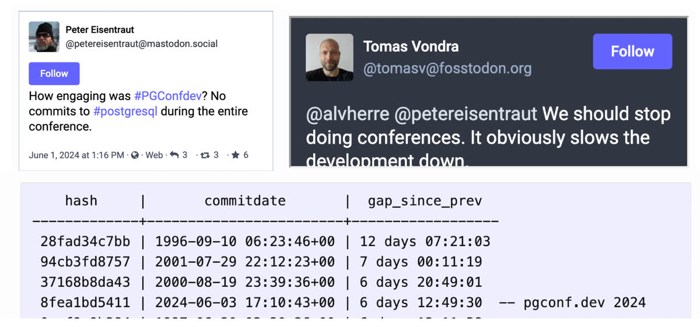

> 考虑到前几次中断都发生在二十年前的项目早期……

虽然我已经拥抱 PostgreSQL 十年了，但线下现场参加全球 PG Hacker 们的会议还是第一次，所以我非常感谢组织团队为组织这次活动所做的工作。

PGCon.Dev 2024 已经于5月31日晚正式结束，理论上本文章本应在大会闭幕时写就，不过在紧接着探索温哥华与班夫国家公园的旅途中，我确实在高密度的旅途中把这件事不厚道地搁置了 那么今天就补上参会的见闻与记录吧。

------

## 第零天：扩展生态峰会

大会的第零天是领导层会议，我注册了下午的 Extension Ecosystem Summit 扩展生态峰会。

说起来，这个扩展生态峰会也许跟我还有点关系。两个月前我写了一篇文章《[PostgreSQL正在吞噬数据库世界](/zh/blog/pg/pg-eat-db-world)》，主题是 PostgreSQL 的繁荣扩展生态是其独一无二的特点与成功的关键要素。
写完后将其翻译成了英文《[Postgres is eating the database world](/blog/pg/pg-eat-db-world)》发到了 [Medium](https://medium.com/@fengruohang/postgres-is-eating-the-database-world-157c204dcfc4) 与 [HackNews](https://news.ycombinator.com/item?id=39759539) 上，总共有几十万的阅览量，基本应该覆盖了整个 PG 社区。

[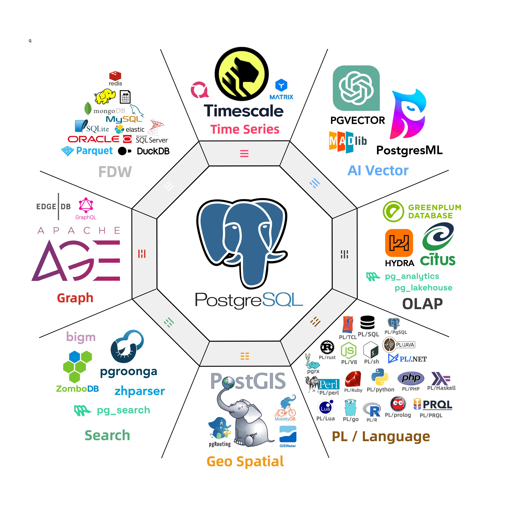](https://medium.com/@fengruohang/postgres-is-eating-the-database-world-157c204dcfc4)

此前，扩展机制的重要性并没有达成共识，即使在 PG 社区与一些资深成员的眼中，关于扩展他们只是觉得 PostGIS 和 PGVector 好像很不错 —— 前者是地理空间数据库的事实标准，后者是AI领域当红炸子鸡 —— 向量数据库的砸盘掀桌者。
但 PG 生态中强大的扩展绝不仅仅只有这两个，在抛出了这个极为繁荣的 PG 扩展生态 Landscape 后，立即引起了社区成员的极大兴趣与关注，很快关于PG扩展的讨论发酵了起来。

在这次扩展峰会之前，PG 社区已经举办了[六次迷你扩展峰会](https://www.eventbrite.com/e/postgres-extension-ecosystem-mini-summit-tickets-851127263557)对此事进行了密集的讨论，六位主讲嘉宾兼主持人在最近两个月中，从不同的角度介绍了关于扩展生态的建设工作，并阐述了对 PG 扩展生态发展的愿景，[会议的视频回放](https://www.youtube.com/playlist?list=PL11N188AYb_aT6ulbJfrQJJziWb012jG3)可以在 Youtube 上看到。

在这次大会中，有许多与扩展生态，可扩展性有关的议题，甚至还有一个专门的扩展峰会，也许确实是有点关系的。这场扩展峰会分了上下两场，每场都有几个 Topic，大家挑选感兴趣的主题参与。
我挑了 David Wheeler 的 Binary Packing 主题分会参与讨论，另外四个参与者是 PGDG Yum 仓库维护者 Devrim，Debian 仓库维护者大法师 Tomasz Rybak，以及 Neon 的 PG 主要贡献者 Andreas Scherbaum。都是些老前辈，好在我也算是 YUM/APT 仓库的建设者/维护者，能实质参与到讨论中。

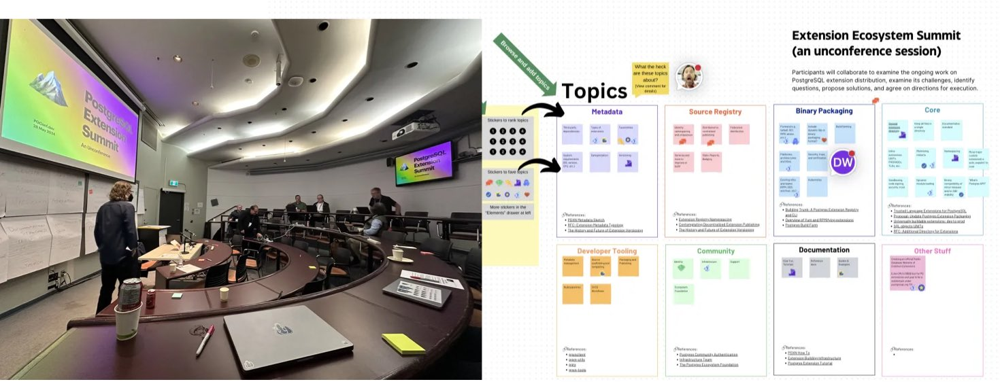

在上半场，来自 Temob 的 David 一直想做一个 PGXN v2，作为 PG 生态扩展分发的标准，搞一些 OCI 构建扩展的花活。当然，现有事实标准的维护者 Devrim 和 Tomasz 肯定是不乐意的。我支持这两位老爷子，毕竟我做的是 PG 发行版，内核组的活儿跟我直接关系不大，但 YUM/APT 仓库的负责人跟我的关系最紧密，RPM / Deb 包分发扩展已经是一种相当成熟可靠的方式了，整 OCI 这些我个人觉得意义不大。

下半场，我参加了 Omnigres 创始人 Yurii Rashkovskii 主持的 Extension in Core 分会场，讨论了关于扩展目录结构，元数据，命名冲突，版本控制，二进制分发的一些想法。并且和负责 PG RPM 仓库的 Devrim 老爷子聊了很多关于扩展的问题。

> 在扩展峰会后，Devrim 打出 “Keith粉丝团” 的 Slogan

---------

## 第一天：主题分享与酒吧社交

PGCon.Dev 最核心的部分当然是大会议题，在  [PG大会2024开幕](https://mp.weixin.qq.com/s/4t1thBCDVS8y9dHiOxPZaA) 中我已经选定了感兴趣的主题，绝大多数分享都没有让我失望 —— 比起国内各种 XX 大会无聊的产品宣介，无关痛痒的技术细节与架构分享，PGConf.Dev 的分享要有趣且扎实得太多了。

5月28号 / 周二举行了 PostgreSQL 开发者与领导层闭门会议，以及  [PGCon.Dev 扩展生态峰会](https://mp.weixin.qq.com/s/C0YyE52KbLLbnG1C2FqGRg)。大会正式的议程在周三，也就是 29 号开始。

开场由 [Jonathan Katz](https://jkatz05.com/) 与 [Melanie Plageman](https://postgresql.life/post/melanie_plageman/) 主持，前者是 PG 核心组七人之一，AWS RDS 的首席产品经理；后者是新近成为 PG 提交者，来自微软的罕有的女性PG开发者。当然，开幕式上最精彩的一幕，就是发现了著名 `xz` 后门的 "英雄开发者" Andres Freund 被拉上了台，披上了超级英雄的披风。

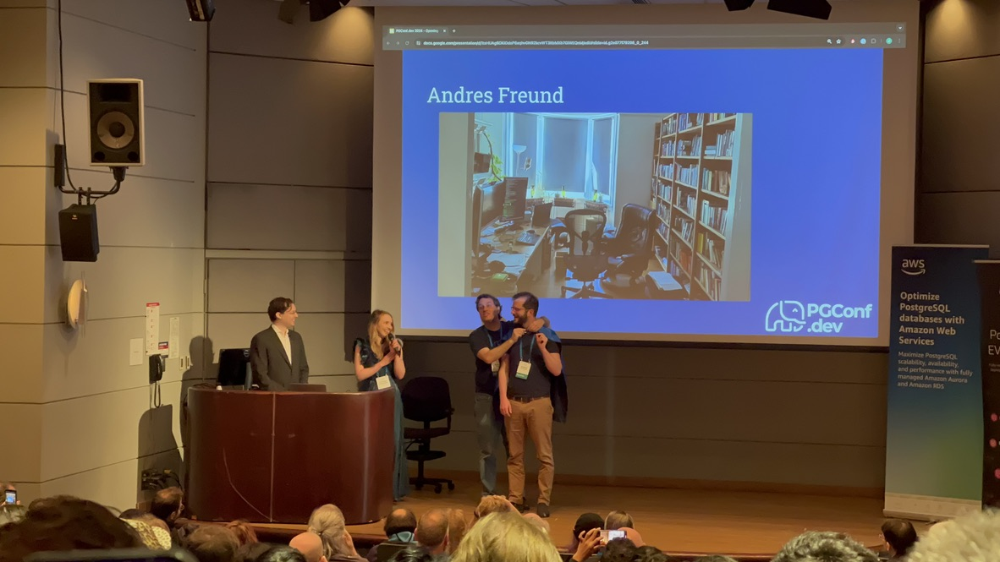

开幕式之后就开始了常规 Session Track，目前还没有会议的视频放出，但我相信以加拿大的办事效率，“用不了多久” 就能在 Youtube 上看到了。大部分的 Session 都是三选一的。我选了几个场次，下面是摘要：

---------

### 将扩展的边界推向新边疆

第一场来自 Yurii ， “将 PG 扩展的边界推向新边疆”。讨论的内容其实是 PostgreSQL 应该提供什么样的扩展 API ？ PostgreSQL 有着极佳的可扩展性，但这一套 API 已经是十几年前 9.x 留下的了。尤里的提议旨在解决现有扩展机制的一些问题。比如：如何同时安装两个不同版本的扩展插件？如何避免一部分扩展插件安装后需要重启数据库的问题？如何让PG像管理数据一样管理扩展？如何处理扩展的依赖关系？

Yurii 和 Viggy 创办了 [Omnigres](https://omnigres.com/) ，旨在让 PostgreSQL 直接成为一个应用开发平台（比如直接在数据库里跑 HTTP 服务器等任务）。为了做到这一点，他们为 PostgreSQL 设计的一套新的扩展 API 与管理机制。我认为一些改进很有创新性，是 PG 内核扩展机制的前沿探索实践。[PDF地址](https://slides.omnigr.es/pushing-boundaries-pgconfdev2024/1)

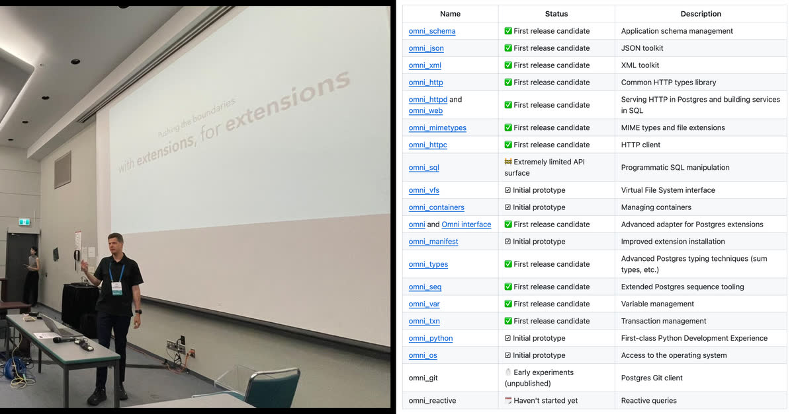

我和 Viggy 与 Yurii 聊的非常愉快，Yurii 手把手带我编译安装试用了一把 Omni。而我也准备在下一个 Pigsty 的版本中，就加入对 Omni 系列扩展的支持，让这个强大的应用开发框架开箱即用。

---------

### 数据库中的无政府状态

第二场分享来自学术界（CMU），师从网红教授 Andy Pavlo 的阿比盖尔·金，主题为：数据库中的无政府状态 —— [数据库管理系统可扩展性的调查与评估](https://abigalekim.github.io/assets/pdf/Anarchy_in_the_Database_PGConfDev2024.pdf)。我对这个主题非常感兴趣，因为 Pigsty 将 PG可扩展性为首要价值主张，收录了 255 个扩展插件，而 Kim 的这个研究带来了一些有趣的发现。

例如，**PostgreSQL 是可扩展性最强的 DBMS**，在全部十项扩展点上支持其中九种（紧随其后的是 DuckDB，和PG同为我最看好的两款DBMS）。根据 Kim 的统计，PG 生态有 375+ 可用扩展，远远甩开其他数据库一个数量级。

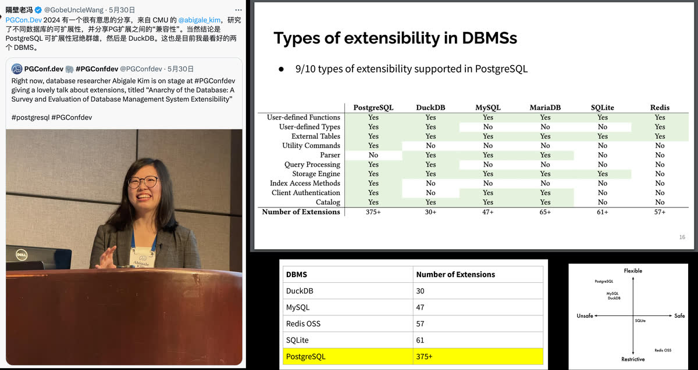

更有价值的是，Kim 定量分析了这些扩展之间的兼容性水平，得到了一个兼容性矩阵，并有一些有趣的发现 —— 例如，最为强大的 TimescaleDB 和 Citus 最容易与其他扩展发生冲突。而这样的信息对于用户与发行版维护者来说是非常有价值的。

我跟 Kim 聊天时打趣说，你的这个研究大大的好 —— 可以有理有据地用数据说话，宣称 PostgreSQL 可扩展性天下无敌了。[PDF在线地址](https://abigalekim.github.io/assets/pdf/Anarchy_in_the_Database_PGConfDev2024.pdf)

---------

### PostgreSQL是如何被误用与滥用的

下午的第一场，我听了来自 CrunchyData 的 Karen Jex 的分享，这是少有的来自用户（一位DBA，还是女性DBA，确实非常罕见），而不是开发者的分享。Karen 分享了一堆 PG 初学者会犯的可笑错误。Karen 的分享并没有什么我不知道的新知识，但确实让我确信了 —— 世界哪儿的初学者都一样，都会犯这些可笑的错误。但这样的视角对于 PG Hacker 来说确实是很新鲜的，很多大佬都听得津津有味。

### PostgreSQL与人工智能生态

下午的第二场，Bruce Momjian 分享了这个主题。Bruce 是 PGDG 发起人，从一开始到现在一直都是 PG 核心委员，也是中国各种 PG 会议的老熟人与常客了。

我本来以为分享的内容会是介绍一下PG生态的向量数据库扩展，或者类似 PGML，PG4ML 这样的机器学习扩展插件，结果竟然是如何利用 PostgreSQL 的多维数组与查询，实现神经网络的推理与训练。这样的把戏很好玩儿，但我很早也折腾过，没啥实用价值。

和 Bruce 吃饭聊天的时候也提到这个话题，Bruce 解释说，Jonathan Katz 为了介绍PG生态的向量数据库扩展 PGVector，需要一个话题来作为综述引子，于是就把 Bruce 拉壮丁过来灌水了，哈哈… [PDF地址](https://momjian.us/main/writings/pgsql/AI.pdf)

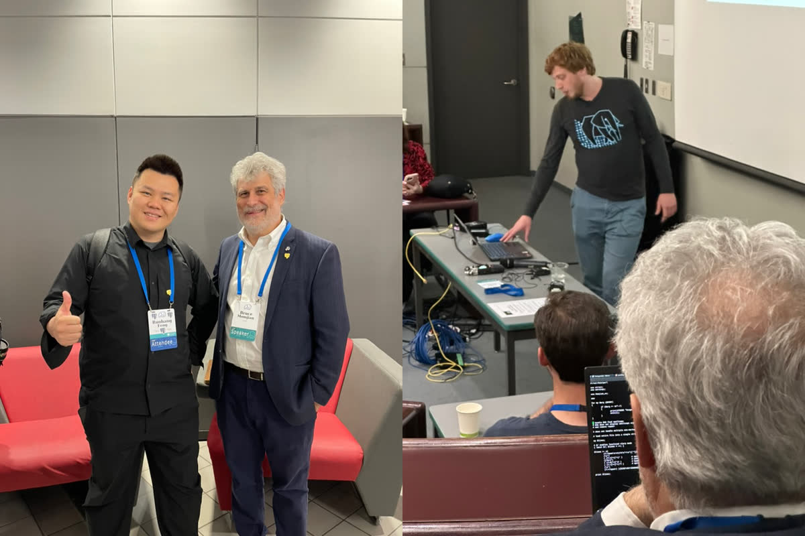

> 让我看看，Bruce在偷偷写什么代码？竟然是 ArgParser

会后和 Bruce 聊了很多有趣的的话题，往年国内 PG 技术大会都喜欢请 Bruce 过来，或者远程做一个开幕分享。Bruce 说他很非常想再来中国，不过现在国际形势冲突加剧，美国大使馆发布的中国旅游风险等级太高，他也不敢过来了，让人遗憾。

### 构建PB级别的PostgreSQL部署

下午的第三场，我听了 Chris Travers 的分享：他们原来用 ElasticSearch 存数据，保留30天，数据量1PB，体验极差，基本上处于不可用状态，也难以维护。于是他们改用了一个水平分片的 PostgreSQL 集群完美地解决了问题 —— 总共存储了 10 PB 的数据。

通常来说出于各种因素，单机 PostgreSQL 的舒适区上界在几十TB ～ 几百TB 的数量级，PB 量级的部署我只听说过一例。即使是水平分片集群，10PB 量级也是极其罕见的了。尽管依然是中规中矩的分表/分布式实践，但数据量级确实让人印象深刻。[PDF地址](https://www.pgevents.ca/events/pgconfdev2024/sessions/session/135/slides/30/Bagger_Talk%20(3).pdf)

---------

### 临时加场：当数据库遇上新硬件

毫不夸张地说，这是本场最佳演讲，没有之一，也是我听过所有现场演讲中最富有激情与感染力的。演讲人 Margo Seltzer 是 UBC 的教授，以前是哈佛的教授，美国国家工程院院士，是数据库石破天祖师爷的亲传弟子，BerkeleyDB 的作者，她的老公也很有名，是 BSD / WiredTiger / nvi 的作者 Keith Bostic。

Margo 的演讲极具激情与感染力，并一针见血地指出了数据库领域面临的几个核心问题。例如，数据库的瓶颈已经不再是磁盘的IO性能，而是主内存的速度瓶颈。而硬件领域的趋势 ——  **HBM**，**CXL** 也许是解决这些问题的答案，但具体怎么做，那就是在座的各位 PG Hacker 需要面对的挑战了。

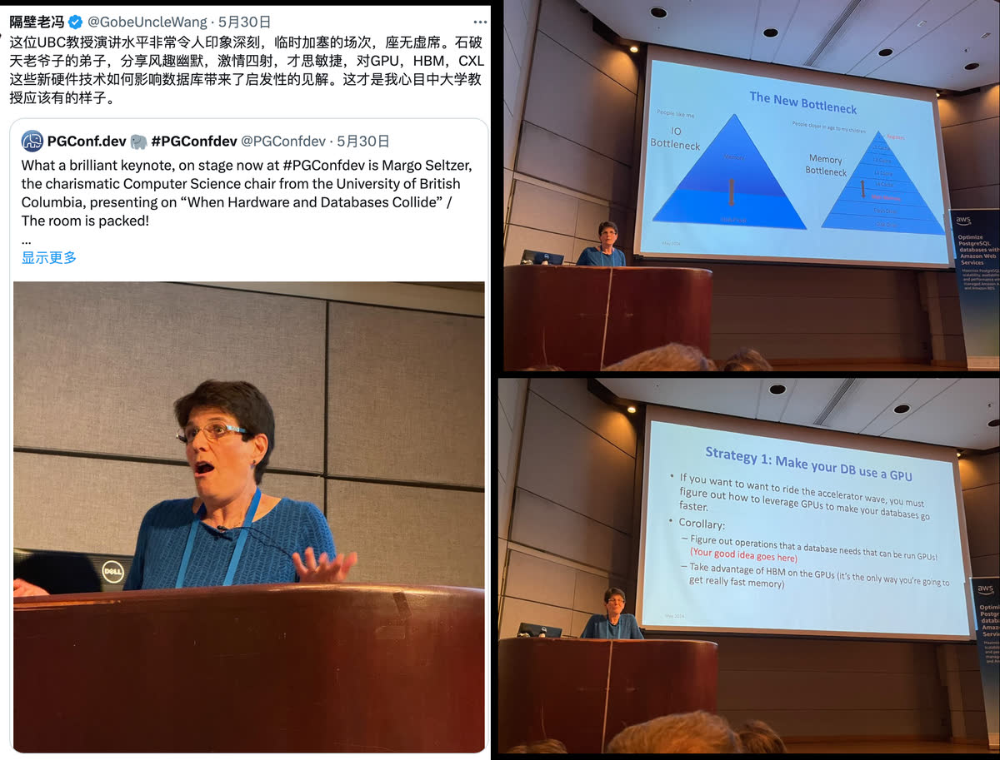

在各种国内会议听多了院士，教授念经一样的分享报告，Margo 院士的演讲风格给我带来了耳目一新的感觉，并极大地感染鼓舞了我。大会视频放出后，我强烈建议各位可以听一听她的演讲。

---------

### 酒吧社交活动

Margo 的分享结束后便是大会的官方 Social Event，在会场一街之隔的 Waterfront 车站里的 Rogue Kitchen & Wetbar， 位置极好 —— 窗外就是温哥华地标，太平洋海景。

大家可以随意交流，结识新老朋友。我和许多人都聊了很多有趣的话题，比如 Devrim，Tomasz，Yurii，Keith 等等等等。同样作为发行版/RPM维护者，我和 Devrim 老爷子尤其详谈甚欢，许多积存已久的问题也得到了想要的答案。

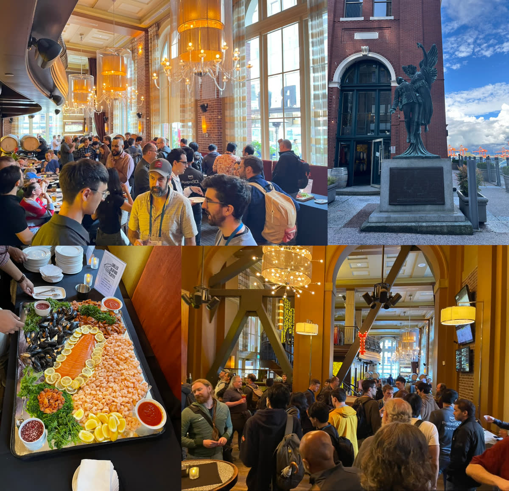

很多人都是老朋友了，难得相见一面，都聚在一起聊天。两杯啤酒下肚，许多人都打开心扉。再加上在场的都是 PG 同好，陌生人只要对个眼神也可以很轻松地聊起来。

于是在三四个小时的觥筹交错中，我和在场的 PG Hacker 基本都混了个熟脸。餐后 Melanie 喊我们去玩桌游，但我的英语做个专业演讲还行，但还没好到和 Native Speaker 玩猜词游戏和狼人杀的程度，甚是遗憾。

---------

## 第二天的主题与活动

### PostgreSQL 线程模型

第一天晚上的社交活动预热完，第二天大家就热情熟络得多了。今天的分享主题比较值得一提的是 “**多线程 PostgreSQL**”，成功做到了座无虚席。大家都很关注 Heikki 发起的这场讨论。Heikki 介绍了PG进程模型与线程模型的利与弊，详细实现路径与当前进展。

线程模型的收益有不少：更便宜的连接（等于内置连接池），共享的关系缓存，计划缓存，动态调整共享内存区域的能力，修改配置无需重启，Vacuum可以更加激进，运行中的 Explain Analyze，方便地限制每条连接的内存使用。但以 Tom Lane 为首的反对的声音也不小：这样可能会引入大量 Bug，丧失多进程模型隔离性的优势，以及 —— 引入大量的不兼容性，许多扩展都需要针对新的模型重写修改。

Heikki 提出了目标与相当详细周密的计划供在座的 Hacker 们评审 —— 在五到七年内，完成到线程模型的转换，最终目标是没有中间状态。有趣的是，Heikki现场在 PPT 里引用了最大反对者 Tom Lane 的一段评论：“从历史上看，我认为这会是一场大灾难，导致大量代码悄无声息的崩坏，让事情脱离我们的控制”。

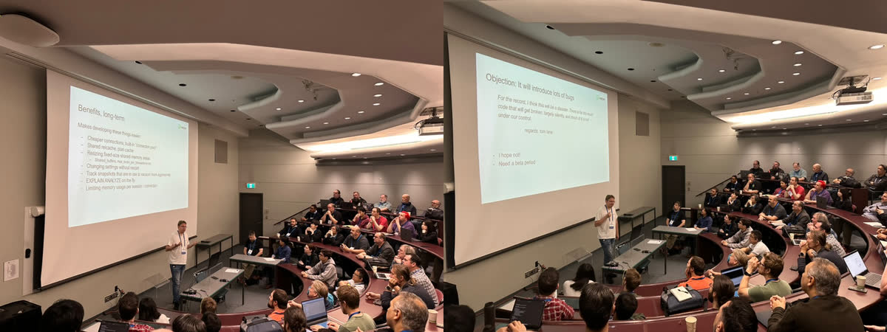

虽然被当场揶揄，但这一次 Tom Lane 现场听着也是慈祥微笑，并没有直接表示反对。而最大的反对声音不是来自 Tom Lane，而是扩展维护者，一位维护了好几个扩展插件的老爷子问到扩展兼容性怎么办？（主要是分配/使用内存的方式）Heikki 表示只能要求这些扩展作者在五年左右的过渡阶段中国呢里重写修改适配新的模型。气得这位老爷子直接愤而离场出去了。

鉴于线程模型对现有扩展生态的巨大冲击，我对这件事并不看好。我也与 Heikki 和 Tom lane 以及其他 Hacker 聊了一下关于线程模型的观点，总的来说，社区持谨慎观望态度。目前的进展也仅仅是在 PG 17 中重构了与 fork exec 有关的调用代码，并标记出使用的全局变量以便后续修改。即使真得发生，那也至少是 PG 2x 的事了。

------

### 走廊社交与大厅闲聊

第二天议题场次比第一天稍微水了一点点，所以更多的人参加的是  “Hallway Track”，就是在走廊大厅里和别人聊天。作为一个 i 人，我其实蛮不擅长这种场合的，但现场热烈的氛围很快就感染了我。再加上昨天晚上的酒吧社交环节大家也混了个脸熟，所以也算轻车熟路了。

在这样的场合中，想要开启一场和陌生人的对话，其实非常简单。你也不需要主动搭讪或者咋样，就只要眼神接触一下，对话就自然而然地触发了。给我的感觉和打 RPG 游戏一样，按下空格触发 NPC 对话。然后自我介绍一下，说说自己干嘛的，这不是就顺便把 Pigsty 广告到 PG 社区的每一个角落啦？

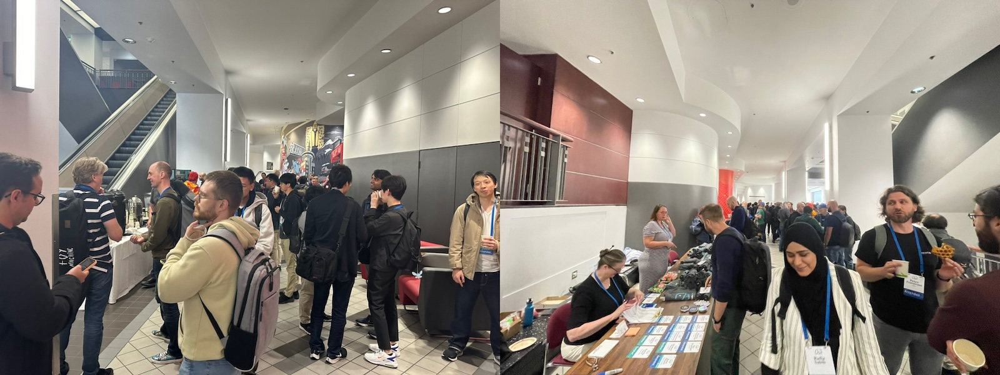

作为第一次现场参加 PGCon.Dev 的人，我很惊讶地发现自己有着于与新人不匹配的知名度与关注度。有近半的参会者看到我的胸牌 Vonng / Pigsty 就认识我了 —— 主要还是归功于我之前写的那篇 PG 大爽文《[PostgreSQL is eating the Database world](https://medium.com/@fengruohang/postgres-is-eating-the-database-world-157c204dcfc4)》，Jonathan 跟我吐槽到说最近这篇文章天天出现在他的时间线上，整个 PG 社区的人基本上都看过了。

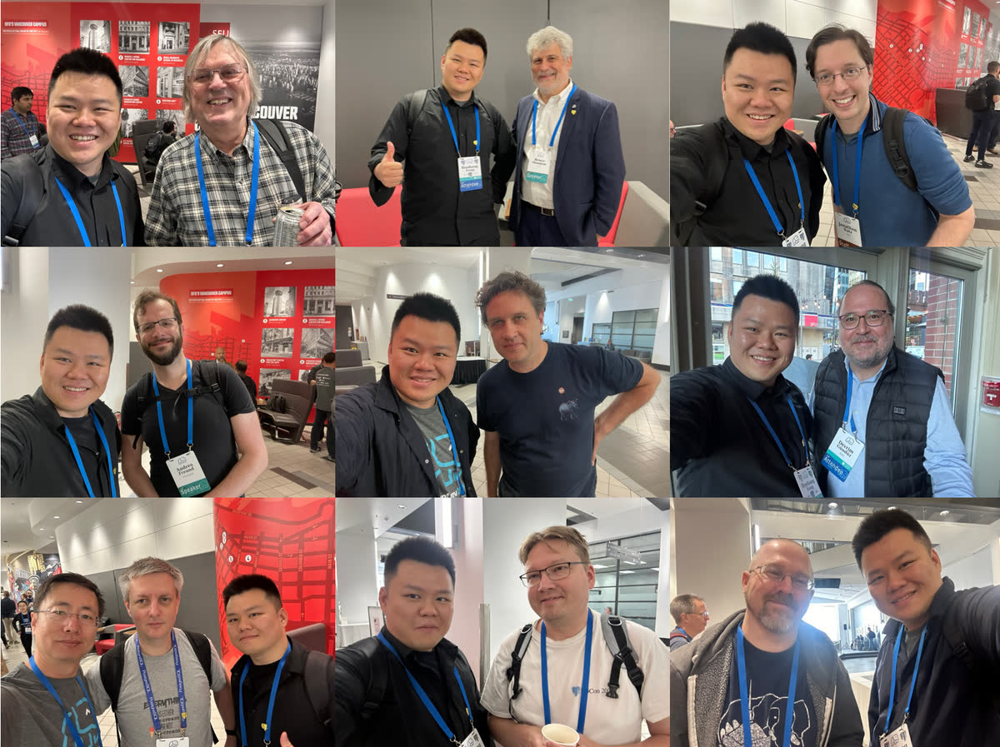

> 拍照基集：Tom, Bruce, Jonathan, Andres, Robert Hass, Devrim, Scherbaum, Heikki, Keith,...

当然说起社交，最简单粗暴的诀窍就是礼多人不怪 —— 我准备了一盒胸针，PostgreSQL 的吉祥物 Logo **Slonik**，镀金的，还带个小亚克力盒子。我给每一个和我聊天的 PG Hacker 都送了一个，这个胸针成为了本次大会备受欢迎的抢手货。好多人都在胸前或者会牌上别上了，而没拿到的人就在问：咦你们这个在哪里拿的，是贡献者奖励吗？

Bruce 对这个胸针爱不释手，说：“哎呀这个精巧的徽章真是太可爱了，一看就不是那种便宜货”（但其实镀金其实不贵的），然后我就又送了他一个。总之，礼多人不怪，靠着 Pigsty，PG爽文，和 Slonik 小胸针，也算是在 PG 大会上吃开了。

---------

### 小聚：多国社区会餐

中午，瀚高做东，把美国PG社区，欧洲PG社区，还有日本PG社区的几位头面参会者拉到一起聚餐，一家温哥华的广东菜馆。图中从左前开始逆时针顺序分别是，瀚高北美研究院的 Grant Zhou，瀚高创始人苗健，欧洲PG用户组/ Neon 的 Andreas Scherbaum，有PG核心组/ 美国EDB 的 Bruce Momjiam，荣誉退休的前核心组成员 / pgEdge 的 Jan Wieck，制作各种PG贡献者硬币，社区周边的 Mark Wong，以及日本社区的 Tatsuro Yamada （山田達郎）与 Kyotaro Horiguchi （堀口恭太郎），最后是我。

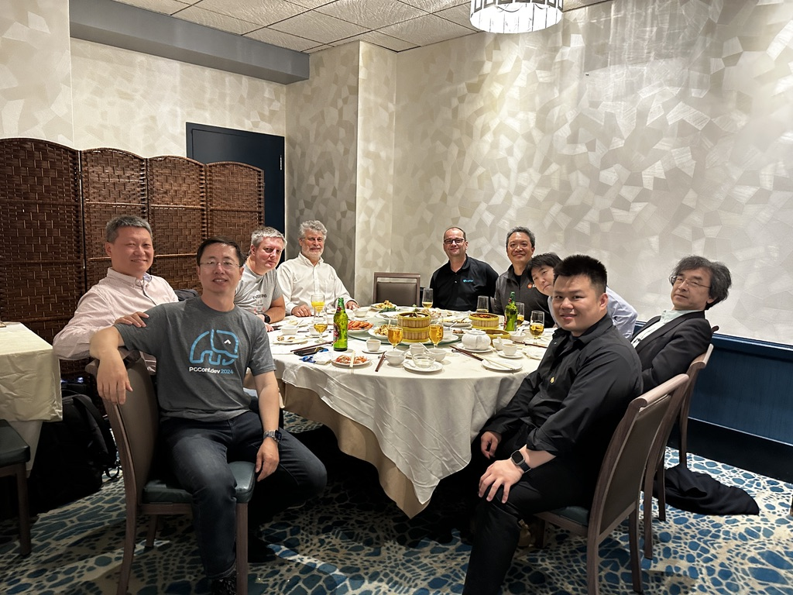

在饭桌上我们聊了各种各样的话题，坐在我边上的两位日本 PG 社区友人很有趣，堀口桑是一位 PG 核心贡献者，在 WAL 复制 / 多字节字符串处理上有很多贡献，还是 pg_hint_plan 的作者。另一位山田桑也是 PG 贡献者，对 Pigsty 很感兴趣，在本次大会上进行了题为 《[索引建议不受待见，但很管用](https://www.pgevents.ca/events/pgconfdev2024/sessions/session/62-advice-is-seldom-welcome-but-efficacious/)》的分享。

Mark Wong 也是 PG 社区的主要贡献者，PGUS 的组织者，开发了一系列 PG 监控扩展，但更有趣的是他还负责 PG 社区的周边，贡献者硬币，衣服，贴纸，还有这个特别可爱的毛线团小象也是他自己手工缝制的，让人爱不释手。据说他上次做的公仔在 PG Conf US 被人顺走了哈哈，所以这次看得可牢了。

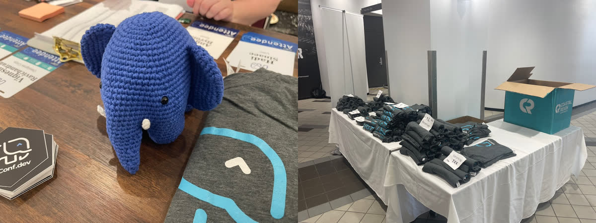

Bruce 是 PG 中文社区的老朋友了，上面介绍过了；来自德国的 Andreas Scherbaum 是欧洲 PG 大会的组织者，我们一起参加了扩展峰会的 Binary Distribution 讨论，也邀请我们到时候去参加；瀚高是唯一一个出现在 PGCon.Dev 的中国数据库厂商，苗总从山东飞过来参加，也跟我们分享了一些国产数据库的故事与密辛。

在回会场的路上，我和 Jan Wieck 聊了很多，他是老一代光荣退休的 PG 核心组成员，也是 PL/pgSQL，PL/TCL，外键，视图，规则系统，TOAST，BGWriter，统计进程这些耳熟能详的PG核心功能的作者，他也是 Slony 的作者。路上我说我也想当一个 Major Contributor，他便与我分享了他参与 PG 贡献的故事：银行职员，工作需要用到数据库，就慢慢开始一步一步变成核心贡献者了 —— 他勉励我更多地参与到 PostgreSQL 贡献来，PG社区的未来就看你们年轻人的了。

---------

### 让PG社区参与更有包容性

第二天下午与昨天一样，有一个无需三选一的特殊场次，主题是**社区建设**，由 Robert Hass 主持。3 位新晋的 PG 提交者轮流分享他们成为提交者的历程，与遇到的挑战和问题，分别是：泽田正彦，阿米特·兰格特，梅兰妮·普拉格曼。总体上社区参与面临的几个主要挑战是：非英语母语者的参与问题，时区差异，带有情绪的电子邮件沟通。

Robert Hass 在会后的博客中提到：***他真的很想看到更多来自印度与日本的人参与到 PG 的高级职位中来，因为这两个国家有着庞大的开发者社区，却没有核心组成员，高级职位代表性不足***。

说老实话，听着有些五味杂陈，因为在包容性的议题中没有提到**中国**，而强调的是日本与印度。但这也是确实是没有办法的事情，中国在国际社区参与上，确实做的很拉垮。中国有三四百款国产数据库，其中很多都是基于 PG 魔改换皮套壳的，但这么多公司与用户，总共也只出了一个 PG 贡献者（ ——拓数派的 Richard Guo，原来在 Pivotal，今年刚晋为 Committer）。

这次 PGCon.Dev ，中国过来参会的人，除了瀚高的四位就是我了，加起来正好一只手数过来。说来遗憾，中国技术界对 PostgreSQL 的认知水平与采纳程度仍然远远落后于全球，在生态上可能有10到15年的差距。要说语言挑战与障碍的问题，印度日本的英语口音也有不少沟通障碍，要说种族歧视啥的更是无稽之谈 —— 在场的华人面孔可绝对不算少。

那么到底是为什么呢？如果你选择关门自嗨，土法炼钢造手搓数据库，白嫖社区，不参与到全球社区中来，那么别人自然也不会待见你。我希望我的参与能够 “Bootstrap” 并改善这一情况，让更多中国的 PG 用户、开发者，产品、开源项目，被全球社区所熟知，接纳，承认，让中文世界的用户也有更多的社区参与。

----------

### 闪电演讲

第二天下午的最后一个议程叫做： **闪电演讲**。顾名思义，就是一个人只给5分钟，超时就立刻轰下来。大家都很干练，11 个主题整个才花了 45 分钟。在酒吧相谈甚欢的 Keith 分享了一些关于 PG Monitor 的改进，Peter Eisentraut 分享了关于 SQL 标准的跟进。当然，要说我最喜欢的分享，当属 Devrim Gündüz  关于 PG RPMs 的闪电演讲。昨天酒吧喝酒的时候，他神秘兮兮地说明天要放个大招，震撼全场，果不其然，在5分钟里讲完了 75 页的 PPT，气氛非常欢快～。

说起 PostgreSQL，尽管这是个开源软件，但也许 99% 的用户都是直接使用 “官方” 编译好的成品二进制软件而不是从源码编译。Pigsty 作为一个数据库发行版，我自己维护了34个 RPM 扩展插件，但还有一百多个扩展，和各种生态工具都是直接来自 Devrim 老爷子维护的 PGDG 官方仓库的，我深深知道这项工作的不易。 Devrim 在用自己的信用，为这个世界上最先进，最流行的数据库软件质量把好最后一道关口。

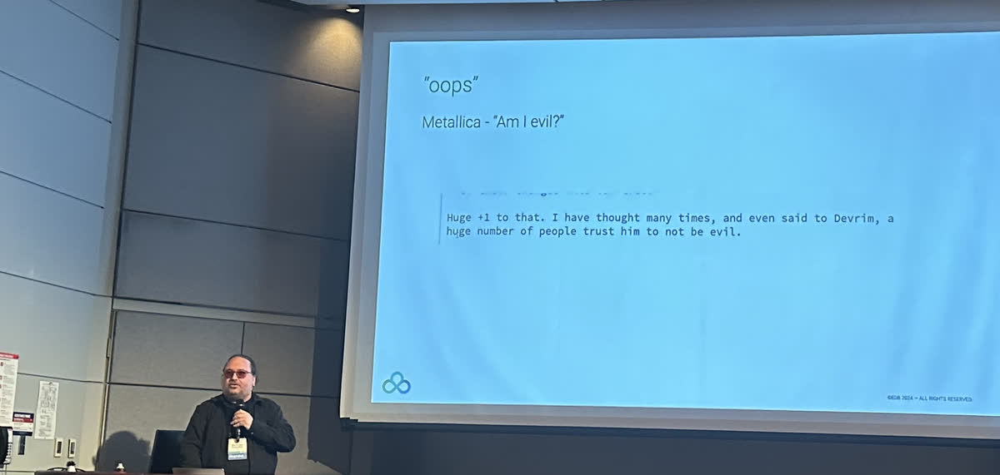

> Devrim 要是想干坏事，那破坏力说不定比 xz 要大多了

Devrim 老爷子是一个很有意思的人，土耳其人，现居伦敦，还兼职酒吧 DJ 打碟，身上有一个 PostgreSQL Logo 的纹身，是 PGDG RPM 仓库的维护者。我跟他聊了一个多小时，了解了 PGDG 仓库的方方面面，讨论了许多问题。比如，一个扩展想弄进 PGDG 仓库里，一般需要什么条件，是什么流程。Devrim 说他会去关注 PGXN ，以及社区讨论，像最近最近大火的 `pgvector` 向量数据库扩展就是有人推荐给他，然后就收录进去了。我就白了一眼说：你看看[推给你的那个人莫不是我](https://github.com/pgvector/pgvector/issues/76)…，哈哈哈哈。

说起来很有趣，在最近发布 [Pigsty v2.7](https://mp.weixin.qq.com/s/CzNUNAVnafO-hMCMdfxgZA) 中，我发现我维护的34个扩展里有4个 `pgsql-http`, `pgsql-gzip`, `pg_net`, `pg_bigm` 被纳入了进入了 PGDG 官方仓库。我一和 Devrim 提起这个事，他就笑眯眯地跟说我：我跑到你的 Pigsty 网站[扩展列表](/zh/docs/reference/extension/)上扒拉了一圈，发现有几个不错的，就弄进官方仓库了。我就问，我打包的那些不错的 RUST 扩展有没有机会弄进官方仓库里？他马上义正严辞地表态 —— 这些 Go 和 Rust 异端插件想也别想！但反正你不是自己弄了个 YUM / APT 软件仓库专门放这些扩展吗？

我和 Devrim 聊得非常尽兴。最后我答应当一个 **PG扩展猎手**，发掘新的 PG 插件。如果觉得不错就交给他，收纳进 PG 的官方仓库里。

--------

## 第三天：Unconference

如果说 PGCon.Dev 最精髓特色的节目是什么，那一定是 **Unconference** （自组织会议）。Unconference 没有预设的议程，而是由参与者在现场决定讨论的主题。

大会第三天全天的议程都是 Unconference，Joseph Conway 主持了 Unconference Organization 议程，愿意讲的人上去提交自己想介绍的主题，然后大家投票。当然我也上去提交了一个 Built-in Prometheus Metrics Exporter 的主题。

提交完后，每个议题主讲人上台简介自己的 Topic，并尽可能合并同类项，我的话题不出意料地被合入 Jeremy 发起的 Observability 主题里了。接下来就是大家投票选出感兴趣的演讲。排名前三的主题是： 多线程（42票），可观测性（35票），增强社区参与（35票）。  最后选出的主题如下：

看得出来，大家都非常重视可观测性上的特性。在 PostgreSQL 可观测性上，我确实是当仁不让的专家，`pg_exporter` 就是我写的。所以我抛出来的议题是：为 PostgreSQL 添加一个第一方的监控扩展，内置 Prometheus 监控端点，直接通过 HTTP 对外暴露监控指标。

提出这个问题的原因是，`pg_exporter` 虽好，但毕竟是外部组件，会引入额外的管理复杂度；而且如果 PostgreSQL 处于崩溃恢复无法接受新连接的状态，外部组件也难以知道内部的状态，只有将这个功能做成内核扩展，才能真正完整地提取这些信息。

实现的方案是采用类似 `bgw_replstatus` 扩展使用的后台工作进程，监听一个额外端口，通过 HTTP 对外暴露监控指标。内容上基本上也以我编写的 `pg_exporter` 作为蓝本，除了少量系统关键指标外，所有指标都通过一张 Collector 配置表进行定义。

这个想法得到了一些在座 PG Hacker 的关注。EDB ，CloudNativePG 的一些开发者也开始评估 `pg_exporter` 能否直接用在他们的发行版中，作为监控解决方案的一部分。现场所有对可观测性感兴趣的成员成立了一个 Observability SIG，并通过邮件列表进行后续的讨论。 

---------------

### 议题：关于对龙芯提供支持

在大会最后两天中，我还与几位 PG Hacker 讨论了一些关于国产芯片，国产操作系统，中文字符集相关的中国特色数据库议题。 

在之前发出的问题征集中，PG分会的类总提出了一个很好的建议，能不能让 PGDG 全球仓库支持龙芯 LoongArch 架构？国产芯片和国产操作系统厂商很乐意赞助这样的构建环境。带着这个问题，我询问了 RPM 仓库维护者 Devrim 老爷子；以及 Debian 侧的 Tomasz Rybak （备注：PGDG APT 仓库的维护者是 Christoph Berg，但 Tomasz 维护了 Debian 仓库中许多 PostgreSQL 相关的软件包），看看有没有可行性。

不过可惜的是，目前龙芯架构对于PG社区构建二进制使用的 OS 还没有提供支持 —— 例如 EL 系的 CentOS 7，Rocky 8，Rocky 9 ，以及 Debian 10/11/12 都无法在龙芯上运行。所以 Devrim 老爷子的回答是 No：而且构建的 Pipeline 必须在他们自己的机器和环境上可以跑起来，所以赞助云服务器的方式可能是走不通的。Tomasz 对于这个问题持开放态度，因为据说后面龙芯可能会支持 Debian13 ，那么就可以考虑把一些 PG 包的支持加进来。

总的来说，让 PG 官方 RPMs 支持龙芯架构估计没戏，但 APT 还是有可能的。但要龙芯支持主流开源社区 Linux OS Distro，这个事才有可能；如果是龙芯 + 一堆国产操作系统，那想都不要想，100% 没戏。

-------------

### 议题：关于服务端中文字符集支持

Jeremy Schneider 在本次大会带来一场关于字符排序规则（ Collation） 的分享，我非常关注。这个分享抛出了一系列 Collate 规则变化导致的问题。说实话，我以前也专门[写过一篇文章研究过这个问题](/pg/admin/collate/)，最终结论与 Jeremy 高度一致，应该用 `C.UTF8` ，我一直是这么做的，并制定开发规约，也在发行版中强制默认配置推行这一点，而 Jeremy 的分享，则详细阐述了[不这么做会导致哪些坑爹的结果](https://www.pgevents.ca/events/pgconfdev2024/sessions/session/95/slides/26/pgcon24_collation.pdf)。

会后在大厅里，我和 Jeremy 进一步地讨论了这个问题，核心组的 Peter Eisentraut 也参与了进来。Jeremy 问我中国用户是怎样使用字符集与 Collation 的，我说新应用大体上都用的是 `C.UTF8`，通常只有一些政企单位和传统行业的老系统才会去折腾服务端中文字符集。

但这里确实有一个略尴尬的问题，例如 2023 年底中国发布的国标 GB18030 对信息系统提出了两条强制性要求：产品可以正确输入、输出、处理 GB18030 强制部分规定的全部汉字字符；产品可以正确识别 GB18030 强制性部分规定的全部汉字字符对应的编码。

PostgreSQL 可以在**客户端**支持 GB 18030 编码，也提供了 `convert_to` 将字符串编码为 GB18030 编码字节串的编码方案支持，但是不支持直接在服务端使用此编码（支持的是 `EUC_CN`），也没有通过 ICU 提供对 GB 18030 的支持。此外，我还向 Peter 提出了 `convert_to` + `gb18030` 大概有 20个新增汉字映射有误的问题。Jeremy 和 Peter 都表示会进一步跟进研究，看看怎么解决这些问题。

---------

### 闭幕式

自组织会议聊完后，大会也进入到了最后的尾声。 Jonathan Katz 与 Melanie Plageman 主持了闭幕式。确实是一场非凡的大会，让人意犹未尽。

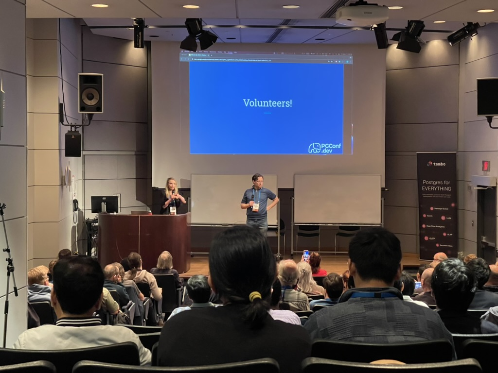

明年的 PGCon.Dev 2025 也会在加拿大举办，可能在温哥华，多伦多，渥太华或蒙特利尔四者之一。今年摸清楚了大会的调性与流程，我想明年可以去上台分享一个关于 Pigsty 或者 PG 可观测性的话题了。

顺带一提，参会的效果确实很明显，参会后，Pigsty 的海外下载 CDN 流量（这还只是一家云上的一部分）出现显著增长，打掉了我接近大几百G 的流量。更多的国际友人了解到了国内的 PostgreSQL 数据库发行版 Pigsty，哈哈。

> 参会后来自海外的 CDN 流量有了一波暴增

------------

大会的 PPT 一部分已经[开放下载](https://www.pgevents.ca/events/pgconfdev2024/sessions/)。当然，对 PostgreSQL 与 Pigsty 感兴趣的朋友也可以微信搜索 `pigsty-cc` 加群直接下载或参与讨论。以及，下面是一些 PGCon.Dev 相关的博客与文章：

- [Andreas Scherbaum PostgreSQL Development Conference 2024 - Review](https://andreas.scherbaum.la/post/2024-06-14_postgresql-development-conference-2024-review/)

- [PgCon 2024 Developer Meeting](https://wiki.postgresql.org/wiki/PgCon_2024_Developer_Meeting)

- [Robert Haas: 2024.pgconf.dev and Growing the Community](https://rhaas.blogspot.com/2024/06/2024pgconfdev-and-growing-community.html)

- [How engaging was PGConf.dev really?](https://peter.eisentraut.org/blog/2024/06/04/how-engaging-was-pgconfdev-really)

- [Cary Huang: PGConf.dev 2024：在温哥华塑造 PostgreSQL 的未来](https://www.highgo.ca/2024/06/11/pgconf-dev-2024-shaping-the-future-of-postgresql-in-vancouver/)

- [PGCon.Dev 扩展生态峰会小记 @ 温哥华](https://mp.weixin.qq.com/s/C0YyE52KbLLbnG1C2FqGRg)

- [PG大会2024开幕，温哥华饭搭子驴友团呢？](https://mp.weixin.qq.com/s/4t1thBCDVS8y9dHiOxPZaA)

