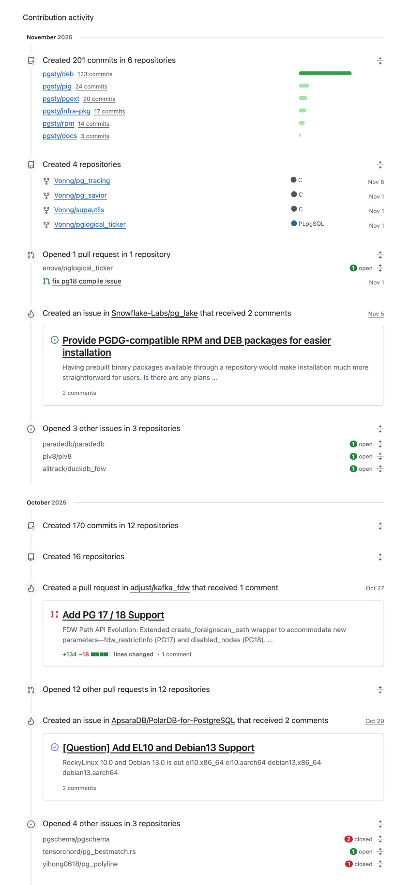
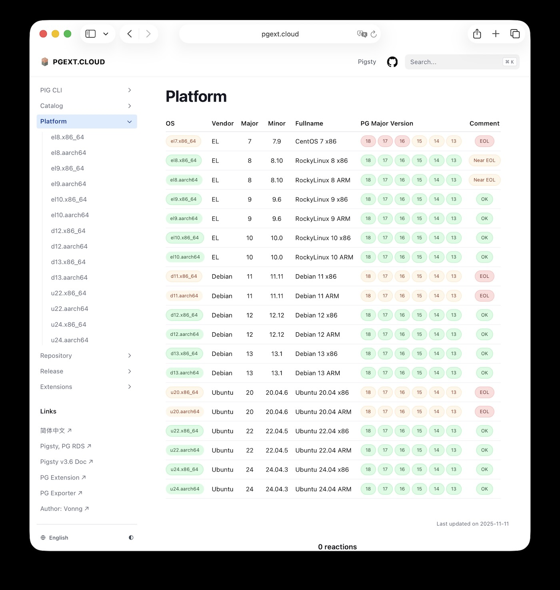
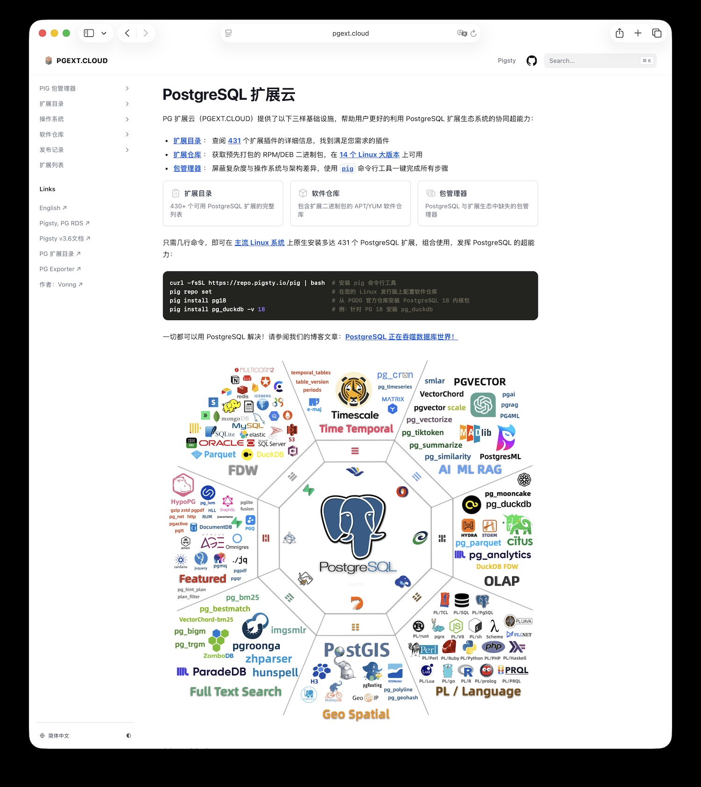
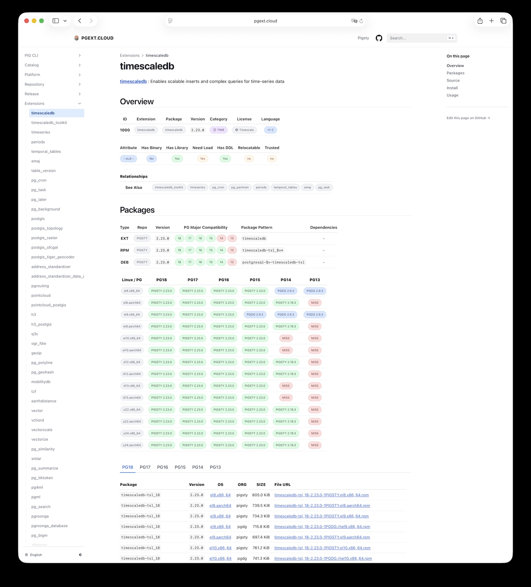
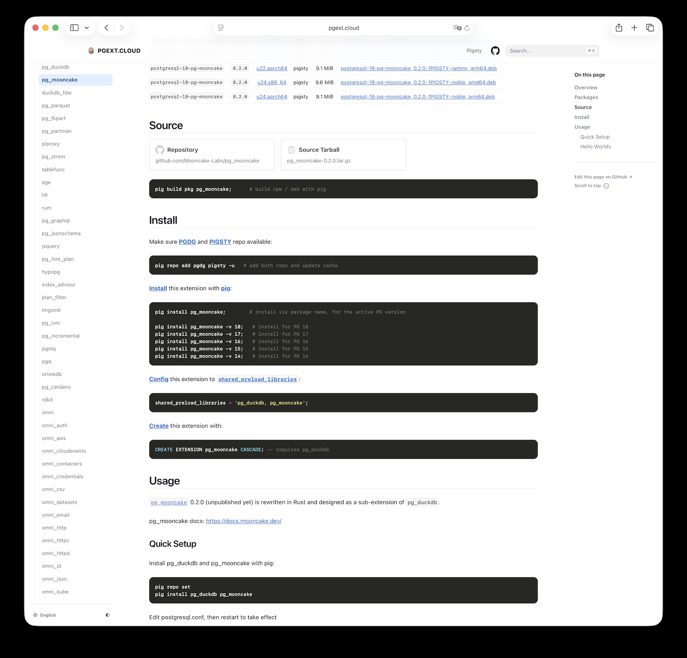
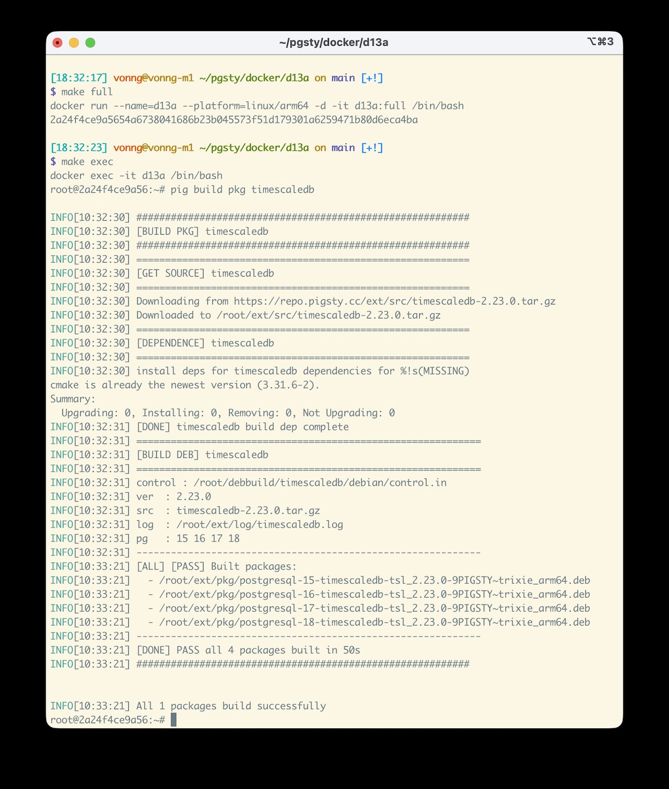
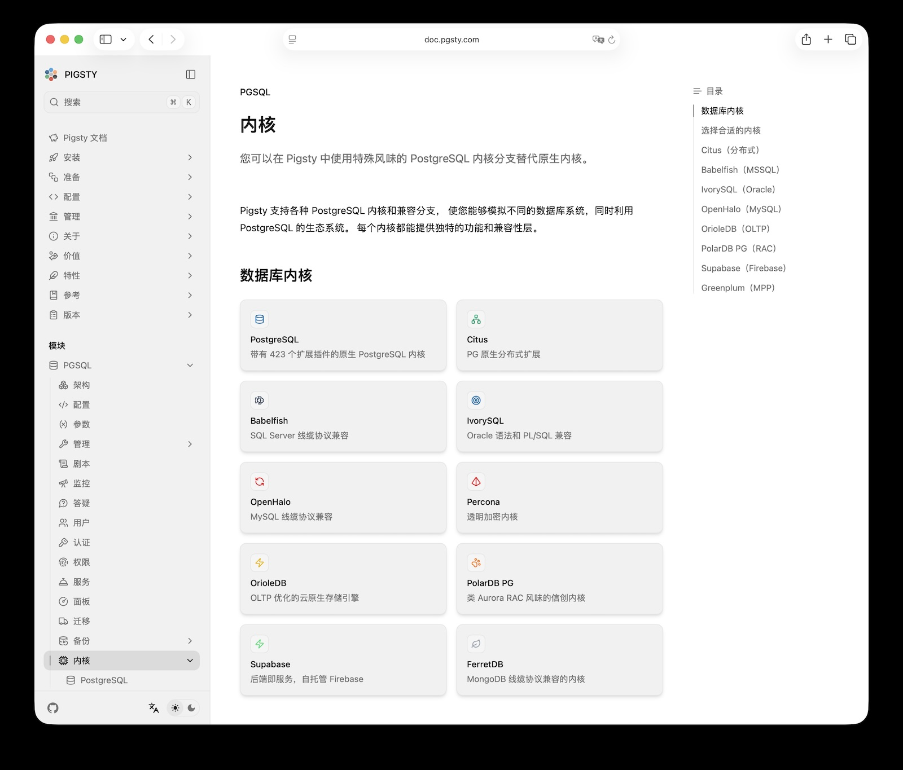

> [微信公众号链接](https://mp.weixin.qq.com/s/oHHzhbbt5suSxnJhyxTwQQ)

PostgreSQL 拥有极为强大的扩展插件体系。
在 《[PostgreSQL 正在吞噬数据库世界](/pg/pg-eat-db-world/)》中， 老冯已经阐述过  **可扩展性** 是 PostgreSQL 成功的核心要素。
举例来说，PG 有 GIS 领域的事实标准 PostGIS，向量数据库的瑞士军刀 pgvector，还有可以替代 ElasticSearch 的 pg_search，
以及使用 DuckDB 在 PG 内进行分析的 pg_duckdb / pg_mooncake 等等，这些扩展为 PostgreSQL 赋予了超乎想象的能力。
只有加装了这些扩展，PG 才能称得上是 “全盛完全体”。

[](/pg/pg-eat-db-world)

然而，要在生产环境中可靠地编译、安装这些扩展插件并非易事，会有许许多的挑战。绝大多数扩展仅仅交付源代码，需要自己去摸索编译。
对于严肃的生产环境来说，源码编译和 [Docker 镜像](/db/pg-in-docker/) 往往也不是一个可行选项 ——
当你需要组合使用多个不同扩展，在不同服务器上精确安装相同版本，或者根本不想使用容器时，就会有各种问题。
还有一些非技术的挑战需要克服 —— [官方镜像站停止更新](/pg/pg-mirror-pigsty/) ，以及国内网络环境受限导致无法下载。

不过，这些问题都被老冯一一攻克了！经过最近两三年无数日夜的努力，我很自豪地向大家介绍 [PGEXT.CLOUD](https://pgext.cloud) —— PG扩展云，
一次性， 一条龙，一步到位解决用户安装扩展，开发者分发扩展，厂商交付扩展的难题。


## PGEXT.CLOUD

PG 扩展云（PGEXT.CLOUD）提供了以下三样基础设施，帮助用户更好的利用 PostgreSQL 扩展生态系统的协同超能力：

- **扩展目录** ：一个在线网站，查阅 [**431** 个扩展插件](https://pgext.cloud/list) 的详细信息，找到满足您需求的插件。
- **扩展仓库** ：获取预先打包的 RPM/DEB 二进制包，在 [**14 个 Linux 大版本**](https://pgext.cloud/platform) 上可用
- **包管理器** ：屏蔽复杂度与操作系统与架构差异，使用 [pig](https://pgext.cloud/pig) 命令行工具一键完成所有步骤

只需几行命令，即可在 **主流 Linux 系统** 上原生安装多达 431 个 PostgreSQL 扩展，组合使用，发挥 PostgreSQL 的超能力。
如若不信，在全新的 Linux 服务器/容器环境中，下面三行命令就能让你安装 PG 18 官方内核与一些最强大复杂的 PG 扩展插件：

```bash
curl -fsSL https://repo.pigsty.io/pig | bash
pig repo set                                
pig install -y -v 18 pgsql postgis timescaledb pgvector pg_duckdb      
```

这几条看似简单的命令背后，其实隐藏了巨大的复杂度与工作量。支持 14 个 Linux 发行版、6 个 PG 主版本、431 个扩展插件所产生的排列组合，是一个近乎天文数字的挑战。

而在实现“丝滑”安装交付的过程中，还伴随着各种棘手问题 —— 庞大的数量，驳杂的质量，分发的限制，心智的负担。好在这些挑战现在都有了一个不错的答案。


## 无可比拟的数量

PostgreSQL 生态中拥有数量庞大的扩展，总数可能超过 1000 个。然而在官方 PGDG 仓库中，目前只提供了其中约 135 个扩展。
诚然，一些耳熟能详的插件（如 PostGIS、pgvector 等）包含在官方仓库里，但还有许多强大的扩展并未被收录 —— 
例如近期炙手可热的 DuckDB-PG 融合扩展 pg_duckdb 和 pg_mooncake。老牌的 Plv8，还有 Supabase 自建所需的一系列 Rust 扩展。

官方仓库不收录这些扩展有许许多多的原因 —— 比如 YUM 仓库的维护者 Devrim 就表示，绝对不会让 Rust 写的 PG 扩展进入仓库中。
而像 plv8，pg_duckdb 这样一编译一个小时的扩展巨无霸，毫无疑问也会显著拉高仓库维护的成本，所以老冯也完全能理解。

老冯曾经寄希望于 Tembo 的包管理器 trunk，或者 pgxman 之类的东西可以解决这些问题，不过似乎最后还是不自己动手上。
（比如 tembo 就已经跑路去干 AI DBA 去了）。而这一干就一发不可收拾，一下子就干成了 PG 生态里最大的扩展目录与仓库。

简单来说，这个扩展目录目前收录了 431 个扩展，抛开 PG 自带的 71 个扩展总共 360 个。
PGDG 官方仓库维护了 144 个 EL 扩展和 105 个 Debian 扩展，而老冯的 PGSTY 维护了 260 个 EL 扩展与 241 个 Debian 扩展，
占到了总数的 72% 左右，哈哈，这可真是以一己之力撑起了大半边天。

| **分类**     | **All** | **PGDG** | **PIGSTY** | **CONTRIB** | **MISS** | **PG18** | **PG17** | **PG16** | **PG15** | **PG14** | **PG13** |
|:-----------|--------:|---------:|-----------:|------------:|---------:|---------:|---------:|---------:|---------:|---------:|---------:|
| **ALL**    |     431 |      150 |        260 |          71 |        0 |      396 |      419 |      421 |      424 |      409 |      384 |
| **EL**     |     425 |      144 |        260 |          71 |        6 |      385 |      412 |      415 |      418 |      406 |      380 |
| **Debian** |     417 |      105 |        241 |          71 |       14 |      384 |      407 |      407 |      410 |      398 |      369 |


## 良莠不齐的质量

当然，光有数量是不行的，更重要的是质量。PGDG 的 YUM 仓库有许许多多的 “坑”：
某个发行版和 PG 的组合可能漏掉了，不同 PG 大版本的扩展版本不一致，老冯在这里可没有少给 PGDG 仓库擦屁股。

更大的问题在于部分扩展缺乏及时维护。当 PostgreSQL 推出 16、17、18 等新版本时，一些扩展因为无人更新而无法兼容新版本，甚至直接导致崩溃。
这两年来，[老冯](https://github.com/Vonng) 修复了近百个“趴窝”的扩展。例如，最近几乎所有重要的 [Rust PG 扩展](https://pgext.cloud/list/lang#rust)，在老冯的推动下都已升级到最新的 pgrx 0.16.1 框架，并支持 PG 18。



可以说，目前目录里的这些扩展，即使原作者弃坑不干了，老冯也有信心接手维护，持续为新版本保驾护航。
当然，确实有极个别规模太大，难以抢救且作者失联的扩展，老冯也只能无奈摊手（age，hydra）。

也许你会好奇，老冯一个人是怎么维护这么多扩展的？说起来，这还真是多亏了 Claude Code。
Opus 4.1 干这个可真是一把好手，通常我只要念出正确的咒语，然后 Review 一下，大部分情况下问题就迎刃而解了，哈哈！


## 如何分发扩展

光解决扩展的编译打包还不够，如何高效地将扩展分发到用户手中，同样面临诸多挑战。
首先需要维护一个 APT 仓库和一个 YUM 仓库，确保不同系统的用户都能方便获取软件包。
PGEXT.CLOUD 默认通过 Cloudflare 提供全球 CDN 加速，但 Cloudflare 在中国大陆访问缓慢，因此我们专门搭建了位于国内的镜像站来提供高速下载。

虽然，[打包构建是一项相对冷门稀缺的技能](https://mp.weixin.qq.com/s/LaDBTaBKI1ZLdgfFdlWgyA)，但建立自有仓库镜像并不是最棘手的问题。
更大的难题在于：除了 Pigsty 自己的扩展仓库镜像，俺还需要维护 PostgreSQL 官方 PGDG 仓库的国内镜像！

在我之前的文章 [从PG“断供”看软件供应链中的信任问题](https://mp.weixin.qq.com/s/SBVcO8fi5mK1Qnb3AWbqxQ) 和 [卡脖子：PostgreSQL切断镜像站同步通道](https://mp.weixin.qq.com/s/yOIXbXXNH7okk_OjRW91EQ) 中，
我曾提到：PostgreSQL 官方 PGDG 仓库自今年5月起停止了 ftp/rsync 同步通道，这导致全球范围内的大部分镜像站从那时起就不再更新了。
对于海外用户来说影响尚不明显，但对于无法自由访问外网的中国大陆用户而言，这意味着如果不翻墙就无法获取 PG 的最新软件包。
大家常用的阿里云、清华 TUNA 镜像源目前都停留在 2025-03-31 的版本，仓库连今年 9 月发布的 PG 18 都影子无踪。


目前，能持续更新 PGDG 仓库镜像的我所知道也就只有老冯维护的 Pigsty、俄罗斯的 Yandex，以及欧洲 Xtom。
我每周都会手动同步上游 PGDG 仓库，确保国内用户也能拿到最新的更新。
顺带一提，老冯还在 PGDG 镜像里帮 PGDG YUM 仓库修复了一些陈年旧 bug（比如 patroni 3.0.4 这个钉子户版本）。

总而言之，如今只要你使用主流 Linux 发行版，无论身在国内还是海外，都可以通过 PGEXT.CLOUD 
享受丝滑顺畅的 PostgreSQL 及其扩展安装体验，再也不用为网络和环境问题操心。




## PG扩展维基百科

扩展插件如此众多，对于普通用户来说，安装使用时难免会被各种配置、源站、镜像等细节搞得头大。
许多初学者只是想用上 PostgreSQL 及其扩展，这些繁琐细节实在没必要成为绊脚石。
这正是老冯在仓库之外，又额外提供 **扩展目录** 和 **包管理器工具** 两项服务的原因。



PGEXT.CLOUD 的扩展目录（即通过 https://pgext.cloud 访问的网页），汇集了前述 431 个扩展的详细信息。
我们为每个扩展整理了元数据、在各操作系统和 PG 版本上的可用性矩阵，以及完整的安装、配置与加载使用说明。





我们还按功能、许可证、开发语言等多个维度对扩展进行分类索引。一些重要扩展甚至配有专门的说明章节和教程。PGEXT.CLOUD 的目标很明确
—— **打造 PostgreSQL 扩展界的维基百科**，让用户对可用的扩展“一览无余”，也为开发者提供展示自己作品的平台。


## 简单易用命令行

当然，更令人兴奋的是，我们还提供了简单易用的命令行工具 [pig](https://pgext.cloud/pig)。
这个用 Go 语言编写的小巧工具（仅 4 MB），将 PostgreSQL 的安装和扩展交付过程简化到了极致。

例如，只需下面三行命令，就可以分别完成下载 pig、配置仓库以及安装 PG 内核和扩展插件：

```bash
curl -fsSL https://repo.pigsty.io/pig | bash
pig repo set                                
pig install -y -v 18 pgsql postgis timescaledb pgvector pg_duckdb      
```

无论您使用的是哪种 Linux 发行版，配置了什么软件源，所处地域网络如何，使用 dnf/yum 还是 apt，这个工具都能替您处理好所有细节。

值得一提的是，pig 并非另起炉灶造轮子，而是对现有 Linux 包管理器的 “一层薄皮封装”（PiggyBack）。
换言之，您依然可以使用经典的 apt/yum 来直接访问 PGEXT.CLOUD 的软件仓库 —— 
pig 只是让这一切变得更简单，但并不是不可替代的强制依赖，更不会引入任何供应商锁定。

它不关心你运行在什么 Linux 上，配置了什么仓库，在什么区域，用的是 dnf ，yum，还是 apt，它可以帮助你处理好所有细节。


## 开源、供应链与信任

此前有些国外用户对老冯表示过顾虑：“你是中国人，你搞的这个仓库看上去很好，但我们怎么知道没被你偷偷做手脚呢？” 
面对这样的质疑，老冯也被噎过。说到底，这是典型的软件供应链信任问题。坦白讲，没有绝对的解决办法。
即便是 PGDG 官方仓库，比如其 YUM 仓库，也是凭借维护者 Devrim 的个人声誉来背书运转的。

老冯的回答是，构建这些二进制产物的所有工具，规范，文档，细节都是开源的，你自己也可以在本地轻松的自己构建出这些扩展来。
这样如果你不放心，完全可以用同样的工具箱在离线情况下直接构建自己的 RPM/DEB 仓库。

例如，你只需要使用下面这个简单的 Dockerfile，就可以立刻拉起标准构建环境，
然后当你想要构建扩展的时候，只需要使用 `pig build pkg` 命令，就可以了！

```dockerfile
FROM debian:13 AS mini
USER root
WORKDIR /root/
CMD ["/bin/bash"]

RUN apt update && apt install -y ca-certificates vim ncdu wget curl rsync unzip && \
    curl https://repo.pigsty.io/pig | bash -s v0.7.1 && pig repo set && pig build tool && \
    pig build spec && pig build rust && pig build pgrx
```

是的就是这么简单，比如你想要编译 timescaledb，这条命令会自动下载源代码，安装依赖，然后生成 deb 和 rpm 包：

```bash
docker build -t d13:latest .
docker run -it d13:latest /bin/bash
```



目前 PGEXT.CLOUD 收录的所有扩展包，都是通过上述流程构建而成 —— 这意味着您也可以在任何支持的平台上，轻松从源代码构建出同样的扩展包！


## 目前的进展

PGEXT.CLOUD 其实并不算是 “新项目”，这套仓库基础设施已经运转五年了，包管理器和扩展目录有两年了。
这个新版本的网站目录倒确实是最近一个月新搞出来了的。所以从成熟度上来说，是已经“久经考验”，没啥问题的。

目前，这个仓库完全开源并免费向公众提供服务。托赛博佛祖 Cloudflare 慷慨免费套餐的福，最大的流量开销得以减免；
至于国内服务器托管，每月几百块的流量费，这点钱老冯还是掏的起的，哈哈。

老冯承诺会长期维护这个仓库。毕竟，这本来就是 Pigsty PostgreSQL 发行版自身需要的一部分，我也乐于将这份成果回馈社区。
我注意到，不少用户乃至业内同行其实只想方便地安装 PG 和各种扩展，所以我选择将 pig 工具和 PGEXT.CLOUD 仓库从 Pigsty 项目中抽离出来，
作为以 Apache 2.0 宽松许可证开源的独立项目服务大众。

有人问我，难道扩展不是 Pigsty 的一个核心价值点与壁垒吗？你就这么开源免费给别人白嫖打白工？
老冯的观点是 —— **顶级的企业与开发者就是应该通过构建互利共赢的生态，让所有参与者都能从中获益**。

这一举措也已经初见成效。例如，业内同行 [Omnigres](https://docs.omnigres.org/quick_start/) 和 [AutoBase](https://autobase.tech/docs/extensions/install) 在他们的 PostgreSQL 发行版中引入了这个扩展仓库，不费吹灰之力就让他们的发行版与用户获得了 431 个 PG 扩展的强大能力。
再比如，一些扩展开发厂商（ParadeDB、TensorChord、MooncakeLab 等）也能够借助 Pigsty 仓库，轻松将自己的扩展作品分发给全球用户。

[](https://doc.pgsty.com/pgsql/kernel)

不仅如此，我们的仓库还收录并分发了多款不同风味的 [PostgreSQL 内核分支](https://doc.pgsty.com/pgsql/kernel/) ——
Supabase 的 OrioleDB、Percona 的 TDE 内核，瀚高的 IvorySQL、阿里云的 PolarDB、易景的 openHalo 等，
都可以通过这个仓库一键安装启用。PGEXT.CLOUD 不仅服务于扩展作者和使用者，同样助力各路 PG 厂商为用户创造价值。


## 放眼未来

目前在 PostgreSQL 扩展这条赛道上，除了老冯的 pig 项目可谓高歌猛进之外，
其他方案似乎反响平平：原本声势浩大的 Tembo Cloud 也跑去凑 AI 的热闹，弃坑不干（还坑了 PGXN 作者 David 一把）；
pgxman、pgxn 等也都一直都没啥声响和进展。

真正还能在容器化场景下提供扩展分发能力、与我们一较高下的，大概只有欧盟 StackGres（Alvaro 提供的 Kubernetes 方案）。
不过 StackGres 走的是 Cloud-Native 路线，而老冯专注的是 Linux-Native，本就是井水不犯河水，各取所需。

> 顺带一提，Pigsty 和 StackGres 还是 Supabase 官方 [唯二两个支持三方开源自建 Supabase 的发行版](https://supabase.com/docs/guides/self-hosting)，也是一个 Linux 原生，一个 K8S 方案。就是因为也只有我们两家把 Supabase 的核心 —— 扩展问题给解决好了。

众所周知，PostgreSQL 的成功离不开其极致的可扩展性和繁荣的扩展生态。
老冯真心希望通过 PGEXT.CLOUD 为这个生态添砖加瓦，树立起扩展分发的事实标准，
让扩展作者、用户以及 PG 厂商都能享受到更多增值红利，拥有更卓越的使用体验。

作为一个完全开源的项目，PGEXT.CLOUD 热忱欢迎来自各方的贡献！如果您发现还有哪些扩展遗漏未收录，
或者在使用过程中遇到任何问题，欢迎随时提出 Issue。作为扩展作者，如果您因缺少跨平台打包分发能力而烦恼，老冯也很乐意帮您解决这些难题；
作为 PG 产品厂商，我们更鼓励您直接采用 PGEXT.CLOUD 的仓库与工具，将 PostgreSQL 丰富的扩展生态无缝交付给用户。

写到这里，不禁有些感慨——从个人兴趣的小项目，到如今服务全球 PG 社区的一项基础设施，PGEXT.CLOUD 的成长离不开每一位开源同行的支持。
未来，老冯将继续保持初心，与大家携手推动 PostgreSQL 生态更上一层楼！让我们共同解锁 PG 生态的全部潜力，畅想更加精彩的数据库未来！


