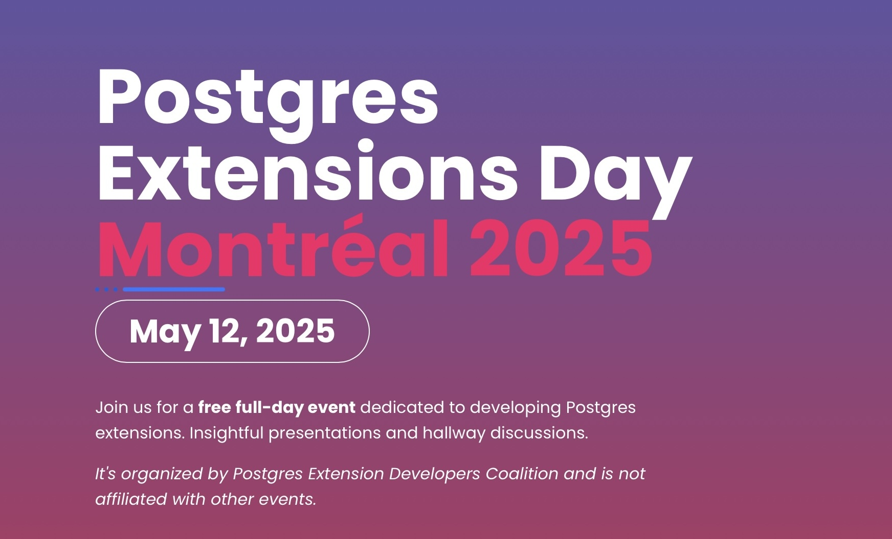
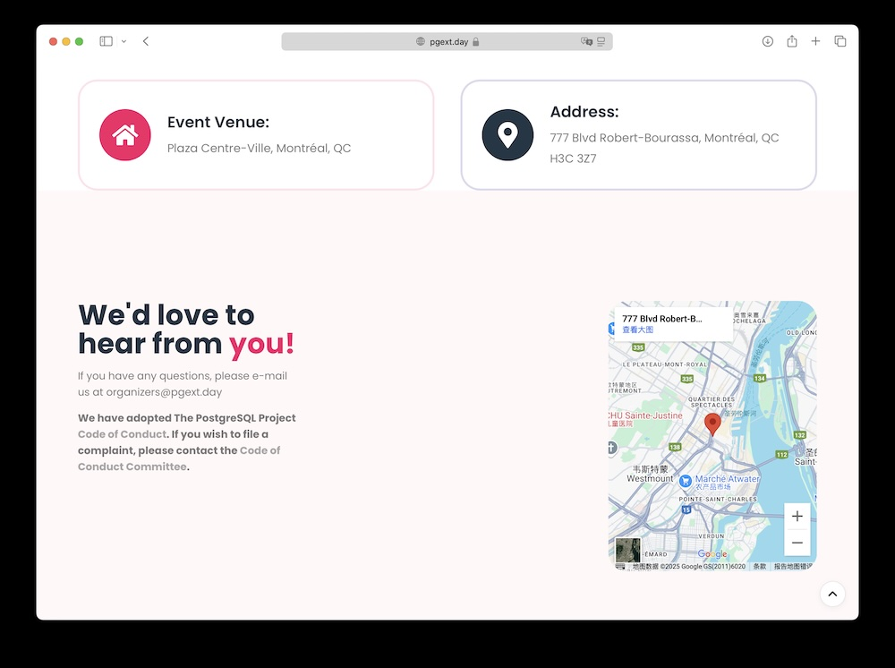

The annual PostgreSQL developer conference will be held in Montreal in May. Like the first PG Con.Dev, there's also an additional dedicated event - Postgres Extensions Day, focusing on all aspects of PG extension development, delivery, and release. The agenda has just been released with 14 sessions scheduled.

This time, I won't just be an audience member - my talk is the first session of the afternoon: "The Missing Postgres Extension Repo and Package Manager". I'll introduce Pigsty's extension repository and the pig package manager, sharing challenges and issues encountered when building and maintaining PG extensions, and sharing experiences, lessons, and insights from Chinese developers and database vendors (solo practitioners, haha) with global developers.

PGEXT DAY is scheduled for May 12, 2025, at the same location as the PG developer conference - Plaza Centre-Ville in Montreal, Quebec, Canada. The extension summit will be immediately followed by the main conference from May 12-16.

[Last year's PG developer conference in Vancouver was incredibly rewarding](https://pigsty.cc/pg/pgcondev-2024/), though there were very few participants from China. Not sure how this edition will be - if you're also going, please leave a comment and we can meet up in person!

If you're interested in PostgreSQL, don't forget to register at [https://pgext.day](https://pgext.day/) - friendly reminder: while PGEXT DAY is an auxiliary event to PGCON Dev, unlike the main conference's 500 CAD ticket, attending pgext.day is free! So if you're coming to the PG developer conference, don't forget about this.

Below is the PG Extension Summit agenda - looking forward to seeing readers at the extension summit!

------

## Extension Summit Schedule

------

### 1. From `pl/v8` to `pl/<any>`: Towards Easier Extension Development

**9:00 am → 25 min**, Hannu Krosing

**From pl/v8 to pl/: towards easier extension development**

[`pg_tle`](https://pigsty.cc/ext/lang/pg_tle/) opens new doors for developers, allowing anyone to write and deploy secure extensions without superuser privileges. It also provides hooks for trusted language functions, such as enforcing password policies. `pl/<any>` further allows using any language to write database functions, thereby implementing extensions. The main approach is writing Language Handlers in JavaScript and leveraging any language transpilable to JavaScript as PostgreSQL's embedded (or "pl/") language.

Examples include:

- **pl/jsonschema**: Based on the AJV JSON Schema validation library, directly converting JSON Schema definitions into runnable validation functions, sometimes far outperforming pg_jsonschema wrapped with Rust + PGRX.
- **pl/wasm**: Running compiled WebAssembly as standard PostgreSQL functions, with compute-intensive code achieving 2-3x native code speed.
- **pl/codelength**: Example handler that converts any source code into a function returning the original code's length.

Future expansions on pl/v8 could include:

- Writing custom FDWs (similar to Python's Multicorn)
- Writing custom logical decoding plugins
- Exposing more hooks and trace points for JavaScript handlers
- Allowing users to directly construct plan trees, even adding new node types or monitoring probes

------

### 2. Upgrade as an Extension

**9:30 am → 25 min**, Andrey Borodin

**Upgrade as an extension**

(No content description available, but the title alone sounds exciting!)

------

### 3. Inlining Postgres Functions: Now and Then

**10:00 am → 25 min**, Paul Jungwirth

**Inlining Postgres Functions, Now and Then**

When PostgreSQL calls user-defined functions (or built-in functions), it might attempt inlining, providing new possibilities for SQL developers and extension authors. This talk will introduce two inlining methods currently used by PostgreSQL (available now) and a patch in development aimed at supporting inlining for most set-returning functions. Your functions can replace themselves with a "plan tree," which the optimizer then merges with other query parts - almost like writing a macro!

------

### 4. Postgres à la Carte: Dynamic Container Images with Your Choice of Extensions

**10:30 am → 25 min**, Alvaro Hernandez

**Postgres à la carte: dynamic container images with your choice of extensions**

When building Postgres container images, required extensions are typically bundled, but security and size concerns prevent packaging all hundreds of available extensions at once. However, different users need vastly different extension combinations, and building dedicated container images for every possible combination would exceed the number of atoms in the universe.

Enter "dynamic OCI (container) images" technology, capable of real-time, on-demand generation of Postgres images containing required extensions. These images can be used in any OCI-compatible environment like Kubernetes.

This talk will explore the concepts and technology behind dynamic container images and how to apply them for loading arbitrary extension combinations into Postgres images. The presentation will feature extensive demonstrations!

------

### 5. Cppgres: One Less Reason to Hate C++

**11:00 am → 25 min**, Yurii Rashkovskii

**Cppgres: One less reason to hate C++**

Writing Postgres extensions in C often feels tedious, error-prone, and repetitive. While many developers avoid C++ due to its complexity, modern C++ offers rich features making it easier to write reliable, maintainable Postgres extensions.

If you're considering switching to Rust, consider C++ first - using the same compiler while enjoying more safety and usability.

This talk will introduce **Cppgres**: a lightweight, header-only C++20 library that streamlines and strengthens Postgres extension safety and readability. Using concepts, automatic type deduction, and other modern C++ techniques, you can write concise, efficient, maintainable extensions. Let's rediscover C++ and make Postgres extensions both safe and enjoyable!

------

### 6. Working with MemoryContexts and Debugging Memory Leaks in Postgres

**11:30 am → 25 min**, Phil Eaton

**Working with MemoryContexts and debugging memory leaks in Postgres**

This talk will focus on creating and switching MemoryContexts in real scenarios, using tools like Linux's eBPF to discover memory leaks. Content is based on real production cases, summarizing experiences and practical techniques from writing extensions and finding bugs.

------

### 7. Postgres as a Control Plane: Challenges in Offloading Compute via Extensions

**12:00 pm → 25 min**, Sweta Vooda

**Postgres as a Control Plane: Challenges in Offloading Compute via Extensions**

As Postgres's role expands from storage layer to control plane, extensions orchestrating external systems (like vector search engines) must balance performance, consistency, and integration.

This talk will explore designing Postgres extensions to offload computation while maintaining SQL simplicity and transactional guarantees. We'll combine real experience from pgvector-remote, diving deep into buffering, predicate pushdown, connection pooling, and VACUUM and other Postgres internals.

Perfect for engineers wanting to offload computation in Postgres while preserving SQL simplicity and performance.

------

### 8. Lunch

**12:30 pm → 60 min**

------

### 9. The Missing Postgres Extension Repo and Package Manager

**1:30 pm → 25 min**, Ruohang Feng

**The Missing Postgres Extension Repo and Package Manager**

> Haha, that's really me.

While PostgreSQL extensions are powerful and flexible, most users prefer "out-of-the-box" rather than compiling and manually building themselves. To address this pain point, I've integrated a unified repository (pigsty.io/ext/list/) packaging 200+ extensions, filling gaps in the official PGDG repository. These RPM/DEB packages support 5 Linux distributions, five major PostgreSQL versions, and x86/ARM architectures - one-stop coverage.

This talk will explore building this repository, including challenges like cross-distribution compatibility, multi-architecture support, version alignment, sharing experiences, lessons, and future improvements to make PostgreSQL extension installation easier.

------

### 10. How to Automatically Release Your Extensions on PGXN

**2:00 pm → 25 min**, David Wheeler

**How to automatically release your extensions on PGXN**

There's currently no unified release center for all PostgreSQL extensions. While PGXN is the largest extension source code release service, it only includes about one-third of public extensions, and some versions aren't current enough.

PGXN aims to become the root registry for all extension versions, hoping to sync all release information downstream to enable automated build processes. To achieve this, developers need to proactively upload extension updates to PGXN, benefiting the entire PostgreSQL community.

This talk will demonstrate setting up release processes on PGXN and achieving automation through Git, JSON, GitHub workflows, keeping your extensions current with one-click publishing to PGXN.

------

### 11. Extending PostgreSQL with Java: Overcoming Development Challenges in Bridging Java and C Applications

**2:30 pm → 25 min**, Cary Huang

**Extending PostgreSQL with Java: Overcoming Development Challenges in Bridging Java and C Application**

Java and C have vastly different design philosophies and memory management approaches. These seemingly opposite languages can work together seamlessly with the right methods to extend C-based PostgreSQL and integrate with Java applications or libraries.

This talk will share the development journey of the **SynchDB** project, which writes C extensions on the PostgreSQL side and integrates Java-version Debezium Embedded, guiding data change streams from MySQL, SQL Server, Oracle, and other sources into PostgreSQL.

We'll dive deep into key challenges and solutions when using both C and Java within one extension, including:

- JNI-based cross-language calls
- The process of embedding Debezium Embedded in C extensions
- Handling memory management and performance overhead
- Architectural integration of two language components
- Best practices for error handling, monitoring, and maintainability

Attendees will learn how to enhance PostgreSQL's logical replication capabilities and master development essentials for fusing C and Java in single extensions.

------

### 12. Rethinking OLAP Architecture: The Journey to pg_mooncake v0.2

**3:00 pm → 25 min**, Cheng Chen

**Rethinking OLAP Architecture: The Journey to pg_mooncake v0.2**

In this talk, we'll explore shortcomings of pg_mooncake v0.1 and major architectural changes made in v0.2. We'll share lessons learned using Postgres replication, background worker processes, and extension-form inter-process communication (IPC).

------

### 13. Spat: Hijacking Shared Memory for a Redis-Like Experience in PostgreSQL

**3:30 pm → 25 min**, Florents Tselai

**Spat: Hijacking Shared Memory for a Redis-Like Experience in PostgreSQL**

Traditional databases typically use shared memory for work areas like query execution, caching, and transaction management - invisible to users. But what if we transformed it into high-performance data structures and caches for direct user use?

This talk will introduce PostgreSQL's shared memory APIs exposed to extension developers (including the new DSM Registry) and how to build **Spat**: an in-memory data structure server storing data entirely in shared memory, providing Redis-like experience within PostgreSQL.

Spat provides key-value storage patterns supporting strings, lists, sets, hashes, and other structures, becoming lightweight, high-speed temporary storage within PostgreSQL. We'll explore challenges and opportunities in this unconventional shared memory usage, providing insights for developers wanting to extend PostgreSQL to new heights.

------

### 14. Scaling PostgreSQL with Citus: Distributed Data for Modern Applications

**4:00 pm → 25 min**, Mehmet Yilmaz

**Scaling PostgreSQL with Citus: Distributed Data for Modern Applications**

This talk will explore how the **Citus** extension transforms PostgreSQL into a horizontally scalable distributed database. We'll delve into Citus architecture, deployment as an extension, and practical production environment applications.

Content includes:

- How Citus extends PostgreSQL to support distributed query processing and data sharding
- Best practices for extension packaging, release, and deployment in different environments
- Considerations for performance tuning and security mechanisms in distributed Postgres cluster operations
- Real success cases and lessons learned

------

### 15. Extensibility - New Options and a Wish List

**4:30 pm → 25 min**, Alastair Turner

**Extensibility - new options and a wish list**

Now is a great time to be a PostgreSQL extension developer - the community continues growing, even spawning dedicated extension summit events.

Meanwhile, Postgres continues opening more extensible areas. Over the past year, several core commits made EXPLAIN, cumulative statistics, COPY, and other parts extensible, but proposals in some areas like storage still await progress.

This talk will introduce recent new extensible areas (with example code) and explore possible improvements and efforts in areas not yet breakthrough, especially storage.

------

### 16. Dinner

**6:00 pm – 9:00 pm**

**Dinner**

------

## Reviewing 2024 PGCon.Dev

- [Andreas Scherbaum PostgreSQL Development Conference 2024 - Review](https://andreas.scherbaum.la/post/2024-06-14_postgresql-development-conference-2024-review/)
- [PgCon 2024 Developer Meeting](https://wiki.postgresql.org/wiki/PgCon_2024_Developer_Meeting)
- [Robert Haas: 2024.pgconf.dev and Growing the Community](https://rhaas.blogspot.com/2024/06/2024pgconfdev-and-growing-community.html)
- [How engaging was PGConf.dev really?](https://peter.eisentraut.org/blog/2024/06/04/how-engaging-was-pgconfdev-really)
- [Cary Huang: PGConf.dev 2024：Shaping PostgreSQL's Future in Vancouver](https://www.highgo.ca/2024/06/11/pgconf-dev-2024-shaping-the-future-of-postgresql-in-vancouver/)
- [PGCon.Dev Extension Ecosystem Summit Notes @ Vancouver](https://mp.weixin.qq.com/s/C0YyE52KbLLbnG1C2FqGRg)
- [PG Conference 2024 Opening, Where's the Vancouver Foodie Travel Group?](https://mp.weixin.qq.com/s/4t1thBCDVS8y9dHiOxPZaA)