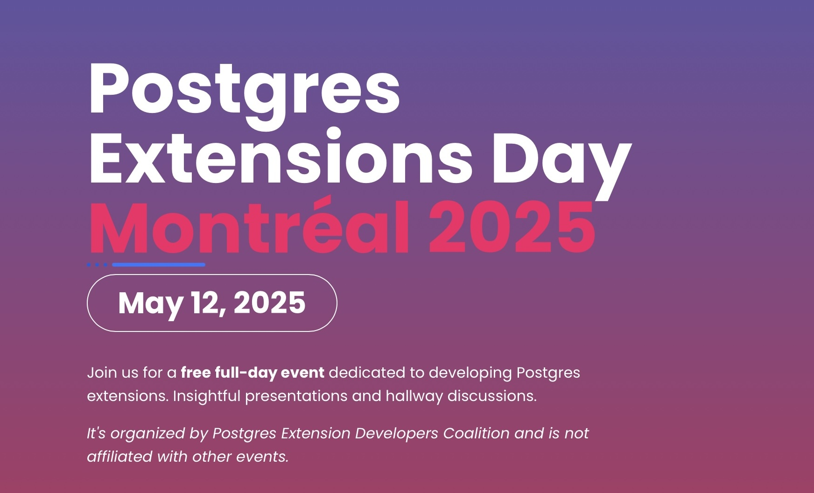
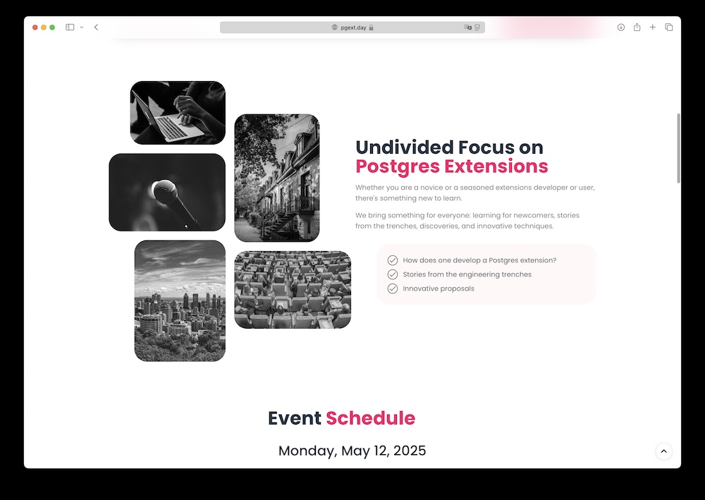
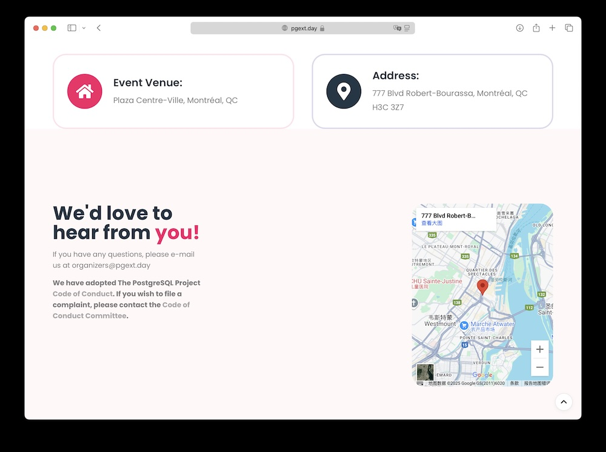
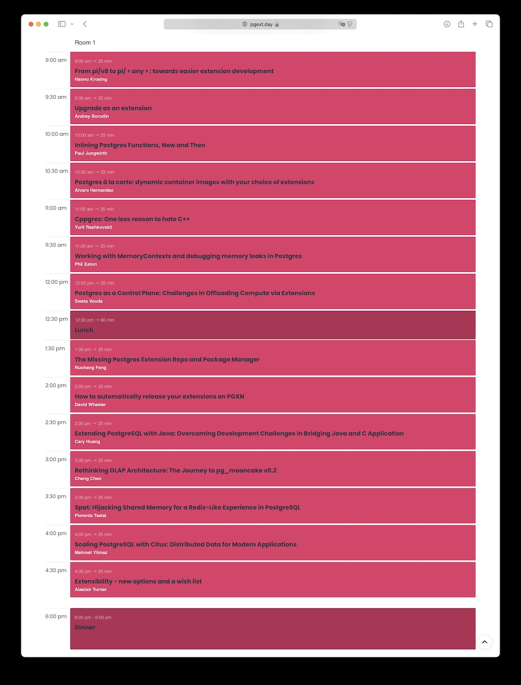

一年一度的 PostgreSQL 开发者大会即将在五月于蒙特利尔举办。同上次第一届 PG Con.Dev 一样，这次也有一天的额外的专场活动 —— Postgres Extensions Day，关注 PG 扩展的开发，交付，发布等方方面面。目前议程刚刚排出来，总共安排了 14 个 Session。

当然这次，我就不当观众了，我的演讲是下午的首场 —— “The Missing Postgres Extension Repo and Package Manager”。即 “PG 生态中长久缺失的扩展仓库与包管理器”。 我会介绍 Pigsty 提供的扩展仓库，以及 pig 包管理器。并分享在构建，维护 PG 扩展时会遇到的挑战与问题，与全球开发者分享中国开发者与数据库厂商（个体户，哈哈）在这方面的工作、教训与经验。

PGEXT DAY 的举办日期是 2025.05.12 日，和 PG 开发者大会在相同的地点 —— 加拿大魁北克省蒙特利尔市，Plaza Centre-Ville。扩展峰会之后紧接着 12 - 16 号就是 PG 大会主会的日程了。

[去年 PG 开发者大会在温哥华举办，参加之后感觉收获满满](https://pigsty.cc/pg/pgcondev-2024/)，可惜来自中国的参加者寥寥无几。不知道这一届怎么样，如果您也会去现场欢迎留言，我们可以在现场碰一碰，线下面基。

如果您对 PostgreSQL 感兴趣，可不要忘了在 [https://pgext.day](https://pgext.day/) 上注册 —— 友情提示，虽然 PGEXT DAY 属于 PGCON Dev 的附属活动，但不同于主会场 500 加币的门票，参加 pgext.day 是不收钱的！所以如果来参加 PG 开发者大会，可不要忘了这个。

下面是 PG 扩展峰会的日程安排，期待在扩展峰会与读者朋友们相见！

------

## 扩展峰会的日程

------

### 1. 从 `pl/v8` 到 `pl/<any>`：迈向更容易的扩展开发

**9:00 am → 25 min**，Hannu Krosing

**From pl/v8 to pl/: towards easier extension development**

[`pg_tle`](https://pigsty.cc/ext/lang/pg_tle/) 为开发者打开了一扇新大门，让任何人都能在无超级用户权限的前提下编写并部署安全的扩展。它还提供一些钩子，供受信任语言的函数使用，例如强制执行密码策略。 而 `pl/<any>` 则进一步允许使用任意语言来编写数据库函数，从而实现扩展。其主要途径是在 JavaScript 中编写 Language Handler，并利用任意可被转译到 JavaScript 的语言，成为 PostgreSQL 的嵌入式（或“pl/”）语言。

示例包括：

- **pl/jsonschema**：基于 AJV JSON Schema 校验库，将 JSON Schema 定义直接变为可运行的校验函数，性能有时远超使用 Rust + PGRX 封装的 pg_jsonchema。
- **pl/wasm**：能以标准 PostgreSQL 函数的方式运行编译后的 WebAssembly，计算密集型代码速度可接近原生代码的 2-3 倍。
- **pl/codelength**：示例性 Handler，把任何源代码变成一个返回原代码长度的函数。

未来还可在 pl/v8 基础上进一步拓展，例如：

- 编写自定义 FDW（类似 Python 里 Multicorn）
- 编写自定义逻辑解码插件
- 暴露更多钩子和跟踪点，以便在 JavaScript 中添加 Handler
- 让用户可直接构造计划树，甚至增加新的节点类型或监控探针

------

### 2. 将大版本升级封装成一个扩展

**9:30 am → 25 min**，Andrey Borodin

**Upgrade as an extension**

（暂无内容介绍，但这个标题看上去就很 Excited！）

------

### 3. 内联 Postgres 函数：现在与未来

**10:00 am → 25 min**，Paul Jungwirth

**Inlining Postgres Functions, Now and Then**

当 PostgreSQL 调用用户定义函数（或内置函数）时，可能会尝试进行内联，这为 SQL 开发者与扩展作者提供了新的可能性。本次分享将介绍 PostgreSQL 目前使用的两种内联方式（你现在就能用），以及一个正在开发中的补丁，旨在支持对大多数返回集函数进行内联。你的函数可用一个“计划树”自身替换，之后优化器会将它和查询中的其他部分融合在一起，这几乎就像写一个宏一样！

------

### 4. Postgres 点菜：自选扩展的动态容器镜像

**10:30 am → 25 min**，Alvaro Hernandez

**Postgres à la carte: dynamic container images with your choice of extensions**

在构建 Postgres 容器镜像时，通常需要捆绑所需扩展，但出于安全与体积考虑，不可能把所有数以百计的可用扩展一次性打包进去。 然而，不同用户需要的扩展组合又极其多样，如果为每一种可能组合都构建专属容器镜像，数量恐怕会超过宇宙中的原子数。

于是，“动态 OCI（容器）镜像”技术应运而生，可在实时、即时构建阶段，生成包含所需扩展的 Postgres 镜像。这些镜像可在 Kubernetes 等任何兼容 OCI 的环境中使用。

本次演讲将探讨动态容器镜像背后的理念与技术，以及如何应用它来为 Postgres 镜像加载任意扩展组合。演讲中会穿插大量演示！

------

### 5. Cppgres：少一个讨厌 C++ 的理由

**11:00 am → 25 min**，Yurii Rashkovskii

**Cppgres: One less reason to hate C++**

用 C 写 Postgres 扩展常常令人感觉繁琐、易错又重复度高。虽然很多开发者因为 C++ 的复杂性而对其敬而远之，但现代 C++ 拥有丰富特性，可让我们更轻松地编写可靠、易维护的 Postgres 扩展。

如果你还在考虑转投 Rust，不妨先看看 C++——只需沿用同样的编译器，也能享受到更多安全性与易用性。

本次分享将介绍 **Cppgres**：一个轻量级、仅含头文件的 C++20 库，能精简并强化 Postgres 扩展的安全性与可读性。借助概念、自动类型推导等现代 C++ 技巧，你能写出简洁、高效且可维护的扩展。让我们重新认识 C++，一起让 Postgres 扩展既安全又快乐！

------

### 6. 使用 MemoryContext 并调试 Postgres 中的内存泄漏

**11:30 am → 25 min**，Phil Eaton

**Working with MemoryContexts and debugging memory leaks in Postgres**

本次演讲将聚焦如何在实际场景中创建与切换 MemoryContext，并借助 Linux 的 eBPF 等工具来发现内存泄漏。内容基于生产环境中的真实案例，总结了在编写扩展并寻找 Bug 过程中的经验与实用技巧。

------

### 7. 作为控制平面的 Postgres：使用扩展卸载计算的挑战

**12:00 pm → 25 min**，Sweta Vooda

**Postgres as a Control Plane: Challenges in Offloading Compute via Extensions**

随着 Postgres 的角色从存储层扩展到控制平面，用于编排外部系统（例如向量搜索引擎）的扩展时，需要在性能、一致性与集成之间做好平衡。

本次分享将探讨如何设计 Postgres 扩展以卸载计算，并保持 SQL 简单性与事务保证。我们将结合 pgvector-remote 的实际经验，深入探讨缓冲、谓词下推、连接池及 VACUUM 等 Postgres 内部机制。

非常适合希望在 Postgres 中卸载计算，又想保留 SQL 简单性与性能的工程师。

------

### 8. 午餐

**12:30 pm → 60 min**

------

### 9. 缺失的 Postgres 扩展仓库与包管理器

**1:30 pm → 25 min**，Ruohang Feng

**The Missing Postgres Extension Repo and Package Manager**

> 哈哈，真的是我。

尽管 PostgreSQL 扩展功能强大又灵活，大多数用户还是希望“开箱即用”，而非自己编译与手动构建。为解决这一痛点，我整合了一个统一的仓库（pigsty.io/ext/list/），打包了 200+ 扩展，补足了官方 PGDG 仓库的缺口。这些 RPM/DEB 包支持 5 个 Linux 发行版、五个主流 PostgreSQL 版本以及 x86 与 ARM 架构，一站式覆盖。

本次分享将探讨如何构建这一仓库，包括跨发行版兼容、多架构支持、版本对齐等挑战，并分享经验教训及未来改进方向，让 PostgreSQL 扩展安装更轻松。

------

### 10. 如何自动在 PGXN 上发布你的扩展

**2:00 pm → 25 min**，David Wheeler

**How to automatically release your extensions on PGXN**

当前还没有一个所有 PostgreSQL 扩展的统一发布中心。PGXN 虽是目前最大的扩展源代码发布服务，但它仅收录了大约三分之一的公开扩展，且有些版本并不够新。

PGXN 致力于成为所有扩展版本的根注册中心，未来希望将所有发布信息同步给下游，以便自动化构建流程。要实现这一点，需要开发者主动将更新扩展上传至 PGXN，从而惠及整个 PostgreSQL 社区。

本次演讲将演示如何在 PGXN 上设置发布流程，以及通过 Git、JSON、GitHub workflows 等实现自动化，让你的扩展保持最新，一键发布到 PGXN。

------

### 11. 用 Java 扩展 PostgreSQL：克服 Java 与 C 应用交互的开发挑战

**2:30 pm → 25 min**，Cary Huang

**Extending PostgreSQL with Java: Overcoming Development Challenges in Bridging Java and C Application**

Java 和 C 两种语言设计理念与内存管理方式迥异。看似南辕北辙的两种语言，若掌握正确方法，依然可以配合得天衣无缝，一同扩展基于 C 的 PostgreSQL，并与 Java 应用或库联动。

本次演讲将分享 **SynchDB** 项目的开发历程，该项目通过在 PostgreSQL 端编写 C 扩展、并集成 Java 版 Debezium Embedded，引导来自 MySQL、SQL Server、Oracle 等多种源的数据变更流入 PostgreSQL。

我们将深入探讨在一个扩展内同时使用 C 与 Java 时面临的关键挑战与解决方案，包括：

- 基于 JNI 的跨语言调用
- 将 Debezium Embedded 嵌入 C 扩展的过程
- 内存管理与性能开销的应对
- 如何在架构层面整合 2 种语言组件
- 错误处理、监控及可维护性最佳实践

听众将了解如何增强 PostgreSQL 在逻辑复制方面的能力，并学到在单一扩展中融合 C 与 Java 的开发要领。

------

### 12. 重新思考 OLAP 架构：pg_mooncake v0.2 的历程

**3:00 pm → 25 min**，Cheng Chen

**Rethinking OLAP Architecture: The Journey to pg_mooncake v0.2**

在本次演讲中，我们将探讨 pg_mooncake v0.1 所存在的不足，以及在 v0.2 中所做的主要架构变更。我们还会分享在使用 Postgres 复制、后台工作进程及扩展形式的进程间通信（IPC）过程中所获得的经验教训。

------

### 13. Spat：劫持共享内存，在 PostgreSQL 中获得类 Redis 的使用体验

**3:30 pm → 25 min**，Florents Tselai

**Spat: Hijacking Shared Memory for a Redis-Like Experience in PostgreSQL**

传统数据库常把共享内存用于查询执行、缓存与事务管理等工作区，对用户不可见。但如果我们把它改造成可供用户直接使用的高性能数据结构和缓存又会怎样？

本次分享将介绍 PostgreSQL 向扩展开发者开放的共享内存 API（包括新的 DSM Registry），以及如何构建 **Spat**：一个把数据完全存储在共享内存、可在 PostgreSQL 内部提供类 Redis 体验的内存数据结构服务器。

Spat 提供类似键值存储的模式，支持字符串、列表、集合、哈希等结构，成为 PostgreSQL 内部轻量且高速的临时存储方案。 我们会探讨在这种超出传统范畴的共享内存用法中遇到的种种挑战与机遇，为有意将 PostgreSQL 扩展到新高度的开发者提供思路。

------

### 14. 使用 Citus 扩容 PostgreSQL：为现代应用而生的分布式数据

**4:00 pm → 25 min**，Mehmet Yilmaz

**Scaling PostgreSQL with Citus: Distributed Data for Modern Applications**

本次演讲将探讨 **Citus** 扩展如何将 PostgreSQL 演变为可横向扩展的分布式数据库。我们会深入介绍 Citus 的架构、作为扩展的部署方式，以及实际生产环境中的应用要点。

内容包括：

- Citus 如何将 PostgreSQL 扩展为支持分布式查询处理与数据分片
- 扩展打包、发布及在不同环境部署的最佳实践
- 在分布式 Postgres 集群的运维中，性能调优与安全机制的思考
- 成功落地的真实案例和经验教训

------

### 15. 扩展能力：新选项与愿望清单

**4:30 pm → 25 min**，Alastair Turner

**Extensibility - new options and a wish list**

当下是成为 PostgreSQL 扩展开发者的好时机——社区不断壮大，甚至出现了专门的扩展峰会活动。

同时，Postgres 也在持续开放更多可扩展领域。过去一年里，一些核心提交让 EXPLAIN、累计统计、COPY 等部分也具备可扩展性，但在存储等少数领域上，相关提案仍待推进。

本次分享将带你了解近期新的可扩展领域（附示例代码），并探讨在那些尚未突破的领域（尤其存储）上可能的改进与努力方向。

------

### 16. 晚餐

**6:00 pm – 9:00 pm**

**Dinner**

------

## 回顾 2024 年 PGCon.Dev

- [Andreas Scherbaum PostgreSQL Development Conference 2024 - Review](https://andreas.scherbaum.la/post/2024-06-14_postgresql-development-conference-2024-review/)
- [PgCon 2024 Developer Meeting](https://wiki.postgresql.org/wiki/PgCon_2024_Developer_Meeting)
- [Robert Haas: 2024.pgconf.dev and Growing the Community](https://rhaas.blogspot.com/2024/06/2024pgconfdev-and-growing-community.html)
- [How engaging was PGConf.dev really?](https://peter.eisentraut.org/blog/2024/06/04/how-engaging-was-pgconfdev-really)
- [Cary Huang: PGConf.dev 2024：在温哥华塑造 PostgreSQL 的未来](https://www.highgo.ca/2024/06/11/pgconf-dev-2024-shaping-the-future-of-postgresql-in-vancouver/)
- [PGCon.Dev 扩展生态峰会小记 @ 温哥华](https://mp.weixin.qq.com/s/C0YyE52KbLLbnG1C2FqGRg)
- [PG大会2024开幕，温哥华饭搭子驴友团呢？](https://mp.weixin.qq.com/s/4t1thBCDVS8y9dHiOxPZaA)

